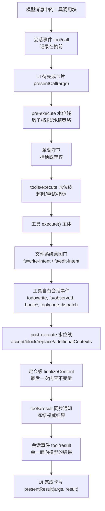
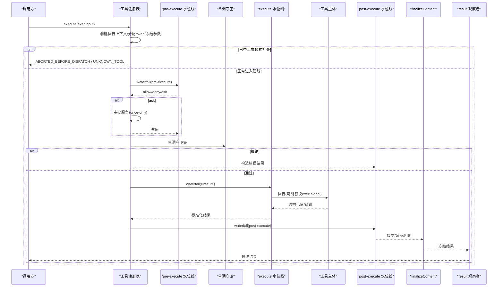
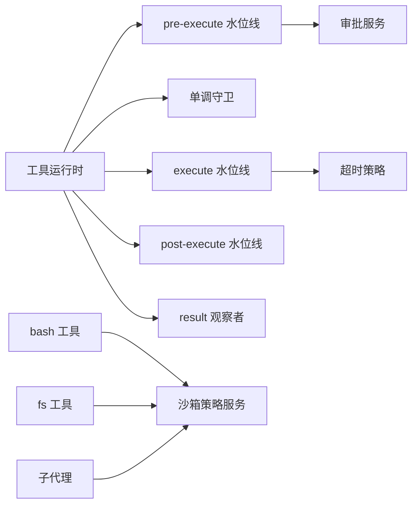
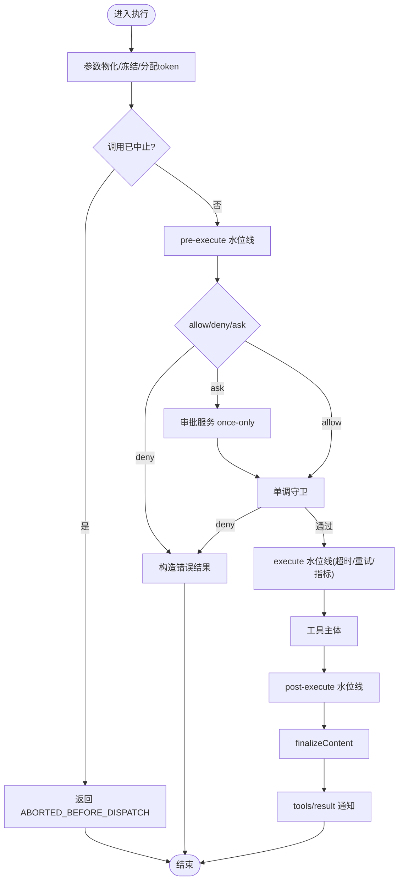

# 执行管道

<cite>
**本文引用的文件列表**
- [packages/core/tools/src/index.ts](file://packages/core/tools/src/index.ts)
- [docs/tool-execution-pipeline.md](file://docs/tool-execution-pipeline.md)
- [docs/subsystems/tools.md](file://docs/subsystems/tools.md)
- [packages/guard/timeout-policy/src/index.ts](file://packages/guard/timeout-policy/src/index.ts)
- [packages/shell/tool-bash/src/index.ts](file://packages/shell/tool-bash/src/index.ts)
- [packages/sandbox/sandbox-policy/src/index.ts](file://packages/sandbox/sandbox-policy/src/index.ts)
- [docs/subsystems/sandbox.md](file://docs/subsystems/sandbox.md)
- [packages/fs/tool-fs/src/sandbox.ts](file://packages/fs/tool-fs/src/sandbox.ts)
- [packages/core/tools/tests/code-mode.spec.ts](file://packages/core/tools/tests/code-mode.spec.ts)
- [packages/core/tools/tests/tools.spec.ts](file://packages/core/tools/tests/tools.spec.ts)
- [packages/core/tools/tests/invariant.spec.ts](file://packages/core/tools/tests/invariant.spec.ts)
- [packages/core/tools/tests/execution-signal-types.spec.ts](file://packages/core/tools/tests/execution-signal-types.spec.ts)
- [packages/guard/timeout-policy/tests/timeout-policy.spec.ts](file://packages/guard/timeout-policy/tests/timeout-policy.spec.ts)
- [packages/shell/tool-bash/tests/tools.spec.ts](file://packages/shell/tool-bash/tests/tools.spec.ts)
- [packages/subagent/subagent/src/child-agent.ts](file://packages/subagent/subagent/src/child-agent.ts)
</cite>

## 目录
1. [简介](#简介)
2. [项目结构](#项目结构)
3. [核心组件](#核心组件)
4. [架构总览](#架构总览)
5. [详细组件分析](#详细组件分析)
6. [依赖关系分析](#依赖关系分析)
7. [性能考量](#性能考量)
8. [故障排查指南](#故障排查指南)
9. [结论](#结论)
10. [附录](#附录)

## 简介
本文件系统化说明工具执行的完整生命周期：从参数接收、类型校验，到权限检查、沙箱隔离、实际执行与结果后处理；并覆盖执行信号（中断、超时、错误传播）、上下文管理与状态传递、配置选项与扩展点、性能监控与调试方法，以及并发执行与资源管理最佳实践。目标是让读者在不深入源码的情况下也能准确理解“工具执行管道”的设计与行为。

## 项目结构
工具执行管道位于核心工具注册与调度层，围绕“可插拔的水位线（waterfall）+单调守卫 + 定义级最终化 + 最终通知”的机制组织。关键位置包括：
- 工具注册与执行入口：核心工具运行时
- 预执行阶段：策略、审批、沙箱策略解析
- 执行阶段：超时包装、重试、指标采集等环绕逻辑
- 后处理阶段：结果接受/替换/阻断、附加上下文注入
- 最终化与通知：内容最终化、不可变结果观察

图表来源
- [docs/tool-execution-pipeline.md:8-58](file://docs/tool-execution-pipeline.md#L8-L58)
- [docs/subsystems/tools.md:170-405](file://docs/subsystems/tools.md#L170-L405)

章节来源
- [docs/tool-execution-pipeline.md:1-63](file://docs/tool-execution-pipeline.md#L1-L63)
- [docs/subsystems/tools.md:1-100](file://docs/subsystems/tools.md#L1-L100)

## 核心组件
- 工具定义与注册表：声明参数/输出 schema、execute、可选 finalizeContent、presentCall/presentResult、timeoutMs、isConcurrencySafe 等元数据。注册表负责将定义投影为模型可见的 ToolSchema，并在执行时维护不可变执行上下文与结果。
- 执行上下文与令牌：每个调用在进入管线前会生成唯一 token，参数被一次性物化并冻结，身份字段只读，signal 仅在 around-dispatch 阶段可替换。
- 水位线与守卫：
  - tools/pre-execute：允许/拒绝/询问（ask），结合审批服务决定放行与否。
  - 单调守卫：仅能降级（返回拒绝原因），不能恢复已拒绝的调用。
  - tools/execute：用于超时、重试、指标等“环绕调度”。
  - tools/post-execute：接受/替换/阻断结果，并可追加 additionalContexts。
- 最终化与通知：finalizeContent 对最终内容进行最后一次纯变换；tools/result 提供冻结的最终结果快照供观测。
- 沙箱策略：按会话与显式批准模式解析工作区根与能力模式，bash/fs 等能力消费该策略进行隔离。

章节来源
- [docs/subsystems/tools.md:9-152](file://docs/subsystems/tools.md#L9-L152)
- [docs/subsystems/tools.md:170-405](file://docs/subsystems/tools.md#L170-L405)
- [packages/core/tools/src/index.ts:1364-1450](file://packages/core/tools/src/index.ts#L1364-L1450)
- [packages/sandbox/sandbox-policy/src/index.ts:112-154](file://packages/sandbox/sandbox-policy/src/index.ts#L112-L154)

## 架构总览
下图展示了从进入执行到最终结果发布的端到端流程，标注了各阶段的职责与异常路径。

图表来源
- [packages/core/tools/src/index.ts:1342-1500](file://packages/core/tools/src/index.ts#L1342-L1500)
- [packages/core/tools/src/index.ts:1601-1621](file://packages/core/tools/src/index.ts#L1601-L1621)
- [docs/subsystems/tools.md:170-405](file://docs/subsystems/tools.md#L170-L405)

## 详细组件分析

### 参数接收与类型验证
- 参数物化与冻结：进入管线前，参数会被 JSON 序列化快照并深冻结，确保后续所有阶段看到一致且不可变的输入。非 JSON 可序列化输入直接失败。
- Schema 校验：工具定义携带 output.schema 与参数 schema，由 defineTool/注册表在注册期与执行期联合校验；不匹配抛出工具参数错误，走标准错误路径。
- 代码模式下的子调用：Code Mode 的子调用继承父 token，记录 tool/code-dispatch，并将拒绝作为绑定拒绝返回，且不注入 additionalContexts，以保持调用/结果相邻性。

章节来源
- [packages/core/tools/src/index.ts:1364-1450](file://packages/core/tools/src/index.ts#L1364-L1450)
- [docs/subsystems/tools.md:98-152](file://docs/subsystems/tools.md#L98-L152)
- [docs/subsystems/tools.md:255-281](file://docs/subsystems/tools.md#L255-L281)

### 权限检查与审批
- pre-execute 水位线：支持 allow/deny/ask。若 ask，则通过审批服务获取 once-only 授权；缺失审批通道或服务、无 agent 请求均规范化为拒绝。
- 单调守卫：在 pre-execute 之后运行，只能拒绝或弃权，无法恢复已被拒绝的调用。
- 审批与沙箱策略联动：bash/fs 等能力在执行前解析沙箱策略，必要时触发升级审批（如 workspace-write/danger-full-access）。

章节来源
- [packages/core/tools/src/index.ts:1463-1500](file://packages/core/tools/src/index.ts#L1463-L1500)
- [packages/fs/tool-fs/src/sandbox.ts:95-108](file://packages/fs/tool-fs/src/sandbox.ts#L95-L108)
- [packages/shell/tool-bash/src/index.ts:190-200](file://packages/shell/tool-bash/src/index.ts#L190-L200)
- [docs/subsystems/tools.md:376-405](file://docs/subsystems/tools.md#L376-L405)

### 沙箱隔离
- 策略解析：SandboxPolicyService 根据会话与显式批准模式解析 mode 与 workspaceRoot，默认回退到部署默认值。
- 能力集成：bash 与 fs 在执行前消费策略，必要时发起升级审批；未挂载沙箱策略但需要限制时会报错。
- 子代理继承：子代理在委派边界捕获父会话的沙箱覆盖与审批策略（子代理审批固定为 never），保证子代理在委派时的边界内运行。

章节来源
- [packages/sandbox/sandbox-policy/src/index.ts:112-154](file://packages/sandbox/sandbox-policy/src/index.ts#L112-L154)
- [docs/subsystems/sandbox.md:67-94](file://docs/subsystems/sandbox.md#L67-L94)
- [packages/shell/tool-bash/tests/tools.spec.ts:579-606](file://packages/shell/tool-bash/tests/tools.spec.ts#L579-L606)
- [packages/subagent/subagent/src/child-agent.ts:177-204](file://packages/subagent/subagent/src/child-agent.ts#L177-L204)

### 实际执行与结果后处理
- execute 水位线：用于超时、重试、指标等“环绕调度”，可替换 exec.signal，但必须恢复上游 signal，避免污染 post-execute。
- post-execute 水位线：接受/替换/阻断结果，可追加 additionalContexts；阻断会将纠正反馈转为错误结果。
- 最终化：定义级的 finalizeContent 是最后一次纯内容变换，必须在成功之前调用一次；随后结果被冻结并通过 tools/result 通知。

章节来源
- [packages/core/tools/src/index.ts:1601-1621](file://packages/core/tools/src/index.ts#L1601-L1621)
- [docs/subsystems/tools.md:376-405](file://docs/subsystems/tools.md#L376-L405)

### 执行信号处理：中断、超时与错误传播
- 信号契约：
  - pre/post/result 观察者看到的是只读 signal，不可替换或删除。
  - execute 水位线可替换 signal，但必须恢复上游 caller signal。
- 超时：
  - 工具可声明 timeoutMs；超时策略在 execute 水位线中生效，向工具体暴露派生 deadline signal；若超时，返回结构化超时结果。
  - 超时策略在 finally 中恢复上游 signal，确保 post-execute 仍看到原始 caller signal。
- 中断：
  - 若调用在进入管线前已中止，直接返回 ABORTED_BEFORE_DISPATCH，不进入任何阶段。
  - 已进入调用的中止会在合适时机替换成功结果为 ABORTED；已启动的工作仍会排空并可能保留工具自身结构化错误。
- 错误传播：
  - 未知工具、抛出的工具、监听器异常均被规范化为结构化错误结果，不会中断外层循环。

章节来源
- [packages/core/tools/tests/execution-signal-types.spec.ts:41-77](file://packages/core/tools/tests/execution-signal-types.spec.ts#L41-L77)
- [packages/guard/timeout-policy/src/index.ts:61-81](file://packages/guard/timeout-policy/src/index.ts#L61-L81)
- [packages/guard/timeout-policy/tests/timeout-policy.spec.ts:48-95](file://packages/guard/timeout-policy/tests/timeout-policy.spec.ts#L48-L95)
- [packages/core/tools/tests/code-mode.spec.ts:1140-1172](file://packages/core/tools/tests/code-mode.spec.ts#L1140-L1172)
- [packages/core/tools/tests/code-mode.spec.ts:1510-1532](file://packages/core/tools/tests/code-mode.spec.ts#L1510-L1532)
- [packages/core/tools/tests/tools.spec.ts:1510-1612](file://packages/core/tools/tests/tools.spec.ts#L1510-L1612)

### 执行上下文管理与状态传递
- 执行令牌：每个调用分配唯一 token，嵌套调用仅以父 token 形式传递，便于关联而不暴露可变状态。
- 上下文延迟注入：工具可通过 deferContext 在结果到达外层后再注入上下文，保持调用/结果相邻性。
- 结论标记：concludeTurn 可将当前成功结果标记为本轮终止，复合工具转发嵌套成功的结论标记。
- 不可变性：执行对象在 result 前被冻结，确保审计、UI、工具对“执行了什么”达成一致。

章节来源
- [docs/subsystems/tools.md:170-241](file://docs/subsystems/tools.md#L170-L241)
- [docs/subsystems/tools.md:283-312](file://docs/subsystems/tools.md#L283-L312)
- [packages/core/tools/src/index.ts:1364-1450](file://packages/core/tools/src/index.ts#L1364-L1450)

### 配置选项与自定义扩展点
- 工具定义配置：
  - parameters/output：参数与输出的 JSON Schema。
  - timeoutMs：协作式超时预算（毫秒）。
  - isConcurrencySafe：声明是否可与兄弟调用并行。
  - presentCall/presentResult：UI 呈现钩子。
  - finalizeContent：最终内容变换。
- 管线扩展点：
  - tools/pre-execute：权限/审批/沙箱策略前置。
  - 单调守卫：最终拒绝权。
  - tools/execute：超时/重试/指标等环绕。
  - tools/post-execute：结果接受/替换/阻断/附加上下文。
  - tools/result：最终结果观察。
  - tools/code-dispatch-log：Code Mode 子调度的日志内容替换。
- 沙箱策略配置：
  - 默认模式与工作区根；会话级覆盖；显式批准模式优先级最高。

章节来源
- [docs/subsystems/tools.md:9-152](file://docs/subsystems/tools.md#L9-L152)
- [docs/subsystems/tools.md:459-468](file://docs/subsystems/tools.md#L459-L468)
- [docs/subsystems/tools.md:576-721](file://docs/subsystems/tools.md#L576-L721)
- [docs/subsystems/sandbox.md:67-94](file://docs/subsystems/sandbox.md#L67-L94)

### 性能监控与调试
- 指标与耗时：在 tools/execute 水位线中插入计时与指标收集，注意在 finally 中恢复 signal 并正确收尾。
- 日志与回放：
  - tool/call 与 tool/result 持久化事件，配合 UI 的 pending/completed 卡片。
  - Code Mode 的 tool/code-dispatch 事件可被 listeners 替换日志内容（不影响程序值与模型可见结果）。
- 断点与快照：
  - 执行对象在 result 前冻结，便于安全快照。
  - 参数与结果均为 lossless-JSON，便于重放与比对。

章节来源
- [docs/tool-execution-pipeline.md:4-60](file://docs/tool-execution-pipeline.md#L4-L60)
- [docs/subsystems/tools.md:576-721](file://docs/subsystems/tools.md#L576-L721)

### 并发执行与资源管理最佳实践
- 并发策略：
  - 工具通过 isConcurrencySafe(args) 声明是否可与兄弟调用并行；只有显式 true 才加入并行池，否则独占。
  - 注册表基于 executionMode 形成独占屏障与滚动池并行。
- 资源清理：
  - 工具体必须观察 exec.signal 并在取消时尽快达到静默；around-dispatch 包装需恢复上游 signal。
  - 异步监听器也需观察信号并在 settle 后正确处理取消。
- 顺序与一致性：
  - 尽管并发执行，会话日志与模型历史按调用顺序提交结果，保证一致性。

章节来源
- [docs/subsystems/tools.md:62-74](file://docs/subsystems/tools.md#L62-L74)
- [docs/subsystems/tools.md:243-255](file://docs/subsystems/tools.md#L243-L255)
- [packages/core/tools/tests/code-mode.spec.ts:473-507](file://packages/core/tools/tests/code-mode.spec.ts#L473-L507)

## 依赖关系分析
- 工具运行时依赖：
  - 审批服务（可选）：用于 ask 决策。
  - 沙箱策略服务：为 bash/fs 等能力提供 per-call 策略。
  - 系统提示上下文：注入 sandbox:policy 上下文，使模型感知当前能力边界。
- 扩展点耦合：
  - 超时策略通过 tools/execute 注入，不侵入工具实现。
  - 日志与 UI 通过 tools/result、code-dispatch-log 解耦。
- 子代理与策略继承：
  - 子代理在委派边界捕获父会话的沙箱覆盖与审批策略，确保边界稳定。

图表来源
- [packages/core/tools/src/index.ts:1342-1500](file://packages/core/tools/src/index.ts#L1342-L1500)
- [packages/guard/timeout-policy/src/index.ts:61-81](file://packages/guard/timeout-policy/src/index.ts#L61-L81)
- [packages/sandbox/sandbox-policy/src/index.ts:112-154](file://packages/sandbox/sandbox-policy/src/index.ts#L112-L154)
- [packages/subagent/subagent/src/child-agent.ts:177-204](file://packages/subagent/subagent/src/child-agent.ts#L177-L204)

章节来源
- [packages/core/tools/src/index.ts:1342-1500](file://packages/core/tools/src/index.ts#L1342-L1500)
- [packages/sandbox/sandbox-policy/src/index.ts:112-154](file://packages/sandbox/sandbox-policy/src/index.ts#L112-L154)

## 性能考量
- 最小化阻塞：工具体应尽快响应取消信号，避免长时间持有锁或阻塞 I/O。
- 合理声明并发：仅对真正安全的操作声明 isConcurrencySafe=true，减少不必要的竞争。
- 指标与采样：在 execute 水位线中插入轻量指标，避免过度开销。
- 结果物化成本：finalizeContent 与 render 应为纯函数，避免重复计算。

[本节为通用指导，不直接分析具体文件]

## 故障排查指南
- 常见错误与定位：
  - 未知工具：名称不在可见范围内或被 code 模式折叠，返回 UNKNOWN_TOOL。
  - 参数不合法：参数 schema 校验失败，走工具参数错误路径。
  - 超时：工具声明 timeoutMs 但未及时响应取消，返回结构化超时。
  - 权限不足：pre-execute 或守卫拒绝，查看拒绝原因。
  - 沙箱策略缺失：bash 等能力需要沙箱策略服务，缺失时报错。
- 调试建议：
  - 订阅 tools/result 观察最终冻结结果。
  - 使用 code-dispatch-log 替换子调度的日志内容以便追踪。
  - 在 execute 水位线中打印耗时与信号状态，确认信号恢复是否正确。

章节来源
- [packages/core/tools/tests/invariant.spec.ts:40-70](file://packages/core/tools/tests/invariant.spec.ts#L40-L70)
- [packages/shell/tool-bash/tests/tools.spec.ts:579-606](file://packages/shell/tool-bash/tests/tools.spec.ts#L579-L606)
- [packages/guard/timeout-policy/tests/timeout-policy.spec.ts:48-95](file://packages/guard/timeout-policy/tests/timeout-policy.spec.ts#L48-L95)

## 结论
工具执行管道通过“水位线 + 守卫 + 最终化 + 通知”的分层设计，实现了可扩展、可观测、可组合的执行环境。参数与结果严格不可变，信号贯穿全链路，权限与沙箱策略在恰当阶段介入，既保证了安全性，又提供了丰富的扩展点。通过合理的并发声明与资源管理，可在复杂场景下保持稳定与高性能。

[本节为总结，不直接分析具体文件]

## 附录
- 关键流程图（算法视角）

图表来源
- [packages/core/tools/src/index.ts:1342-1500](file://packages/core/tools/src/index.ts#L1342-L1500)
- [packages/core/tools/src/index.ts:1601-1621](file://packages/core/tools/src/index.ts#L1601-L1621)
- [docs/subsystems/tools.md:170-405](file://docs/subsystems/tools.md#L170-L405)