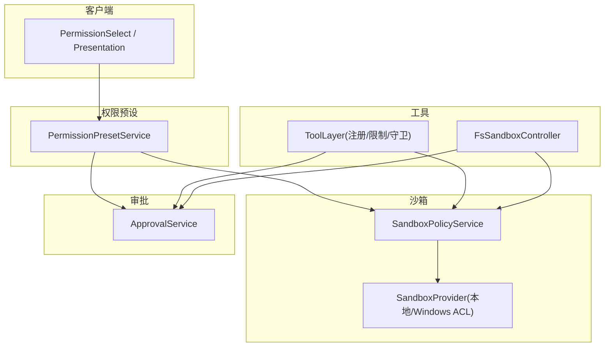
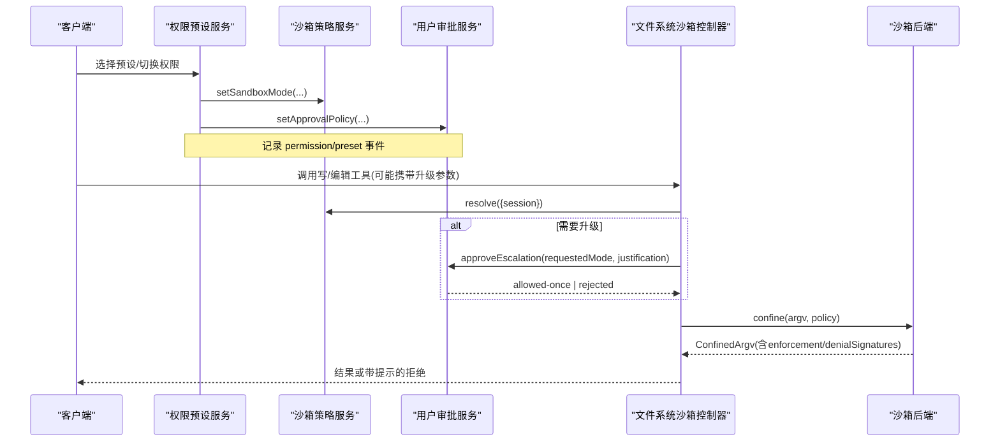
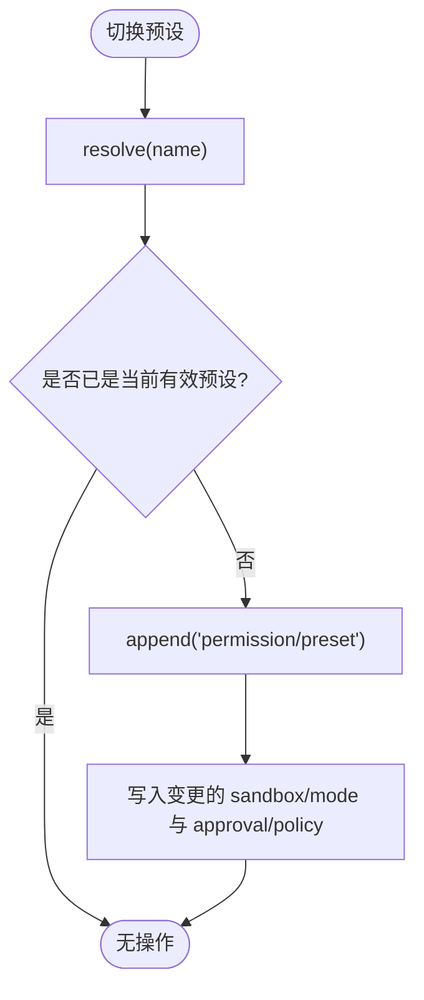
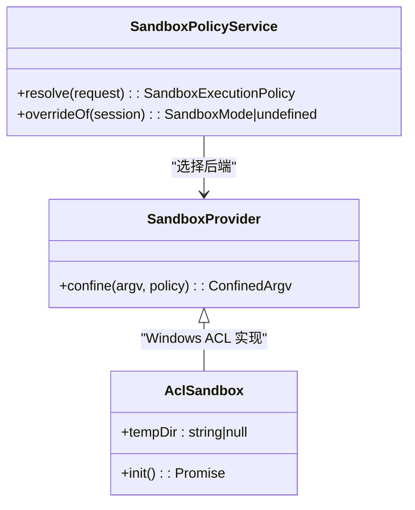
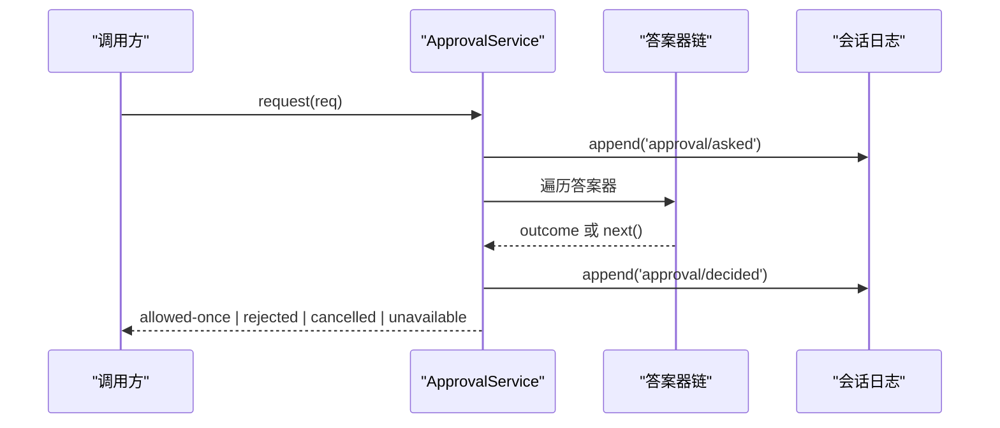
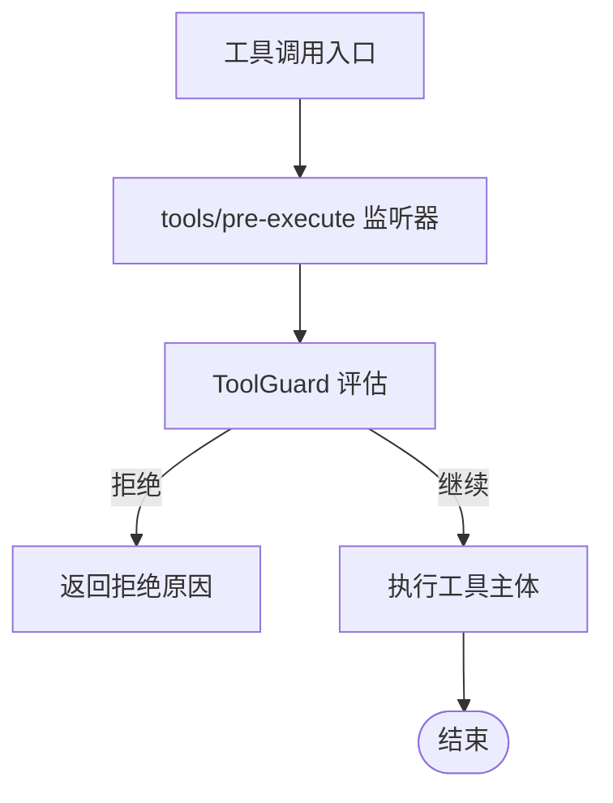
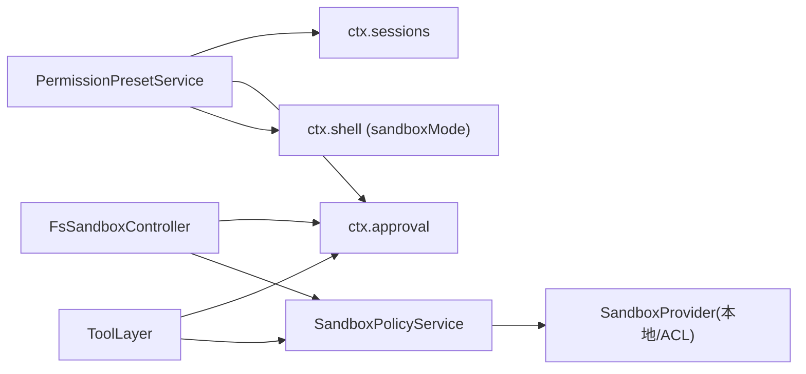

# 权限控制

<cite>
**本文引用的文件**
- [packages/interaction/permission-presets/src/index.ts](file://packages/interaction/permission-presets/src/index.ts)
- [docs/subsystems/permission-presets.md](file://docs/subsystems/permission-presets.md)
- [docs/subsystems/sandbox.md](file://docs/subsystems/sandbox.md)
- [docs/subsystems/approval.md](file://docs/subsystems/approval.md)
- [packages/fs/tool-fs/src/sandbox.ts](file://packages/fs/tool-fs/src/sandbox.ts)
- [packages/core/tools/src/index.ts](file://packages/core/tools/src/index.ts)
- [packages/sandbox/sandbox-windows-acl/src/index.ts](file://packages/sandbox/sandbox-windows-acl/src/index.ts)
- [packages/sandbox/sandbox-windows-acl/src/acl.ts](file://packages/sandbox/sandbox-windows-acl/src/acl.ts)
- [packages/client/ui-permission-presets/src/client/presentation.ts](file://packages/client/ui-permission-presets/src/client/presentation.ts)
- [packages/client/ui-conversation/src/client/skeleton/PermissionSelect.tsx](file://packages/client/ui-conversation/src/client/skeleton/PermissionSelect.tsx)
- [apps/web/tests/permission-policy-context.e2e.ts](file://apps/web/tests/permission-policy-context.e2e.ts)
</cite>

## 目录
1. [简介](#简介)
2. [项目结构](#项目结构)
3. [核心组件](#核心组件)
4. [架构总览](#架构总览)
5. [详细组件分析](#详细组件分析)
6. [依赖关系分析](#依赖关系分析)
7. [性能考虑](#性能考虑)
8. [故障排查指南](#故障排查指南)
9. [结论](#结论)
10. [附录：配置示例与最佳实践](#附录配置示例与最佳实践)

## 简介
本文件系统化说明该仓库中的工具权限控制机制，覆盖以下主题：
- 权限模型设计：基于角色的访问控制（通过会话/代理作用域）与基于资源的权限管理（沙箱模式、审批策略）。
- 权限检查的执行时机与决策逻辑：在工具执行前、沙箱边界、审批链路中完成。
- 工具的权限声明与继承：工具注册层的作用域限制、守卫、以及沙箱/审批的默认值与覆盖。
- 沙箱环境中的权限限制与安全边界：进程级文件效果限制、平台后端差异、部分实现与完全实现的语义。
- 权限配置的完整示例：不同安全级别的预设与切换方式。
- 权限审计与日志记录：审批事件对、预设选择事件、回放一致性。
- 漏洞检测与防护策略：失败关闭、最小权限、可观测性、回滚与约束。
- 动态权限授予与临时提升：一次性的“仅允许一次”授权与升级重试流程。

## 项目结构
权限控制由多个子系统协作完成：
- 权限预设服务：将“沙箱模式”和“审批策略”打包为可选择的预设，提供设置项、命令与投影。
- 沙箱策略与服务：定义文件效果模式、解析每调用策略、封装平台后端的受限执行。
- 用户审批服务：统一问答式审批、审计事件对、会话内策略覆盖。
- 工具层：工具注册、作用域限制、执行守卫、沙箱升级参数与错误映射。
- 客户端界面：呈现当前权限、高敏选项确认、命令触发预设切换。
- 测试与端到端验证：覆盖权限策略上下文、UI交互与回放一致性。

图表来源
- [packages/interaction/permission-presets/src/index.ts:159-210](file://packages/interaction/permission-presets/src/index.ts#L159-L210)
- [docs/subsystems/sandbox.md:9-39](file://docs/subsystems/sandbox.md#L9-L39)
- [docs/subsystems/approval.md:31-47](file://docs/subsystems/approval.md#L31-L47)
- [packages/core/tools/src/index.ts:703-729](file://packages/core/tools/src/index.ts#L703-L729)
- [packages/fs/tool-fs/src/sandbox.ts:37-108](file://packages/fs/tool-fs/src/sandbox.ts#L37-L108)
- [packages/client/ui-permission-presets/src/client/presentation.ts:1-22](file://packages/client/ui-permission-presets/src/client/presentation.ts#L1-L22)

章节来源
- [docs/subsystems/permission-presets.md:1-132](file://docs/subsystems/permission-presets.md#L1-L132)
- [docs/subsystems/sandbox.md:1-219](file://docs/subsystems/sandbox.md#L1-L219)
- [docs/subsystems/approval.md:1-171](file://docs/subsystems/approval.md#L1-L171)

## 核心组件
- 权限预设服务：维护预设表（沙箱模式+审批策略），提供当前有效预设、选项构建、写入路径（命令/设置）、会话初始钉入。
- 沙箱策略服务：解析每调用策略（含工作区根、会话ID），支持显式批准的重试模式覆盖。
- 用户审批服务：应用会话策略（ask/never），发起审批瀑布，记录审计事件对，返回闭集结果（仅 allowed-once 为放行）。
- 工具层：注册工具与作用域限制；执行守卫在 pre-execute 之后、工具体之前评估，不可被后续监听器反转拒绝。
- 文件系统沙箱控制器：为写/编辑工具暴露升级参数，校验并走一次性审批，返回更宽策略或原策略，并将沙箱拒绝映射为带提示的错误。
- Windows ACL 沙箱后端：创建受限令牌、能力 SID 授予、读写边界、部分实现报告。

章节来源
- [packages/interaction/permission-presets/src/index.ts:159-434](file://packages/interaction/permission-presets/src/index.ts#L159-L434)
- [docs/subsystems/sandbox.md:41-94](file://docs/subsystems/sandbox.md#L41-L94)
- [docs/subsystems/approval.md:31-88](file://docs/subsystems/approval.md#L31-L88)
- [packages/core/tools/src/index.ts:703-729](file://packages/core/tools/src/index.ts#L703-L729)
- [packages/fs/tool-fs/src/sandbox.ts:37-132](file://packages/fs/tool-fs/src/sandbox.ts#L37-L132)
- [packages/sandbox/sandbox-windows-acl/src/index.ts:86-101](file://packages/sandbox/sandbox-windows-acl/src/index.ts#L86-L101)

## 架构总览
权限控制的执行流贯穿“声明—解析—审批—执行—审计”：
- 声明：工具注册时声明名称、作用域限制、可选守卫；沙箱模式与审批策略以预设形式组合。
- 解析：每次调用前解析最终策略（会话模式 + 批准的显式覆盖），确定工作区根与会话标识。
- 审批：需要时进入审批链，产出闭集结果；仅在 allowed-once 时放行。
- 执行：按策略限制文件效果；平台后端负责具体实现（bwrap/Landlock、Seatbelt、Windows ACL）。
- 审计：所有关键决策持久化到会话日志，支持回放与一致性。

图表来源
- [packages/interaction/permission-presets/src/index.ts:375-392](file://packages/interaction/permission-presets/src/index.ts#L375-L392)
- [docs/subsystems/sandbox.md:168-205](file://docs/subsystems/sandbox.md#L168-L205)
- [docs/subsystems/approval.md:100-140](file://docs/subsystems/approval.md#L100-L140)
- [packages/fs/tool-fs/src/sandbox.ts:87-108](file://packages/fs/tool-fs/src/sandbox.ts#L87-L108)

## 详细组件分析

### 权限预设服务（PermissionPresetService）
- 职责：维护预设表（sandbox + approval），计算当前有效预设，生成选项，处理切换与初始钉入。
- 关键点：
  - 预设表默认包含 workspace-write（ask）与 danger-full-access（never）。
  - current() 优先保留用户上次选择（当两预设共享相同捆绑时），否则按声明顺序匹配，否则返回 custom。
  - set() 先记录 permission/preset 事件，再分别写入变更的 knob。
  - pinInitialPermission() 在新会话发布前补齐缺失的权限事实，保证回放一致。
- 与客户端集成：通过设置项 schema 暴露 defaultPreset 枚举；Web 端通过命令 /permission 切换。

图表来源
- [packages/interaction/permission-presets/src/index.ts:375-392](file://packages/interaction/permission-presets/src/index.ts#L375-L392)
- [packages/interaction/permission-presets/src/index.ts:400-430](file://packages/interaction/permission-presets/src/index.ts#L400-L430)

章节来源
- [packages/interaction/permission-presets/src/index.ts:159-434](file://packages/interaction/permission-presets/src/index.ts#L159-L434)
- [docs/subsystems/permission-presets.md:9-68](file://docs/subsystems/permission-presets.md#L9-L68)

### 沙箱策略与后端
- 模式：read-only、workspace-write、danger-full-access。仅前两种可发送给提供者；danger-full-access 不经过 ctx.sandbox。
- 每调用策略：包含 mode、workspaceRoot、sessionId；支持显式 approved 模式覆盖。
- 后端：本地（bwrap/Landlock、Seatbelt）与 Windows ACL；报告 enforcement 完整性（full/partial）。
- Windows ACL 细节：创建受限令牌、能力 SID 授予、隔离临时目录、精确 DACL 检查与合并路径。

图表来源
- [docs/subsystems/sandbox.md:9-39](file://docs/subsystems/sandbox.md#L9-L39)
- [docs/subsystems/sandbox.md:168-205](file://docs/subsystems/sandbox.md#L168-L205)
- [packages/sandbox/sandbox-windows-acl/src/index.ts:86-101](file://packages/sandbox/sandbox-windows-acl/src/index.ts#L86-L101)
- [packages/sandbox/sandbox-windows-acl/src/index.ts:216-239](file://packages/sandbox/sandbox-windows-acl/src/index.ts#L216-L239)
- [packages/sandbox/sandbox-windows-acl/src/acl.ts:181-203](file://packages/sandbox/sandbox-windows-acl/src/acl.ts#L181-L203)

章节来源
- [docs/subsystems/sandbox.md:41-94](file://docs/subsystems/sandbox.md#L41-L94)
- [docs/subsystems/sandbox.md:152-157](file://docs/subsystems/sandbox.md#L152-L157)

### 用户审批服务（ApprovalService）
- 策略：ask（委派给答案器链，默认 unavailable）、never（直接 rejected）。
- 请求：包含 agent、toolName、callId、reason、signal；要求处于 open turn 内以保证审计对完整。
- 审计：approval/asked + approval/decided 成对记录；任何失败导致拒绝，避免未记录的决策。
- 结果：allowed-once（唯一放行）、rejected、cancelled、unavailable（fail-closed）。

图表来源
- [docs/subsystems/approval.md:31-88](file://docs/subsystems/approval.md#L31-L88)
- [docs/subsystems/approval.md:100-140](file://docs/subsystems/approval.md#L100-L140)

章节来源
- [docs/subsystems/approval.md:1-171](file://docs/subsystems/approval.md#L1-171)

### 工具层与守卫
- 作用域限制：工具注册层维护 allow/deny 列表，交集生效；限制编译期过滤，运行时稳定。
- 执行守卫：在 tools/pre-execute 之后、工具体之前评估；返回拒绝原因即终止，无法被后续监听器恢复。
- 文件系统升级：FsSandboxController 在写/编辑工具中暴露升级参数，校验并通过审批获得一次更宽策略。

图表来源
- [packages/core/tools/src/index.ts:703-729](file://packages/core/tools/src/index.ts#L703-L729)
- [packages/fs/tool-fs/src/sandbox.ts:87-108](file://packages/fs/tool-fs/src/sandbox.ts#L87-L108)

章节来源
- [packages/core/tools/src/index.ts:703-729](file://packages/core/tools/src/index.ts#L703-L729)
- [packages/fs/tool-fs/src/sandbox.ts:20-132](file://packages/fs/tool-fs/src/sandbox.ts#L20-L132)

### 客户端权限选择与高敏确认
- 展示：根据预设 schema 推导当前值与选项；危险全量访问需明确确认。
- 交互：选择非默认高敏预设时弹出确认；提交命令 /permission 完成切换。
- 状态：锁定态、忙碌态、错误态与可用性判断。

章节来源
- [packages/client/ui-permission-presets/src/client/presentation.ts:1-22](file://packages/client/ui-permission-presets/src/client/presentation.ts#L1-L22)
- [packages/client/ui-conversation/src/client/skeleton/PermissionSelect.tsx:78-126](file://packages/client/ui-conversation/src/client/skeleton/PermissionSelect.tsx#L78-L126)

### 端到端场景与回放一致性
- Web E2E 用例验证权限策略上下文、会话工作区、回放一致性等。
- 预设与审批策略在会话生命周期内保持一致，审计事件驱动回放重建。

章节来源
- [apps/web/tests/permission-policy-context.e2e.ts:20-162](file://apps/web/tests/permission-policy-context.e2e.ts#L20-L162)

## 依赖关系分析
- 松耦合：预设服务仅通过接口注入 shell、approval、sessions；沙箱策略独立于具体后端；审批服务与答案器解耦。
- 强内聚：每个子系统聚焦单一职责（预设、策略、审批、工具、后端）。
- 外部依赖：平台 API（Windows ACL）、Shell 执行器、设置项系统、会话投影与命令注册。

图表来源
- [packages/interaction/permission-presets/src/index.ts:180-210](file://packages/interaction/permission-presets/src/index.ts#L180-L210)
- [packages/fs/tool-fs/src/sandbox.ts:37-50](file://packages/fs/tool-fs/src/sandbox.ts#L37-L50)
- [docs/subsystems/sandbox.md:168-205](file://docs/subsystems/sandbox.md#L168-L205)

章节来源
- [packages/interaction/permission-presets/src/index.ts:159-210](file://packages/interaction/permission-presets/src/index.ts#L159-L210)
- [packages/fs/tool-fs/src/sandbox.ts:37-50](file://packages/fs/tool-fs/src/sandbox.ts#L37-L50)

## 性能考虑
- 策略解析缓存：沙箱策略在服务层缓存，避免重复计算。
- 事件折叠：预设服务的 KnobState 折叠轻量，适合高频读取。
- 审批瀑布短路：首个答案器决定后立即返回，减少开销。
- 后端选择：单候选时可跳过探测，降低启动成本。

[本节为通用指导，无需特定文件引用]

## 故障排查指南
- 审批失败：检查是否在 open turn 内；确认 approval/asked 与 approval/decided 成对存在；查看答案器是否抛出或返回非法词汇。
- 沙箱拒绝：识别 denialSignatures；区分 runnerFailureRules（基础设施失败）与正常拒绝；使用 FsError 的标记文本定位问题。
- 预设无效：确保默认预设匹配现有组合；避免使用保留名 custom 作为预设键；确认 shell 具备 sandboxMode 能力。
- Windows ACL：确认受限令牌初始化成功、SID 解析正确、DACL 合并路径未被破坏。

章节来源
- [docs/subsystems/approval.md:100-140](file://docs/subsystems/approval.md#L100-L140)
- [docs/subsystems/sandbox.md:96-157](file://docs/subsystems/sandbox.md#L96-L157)
- [packages/fs/tool-fs/src/sandbox.ts:110-132](file://packages/fs/tool-fs/src/sandbox.ts#L110-L132)
- [packages/sandbox/sandbox-windows-acl/src/index.ts:216-239](file://packages/sandbox/sandbox-windows-acl/src/index.ts#L216-L239)
- [packages/sandbox/sandbox-windows-acl/src/acl.ts:181-203](file://packages/sandbox/sandbox-windows-acl/src/acl.ts#L181-L203)

## 结论
该权限控制系统以“预设—策略—审批—执行—审计”为主线，结合作用域限制与执行守卫，实现了细粒度、可审计、可回放的权限管理。通过沙箱模式与审批策略的组合，既满足日常开发的安全需求，又支持受控的动态提升与一次性授权。平台后端差异通过标准化接口与诊断信息屏蔽，提升了跨平台一致性。

[本节为总结，无需特定文件引用]

## 附录：配置示例与最佳实践
- 安全级别与预设
  - 只读：read-only + ask（默认行为，适合浏览与查询）。
  - 工作区写入：workspace-write + ask（推荐默认，限制在工作区与后端承诺的临时目录）。
  - 全量访问：danger-full-access + never（高风险，需明确启用与确认）。
- 切换方式
  - 通过 Web 命令 /permission 指定预设名；或通过设置项 defaultPreset 固定新会话默认。
- 工具升级
  - 写/编辑工具在沙箱拒绝后可携带 sandbox_permissions 与 justification 进行一次性升级审批。
- 最佳实践
  - 始终使用最小权限；对高风险预设强制 GUI 确认。
  - 利用审计事件进行回放与合规审查。
  - 在 CI/无人值守环境中使用 never 策略，避免阻塞。
  - 关注 enforcement 完整性报告，必要时拒绝运行。

章节来源
- [docs/subsystems/permission-presets.md:9-68](file://docs/subsystems/permission-presets.md#L9-L68)
- [packages/interaction/permission-presets/src/index.ts:159-210](file://packages/interaction/permission-presets/src/index.ts#L159-L210)
- [packages/fs/tool-fs/src/sandbox.ts:52-108](file://packages/fs/tool-fs/src/sandbox.ts#L52-L108)
- [docs/subsystems/sandbox.md:9-39](file://docs/subsystems/sandbox.md#L9-L39)
- [docs/subsystems/approval.md:31-47](file://docs/subsystems/approval.md#L31-L47)