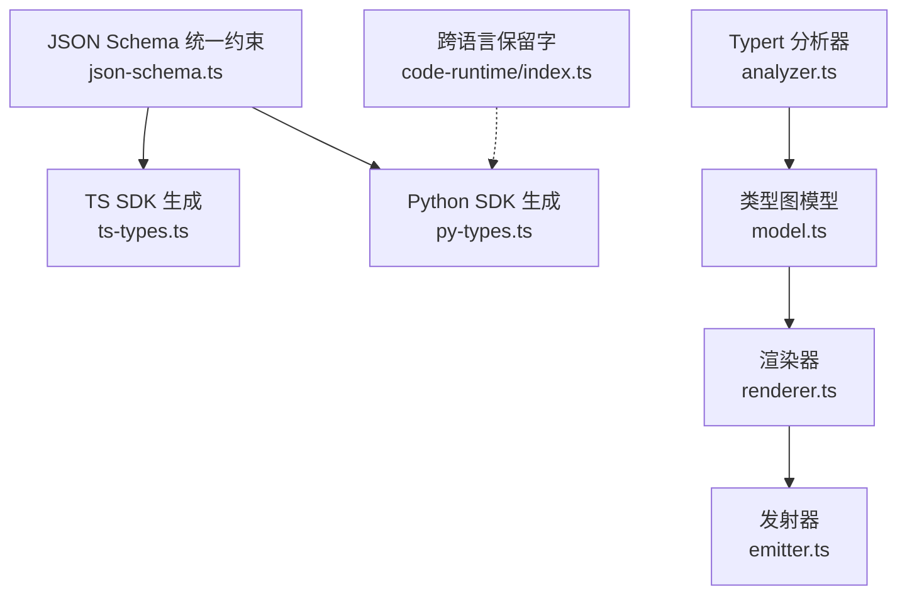
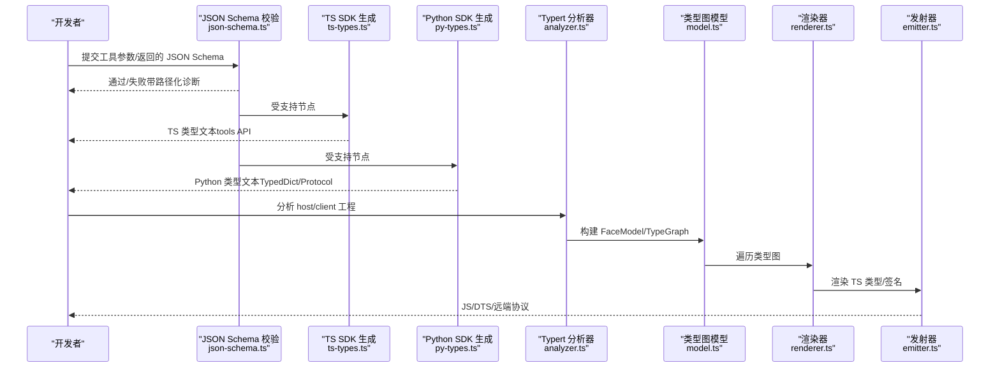
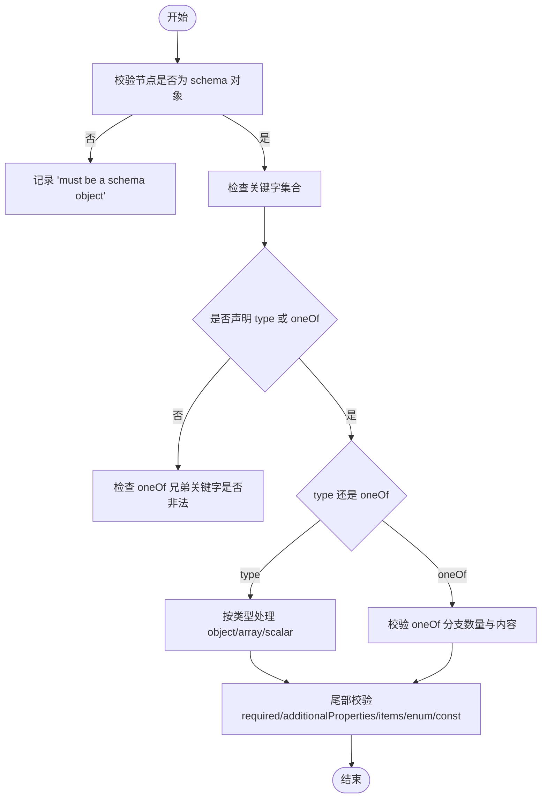
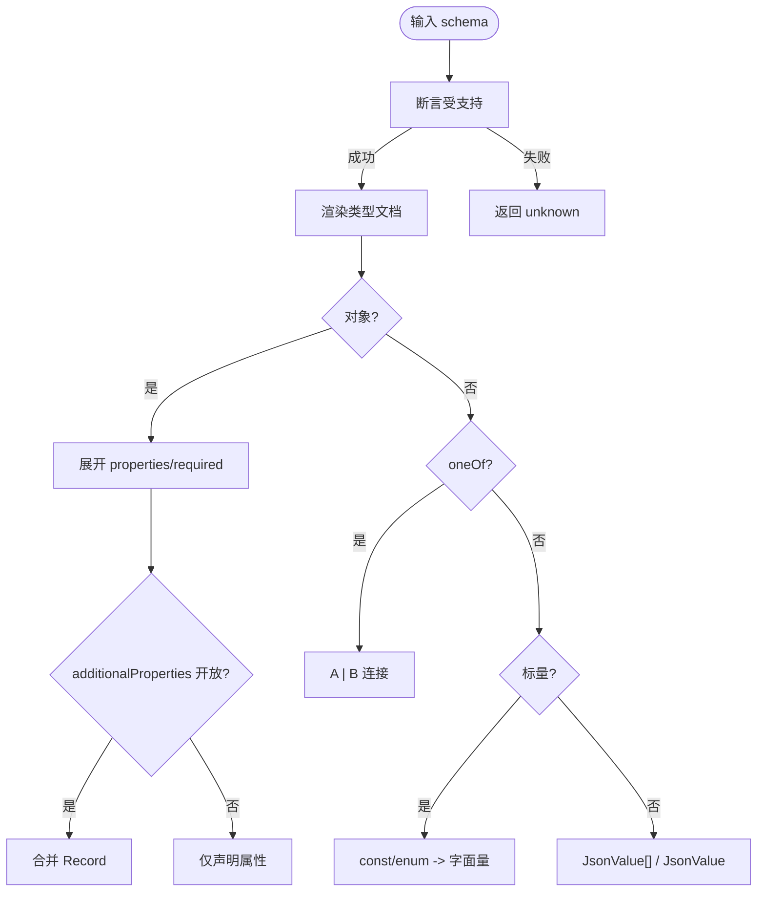
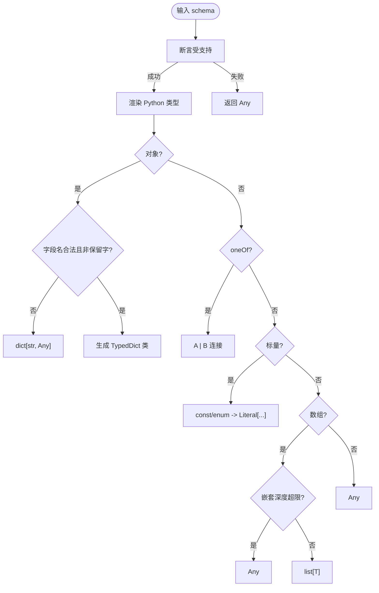
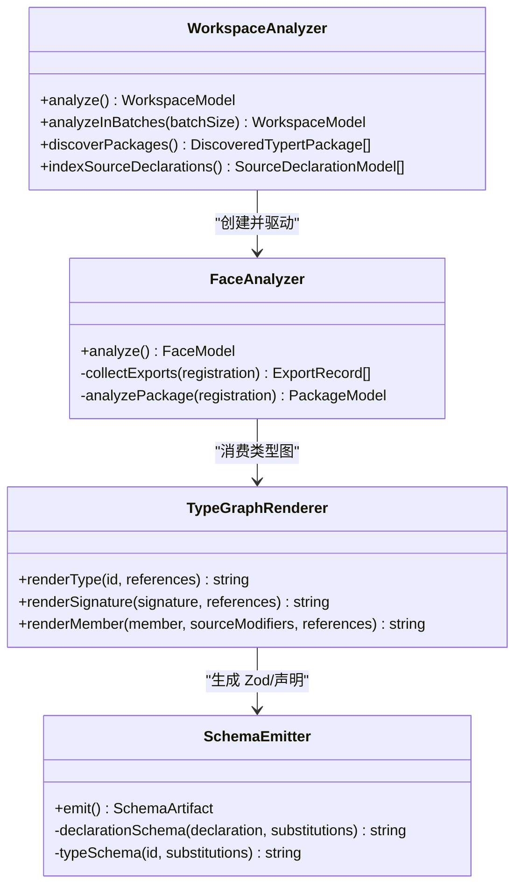
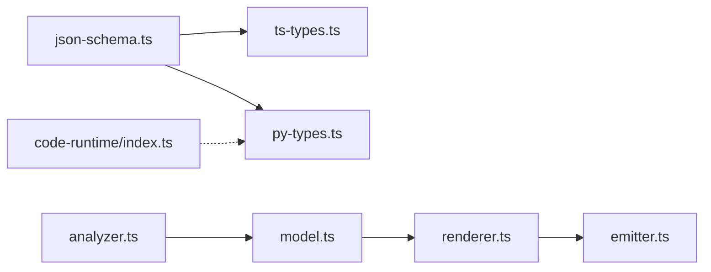

# 类型系统

<cite>
**本文引用的文件**
- [packages/core/tools/src/json-schema.ts](file://packages/core/tools/src/json-schema.ts)
- [packages/core/tools/src/ts-types.ts](file://packages/core/tools/src/ts-types.ts)
- [packages/core/tools/src/py-types.ts](file://packages/core/tools/src/py-types.ts)
- [packages/typert/generator/src/analyzer.ts](file://packages/typert/generator/src/analyzer.ts)
- [packages/typert/generator/src/model.ts](file://packages/typert/generator/src/model.ts)
- [packages/typert/generator/src/emitter.ts](file://packages/typert/generator/src/emitter.ts)
- [packages/typert/generator/src/renderer.ts](file://packages/typert/generator/src/renderer.ts)
- [packages/code-runtime/code-runtime/src/index.ts](file://packages/code-runtime/code-runtime/src/index.ts)
</cite>

## 目录
1. [简介](#简介)
2. [项目结构](#项目结构)
3. [核心组件](#核心组件)
4. [架构总览](#架构总览)
5. [详细组件分析](#详细组件分析)
6. [依赖关系分析](#依赖关系分析)
7. [性能考量](#性能考量)
8. [故障排查指南](#故障排查指南)
9. [结论](#结论)
10. [附录](#附录)

## 简介
本文件系统化说明仓库中的“工具类型系统”，覆盖以下目标：
- TypeScript 与 Python 类型的映射关系（基本类型、复合类型、自定义类型）
- JSON Schema 的生成与验证机制
- 类型推断与自动补全的实现原理
- 类型安全保证与编译时检查
- 复杂场景的类型定义示例与最佳实践
- 可选参数、默认值与类型约束的处理
- 类型错误诊断与修复
- 跨语言类型兼容性方案

该类型系统围绕一个统一的 JSON Schema 子集构建，并在两个方向上提供代码生成：
- 面向 TypeScript 运行时提示与校验（Zod 运行时 + TS 声明）
- 面向 Python 运行时提示与调用契约（TypedDict + Protocol）

同时，Typert 子系统负责从 TypeScript 源码中抽取类型图模型，并据此生成远端接口与运行时描述。

## 项目结构
类型系统的关键模块分布在如下位置：
- JSON Schema 统一约束与校验：packages/core/tools/src/json-schema.ts
- TypeScript SDK 代码生成：packages/core/tools/src/ts-types.ts
- Python SDK 代码生成：packages/core/tools/src/py-types.ts
- Typert 类型分析与模型：packages/typert/generator/src/analyzer.ts, model.ts, renderer.ts, emitter.ts
- 跨语言保留字兼容：packages/code-runtime/code-runtime/src/index.ts

图表来源
- [packages/core/tools/src/json-schema.ts:1-12](file://packages/core/tools/src/json-schema.ts#L1-L12)
- [packages/core/tools/src/ts-types.ts:1-16](file://packages/core/tools/src/ts-types.ts#L1-L16)
- [packages/core/tools/src/py-types.ts:1-15](file://packages/core/tools/src/py-types.ts#L1-L15)
- [packages/typert/generator/src/analyzer.ts:1-6](file://packages/typert/generator/src/analyzer.ts#L1-L6)
- [packages/typert/generator/src/model.ts:1-8](file://packages/typert/generator/src/model.ts#L1-L8)
- [packages/typert/generator/src/renderer.ts:1-5](file://packages/typert/generator/src/renderer.ts#L1-L5)
- [packages/typert/generator/src/emitter.ts:1-5](file://packages/typert/generator/src/emitter.ts#L1-L5)
- [packages/code-runtime/code-runtime/src/index.ts:66-87](file://packages/code-runtime/code-runtime/src/index.ts#L66-L87)

章节来源
- [packages/core/tools/src/json-schema.ts:1-12](file://packages/core/tools/src/json-schema.ts#L1-L12)
- [packages/core/tools/src/ts-types.ts:1-16](file://packages/core/tools/src/ts-types.ts#L1-L16)
- [packages/core/tools/src/py-types.ts:1-15](file://packages/core/tools/src/py-types.ts#L1-L15)
- [packages/typert/generator/src/analyzer.ts:1-6](file://packages/typert/generator/src/analyzer.ts#L1-L6)
- [packages/typert/generator/src/model.ts:1-8](file://packages/typert/generator/src/model.ts#L1-L8)
- [packages/typert/generator/src/renderer.ts:1-5](file://packages/typert/generator/src/renderer.ts#L1-L5)
- [packages/typert/generator/src/emitter.ts:1-5](file://packages/typert/generator/src/emitter.ts#L1-L5)
- [packages/code-runtime/code-runtime/src/index.ts:66-87](file://packages/code-runtime/code-runtime/src/index.ts#L66-L87)

## 核心组件
- JSON Schema 统一约束与校验：定义受支持的子集、关键字合法性、oneOf/properties/items/enum/const 等规则，并提供值校验与路径化诊断。
- TypeScript SDK 生成：将受支持的 JSON Schema 投影为 TS 类型文本，用于 Code Mode 的 tools API 提示与文档。
- Python SDK 生成：将受支持的 JSON Schema 投影为 Python TypedDict/Protocol/typing 注解，用于 Code Mode 的 tools 协议与调用约定。
- Typert 分析器：解析 host/client 面 TypeScript 工程，提取服务、事件、对象、Schema、调用边界，构建编译器无关的类型图。
- 渲染器与发射器：基于类型图渲染 TS 类型文本，并生成 JS/DTS 及远端协议描述。
- 跨语言保留字：确保命名在 ECMAScript 与 Python 之间可移植。

章节来源
- [packages/core/tools/src/json-schema.ts:17-56](file://packages/core/tools/src/json-schema.ts#L17-L56)
- [packages/core/tools/src/ts-types.ts:12-16](file://packages/core/tools/src/ts-types.ts#L12-L16)
- [packages/core/tools/src/py-types.ts:1-15](file://packages/core/tools/src/py-types.ts#L1-L15)
- [packages/typert/generator/src/analyzer.ts:1-6](file://packages/typert/generator/src/analyzer.ts#L1-L6)
- [packages/typert/generator/src/model.ts:154-187](file://packages/typert/generator/src/model.ts#L154-L187)
- [packages/typert/generator/src/renderer.ts:25-46](file://packages/typert/generator/src/renderer.ts#L25-L46)
- [packages/typert/generator/src/emitter.ts:87-128](file://packages/typert/generator/src/emitter.ts#L87-L128)
- [packages/code-runtime/code-runtime/src/index.ts:66-87](file://packages/code-runtime/code-runtime/src/index.ts#L66-L87)

## 架构总览
下图展示从 JSON Schema 到多语言 SDK 的生成流程，以及 Typert 对 TypeScript 工程的分析与产物生成。

图表来源
- [packages/core/tools/src/json-schema.ts:378-405](file://packages/core/tools/src/json-schema.ts#L378-L405)
- [packages/core/tools/src/ts-types.ts:232-294](file://packages/core/tools/src/ts-types.ts#L232-L294)
- [packages/core/tools/src/py-types.ts:714-819](file://packages/core/tools/src/py-types.ts#L714-L819)
- [packages/typert/generator/src/analyzer.ts:263-349](file://packages/typert/generator/src/analyzer.ts#L263-L349)
- [packages/typert/generator/src/model.ts:176-187](file://packages/typert/generator/src/model.ts#L176-L187)
- [packages/typert/generator/src/renderer.ts:81-167](file://packages/typert/generator/src/renderer.ts#L81-L167)
- [packages/typert/generator/src/emitter.ts:104-128](file://packages/typert/generator/src/emitter.ts#L104-L128)

## 详细组件分析

### JSON Schema 统一约束与校验
- 受支持类型：object、array、string、number、integer、boolean、null
- 受支持关键字：type、oneOf、properties、required、additionalProperties、items、enum、const，以及注释型字段 description/title/default/examples
- oneOf 要求至少两个分支且不能与 properties/required/additionalProperties/items/enum/const 并列使用
- 值校验：针对 object/array/scalar 进行严格类型检查；enum/const 进行取值限制；oneOf 必须恰好匹配一个分支
- 诊断：所有违规以路径化字符串数组返回，便于定位

图表来源
- [packages/core/tools/src/json-schema.ts:226-376](file://packages/core/tools/src/json-schema.ts#L226-L376)
- [packages/core/tools/src/json-schema.ts:486-644](file://packages/core/tools/src/json-schema.ts#L486-L644)

章节来源
- [packages/core/tools/src/json-schema.ts:17-56](file://packages/core/tools/src/json-schema.ts#L17-L56)
- [packages/core/tools/src/json-schema.ts:226-376](file://packages/core/tools/src/json-schema.ts#L226-L376)
- [packages/core/tools/src/json-schema.ts:378-405](file://packages/core/tools/src/json-schema.ts#L378-L405)
- [packages/core/tools/src/json-schema.ts:486-644](file://packages/core/tools/src/json-schema.ts#L486-L644)

### TypeScript SDK 类型生成
- 输入：受支持的 JSON Schema 节点
- 输出：TS 类型文本（对象属性、联合类型、数组、字面量枚举/常量）
- 行为：
  - 未知或缺失 type 降级为 JsonValue
  - 对象若 additionalProperties 非 false，则合并 Record<string, JsonValue>
  - 联合类型 oneOf 渲染为 A | B
  - 标量 const/enum 渲染为字面量联合
  - 异常或不受支持节点降级为 unknown

图表来源
- [packages/core/tools/src/ts-types.ts:111-230](file://packages/core/tools/src/ts-types.ts#L111-L230)
- [packages/core/tools/src/ts-types.ts:232-294](file://packages/core/tools/src/ts-types.ts#L232-L294)

章节来源
- [packages/core/tools/src/ts-types.ts:12-16](file://packages/core/tools/src/ts-types.ts#L12-L16)
- [packages/core/tools/src/ts-types.ts:111-230](file://packages/core/tools/src/ts-types.ts#L111-L230)
- [packages/core/tools/src/ts-types.ts:232-294](file://packages/core/tools/src/ts-types.ts#L232-L294)

### Python SDK 类型生成
- 输入：受支持的 JSON Schema 节点
- 输出：Python 类型文本（TypedDict、Union、Literal、list[...]、Any）
- 行为：
  - 对象属性名需为合法 Python 标识符且非保留字，否则降级为 dict[str, Any]
  - 列表深度超过解释器限制时降级为 Any，避免语法错误
  - oneOf 渲染为 A | B；const/enum 渲染为 Literal[...]
  - 未声明 type 或不受支持节点降级为 Any
  - 生成 Tools Protocol 与每个工具的 TypedDict 参数/返回类型

图表来源
- [packages/core/tools/src/py-types.ts:469-712](file://packages/core/tools/src/py-types.ts#L469-L712)
- [packages/core/tools/src/py-types.ts:714-819](file://packages/core/tools/src/py-types.ts#L714-L819)

章节来源
- [packages/core/tools/src/py-types.ts:1-15](file://packages/core/tools/src/py-types.ts#L1-L15)
- [packages/core/tools/src/py-types.ts:469-712](file://packages/core/tools/src/py-types.ts#L469-L712)
- [packages/core/tools/src/py-types.ts:714-819](file://packages/core/tools/src/py-types.ts#L714-L819)

### Typert 类型分析与模型
- 工作空间分析：解析 host/client 面的 tsconfig，发现包注册，构建独立程序并执行诊断
- 模型构建：抽取导出、服务、事件、对象、Schema、调用边界，形成 FaceModel 与 TypeGraph
- 类型推断：在 write 模式下，缺失标注会推断类型并写入源文件，随后重新分析
- 渲染与发射：基于 TypeGraph 渲染 TS 类型/签名，生成 JS/DTS 与远端协议描述

图表来源
- [packages/typert/generator/src/analyzer.ts:263-349](file://packages/typert/generator/src/analyzer.ts#L263-L349)
- [packages/typert/generator/src/analyzer.ts:594-717](file://packages/typert/generator/src/analyzer.ts#L594-L717)
- [packages/typert/generator/src/renderer.ts:25-46](file://packages/typert/generator/src/renderer.ts#L25-L46)
- [packages/typert/generator/src/emitter.ts:512-568](file://packages/typert/generator/src/emitter.ts#L512-L568)

章节来源
- [packages/typert/generator/src/analyzer.ts:263-349](file://packages/typert/generator/src/analyzer.ts#L263-L349)
- [packages/typert/generator/src/analyzer.ts:594-717](file://packages/typert/generator/src/analyzer.ts#L594-L717)
- [packages/typert/generator/src/model.ts:154-187](file://packages/typert/generator/src/model.ts#L154-L187)
- [packages/typert/generator/src/renderer.ts:81-167](file://packages/typert/generator/src/renderer.ts#L81-L167)
- [packages/typert/generator/src/emitter.ts:104-128](file://packages/typert/generator/src/emitter.ts#L104-L128)

### 类型安全的保证机制与编译时检查
- JSON Schema 层：严格的受支持子集校验，oneOf 唯一匹配，enum/const 取值限制，对象 required/additionalProperties 控制
- TS 层：TypeScript 编译器诊断；缺失标注在 write 模式自动推断并写回；类型图渲染保持类型一致性
- Python 层：TypedDict/Protocol/typing 注解作为静态提示；名称合法性与保留字检查；列表深度限制保障语法有效
- 远端协议：Host 侧生成的 Remote 描述包含参数与返回边界，Client 侧消费时具备强类型

章节来源
- [packages/core/tools/src/json-schema.ts:378-405](file://packages/core/tools/src/json-schema.ts#L378-L405)
- [packages/core/tools/src/json-schema.ts:486-644](file://packages/core/tools/src/json-schema.ts#L486-L644)
- [packages/typert/generator/src/analyzer.ts:542-570](file://packages/typert/generator/src/analyzer.ts#L542-L570)
- [packages/typert/generator/src/analyzer.ts:2158-2197](file://packages/typert/generator/src/analyzer.ts#L2158-L2197)
- [packages/typert/generator/src/emitter.ts:245-272](file://packages/typert/generator/src/emitter.ts#L245-L272)

### 类型推断与自动补全实现原理
- 缺失标注处理：在 check 模式下报错；在 write 模式下推断类型并通过编辑器编辑队列写回源文件，然后重新分析
- 类型图渲染：基于 TypeGraph 渲染 TS 类型文本，保持引用与泛型参数的正确性
- 自动补全：生成的 TS 类型与声明文件为 IDE 提供补全；Python TypedDict/Protocol 为 LSP/IDE 提供提示

章节来源
- [packages/typert/generator/src/analyzer.ts:2158-2197](file://packages/typert/generator/src/analyzer.ts#L2158-L2197)
- [packages/typert/generator/src/renderer.ts:81-167](file://packages/typert/generator/src/renderer.ts#L81-L167)
- [packages/core/tools/src/ts-types.ts:232-294](file://packages/core/tools/src/ts-types.ts#L232-L294)
- [packages/core/tools/src/py-types.ts:714-819](file://packages/core/tools/src/py-types.ts#L714-L819)

### 复杂场景类型定义示例与最佳实践
- 基本类型：string、number、integer、boolean、null
- 复合类型：
  - 对象：properties + required + additionalProperties(false 表示封闭对象)
  - 数组：items 指定元素类型；过深嵌套在 Python 侧降级为 Any
  - 联合：oneOf 至少两个分支，且不可与特定关键字并列
- 自定义类型：
  - TS：通过类型图声明与引用，生成 Zod 与 d.ts
  - Python：对象属性生成 TypedDict；工具方法生成 Protocol 成员
- 可选参数与默认值：
  - TS：optional 属性与 ? 标记；默认值由运行时/调用方保证
  - Python：NotRequired 标记可选字段；默认值由调用约定保证
- 类型约束：
  - enum/const 限定取值范围；additionalProperties 控制额外键

章节来源
- [packages/core/tools/src/json-schema.ts:17-56](file://packages/core/tools/src/json-schema.ts#L17-L56)
- [packages/core/tools/src/json-schema.ts:226-376](file://packages/core/tools/src/json-schema.ts#L226-L376)
- [packages/core/tools/src/ts-types.ts:111-230](file://packages/core/tools/src/ts-types.ts#L111-L230)
- [packages/core/tools/src/py-types.ts:469-712](file://packages/core/tools/src/py-types.ts#L469-L712)
- [packages/typert/generator/src/model.ts:349-387](file://packages/typert/generator/src/model.ts#L349-L387)

### 跨语言类型兼容性解决方案
- 保留字与标识符：
  - Python 硬保留字与软保留字处理，非法字段名降级为 dict[str, Any]
  - 跨语言保留字集合用于命名冲突防护
- 名称规范化：
  - Python 标识符 NFKC 稳定性检查，避免 Unicode 表版本差异导致的不一致
  - 类名派生与拼接遵循 NFKC 标准化，避免组合字符导致的符号不一致
- 列表深度限制：
  - Python 侧 list 嵌套深度上限，防止语法错误；TS 侧无此限制

章节来源
- [packages/core/tools/src/py-types.ts:21-130](file://packages/core/tools/src/py-types.ts#L21-L130)
- [packages/core/tools/src/py-types.ts:248-285](file://packages/core/tools/src/py-types.ts#L248-L285)
- [packages/core/tools/src/py-types.ts:287-329](file://packages/core/tools/src/py-types.ts#L287-L329)
- [packages/code-runtime/code-runtime/src/index.ts:66-87](file://packages/code-runtime/code-runtime/src/index.ts#L66-L87)

## 依赖关系分析
- json-schema.ts 被 ts-types.ts 与 py-types.ts 共同依赖，作为统一约束入口
- ts-types.ts 与 py-types.ts 分别生成不同语言的 SDK 类型文本
- analyzer.ts 构建 FaceModel/TypeGraph，供 renderer.ts 与 emitter.ts 消费
- model.ts 定义编译器无关的类型图模型，贯穿分析与发射阶段
- code-runtime/index.ts 提供跨语言保留字集合，影响 Python SDK 的名称策略

图表来源
- [packages/core/tools/src/json-schema.ts:1-12](file://packages/core/tools/src/json-schema.ts#L1-L12)
- [packages/core/tools/src/ts-types.ts:1-16](file://packages/core/tools/src/ts-types.ts#L1-L16)
- [packages/core/tools/src/py-types.ts:1-15](file://packages/core/tools/src/py-types.ts#L1-L15)
- [packages/typert/generator/src/analyzer.ts:1-6](file://packages/typert/generator/src/analyzer.ts#L1-L6)
- [packages/typert/generator/src/model.ts:1-8](file://packages/typert/generator/src/model.ts#L1-L8)
- [packages/typert/generator/src/renderer.ts:1-5](file://packages/typert/generator/src/renderer.ts#L1-L5)
- [packages/typert/generator/src/emitter.ts:1-5](file://packages/typert/generator/src/emitter.ts#L1-L5)
- [packages/code-runtime/code-runtime/src/index.ts:66-87](file://packages/code-runtime/code-runtime/src/index.ts#L66-L87)

章节来源
- [packages/core/tools/src/json-schema.ts:1-12](file://packages/core/tools/src/json-schema.ts#L1-L12)
- [packages/core/tools/src/ts-types.ts:1-16](file://packages/core/tools/src/ts-types.ts#L1-L16)
- [packages/core/tools/src/py-types.ts:1-15](file://packages/core/tools/src/py-types.ts#L1-L15)
- [packages/typert/generator/src/analyzer.ts:1-6](file://packages/typert/generator/src/analyzer.ts#L1-L6)
- [packages/typert/generator/src/model.ts:1-8](file://packages/typert/generator/src/model.ts#L1-L8)
- [packages/typert/generator/src/renderer.ts:1-5](file://packages/typert/generator/src/renderer.ts#L1-L5)
- [packages/typert/generator/src/emitter.ts:1-5](file://packages/typert/generator/src/emitter.ts#L1-L5)
- [packages/code-runtime/code-runtime/src/index.ts:66-87](file://packages/code-runtime/code-runtime/src/index.ts#L66-L87)

## 性能考量
- JSON Schema 校验采用显式栈帧，避免递归深度问题，线性扫描节点
- TS/Python 类型渲染使用惰性拼接与缓存，减少重复计算
- Typert 分析器共享解析缓存与编译器主机，提升批量分析效率
- Python 列表嵌套深度限制避免解释器语法错误，保障生成文本可解析

章节来源
- [packages/core/tools/src/json-schema.ts:226-376](file://packages/core/tools/src/json-schema.ts#L226-L376)
- [packages/core/tools/src/ts-types.ts:55-92](file://packages/core/tools/src/ts-types.ts#L55-L92)
- [packages/core/tools/src/py-types.ts:287-329](file://packages/core/tools/src/py-types.ts#L287-L329)
- [packages/typert/generator/src/analyzer.ts:177-261](file://packages/typert/generator/src/analyzer.ts#L177-L261)

## 故障排查指南
- JSON Schema 错误：
  - 检查 type 与 oneOf 是否互斥；oneOf 分支数量与类型是否正确
  - 检查 enum/const 的值是否与 declared type 一致
  - 检查 required 是否在 properties 中声明；additionalProperties 是否为布尔
- TS SDK 生成错误：
  - 检查对象属性名是否为合法标识符；必要时使用 quoted access
  - 检查 oneOf 分支是否产生歧义；必要时拆分类型
- Python SDK 生成错误：
  - 检查字段名是否为合法 Python 标识符且非保留字；必要时降级为 dict[str, Any]
  - 检查列表嵌套深度是否超过限制；必要时扁平化结构
- Typert 分析错误：
  - 检查公共边界是否缺少类型标注；在 write 模式下自动推断并写回
  - 检查跨面引用是否有效；确保导出路径与名称一致

章节来源
- [packages/core/tools/src/json-schema.ts:226-376](file://packages/core/tools/src/json-schema.ts#L226-L376)
- [packages/core/tools/src/json-schema.ts:486-644](file://packages/core/tools/src/json-schema.ts#L486-L644)
- [packages/core/tools/src/ts-types.ts:111-230](file://packages/core/tools/src/ts-types.ts#L111-L230)
- [packages/core/tools/src/py-types.ts:469-712](file://packages/core/tools/src/py-types.ts#L469-L712)
- [packages/typert/generator/src/analyzer.ts:2158-2197](file://packages/typert/generator/src/analyzer.ts#L2158-L2197)

## 结论
该类型系统以统一的 JSON Schema 子集为核心，提供 TypeScript 与 Python 的双向类型生成与校验。通过严格的约束、路径化诊断与跨语言兼容性策略，确保工具调用的类型安全与可维护性。Typert 子系统进一步将 TypeScript 工程的结构化为类型图，并生成远端协议与运行时描述，形成从源码到多语言 SDK 的完整闭环。

## 附录
- 推荐实践：
  - 优先使用受支持的 JSON Schema 子集；避免过度复杂的联合与嵌套
  - 明确 required 与 additionalProperties，提高契约清晰度
  - 在 Python 侧注意字段名合法性与保留字；必要时接受降级为 dict[str, Any]
  - 在 TS 侧利用类型图与 Zod 生成，保持运行时与静态类型一致
- 参考路径：
  - JSON Schema 约束与校验：[packages/core/tools/src/json-schema.ts](file://packages/core/tools/src/json-schema.ts)
  - TS SDK 生成：[packages/core/tools/src/ts-types.ts](file://packages/core/tools/src/ts-types.ts)
  - Python SDK 生成：[packages/core/tools/src/py-types.ts](file://packages/core/tools/src/py-types.ts)
  - Typert 分析与模型：[packages/typert/generator/src/analyzer.ts](file://packages/typert/generator/src/analyzer.ts), [packages/typert/generator/src/model.ts](file://packages/typert/generator/src/model.ts)
  - 渲染与发射：[packages/typert/generator/src/renderer.ts](file://packages/typert/generator/src/renderer.ts), [packages/typert/generator/src/emitter.ts](file://packages/typert/generator/src/emitter.ts)
  - 跨语言保留字：[packages/code-runtime/code-runtime/src/index.ts](file://packages/code-runtime/code-runtime/src/index.ts)