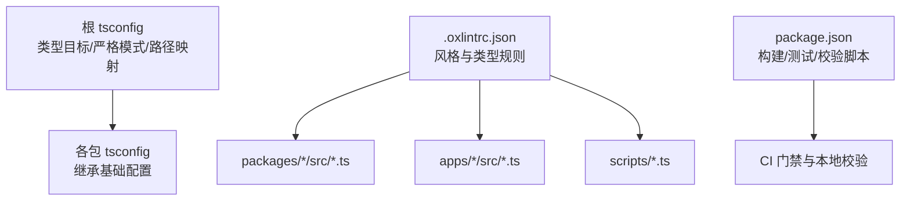
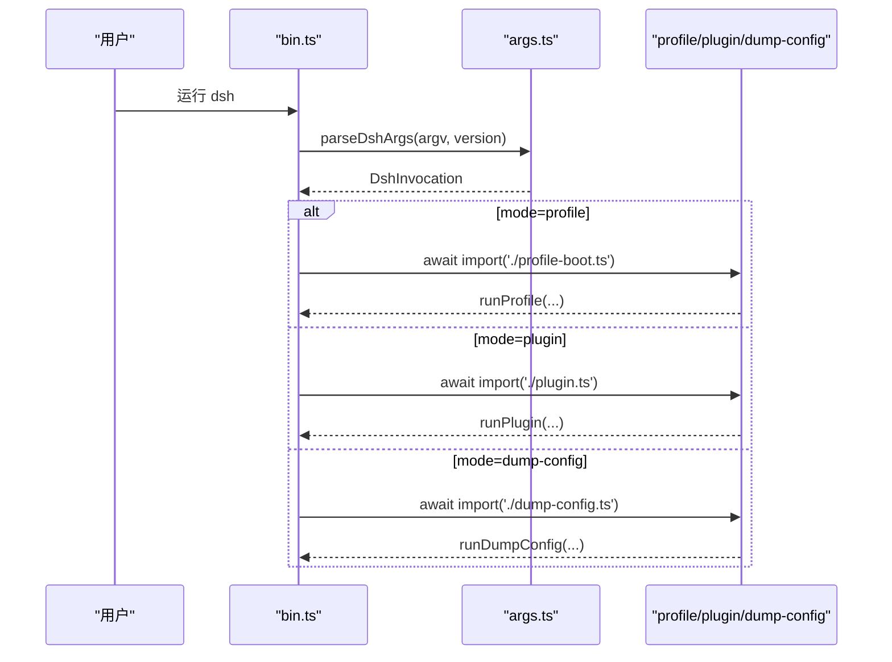
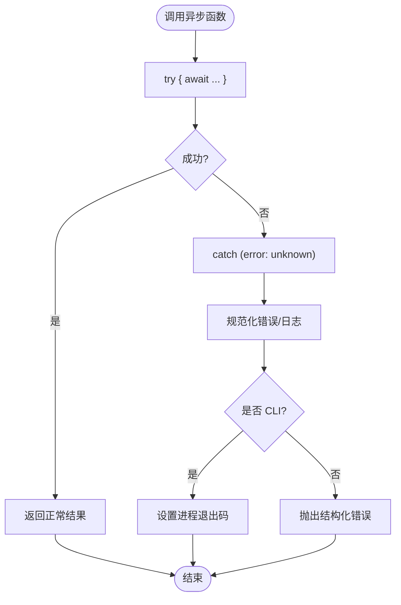
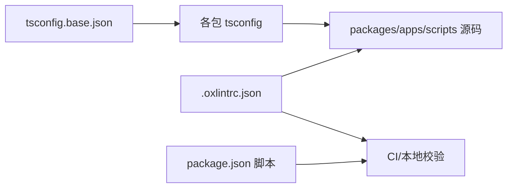

# TypeScript 编码规范

<cite>
**本文引用的文件**
- [tsconfig.base.json](file://tsconfig.base.json)
- [.oxlintrc.json](file://.oxlintrc.json)
- [package.json](file://package.json)
- [apps/cli/src/bin.ts](file://apps/cli/src/bin.ts)
- [apps/cli/src/args.ts](file://apps/cli/src/args.ts)
- [packages/core/tools/src/py-types.ts](file://packages/core/tools/src/py-types.ts)
- [scripts/verify-export-jsdoc.ts](file://scripts/verify-export-jsdoc.ts)
- [docs/defensive-patterns.md](file://docs/defensive-patterns.md)
</cite>

## 目录
1. [简介](#简介)
2. [项目结构](#项目结构)
3. [核心组件](#核心组件)
4. [架构总览](#架构总览)
5. [详细组件分析](#详细组件分析)
6. [依赖关系分析](#依赖关系分析)
7. [性能注意事项](#性能注意事项)
8. [故障排查指南](#故障排查指南)
9. [结论](#结论)
10. [附录](#附录)

## 简介
本规范面向仓库内所有 TypeScript/TSX 源码，统一命名约定、代码风格、类型定义、异步编程、模块组织、注释与文档字符串格式，并总结常见反模式与重构原则。规范依据仓库中的编译器配置、静态检查规则与实际源码实践提炼而成，确保跨包、跨应用的一致性。

## 项目结构
仓库采用多包 monorepo 结构，核心 TypeScript 编译与类型路径映射由根级 tsconfig 提供；代码风格与类型安全规则由 oxlint 集中管理；CLI 入口与参数解析位于 apps/cli；工具链脚本位于 scripts；公共能力以 packages/*/*/src 形式组织。

图表来源
- [tsconfig.base.json:5-26](file://tsconfig.base.json#L5-L26)
- [.oxlintrc.json:32-141](file://.oxlintrc.json#L32-L141)
- [package.json:19-32](file://package.json#L19-L32)

章节来源
- [tsconfig.base.json:5-26](file://tsconfig.base.json#L5-L26)
- [.oxlintrc.json:32-141](file://.oxlintrc.json#L32-L141)
- [package.json:19-32](file://package.json#L19-L32)

## 核心组件
- 类型系统与编译选项：ES2024 目标、严格模式、精确可选属性、未检查索引访问、无隐式覆盖、switch 穷尽等，保障强类型与可维护性。
- 代码风格与类型规则：通过 oxlint 强制缩进、引号、分号、逗号、箭头函数括号、成员分隔符、行宽限制，以及大量类型安全规则（禁止 any、禁止未处理 Promise、模板表达式限制等）。
- CLI 入口与参数解析：命令模式、子命令、帮助/版本输出、错误退出码、动态导入按需加载。
- 导出与文档校验：对导出的接口、类型、函数进行 JSDoc 检查，保证对外 API 的文档完备性。

章节来源
- [tsconfig.base.json:5-26](file://tsconfig.base.json#L5-L26)
- [.oxlintrc.json:32-141](file://.oxlintrc.json#L32-L141)
- [apps/cli/src/bin.ts:1-54](file://apps/cli/src/bin.ts#L1-L54)
- [apps/cli/src/args.ts:1-192](file://apps/cli/src/args.ts#L1-L192)
- [scripts/verify-export-jsdoc.ts:265-343](file://scripts/verify-export-jsdoc.ts#L265-L343)

## 架构总览
下图展示 CLI 启动流程与参数解析如何驱动不同模式的动态加载与执行，体现“先解析、再分发”的控制流。

图表来源
- [apps/cli/src/bin.ts:11-53](file://apps/cli/src/bin.ts#L11-L53)
- [apps/cli/src/args.ts:112-190](file://apps/cli/src/args.ts#L112-L190)

## 详细组件分析

### 命名约定
- 变量与常量
  - 使用小驼峰命名普通变量与常量；数组收集器使用具名函数如 collect(value, previous)。
  - 示例参考：[apps/cli/src/args.ts:61](file://apps/cli/src/args.ts#L61)
- 函数与方法
  - 动词短语命名，语义清晰；避免缩写；参数与返回值类型明确。
  - 示例参考：[apps/cli/src/args.ts:83-103](file://apps/cli/src/args.ts#L83-L103)
- 类与接口
  - 类名大驼峰；接口名描述职责，必要时带前缀或后缀表达领域含义。
  - 示例参考：[apps/cli/src/args.ts:21-48](file://apps/cli/src/args.ts#L21-L48)
- 模块与包
  - 模块说明使用 JSDoc @module；包路径通过 tsconfig paths 映射到内部别名，便于跨包引用。
  - 示例参考：[apps/cli/src/bin.ts:1-7](file://apps/cli/src/bin.ts#L1-L7)、[tsconfig.base.json:30-276](file://tsconfig.base.json#L30-L276)

章节来源
- [apps/cli/src/args.ts:21-48](file://apps/cli/src/args.ts#L21-L48)
- [apps/cli/src/args.ts:61-103](file://apps/cli/src/args.ts#L61-L103)
- [apps/cli/src/bin.ts:1-7](file://apps/cli/src/bin.ts#L1-L7)
- [tsconfig.base.json:30-276](file://tsconfig.base.json#L30-L276)

### 代码风格标准
- 缩进：2 空格
- 分号：不使用分号
- 引号：单引号，避免转义时自动切换
- 逗号：多行对象/数组末尾逗号
- 箭头函数：单参省略括号，多参或多语句体保留括号
- 成员分隔符：单行用分号，多行不加分隔符
- 行宽：最大 140 列（URL/字符串/模板字面量除外）
- 其他：禁止 var、优先 const、rest/spread 优先、禁用数组构造器等

章节来源
- [.oxlintrc.json:240-296](file://.oxlintrc.json#L240-L296)
- [.oxlintrc.json:44-79](file://.oxlintrc.json#L44-L79)

### 类型定义最佳实践
- 泛型使用
  - 在集合与工具函数中显式声明泛型，避免 any；利用条件类型与联合类型表达约束。
- 类型推断
  - 优先让 TS 推断类型；仅在必要处显式标注，尤其是回调与高阶函数签名。
- 接口设计原则
  - 接口小而专一；组合优于继承；为导出类型补充 JSDoc，并通过校验脚本保证文档存在。
- 严格模式与额外检查
  - 启用 noUncheckedIndexedAccess、exactOptionalPropertyTypes、noImplicitOverride、noFallthroughCasesInSwitch 等，减少运行时错误。

章节来源
- [tsconfig.base.json:19-26](file://tsconfig.base.json#L19-L26)
- [scripts/verify-export-jsdoc.ts:265-343](file://scripts/verify-export-jsdoc.ts#L265-L343)

### 异步编程规范
- Promise 处理
  - 禁止悬挂 Promise；必须 await 或 .catch；使用 return-await 仅用于错误处理正确性场景。
- async/await 模式
  - 入口函数使用 async；错误通过 throw Error 或返回结构化结果；避免在事件监听中使用 fire-and-forget 除非显式标记。
- 错误处理策略
  - 区分可恢复与不可恢复错误；对外暴露标准化错误形态；在 CLI 中捕获 CommanderError 并设置退出码。

图表来源
- [apps/cli/src/args.ts:183-190](file://apps/cli/src/args.ts#L183-L190)
- [.oxlintrc.json:79-137](file://.oxlintrc.json#L79-L137)

章节来源
- [.oxlintrc.json:79-137](file://.oxlintrc.json#L79-L137)
- [apps/cli/src/args.ts:183-190](file://apps/cli/src/args.ts#L183-L190)

### 代码组织原则
- 文件结构
  - 每个功能域一个包，src 下按职责划分；测试与源码分离；配置文件独立于业务逻辑。
- 模块划分
  - 使用相对路径与 tsconfig paths 别名；避免深层嵌套；保持单一职责。
- 导入导出规范
  - 使用 ES 模块；导出具名类型与函数；默认导出谨慎使用；JSDoc 描述导出项。

章节来源
- [tsconfig.base.json:30-276](file://tsconfig.base.json#L30-L276)
- [scripts/verify-export-jsdoc.ts:265-343](file://scripts/verify-export-jsdoc.ts#L265-L343)

### 注释与文档字符串
- JSDoc 要求
  - 对外导出需包含描述与标签；参数与返回值应文档化；模块级 @module 说明用途。
- 校验机制
  - 通过 verify-export-jsdoc 脚本检查导出项的 JSDoc 完整性，缺失将报错。
- 示例参考
  - CLI 入口模块注释、参数解析模块注释、工具生成模块的详细注释。

章节来源
- [apps/cli/src/bin.ts:1-7](file://apps/cli/src/bin.ts#L1-L7)
- [apps/cli/src/args.ts:1-16](file://apps/cli/src/args.ts#L1-L16)
- [packages/core/tools/src/py-types.ts:1-15](file://packages/core/tools/src/py-types.ts#L1-L15)
- [scripts/verify-export-jsdoc.ts:265-343](file://scripts/verify-export-jsdoc.ts#L265-L343)

### 常见反模式与避免方法
- 悬挂 Promise：必须 await 或 .catch；启用 no-floating-promises。
- 滥用 any：使用具体类型或窄化；启用 no-explicit-any。
- 未穷尽 switch：启用 switch-exhaustiveness-check 并使用 never 断言。
- 非空断言滥用：优先使用类型守卫与可选链；启用 no-non-null-assertion。
- 模板表达式任意拼接：限制模板表达式类型；启用 restrict-template-expressions。
- 重复分支与条件：启用 SonarJS 规则检测重复逻辑。

章节来源
- [.oxlintrc.json:79-137](file://.oxlintrc.json#L79-L137)
- [.oxlintrc.json:217-226](file://.oxlintrc.json#L217-L226)

### 重构指导原则
- 逐步引入严格类型：先关闭宽松规则，逐步开启 strict、noUncheckedIndexedAccess 等。
- 拆分大函数：按职责拆分为小函数，提升可读性与可测性。
- 统一错误模型：将分散的错误处理收敛为统一的错误类型与日志格式。
- 强化文档：为新增导出补充 JSDoc，并通过校验脚本验证。

章节来源
- [docs/defensive-patterns.md:1-13](file://docs/defensive-patterns.md#L1-L13)

## 依赖关系分析
- 编译依赖：根 tsconfig 提供全局编译器选项与路径映射；各包继承基础配置，形成清晰的编译边界。
- 规则依赖：oxlint 集中管理风格与类型规则，覆盖 packages、apps、scripts、website 等目录。
- 工具链依赖：package.json 脚本串联构建、类型检查、Lint、测试与发布流程。

图表来源
- [tsconfig.base.json:5-26](file://tsconfig.base.json#L5-L26)
- [.oxlintrc.json:32-141](file://.oxlintrc.json#L32-L141)
- [package.json:19-32](file://package.json#L19-L32)

章节来源
- [tsconfig.base.json:5-26](file://tsconfig.base.json#L5-L26)
- [.oxlintrc.json:32-141](file://.oxlintrc.json#L32-L141)
- [package.json:19-32](file://package.json#L19-L32)

## 性能注意事项
- 避免不必要的类型转换与冗余判断；利用 TS 推断减少显式标注。
- 控制循环与递归深度；对大数据集使用流式或分页处理。
- 合理使用懒加载与动态导入，减少启动时间与内存占用。
- 遵循 Lint 规则避免低效写法（如数组构造、多余断言等）。

## 故障排查指南
- 类型错误
  - 检查 tsconfig 严格选项；确认类型收窄与可选属性访问；使用 noUncheckedIndexedAccess 定位潜在越界。
- Lint 失败
  - 根据 .oxlintrc.json 规则逐项修复；注意测试与示例的特殊覆盖规则。
- CLI 异常
  - 查看 CommanderError 退出码；确认参数解析与子命令传递是否正确。
- 文档缺失
  - 运行导出文档校验脚本，补齐缺失的 JSDoc。

章节来源
- [apps/cli/src/args.ts:183-190](file://apps/cli/src/args.ts#L183-L190)
- [scripts/verify-export-jsdoc.ts:265-343](file://scripts/verify-export-jsdoc.ts#L265-L343)

## 结论
本规范基于仓库的实际配置与实践，明确了命名、风格、类型、异步、模块组织与文档的标准，提供了可视化流程图与依赖图，帮助团队保持一致的代码质量与可维护性。建议在新功能开发中严格遵循上述规则，并在 CI 中持续校验。

## 附录
- 关键配置位置
  - 编译器选项与路径映射：[tsconfig.base.json:5-276](file://tsconfig.base.json#L5-L276)
  - 风格与类型规则：[.oxlintrc.json:32-296](file://.oxlintrc.json#L32-L296)
  - 构建与校验脚本：[package.json:19-142](file://package.json#L19-L142)
- 典型源码参考
  - CLI 入口与参数解析：[apps/cli/src/bin.ts:1-54](file://apps/cli/src/bin.ts#L1-L54)、[apps/cli/src/args.ts:1-192](file://apps/cli/src/args.ts#L1-L192)
  - 工具生成与详细注释：[packages/core/tools/src/py-types.ts:1-200](file://packages/core/tools/src/py-types.ts#L1-L200)
  - 导出文档校验：[scripts/verify-export-jsdoc.ts:265-343](file://scripts/verify-export-jsdoc.ts#L265-L343)
  - 防御性编程要点：[docs/defensive-patterns.md:1-13](file://docs/defensive-patterns.md#L1-L13)