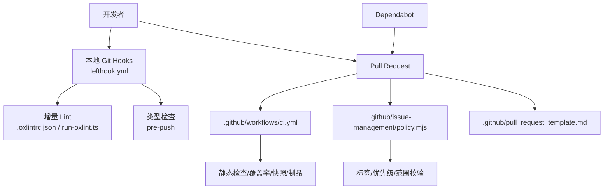
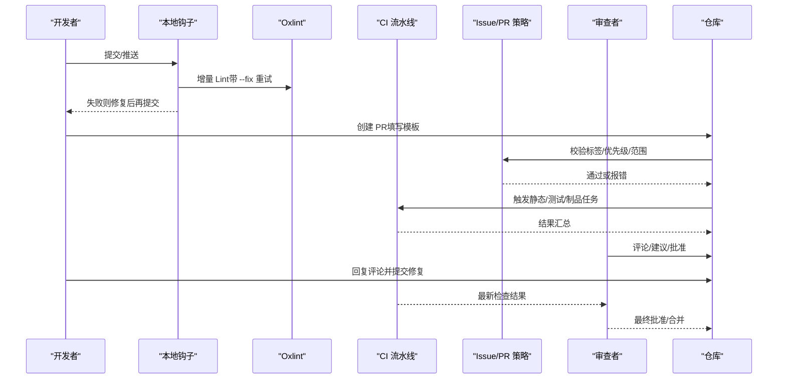
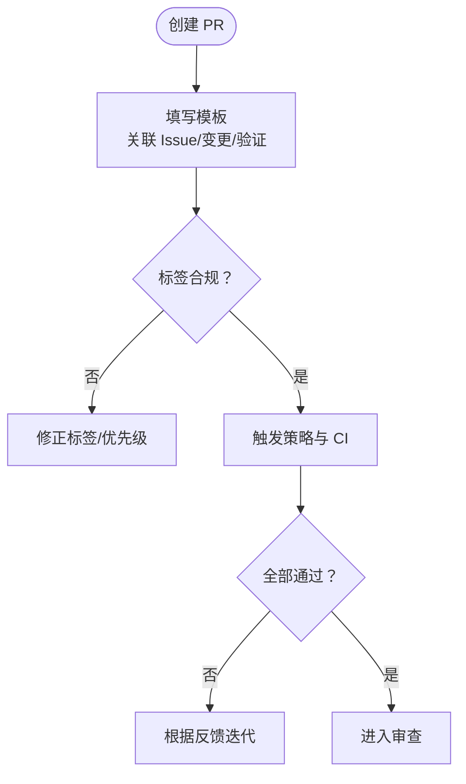
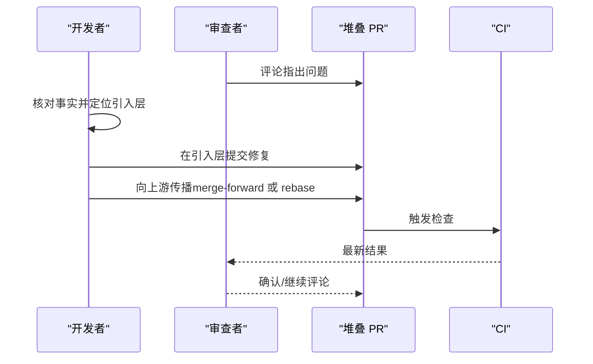
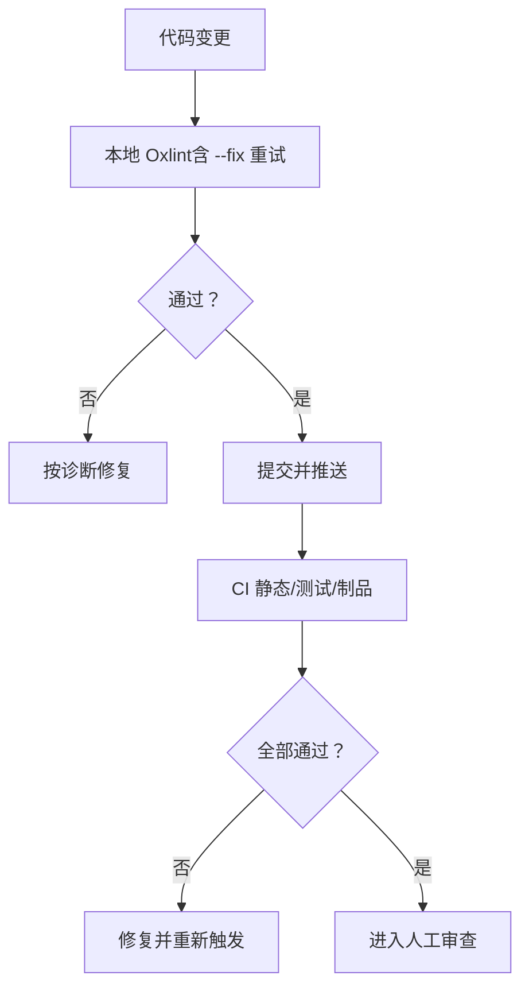
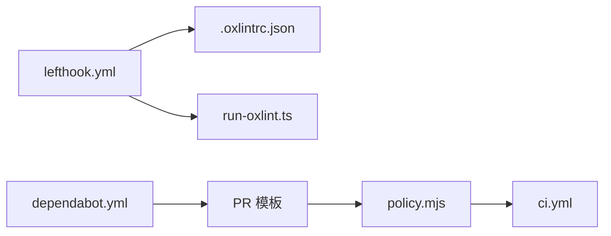

# 代码审查流程

<cite>
**本文引用的文件**
- [pull_request_template.md](file://.github/pull_request_template.md)
- [maintaining-dsh-code-review.md](file://docs/cookbook/maintaining-dsh-code-review.md)
- [CONTRIBUTING.md](file://CONTRIBUTING.md)
- [lefthook.yml](file://lefthook.yml)
- [.oxlintrc.json](file://.oxlintrc.json)
- [run-oxlint.ts](file://scripts/run-oxlint.ts)
- [ci.yml](file://.github/workflows/ci.yml)
- [policy.mjs](file://.github/issue-management/policy.mjs)
- [policy.test.mjs](file://.github/issue-management/policy.test.mjs)
- [dependabot.yml](file://.github/dependabot.yml)
- [responding-to-pr-review-on-a-stack.md](file://docs/cookbook/responding-to-pr-review-on-a-stack.md)
</cite>

## 目录
1. [简介](#简介)
2. [项目结构](#项目结构)
3. [核心组件](#核心组件)
4. [架构总览](#架构总览)
5. [详细组件分析](#详细组件分析)
6. [依赖关系分析](#依赖关系分析)
7. [性能与可维护性考量](#性能与可维护性考量)
8. [故障排查指南](#故障排查指南)
9. [结论](#结论)
10. [附录](#附录)

## 简介
本指南基于仓库现有配置与实践，沉淀一套标准化的代码审查流程。内容覆盖 Pull Request 创建规范、审查检查清单、审查反馈处理、自动化审查工具使用、最佳实践以及不同规模变更的差异化策略。目标是让评审更高效、一致且可追溯，同时降低合并风险并促进知识共享。

## 项目结构
仓库围绕“本地钩子 + CI 门禁 + 模板与策略”构建代码质量与审查闭环：
- 本地阶段：通过 lefthook 在提交前执行翻译配对校验、归档 Agent Notes 校验、增量 lint（Oxlint）、第三方通知生成、空白字符检查、vendor manifest 守卫；推送前执行类型检查。
- CI 阶段：PR 触发静态检查、覆盖率、快照与制品、Windows 兼容等并行作业；Issue/PR 策略由 issue-policy 工作流驱动。
- 模板与策略：PR 模板约束关联 Issue 与变更验证；依赖更新由 Dependabot 统一治理；堆叠 PR 的评论修复与传播遵循专门指南。

**图表来源**
- [lefthook.yml:5-56](file://lefthook.yml#L5-L56)
- [.oxlintrc.json:1-322](file://.oxlintrc.json#L1-L322)
- [run-oxlint.ts:1-89](file://scripts/run-oxlint.ts#L1-L89)
- [ci.yml:1-200](file://.github/workflows/ci.yml#L1-L200)
- [policy.mjs:632-663](file://.github/issue-management/policy.mjs#L632-L663)
- [pull_request_template.md:1-14](file://.github/pull_request_template.md#L1-L14)
- [dependabot.yml:1-42](file://.github/dependabot.yml#L1-L42)

**章节来源**
- [lefthook.yml:5-56](file://lefthook.yml#L5-L56)
- [.oxlintrc.json:1-322](file://.oxlintrc.json#L1-L322)
- [run-oxlint.ts:1-89](file://scripts/run-oxlint.ts#L1-L89)
- [ci.yml:1-200](file://.github/workflows/ci.yml#L1-L200)
- [policy.mjs:632-663](file://.github/issue-management/policy.mjs#L632-L663)
- [pull_request_template.md:1-14](file://.github/pull_request_template.md#L1-L14)
- [dependabot.yml:1-42](file://.github/dependabot.yml#L1-L42)

## 核心组件
- 本地门禁（lefthook）：快速拦截常见错误，减少无效 PR 进入流水线。
- 静态分析与格式化（Oxlint）：统一的规则集与修复流程，支持重试以处理重叠修复。
- CI 门禁（GitHub Actions）：多矩阵任务保障跨平台与稳定性。
- 策略与模板：PR 模板、Issue/PR 策略、依赖更新策略。
- 堆叠 PR 协作：评论定位、修复落点与向上传播的规范。

**章节来源**
- [lefthook.yml:5-56](file://lefthook.yml#L5-L56)
- [.oxlintrc.json:1-322](file://.oxlintrc.json#L1-L322)
- [run-oxlint.ts:1-89](file://scripts/run-oxlint.ts#L1-L89)
- [ci.yml:1-200](file://.github/workflows/ci.yml#L1-L200)
- [policy.mjs:632-663](file://.github/issue-management/policy.mjs#L632-L663)
- [pull_request_template.md:1-14](file://.github/pull_request_template.md#L1-L14)
- [dependabot.yml:1-42](file://.github/dependabot.yml#L1-L42)

## 架构总览
下图展示从提交流到合并的全链路质量控制与审查协作路径。

**图表来源**
- [lefthook.yml:5-56](file://lefthook.yml#L5-L56)
- [run-oxlint.ts:1-89](file://scripts/run-oxlint.ts#L1-L89)
- [ci.yml:1-200](file://.github/workflows/ci.yml#L1-L200)
- [policy.mjs:632-663](file://.github/issue-management/policy.mjs#L632-L663)
- [pull_request_template.md:1-14](file://.github/pull_request_template.md#L1-L14)

## 详细组件分析

### Pull Request 创建规范
- 标题与描述
  - 必须关联至少一个同仓库 Issue（解决型需同步 Priority）。
  - 使用模板中的“变更与验证”区块，明确列出变更点与验证方式。
- 标签与范围
  - 必须恰好一个允许的 kind/*，至少一个 area/*。
  - 禁止使用旧版标签或不受支持的 kind。
  - 若 Issue 有 Priority，解决型 PR 的每个被解决 Issue 也必须设置对应 Priority。
- 依赖更新
  - 由 Dependabot 统一发起，自动标注 kind/dependency 与 area/infra。

**图表来源**
- [pull_request_template.md:1-14](file://.github/pull_request_template.md#L1-L14)
- [policy.test.mjs:327-413](file://.github/issue-management/policy.test.mjs#L327-L413)
- [dependabot.yml:1-42](file://.github/dependabot.yml#L1-L42)

**章节来源**
- [pull_request_template.md:1-14](file://.github/pull_request_template.md#L1-L14)
- [policy.test.mjs:327-413](file://.github/issue-management/policy.test.mjs#L327-L413)
- [dependabot.yml:1-42](file://.github/dependabot.yml#L1-L42)

### 代码审查检查清单
- 功能正确性
  - 是否满足需求与边界条件；是否有回归风险；是否补充了必要的测试或快照。
- 代码质量
  - 是否符合 Oxlint 规则；是否存在未处理的 Promise、any、冗余逻辑；命名与结构是否清晰。
- 安全性
  - 是否引入新的外部依赖或敏感信息；是否遵循最小权限原则；是否考虑沙箱/隔离场景。
- 性能考虑
  - 是否影响关键路径；是否增加不必要的计算或 I/O；是否具备可观测性与度量。

提示：结合本地与 CI 的静态检查、覆盖率与快照任务，确保上述维度在合并前得到验证。

**章节来源**
- [.oxlintrc.json:1-322](file://.oxlintrc.json#L1-L322)
- [run-oxlint.ts:1-89](file://scripts/run-oxlint.ts#L1-L89)
- [ci.yml:1-200](file://.github/workflows/ci.yml#L1-L200)

### 审查反馈处理流程
- 评论回复
  - 针对每条评论进行事实核对；接受后在引入问题的层上修复，并在受影响的上游链中传播。
- 修改建议
  - 保持每次修复为独立提交；避免对已审阅的修复进行 amend；重写推送需走租约保护与回滚预案。
- 争议解决
  - 优先以证据与规则为依据；必要时拉齐上下文或引入更熟悉该领域的成员复核。
- 堆叠 PR 协作
  - 以 GitHub 官方堆叠为准；修复落点遵循“谁引入、谁修复、再向上传播”的原则；每次重写后重新确认线程、审批与可合并状态。

**图表来源**
- [responding-to-pr-review-on-a-stack.md:1-33](file://docs/cookbook/responding-to-pr-review-on-a-stack.md#L1-L33)

**章节来源**
- [responding-to-pr-review-on-a-stack.md:1-33](file://docs/cookbook/responding-to-pr-review-on-a-stack.md#L1-L33)

### 自动化审查工具使用
- 静态分析与格式化（Oxlint）
  - 统一入口 scripts/run-oxlint.ts，支持线程数控制与 --fix 重试机制，避免部分修复导致的非零退出。
  - 规则集位于 .oxlintrc.json，覆盖 TypeScript、SonarJS、Stylistic 等，区分源/测试/示例等场景。
- 依赖检查与安全扫描
  - 依赖更新由 Dependabot 定时扫描 npm/uv/github-actions 生态，统一打标签并冷却。
  - 安全扫描与许可证清单在仓库策略中作为长期目标（如 advisories 扫描、vendor 漂移校验），可在 CI 中按需接入。
- 本地与 CI 一致性
  - 本地 pre-commit/pre-push 与 CI 保持一致的检查项，减少环境差异带来的误报/漏报。

**图表来源**
- [run-oxlint.ts:1-89](file://scripts/run-oxlint.ts#L1-L89)
- [.oxlintrc.json:1-322](file://.oxlintrc.json#L1-L322)
- [dependabot.yml:1-42](file://.github/dependabot.yml#L1-L42)
- [ci.yml:1-200](file://.github/workflows/ci.yml#L1-L200)

**章节来源**
- [run-oxlint.ts:1-89](file://scripts/run-oxlint.ts#L1-L89)
- [.oxlintrc.json:1-322](file://.oxlintrc.json#L1-L322)
- [dependabot.yml:1-42](file://.github/dependabot.yml#L1-L42)
- [ci.yml:1-200](file://.github/workflows/ci.yml#L1-L200)

### 审查最佳实践
- 审查速度
  - 小改动优先自测并通过本地钩子；PR 尽量小而精，便于快速审阅。
  - 利用 CI 缓存与并发参数缩短等待时间。
- 沟通技巧
  - 评论聚焦问题与依据；提供可操作的改进建议；对不确定处提出澄清而非断言。
- 知识分享
  - 将常见问题沉淀为规则或文档；通过技能维护流程将经验固化为可复用的指导。

**章节来源**
- [lefthook.yml:5-56](file://lefthook.yml#L5-L56)
- [ci.yml:1-200](file://.github/workflows/ci.yml#L1-L200)
- [maintaining-dsh-code-review.md:1-65](file://docs/cookbook/maintaining-dsh-code-review.md#L1-L65)

### 不同规模变更的审查策略
- 小修复（typo、单行逻辑修正）
  - 重点：快速通过本地钩子与 CI；评论聚焦于正确性与回归风险。
- 新功能
  - 重点：需求对齐、接口设计、测试覆盖、可观测性；必要时拆分多个 PR 以降低复杂度。
- 重大重构
  - 重点：影响面评估、分阶段推进、灰度与回滚方案；强化快照与端到端验证；安排专项评审。

[本节为通用实践说明，不直接引用具体文件]

### 如何编写高质量的审查评论与接受反馈
- 高质量评论
  - 明确指出问题位置、影响与依据；给出可选替代方案；必要时附上参考链接或规则条目。
- 接受反馈
  - 先理解意图再行动；对分歧先收集证据；对无法立即解决的问题记录待办并跟进。
- 堆叠 PR 场景
  - 严格遵循“引入层修复 + 向上传播”；每次重写后复查线程、审批与可合并状态。

**章节来源**
- [responding-to-pr-review-on-a-stack.md:1-33](file://docs/cookbook/responding-to-pr-review-on-a-stack.md#L1-L33)

## 依赖关系分析
- 组件耦合
  - 本地钩子依赖 Oxlint 规则与脚本；CI 依赖工作流定义与脚本；策略模块依赖 Issue/PR 元数据。
- 外部依赖
  - Dependabot 负责依赖更新；CI 使用托管/自建 Runner；Oxlint 插件体系提供规则能力。
- 循环依赖
  - 当前流程无代码级循环依赖；工作流与脚本职责清晰。

**图表来源**
- [lefthook.yml:5-56](file://lefthook.yml#L5-L56)
- [.oxlintrc.json:1-322](file://.oxlintrc.json#L1-L322)
- [run-oxlint.ts:1-89](file://scripts/run-oxlint.ts#L1-L89)
- [pull_request_template.md:1-14](file://.github/pull_request_template.md#L1-L14)
- [policy.mjs:632-663](file://.github/issue-management/policy.mjs#L632-L663)
- [ci.yml:1-200](file://.github/workflows/ci.yml#L1-L200)
- [dependabot.yml:1-42](file://.github/dependabot.yml#L1-L42)

**章节来源**
- [lefthook.yml:5-56](file://lefthook.yml#L5-L56)
- [.oxlintrc.json:1-322](file://.oxlintrc.json#L1-L322)
- [run-oxlint.ts:1-89](file://scripts/run-oxlint.ts#L1-L89)
- [pull_request_template.md:1-14](file://.github/pull_request_template.md#L1-L14)
- [policy.mjs:632-663](file://.github/issue-management/policy.mjs#L632-L663)
- [ci.yml:1-200](file://.github/workflows/ci.yml#L1-L200)
- [dependabot.yml:1-42](file://.github/dependabot.yml#L1-L42)

## 性能与可维护性考量
- 本地体验
  - 仅对暂存文件运行轻量检查；--fix 模式支持二次重试，避免重复交互。
- CI 效率
  - 使用缓存、并发与 failover 池；按任务拆分静态、覆盖率与制品，提升吞吐。
- 可维护性
  - 规则集中管理；脚本化入口统一；策略与模板版本化，便于演进与审计。

**章节来源**
- [run-oxlint.ts:1-89](file://scripts/run-oxlint.ts#L1-L89)
- [ci.yml:1-200](file://.github/workflows/ci.yml#L1-L200)

## 故障排查指南
- 本地 Lint 失败
  - 查看 Oxlint 输出；若为 --fix 非零退出，再次运行以完成剩余修复。
- 类型检查失败
  - 在推送前执行类型检查，修复类型错误后再提交。
- CI 失败
  - 按任务逐一排查；关注 Windows 兼容与快照差异；必要时切换 failover 池。
- 策略校验失败
  - 检查 PR 标签、优先级与范围；确保解决型 Issue 的 Priority 一致。

**章节来源**
- [run-oxlint.ts:1-89](file://scripts/run-oxlint.ts#L1-L89)
- [lefthook.yml:5-56](file://lefthook.yml#L5-L56)
- [ci.yml:1-200](file://.github/workflows/ci.yml#L1-L200)
- [policy.mjs:632-663](file://.github/issue-management/policy.mjs#L632-L663)

## 结论
通过将本地钩子、静态分析、CI 门禁与策略模板有机结合，本项目形成了高效、稳定且可演进的代码审查流程。遵循本指南，可以在保证质量的前提下显著提升协作效率，并将个人经验沉淀为团队共识。

## 附录
- 贡献参与
  - 当前仓库暂不接受外部 PR；可通过讨论区、插件生态与文档贡献参与社区建设。

**章节来源**
- [CONTRIBUTING.md:1-24](file://CONTRIBUTING.md#L1-L24)