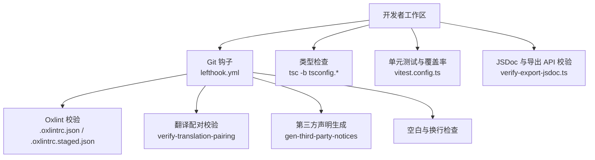
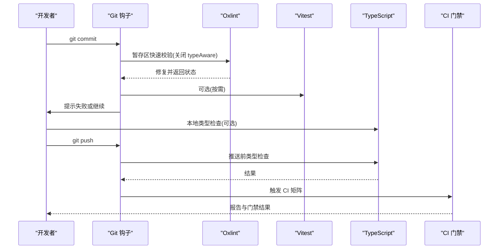
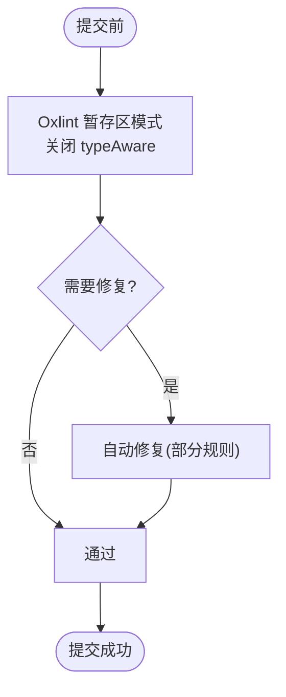
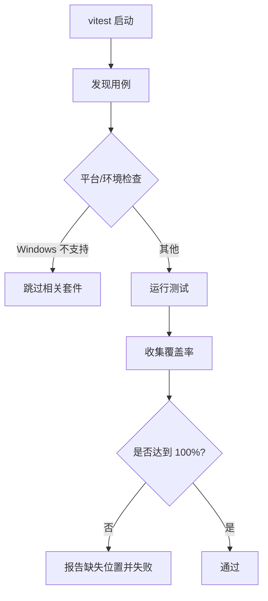
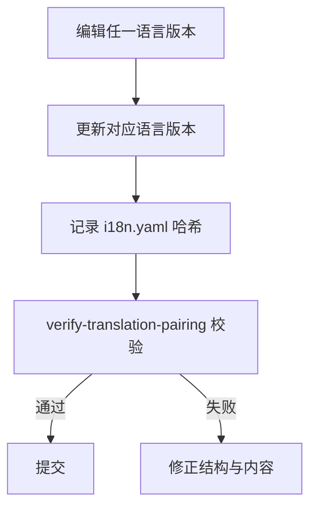
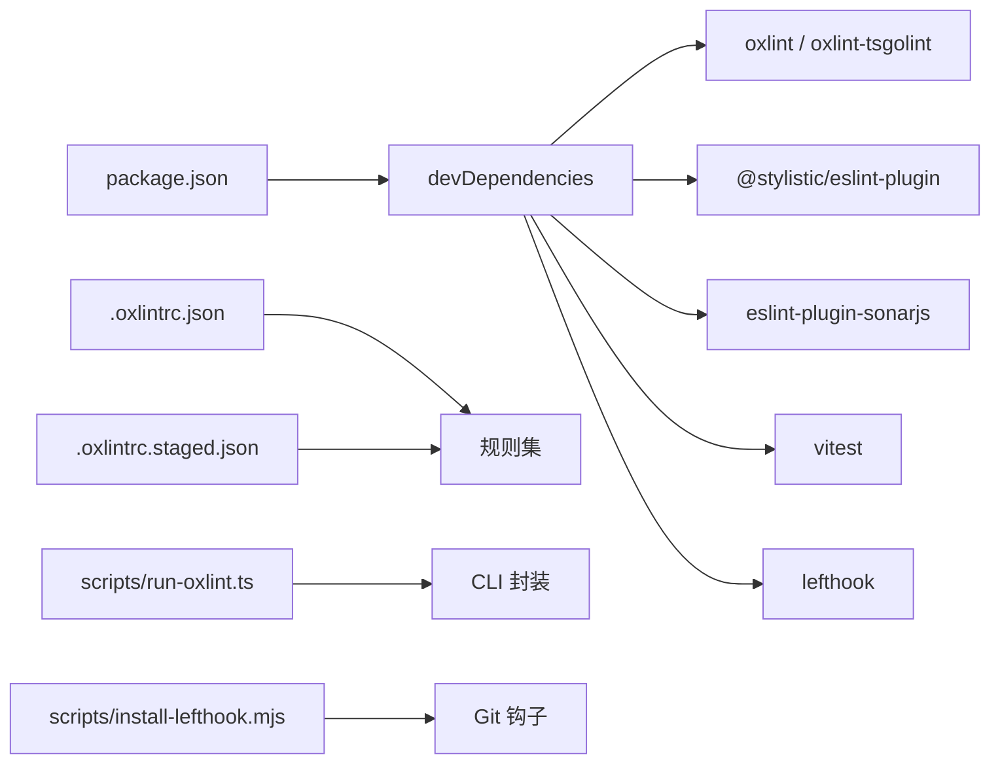

# 代码规范

<cite>
**本文引用的文件**
- [.oxlintrc.json](file://.oxlintrc.json)
- [.oxlintrc.staged.json](file://.oxlintrc.staged.json)
- [lefthook.yml](file://lefthook.yml)
- [package.json](file://package.json)
- [CONTRIBUTING.md](file://CONTRIBUTING.md)
- [.github/pull_request_template.md](file://.github/pull_request_template.md)
- [tsconfig.base.json](file://tsconfig.base.json)
- [vitest.config.ts](file://vitest.config.ts)
- [scripts/jsdoc.ts](file://scripts/jsdoc.ts)
- [scripts/run-oxlint.ts](file://scripts/run-oxlint.ts)
- [scripts/install-lefthook.mjs](file://scripts/install-lefthook.mjs)
- [docs/i18n/README.md](file://docs/i18n/README.md)
- [docs/i18n/translation-rules.md](file://docs/i18n/translation-rules.md)
- [scripts/verify-export-jsdoc.ts](file://scripts/verify-export-jsdoc.ts)
- [docs/testing.md](file://docs/testing.md)
</cite>

## 目录
1. [简介](#简介)
2. [项目结构](#项目结构)
3. [核心组件](#核心组件)
4. [架构总览](#架构总览)
5. [详细组件分析](#详细组件分析)
6. [依赖关系分析](#依赖关系分析)
7. [性能考虑](#性能考虑)
8. [故障排查指南](#故障排查指南)
9. [结论](#结论)
10. [附录](#附录)

## 简介
本规范面向 DeepSeek Harness 贡献者，统一 TypeScript 编码风格、命名约定与文件组织原则；明确 Oxlint 规则、ESLint 兼容插件与预提交钩子的配置与使用；定义代码审查流程（PR 模板、审查清单与反馈处理）；规定文档编写标准（JSDoc、README 格式与 API 文档）；说明国际化支持（翻译文件管理与多语言维护）；总结安全编码实践与常见反模式避免方法；为贡献者提供可执行的代码质量门槛与维护指引。

## 项目结构
仓库采用 monorepo 组织：apps、packages、examples、scripts、website、native 等子模块通过 pnpm workspaces 管理。根级配置文件集中定义类型检查、测试、构建与质量门禁：
- 类型与路径解析：tsconfig.base.json 提供全局编译选项与路径映射，确保跨包引用一致。
- 测试与覆盖率：vitest.config.ts 定义用例范围、覆盖阈值（每文件 100%）、平台差异与进程隔离策略。
- 代码质量：.oxlintrc.json 与 .oxlintrc.staged.json 分别用于全量与暂存区快速校验；scripts/run-oxlint.ts 封装执行入口与线程参数。
- 预提交与推送钩子：lefthook.yml 在 pre-commit/pre-push 阶段执行翻译配对校验、第三方声明生成、空白字符检查与类型检查。
- 脚本与工具：scripts/* 提供 JSDoc 完整性校验、导出 API 文档校验、安装 lefthook 等能力。

图表来源
- [lefthook.yml:5-55](file://lefthook.yml#L5-L55)
- [.oxlintrc.json:1-322](file://.oxlintrc.json#L1-L322)
- [.oxlintrc.staged.json:1-23](file://.oxlintrc.staged.json#L1-L23)
- [vitest.config.ts:117-285](file://vitest.config.ts#L117-L285)
- [scripts/run-oxlint.ts:49-89](file://scripts/run-oxlint.ts#L49-L89)
- [scripts/verify-export-jsdoc.ts:576-618](file://scripts/verify-export-jsdoc.ts#L576-L618)

章节来源
- [package.json:19-142](file://package.json#L19-L142)
- [tsconfig.base.json:5-27](file://tsconfig.base.json#L5-L27)
- [vitest.config.ts:117-285](file://vitest.config.ts#L117-L285)
- [.oxlintrc.json:1-322](file://.oxlintrc.json#L1-L322)
- [lefthook.yml:5-55](file://lefthook.yml#L5-L55)

## 核心组件
- 类型系统与路径解析：tsconfig.base.json 启用严格模式、精确可选属性、禁止隐式覆盖、禁止 switch 穿透、禁用未使用变量/参数，并通过 paths 将内部别名指向源码而非构建产物，保证开发与测试一致性。
- 代码风格与静态检查：.oxlintrc.json 启用 type-aware 规则集，强制 const、rest/spread、禁止 any、await thenable、no-floating-promises、switch 穷尽检查等；@stylistic 插件统一缩进、引号、分号、逗号、行长等格式；sonarjs 插件检测重复分支与函数。
- 预提交与推送门禁：lefthook.yml 在暂存阶段运行轻量 lint（关闭 typeAware 提升速度），并自动修复；pre-push 执行类型检查；同时维护翻译配对与第三方声明一致性。
- 测试与覆盖率：vitest.config.ts 设置 perFile 100% 覆盖率阈值，按平台与进程边界排除不可测路径，使用 v8 覆盖率并提供缺失位置报告。
- JSDoc 与导出 API 文档：scripts/jsdoc.ts 提供 JSDoc 解析与参数/返回校验；scripts/verify-export-jsdoc.ts 扫描非 vendor 包的导出，要求描述性注释与必要 @param/@returns。

章节来源
- [tsconfig.base.json:5-27](file://tsconfig.base.json#L5-L27)
- [.oxlintrc.json:32-142](file://.oxlintrc.json#L32-L142)
- [.oxlintrc.json:217-300](file://.oxlintrc.json#L217-L300)
- [lefthook.yml:5-55](file://lefthook.yml#L5-L55)
- [vitest.config.ts:160-283](file://vitest.config.ts#L160-L283)
- [scripts/jsdoc.ts:24-186](file://scripts/jsdoc.ts#L24-L186)
- [scripts/verify-export-jsdoc.ts:1-8](file://scripts/verify-export-jsdoc.ts#L1-L8)

## 架构总览
下图展示从开发到提交的完整质量流水线：编辑器/IDE 与本地命令触发 Oxlint 与 Vitest；Git 钩子在提交前执行轻量校验与修复；推送前进行类型检查；CI 执行更严格的矩阵门控。

图表来源
- [lefthook.yml:5-55](file://lefthook.yml#L5-L55)
- [.oxlintrc.staged.json:1-23](file://.oxlintrc.staged.json#L1-L23)
- [scripts/run-oxlint.ts:49-89](file://scripts/run-oxlint.ts#L49-L89)
- [vitest.config.ts:117-285](file://vitest.config.ts#L117-L285)

## 详细组件分析

### TypeScript 编码规范与类型系统
- 严格编译选项：启用 strict、noUncheckedIndexedAccess、exactOptionalPropertyTypes、noImplicitOverride、noFallthroughCasesInSwitch、noUnusedLocals/Parameters。
- 模块与路径：moduleResolution=bundler，paths 将内部别名映射到 src，避免测试加载 lib 导致单例重复。
- 兼容性：允许 import .ts 扩展名并重写相对导入扩展名，便于 IDE 与工具链体验。

章节来源
- [tsconfig.base.json:5-27](file://tsconfig.base.json#L5-L27)
- [tsconfig.base.json:27-277](file://tsconfig.base.json#L27-L277)

### 代码风格与静态检查（Oxlint + ESLint 兼容）
- 基础规则：禁止 var、优先 const/rest/spread、禁止未使用表达式/变量、禁止数组构造器、禁止无意义的 void 操作符等。
- TypeScript 规则：禁止 any、await thenable、no-floating-promises、no-misused-promises、switch 穷尽检查、require-await（生产源）、restrict-template-expressions 等。
- 格式化（@stylistic）：2 空格缩进、不使用分号、单引号、多行逗号、末尾换行、对象大括号间距、箭头函数括号、成员分隔符样式、行长限制（140）。
- 重复逻辑检测（sonarjs）：重复分支、重复条件、重复函数、重复测试标题等。
- 暂存区配置：.oxlintrc.staged.json 继承主配置但关闭 typeAware，提升提交速度。

图表来源
- [.oxlintrc.json:32-142](file://.oxlintrc.json#L32-L142)
- [.oxlintrc.json:217-300](file://.oxlintrc.json#L217-L300)
- [.oxlintrc.staged.json:1-23](file://.oxlintrc.staged.json#L1-L23)
- [lefthook.yml:17-22](file://lefthook.yml#L17-L22)

章节来源
- [.oxlintrc.json:1-322](file://.oxlintrc.json#L1-L322)
- [.oxlintrc.staged.json:1-23](file://.oxlintrc.staged.json#L1-L23)
- [scripts/run-oxlint.ts:49-89](file://scripts/run-oxlint.ts#L49-L89)

### 预提交钩子与推送门禁
- pre-commit：
  - 翻译配对校验：仅对暂存的 i18n 文件运行 verify-translation-pairing。
  - 归档 Agent Notes 校验。
  - 暂存区 lint：调用 run-oxlint.ts，使用 staged 配置并尝试修复。
  - 第三方声明生成：根据 package manifests 重新生成 THIRD_PARTY_NOTICES.md 并加入暂存。
  - 空白与换行检查：git diff --cached --check。
  - vendor manifest 守卫。
- pre-push：执行类型检查（pnpm run typecheck）。

章节来源
- [lefthook.yml:5-55](file://lefthook.yml#L5-L55)
- [package.json:19-142](file://package.json#L19-L142)

### 测试与覆盖率
- 用例范围：packages/*/tests、apps/*/tests、examples/*/tests、scripts/**/*.spec.ts。
- 覆盖率阈值：perFile 100%，语句/分支/函数/行均 100%。
- 平台与进程隔离：Windows 不支持的包与测试被排除；进程绑定测试单独运行；pwsh 可用性影响特定覆盖豁免。
- 报告：CI 下输出缺失位置报告，本地额外生成 HTML。

图表来源
- [vitest.config.ts:21-84](file://vitest.config.ts#L21-L84)
- [vitest.config.ts:117-285](file://vitest.config.ts#L117-L285)

章节来源
- [vitest.config.ts:117-285](file://vitest.config.ts#L117-L285)
- [docs/testing.md:7-15](file://docs/testing.md#L7-L15)

### JSDoc 与 API 文档规范
- 公共导出必须包含描述性 JSDoc；函数/类方法需 @param 与 @returns（非 void/Promise<void> 时）。
- 校验工具：scripts/jsdoc.ts 提供解析与校验；scripts/verify-export-jsdoc.ts 扫描所有非 vendor 包导出，汇总违规并退出码指示失败。
- 建议：保持描述简洁专业，避免空标签；对继承成员遵循“基类拥有文档”的原则，新增参数需补充 @param。

章节来源
- [scripts/jsdoc.ts:24-186](file://scripts/jsdoc.ts#L24-L186)
- [scripts/verify-export-jsdoc.ts:1-8](file://scripts/verify-export-jsdoc.ts#L1-L8)
- [scripts/verify-export-jsdoc.ts:576-618](file://scripts/verify-export-jsdoc.ts#L576-L618)

### 国际化支持与多语言维护
- 配对契约：每个文档由英文、中文与一致性记录（.i18n.yaml）组成；三者必须同 PR 合并。
- 一致性记录：记录两端最新确认内容的 blob 哈希，确保内容同步；变更需重新记录。
- 语言切换器：中文文件首行链接回英文；英文文件首行链接回中文（生成源除外）。
- 结构保真：标题层级、列表、表格、代码块、链接目标需一一对应；中文排版遵循团队规范。
- 门禁：verify-translation-pairing 在 pre-commit 与 doc-sync 中运行，确保成对文件完整且一致。

图表来源
- [docs/i18n/README.md:7-23](file://docs/i18n/README.md#L7-L23)
- [docs/i18n/README.md:24-40](file://docs/i18n/README.md#L24-L40)
- [docs/i18n/translation-rules.md:22-33](file://docs/i18n/translation-rules.md#L22-L33)
- [lefthook.yml:7-15](file://lefthook.yml#L7-L15)

章节来源
- [docs/i18n/README.md:7-40](file://docs/i18n/README.md#L7-L40)
- [docs/i18n/translation-rules.md:7-39](file://docs/i18n/translation-rules.md#L7-L39)
- [lefthook.yml:7-15](file://lefthook.yml#L7-L15)

### 代码审查流程
- PR 模板：关联 Issue、变更与验证摘要；进入评审的非 Draft PR 至少引用一个同仓库 Issue。
- 审查清单建议：
  - 功能正确性与边界情况
  - 类型与运行时行为（结合 vitest 与 e2e/snapshot）
  - 覆盖率是否达标（perFile 100%）
  - JSDoc 是否完整（verify-export-jsdoc）
  - 翻译配对是否一致（verify-translation-pairing）
  - 是否符合 Oxlint 规则与格式化
- 反馈处理：按评论逐项修复，必要时补充测试与文档；涉及翻译的变更需同步更新另一端并重新记录哈希。

章节来源
- [.github/pull_request_template.md:1-14](file://.github/pull_request_template.md#L1-L14)
- [docs/testing.md:7-15](file://docs/testing.md#L7-L15)
- [scripts/verify-export-jsdoc.ts:576-618](file://scripts/verify-export-jsdoc.ts#L576-L618)
- [docs/i18n/README.md:24-40](file://docs/i18n/README.md#L24-L40)

### 安全编码实践与常见反模式
- 禁止 any：typescript/no-explicit-any 强制错误，确有需要时使用窄化抑制并附理由。
- 避免悬挂 Promise：typescript/no-floating-promises 捕获未处理的异步。
- 避免误用 new/this：typescript/no-misused-new、no-this-alias。
- 避免不安全赋值/调用/返回：typescript/no-unsafe-* 系列规则。
- 避免冗余与危险断言：no-non-null-assertion（生产源）、no-extra-non-null-assertion。
- 模板表达式限制：restrict-template-expressions 防止任意类型拼接。
- 字符串与类型转换：no-base-to-string、no-unnecessary-type-conversion。
- 事件与回调：use-unknown-in-catch-callback-variable 避免 catch 中的 any。
- 重复逻辑与死代码：sonarjs 重复分支/函数检测，配合覆盖率门禁识别潜在死代码。

章节来源
- [.oxlintrc.json:32-142](file://.oxlintrc.json#L32-L142)
- [.oxlintrc.json:217-300](file://.oxlintrc.json#L217-L300)
- [vitest.config.ts:160-283](file://vitest.config.ts#L160-L283)

## 依赖关系分析
- 工具链依赖：
  - oxlint 与 oxlint-tsgolint：提供类型感知规则与 TS 插件。
  - @stylistic/eslint-plugin 与 eslint-plugin-sonarjs：通过 Oxlint JS 插件兼容层运行，维持既有格式与重复逻辑规则。
  - tsx：用于运行脚本与钩子任务。
  - vitest：测试与覆盖率。
  - lefthook：Git 钩子管理。
- 配置依赖：
  - .oxlintrc.staged.json 继承 .oxlintrc.json，但关闭 typeAware。
  - scripts/run-oxlint.ts 封装线程数与环境变量，统一执行入口。
  - scripts/install-lefthook.mjs 负责安装钩子与配对合并驱动。

图表来源
- [package.json:144-181](file://package.json#L144-L181)
- [.oxlintrc.json:1-322](file://.oxlintrc.json#L1-L322)
- [.oxlintrc.staged.json:1-23](file://.oxlintrc.staged.json#L1-L23)
- [scripts/run-oxlint.ts:49-89](file://scripts/run-oxlint.ts#L49-L89)
- [scripts/install-lefthook.mjs:691-794](file://scripts/install-lefthook.mjs#L691-L794)

章节来源
- [package.json:144-181](file://package.json#L144-L181)
- [.oxlintrc.json:1-322](file://.oxlintrc.json#L1-L322)
- [.oxlintrc.staged.json:1-23](file://.oxlintrc.staged.json#L1-L23)
- [scripts/run-oxlint.ts:49-89](file://scripts/run-oxlint.ts#L49-L89)
- [scripts/install-lefthook.mjs:691-794](file://scripts/install-lefthook.mjs#L691-L794)

## 性能考虑
- 提交前使用 staged 配置关闭 typeAware，减少耗时；全量检查在 CI 或本地 typecheck 中执行。
- Vitest 使用 fork 池避免共享线程问题；进程绑定测试单独运行，降低竞争。
- 覆盖率报告在 CI 下输出缺失位置，便于快速定位；HTML 报告仅在本地生成。
- Oxlint 支持线程数控制（DSH_OXLINT_THREADS），可通过环境变量调节并行度。

章节来源
- [.oxlintrc.staged.json:1-23](file://.oxlintrc.staged.json#L1-L23)
- [vitest.config.ts:124-158](file://vitest.config.ts#L124-L158)
- [scripts/run-oxlint.ts:25-39](file://scripts/run-oxlint.ts#L25-L39)

## 故障排查指南
- 提交失败（lint）：查看 Oxlint 输出，按规则修复；必要时使用 --fix；若仍失败，检查暂存区文件是否匹配 glob。
- 类型检查失败：运行 pnpm run typecheck；关注 tsconfig.base.json 的路径映射与严格规则。
- 覆盖率不达标：依据 vitest 报告定位未覆盖文件；注意 Windows 与 pwsh 相关豁免；补充测试或调整豁免。
- JSDoc 不完整：运行 verify-export-jsdoc；按提示补充描述、@param、@returns。
- 翻译不一致：运行 verify-translation-pairing；根据提示修正结构与内容，并重新记录哈希。
- 钩子安装失败：检查 Git 版本与工作树配置；必要时清理 dsh-hooks 目录并重新安装。

章节来源
- [lefthook.yml:5-55](file://lefthook.yml#L5-L55)
- [vitest.config.ts:160-283](file://vitest.config.ts#L160-L283)
- [scripts/verify-export-jsdoc.ts:576-618](file://scripts/verify-export-jsdoc.ts#L576-L618)
- [docs/i18n/README.md:24-40](file://docs/i18n/README.md#L24-L40)
- [scripts/install-lefthook.mjs:691-794](file://scripts/install-lefthook.mjs#L691-L794)

## 结论
本规范通过严格的类型系统、统一的代码风格、完善的预提交与推送门禁、严格的测试与覆盖率要求、完整的 JSDoc 与 API 文档校验、以及健壮的国际化配对机制，构建了高质量、可维护、可扩展的开发流程。贡献者应遵循上述标准，确保每次提交都满足质量门槛，并在审查中保持一致性与准确性。

## 附录
- 贡献方式：当前仓库暂不接受外部 PR，欢迎通过讨论、生态贡献与社区帮助参与。
- 测试分层：单元、覆盖率、真实 API e2e、快照、Web 浏览器快照等分层策略与最佳实践。

章节来源
- [CONTRIBUTING.md:1-24](file://CONTRIBUTING.md#L1-L24)
- [docs/testing.md:7-15](file://docs/testing.md#L7-L15)