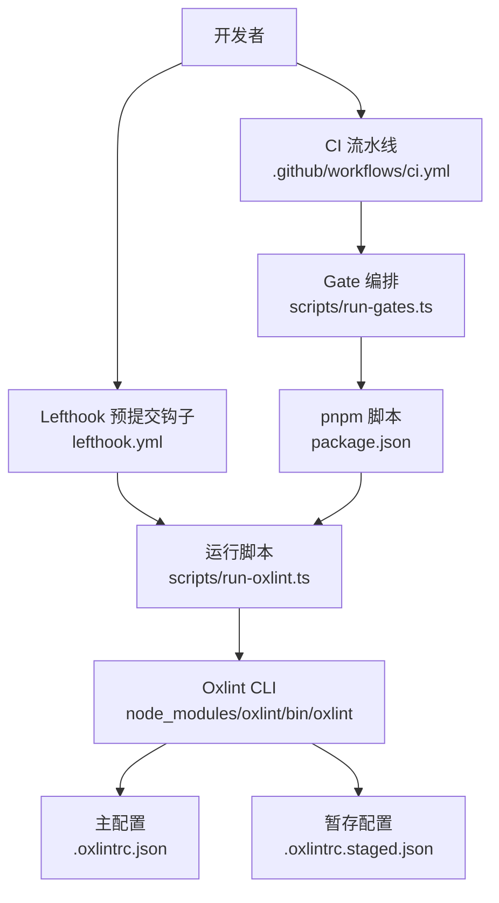
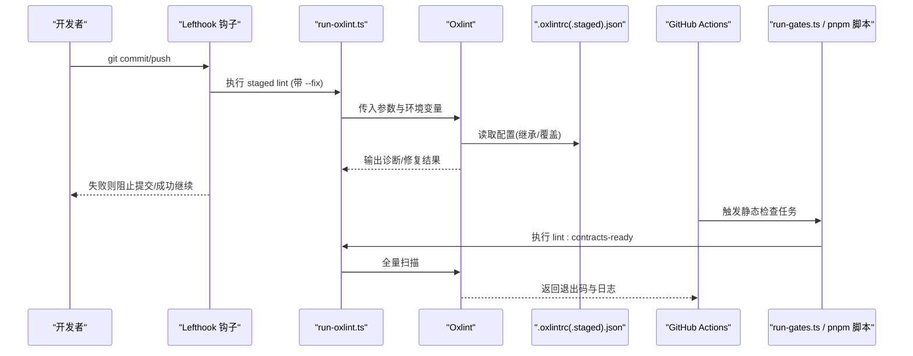
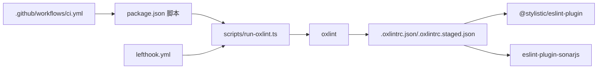

# 代码质量检查工具

<cite>
**本文引用的文件**
- [.oxlintrc.json](file://.oxlintrc.json)
- [.oxlintrc.staged.json](file://.oxlintrc.staged.json)
- [lefthook.yml](file://lefthook.yml)
- [package.json](file://package.json)
- [scripts/run-oxlint.ts](file://scripts/run-oxlint.ts)
- [scripts/install-lefthook.mjs](file://scripts/install-lefthook.mjs)
- [.github/workflows/ci.yml](file://.github/workflows/ci.yml)
- [scripts/oxlint-contract.spec.ts](file://scripts/oxlint-contract.spec.ts)
- [scripts/run-oxlint.spec.ts](file://scripts/run-oxlint.spec.ts)
</cite>

## 目录
1. [简介](#简介)
2. [项目结构](#项目结构)
3. [核心组件](#核心组件)
4. [架构总览](#架构总览)
5. [详细组件分析](#详细组件分析)
6. [依赖关系分析](#依赖关系分析)
7. [性能考量](#性能考量)
8. [故障排查指南](#故障排查指南)
9. [结论](#结论)
10. [附录](#附录)

## 简介
本指南面向希望在本仓库中统一使用 Oxlint 进行代码质量检查的开发者与 CI 维护者。内容涵盖：
- Oxlint 配置选项：规则分类、插件配置、环境设置
- 预提交钩子（Git hooks）：安装方式、触发时机、失败处理
- 代码格式化规则：单引号、分号、缩进、行长度等
- 不同类型文件的差异化检查：源代码、测试、示例
- 本地开发环境：IDE 集成、自动修复、实时检查
- CI/CD 集成：自动化流程、报告、质量门禁
- 如何添加新规则与自定义规则

## 项目结构
仓库通过集中式配置文件与脚本，将 Oxlint 的规则、插件、忽略模式、以及不同场景下的覆盖策略统一管理，并通过 Lefthook 在本地 Git 钩子中快速执行，再通过 GitHub Actions 在 CI 中执行完整的质量门禁。

图表来源
- [lefthook.yml:5-22](file://lefthook.yml#L5-L22)
- [scripts/run-oxlint.ts:1-89](file://scripts/run-oxlint.ts#L1-L89)
- [.oxlintrc.json:1-322](file://.oxlintrc.json#L1-L322)
- [.oxlintrc.staged.json:1-23](file://.oxlintrc.staged.json#L1-L23)
- [.github/workflows/ci.yml:107-113](file://.github/workflows/ci.yml#L107-L113)
- [package.json:19-32](file://package.json#L19-L32)

章节来源
- [.oxlintrc.json:1-322](file://.oxlintrc.json#L1-L322)
- [.oxlintrc.staged.json:1-23](file://.oxlintrc.staged.json#L1-L23)
- [lefthook.yml:1-56](file://lefthook.yml#L1-L56)
- [package.json:19-32](file://package.json#L19-L32)
- [scripts/run-oxlint.ts:1-89](file://scripts/run-oxlint.ts#L1-L89)
- [.github/workflows/ci.yml:107-113](file://.github/workflows/ci.yml#L107-L113)

## 核心组件
- 主配置文件 .oxlintrc.json：定义全局规则、插件、环境、忽略模式与按路径覆盖的 overrides
- 暂存配置文件 .oxlintrc.staged.json：继承主配置，关闭类型感知以提升预提交速度
- 运行脚本 scripts/run-oxlint.ts：封装 Oxlint 调用、线程控制、修复重试
- 钩子配置 lefthook.yml：在 pre-commit/pre-push 阶段触发轻量检查
- CI 工作流 .github/workflows/ci.yml：在 PR/Master 上执行静态检查、覆盖率、快照等门禁
- 包脚本 package.json：暴露 lint/lint:fix 等命令，串联构建与检查

章节来源
- [.oxlintrc.json:1-322](file://.oxlintrc.json#L1-L322)
- [.oxlintrc.staged.json:1-23](file://.oxlintrc.staged.json#L1-L23)
- [scripts/run-oxlint.ts:1-89](file://scripts/run-oxlint.ts#L1-L89)
- [lefthook.yml:1-56](file://lefthook.yml#L1-L56)
- [.github/workflows/ci.yml:107-113](file://.github/workflows/ci.yml#L107-L113)
- [package.json:19-32](file://package.json#L19-L32)

## 架构总览
下图展示了从开发者提交到 CI 的完整质量检查链路，包括本地预提交与 CI 全量检查的差异与协作。

图表来源
- [lefthook.yml:17-22](file://lefthook.yml#L17-L22)
- [scripts/run-oxlint.ts:25-38](file://scripts/run-oxlint.ts#L25-L38)
- [.oxlintrc.json:1-322](file://.oxlintrc.json#L1-L322)
- [.oxlintrc.staged.json:1-23](file://.oxlintrc.staged.json#L1-L23)
- [.github/workflows/ci.yml:107-113](file://.github/workflows/ci.yml#L107-L113)
- [package.json:29-32](file://package.json#L29-L32)

## 详细组件分析

### Oxlint 配置项详解（规则分类、插件、环境）
- 规则分类 categories：可整体开关某类规则（如 correctness），便于全局治理
- 选项 options：typeAware 开启类型感知；reportUnusedDisableDirectives 用于提示未使用的禁用指令
- 环境 env：启用内置环境（如 builtin）
- 忽略 ignorePatterns：排除生成物、第三方、非 TS 程序等
- 覆盖 overrides：按文件路径分组，叠加更严格的规则集与插件
- 插件 plugins/jsPlugins：引入 TypeScript、SonarJS、Stylistic 等规则集

章节来源
- [.oxlintrc.json:4-13](file://.oxlintrc.json#L4-L13)
- [.oxlintrc.json:14-31](file://.oxlintrc.json#L14-L31)
- [.oxlintrc.json:32-320](file://.oxlintrc.json#L32-L320)

### 预提交钩子（Git hooks）
- 安装方式：通过 postinstall 自动安装 Lefthook，并在工作区安全地配置 hooks 路径
- 触发时机：
  - pre-commit：对暂存文件执行翻译配对校验、归档笔记校验、staged lint（含自动修复）、三方通知更新、空白字符检查、vendor manifest 守卫
  - pre-push：执行类型检查
- 失败处理：任一 job 失败即中断提交；pre-commit 中的 lint 支持 stage_fixed 自动重新暂存修复后的文件

章节来源
- [package.json:142](file://package.json#L142)
- [lefthook.yml:5-39](file://lefthook.yml#L5-L39)
- [lefthook.yml:40-56](file://lefthook.yml#L40-L56)
- [scripts/install-lefthook.mjs:691-794](file://scripts/install-lefthook.mjs#L691-L794)

### 代码格式化规则（单引号、分号、缩进、行长度等）
- 缩进：2 空格
- 分号：不使用分号
- 引号：单引号，避免转义
- 尾随逗号：多行时保留
- 行尾换行：始终存在
- 尾部空格：禁止
- 对象花括号间距：始终有空格
- 箭头函数括号：按需包裹，块体必须包裹
- 成员分隔符风格：多行无分隔符，单行分号且不强制末尾分号
- 行长度：最大 140 列（仅校验，无法自动修复）

章节来源
- [.oxlintrc.json:239-296](file://.oxlintrc.json#L239-L296)

### 不同类型文件的差异化检查
- 源码与测试通用严格规则：禁止 var、优先 const、限制 any、要求 await、禁止浮空 Promise、严格类型操作等
- 源码额外规则：禁止非空断言、模板表达式限制、switch 穷尽性检查等
- 示例代码放宽：允许某些回调不写 async（演示用途）
- 测试文件放宽：允许非 Error 抛出、非空断言、模板表达式限制关闭等
- 特定 fixture 豁免：为保持语法覆盖或 TypeGraph 展示而临时关闭部分规则

章节来源
- [.oxlintrc.json:32-142](file://.oxlintrc.json#L32-L142)
- [.oxlintrc.json:143-188](file://.oxlintrc.json#L143-L188)
- [.oxlintrc.json:189-208](file://.oxlintrc.json#L189-L208)
- [.oxlintrc.json:302-319](file://.oxlintrc.json#L302-L319)

### 本地开发环境设置（IDE 集成、自动修复、实时检查）
- IDE 集成：
  - 使用 Oxlint 作为默认 Linter（仓库已声明依赖 oxlint）
  - 可在编辑器中配置以 .oxlintrc.json 为规则源
- 自动修复：
  - 使用 pnpm run lint:fix 或 Lefthook 的 staged lint 自动修复格式问题
  - 修复过程会尝试二次运行以收敛 JS 插件修复冲突
- 实时检查：
  - 通过 Lefthook 的 pre-commit 快速反馈
  - 可通过环境变量 DSH_OXLINT_THREADS 控制并发线程数

章节来源
- [package.json:147-172](file://package.json#L147-L172)
- [lefthook.yml:17-22](file://lefthook.yml#L17-L22)
- [scripts/run-oxlint.ts:51-84](file://scripts/run-oxlint.ts#L51-L84)
- [scripts/run-oxlint.ts:25-38](file://scripts/run-oxlint.ts#L25-L38)

### CI/CD 集成（自动化检查、报告、质量门禁）
- 触发条件：push 到 master、pull_request、手动调度
- 关键门禁：
  - 静态检查：调用 pnpm run check:ci:static（内部包含 lint 等）
  - 覆盖率：check:ci:coverage
  - 兼容性与产物：check:ci:consumers
  - Windows 相关：wine 阻塞检查、原生 Windows 完整检查
- 并行与资源：
  - 通过 DSH_GATE_CONCURRENCY、DSH_OXLINT_THREADS 等环境变量控制并发
  - 缓存 pnpm store、Playwright 浏览器等加速流水线

章节来源
- [.github/workflows/ci.yml:1-42](file://.github/workflows/ci.yml#L1-L42)
- [.github/workflows/ci.yml:107-113](file://.github/workflows/ci.yml#L107-L113)
- [.github/workflows/ci.yml:115-177](file://.github/workflows/ci.yml#L115-L177)
- [.github/workflows/ci.yml:178-258](file://.github/workflows/ci.yml#L178-L258)
- [.github/workflows/ci.yml:260-327](file://.github/workflows/ci.yml#L260-L327)
- [.github/workflows/ci.yml:338-490](file://.github/workflows/ci.yml#L338-L490)

### 如何添加新的检查规则与自定义规则配置
- 新增规则位置：在 .oxlintrc.json 的对应 overrides 中添加规则条目，或通过 plugins/jsPlugins 引入新规则集
- 影响范围：根据 files 匹配路径决定生效范围（src/tests/examples/scripts/website 等）
- 优先级：后定义的 override 会覆盖先前的规则
- 验证：通过仓库内的契约测试确保规则指纹稳定（例如规则集合哈希不变）
- 建议：
  - 先在目标路径的 override 中启用，观察告警
  - 逐步收紧，必要时为特定目录提供豁免
  - 使用 reportUnusedDisableDirectives 清理无用禁用指令

章节来源
- [.oxlintrc.json:32-320](file://.oxlintrc.json#L32-L320)
- [scripts/oxlint-contract.spec.ts:157-197](file://scripts/oxlint-contract.spec.ts#L157-L197)

## 依赖关系分析
- 运行时依赖：
  - oxlint：核心检查器
  - @stylistic/eslint-plugin：格式化规则
  - eslint-plugin-sonarjs：重复代码/分支等检测
  - tsx：运行 TypeScript 脚本
- 钩子与流程：
  - lefthook：本地 Git 钩子管理
  - GitHub Actions：CI 编排
  - pnpm：工作区与脚本执行

图表来源
- [package.json:19-32](file://package.json#L19-L32)
- [scripts/run-oxlint.ts:1-89](file://scripts/run-oxlint.ts#L1-L89)
- [.oxlintrc.json:139-141](file://.oxlintrc.json#L139-L141)
- [.oxlintrc.json:227-229](file://.oxlintrc.json#L227-L229)
- [.oxlintrc.json:298-300](file://.oxlintrc.json#L298-L300)
- [lefthook.yml:17-22](file://lefthook.yml#L17-L22)
- [.github/workflows/ci.yml:107-113](file://.github/workflows/ci.yml#L107-L113)

章节来源
- [package.json:147-172](file://package.json#L147-L172)
- [.oxlintrc.json:139-141](file://.oxlintrc.json#L139-L141)
- [.oxlintrc.json:227-229](file://.oxlintrc.json#L227-L229)
- [.oxlintrc.json:298-300](file://.oxlintrc.json#L298-L300)
- [lefthook.yml:17-22](file://lefthook.yml#L17-L22)
- [.github/workflows/ci.yml:107-113](file://.github/workflows/ci.yml#L107-L113)

## 性能考量
- 预提交阶段关闭类型感知（typeAware: false）提升速度
- 通过 DSH_OXLINT_THREADS 统一控制 Oxlint 线程数，避免直接传参冲突
- 修复流程采用“首次捕获输出 + 二次运行”的策略，收敛 JS 插件修复冲突
- CI 中使用缓存（pnpm store、Playwright）减少冷启动时间
- 通过 Gate 编排与并发控制平衡速度与稳定性

章节来源
- [.oxlintrc.staged.json:4-6](file://.oxlintrc.staged.json#L4-L6)
- [scripts/run-oxlint.ts:25-38](file://scripts/run-oxlint.ts#L25-L38)
- [scripts/run-oxlint.ts:51-84](file://scripts/run-oxlint.ts#L51-L84)
- [.github/workflows/ci.yml:88-105](file://.github/workflows/ci.yml#L88-L105)
- [.github/workflows/ci.yml:191-192](file://.github/workflows/ci.yml#L191-L192)

## 故障排查指南
- 常见错误与定位：
  - 线程数无效：DSH_OXLINT_THREADS 必须为正整数，否则抛出错误
  - 直接传参冲突：禁止同时使用 --threads 与 DSH_OXLINT_THREADS
  - 未使用的禁用指令：启用 reportUnusedDisableDirectives 后会提示
  - 规则变更导致契约失败：通过契约测试发现规则指纹变化
- 修复步骤：
  - 调整 DSH_OXLINT_THREADS 或移除冲突参数
  - 清理或修正未使用的禁用指令
  - 更新规则并确认契约测试通过

章节来源
- [scripts/run-oxlint.ts:25-38](file://scripts/run-oxlint.ts#L25-L38)
- [scripts/run-oxlint.ts:51-84](file://scripts/run-oxlint.ts#L51-L84)
- [scripts/run-oxlint.spec.ts:12-27](file://scripts/run-oxlint.spec.ts#L12-L27)
- [scripts/oxlint-contract.spec.ts:230-255](file://scripts/oxlint-contract.spec.ts#L230-L255)

## 结论
本仓库通过集中化的 Oxlint 配置与脚本化封装，实现了从本地到 CI 的一致质量门禁。利用 Lefthook 实现快速反馈，结合 CI 的全量检查与覆盖率、快照等维度，形成闭环。通过 overrides 与插件机制，既能保证核心规则的严格性，又能针对测试、示例等场景灵活放宽。新增规则应遵循覆盖策略与契约测试，确保规则集稳定可控。

## 附录
- 常用命令
  - 本地检查：pnpm run lint
  - 本地修复：pnpm run lint:fix
  - 预提交检查：git commit（由 Lefthook 自动触发）
  - CI 静态检查：在 PR/Master 自动运行，也可通过工作流手动触发
- 环境变量
  - DSH_OXLINT_THREADS：控制 Oxlint 线程数
  - DSH_GATE_CONCURRENCY：Gate 并发度
  - NO_COLOR：禁用彩色输出（便于日志解析）

章节来源
- [package.json:19-32](file://package.json#L19-L32)
- [lefthook.yml:5-56](file://lefthook.yml#L5-L56)
- [.github/workflows/ci.yml:1-42](file://.github/workflows/ci.yml#L1-L42)