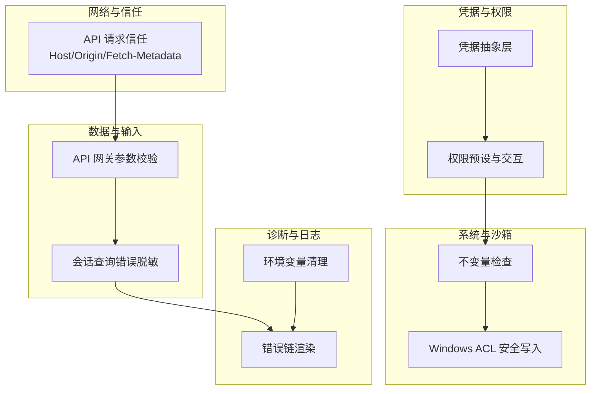
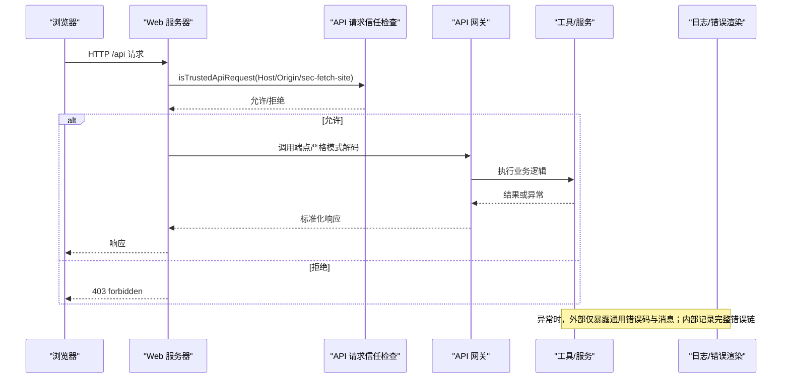
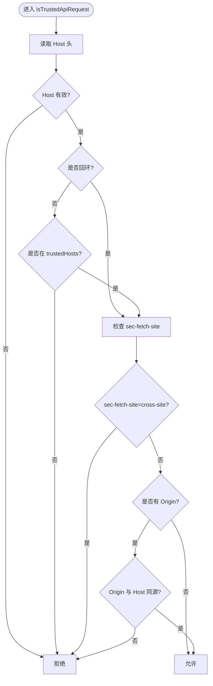
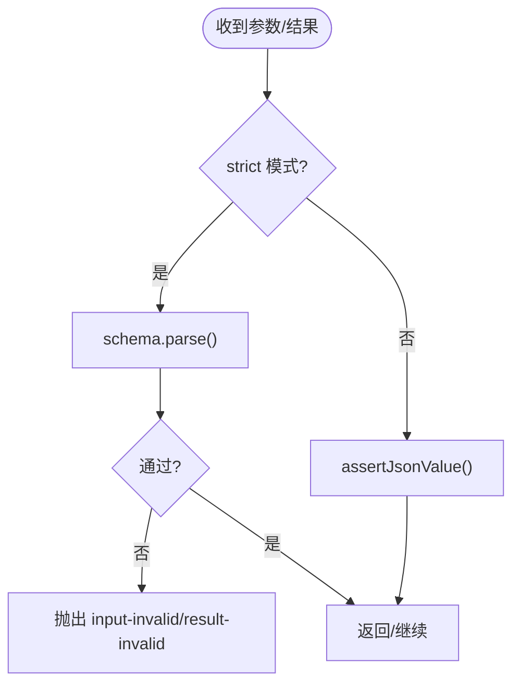
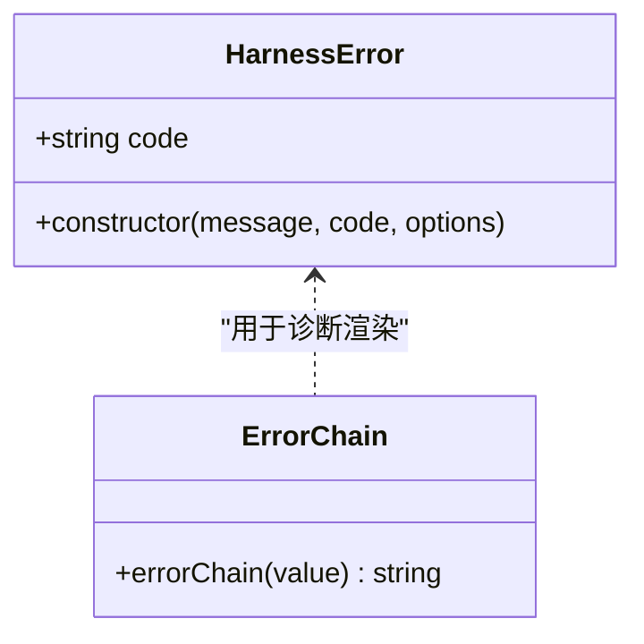
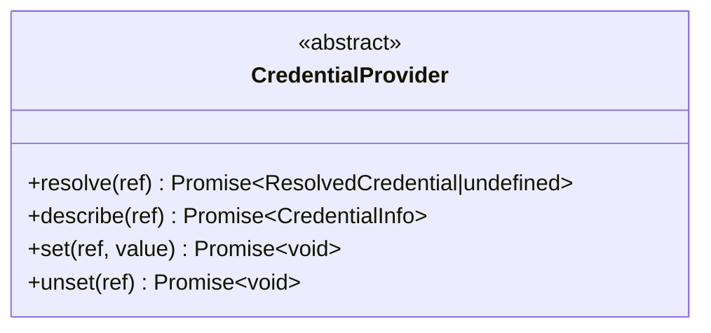
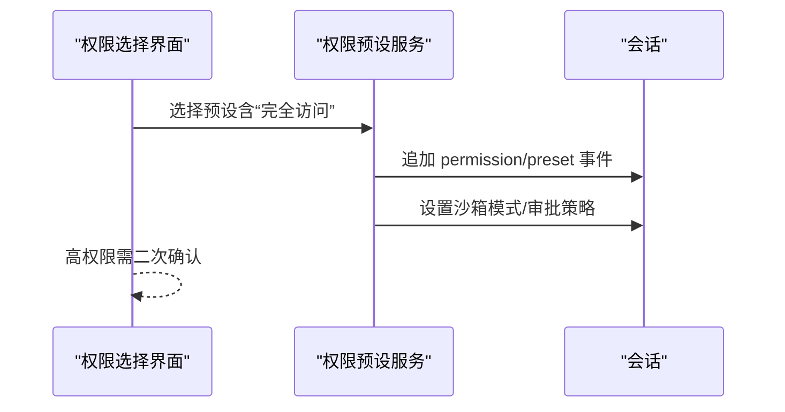
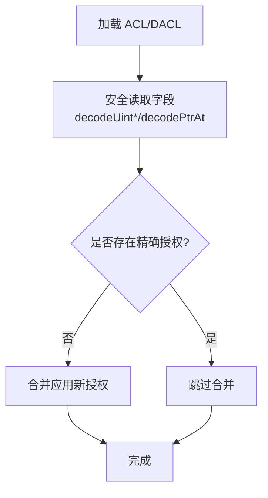
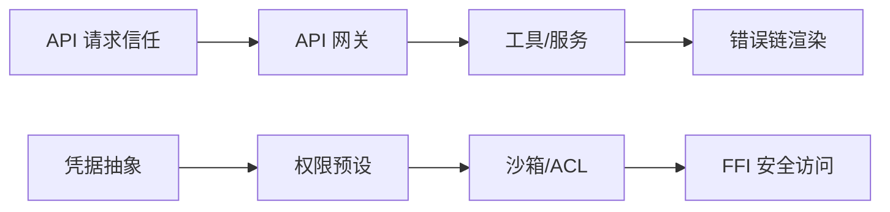

# 安全编码实践

<cite>
**本文引用的文件**
- [packages/client/connection/src/api-request-trust.ts](file://packages/client/connection/src/api-request-trust.ts)
- [packages/client/connection/tests/api-request-trust.host.spec.ts](file://packages/client/connection/tests/api-request-trust.host.spec.ts)
- [packages/llm/llm/src/error.ts](file://packages/llm/llm/src/error.ts)
- [packages/session-query/tool-session-query/tests/tool-session-query.spec.ts](file://packages/session-query/tool-session-query/tests/tool-session-query.spec.ts)
- [packages/subprocess/subprocess/tests/service.spec.ts](file://packages/subprocess/subprocess/tests/service.spec.ts)
- [packages/settings/settings/tests/redact.spec.ts](file://packages/settings/settings/tests/redact.spec.ts)
- [packages/credentials/credentials/src/index.ts](file://packages/credentials/credentials/src/index.ts)
- [docs/subsystems/credentials.md](file://docs/subsystems/credentials.md)
- [packages/interaction/permission-presets/src/index.ts](file://packages/interaction/permission-presets/src/index.ts)
- [packages/client/ui-permission-presets/src/client/presentation.ts](file://packages/client/ui-permission-presets/src/client/presentation.ts)
- [packages/client/ui-conversation/src/client/skeleton/PermissionSelect.tsx](file://packages/client/ui-conversation/src/client/skeleton/PermissionSelect.tsx)
- [packages/client/ui-conversation/src/client/skeleton/PermissionSelect.tsx](file://packages/client/ui-conversation/src/client/skeleton/PermissionSelect.tsx)
- [packages/client/ui-permission-presets/src/client/index.ts](file://packages/client/ui-permission-presets/src/client/index.ts)
- [packages/api/gateway/src/index.ts](file://packages/api/gateway/src/index.ts)
- [packages/api/gateway/tests/gateway.host.spec.ts](file://packages/api/gateway/tests/gateway.host.spec.ts)
- [packages/sandbox/sandbox-policy/src/invariant.ts](file://packages/sandbox/sandbox-policy/src/invariant.ts)
- [packages/sandbox/sandbox-windows-acl/src/acl.ts](file://packages/sandbox/sandbox-windows-acl/src/acl.ts)
- [packages/sandbox/sandbox-windows-acl/src/ffi.ts](file://packages/sandbox/sandbox-windows-acl/src/ffi.ts)
- [scripts/gen-doc-graphs.ts](file://scripts/gen-doc-graphs.ts)
</cite>

## 目录
1. [简介](#简介)
2. [项目结构](#项目结构)
3. [核心组件](#核心组件)
4. [架构总览](#架构总览)
5. [详细组件分析](#详细组件分析)
6. [依赖关系分析](#依赖关系分析)
7. [性能考虑](#性能考虑)
8. [故障排查指南](#故障排查指南)
9. [结论](#结论)
10. [附录](#附录)

## 简介
本指南面向在该项目中实现“安全编码”的开发者与架构师，聚焦以下主题：输入验证与清洗、敏感信息保护、常见漏洞防护（SQL注入、XSS、CSRF）、权限控制（最小权限、访问控制列表、角色管理）、内存与资源安全、网络安全（HTTPS、CORS、请求限制）、以及安全审计与漏洞扫描集成。内容基于仓库中的实际实现与测试用例进行提炼，确保可操作且可追溯。

## 项目结构
该仓库采用多包（monorepo）组织，安全相关能力分布在多个子包中：
- 客户端连接信任边界：对 /api 请求进行 Host/Origin/Fetch-Metadata 校验，防御 DNS 重绑定与跨站请求。
- 错误链渲染与诊断：统一错误码与原因链渲染，避免泄露内部细节。
- 会话查询工具的错误脱敏：对外返回通用错误消息，内部日志保留完整上下文。
- 凭据抽象：提供统一的凭据解析、描述、设置与删除接口，空值即未配置。
- 权限预设与交互：通过预设组合沙箱模式与审批策略，UI 强制二次确认高权限操作。
- API 网关参数校验：严格边界校验，拒绝非 JSON 原生类型与额外字段。
- 沙箱与系统级隔离：不变量检查、Windows ACL 安全写入等。
- 环境变量清理：子进程启动前剔除敏感键。
- 配置与文档：凭据子系统文档与脚本层面的有限字符串集合校验。

**图示来源**
- [packages/client/connection/src/api-request-trust.ts:1-124](file://packages/client/connection/src/api-request-trust.ts#L1-L124)
- [packages/api/gateway/src/index.ts:608-638](file://packages/api/gateway/src/index.ts#L608-L638)
- [packages/session-query/tool-session-query/tests/tool-session-query.spec.ts:702-733](file://packages/session-query/tool-session-query/tests/tool-session-query.spec.ts#L702-L733)
- [packages/credentials/credentials/src/index.ts:75-99](file://packages/credentials/credentials/src/index.ts#L75-L99)
- [packages/interaction/permission-presets/src/index.ts:185-433](file://packages/interaction/permission-presets/src/index.ts#L185-L433)
- [packages/sandbox/sandbox-policy/src/invariant.ts:23-42](file://packages/sandbox/sandbox-policy/src/invariant.ts#L23-L42)
- [packages/sandbox/sandbox-windows-acl/src/acl.ts:181-203](file://packages/sandbox/sandbox-windows-acl/src/acl.ts#L181-L203)
- [packages/llm/llm/src/error.ts:102-164](file://packages/llm/llm/src/error.ts#L102-L164)
- [packages/subprocess/subprocess/tests/service.spec.ts:78-100](file://packages/subprocess/subprocess/tests/service.spec.ts#L78-L100)

**章节来源**
- [packages/client/connection/src/api-request-trust.ts:1-124](file://packages/client/connection/src/api-request-trust.ts#L1-L124)
- [packages/api/gateway/src/index.ts:608-638](file://packages/api/gateway/src/index.ts#L608-L638)
- [packages/credentials/credentials/src/index.ts:75-99](file://packages/credentials/credentials/src/index.ts#L75-L99)
- [packages/interaction/permission-presets/src/index.ts:185-433](file://packages/interaction/permission-presets/src/index.ts#L185-L433)
- [packages/sandbox/sandbox-policy/src/invariant.ts:23-42](file://packages/sandbox/sandbox-policy/src/invariant.ts#L23-L42)
- [packages/sandbox/sandbox-windows-acl/src/acl.ts:181-203](file://packages/sandbox/sandbox-windows-acl/src/acl.ts#L181-L203)
- [packages/llm/llm/src/error.ts:102-164](file://packages/llm/llm/src/error.ts#L102-L164)
- [packages/subprocess/subprocess/tests/service.spec.ts:78-100](file://packages/subprocess/subprocess/tests/service.spec.ts#L78-L100)

## 核心组件
- 请求信任边界：对所有 /api 请求执行 Host 白名单、Origin 同源校验与跨站标记拒绝，防御 DNS 重绑定与跨站请求。
- 参数边界校验：API 网关使用严格模式解码并拒绝非 JSON 原生类型与多余字段，防止注入与畸形载荷。
- 错误与日志脱敏：对外返回稳定错误码与通用消息；内部日志记录完整错误链，包含循环引用检测。
- 凭据抽象：统一 resolve/describe/set/unset 接口，空值视为未配置，避免误用。
- 权限预设与交互：将沙箱模式与审批策略打包为预设，UI 对“完全访问”等高权限操作要求显式确认。
- 系统级隔离：不变量检查拦截非法事件；Windows ACL 安全写入 DACL，避免越权。
- 环境变量清理：子进程启动前剔除敏感键，降低泄漏面。

**章节来源**
- [packages/client/connection/src/api-request-trust.ts:90-123](file://packages/client/connection/src/api-request-trust.ts#L90-L123)
- [packages/api/gateway/src/index.ts:614-638](file://packages/api/gateway/src/index.ts#L614-L638)
- [packages/llm/llm/src/error.ts:102-164](file://packages/llm/llm/src/error.ts#L102-L164)
- [packages/credentials/credentials/src/index.ts:75-99](file://packages/credentials/credentials/src/index.ts#L75-L99)
- [packages/interaction/permission-presets/src/index.ts:185-433](file://packages/interaction/permission-presets/src/index.ts#L185-L433)
- [packages/sandbox/sandbox-policy/src/invariant.ts:23-42](file://packages/sandbox/sandbox-policy/src/invariant.ts#L23-L42)
- [packages/sandbox/sandbox-windows-acl/src/acl.ts:181-203](file://packages/sandbox/sandbox-windows-acl/src/acl.ts#L181-L203)
- [packages/subprocess/subprocess/tests/service.spec.ts:78-100](file://packages/subprocess/subprocess/tests/service.spec.ts#L78-L100)

## 架构总览
下图展示从浏览器到后端 RPC 的信任边界与校验流程，以及错误与权限控制的协同。

**图示来源**
- [packages/client/connection/src/api-request-trust.ts:90-123](file://packages/client/connection/src/api-request-trust.ts#L90-L123)
- [packages/api/gateway/src/index.ts:614-638](file://packages/api/gateway/src/index.ts#L614-L638)
- [packages/llm/llm/src/error.ts:102-164](file://packages/llm/llm/src/error.ts#L102-L164)

## 详细组件分析

### 组件A：API 请求信任边界（防 DNS 重绑定与跨站）
- 关键行为
  - 强制校验 Host，拒绝缺失或不可解析的 Host。
  - 仅允许回环地址或配置的 trustedHosts 白名单。
  - 拒绝 sec-fetch-site=cross-site 的请求。
  - 若存在 Origin，必须与 Host 同源；Origin=null 拒绝。
- 设计要点
  - 使用 WHATWG URL 规范化比较，避免大小写/默认端口差异。
  - 对 trustedHosts 条目进行加载时断言，确保是裸 authority（host 或 host:port）。
- 典型场景
  - 本地开发：localhost/127.0.0.1/[::1] 均被接受。
  - 部署环境：通过 trustedHosts 精确匹配 host:port 或 host（任意端口）。

**图示来源**
- [packages/client/connection/src/api-request-trust.ts:90-123](file://packages/client/connection/src/api-request-trust.ts#L90-L123)
- [packages/client/connection/tests/api-request-trust.host.spec.ts:22-108](file://packages/client/connection/tests/api-request-trust.host.spec.ts#L22-L108)

**章节来源**
- [packages/client/connection/src/api-request-trust.ts:1-124](file://packages/client/connection/src/api-request-trust.ts#L1-L124)
- [packages/client/connection/tests/api-request-trust.host.spec.ts:22-108](file://packages/client/connection/tests/api-request-trust.host.spec.ts#L22-L108)

### 组件B：API 网关参数边界校验（防注入与畸形载荷）
- 关键行为
  - 严格模式解码：使用 schema 解析输入，拒绝未知字段与非 JSON 原生类型。
  - 对业务结果也进行边界校验，保证输出符合契约。
- 设计要点
  - 失败时抛出带稳定 code 的网关错误，便于上层路由处理。
  - 拒绝装饰数组、Symbol 属性、getter 等非 JSON 原生结构。

**图示来源**
- [packages/api/gateway/src/index.ts:614-638](file://packages/api/gateway/src/index.ts#L614-L638)
- [packages/api/gateway/tests/gateway.host.spec.ts:814-845](file://packages/api/gateway/tests/gateway.host.spec.ts#L814-L845)

**章节来源**
- [packages/api/gateway/src/index.ts:608-638](file://packages/api/gateway/src/index.ts#L608-L638)
- [packages/api/gateway/tests/gateway.host.spec.ts:814-845](file://packages/api/gateway/tests/gateway.host.spec.ts#L814-L845)

### 组件C：错误链渲染与日志脱敏（防信息泄露）
- 关键行为
  - 将 Error.cause 链与 AggregateError 成员展开为可读文本，用于诊断表面（消息、通知、日志）。
  - 检测循环引用，避免无限递归。
  - 对外仅暴露稳定 code 与通用 message；内部 warn 日志可保留完整上下文。
- 设计要点
  - 对宿主提供的对象进行健壮性保护，捕获可能抛出的 toString/getter。
  - 对 provider 错误进行分类（如上下文窗口超限、配额耗尽），便于重试与提示。

**图示来源**
- [packages/llm/llm/src/error.ts:1-164](file://packages/llm/llm/src/error.ts#L1-L164)
- [packages/session-query/tool-session-query/tests/tool-session-query.spec.ts:702-733](file://packages/session-query/tool-session-query/tests/tool-session-query.spec.ts#L702-L733)
- [packages/session-query/tool-session-query/tests/tool-session-query.spec.ts:826-854](file://packages/session-query/tool-session-query/tests/tool-session-query.spec.ts#L826-L854)
- [packages/session-query/tool-session-query/tests/tool-session-query.spec.ts:1489-1507](file://packages/session-query/tool-session-query/tests/tool-session-query.spec.ts#L1489-L1507)

**章节来源**
- [packages/llm/llm/src/error.ts:102-164](file://packages/llm/llm/src/error.ts#L102-L164)
- [packages/session-query/tool-session-query/tests/tool-session-query.spec.ts:702-733](file://packages/session-query/tool-session-query/tests/tool-session-query.spec.ts#L702-L733)
- [packages/session-query/tool-session-query/tests/tool-session-query.spec.ts:826-854](file://packages/session-query/tool-session-query/tests/tool-session-query.spec.ts#L826-L854)
- [packages/session-query/tool-session-query/tests/tool-session-query.spec.ts:1489-1507](file://packages/session-query/tool-session-query/tests/tool-session-query.spec.ts#L1489-L1507)

### 组件D：凭据抽象与最小权限（防密钥泄露）
- 关键行为
  - 统一接口：resolve/describe/set/unset，空值视为未配置。
  - describe 不暴露值，仅暴露来源与可写性。
  - set 拒绝空值，unset 移除引用。
- 设计要点
  - 每操作重新解析，避免缓存导致过期凭据。
  - 结合 UI 与权限预设，限制凭据可见性与使用范围。

**图示来源**
- [packages/credentials/credentials/src/index.ts:75-99](file://packages/credentials/credentials/src/index.ts#L75-L99)
- [docs/subsystems/credentials.md:62-102](file://docs/subsystems/credentials.md#L62-L102)

**章节来源**
- [packages/credentials/credentials/src/index.ts:75-99](file://packages/credentials/credentials/src/index.ts#L75-L99)
- [docs/subsystems/credentials.md:62-102](file://docs/subsystems/credentials.md#L62-L102)

### 组件E：权限预设与交互（最小权限原则）
- 关键行为
  - 预设组合沙箱模式与审批策略，初始化时补齐缺失事实。
  - UI 对“完全访问”等高权限操作要求显式确认，禁止静默授权。
  - 预设名称映射为用户友好显示，隐藏机器值。
- 设计要点
  - 默认预设推导与显式配置冲突时抛出明确错误。
  - 持久化 session 事件以记录权限变更。

**图示来源**
- [packages/interaction/permission-presets/src/index.ts:185-433](file://packages/interaction/permission-presets/src/index.ts#L185-L433)
- [packages/client/ui-permission-presets/src/client/presentation.ts:1-22](file://packages/client/ui-permission-presets/src/client/presentation.ts#L1-L22)
- [packages/client/ui-conversation/src/client/skeleton/PermissionSelect.tsx:78-126](file://packages/client/ui-conversation/src/client/skeleton/PermissionSelect.tsx#L78-L126)
- [packages/client/ui-permission-presets/src/client/index.ts:55-76](file://packages/client/ui-permission-presets/src/client/index.ts#L55-L76)

**章节来源**
- [packages/interaction/permission-presets/src/index.ts:185-433](file://packages/interaction/permission-presets/src/index.ts#L185-L433)
- [packages/client/ui-permission-presets/src/client/presentation.ts:1-22](file://packages/client/ui-permission-presets/src/client/presentation.ts#L1-L22)
- [packages/client/ui-conversation/src/client/skeleton/PermissionSelect.tsx:78-126](file://packages/client/ui-conversation/src/client/skeleton/PermissionSelect.tsx#L78-L126)
- [packages/client/ui-permission-presets/src/client/index.ts:55-76](file://packages/client/ui-permission-presets/src/client/index.ts#L55-L76)

### 组件F：系统级隔离与内存安全（防越权与崩溃）
- 关键行为
  - 不变量检查：对已加载与会话事件进行一致性校验，发现异常立即失败。
  - Windows ACL：通过安全的指针偏移读取与比较，避免越界与崩溃；仅在确有必要时合并 DACL。
  - 子进程环境变量清理：剔除敏感键，防止继承泄露。
- 设计要点
  - 所有原生指针访问通过受控 decode 函数，避免直接算术运算。
  - 对异常路径做降级与回退，确保主流程稳健。

**图示来源**
- [packages/sandbox/sandbox-policy/src/invariant.ts:23-42](file://packages/sandbox/sandbox-policy/src/invariant.ts#L23-L42)
- [packages/sandbox/sandbox-windows-acl/src/acl.ts:181-203](file://packages/sandbox/sandbox-windows-acl/src/acl.ts#L181-L203)
- [packages/sandbox/sandbox-windows-acl/src/ffi.ts:228-304](file://packages/sandbox/sandbox-windows-acl/src/ffi.ts#L228-L304)
- [packages/subprocess/subprocess/tests/service.spec.ts:78-100](file://packages/subprocess/subprocess/tests/service.spec.ts#L78-L100)

**章节来源**
- [packages/sandbox/sandbox-policy/src/invariant.ts:23-42](file://packages/sandbox/sandbox-policy/src/invariant.ts#L23-L42)
- [packages/sandbox/sandbox-windows-acl/src/acl.ts:181-203](file://packages/sandbox/sandbox-windows-acl/src/acl.ts#L181-L203)
- [packages/sandbox/sandbox-windows-acl/src/ffi.ts:228-304](file://packages/sandbox/sandbox-windows-acl/src/ffi.ts#L228-L304)
- [packages/subprocess/subprocess/tests/service.spec.ts:78-100](file://packages/subprocess/subprocess/tests/service.spec.ts#L78-L100)

### 组件G：配置与脚本侧的安全约束（类型与集合）
- 关键行为
  - 脚本中对元数据字段进行严格类型与枚举校验，拒绝未知字段与错误类型。
  - 对有限字符串集合进行静态推断，避免运行时宽泛匹配。
- 设计要点
  - 一次性报告所有违规项，便于修复。
  - 通过类型系统减少误配导致的攻击面。

**章节来源**
- [scripts/gen-doc-graphs.ts:1039-1059](file://scripts/gen-doc-graphs.ts#L1039-L1059)

## 依赖关系分析
- 信任边界依赖 loopback 判断与 trustedHosts 配置，作为所有 /api 入口的前置守卫。
- API 网关依赖严格 schema 解码，屏蔽非 JSON 原生结构与多余字段，降低下游注入风险。
- 错误链渲染被多处消费，用于日志与用户可见消息的统一呈现。
- 凭据抽象被上层服务消费，配合权限预设限制凭据使用范围。
- 沙箱与系统级隔离依赖底层 FFI 封装，确保指针访问安全。

**图示来源**
- [packages/client/connection/src/api-request-trust.ts:90-123](file://packages/client/connection/src/api-request-trust.ts#L90-L123)
- [packages/api/gateway/src/index.ts:614-638](file://packages/api/gateway/src/index.ts#L614-L638)
- [packages/llm/llm/src/error.ts:102-164](file://packages/llm/llm/src/error.ts#L102-L164)
- [packages/credentials/credentials/src/index.ts:75-99](file://packages/credentials/credentials/src/index.ts#L75-L99)
- [packages/interaction/permission-presets/src/index.ts:185-433](file://packages/interaction/permission-presets/src/index.ts#L185-L433)
- [packages/sandbox/sandbox-windows-acl/src/ffi.ts:228-304](file://packages/sandbox/sandbox-windows-acl/src/ffi.ts#L228-L304)

**章节来源**
- [packages/client/connection/src/api-request-trust.ts:90-123](file://packages/client/connection/src/api-request-trust.ts#L90-L123)
- [packages/api/gateway/src/index.ts:614-638](file://packages/api/gateway/src/index.ts#L614-L638)
- [packages/llm/llm/src/error.ts:102-164](file://packages/llm/llm/src/error.ts#L102-L164)
- [packages/credentials/credentials/src/index.ts:75-99](file://packages/credentials/credentials/src/index.ts#L75-L99)
- [packages/interaction/permission-presets/src/index.ts:185-433](file://packages/interaction/permission-presets/src/index.ts#L185-L433)
- [packages/sandbox/sandbox-windows-acl/src/ffi.ts:228-304](file://packages/sandbox/sandbox-windows-acl/src/ffi.ts#L228-L304)

## 性能考虑
- 信任边界与网关校验均为轻量计算，主要开销在网络往返与 schema 解析；建议在高吞吐场景下缓存 trustedHosts 解析结果。
- 错误链渲染应避免在热路径频繁构造深层 cause 链；必要时延迟渲染。
- 沙箱 ACL 合并仅在必要时触发，优先走快速路径（已有精确授权）。

[本节为通用指导，无需特定文件来源]

## 故障排查指南
- 请求被拒（403）
  - 检查 Host 是否为回环或 trustedHosts 白名单内。
  - 检查 Origin 是否与 Host 同源，sec-fetch-site 是否为 cross-site。
  - 参考测试用例覆盖的边界情况（大小写、默认端口、IPv6、空白字符）。
- 参数校验失败
  - 确认输入为 JSON 原生类型，无 Symbol/Getter/额外字段。
  - 查看网关抛出的 input-invalid/result-invalid 错误定位字段。
- 错误信息泄露
  - 对外仅显示通用错误码与消息；如需调试，查看内部 warn 日志。
  - 注意循环 cause 链会被标注，避免重复输出。
- 凭据问题
  - 使用 describe 检查来源与可写性；set 拒绝空值，unset 移除引用。
  - 空值视为未配置，避免误判。
- 权限与交互
  - 高权限操作需显式确认；若 UI 未弹出确认，检查预设与锁定状态。
- 系统级异常
  - 不变量检查失败会立即终止；检查事件序列与沙箱模式。
  - Windows ACL 写入失败时回退到合并路径；关注指针读取边界。

**章节来源**
- [packages/client/connection/tests/api-request-trust.host.spec.ts:22-108](file://packages/client/connection/tests/api-request-trust.host.spec.ts#L22-L108)
- [packages/api/gateway/tests/gateway.host.spec.ts:814-845](file://packages/api/gateway/tests/gateway.host.spec.ts#L814-L845)
- [packages/session-query/tool-session-query/tests/tool-session-query.spec.ts:702-733](file://packages/session-query/tool-session-query/tests/tool-session-query.spec.ts#L702-L733)
- [packages/llm/llm/src/error.ts:102-164](file://packages/llm/llm/src/error.ts#L102-L164)
- [packages/credentials/credentials/src/index.ts:75-99](file://packages/credentials/credentials/src/index.ts#L75-L99)
- [packages/interaction/permission-presets/src/index.ts:185-433](file://packages/interaction/permission-presets/src/index.ts#L185-L433)
- [packages/sandbox/sandbox-policy/src/invariant.ts:23-42](file://packages/sandbox/sandbox-policy/src/invariant.ts#L23-L42)
- [packages/sandbox/sandbox-windows-acl/src/acl.ts:181-203](file://packages/sandbox/sandbox-windows-acl/src/acl.ts#L181-L203)

## 结论
本项目在多个层面落实了安全编码实践：严格的网络信任边界、强类型的参数校验、统一的错误与日志脱敏、凭据的最小权限抽象、权限预设与交互确认、系统级隔离与安全原语封装。建议在新增功能时遵循这些模式，确保输入可信、输出合规、权限收敛、日志安全。

[本节为总结性内容，无需特定文件来源]

## 附录
- 常见漏洞防护对照
  - SQL 注入：通过 API 网关严格 schema 与类型校验，避免拼接用户输入到查询语句。
  - XSS：前端渲染应使用框架内置转义；对用户输入进行白名单过滤后再输出。
  - CSRF：利用 Host/Origin/sec-fetch-site 三重校验与同源策略，阻断跨站请求。
- 网络安全建议
  - HTTPS：生产环境强制 TLS，关闭明文 HTTP。
  - CORS：仅允许必要域名与方法，避免宽松策略。
  - 请求限制：结合网关限流与超时，抵御滥用。
- 安全审计与漏洞扫描
  - 在 CI 中集成依赖审计与供应链漂移检查，定期扫描锁文件与 vendor 包。
  - 对配置与代码变更引入门禁，阻止不安全默认值与硬编码密钥。

[本节为通用指导，无需特定文件来源]