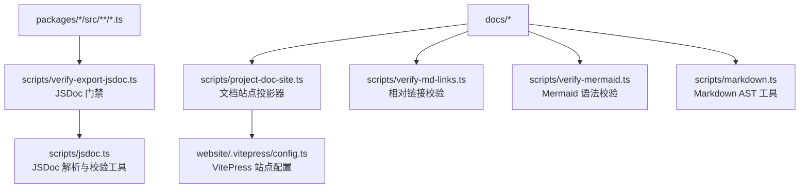
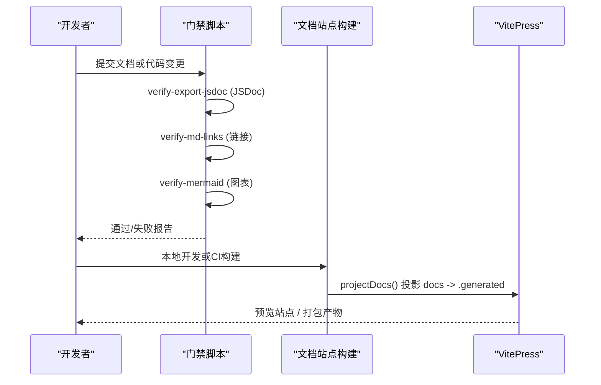
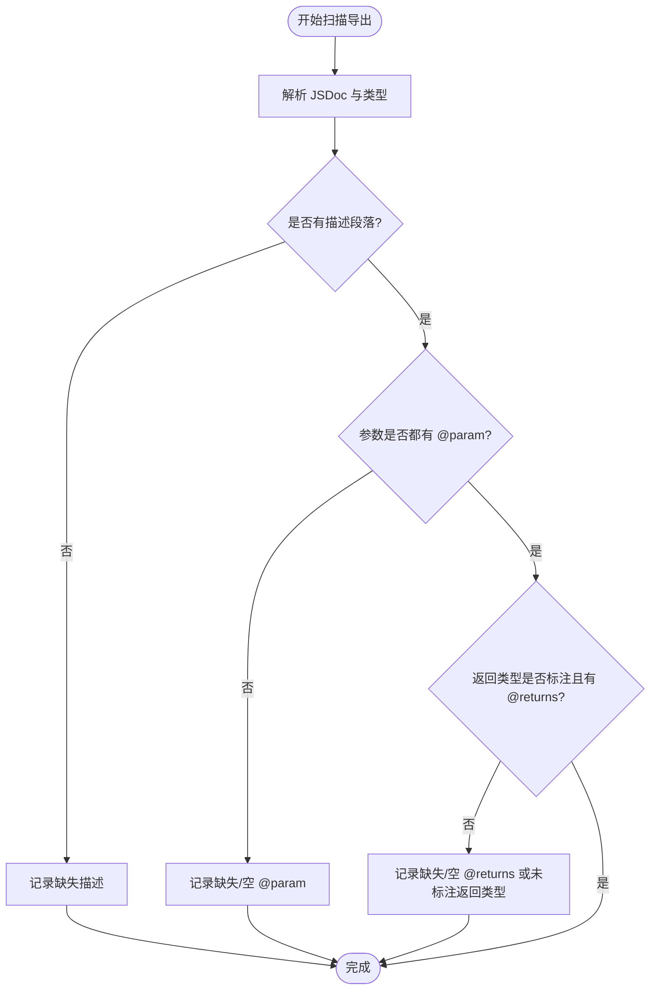
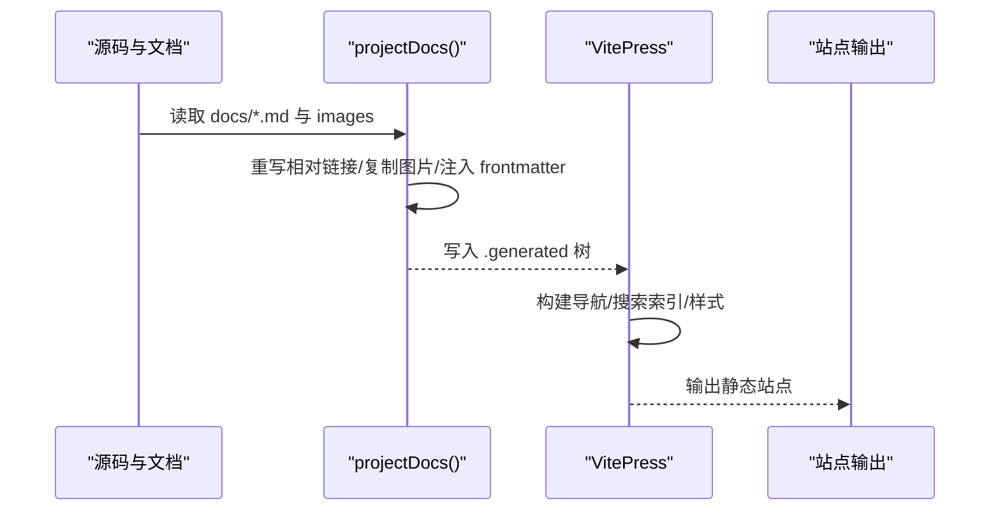
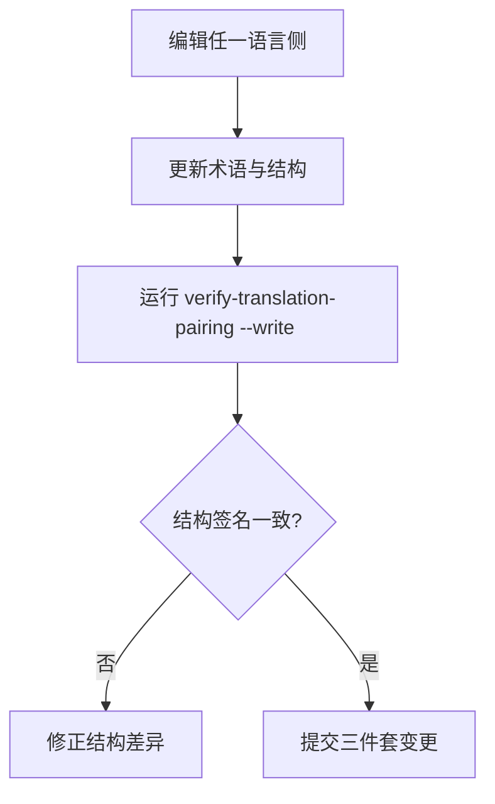
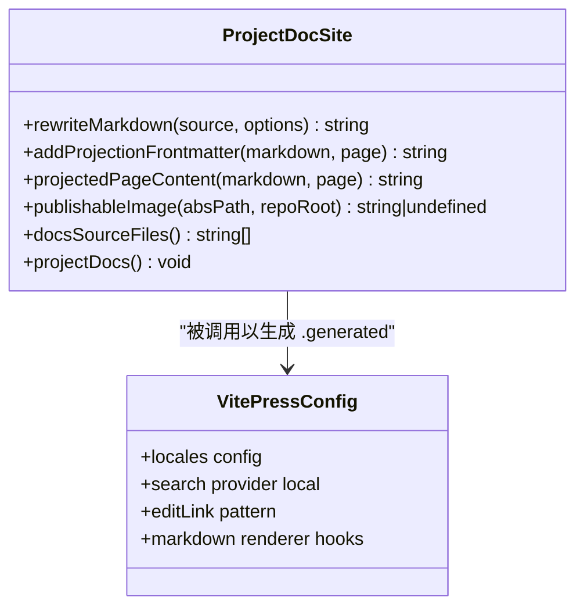
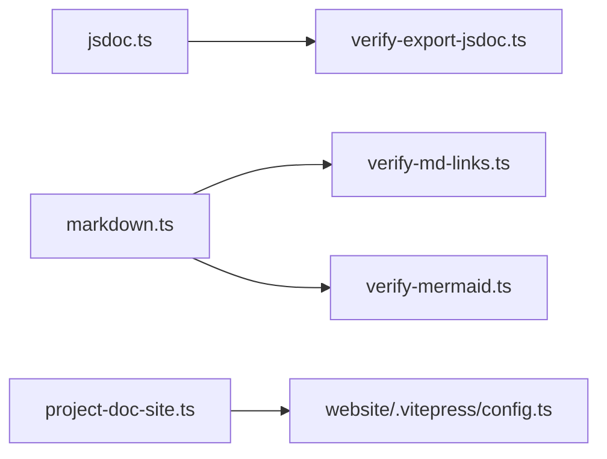

# 文档编写规范

<cite>
**本文引用的文件**
- [docs/i18n/README.md](file://docs/i18n/README.md)
- [docs/i18n/translation-rules.md](file://docs/i18n/translation-rules.md)
- [docs/i18n/terminology.md](file://docs/i18n/terminology.md)
- [scripts/jsdoc.ts](file://scripts/jsdoc.ts)
- [scripts/verify-export-jsdoc.ts](file://scripts/verify-export-jsdoc.ts)
- [scripts/markdown.ts](file://scripts/markdown.ts)
- [scripts/verify-md-links.ts](file://scripts/verify-md-links.ts)
- [scripts/verify-mermaid.ts](file://scripts/verify-mermaid.ts)
- [scripts/project-doc-site.ts](file://scripts/project-doc-site.ts)
- [website/.vitepress/config.ts](file://website/.vitepress/config.ts)
- [docs/AGENTS.md](file://docs/AGENTS.md)
</cite>

## 目录
1. [简介](#简介)
2. [项目结构](#项目结构)
3. [核心组件](#核心组件)
4. [架构总览](#架构总览)
5. [详细组件分析](#详细组件分析)
6. [依赖关系分析](#依赖关系分析)
7. [性能与可维护性](#性能与可维护性)
8. [故障排查指南](#故障排查指南)
9. [结论](#结论)
10. [附录](#附录)

## 简介
本规范面向仓库内所有面向读者的文档与代码级文档，统一以下目标：
- JSDoc 注释标准：函数、类、接口等导出 API 的文档完整性与一致性。
- README 编写规范：项目介绍、安装指南、使用示例的结构化组织。
- API 文档生成与维护：自动文档生成、版本管理、链接验证。
- 多语言文档管理：翻译文件结构、术语一致性、同步机制。
- 文档质量标准：可读性、准确性、完整性检查。
- Markdown 格式规范：标题层级、代码块、图表插入。
- 文档站点构建流程：内容组织、导航生成、搜索索引。

## 项目结构
仓库采用“源码即文档”的多层结构：
- docs：用户与开发者文档、子系统参考、教程与实操手册。
- scripts：文档质量门禁（JSDoc、Markdown、Mermaid、链接校验）、文档站点投影器。
- website：基于 VitePress 的文档站点配置与构建入口。
- packages：各包源码，其导出 API 由 JSDoc 门禁约束。

**图示来源**
- [scripts/project-doc-site.ts:1-461](file://scripts/project-doc-site.ts#L1-L461)
- [website/.vitepress/config.ts:1-343](file://website/.vitepress/config.ts#L1-L343)
- [scripts/verify-export-jsdoc.ts:1-618](file://scripts/verify-export-jsdoc.ts#L1-L618)
- [scripts/jsdoc.ts:1-202](file://scripts/jsdoc.ts#L1-L202)
- [scripts/verify-md-links.ts:1-217](file://scripts/verify-md-links.ts#L1-L217)
- [scripts/verify-mermaid.ts:1-108](file://scripts/verify-mermaid.ts#L1-L108)
- [scripts/markdown.ts:1-177](file://scripts/markdown.ts#L1-L177)

**章节来源**
- [docs/AGENTS.md:1-76](file://docs/AGENTS.md#L1-L76)
- [scripts/project-doc-site.ts:1-461](file://scripts/project-doc-site.ts#L1-L461)
- [website/.vitepress/config.ts:1-343](file://website/.vitepress/config.ts#L1-L343)

## 核心组件
- JSDoc 门禁与工具
  - 解析与校验：描述段落、@param、@returns、返回类型标注、参数绑定模式限制、继承豁免等。
  - 覆盖范围：所有非 vendor 包的导出函数、类方法、接口、类型别名、枚举、命名空间成员等。
- Markdown 质量工具
  - 链接校验：相对路径存在性、锚点有效性（GitHub slug 与显式 id）。
  - Mermaid 校验：通过 mermaid 解析器验证图语法。
  - Markdown AST：提取标题、代码块、正文行，支撑其他门禁。
- 文档站点投影器
  - 将 docs 中的源 Markdown 投影到 VitePress 的可发布树，重写跨源链接、复制图片、注入 frontmatter。
- 多语言配对与术语
  - 中英双语配对约定、结构签名比对、术语真源、切换行与徽章处理。

**章节来源**
- [scripts/jsdoc.ts:1-202](file://scripts/jsdoc.ts#L1-L202)
- [scripts/verify-export-jsdoc.ts:1-618](file://scripts/verify-export-jsdoc.ts#L1-L618)
- [scripts/markdown.ts:1-177](file://scripts/markdown.ts#L1-L177)
- [scripts/verify-md-links.ts:1-217](file://scripts/verify-md-links.ts#L1-L217)
- [scripts/verify-mermaid.ts:1-108](file://scripts/verify-mermaid.ts#L1-L108)
- [scripts/project-doc-site.ts:1-461](file://scripts/project-doc-site.ts#L1-L461)
- [docs/i18n/README.md:1-61](file://docs/i18n/README.md#L1-L61)
- [docs/i18n/translation-rules.md:1-70](file://docs/i18n/translation-rules.md#L1-L70)
- [docs/i18n/terminology.md:1-215](file://docs/i18n/terminology.md#L1-L215)

## 架构总览
文档质量与站点构建的整体流程如下：

**图示来源**
- [scripts/verify-export-jsdoc.ts:576-618](file://scripts/verify-export-jsdoc.ts#L576-L618)
- [scripts/verify-md-links.ts:198-217](file://scripts/verify-md-links.ts#L198-L217)
- [scripts/verify-mermaid.ts:64-108](file://scripts/verify-mermaid.ts#L64-L108)
- [scripts/project-doc-site.ts:398-461](file://scripts/project-doc-site.ts#L398-L461)
- [website/.vitepress/config.ts:10-12](file://website/.vitepress/config.ts#L10-L12)

## 详细组件分析

### JSDoc 注释标准与门禁
- 适用范围
  - 所有非 vendor 包的导出声明：函数、类、接口、类型别名、枚举、命名空间成员、默认导出等。
  - 公共类方法、属性与访问器；继承成员按规则豁免。
- 必需要素
  - 描述段落：每个导出必须有描述性文本（不在 block tags 之下）。
  - 参数说明：每个简单标识符参数需有 @param 且描述非空；禁止使用绑定模式参数。
  - 返回说明：非 void/Promise<void> 必须提供 @returns；返回类型必须显式标注以便门禁分类。
  - 继承与协议豁免：this 接收者、Cordis 协议槽位、基类已文档化的参数与 void 返回可豁免。
- 工具实现要点
  - 解析原始 JSDoc 为描述与标签；支持 {link} 渲染、列表与段落折叠。
  - 收集并聚合违规项，一次性报告，便于批量修复。
  - 对不可分类的调用类型字面量拒绝放行，要求提取命名类型并在类型处文档。

**图示来源**
- [scripts/jsdoc.ts:24-82](file://scripts/jsdoc.ts#L24-L82)
- [scripts/jsdoc.ts:91-120](file://scripts/jsdoc.ts#L91-L120)
- [scripts/jsdoc.ts:134-186](file://scripts/jsdoc.ts#L134-L186)
- [scripts/verify-export-jsdoc.ts:161-197](file://scripts/verify-export-jsdoc.ts#L161-L197)
- [scripts/verify-export-jsdoc.ts:275-381](file://scripts/verify-export-jsdoc.ts#L275-L381)

**章节来源**
- [scripts/jsdoc.ts:1-202](file://scripts/jsdoc.ts#L1-L202)
- [scripts/verify-export-jsdoc.ts:1-618](file://scripts/verify-export-jsdoc.ts#L1-L618)

### README 编写规范
- 结构建议
  - 项目介绍：一句话定位产品与核心价值，避免营销化长文。
  - 快速开始：推荐包运行路径与源码运行替代方案，附带最小可用示例。
  - 使用示例：指向可运行的示例或教程，不重复长篇步骤。
  - 扩展与参考：链接到插件开发、高级配置、子系统参考等权威页面。
- 与站点关系
  - 根 README 保持紧凑，作为产品入口；文档网站的用户指南从 Web UI 任务开始，再链接到其他教程或参考。
- 多语言
  - 若发布到 GitHub 以外平台，可使用仓库 canonical URL 链接到对应语言的 README。

**章节来源**
- [docs/AGENTS.md:15-33](file://docs/AGENTS.md#L15-L33)
- [docs/i18n/README.md:21-22](file://docs/i18n/README.md#L21-L22)

### API 文档的生成与维护
- 自动生成
  - 通过 JSDoc 门禁确保导出 API 的文档完整；生成的子系统参考、工具目录、配置目录等由脚本从源码再生。
- 版本管理
  - 站点投影器在构建时注入 editSource frontmatter，编辑链接指向仓库 master 分支；外部链接保留为 GitHub 原始资源或站点内路由。
- 链接验证
  - 相对链接与锚点必须在构建前通过 verify-md-links；Mermaid 图通过 verify-mermaid 语法校验。
- 站点构建
  - VitePress 配置中启用本地搜索、导航与侧边栏；文档源来自 .generated 目录，由 projectDocs 动态生成。

**图示来源**
- [scripts/project-doc-site.ts:225-277](file://scripts/project-doc-site.ts#L225-L277)
- [scripts/project-doc-site.ts:398-461](file://scripts/project-doc-site.ts#L398-L461)
- [website/.vitepress/config.ts:118-161](file://website/.vitepress/config.ts#L118-L161)
- [website/.vitepress/config.ts:249-343](file://website/.vitepress/config.ts#L249-L343)

**章节来源**
- [scripts/project-doc-site.ts:1-461](file://scripts/project-doc-site.ts#L1-L461)
- [website/.vitepress/config.ts:1-343](file://website/.vitepress/config.ts#L1-L343)
- [scripts/verify-md-links.ts:1-217](file://scripts/verify-md-links.ts#L1-L217)
- [scripts/verify-mermaid.ts:1-108](file://scripts/verify-mermaid.ts#L1-L108)

### 多语言文档管理
- 配对约定
  - 每篇文档以三件套形式存在：英文 foo.md、中文 foo.zh.md、一致性记录 foo.i18n.yaml。
  - 两侧文件必须语义一致；结构签名（标题层级、代码块、表格行列数、列表形态、有序列表起始、链接目标）必须匹配。
- 术语与风格
  - 术语真源位于 terminology.md；首次出现标注，后续不再重复括注。
  - 中文排版遵循混合脚本间距、全角标点、枚举顿号等规范。
- 同步机制
  - 使用 verify-translation-pairing 校验配对完整性与结构签名；--write 重新记录 blob hash。
  - 合并冲突时可通过 Git merge driver 与辅助脚本安全恢复。

**图示来源**
- [docs/i18n/README.md:7-23](file://docs/i18n/README.md#L7-L23)
- [docs/i18n/README.md:24-41](file://docs/i18n/README.md#L24-L41)
- [docs/i18n/translation-rules.md:22-33](file://docs/i18n/translation-rules.md#L22-L33)
- [docs/i18n/terminology.md:5-9](file://docs/i18n/terminology.md#L5-L9)

**章节来源**
- [docs/i18n/README.md:1-61](file://docs/i18n/README.md#L1-L61)
- [docs/i18n/translation-rules.md:1-70](file://docs/i18n/translation-rules.md#L1-L70)
- [docs/i18n/terminology.md:1-215](file://docs/i18n/terminology.md#L1-L215)

### 文档质量标准
- 可读性
  - 一段一行；避免段落墙；强调仅用于改变行为的关键句。
  - 避免历史叙述与状态注解；用当前事实与权威链接替代。
- 准确性
  - 相对链接与锚点必须有效；Mermaid 图语法正确；代码块信息字符串与内容在配对中字节一致。
- 完整性
  - 导出 API 必须具备描述、参数与返回说明；子系统类型定义与其子系统页同步更新。
- 预算控制
  - 持久文档受字数上限约束；超限时优先迁移或压缩，必要时提升上限并说明理由。

**章节来源**
- [docs/AGENTS.md:36-76](file://docs/AGENTS.md#L36-L76)
- [scripts/verify-md-links.ts:1-217](file://scripts/verify-md-links.ts#L1-L217)
- [scripts/verify-mermaid.ts:1-108](file://scripts/verify-mermaid.ts#L1-L108)
- [scripts/verify-export-jsdoc.ts:1-618](file://scripts/verify-export-jsdoc.ts#L1-L618)

### Markdown 格式规范
- 标题层级
  - 严格保持层级与顺序；配对文件中标题深度与顺序必须一致。
- 代码块
  - fenced ts 块必须编译；配对中 info 字符串与内容字节一致。
- 图表插入
  - Mermaid 图需在 verify-mermaid 下通过；站点构建启用 mermaid 插件。
- 链接与锚点
  - 使用相对路径；锚点遵循 GitHub slug 或显式 id；站点投影器会重写跨源链接。

**章节来源**
- [docs/i18n/translation-rules.md:22-33](file://docs/i18n/translation-rules.md#L22-L33)
- [scripts/markdown.ts:42-77](file://scripts/markdown.ts#L42-L77)
- [scripts/verify-md-links.ts:88-135](file://scripts/verify-md-links.ts#L88-L135)
- [scripts/verify-mermaid.ts:43-96](file://scripts/verify-mermaid.ts#L43-L96)
- [website/.vitepress/config.ts:329-341](file://website/.vitepress/config.ts#L329-L341)

### 文档站点构建流程
- 内容组织
  - 源文件位于 docs；站点构建时由 projectDocs 投影至 .generated，并注入 editSource 与 outline frontmatter。
- 导航生成
  - VitePress 配置根据 docs.ts 的页面清单生成导航与侧边栏；指南模块在不同语言下映射不同集合。
- 搜索索引
  - 启用本地搜索并提供多语言文案；站点基础路径可由环境变量控制。
- 图片与资源
  - 站点引用图片会被复制到生成树；外部资源通过 GitHub raw 或站点内路由访问。

**图示来源**
- [scripts/project-doc-site.ts:225-277](file://scripts/project-doc-site.ts#L225-L277)
- [scripts/project-doc-site.ts:279-344](file://scripts/project-doc-site.ts#L279-L344)
- [scripts/project-doc-site.ts:398-461](file://scripts/project-doc-site.ts#L398-L461)
- [website/.vitepress/config.ts:118-161](file://website/.vitepress/config.ts#L118-L161)
- [website/.vitepress/config.ts:249-343](file://website/.vitepress/config.ts#L249-L343)

**章节来源**
- [scripts/project-doc-site.ts:1-461](file://scripts/project-doc-site.ts#L1-L461)
- [website/.vitepress/config.ts:1-343](file://website/.vitepress/config.ts#L1-L343)

## 依赖关系分析
- 组件耦合
  - verify-export-jsdoc 依赖 jsdoc 工具进行解析与校验。
  - 站点构建依赖 markdown.ts 提供的 AST 能力进行链接重写与内容投影。
  - 多语言配对依赖 i18n 规则与术语表，配合 verify-translation-pairing 门禁。
- 外部依赖
  - TypeScript 编译器用于导出 API 分析与类型推断。
  - mdast/micromark 用于 Markdown 解析。
  - mermaid 用于图语法校验。
  - VitePress 用于站点构建与主题配置。

**图示来源**
- [scripts/jsdoc.ts:1-202](file://scripts/jsdoc.ts#L1-L202)
- [scripts/verify-export-jsdoc.ts:1-618](file://scripts/verify-export-jsdoc.ts#L1-L618)
- [scripts/markdown.ts:1-177](file://scripts/markdown.ts#L1-L177)
- [scripts/verify-md-links.ts:1-217](file://scripts/verify-md-links.ts#L1-L217)
- [scripts/verify-mermaid.ts:1-108](file://scripts/verify-mermaid.ts#L1-L108)
- [scripts/project-doc-site.ts:1-461](file://scripts/project-doc-site.ts#L1-L461)
- [website/.vitepress/config.ts:1-343](file://website/.vitepress/config.ts#L1-L343)

**章节来源**
- [scripts/jsdoc.ts:1-202](file://scripts/jsdoc.ts#L1-L202)
- [scripts/verify-export-jsdoc.ts:1-618](file://scripts/verify-export-jsdoc.ts#L1-L618)
- [scripts/markdown.ts:1-177](file://scripts/markdown.ts#L1-L177)
- [scripts/verify-md-links.ts:1-217](file://scripts/verify-md-links.ts#L1-L217)
- [scripts/verify-mermaid.ts:1-108](file://scripts/verify-mermaid.ts#L1-L108)
- [scripts/project-doc-site.ts:1-461](file://scripts/project-doc-site.ts#L1-L461)
- [website/.vitepress/config.ts:1-343](file://website/.vitepress/config.ts#L1-L343)

## 性能与可维护性
- 构建性能
  - 站点构建仅在变更时重建投影树；VitePress 开发服务器监听源文件变化并触发重建。
- 门禁效率
  - 门禁脚本按模式扫描文件，缓存锚点集合，减少重复解析；错误聚合一次报告，降低迭代成本。
- 可维护性
  - 通过术语表与翻译规则保证多语言一致性；结构化签名比对避免手工校对遗漏。
  - 站点投影器集中处理链接重写与资源复制，降低分散维护成本。

[本节为通用指导，无需具体文件来源]

## 故障排查指南
- JSDoc 门禁失败
  - 检查导出函数/类方法是否缺少描述、@param 或 @returns；确认返回类型标注；避免绑定模式参数。
  - 对于继承成员，确认基类已文档化且未新增额外参数或返回类型。
- Markdown 链接失效
  - 确认相对路径存在；锚点需匹配 GitHub slug 或显式 id；避免使用裸文件名。
- Mermaid 语法错误
  - 使用 verify-mermaid 定位错误位置；调整图语法直至通过。
- 多语言配对不一致
  - 运行 verify-translation-pairing 查看缺失或不一致项；修正结构签名后使用 --write 重新记录。

**章节来源**
- [scripts/verify-export-jsdoc.ts:576-618](file://scripts/verify-export-jsdoc.ts#L576-L618)
- [scripts/verify-md-links.ts:198-217](file://scripts/verify-md-links.ts#L198-L217)
- [scripts/verify-mermaid.ts:64-108](file://scripts/verify-mermaid.ts#L64-L108)
- [docs/i18n/README.md:24-41](file://docs/i18n/README.md#L24-L41)

## 结论
本规范通过严格的门禁与自动化构建，确保：
- 代码级文档（JSDoc）与用户文档（Markdown）的一致性与可维护性。
- 多语言配对的语义与结构一致性，术语统一。
- 文档站点的稳定构建与良好的用户体验（导航、搜索、编辑链接）。
建议在每次变更中同时运行相关门禁，确保文档质量与站点可用性。

[本节为总结性内容，无需具体文件来源]

## 附录
- 常用命令
  - JSDoc 门禁：pnpm run verify-export-jsdoc
  - 链接校验：pnpm run verify-md-links
  - Mermaid 校验：pnpm run verify-mermaid
  - 多语言配对校验：pnpm run verify-translation-pairing
  - 文档站点构建：website 目录下执行 VitePress 构建流程
- 参考文件
  - 文档标准：docs/AGENTS.md
  - 多语言约定：docs/i18n/README.md、docs/i18n/translation-rules.md、docs/i18n/terminology.md
  - 站点配置：website/.vitepress/config.ts
  - 投影器：scripts/project-doc-site.ts
  - 工具库：scripts/jsdoc.ts、scripts/markdown.ts

[本节为补充信息，无需具体文件来源]