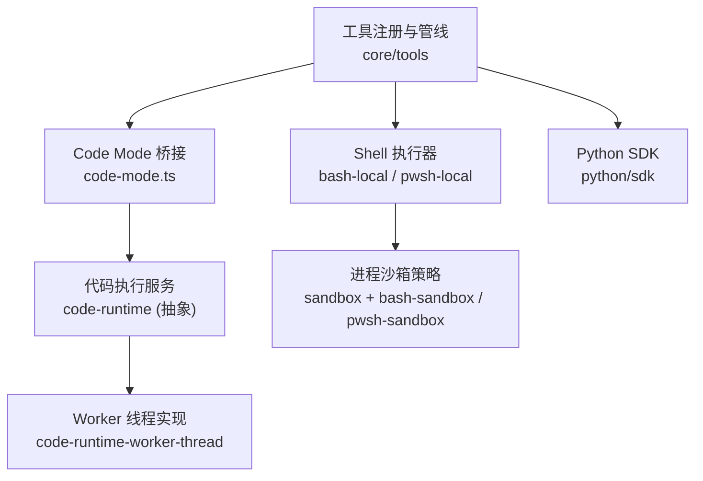
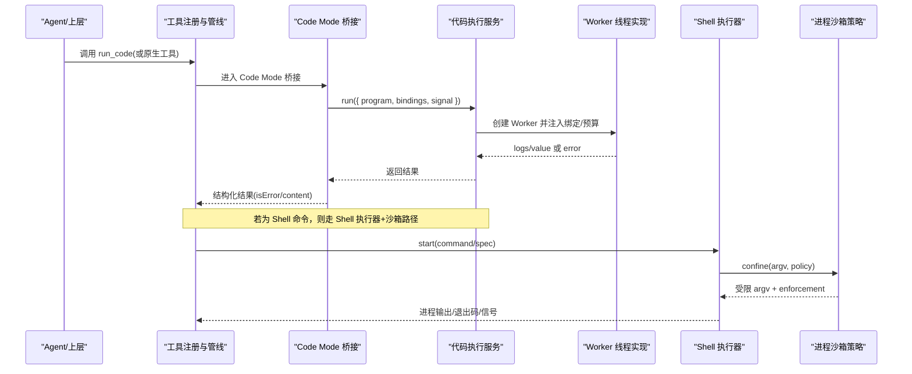
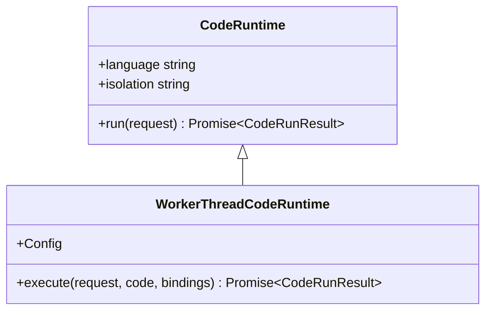
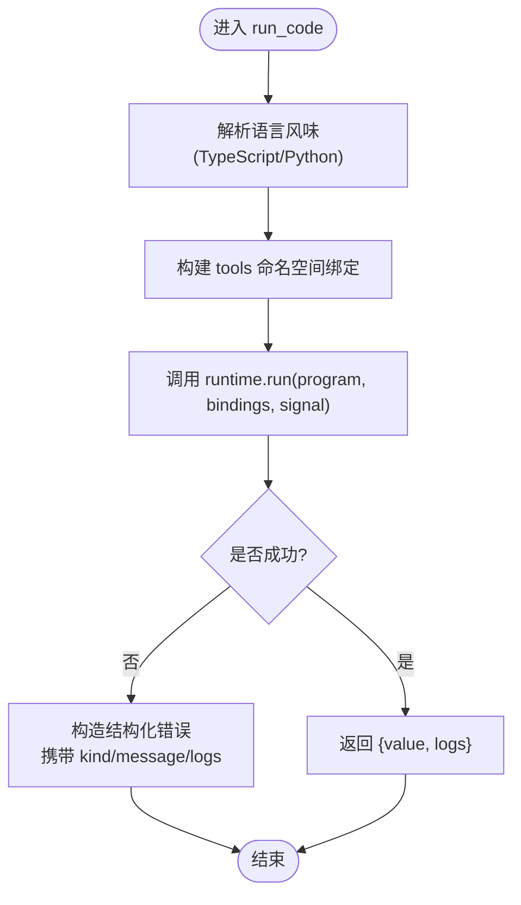
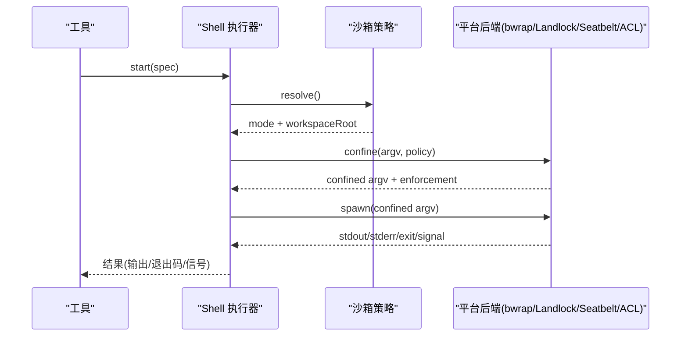
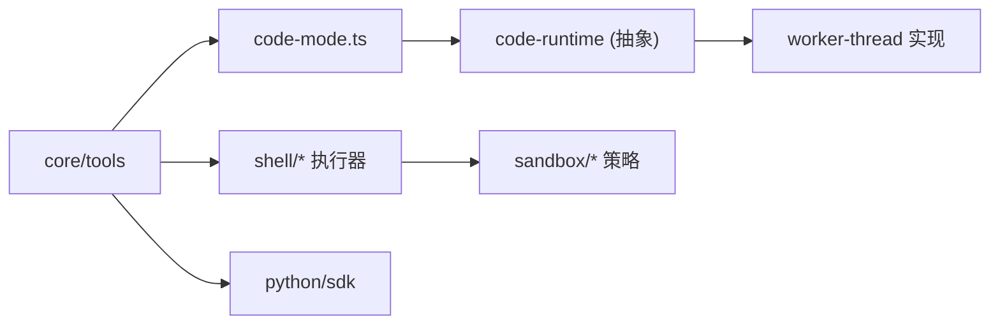

# 代码工具

<cite>
**本文引用的文件**
- [README.md](file://README.md)
- [packages/code-runtime/README.md](file://packages/code-runtime/README.md)
- [docs/subsystems/code-runtime.md](file://docs/subsystems/code-runtime.md)
- [packages/core/tools/README.md](file://packages/core/tools/README.md)
- [packages/core/tools/src/code-mode.ts](file://packages/core/tools/src/code-mode.ts)
- [packages/code-runtime/code-runtime-worker-thread/src/index.ts](file://packages/code-runtime/code-runtime-worker-thread/src/index.ts)
- [packages/shell/bash-local/src/index.ts](file://packages/shell/bash-local/src/index.ts)
- [packages/shell/pwsh-sandbox/src/index.ts](file://packages/shell/pwsh-sandbox/src/index.ts)
- [packages/shell/bash-sandbox/src/index.ts](file://packages/shell/bash-sandbox/src/index.ts)
- [packages/sandbox/sandbox-policy/src/session-mode.ts](file://packages/sandbox/sandbox-policy/src/session-mode.ts)
- [docs/subsystems/sandbox.md](file://docs/subsystems/sandbox.md)
- [packages/util/timeout/src/index.ts](file://packages/util/timeout/src/index.ts)
- [python/sdk/README.md](file://python/sdk/README.md)
</cite>

## 目录
1. [简介](#简介)
2. [项目结构](#项目结构)
3. [核心组件](#核心组件)
4. [架构总览](#架构总览)
5. [详细组件分析](#详细组件分析)
6. [依赖关系分析](#依赖关系分析)
7. [性能考虑](#性能考虑)
8. [故障排查指南](#故障排查指南)
9. [结论](#结论)
10. [附录：使用示例与最佳实践](#附录：使用示例与最佳实践)

## 简介
本文件面向开发者，系统化说明 DeepSeek Harness（dsh）的“代码执行工具”能力：包括代码执行、脚本运行、环境隔离、沙箱策略、生命周期管理、资源监控与异常处理。重点覆盖以下方面：
- 支持的编程语言与运行时：TypeScript（Worker 线程隔离）、Python（通过 Python SDK 驱动子进程）。
- 执行参数与预算：计算时间、墙钟时间、输出大小限制、内存上限等。
- 安全沙箱：进程级文件访问策略（只读、工作区写入、危险全权），以及平台后端差异。
- 生命周期与资源：启动、隔离执行、中止、清理与回收。
- 错误分类与可观测性：失败类型、日志捕获、结构化结果。
- 集成建议：如何在工具注册、Agent 模式、CLI/Web 中启用并配置代码执行。

## 项目结构
围绕“代码执行工具”，仓库采用按能力域划分的包组织方式：
- code-runtime：抽象的代码执行服务定义与共享类型；worker-thread 实现提供 Worker 线程隔离的执行器。
- core/tools：工具注册与执行管线，包含 Code Mode（run_code）与语言特定的 SDK 渲染。
- shell/*：bash 与 PowerShell 的本地执行与沙箱封装，支持受限模式与策略注入。
- sandbox/*：进程沙箱策略与服务，统一文件访问策略与执行上下文。
- util/timeout：统一的超时与信号工具。
- python/sdk：Python 侧子进程 SDK，用于通过 JSON-RPC stdio 驱动 dsh 运行时。

图表来源
- [packages/core/tools/README.md:1-60](file://packages/core/tools/README.md#L1-L60)
- [packages/core/tools/src/code-mode.ts:119-144](file://packages/core/tools/src/code-mode.ts#L119-L144)
- [packages/code-runtime/code-runtime-worker-thread/src/index.ts:231-393](file://packages/code-runtime/code-runtime-worker-thread/src/index.ts#L231-L393)
- [packages/shell/bash-local/src/index.ts:242-267](file://packages/shell/bash-local/src/index.ts#L242-L267)
- [docs/subsystems/sandbox.md:1-219](file://docs/subsystems/sandbox.md#L1-L219)
- [python/sdk/README.md:1-52](file://python/sdk/README.md#L1-L52)

章节来源
- [packages/code-runtime/README.md:1-15](file://packages/code-runtime/README.md#L1-L15)
- [packages/core/tools/README.md:1-60](file://packages/core/tools/README.md#L1-L60)

## 核心组件
- 代码执行服务（CodeRuntime）：抽象接口，定义 run(request) 契约，返回包含 value/logs/error 的结果；语言与隔离方式为只读描述符。
- Worker 线程实现：以 Node Worker 为执行基座，提供 computeMs、maxWallMs、maxOutputBytes、maxOldGenerationSizeMb 等预算与限制；无宿主环境变量，严格隔离。
- Code Mode（run_code）：在工具注册层暴露受控入口，生成语言特定 SDK（TypeScript/Python），将工具绑定为程序可调用的全局命名空间。
- Shell 执行器：bash/local 与 pwsh/local 提供命令执行与后台进程管理；结合沙箱策略进行文件访问控制。
- 进程沙箱：统一文件访问策略（read-only、workspace-write、danger-full-access），并提供 enforcement 完整度报告。
- 超时与信号：统一的超时原因与最大定时器延迟常量，供各能力组合使用。
- Python SDK：通过子进程驱动 dsh 运行时，支持默认或自定义 Cordis 配置，复用环境变量。

章节来源
- [docs/subsystems/code-runtime.md:1-192](file://docs/subsystems/code-runtime.md#L1-L192)
- [packages/code-runtime/code-runtime-worker-thread/src/index.ts:24-54](file://packages/code-runtime/code-runtime-worker-thread/src/index.ts#L24-L54)
- [packages/core/tools/README.md:116-126](file://packages/core/tools/README.md#L116-L126)
- [packages/shell/bash-local/src/index.ts:242-267](file://packages/shell/bash-local/src/index.ts#L242-L267)
- [docs/subsystems/sandbox.md:1-219](file://docs/subsystems/sandbox.md#L1-L219)
- [packages/util/timeout/src/index.ts:1-31](file://packages/util/timeout/src/index.ts#L1-L31)
- [python/sdk/README.md:1-52](file://python/sdk/README.md#L1-L52)

## 架构总览
下图展示从工具调用到代码执行的端到端流程，涵盖 Code Mode、运行时、Shell 与沙箱的协作。

图表来源
- [packages/core/tools/src/code-mode.ts:464-629](file://packages/core/tools/src/code-mode.ts#L464-L629)
- [packages/code-runtime/code-runtime-worker-thread/src/index.ts:231-393](file://packages/code-runtime/code-runtime-worker-thread/src/index.ts#L231-L393)
- [packages/shell/bash-local/src/index.ts:242-267](file://packages/shell/bash-local/src/index.ts#L242-L267)
- [docs/subsystems/sandbox.md:96-157](file://docs/subsystems/sandbox.md#L96-L157)

## 详细组件分析

### 代码执行服务（CodeRuntime）与 Worker 线程实现
- 抽象服务：run(request) 接收程序源码、绑定命名空间与中止信号；结果包含 value/logs/error，错误作为字段而非拒绝。
- Worker 实现：
  - 预算：computeMs（事件循环忙时）、maxWallMs（墙钟上限）、maxOutputBytes（序列化载荷上限）、maxOldGenerationSizeMb（堆上限）。
  - 隔离：无宿主环境变量、空 execArgv、resourceLimits 限制；stdout/stderr 仅作为兜底捕获。
  - 生命周期：每个 run 独立 Worker，dispose 后中止进行中任务并等待退出。

图表来源
- [docs/subsystems/code-runtime.md:159-192](file://docs/subsystems/code-runtime.md#L159-L192)
- [packages/code-runtime/code-runtime-worker-thread/src/index.ts:231-393](file://packages/code-runtime/code-runtime-worker-thread/src/index.ts#L231-L393)

章节来源
- [docs/subsystems/code-runtime.md:1-192](file://docs/subsystems/code-runtime.md#L1-L192)
- [packages/code-runtime/code-runtime-worker-thread/src/index.ts:24-54](file://packages/code-runtime/code-runtime-worker-thread/src/index.ts#L24-L54)

### Code Mode（run_code）与工具绑定
- 语言选择：根据 ctx.codeRuntime.language 选择 TypeScript 或 Python 的 SDK 渲染；未注册语言会报错。
- 绑定机制：将工具注册为程序可见的全局命名空间（如 tools），函数参数与返回值必须为无损 JSON。
- 调度与并发：按提交顺序启动，isConcurrencySafe 允许重叠；exclusive 调用作为排序屏障。
- 结算纪律：run 结束时中止并清空队列，确保所有子调用事件在 turn 内落地。
- 错误与日志：失败以结构化 isError 呈现，携带失败种类与捕获日志，便于模型自修复。

图表来源
- [packages/core/tools/src/code-mode.ts:119-144](file://packages/core/tools/src/code-mode.ts#L119-L144)
- [packages/core/tools/src/code-mode.ts:464-629](file://packages/core/tools/src/code-mode.ts#L464-L629)

章节来源
- [packages/core/tools/README.md:116-126](file://packages/core/tools/README.md#L116-L126)
- [packages/core/tools/src/code-mode.ts:119-144](file://packages/core/tools/src/code-mode.ts#L119-L144)

### Shell 执行与进程沙箱
- Shell 执行器：bash-local 与 pwsh-local 提供前台/后台命令执行、输出缓冲、取消与进程树所有权语义。
- 沙箱策略：
  - 模式：read-only、workspace-write、danger-full-access；仅前两种可发送给提供者。
  - 执行策略：每调用解析一次，携带 sessionId/workspaceRoot；provider 返回受限 argv 与 enforcement 完整度。
  - 失败分类：runnerFailureRules 与 denialSignatures 区分“沙箱基础设施失败”和“被策略拒绝”。

图表来源
- [packages/shell/bash-local/src/index.ts:242-267](file://packages/shell/bash-local/src/index.ts#L242-L267)
- [docs/subsystems/sandbox.md:9-39](file://docs/subsystems/sandbox.md#L9-L39)
- [docs/subsystems/sandbox.md:41-94](file://docs/subsystems/sandbox.md#L41-L94)
- [docs/subsystems/sandbox.md:96-157](file://docs/subsystems/sandbox.md#L96-L157)

章节来源
- [packages/shell/bash-local/src/index.ts:242-267](file://packages/shell/bash-local/src/index.ts#L242-L267)
- [packages/shell/pwsh-sandbox/src/index.ts:59-94](file://packages/shell/pwsh-sandbox/src/index.ts#L59-L94)
- [packages/shell/bash-sandbox/src/index.ts:51-86](file://packages/shell/bash-sandbox/src/index.ts#L51-L86)
- [packages/sandbox/sandbox-policy/src/session-mode.ts:44-71](file://packages/sandbox/sandbox-policy/src/session-mode.ts#L44-L71)
- [docs/subsystems/sandbox.md:1-219](file://docs/subsystems/sandbox.md#L1-L219)

### 超时与中止
- 统一超时：TimeoutReason 携带能力域代码与耗时；MAX_TIMER_DELAY_MS 约束最大定时器延迟。
- 代码执行预算：computeMs 基于事件循环忙时计量，maxWallMs 作为墙钟兜底；maxOutputBytes 限制序列化载荷。
- 中止传播：run_code 在结算时中止并排空队列；Shell 执行通过 signal 与 kill 协同终止。

章节来源
- [packages/util/timeout/src/index.ts:1-31](file://packages/util/timeout/src/index.ts#L1-L31)
- [packages/code-runtime/code-runtime-worker-thread/src/index.ts:24-54](file://packages/code-runtime/code-runtime-worker-thread/src/index.ts#L24-L54)
- [packages/core/tools/src/code-mode.ts:464-629](file://packages/core/tools/src/code-mode.ts#L464-L629)

## 依赖关系分析
- 工具注册层依赖 Code Mode 与运行时语言渲染；运行时依赖 Worker 线程实现。
- Shell 执行器依赖沙箱策略与平台后端；策略服务维护会话模式与根目录。
- Python SDK 通过子进程驱动运行时，复用环境变量与默认配置。

图表来源
- [packages/core/tools/README.md:1-60](file://packages/core/tools/README.md#L1-L60)
- [packages/code-runtime/README.md:1-15](file://packages/code-runtime/README.md#L1-L15)
- [python/sdk/README.md:1-52](file://python/sdk/README.md#L1-L52)

章节来源
- [packages/core/tools/README.md:1-60](file://packages/core/tools/README.md#L1-L60)
- [packages/code-runtime/README.md:1-15](file://packages/code-runtime/README.md#L1-L15)
- [python/sdk/README.md:1-52](file://python/sdk/README.md#L1-L52)

## 性能考虑
- 预算与限额：
  - 计算时间（computeMs）与墙钟时间（maxWallMs）双重保护，避免 CPU 热点与悬挂等待。
  - 输出大小（maxOutputBytes）防止结果膨胀；超限显式失败而非静默截断。
  - 堆内存（maxOldGenerationSizeMb）限制 Worker 内存，溢出以 worker-exit 上报。
- 并发与调度：
  - isConcurrencySafe 允许并行；exclusive 作为串行屏障，保证顺序一致性。
  - 子调用池复用原生并发契约，避免过度开销。
- 隔离成本：
  - Worker 线程隔离带来启动与通信开销，适合短时任务；长驻 REPL 不被支持。
- Shell 执行：
  - 后台任务忽略 timeoutMs，需通过 kill 或 spec.signal 停止；输出缓冲与 spill 控制 I/O。

[本节为通用指导，不直接分析具体文件]

## 故障排查指南
- 代码执行失败：
  - 检查失败种类：exception、timeout、abort、worker-exit、invalid-output、output-limit。
  - 查看捕获日志与消息，定位解析/转换/预算问题。
- Shell 命令失败：
  - 区分 runnerFailureRules（沙箱基础设施失败）与 denialSignatures（策略拒绝）。
  - 确认 confinement 模式与 enforcement 完整度；必要时提升权限或调整策略。
- 超时与中止：
  - 核对 computeMs/maxWallMs 设置；检查外部依赖是否响应缓慢。
  - 确认 AbortSignal 是否正确传递与消费。
- Python SDK：
  - 确认运行时可执行存在且版本匹配；检查 DSH_CORDIS_CONFIG 与 provider/model 配置。
  - 关注 Session.run 返回的 finish_reason 与 events，定位中断原因。

章节来源
- [docs/subsystems/code-runtime.md:132-157](file://docs/subsystems/code-runtime.md#L132-L157)
- [docs/subsystems/sandbox.md:96-157](file://docs/subsystems/sandbox.md#L96-L157)
- [python/sdk/README.md:1-52](file://python/sdk/README.md#L1-L52)

## 结论
DeepSeek Harness 的代码执行工具通过清晰的抽象与可替换实现，提供了安全的进程隔离、严格的预算控制与强大的工具绑定能力。Code Mode 将模型生成的程序与宿主工具无缝衔接，同时保持日志与结果的强约束。配合 Shell 执行与沙箱策略，系统可在多语言场景下提供一致的安全与性能保障。推荐在生产环境中启用受限模式与合理预算，并结合 Python SDK 进行外部集成。

[本节为总结，不直接分析具体文件]

## 附录：使用示例与最佳实践

- Python 脚本执行
  - 通过 Python SDK 启动 dsh 运行时，使用默认或自定义 Cordis 配置，调用 harness.run 完成交互。
  - 参考路径：[python/sdk/README.md:1-52](file://python/sdk/README.md#L1-L52)

- JavaScript/TypeScript 代码运行
  - 在工具注册层启用 Code Mode，编写异步函数体并通过 tools.* 调用宿主工具；注意参数与返回值为无损 JSON。
  - 参考路径：[packages/core/tools/README.md:116-126](file://packages/core/tools/README.md#L116-L126)、[packages/core/tools/src/code-mode.ts:119-144](file://packages/core/tools/src/code-mode.ts#L119-L144)

- 多语言混合编程
  - 通过不同运行时（TypeScript Worker、Python SDK）在同一 Agent 上下文中协作；注意语言渲染与绑定契约的一致性。
  - 参考路径：[packages/code-runtime/README.md:1-15](file://packages/code-runtime/README.md#L1-L15)、[python/sdk/README.md:1-52](file://python/sdk/README.md#L1-L52)

- 生命周期管理与资源监控
  - 使用 computeMs/maxWallMs/maxOutputBytes/maxOldGenerationSizeMb 控制资源；监听工具事件与 Shell 输出。
  - 参考路径：[packages/code-runtime/code-runtime-worker-thread/src/index.ts:24-54](file://packages/code-runtime/code-runtime-worker-thread/src/index.ts#L24-L54)、[packages/shell/bash-local/src/index.ts:242-267](file://packages/shell/bash-local/src/index.ts#L242-L267)

- 安全与最佳实践
  - 优先使用 read-only 或 workspace-write 模式；仅在必要时使用 danger-full-access。
  - 对 Shell 命令进行最小权限原则配置，结合 runnerFailureRules 与 denialSignatures 进行诊断。
  - 参考路径：[docs/subsystems/sandbox.md:9-39](file://docs/subsystems/sandbox.md#L9-L39)、[docs/subsystems/sandbox.md:96-157](file://docs/subsystems/sandbox.md#L96-L157)

- 常见问题解决方案
  - 代码执行超时：调大 computeMs 或优化算法；检查外部依赖响应。
  - 输出过大：减少 console.log 或拆分任务；利用 spill 策略。
  - 沙箱拒绝：确认策略模式与平台后端能力；必要时调整工作区根目录。
  - 参考路径：[packages/util/timeout/src/index.ts:1-31](file://packages/util/timeout/src/index.ts#L1-L31)、[docs/subsystems/sandbox.md:96-157](file://docs/subsystems/sandbox.md#L96-L157)