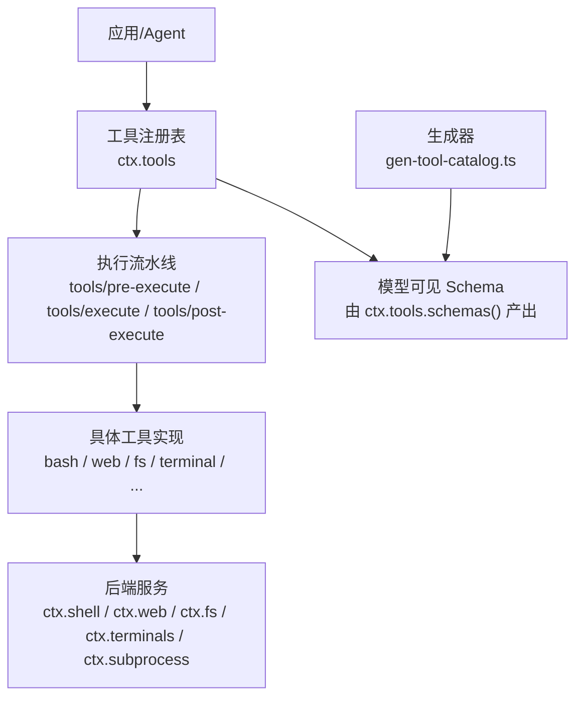
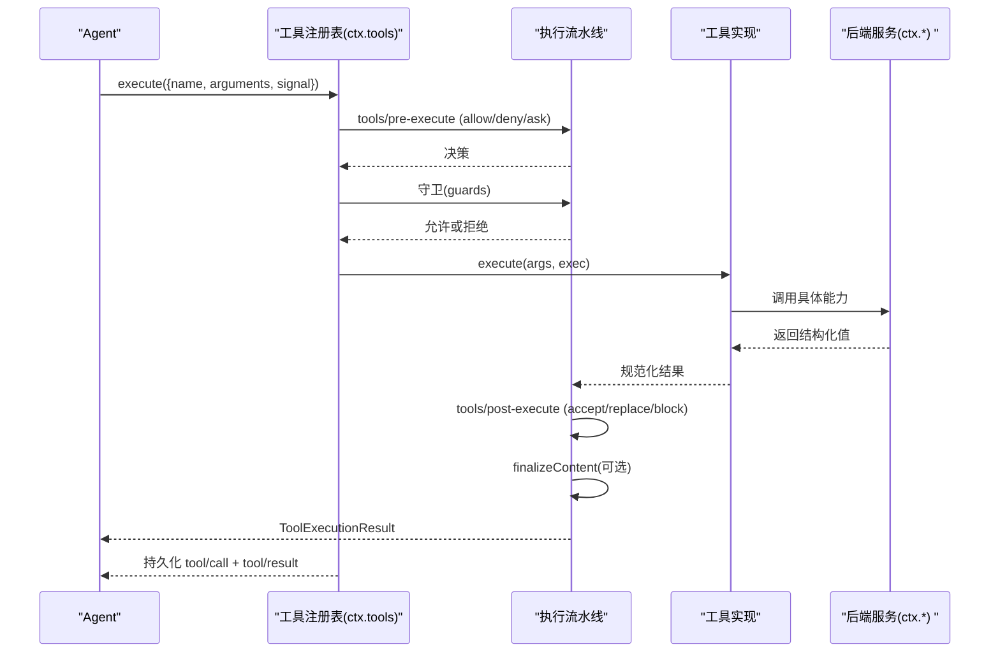
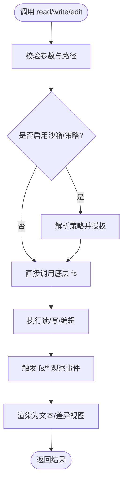
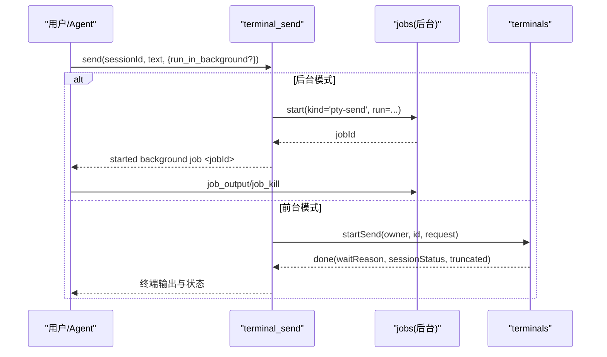
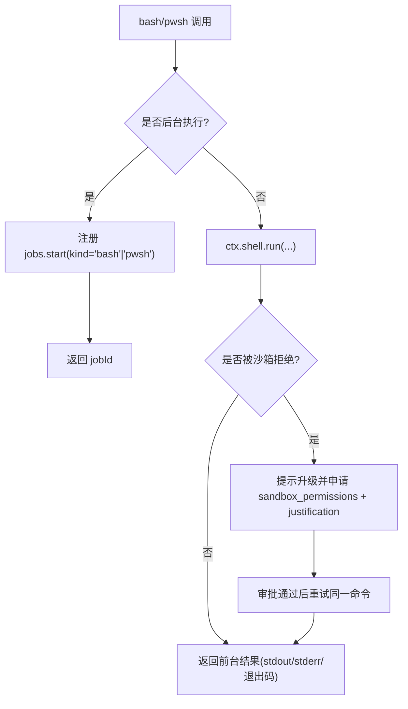
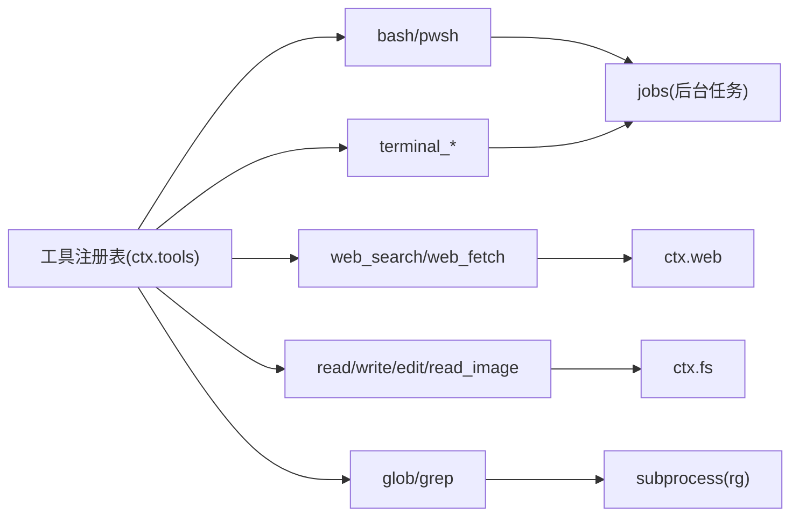

# 内置工具详解

<cite>
**本文引用的文件**
- [docs/tool-catalog.md](file://docs/tool-catalog.md)
- [docs/subsystems/tools.md](file://docs/subsystems/tools.md)
- [packages/core/tools/src/index.ts](file://packages/core/tools/src/index.ts)
- [scripts/gen-tool-catalog.ts](file://scripts/gen-tool-catalog.ts)
- [packages/fs/tool-fs/src/index.ts](file://packages/fs/tool-fs/src/index.ts)
- [packages/shell/tool-bash/src/index.ts](file://packages/shell/tool-bash/src/index.ts)
- [packages/web/tool-web/src/index.ts](file://packages/web/tool-web/src/index.ts)
- [packages/terminal/tool-terminal/src/index.ts](file://packages/terminal/tool-terminal/src/index.ts)
- [packages/fs/tool-fs-search/src/index.ts](file://packages/fs/tool-fs-search/src/index.ts)
</cite>

## 目录
1. [简介](#简介)
2. [项目结构](#项目结构)
3. [核心组件](#核心组件)
4. [架构总览](#架构总览)
5. [详细组件分析](#详细组件分析)
6. [依赖关系分析](#依赖关系分析)
7. [性能与限制](#性能与限制)
8. [故障排查指南](#故障排查指南)
9. [结论](#结论)
10. [附录：工具选择与组合实践](#附录工具选择与组合实践)

## 简介
本文件面向开发者，系统化介绍 DeepSeek Harness 的内置工具集，覆盖文件系统、终端、网络等核心能力。文档基于代码库中的工具注册、执行流水线与生成式工具目录，提供参数说明、返回值格式、使用场景、最佳实践、协作方式、性能特点与限制条件，帮助你在不同部署中选择合适的工具并进行安全可靠的集成。

## 项目结构
DeepSeek Harness 的工具以插件化方式组织在 packages/*/tool-* 下，每个工具包通过 defineTool 注册到 ctx.tools 注册表，并通过统一的执行流水线（pre-execute → guards → execute → post-execute → finalizeContent → result）运行。工具目录由脚本自动生成，确保模型可见的 schema 与实际实现一致。

图表来源
- [packages/core/tools/src/index.ts:787-801](file://packages/core/tools/src/index.ts#L787-L801)
- [scripts/gen-tool-catalog.ts:622-652](file://scripts/gen-tool-catalog.ts#L622-L652)

章节来源
- [docs/tool-catalog.md:1-42](file://docs/tool-catalog.md#L1-L42)
- [docs/subsystems/tools.md:1-12](file://docs/subsystems/tools.md#L1-L12)

## 核心组件
- 工具注册表与执行管线：定义 ToolDefinition、ToolExecution、ToolExecutionResult，以及 pre/execute/post 水线、guard、presentation 等扩展点。
- 工具目录生成：启动各工具插件并收集 schemas，保证文档与实现同步。
- 典型工具包：
  - 文件系统：read/write/edit/read_image（含沙箱策略与观察事件）
  - 终端：open/send/read/signal/close/list（支持后台任务与结果截断）
  - 网络：web_search/web_fetch（可配置超时与输出上限）
  - 搜索：glob/grep（基于 ripgrep，结果溢出时落盘）
  - Shell：bash/pwsh（前台/后台执行，沙箱升级审批）

章节来源
- [docs/subsystems/tools.md:9-96](file://docs/subsystems/tools.md#L9-L96)
- [docs/subsystems/tools.md:170-404](file://docs/subsystems/tools.md#L170-L404)
- [scripts/gen-tool-catalog.ts:622-652](file://scripts/gen-tool-catalog.ts#L622-L652)

## 架构总览
工具调用从 Agent 发起，进入 ctx.tools.execute，经过预执行策略、守卫、执行体、后处理、最终内容渲染，最后产出不可变的结果并触发 result 事件。模型可见的 schema 由注册表白名单投影，不包含执行回调等内部字段。

图表来源
- [docs/subsystems/tools.md:170-404](file://docs/subsystems/tools.md#L170-L404)
- [packages/core/tools/src/index.ts:787-801](file://packages/core/tools/src/index.ts#L787-L801)

## 详细组件分析

### 文件系统工具（read/write/edit/read_image）
- 功能要点
  - read：按行窗口读取文本，支持 limit/offset，超大文件流式读取。
  - write：创建或覆盖 UTF-8 文本。
  - edit：精确替换文本片段，支持 replace_all。
  - read_image：读取图片并作为附件持久化，需要挂载 attachments 且当前模型支持图像输入。
- 参数与返回
  - 参数遵循 JSON Schema，包含 file_path、content、old_string/new_string、limit/offset 等。
  - 返回为统一的结构化值，渲染为文本块；编辑类操作会附带变更元信息用于 UI diff。
- 安全与策略
  - 读前写/编辑策略由 fs 观察策略插件注入，不改变 schema。
  - 沙箱模式下的读写受策略控制，失败会返回明确的沙箱拒绝标记。
- 使用建议
  - 大文件优先用 read 的分页读取，避免一次性加载。
  - 编辑时使用足够上下文的 old_str 以保证唯一匹配。
  - 图片读取需确认模型能力与附件存储可用。

图表来源
- [packages/fs/tool-fs/src/index.ts:21-79](file://packages/fs/tool-fs/src/index.ts#L21-L79)
- [docs/tool-catalog.md:599-715](file://docs/tool-catalog.md#L599-L715)

章节来源
- [packages/fs/tool-fs/src/index.ts:21-79](file://packages/fs/tool-fs/src/index.ts#L21-L79)
- [docs/tool-catalog.md:599-715](file://docs/tool-catalog.md#L599-L715)

### 终端工具（terminal_open/send/read/signal/close/list）
- 功能要点
  - 维护持久化 PTY 会话，支持发送文本、读取输出、信号控制、列出会话、关闭会话。
  - 支持后台发送（run_in_background），返回 jobId 并通过 job_* 工具管理。
- 参数与返回
  - 参数包括 sessionId、text、submit、offset/count、signal 等。
  - 返回包含 viewport、waitReason、sessionStatus、truncated 等，结果会被截断到 maxResultBytes。
- 使用建议
  - 交互式或需要状态保持的任务使用终端；一次性命令优先用 bash/pwsh。
  - 后台任务完成后及时清理会话，避免资源泄漏。
  - 注意 stdin 等待与超时，合理设置 submit 标志。

图表来源
- [packages/terminal/tool-terminal/src/index.ts:146-399](file://packages/terminal/tool-terminal/src/index.ts#L146-L399)

章节来源
- [packages/terminal/tool-terminal/src/index.ts:146-399](file://packages/terminal/tool-terminal/src/index.ts#L146-L399)
- [docs/tool-catalog.md:776-800](file://docs/tool-catalog.md#L776-L800)

### 网络工具（web_search/web_fetch）
- 功能要点
  - web_search：搜索并返回结构化来源与答案，支持结果数量上限。
  - web_fetch：抓取 URL 内容，支持输出字符上限与超时预算。
- 参数与返回
  - 搜索：pattern、path、include 等；返回 sources、answer、truncated。
  - 抓取：url、headers、timeoutMs、maxOutputChars 等；返回 statusCode、body、truncated。
- 使用建议
  - 合理设置超时与输出上限，避免长耗时与大响应阻塞。
  - 对搜索结果进行去重与过滤，结合 read 工具深入阅读关键页面。

章节来源
- [docs/tool-catalog.md:41-42](file://docs/tool-catalog.md#L41-L42)
- [packages/web/tool-web/src/index.ts:20-91](file://packages/web/tool-web/src/index.ts#L20-L91)

### Shell 工具（bash/pwsh）
- 功能要点
  - 每次调用在独立进程中执行，无状态；支持 workdir、timeoutMs、run_in_background。
  - 支持沙箱模式与升级审批（sandbox_permissions + justification）。
  - Windows 环境使用 pwsh，路径与环境变量遵循平台约定。
- 参数与返回
  - 参数：command、description、timeoutMs、workdir、run_in_background、sandbox_permissions、justification。
  - 返回：foreground 包含 stdout/stderr、exitCode、timedOut、aborted、sandbox 信息；background 返回 jobId。
- 使用建议
  - 长任务使用后台模式，配合 job_* 工具监控与终止。
  - 遇到沙箱拒绝时，依据提示在同一轮内申请更宽权限并给出理由。
  - 不要依赖 shell 状态跨调用传递，始终显式传入 workdir。

图表来源
- [packages/shell/tool-bash/src/index.ts:190-394](file://packages/shell/tool-bash/src/index.ts#L190-L394)
- [docs/tool-catalog.md:176-263](file://docs/tool-catalog.md#L176-L263)

章节来源
- [packages/shell/tool-bash/src/index.ts:30-394](file://packages/shell/tool-bash/src/index.ts#L30-L394)
- [docs/tool-catalog.md:176-263](file://docs/tool-catalog.md#L176-L263)

### 文件系统搜索（glob/grep）
- 功能要点
  - 基于打包的 ripgrep 二进制，无需系统安装 rg；通过 ctx.subprocess 执行。
  - glob：匹配文件路径，支持采样与溢出落盘。
  - grep：正则搜索内容，分组返回匹配行与文件，支持 include 过滤。
- 参数与返回
  - glob：pattern、path；返回路径列表或采样结果，完整列表可能保存到 spillStore。
  - grep：pattern、path、include；返回匹配行与位置，超出限制时保存完整结果。
- 使用建议
  - 大范围搜索先缩小 path 或使用 include 限定范围。
  - 结果溢出时通过返回的定位符继续读取或搜索。

章节来源
- [packages/fs/tool-fs-search/src/index.ts:66-160](file://packages/fs/tool-fs-search/src/index.ts#L66-L160)
- [docs/tool-catalog.md:716-774](file://docs/tool-catalog.md#L716-L774)

## 依赖关系分析
- 工具注册表依赖 systemPrompt 以注入提示词片段，依赖各后端服务（shell/web/fs/terminals/subprocess）。
- 工具目录生成器会为每个工具包启动独立 Context，收集 schemas，确保文档与实现一致。
- 工具之间通过通用能力协作：
  - bash/pwsh 与 jobs 协作完成后台任务。
  - terminal 与 jobs 协作完成后台发送。
  - fs-search 与 subprocess 协作执行 rg。
  - web 工具与 ctx.web 协作，屏蔽提供商细节。

图表来源
- [packages/core/tools/src/index.ts:787-801](file://packages/core/tools/src/index.ts#L787-L801)
- [packages/shell/tool-bash/src/index.ts:190-394](file://packages/shell/tool-bash/src/index.ts#L190-L394)
- [packages/terminal/tool-terminal/src/index.ts:146-399](file://packages/terminal/tool-terminal/src/index.ts#L146-L399)
- [packages/fs/tool-fs-search/src/index.ts:66-160](file://packages/fs/tool-fs-search/src/index.ts#L66-L160)
- [packages/web/tool-web/src/index.ts:20-91](file://packages/web/tool-web/src/index.ts#L20-L91)

章节来源
- [scripts/gen-tool-catalog.ts:622-652](file://scripts/gen-tool-catalog.ts#L622-L652)
- [docs/subsystems/tools.md:170-404](file://docs/subsystems/tools.md#L170-L404)

## 性能与限制
- 超时与取消
  - 工具可通过 timeoutMs 声明合作式超时预算，由工具调用超时策略执行。
  - 所有异步工作应监听 exec.signal，确保取消可达。
- 并发与安全
  - isConcurrencySafe 可将工具归类为可并行执行；否则形成独占屏障。
  - 工具执行结果在管道中被冻结，保证观察者一致性。
- 输出与内存
  - 终端结果默认最大字节数限制；fs 读取支持行/字符/字节上限与流式读取。
  - 搜索工具对原始输出大小有限制，溢出时通过 spillStore 保存完整结果。
- 沙箱与策略
  - bash/pwsh 与 fs 工具受沙箱策略约束；拒绝时提供明确标记与升级路径。
- 网络工具
  - 默认超时与输出上限保护系统稳定性；可根据部署需求调整。

章节来源
- [docs/subsystems/tools.md:54-96](file://docs/subsystems/tools.md#L54-L96)
- [packages/web/tool-web/src/index.ts:26-91](file://packages/web/tool-web/src/index.ts#L26-L91)
- [packages/fs/tool-fs-search/src/index.ts:72-160](file://packages/fs/tool-fs-search/src/index.ts#L72-L160)
- [packages/terminal/tool-terminal/src/index.ts:29-46](file://packages/terminal/tool-terminal/src/index.ts#L29-L46)

## 故障排查指南
- 常见错误类型
  - 未知工具：UNKNOWN_TOOL（工具未注册或不可见）
  - 参数无效：INVALID_ARGS（参数不符合 schema）
  - 输出无效：INVALID_TOOL_OUTPUT（执行体返回值不符合 output.schema）
  - 沙箱拒绝：sandbox 相关错误，需检查策略与升级审批
  - 超时/中止：ABORTED_BEFORE_DISPATCH 或 ABORTED
- 定位步骤
  - 查看 tool/call 与 tool/result 事件，确认执行身份与参数快照。
  - 检查 tools/pre-execute 与 guards 是否拒绝。
  - 对于后台任务，使用 job_list/job_output/job_kill 诊断。
  - 搜索工具溢出时，根据返回定位符读取完整结果。
  - 网络工具检查超时与输出上限，必要时调优 fetch/search 配置。

章节来源
- [docs/subsystems/tools.md:327-404](file://docs/subsystems/tools.md#L327-L404)
- [packages/shell/tool-bash/src/index.ts:190-394](file://packages/shell/tool-bash/src/index.ts#L190-L394)
- [packages/terminal/tool-terminal/src/index.ts:146-399](file://packages/terminal/tool-terminal/src/index.ts#L146-L399)

## 结论
DeepSeek Harness 的工具体系以注册表与执行流水线为核心，将模型可见的 schema 与内部执行解耦，提供安全、可扩展、可观测的工具能力。文件系统、终端、网络、Shell 与搜索工具覆盖了常见的自动化场景，并通过策略、沙箱、超时与并发控制保障稳定性。建议在部署中按需启用工具、配置合理的限制与策略，并结合 jobs 与 spillStore 构建健壮的工作流。

## 附录：工具选择与组合实践
- 选择指导
  - 一次性命令：优先 bash/pwsh；复杂交互或需要状态：terminal。
  - 文件操作：read/write/edit；批量发现：glob/grep。
  - 网络访问：web_search 获取摘要，web_fetch 深入抓取。
  - 长时间任务：后台模式 + job_* 管理。
- 组合示例
  - 搜索→读取：先用 glob/grep 定位目标文件，再用 read 获取上下文，edit 修改后验证。
  - 抓取→分析：web_fetch 获取页面，write 保存本地，再 grep 提取关键信息。
  - 终端+后台：terminal_send 后台运行 REPL 或调试任务，job_output 轮询输出，结束时 terminal_close。
- 最佳实践
  - 始终提供清晰的 description 与必要参数，便于 UI 呈现与审计。
  - 合理设置超时与输出上限，避免资源占用过大。
  - 沙箱拒绝时按流程升级审批，避免绕过策略。
  - 使用 presentation 自定义卡片提升可读性（如 terminal/diff/search/read/web）。

章节来源
- [docs/tool-catalog.md:16-42](file://docs/tool-catalog.md#L16-L42)
- [docs/subsystems/tools.md:459-468](file://docs/subsystems/tools.md#L459-L468)