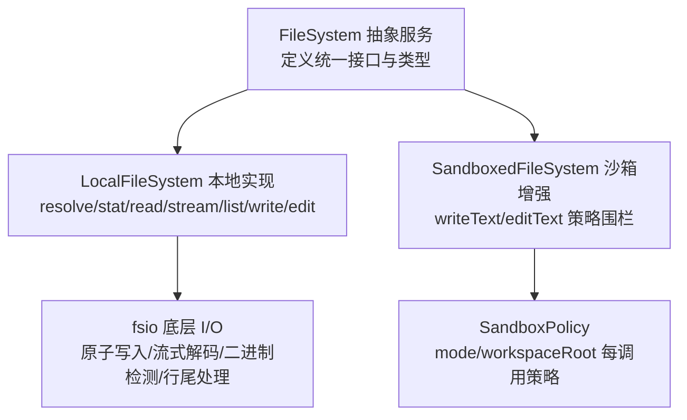
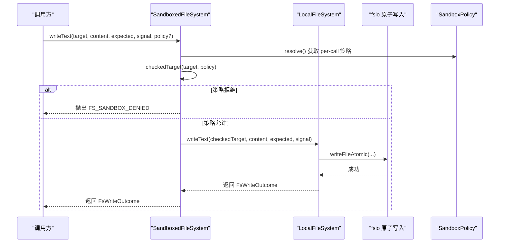
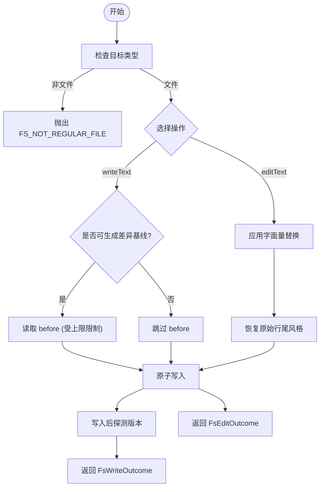
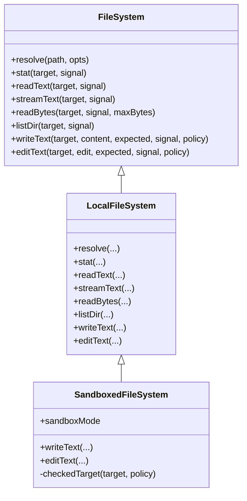
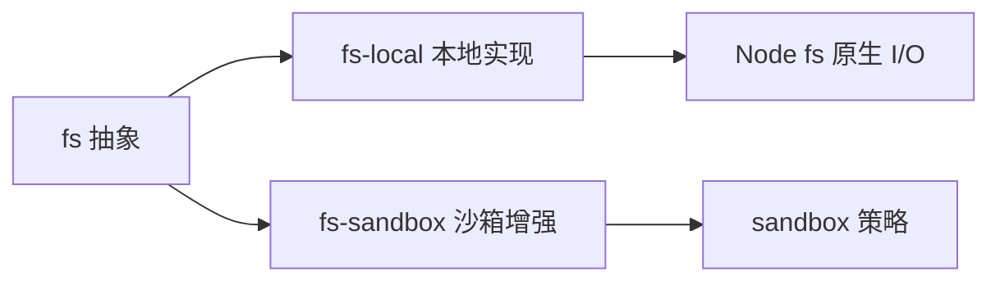

# 文件系统工具

<cite>
**本文引用的文件**
- [packages/fs/fs/src/index.ts](file://packages/fs/fs/src/index.ts)
- [packages/fs/fs/src/types.ts](file://packages/fs/fs/src/types.ts)
- [packages/fs/fs-local/src/index.ts](file://packages/fs/fs-local/src/index.ts)
- [packages/fs/fs-local/src/fsio.ts](file://packages/fs/fs-local/src/fsio.ts)
- [packages/fs/fs-sandbox/src/index.ts](file://packages/fs/fs-sandbox/src/index.ts)
- [packages/sandbox/sandbox/src/index.ts](file://packages/sandbox/sandbox/src/index.ts)
</cite>

## 目录
1. [简介](#简介)
2. [项目结构](#项目结构)
3. [核心组件](#核心组件)
4. [架构总览](#架构总览)
5. [详细组件分析](#详细组件分析)
6. [依赖关系分析](#依赖关系分析)
7. [性能考虑](#性能考虑)
8. [故障排查指南](#故障排查指南)
9. [结论](#结论)
10. [附录：使用示例与最佳实践](#附录使用示例与最佳实践)

## 简介
本文件面向 DeepSeek Harness 的文件系统工具，聚焦 read、write、edit、read_image（通过二进制读取能力实现）等核心操作。文档从服务定义、本地实现、沙箱策略到错误模型与性能优化进行系统化说明，帮助开发者在权限控制、沙箱机制和并发安全的前提下，正确集成和使用文件系统能力。

## 项目结构
文件系统能力由“抽象服务 + 本地实现 + 沙箱增强”三层组成：
- 抽象服务层：定义统一的 FileSystem 接口、目标标识 FsTarget、版本 FsVersion、读写/编辑请求与结果类型、错误码体系。
- 本地实现层：基于宿主文件系统提供解析、统计、文本/流式读取、字节读取、目录列举、原子写入与字面量编辑。
- 沙箱增强层：继承本地实现，对写/编辑施加每调用策略检查（只读、工作区可写、危险全访问），并拒绝越权路径。

图表来源
- [packages/fs/fs/src/index.ts:86-249](file://packages/fs/fs/src/index.ts#L86-L249)
- [packages/fs/fs-local/src/index.ts:64-262](file://packages/fs/fs-local/src/index.ts#L64-L262)
- [packages/fs/fs-local/src/fsio.ts:533-615](file://packages/fs/fs-local/src/fsio.ts#L533-L615)
- [packages/fs/fs-sandbox/src/index.ts:59-148](file://packages/fs/fs-sandbox/src/index.ts#L59-L148)
- [packages/sandbox/sandbox/src/index.ts:23-72](file://packages/sandbox/sandbox/src/index.ts#L23-L72)

章节来源
- [packages/fs/fs/src/index.ts:86-249](file://packages/fs/fs/src/index.ts#L86-L249)
- [packages/fs/fs-local/src/index.ts:64-262](file://packages/fs/fs-local/src/index.ts#L64-L262)
- [packages/fs/fs-sandbox/src/index.ts:59-148](file://packages/fs/fs-sandbox/src/index.ts#L59-L148)
- [packages/sandbox/sandbox/src/index.ts:23-72](file://packages/sandbox/sandbox/src/index.ts#L23-L72)

## 核心组件
- FileSystem（抽象服务）
  - 关键方法：resolve、processPath、fileUrl、contains、stat、lstat、readText、streamText、readBytes、listDir、writeText、editText。
  - 语义要点：
    - 目标稳定：同一文件在不同别名下保持相同 targetKey。
    - 文本读取：UTF-8 解码，二进制拒绝；流式读取跨块解码且支持中止。
    - 字节读取：带 maxBytes 上限，超限时返回 FS_TOO_LARGE。
    - 原子写入/编辑：以版本守卫防过期，保证并发安全。
- LocalFileSystem（本地实现）
  - 基于 realpath 的目标身份；按 targetKey 串行化写/编辑，避免竞态。
  - 原子写入：私有暂存目录 + 同步后重命名；Windows 保留 DACL。
  - 编辑：字面量匹配，行尾归一化为 LF 后再恢复原风格。
- SandboxedFileSystem（沙箱增强）
  - 仅对 writeText/editText 加策略围栏；读操作不受限。
  - 策略模式：read-only、workspace-write、danger-full-access。
  - workspace-write：重新解析最新路径并校验是否位于可写根集合内。
- SandboxPolicy（执行策略）
  - 每调用携带 mode 与 workspaceRoot；默认模式由后端暴露给工具层用于提示升级。

章节来源
- [packages/fs/fs/src/index.ts:86-249](file://packages/fs/fs/src/index.ts#L86-L249)
- [packages/fs/fs-local/src/index.ts:64-262](file://packages/fs/fs-local/src/index.ts#L64-L262)
- [packages/fs/fs-sandbox/src/index.ts:59-148](file://packages/fs/fs-sandbox/src/index.ts#L59-L148)
- [packages/sandbox/sandbox/src/index.ts:23-72](file://packages/sandbox/sandbox/src/index.ts#L23-L72)

## 架构总览
下图展示一次受控的写操作流程：工具层传入目标与内容，沙箱层根据策略校验路径归属，再委托本地实现完成原子写入。

图表来源
- [packages/fs/fs-sandbox/src/index.ts:84-113](file://packages/fs/fs-sandbox/src/index.ts#L84-L113)
- [packages/fs/fs-local/src/index.ts:166-218](file://packages/fs/fs-local/src/index.ts#L166-L218)
- [packages/fs/fs-local/src/fsio.ts:533-615](file://packages/fs/fs-local/src/fsio.ts#L533-L615)
- [packages/sandbox/sandbox/src/index.ts:39-72](file://packages/sandbox/sandbox/src/index.ts#L39-L72)

## 详细组件分析

### 抽象服务 FileSystem
- 设计要点
  - 目标与版本：FsTarget/FsVersion 为品牌化字符串，禁止消费者自行构造或解析。
  - 文本与流：readText 一次性读取；streamText 流式输出，跨块 UTF-8 解码，支持 AbortSignal。
  - 字节读取：readBytes 带 maxBytes 上限，超过即失败，防止无界缓冲。
  - 原子变更：writeText/editText 支持预期守卫（createIfAbsent/replaceIfVersion），确保并发安全与一致性。
- 事件扩展点
  - fs/write-intent、fs/edit-intent：单槽决策，首个返回者拥有决定权。
  - fs/observed：记录存在/不存在观察，用于窗口策略。

章节来源
- [packages/fs/fs/src/index.ts:44-78](file://packages/fs/fs/src/index.ts#L44-L78)
- [packages/fs/fs/src/index.ts:86-249](file://packages/fs/fs/src/index.ts#L86-L249)

### 本地实现 LocalFileSystem
- 路径与元数据
  - resolve：相对路径基于 cwd 解析，返回稳定 targetKey。
  - stat/lstat：返回 version/type/size；lstat 不跟随最终符号链接。
  - contains：判断子目标是否在父目录下。
- 读取
  - readText：非正则文件/无效 UTF-8/NUL 样本检测会报错。
  - streamText：流式解码，逐块检测二进制，支持中止。
  - readBytes：先 stat 大小，再流式读取至 maxBytes，超限抛错。
- 目录列举
  - listDir：稳定排序，仅返回名称/类型/目标与轻量元信息，不读内容。
- 写入与编辑
  - writeText：可选 diff 基线（受 diffBasisMaxBytes 限制），原子发布，LF 归一化。
  - editText：字面量替换，行尾检测与恢复，版本守卫防过期。
  - 并发：按 targetKey 锁队列串行化写/编辑，避免交错。

图表来源
- [packages/fs/fs-local/src/index.ts:166-255](file://packages/fs/fs-local/src/index.ts#L166-L255)
- [packages/fs/fs-local/src/fsio.ts:670-746](file://packages/fs/fs-local/src/fsio.ts#L670-L746)
- [packages/fs/fs-local/src/fsio.ts:533-615](file://packages/fs/fs-local/src/fsio.ts#L533-L615)

章节来源
- [packages/fs/fs-local/src/index.ts:64-262](file://packages/fs/fs-local/src/index.ts#L64-L262)
- [packages/fs/fs-local/src/fsio.ts:375-463](file://packages/fs/fs-local/src/fsio.ts#L375-L463)
- [packages/fs/fs-local/src/fsio.ts:533-615](file://packages/fs/fs-local/src/fsio.ts#L533-L615)
- [packages/fs/fs-local/src/fsio.ts:670-746](file://packages/fs/fs-local/src/fsio.ts#L670-L746)

### 沙箱增强 SandboxedFileSystem
- 策略围栏
  - read-only：拒绝所有写/编辑，抛出 FS_SANDBOX_DENIED。
  - workspace-write：重新解析目标路径，校验是否位于 writableRoots 集合中。
  - danger-full-access：直接放行。
- 行为
  - 仅拦截 writeText/editText；读操作透传。
  - 使用 fresh target 进行后续 I/O，避免 TOCTOU。

图表来源
- [packages/fs/fs/src/index.ts:86-249](file://packages/fs/fs/src/index.ts#L86-L249)
- [packages/fs/fs-local/src/index.ts:64-262](file://packages/fs/fs-local/src/index.ts#L64-L262)
- [packages/fs/fs-sandbox/src/index.ts:59-148](file://packages/fs/fs-sandbox/src/index.ts#L59-L148)

章节来源
- [packages/fs/fs-sandbox/src/index.ts:59-148](file://packages/fs/fs-sandbox/src/index.ts#L59-L148)

### 类型与错误模型
- 类型
  - FsTarget/FsVersion：品牌化字符串，禁止解析。
  - FsInfo/FsPathInfo/FsDirEntry：元数据描述。
  - FsWriteIntent：createIfAbsent / replaceIfVersion。
  - FsEditRequest：oldString/newString/replaceAll。
  - FsWriteOutcome/FsEditOutcome：包含 before/after/version。
- 错误码
  - FS_NOT_FOUND / FS_NOT_DIRECTORY / FS_NOT_TEXT / FS_NOT_REGULAR_FILE
  - FS_TOO_LARGE / FS_PERMISSION_DENIED / FS_SANDBOX_DENIED / FS_IO_ERROR
  - FS_STALE_VERSION / FS_NOT_OBSERVED / FS_AMBIGUOUS_EDIT / FS_EDIT_NOT_FOUND / FS_ABORTED

章节来源
- [packages/fs/fs/src/types.ts:11-204](file://packages/fs/fs/src/types.ts#L11-L204)

## 依赖关系分析
- 模块耦合
  - fs 抽象被 local 与 sandbox 共同依赖，形成稳定的能力契约。
  - fs-local 依赖 Node.js fs/promises、path、url 等标准库。
  - fs-sandbox 依赖 sandbox 的策略与可写根计算。
- 外部依赖
  - 平台相关：Windows 的 DACL 复制与替换；POSIX 的重命名原子性。
  - 沙箱后端：bwrap/Landlock/Seatbelt 等由上层 shell 子系统负责，fs 层只做路径围栏。

图表来源
- [packages/fs/fs/src/index.ts:86-249](file://packages/fs/fs/src/index.ts#L86-L249)
- [packages/fs/fs-local/src/index.ts:64-262](file://packages/fs/fs-local/src/index.ts#L64-L262)
- [packages/fs/fs-sandbox/src/index.ts:59-148](file://packages/fs/fs-sandbox/src/index.ts#L59-L148)
- [packages/sandbox/sandbox/src/index.ts:23-72](file://packages/sandbox/sandbox/src/index.ts#L23-L72)

章节来源
- [packages/fs/fs/src/index.ts:86-249](file://packages/fs/fs/src/index.ts#L86-L249)
- [packages/fs/fs-local/src/index.ts:64-262](file://packages/fs/fs-local/src/index.ts#L64-L262)
- [packages/fs/fs-sandbox/src/index.ts:59-148](file://packages/fs/fs-sandbox/src/index.ts#L59-L148)
- [packages/sandbox/sandbox/src/index.ts:23-72](file://packages/sandbox/sandbox/src/index.ts#L23-L72)

## 性能考虑
- 大文件读取
  - 优先使用 streamText 流式处理，避免整文件驻留内存。
  - 二进制/超大文件：readBytes 配合 maxBytes 上限，超限立即失败，避免无界分配。
- 原子写入
  - 私有暂存目录 + 同步后重命名，减少中间态风险；Windows 保留 DACL。
  - 差异基线读取受 diffBasisMaxBytes 限制，避免过大的 before 缓存。
- 并发安全
  - 按 targetKey 串行化写/编辑，保证并发场景下的版本一致性与确定性顺序。
- 中止与取消
  - 所有 I/O 路径支持 AbortSignal，及时释放资源。

[本节为通用指导，无需具体文件引用]

## 故障排查指南
- 常见错误与定位
  - FS_NOT_TEXT：读取/编辑遇到二进制或非法 UTF-8。检查文件编码与是否为图片/二进制。
  - FS_TOO_LARGE：readBytes 超出 maxBytes。调整上限或改用流式处理。
  - FS_STALE_VERSION：写/编辑时版本已变化。需先读取最新内容或使用正确的版本守卫。
  - FS_NOT_OBSERVED：createIfAbsent 写入到已存在文件。应先读取或改为覆盖写。
  - FS_AMBIGUOUS_EDIT：字面量匹配多次但未设置 replaceAll。提供更精确 oldString 或启用全局替换。
  - FS_SANDBOX_DENIED：策略拒绝写入。检查当前 mode 与 workspaceRoot，必要时申请升级。
  - FS_ABORTED：调用被中止。检查上游信号与超时配置。
- 调试建议
  - 使用 lstat 确认路径类型与是否存在，尤其是符号链接场景。
  - 在沙箱模式下，打印策略 mode 与 workspaceRoot，确认路径是否落入可写根。
  - 对于编辑失败，先读取 before/after 对比，定位匹配问题。

章节来源
- [packages/fs/fs/src/types.ts:170-204](file://packages/fs/fs/src/types.ts#L170-L204)
- [packages/fs/fs-local/src/fsio.ts:375-463](file://packages/fs/fs-local/src/fsio.ts#L375-L463)
- [packages/fs/fs-local/src/fsio.ts:533-615](file://packages/fs/fs-local/src/fsio.ts#L533-L615)
- [packages/fs/fs-local/src/fsio.ts:670-746](file://packages/fs/fs-local/src/fsio.ts#L670-L746)
- [packages/fs/fs-sandbox/src/index.ts:126-148](file://packages/fs/fs-sandbox/src/index.ts#L126-L148)

## 结论
DeepSeek Harness 的文件系统工具通过清晰的抽象、稳健的本地实现与严格的沙箱策略，提供了安全、一致且高性能的文件读写能力。开发者应遵循以下原则：
- 使用流式 API 处理大文件，严格限制 readBytes 的上限。
- 利用版本守卫与原子写入保障并发安全。
- 在沙箱环境中依据策略选择合适的工作区路径，必要时申请升级。
- 借助结构化错误码快速定位问题，结合 lstat/stat 与策略信息进行排障。

[本节为总结性内容，无需具体文件引用]

## 附录：使用示例与最佳实践

- 文件读取限制与流式处理
  - 小文本：使用 readText 获取完整内容。
  - 大文本：使用 streamText 分块处理，注意捕获中止与异常。
  - 二进制/图片：使用 readBytes 并设置合理的 maxBytes；若需显示图片，可在上层将二进制转为附件或 URL。
- 原子写入与编辑
  - 无条件覆盖：省略 expected 参数。
  - 创建若不存在：expected.kind = 'createIfAbsent'，避免覆盖已有文件。
  - 版本保护：expected.kind = 'replaceIfVersion' 并附带上次读取的版本。
  - 字面量编辑：提供 oldString/newString；如需全局替换，设置 replaceAll=true。
- 沙箱与权限
  - 只读模式：任何写/编辑都会失败，需切换模式或提升权限。
  - 工作区可写：确保目标路径落在可写根集合内。
  - 危险全访问：仅在可信环境使用。
- 图片读取（read_image）
  - 通过 readBytes 读取图片二进制，设置合理上限，避免溢出。
  - 在上层将二进制转换为可展示的媒体形式（如 base64 或临时 URL）。
- 最佳实践
  - 始终使用 resolve 获得稳定目标，不要拼接路径。
  - 写前用 stat/lstat 检查类型与存在性。
  - 对并发写/编辑，依赖内部锁与版本守卫，避免手工竞争。
  - 正确处理 AbortSignal，确保超时与取消及时生效。

[本节为概念性指导，无需具体文件引用]