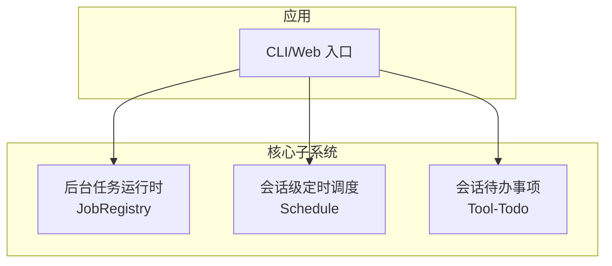
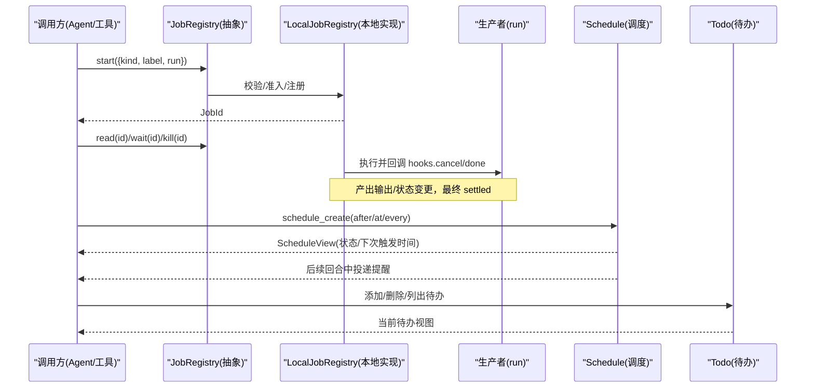
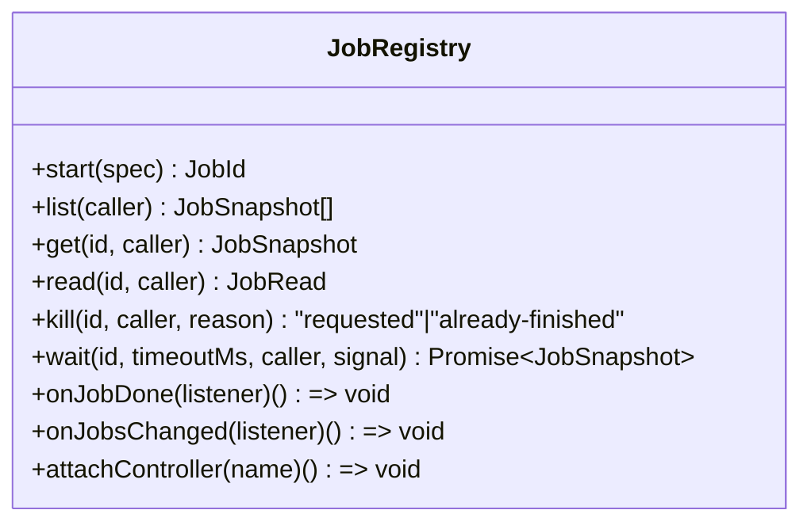
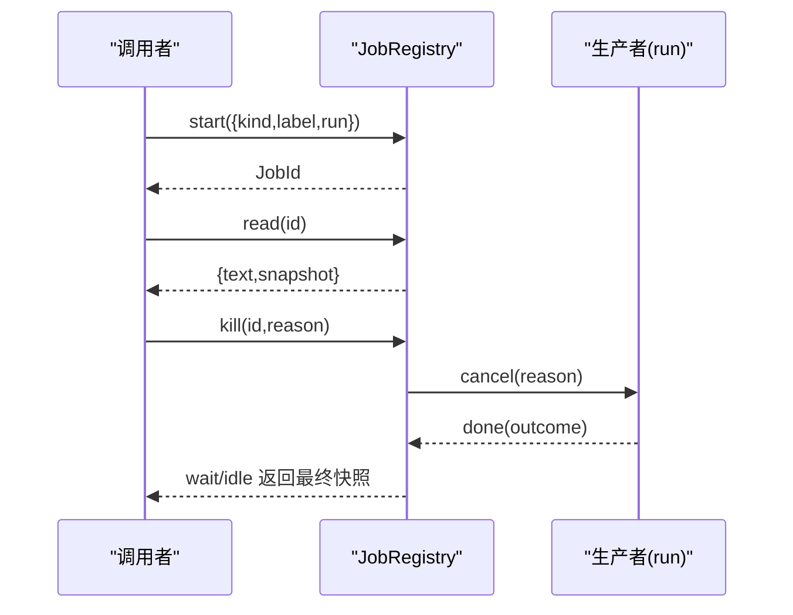
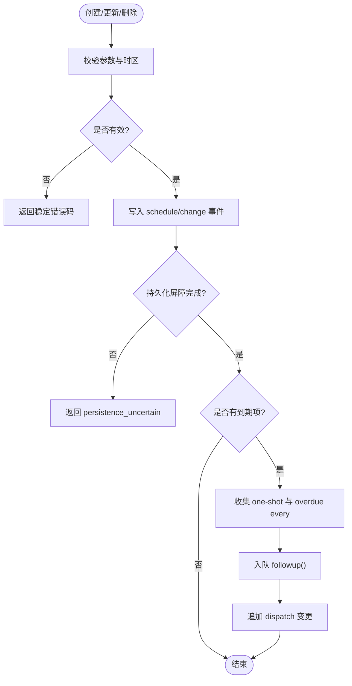
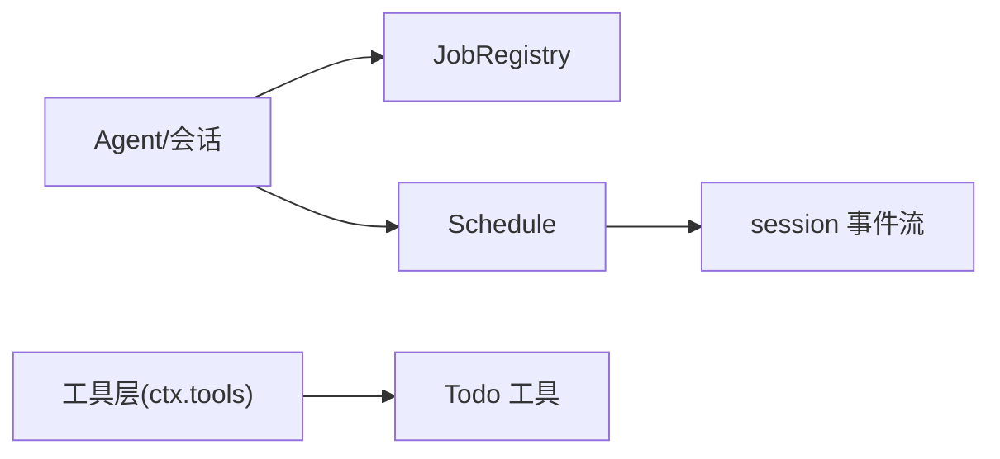

# 系统工具

<cite>
**本文引用的文件**
- [README.md](file://README.md)
- [jobs.md](file://docs/subsystems/jobs.md)
- [schedule.md](file://docs/subsystems/schedule.md)
- [JobRegistry 抽象接口](file://packages/jobs/jobs/src/index.ts)
- [Schedule 类型定义](file://packages/schedule/schedule/src/types.ts)
- [Todo 能力说明](file://packages/todo/README.md)
</cite>

## 目录
1. [简介](#简介)
2. [项目结构](#项目结构)
3. [核心组件](#核心组件)
4. [架构总览](#架构总览)
5. [详细组件分析](#详细组件分析)
6. [依赖关系分析](#依赖关系分析)
7. [性能与并发控制](#性能与并发控制)
8. [监控、指标与故障恢复](#监控指标与故障恢复)
9. [使用示例与实践](#使用示例与实践)
10. [常见问题与排错](#常见问题与排错)
11. [结论与集成建议](#结论与集成建议)

## 简介
DeepSeek Harness（dsh）是一个以“一切皆插件”为设计思想的开源智能体运行框架，基于 Cordis 服务组合模型构建。本系统工具文档聚焦三大核心子系统：后台任务运行时（Jobs）、会话级定时调度（Schedule）与会话待办事项（Todo），覆盖任务管理参数、调度策略、状态跟踪、资源控制、监控与故障恢复，并提供面向开发者的集成指导与最佳实践。

## 项目结构
- 应用层
  - CLI/Web 入口与测试位于 apps/cli、apps/web
- 子系统与包
  - jobs：后台任务注册表与生命周期契约
  - schedule：会话内持久化提醒与固定速率调度
  - todo：会话级待办清单与工具暴露
- 文档
  - docs/subsystems：各子系统规范与契约说明
- 示例
  - examples：端到端场景与配置样例

图表来源
- [README.md:1-58](file://README.md#L1-L58)

章节来源
- [README.md:1-58](file://README.md#L1-L58)

## 核心组件
- 后台任务运行时（Jobs）
  - 提供 JobRegistry 抽象服务，统一任务启动、查询、读取输出、终止、等待完成、事件监听与控制器挂载
  - 支持按会话所有者进行访问控制，任务 ID 可预测但安全边界由授权决定
  - 本地实现维护并发上限与准入策略，默认每个所有者最大并发数可配置
- 会话级定时调度（Schedule）
  - 支持延迟触发（after）、绝对时间触发（at）、固定速率循环（every）三种规则
  - 所有记录持久化为 session 事件流，冷启动或繁忙时具备追赶与批处理机制
  - 交付模式限定为“会话内”，通过后续对话回合投递提醒内容
- 会话待办事项（Todo）
  - 单产品包，一个会话拥有唯一待办列表
  - 通过工具暴露增删查能力，渲染与持久化契约在子包中定义

章节来源
- [jobs.md:1-291](file://docs/subsystems/jobs.md#L1-L291)
- [schedule.md:1-187](file://docs/subsystems/schedule.md#L1-L187)
- [Todo 能力说明:1-14](file://packages/todo/README.md#L1-L14)

## 架构总览

图表来源
- [JobRegistry 抽象接口:1-180](file://packages/jobs/jobs/src/index.ts#L1-L180)
- [jobs.md:155-285](file://docs/subsystems/jobs.md#L155-L285)
- [schedule.md:100-187](file://docs/subsystems/schedule.md#L100-L187)
- [Todo 能力说明:1-14](file://packages/todo/README.md#L1-L14)

## 详细组件分析

### 后台任务运行时（Jobs）
- 关键概念
  - JobId：品牌化 ID，形如 <kind>-N；访问控制基于会话所有者授权而非 ID 保密性
  - JobKind：可扩展的键值映射，注册表将 kind 视为不透明命名空间
  - JobStatus：running | stopping | completed | killed | failed
  - JobStart：包含 kind、label、可选 outputLimitBytes、owner、run()
  - JobHooks：cancel(reason)、done Promise、可选 readOutput()
  - JobOutcome：status、detail、output
  - JobSnapshot：id、kind、label、outputLimitBytes、ownerSession、status、detail、startedAt、finishedAt、reported
  - JobRead：text、snapshot
- 服务行为
  - 原子 start：预检访问、验证、所有者清理、实现侧准入后启动并注册
  - list/get/read/kill/wait：会话级可见性与授权检查
  - onJobDone/onJobsChanged：效果作用域内的完成监听与可见集变化观察
  - attachController：挂载可读取与停止任务的控制器
  - 本地实现：maxConcurrentJobsPerOwner 默认 10，统计 running+stopping 计数，未归属任务共享桶，终端结算释放容量

图表来源
- [JobRegistry 抽象接口:1-180](file://packages/jobs/jobs/src/index.ts#L1-L180)

图表来源
- [jobs.md:24-96](file://docs/subsystems/jobs.md#L24-L96)
- [jobs.md:155-285](file://docs/subsystems/jobs.md#L155-L285)

章节来源
- [jobs.md:1-291](file://docs/subsystems/jobs.md#L1-L291)
- [JobRegistry 抽象接口:1-180](file://packages/jobs/jobs/src/index.ts#L1-L180)

### 会话级定时调度（Schedule）
- 记录类型
  - AfterScheduleRecord：延迟一次性提醒
  - AtScheduleRecord：绝对时间一次性提醒
  - EveryScheduleRecord：固定速率循环提醒（间隔≥5分钟）
- 输入与时区
  - at 选择器支持 RFC 3339 字符串或结构化 LocalAtInput（date/time/time_zone）
  - 拒绝无效偏移/时区、非未来目标、夏令时重叠区间等
- 固定速率与追赶
  - 冷/忙会话下，每条 every 仅贡献最近一次到期项，直接推进到下一个锚点对齐的目标
  - 多条 overdue 的 every 在同一批次中按目标与创建顺序合并
- 持久化与回放
  - 唯一权威事件：schedule/change
  - create/delete/dispatch 三类变更；dispatch 表示已入队，不保证下游成功
  - 严格解码器拒绝未知版本、多余字段、重复 id、不匹配转换
- 活跃视图与管理
  - ScheduleView：记录 + state(scheduled|overdue) + deliveryMode(session-local)
  - 管理操作序列化于 Agent 作用域队列；读/决策前等待持久化屏障
  - 错误码：invalid_prompt/selector/rule/time_zone/not_future/time_out_of_range/frequency_too_high/corrupt_schedule_log/persistence_uncertain/internal_error

图表来源
- [schedule.md:67-152](file://docs/subsystems/schedule.md#L67-L152)
- [schedule.md:154-187](file://docs/subsystems/schedule.md#L154-L187)

章节来源
- [schedule.md:1-187](file://docs/subsystems/schedule.md#L1-L187)
- [Schedule 类型定义:1-222](file://packages/schedule/schedule/src/types.ts#L1-L222)

### 会话待办事项（Todo）
- 定位：单产品包，一个会话拥有唯一待办列表
- 能力：通过工具暴露存储与展示，具体持久化与渲染契约在 tool-todo 子包中定义
- 事件：事件载荷见会话子系统文档

章节来源
- [Todo 能力说明:1-14](file://packages/todo/README.md#L1-L14)

## 依赖关系分析
- Jobs 与 Session/Agent
  - 任务所有权基于会话 ID 进行授权；任务生命周期与 Agent 作用域绑定
- Schedule 与 Session 事件流
  - 所有变更通过 session 事件持久化，回放与 fork 时从 seedLength 开始折叠
- Todo 与工具层
  - 作为工具注册到 ctx.tools，供上层编排调用

图表来源
- [jobs.md:155-285](file://docs/subsystems/jobs.md#L155-L285)
- [schedule.md:100-152](file://docs/subsystems/schedule.md#L100-L152)
- [Todo 能力说明:1-14](file://packages/todo/README.md#L1-L14)

章节来源
- [jobs.md:155-285](file://docs/subsystems/jobs.md#L155-L285)
- [schedule.md:100-152](file://docs/subsystems/schedule.md#L100-L152)
- [Todo 能力说明:1-14](file://packages/todo/README.md#L1-L14)

## 性能与并发控制
- 任务并发
  - 本地实现默认每个所有者最大并发数为 10，统计 running+stopping 数量；未归属任务共享桶；终端结算释放容量
- 调度批处理
  - 多条 overdue 的 every 会合并为单批次，限制模型回合开销；最小间隔 5 分钟
- 输出限流
  - 任务可通过 outputLimitBytes 限制单次完整输出的字节上限，避免大输出阻塞
- 建议
  - 合理设置 outputLimitBytes 与 maxConcurrentJobsPerOwner
  - 对长耗时任务采用流式 readOutput 增量消费
  - 使用 wait(timeout) 避免无限等待

章节来源
- [jobs.md:155-285](file://docs/subsystems/jobs.md#L155-L285)
- [schedule.md:92-99](file://docs/subsystems/schedule.md#L92-L99)

## 监控、指标与故障恢复
- 监控点
  - 任务：状态机（running→stopping→completed/killed/failed）、输出游标、reported 标记
  - 调度：scheduled/overdue 状态、dispatch 事件、决策时间 acceptedAt
  - 待办：列表变更与渲染一致性
- 指标建议
  - 任务：平均时长、失败率、取消率、吞吐、超时率
  - 调度：准时率、错过次数、批大小分布
  - 待办：创建/删除速率、滞留时长
- 故障恢复
  - 任务：teardown 取消会标记 reported；若 producer teardown 抛错，仅强制失败记录
  - 调度：冷启动重算定时器，过去目标转为 overdue；持久化屏障失败返回 persistence_uncertain
  - 待办：遵循会话事件回放，确保一致视图

章节来源
- [jobs.md:24-96](file://docs/subsystems/jobs.md#L24-L96)
- [jobs.md:155-285](file://docs/subsystems/jobs.md#L155-L285)
- [schedule.md:100-187](file://docs/subsystems/schedule.md#L100-L187)

## 使用示例与实践

- 后台任务执行
  - 启动任务：调用 start 传入 kind、label、run；获取 JobId
  - 读取输出：周期性 read 获取增量文本，直至 snapshot.status 为终态
  - 终止任务：kill 请求取消，随后等待 wait 获取最终快照
  - 参考路径
    - [jobs.md:24-96](file://docs/subsystems/jobs.md#L24-L96)
    - [jobs.md:155-285](file://docs/subsystems/jobs.md#L155-L285)

- 定时任务调度
  - 延迟触发：after_seconds > 0，自动规范化 scheduledAt
  - 绝对时间：at 使用 RFC 3339 或 LocalAtInput，需带时区
  - 固定速率：every_seconds ≥ 300，冷/忙会话追赶至最近对齐目标
  - 参考路径
    - [schedule.md:67-152](file://docs/subsystems/schedule.md#L67-L152)
    - [schedule.md:154-187](file://docs/subsystems/schedule.md#L154-L187)

- 工作队列管理
  - 使用 JobRegistry 的 list/get/read/kill/wait 组合实现队列式消费
  - 利用 onJobsChanged 监听可见集变化，按需重读
  - 参考路径
    - [jobs.md:155-285](file://docs/subsystems/jobs.md#L155-L285)

- 待办事项管理
  - 通过工具添加/删除/列出待办，结合会话上下文渲染
  - 参考路径
    - [Todo 能力说明:1-14](file://packages/todo/README.md#L1-L14)

- 最佳实践
  - 明确任务 owner，确保会话级授权边界
  - 为长任务启用流式输出与输出限流
  - 为调度任务设置合理的间隔与批处理阈值
  - 使用 wait(timeout) 避免阻塞，配合 onJobDone 做收尾

## 常见问题与排错
- 任务无法被杀死
  - 确认生产者实现了 cancel 并在合理时间内 resolve done
  - 检查调用者是否为该任务的 owner 或具有相应权限
  - 参考路径
    - [jobs.md:24-96](file://docs/subsystems/jobs.md#L24-L96)
    - [jobs.md:155-285](file://docs/subsystems/jobs.md#L155-L285)

- 调度未按时触发
  - 检查 at 时间是否在未来且时区正确
  - 确认会话处于热态或能重建定时器；cold 重启后会补发 overdue
  - 参考路径
    - [schedule.md:67-152](file://docs/subsystems/schedule.md#L67-L152)
    - [schedule.md:180-187](file://docs/subsystems/schedule.md#L180-L187)

- 输出过大导致卡顿
  - 设置 outputLimitBytes 限制单次输出
  - 使用 readOutput 增量消费
  - 参考路径
    - [jobs.md:24-96](file://docs/subsystems/jobs.md#L24-L96)

- 持久化不确定性
  - 当 schedule 管理操作遇到持久化屏障失败，会返回 persistence_uncertain
  - 重试时需考虑幂等与去重
  - 参考路径
    - [schedule.md:154-187](file://docs/subsystems/schedule.md#L154-L187)

## 结论与集成建议
- 任务与调度的职责清晰分离：Jobs 负责执行与生命周期，Schedule 负责时序与批处理，Todo 负责会话内计划呈现
- 集成建议
  - 在 Agent 初始化时注入 JobRegistry 与 Schedule，统一通过工具层暴露
  - 为外部系统对接提供稳定的错误码与幂等语义
  - 建立统一的监控与告警：任务失败/超时、调度错过、待办积压
  - 通过 onJobsChanged 与 session 事件回放保障一致性
- 扩展方向
  - 自定义 JobKind 与 Producer，接入更多执行环境
  - 扩展 Schedule 规则（如需 Cron 表达式可在上层封装）
  - 将 Todo 与外部协作平台打通，形成跨会话的计划协同