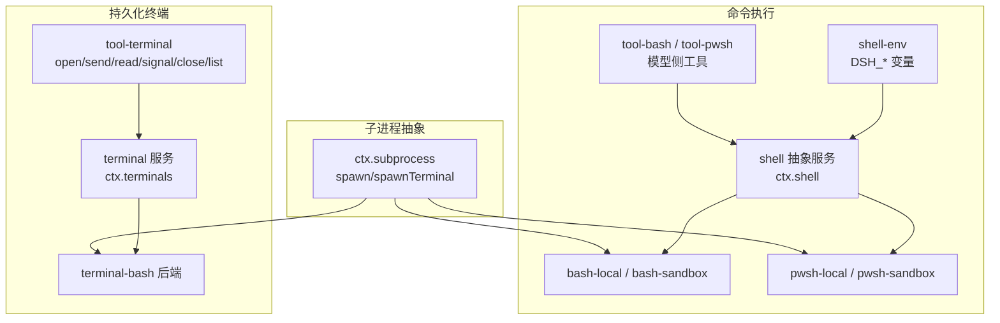
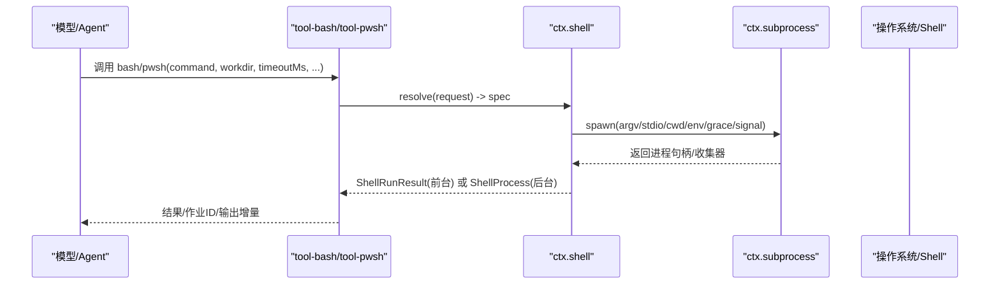
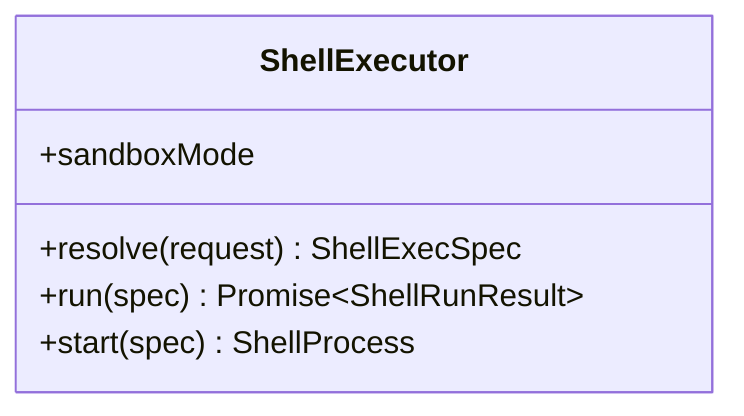
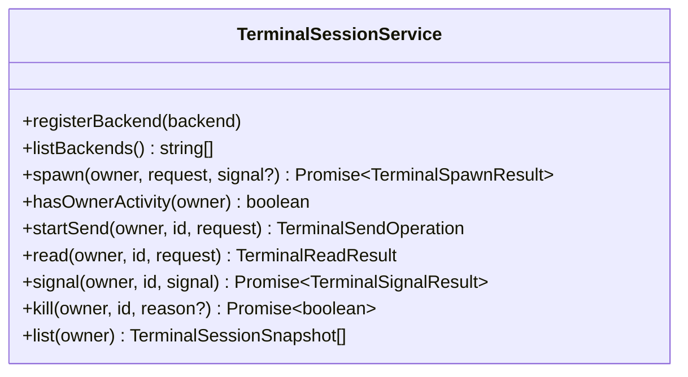
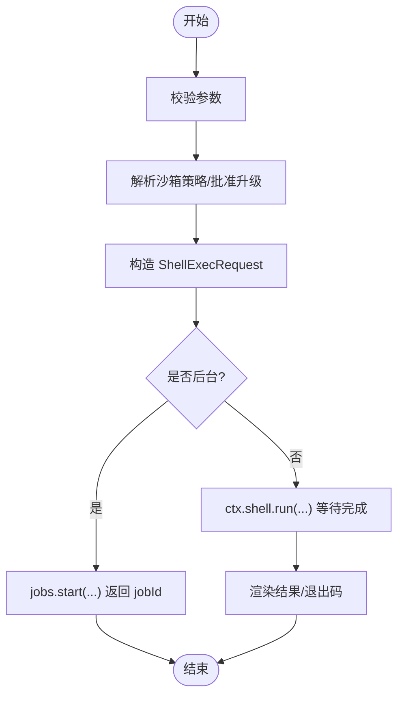
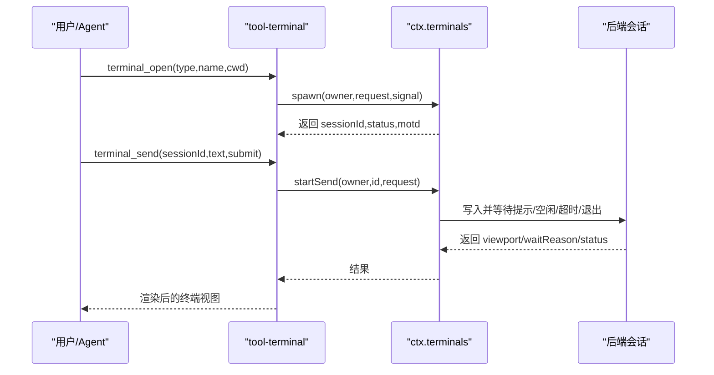
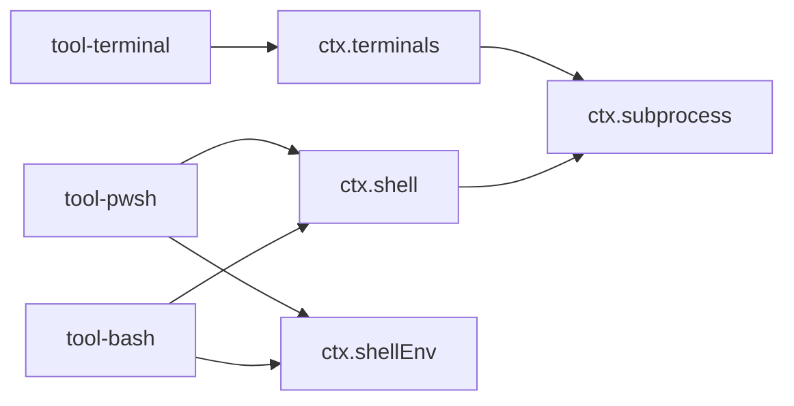

# 终端工具

<cite>
**本文引用的文件**
- [packages/terminal/README.md](file://packages/terminal/README.md)
- [packages/shell/README.md](file://packages/shell/README.md)
- [docs/subsystems/terminal.md](file://docs/subsystems/terminal.md)
- [docs/subsystems/shell.md](file://docs/subsystems/shell.md)
- [docs/subsystems/subprocess.md](file://docs/subsystems/subprocess.md)
- [packages/terminal/terminal/src/index.ts](file://packages/terminal/terminal/src/index.ts)
- [packages/shell/shell/src/index.ts](file://packages/shell/shell/src/index.ts)
- [packages/shell/tool-bash/src/index.ts](file://packages/shell/tool-bash/src/index.ts)
- [packages/shell/tool-pwsh/src/index.ts](file://packages/shell/tool-pwsh/src/index.ts)
- [packages/terminal/tool-terminal/src/index.ts](file://packages/terminal/tool-terminal/src/index.ts)
</cite>

## 目录
1. [简介](#简介)
2. [项目结构](#项目结构)
3. [核心组件](#核心组件)
4. [架构总览](#架构总览)
5. [详细组件分析](#详细组件分析)
6. [依赖关系分析](#依赖关系分析)
7. [性能与资源限制](#性能与资源限制)
8. [故障排查指南](#故障排查指南)
9. [结论](#结论)
10. [附录：使用示例与最佳实践](#附录使用示例与最佳实践)

## 简介
本文件面向 DeepSeek Harness 的“终端工具”能力，覆盖两类能力族：
- 一次性命令执行：bash、pwsh（PowerShell）工具，适合短任务、管道操作、环境变量注入、超时控制与沙箱策略。
- 持久化 PTY 会话：通过 terminal_open/send/read/signal/close/list 等工具维护跨调用状态的交互式终端或 REPL。

文档同时解释安全沙箱机制、权限升级流程、错误处理、超时管理、进程控制以及集成建议，帮助开发者在 CLI、自动化脚本与 Agent 工作流中做出合适的技术选型。

## 项目结构
围绕终端与命令执行的关键包与文档：
- 命令执行能力族（shell）：抽象服务定义、本地/沙箱实现、环境注册表、模型侧工具（bash/pwsh）。
- 持久化 PTY 能力族（terminal）：后端注册、会话生命周期、模型侧工具（open/send/read/signal/close/list）。
- 子进程抽象（subprocess）：可执行解析、标准 I/O 模式、收集输出、终止与等待、PTY 原语。

图表来源
- [packages/shell/shell/src/index.ts:65-100](file://packages/shell/shell/src/index.ts#L65-L100)
- [packages/terminal/terminal/src/index.ts:105-177](file://packages/terminal/terminal/src/index.ts#L105-L177)
- [docs/subsystems/subprocess.md:241-321](file://docs/subsystems/subprocess.md#L241-L321)

章节来源
- [packages/shell/README.md:1-20](file://packages/shell/README.md#L1-L20)
- [packages/terminal/README.md:1-16](file://packages/terminal/README.md#L1-L16)
- [docs/subsystems/shell.md:1-20](file://docs/subsystems/shell.md#L1-L20)
- [docs/subsystems/terminal.md:1-18](file://docs/subsystems/terminal.md#L1-L18)

## 核心组件
- ShellExecutor（抽象服务）：统一 resolve/run/start 语义，支持前台运行与后台进程句柄；提供 sandboxMode 能力事实。
- TerminalSessionService（PTY 服务）：注册后端、创建会话、授权访问、发送输入、读取滚动输出、信号投递、关闭清理。
- 子进程运行时（SubprocessRuntime）：可执行解析、普通 spawn、PTY 原语 spawnTerminal、收集输出与终止策略。
- 模型侧工具：
  - tool-bash：bash 命令执行，支持前台/后台、超时、工作目录、沙箱策略与退出码渲染。
  - tool-pwsh：PowerShell 命令执行，行为镜像 bash 工具，适配 Windows 路径与环境。
  - tool-terminal：持久化 PTY 的六项工具，用于交互式会话与状态保持。

章节来源
- [packages/shell/shell/src/index.ts:65-100](file://packages/shell/shell/src/index.ts#L65-L100)
- [packages/terminal/terminal/src/index.ts:105-177](file://packages/terminal/terminal/src/index.ts#L105-L177)
- [docs/subsystems/subprocess.md:241-321](file://docs/subsystems/subprocess.md#L241-L321)
- [packages/shell/tool-bash/src/index.ts:242-393](file://packages/shell/tool-bash/src/index.ts#L242-L393)
- [packages/shell/tool-pwsh/src/index.ts:252-445](file://packages/shell/tool-pwsh/src/index.ts#L252-L445)
- [packages/terminal/tool-terminal/src/index.ts:162-398](file://packages/terminal/tool-terminal/src/index.ts#L162-L398)

## 架构总览
命令执行与持久化终端共享统一的子进程抽象，并通过服务组合暴露给上层工具与 Agent。

图表来源
- [packages/shell/tool-bash/src/index.ts:330-389](file://packages/shell/tool-bash/src/index.ts#L330-L389)
- [packages/shell/tool-pwsh/src/index.ts:348-406](file://packages/shell/tool-pwsh/src/index.ts#L348-L406)
- [docs/subsystems/subprocess.md:241-321](file://docs/subsystems/subprocess.md#L241-L321)

## 详细组件分析

### 组件A：ShellExecutor（命令执行抽象）
- 职责：统一请求到规格的转换（resolve）、前台执行（run）、后台启动（start），并声明默认沙箱模式。
- 关键语义：
  - run 仅对基础设施失败拒绝；非零退出、超时、中止均返回结构化结果。
  - start 立即返回句柄；done 永不拒绝；readOutput 增量且去重。
  - 组合销毁时停止并等待后台进程。

图表来源
- [packages/shell/shell/src/index.ts:65-100](file://packages/shell/shell/src/index.ts#L65-L100)

章节来源
- [docs/subsystems/shell.md:105-221](file://docs/subsystems/shell.md#L105-L221)
- [packages/shell/shell/src/index.ts:65-100](file://packages/shell/shell/src/index.ts#L65-L100)

### 组件B：TerminalSessionService（持久化 PTY 服务）
- 职责：后端注册、会话创建与发布、所有者校验、发送输入、读取滚动、信号投递、关闭清理。
- 关键点：
  - 每个会话同一时间仅允许一个 active send。
  - 名称唯一性按所有者隔离。
  - 清理失败不会替换调用方的取消原因。

图表来源
- [packages/terminal/terminal/src/index.ts:105-177](file://packages/terminal/terminal/src/index.ts#L105-L177)
- [packages/terminal/terminal/src/index.ts:243-311](file://packages/terminal/terminal/src/index.ts#L243-L311)

章节来源
- [docs/subsystems/terminal.md:25-91](file://docs/subsystems/terminal.md#L25-L91)
- [packages/terminal/terminal/src/index.ts:105-177](file://packages/terminal/terminal/src/index.ts#L105-L177)

### 组件C：tool-bash（Bash 工具）
- 功能：执行 bash -c 命令，支持前台/后台、超时、工作目录、DSH_* 环境变量注入、沙箱策略与退出码渲染。
- 参数要点：command、description、timeoutMs、workdir、run_in_background、sandbox_permissions、justification。
- 输出：前台返回结构化结果（含 stdout/stderr 截断与溢出文件路径），后台返回作业 ID。

图表来源
- [packages/shell/tool-bash/src/index.ts:242-393](file://packages/shell/tool-bash/src/index.ts#L242-L393)

章节来源
- [packages/shell/tool-bash/src/index.ts:330-389](file://packages/shell/tool-bash/src/index.ts#L330-L389)

### 组件D：tool-pwsh（PowerShell 工具）
- 功能：与 bash 工具对称，适用于 Windows 场景，路径与环境变量遵循 PowerShell 约定。
- 差异点：Windows 下强制终止 settle 为 exit code 1；受限语言模式下部分 .NET/COM/反射调用受限；命名管道捕获可能失败（EPERM）。

章节来源
- [packages/shell/tool-pwsh/src/index.ts:103-145](file://packages/shell/tool-pwsh/src/index.ts#L103-L145)
- [packages/shell/tool-pwsh/src/index.ts:348-406](file://packages/shell/tool-pwsh/src/index.ts#L348-L406)

### 组件E：tool-terminal（持久化终端工具集）
- 工具清单：
  - terminal_open：创建会话（type/name/cwd），返回 MOTD 与初始状态。
  - terminal_send：向会话发送文本，可选择提交回车；支持前台等待或后台作业。
  - terminal_read：分页读取保留滚动输出。
  - terminal_signal：向当前前台进程组投递允许的信号（SIGINT/SIGTERM/SIGKILL/SIGTSTP/SIGHUP）。
  - terminal_close：关闭会话并等待进程树安静退出。
  - terminal_list：列出当前 Agent 拥有的会话快照。
- 配置：maxResultBytes 限制单次完整结果大小；enableRunInBackground 控制后台发送。

图表来源
- [packages/terminal/tool-terminal/src/index.ts:162-293](file://packages/terminal/tool-terminal/src/index.ts#L162-L293)
- [packages/terminal/terminal/src/index.ts:243-253](file://packages/terminal/terminal/src/index.ts#L243-L253)

章节来源
- [packages/terminal/tool-terminal/src/index.ts:146-398](file://packages/terminal/tool-terminal/src/index.ts#L146-L398)

## 依赖关系分析
- shell 能力族依赖 subprocess 抽象进行进程/终端分配、I/O 收集与终止。
- tool-bash/tool-pwsh 依赖 ctx.shell 与 ctx.shellEnv，并在启用沙箱时依赖 ctx.sandboxPolicy 与审批流程。
- tool-terminal 依赖 ctx.terminals 与可选的 jobs 能力以支持后台发送。
- 所有能力通过 Cordis 上下文键（ctx.shell、ctx.terminals、ctx.subprocess、ctx.shellEnv）解耦。

图表来源
- [packages/shell/tool-bash/src/index.ts:31-32](file://packages/shell/tool-bash/src/index.ts#L31-L32)
- [packages/shell/tool-pwsh/src/index.ts:48-49](file://packages/shell/tool-pwsh/src/index.ts#L48-L49)
- [packages/terminal/tool-terminal/src/index.ts:25-27](file://packages/terminal/tool-terminal/src/index.ts#L25-L27)
- [docs/subsystems/shell.md:219-267](file://docs/subsystems/shell.md#L219-L267)
- [docs/subsystems/terminal.md:101-179](file://docs/subsystems/terminal.md#L101-L179)
- [docs/subsystems/subprocess.md:276-321](file://docs/subsystems/subprocess.md#L276-L321)

章节来源
- [docs/subsystems/shell.md:219-304](file://docs/subsystems/shell.md#L219-L304)
- [docs/subsystems/terminal.md:101-185](file://docs/subsystems/terminal.md#L101-L185)
- [docs/subsystems/subprocess.md:276-325](file://docs/subsystems/subprocess.md#L276-L325)

## 性能与资源限制
- 输出收集与溢出：stdout/stderr 采用有界收集，超出阈值时保留尾部并落盘至 spillPath，避免内存膨胀。
- 结果大小限制：tool-terminal 支持 maxResultBytes 限制单次完整结果大小，防止大输出阻塞。
- 超时与中止：
  - shell 层将超时与调用方 AbortSignal 合并为单一截止时间，区分 timedOut 与 aborted。
  - subprocess 层通过 terminate 进行 SIGTERM→grace→SIGKILL 的树级终止。
- 后台进程：start 立即返回句柄，done 永不拒绝；readOutput 增量且去重，适合长任务轮询。
- PTY 会话：每次 send 独占，支持 stdin_read/inferred_idle/timeout/session_exit 多种返回原因，便于 UI 与调度。

章节来源
- [docs/subsystems/shell.md:105-221](file://docs/subsystems/shell.md#L105-L221)
- [docs/subsystems/subprocess.md:132-223](file://docs/subsystems/subprocess.md#L132-L223)
- [packages/terminal/tool-terminal/src/index.ts:29-46](file://packages/terminal/tool-terminal/src/index.ts#L29-L46)

## 故障排查指南
- 常见错误与定位
  - 重复后端/名称：PTY 后端类型重复或同名会话冲突。
  - 无后端/无会话：未注册对应后端或会话不存在。
  - 外部会话：尝试操作不属于当前 Agent 的会话。
  - 服务正在销毁：PTY 服务进入 disposeAll 阶段，新操作被拒绝。
  - 后台作业不可用：未加载 jobs 相关插件导致后台能力缺失。
  - 沙箱不可用：选择受限模式但无可用后端，前台会抛出不可用错误。
- 诊断步骤
  - 检查 ctx.shell.sandboxMode 与 ctx.sandboxPolicy 是否匹配。
  - 查看 ShellRunResult.timedOut/aborted/signal/exitCode 判断终止原因。
  - 对于 PTY，关注 waitReason 与 sessionStatus 区分“空闲/超时/退出”。
  - 利用 CollectedOutput.truncated 与 spillPath 获取完整输出。
  - 使用 subprocess 的 waitForExit 与 terminate 确保进程树完全退出。

章节来源
- [packages/terminal/terminal/src/index.ts:54-71](file://packages/terminal/terminal/src/index.ts#L54-L71)
- [packages/terminal/terminal/src/index.ts:154-224](file://packages/terminal/terminal/src/index.ts#L154-L224)
- [packages/shell/tool-bash/src/index.ts:350-389](file://packages/shell/tool-bash/src/index.ts#L350-L389)
- [docs/subsystems/shell.md:141-166](file://docs/subsystems/shell.md#L141-L166)
- [docs/subsystems/subprocess.md:132-223](file://docs/subsystems/subprocess.md#L132-L223)

## 结论
DeepSeek Harness 的终端工具通过“命令执行”和“持久化 PTY”两条能力线，覆盖了从一次性脚本到交互式会话的广泛场景。其设计强调：
- 明确的服务边界与契约（ctx.shell、ctx.terminals、ctx.subprocess）。
- 安全的沙箱与可控的权限升级（sandbox_permissions + justification + approval）。
- 健壮的错误与超时处理（timedOut/aborted/waitReason/CollectedOutput）。
- 可扩展的后端与工具生态（bash/pwsh、local/sandbox、PTY backends）。

在实际集成中，优先根据任务特征选择工具：短任务用 bash/pwsh，需要状态或交互用 terminal_*；始终结合沙箱策略与超时设置，确保资源受控与可观测。

## 附录：使用示例与最佳实践
- 基本命令执行
  - 前台执行：指定 command、description、可选 workdir 与 timeoutMs；关注 [exit code: N] 标记。
  - 后台执行：设置 run_in_background=true，返回 jobId，后续通过 job_output/job_kill 管理。
- 管道与环境
  - 使用 shell 语法构建管道（如 bash -c '...'）；通过 DSH_* 注入受管环境变量。
- 沙箱与权限升级
  - 若遇到文件访问拒绝，先重试一次并附带更宽松模式与 justification，经审批后执行。
- 持久化终端
  - terminal_open 创建会话；terminal_send 发送输入并等待提示/空闲/超时/退出；terminal_read 分页读取；terminal_signal 发送信号；terminal_close 安全关闭。
- 超时与中止
  - 合理设置 timeoutMs；当调用方取消时，工具会转换为中止错误，避免僵尸进程。
- 最佳实践
  - 始终检查退出码与沙箱标记；后台任务及时 kill；大输出利用 spillPath 恢复；PTY 会话用完即 close。

章节来源
- [packages/shell/tool-bash/src/index.ts:242-393](file://packages/shell/tool-bash/src/index.ts#L242-L393)
- [packages/shell/tool-pwsh/src/index.ts:252-445](file://packages/shell/tool-pwsh/src/index.ts#L252-L445)
- [packages/terminal/tool-terminal/src/index.ts:162-398](file://packages/terminal/tool-terminal/src/index.ts#L162-L398)
- [docs/subsystems/shell.md:105-221](file://docs/subsystems/shell.md#L105-L221)
- [docs/subsystems/terminal.md:25-91](file://docs/subsystems/terminal.md#L25-L91)
- [docs/subsystems/subprocess.md:132-223](file://docs/subsystems/subprocess.md#L132-L223)