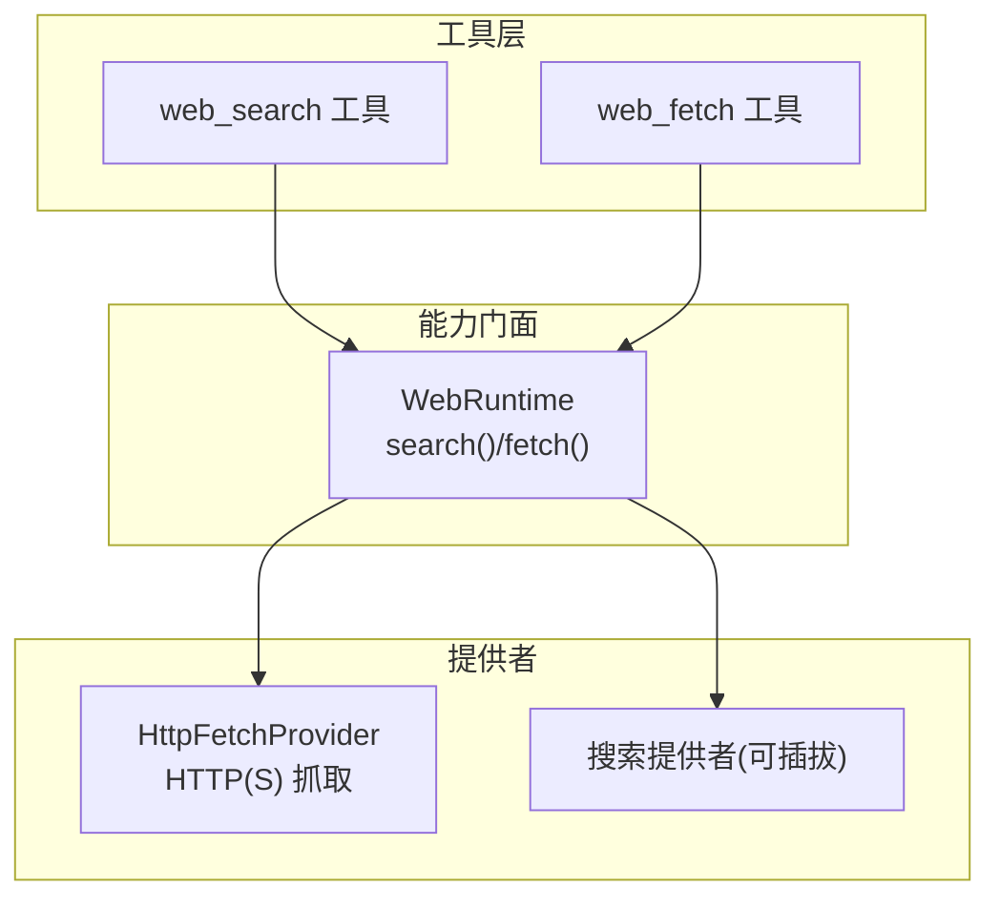
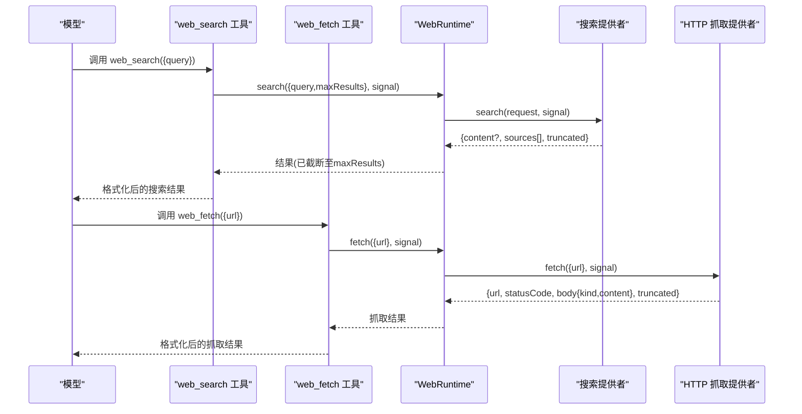
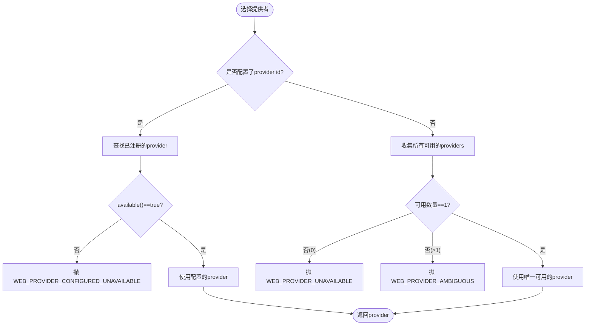
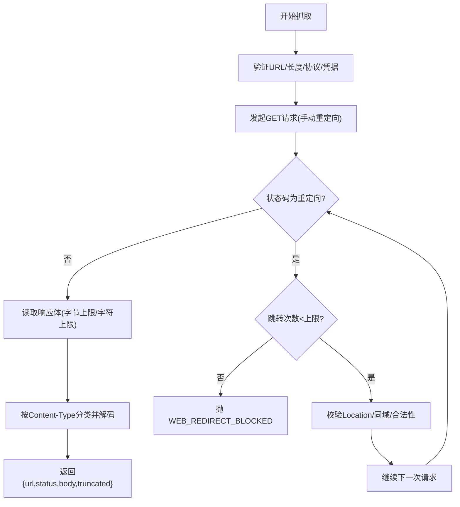
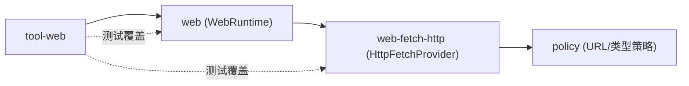

# 网络工具

<cite>
**本文引用的文件**
- [packages/web/web/src/index.ts](file://packages/web/web/src/index.ts)
- [packages/web/web/src/types.ts](file://packages/web/web/src/types.ts)
- [packages/web/web-fetch-http/src/provider.ts](file://packages/web/web-fetch-http/src/provider.ts)
- [packages/web/web-fetch-http/src/policy.ts](file://packages/web/web-fetch-http/src/policy.ts)
- [packages/web/tool-web/src/search.ts](file://packages/web/tool-web/src/search.ts)
- [packages/web/tool-web/src/fetch.ts](file://packages/web/tool-web/src/fetch.ts)
- [packages/web/tool-web/src/index.ts](file://packages/web/tool-web/src/index.ts)
- [packages/web/web/tests/web.spec.ts](file://packages/web/web/tests/web.spec.ts)
- [packages/web/tool-web/tests/tool-web.spec.ts](file://packages/web/tool-web/tests/tool-web.spec.ts)
</cite>

## 目录
1. [简介](#简介)
2. [项目结构](#项目结构)
3. [核心组件](#核心组件)
4. [架构总览](#架构总览)
5. [详细组件分析](#详细组件分析)
6. [依赖关系分析](#依赖关系分析)
7. [性能与限制](#性能与限制)
8. [故障排查指南](#故障排查指南)
9. [结论](#结论)
10. [附录：使用示例与最佳实践](#附录使用示例与最佳实践)

## 简介
本文件面向 DeepSeek Harness 的网络能力，系统性说明 web_search、web_fetch 等网络工具的用途、参数、响应处理、代理与安全策略、权限控制、速率限制与缓存机制，并提供错误处理、重试策略、最佳实践与常见问题解决方案。文档同时给出代码级架构图与流程图，帮助开发者快速理解并安全集成网络访问能力。

## 项目结构
围绕“网络能力”的关键模块如下：
- Web 能力门面（ctx.web）：统一注册/选择搜索与抓取提供者，提供 search/fetch 调用入口。
- HTTP 抓取提供者：实现安全的 GET 抓取、重定向策略、内容类型分类、字符集解码、大小与超时限制。
- 模型侧工具：暴露 web_search、web_fetch 工具给模型调用，负责参数校验、结果格式化与呈现元数据。
- 类型与错误：统一的请求/响应类型与结构化错误码。

图表来源
- [packages/web/tool-web/src/search.ts:224-273](file://packages/web/tool-web/src/search.ts#L224-L273)
- [packages/web/tool-web/src/fetch.ts:1-200](file://packages/web/tool-web/src/fetch.ts#L1-L200)
- [packages/web/web/src/index.ts:140-163](file://packages/web/web/src/index.ts#L140-L163)
- [packages/web/web-fetch-http/src/provider.ts:36-53](file://packages/web/web-fetch-http/src/provider.ts#L36-L53)

章节来源
- [packages/web/web/src/index.ts:1-203](file://packages/web/web/src/index.ts#L1-L203)
- [packages/web/tool-web/src/index.ts:20-91](file://packages/web/tool-web/src/index.ts#L20-L91)

## 核心组件
- WebRuntime（能力门面）
  - 注册搜索/抓取提供者，执行时按配置或可用数量自动选择提供者。
  - 提供 search(request, signal?) 与 fetch(request, signal?) 两个方法。
  - 对搜索结果强制应用 maxResults 上限，必要时标记 truncated。
- HttpFetchProvider（HTTP 抓取提供者）
  - 仅支持 GET；手动处理重定向，且仅跟随同域重定向。
  - 严格 URL 校验、禁止凭据嵌入、限制长度。
  - 限制响应体字节数与解码后字符数，支持多种文本类 Content-Type 与 charset。
  - 通过 deadline 与 AbortSignal 实现超时与取消，区分 WEB_FETCH_TIMEOUT、WEB_ABORTED、WEB_PROVIDER_ERROR。
- 模型侧工具（web_search、web_fetch）
  - 定义参数 schema、输出 schema、提示词引导、结果呈现与 meta 投影。
  - 将超时预算、最大输出字符数等策略注入到工具定义中。

章节来源
- [packages/web/web/src/index.ts:74-163](file://packages/web/web/src/index.ts#L74-L163)
- [packages/web/web/src/types.ts:15-119](file://packages/web/web/src/types.ts#L15-L119)
- [packages/web/web-fetch-http/src/provider.ts:36-241](file://packages/web/web-fetch-http/src/provider.ts#L36-L241)
- [packages/web/tool-web/src/search.ts:224-273](file://packages/web/tool-web/src/search.ts#L224-L273)
- [packages/web/tool-web/src/fetch.ts:1-200](file://packages/web/tool-web/src/fetch.ts#L1-L200)
- [packages/web/tool-web/src/index.ts:36-91](file://packages/web/tool-web/src/index.ts#L36-L91)

## 架构总览
下图展示了从模型工具到具体提供者的调用链路与关键决策点。

图表来源
- [packages/web/tool-web/src/search.ts:259-273](file://packages/web/tool-web/src/search.ts#L259-L273)
- [packages/web/tool-web/src/fetch.ts:1-200](file://packages/web/tool-web/src/fetch.ts#L1-L200)
- [packages/web/web/src/index.ts:140-163](file://packages/web/web/src/index.ts#L140-L163)
- [packages/web/web-fetch-http/src/provider.ts:46-100](file://packages/web/web-fetch-http/src/provider.ts#L46-L100)

## 详细组件分析

### WebRuntime（能力门面）
- 提供者选择规则
  - 若配置了 provider id：必须存在且 available() 为真，否则抛出对应错误。
  - 未配置：恰好一个可用则自动选择；多个可用抛歧义错误；无可用抛不可用错误。
- 搜索能力
  - 调用 provider.search(request, signal)，并对返回的 sources[] 强制应用 maxResults 上限，必要时设置 truncated。
- 抓取能力
  - 调用 provider.fetch(request, signal)。非 2xx 状态码视为正常结果而非异常。

图表来源
- [packages/web/web/src/index.ts:171-194](file://packages/web/web/src/index.ts#L171-L194)

章节来源
- [packages/web/web/src/index.ts:74-163](file://packages/web/web/src/index.ts#L74-L163)
- [packages/web/web/src/index.ts:171-200](file://packages/web/web/src/index.ts#L171-L200)

### HTTP 抓取提供者（HttpFetchProvider）
- 请求阶段
  - 使用 deadline(signal, timeoutMs) 包装信号，超时抛出 WEB_FETCH_TIMEOUT。
  - 发起 GET 请求，redirect=manual，自定义 UA/Accept。
  - 网络/中止错误被翻译为 WEB_PROVIDER_ERROR 或 WEB_ABORTED。
- 重定向策略
  - 仅跟随 301/302/303/307/308，最多 N 次跳转。
  - 每次跳转目标必须同域（协议+主机+端口一致），否则拒绝。
  - 无 Location 头或无效 Location 会报错。
- 响应体读取
  - 基于 Content-Length 预检超限直接拒绝；流式读取时超过上限则截断并标记 truncatedByBytes。
  - 根据 Content-Type 分类为 html/text，解析 charset，解码为字符串；超出 maxBodyChars 则截断。
- 资源清理
  - 在异常路径主动 cancel 响应体，避免 socket 泄漏。

图表来源
- [packages/web/web-fetch-http/src/provider.ts:55-100](file://packages/web/web-fetch-http/src/provider.ts#L55-L100)
- [packages/web/web-fetch-http/src/provider.ts:117-147](file://packages/web/web-fetch-http/src/provider.ts#L117-L147)
- [packages/web/web-fetch-http/src/provider.ts:155-207](file://packages/web/web-fetch-http/src/provider.ts#L155-L207)
- [packages/web/web-fetch-http/src/policy.ts:24-41](file://packages/web/web-fetch-http/src/policy.ts#L24-L41)

章节来源
- [packages/web/web-fetch-http/src/provider.ts:36-241](file://packages/web/web-fetch-http/src/provider.ts#L36-L241)
- [packages/web/web-fetch-http/src/policy.ts:1-106](file://packages/web/web-fetch-http/src/policy.ts#L1-L106)

### 模型侧工具：web_search
- 参数与输出
  - 输入：query（必填）。
  - 输出：content?、sources[]、truncated。
- 执行流程
  - 校验 query 非空。
  - 调用 ctx.web.search({query, maxResults}, exec.signal)。
  - 将结果映射为工具输出，并将结构化 sources 写入 meta 以便 UI 呈现。
- 提示词引导
  - 当启用 web_fetch 时，提示模型在需要时进一步抓取详情。

章节来源
- [packages/web/tool-web/src/search.ts:29-32](file://packages/web/tool-web/src/search.ts#L29-L32)
- [packages/web/tool-web/src/search.ts:224-273](file://packages/web/tool-web/src/search.ts#L224-L273)

### 模型侧工具：web_fetch
- 参数与输出
  - 输入：url（必填）。
  - 输出：content（html/text）、statusCode、truncated。
- 执行流程
  - 校验 url。
  - 调用 ctx.web.fetch({url}, exec.signal)。
  - 将结果映射为工具输出，并生成呈现元数据。

章节来源
- [packages/web/tool-web/src/fetch.ts:1-200](file://packages/web/tool-web/src/fetch.ts#L1-L200)
- [packages/web/tool-web/src/index.ts:36-91](file://packages/web/tool-web/src/index.ts#L36-L91)

## 依赖关系分析
- tool-web 依赖 web（能力门面）与 dsh-timeout（超时封装）。
- web-fetch-http 依赖 web（类型与错误）与 policy（URL/内容类型策略）。
- 测试覆盖：
  - web 能力：注册/选择提供者、无提供者时的错误码。
  - tool-web：抓取结果 meta 投影、无提供者时的结构化错误。

图表来源
- [packages/web/tool-web/src/index.ts:20-91](file://packages/web/tool-web/src/index.ts#L20-L91)
- [packages/web/web/src/index.ts:1-203](file://packages/web/web/src/index.ts#L1-L203)
- [packages/web/web-fetch-http/src/provider.ts:1-15](file://packages/web/web-fetch-http/src/provider.ts#L1-L15)
- [packages/web/web/tests/web.spec.ts:191-215](file://packages/web/web/tests/web.spec.ts#L191-L215)
- [packages/web/tool-web/tests/tool-web.spec.ts:531-553](file://packages/web/tool-web/tests/tool-web.spec.ts#L531-L553)

章节来源
- [packages/web/web/tests/web.spec.ts:191-215](file://packages/web/web/tests/web.spec.ts#L191-L215)
- [packages/web/tool-web/tests/tool-web.spec.ts:531-553](file://packages/web/tool-web/tests/tool-web.spec.ts#L531-L553)

## 性能与限制
- 超时与取消
  - 抓取：deadline + AbortSignal，区分超时与外部取消。
  - 工具：通过工具定义的 timeoutMs 进行协作式超时预算。
- 大小限制
  - URL 长度、响应体字节数、解码后字符数均有上限，超限会截断并标记 truncated。
- 重定向
  - 最多 N 次跳转，且仅同域跳转，防止跨域滥用。
- 内容类型
  - 仅允许 text/html、application/xhtml+xml 以及部分 text/*、json/xml 等文本类类型。
- 并发与幂等
  - web_search 标注 isConcurrencySafe=true，适合并发调用。
- 缓存与速率限制
  - 当前实现未内置缓存与速率限制；如需可在上层组合器或服务端网关处实现。

章节来源
- [packages/web/web-fetch-http/src/provider.ts:46-53](file://packages/web/web-fetch-http/src/provider.ts#L46-L53)
- [packages/web/web-fetch-http/src/provider.ts:155-207](file://packages/web/web-fetch-http/src/provider.ts#L155-L207)
- [packages/web/tool-web/src/search.ts:256-258](file://packages/web/tool-web/src/search.ts#L256-L258)
- [packages/web/tool-web/src/index.ts:36-91](file://packages/web/tool-web/src/index.ts#L36-L91)

## 故障排查指南
- 常见错误码与含义
  - WEB_PROVIDER_UNAVAILABLE：未注册任何可用的搜索/抓取提供者。
  - WEB_PROVIDER_CONFIGURED_MISSING：配置了 provider id 但未注册。
  - WEB_PROVIDER_CONFIGURED_UNAVAILABLE：已注册但 unavailable() 为假。
  - WEB_PROVIDER_AMBIGUOUS：多个可用提供者未显式指定。
  - WEB_DUPLICATE_PROVIDER：重复注册相同 id。
  - WEB_INVALID_URL：URL 非法、过长、不支持的协议或包含凭据。
  - WEB_BLOCKED_URL：URL 中包含用户名/密码。
  - WEB_REDIRECT_BLOCKED：重定向超限或跨域。
  - WEB_UNSUPPORTED_CONTENT_TYPE：不支持的内容类型或字符集。
  - WEB_FETCH_TOO_LARGE：响应体超过字节上限。
  - WEB_FETCH_TIMEOUT：抓取超时。
  - WEB_ABORTED：请求被取消。
  - WEB_PROVIDER_ERROR：网络失败或上游错误。
- 定位建议
  - 检查是否已正确注册所需 provider。
  - 确认 URL 合法且不包含凭据。
  - 关注 truncated 标志，判断是否因大小限制被截断。
  - 结合 signal 与超时预算，排查外部取消或超时原因。
- 参考用例
  - 无抓取提供者时抛 WEB_PROVIDER_UNAVAILABLE。
  - 抓取结果 meta 投影与呈现卡片行为。

章节来源
- [packages/web/web/src/index.ts:118-129](file://packages/web/web/src/index.ts#L118-L129)
- [packages/web/web/src/index.ts:171-194](file://packages/web/web/src/index.ts#L171-L194)
- [packages/web/web-fetch-http/src/provider.ts:235-241](file://packages/web/web-fetch-http/src/provider.ts#L235-L241)
- [packages/web/web-fetch-http/src/policy.ts:24-41](file://packages/web/web-fetch-http/src/policy.ts#L24-L41)
- [packages/web/web/tests/web.spec.ts:191-215](file://packages/web/web/tests/web.spec.ts#L191-L215)
- [packages/web/tool-web/tests/tool-web.spec.ts:531-553](file://packages/web/tool-web/tests/tool-web.spec.ts#L531-L553)

## 结论
DeepSeek Harness 的网络能力以“能力门面 + 可插拔提供者”的方式解耦了搜索与抓取逻辑，提供了统一的选择策略、严格的传输安全策略与清晰的错误语义。HTTP 抓取提供者实现了同域重定向、内容类型白名单、字符集解码与多重大小/超时限制，确保在开放环境下的安全性与稳定性。模型侧工具将策略与呈现解耦，便于在不同产品形态下复用。对于缓存与速率限制，建议在更上层按需实现。

## 附录：使用示例与最佳实践

- REST API 调用（JSON）
  - 使用 web_fetch 获取 JSON 接口，注意服务端需返回 text/json 或 application/json 等受支持的文本类型。
  - 关注 truncated 标志，必要时调整 fetchMaxOutputChars 或后端分页。
  - 参考路径：[packages/web/tool-web/src/fetch.ts](file://packages/web/tool-web/src/fetch.ts)

- 网页抓取（HTML）
  - 使用 web_fetch 抓取 HTML，provider 会自动分类并解码。
  - 若页面过大，可通过配置限制响应体与字符数，避免内存压力。
  - 参考路径：[packages/web/web-fetch-http/src/provider.ts](file://packages/web/web-fetch-http/src/provider.ts)

- 搜索引擎查询
  - 使用 web_search 获取摘要与来源列表，结合提示词引导模型引用来源。
  - 通过 searchMaxResults 控制返回条目数，避免上下文膨胀。
  - 参考路径：[packages/web/tool-web/src/search.ts](file://packages/web/tool-web/src/search.ts)

- 代理配置
  - 当前 HTTP 抓取提供者直接使用全局 fetch，未内建代理字段。若需代理，请在宿主环境或运行时层面配置全局代理（例如 Node.js 的代理环境变量或运行时代理中间件）。
  - 若需细粒度代理控制，可自定义 WebFetchProvider 并在其中替换底层请求实现。

- 安全策略
  - 仅允许 http/https，禁止 URL 中携带凭据；重定向仅限同域；拒绝二进制与未知内容类型；限制 URL/响应体/字符数。
  - 如需私有网络保护，请在上层增加域名/IP 白名单或网络出口控制。

- 权限控制
  - 通过 WebRuntime 的 provider 选择机制，结合部署配置与环境变量限定可用提供者。
  - 工具可见性由 tool-web 插件开关控制（search/fetch 可独立启用/禁用）。

- 速率限制与缓存
  - 当前未内置；可在调用方或网关层实现令牌桶/漏桶、去重与缓存（如按 URL 缓存短时效结果）。

- 错误处理与重试
  - 捕获 WebError 并按 code 分支处理；对瞬态网络错误可实施指数退避重试，注意整体超时预算。
  - 对 WEB_FETCH_TIMEOUT 与 WEB_ABORTED 区分处理，避免误判。

- 最佳实践
  - 始终设置合理的 maxResults 与 fetchMaxOutputChars。
  - 在提示词中要求模型引用来源链接。
  - 对大响应启用截断，并在 UI 中展示 truncated 提示。
  - 使用 exec.signal 传递取消信号，保证任务可中断。

章节来源
- [packages/web/tool-web/src/index.ts:36-91](file://packages/web/tool-web/src/index.ts#L36-L91)
- [packages/web/tool-web/src/search.ts:224-273](file://packages/web/tool-web/src/search.ts#L224-L273)
- [packages/web/tool-web/src/fetch.ts:1-200](file://packages/web/tool-web/src/fetch.ts#L1-L200)
- [packages/web/web-fetch-http/src/provider.ts:103-114](file://packages/web/web-fetch-http/src/provider.ts#L103-L114)
- [packages/web/web/src/index.ts:55-94](file://packages/web/web/src/index.ts#L55-L94)