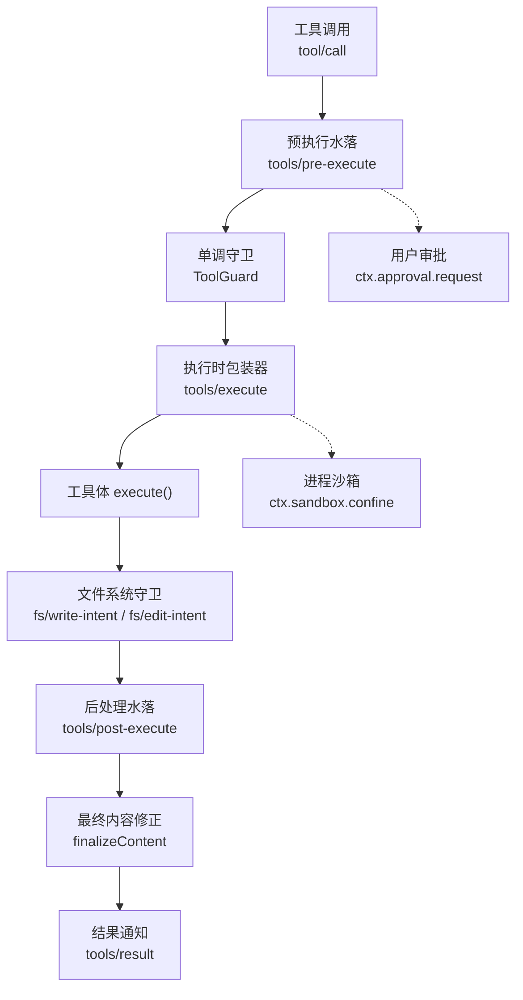
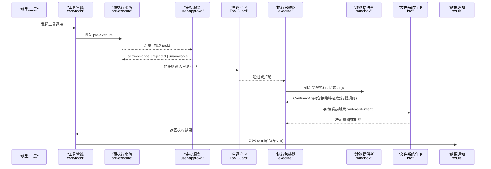
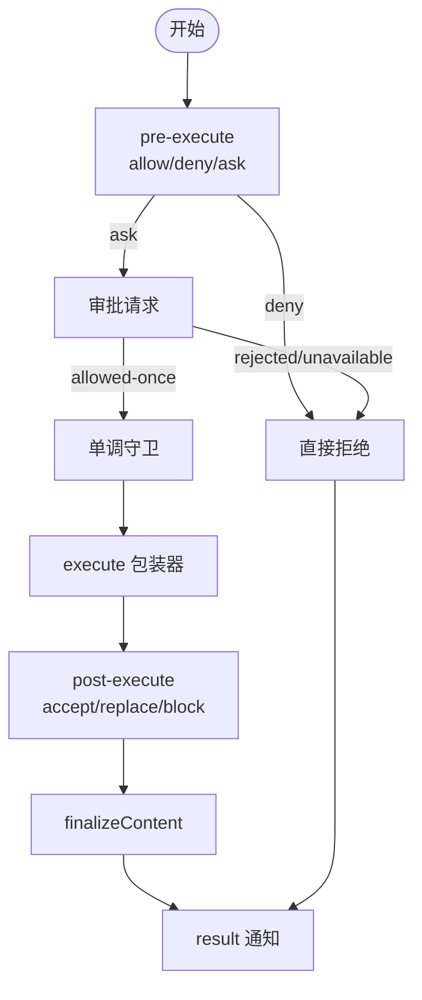
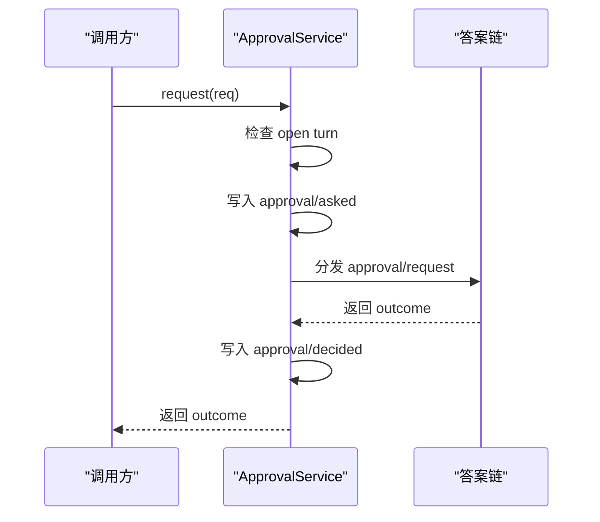
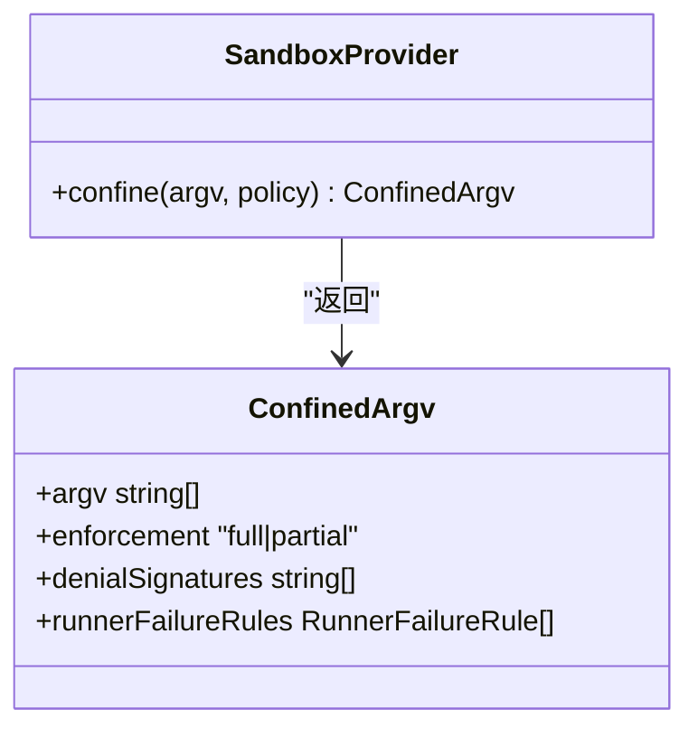
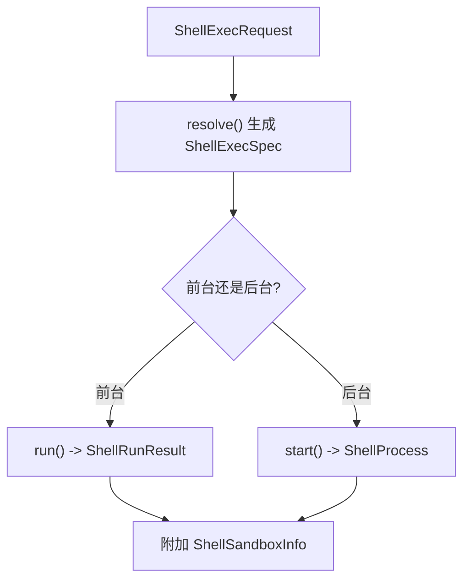
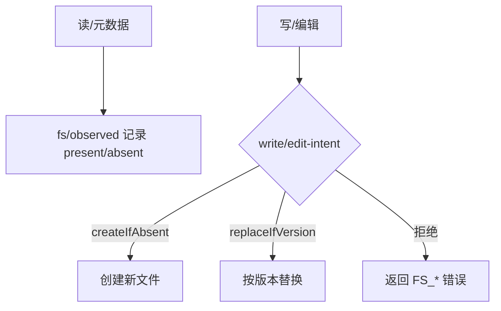
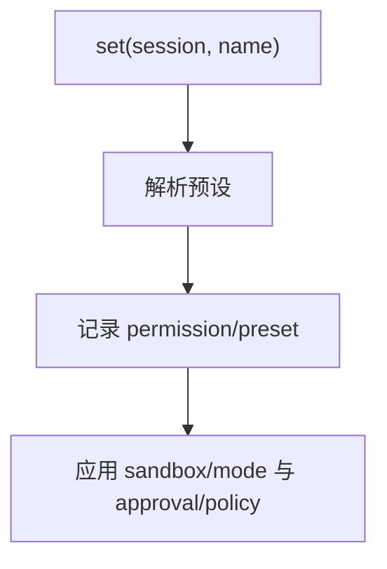
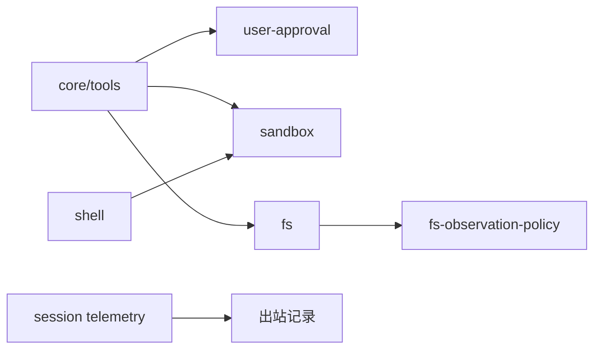

# 工具安全与权限

<cite>
**本文引用的文件**
- [packages/sandbox/sandbox/src/index.ts](file://packages/sandbox/sandbox/src/index.ts)
- [packages/interaction/user-approval/src/index.ts](file://packages/interaction/user-approval/src/index.ts)
- [packages/core/tools/src/index.ts](file://packages/core/tools/src/index.ts)
- [docs/subsystems/sandbox.md](file://docs/subsystems/sandbox.md)
- [docs/subsystems/approval.md](file://docs/subsystems/approval.md)
- [docs/subsystems/tools.md](file://docs/subsystems/tools.md)
- [docs/subsystems/shell.md](file://docs/subsystems/shell.md)
- [docs/subsystems/filesystem.md](file://docs/subsystems/filesystem.md)
- [docs/subsystems/permission-presets.md](file://docs/subsystems/permission-presets.md)
- [packages/session/session-telemetry/README.md](file://packages/session/session-telemetry/README.md)
</cite>

## 目录
1. [简介](#简介)
2. [项目结构](#项目结构)
3. [核心组件](#核心组件)
4. [架构总览](#架构总览)
5. [详细组件分析](#详细组件分析)
6. [依赖关系分析](#依赖关系分析)
7. [性能与安全考量](#性能与安全考量)
8. [故障排查指南](#故障排查指南)
9. [结论](#结论)
10. [附录](#附录)

## 简介
本文件面向工具开发者与平台运维，系统性阐述工具执行的权限模型、沙箱机制、审批策略、文件系统守卫、结果后处理与审计监控。重点覆盖：
- 预执行检查（tools/pre-execute）、执行时控制（tools/execute 包装器、单调守卫）、结果后处理（tools/post-execute、finalizeContent、tools/result）
- 权限策略配置（沙箱模式、审批策略、权限预设）与自定义权限检查器实现
- 进程沙箱（bwrap/Landlock、Seatbelt、Windows ACL）如何保护系统与用户数据
- 安全最佳实践、常见威胁防护、合规性要求
- 权限审计与监控方案（日志事件、遥测脱敏）

## 项目结构
围绕“工具执行管线”的安全能力由多个子系统协作完成：
- 工具注册与执行管线：core/tools
- 用户审批：interaction/user-approval
- 进程沙箱：sandbox（抽象接口）+ sandbox-local（本地后端）
- Shell 执行与沙箱集成：shell + bash-sandbox/pwsh-sandbox
- 文件系统读写守卫：fs + fs-observation-policy + tool-fs
- 权限预设：interaction/permission-presets
- 审计与遥测：session telemetry redaction waterfall

图表来源
- [packages/core/tools/src/index.ts:152-197](file://packages/core/tools/src/index.ts#L152-L197)
- [packages/sandbox/sandbox/src/index.ts:158-176](file://packages/sandbox/sandbox/src/index.ts#L158-L176)
- [packages/interaction/user-approval/src/index.ts:257-276](file://packages/interaction/user-approval/src/index.ts#L257-L276)
- [docs/subsystems/filesystem.md:181-186](file://docs/subsystems/filesystem.md#L181-L186)

章节来源
- [docs/subsystems/tools.md:1-63](file://docs/subsystems/tools.md#L1-L63)
- [docs/subsystems/sandbox.md:1-157](file://docs/subsystems/sandbox.md#L1-L157)
- [docs/subsystems/approval.md:1-171](file://docs/subsystems/approval.md#L1-L171)
- [docs/subsystems/filesystem.md:1-186](file://docs/subsystems/filesystem.md#L1-L186)

## 核心组件
- 工具执行管线（core/tools）
  - 提供 tools/pre-execute、tools/execute、tools/post-execute、tools/result 等扩展点
  - 支持 ToolGuard 单调守卫、执行模式（parallel/exclusive）、超时与重试包装
- 用户审批（user-approval）
  - 会话级策略 ask/never；一次授权 allowed-once；审计事件 approval/asked + approval/decided
- 进程沙箱（sandbox）
  - 抽象服务 SandboxProvider.confine；返回受控 argv、执行完整性 full/partial、拒绝特征与运行器失败规则
- Shell 执行（shell）
  - resolve/run/start；前台/后台；输出截断与溢出转储；沙箱信息回传
- 文件系统（fs）
  - 读/写/编辑原子操作；write-intent/edit-intent 单槽决策；observed 记录；错误码分类
- 权限预设（permission-presets）
  - 将沙箱模式与审批策略打包为可切换的预设；记录 permission/preset 事件

章节来源
- [packages/core/tools/src/index.ts:152-197](file://packages/core/tools/src/index.ts#L152-L197)
- [packages/interaction/user-approval/src/index.ts:257-276](file://packages/interaction/user-approval/src/index.ts#L257-L276)
- [packages/sandbox/sandbox/src/index.ts:158-176](file://packages/sandbox/sandbox/src/index.ts#L158-L176)
- [docs/subsystems/shell.md:105-166](file://docs/subsystems/shell.md#L105-L166)
- [docs/subsystems/filesystem.md:181-186](file://docs/subsystems/filesystem.md#L181-L186)
- [docs/subsystems/permission-presets.md:1-69](file://docs/subsystems/permission-presets.md#L1-L69)

## 架构总览
下图展示从工具调用到结果落盘的全链路安全控制点：

图表来源
- [packages/core/tools/src/index.ts:152-197](file://packages/core/tools/src/index.ts#L152-L197)
- [packages/interaction/user-approval/src/index.ts:257-276](file://packages/interaction/user-approval/src/index.ts#L257-L276)
- [packages/sandbox/sandbox/src/index.ts:158-176](file://packages/sandbox/sandbox/src/index.ts#L158-L176)
- [docs/subsystems/filesystem.md:181-186](file://docs/subsystems/filesystem.md#L181-L186)

## 详细组件分析

### 工具执行管线与权限水落
- 预执行水落（tools/pre-execute）
  - 可 deny/allow/ask；缺失审批通道时 ask 降级为 deny
- 单调守卫（ToolGuard）
  - 仅能减少权限，不能恢复；顺序不可逆
- 执行时包装器（tools/execute）
  - 用于超时、重试、指标采集；可替换信号但不可移除
- 后处理水落（tools/post-execute）
  - accept/replace/block；block 将纠正反馈转为错误结果
- 最终内容与结果
  - finalizeContent 做最后一次内容约束；tools/result 接收冻结快照

图表来源
- [packages/core/tools/src/index.ts:152-197](file://packages/core/tools/src/index.ts#L152-L197)
- [docs/subsystems/tools.md:170-404](file://docs/subsystems/tools.md#L170-L404)

章节来源
- [packages/core/tools/src/index.ts:152-197](file://packages/core/tools/src/index.ts#L152-L197)
- [docs/subsystems/tools.md:170-404](file://docs/subsystems/tools.md#L170-L404)

### 用户审批策略与审计
- 策略
  - ask：委托给答案链；无答案链默认 unavailable（fail-closed）
  - never：直接拒绝，不提示
- 生命周期
  - request 追加 approval/asked；决策后追加 approval/decided
  - setPolicy 持久化策略变更并注入上下文提示
- 安全要点
  - 仅在 open turn 内允许请求；审计对必须成对出现
  - 非词汇返回值归一化为 unavailable

图表来源
- [packages/interaction/user-approval/src/index.ts:257-276](file://packages/interaction/user-approval/src/index.ts#L257-L276)
- [packages/interaction/user-approval/src/index.ts:299-344](file://packages/interaction/user-approval/src/index.ts#L299-L344)

章节来源
- [docs/subsystems/approval.md:1-171](file://docs/subsystems/approval.md#L1-L171)
- [packages/interaction/user-approval/src/index.ts:257-276](file://packages/interaction/user-approval/src/index.ts#L257-L276)

### 进程沙箱与执行模式
- 模式
  - read-only：仅允许必要写入（如 /dev/null）
  - workspace-write：允许工作区与后端临时目录
  - danger-full-access：绕过限制（不通过 ctx.sandbox）
- 执行完整性
  - full：完全按承诺限制
  - partial：旧内核 ABI 或 Windows ACL 边界导致部分限制
- 结果诊断
  - denialSignatures：后端特定的拒绝特征
  - runnerFailureRules：运行器在命令执行前的失败判定规则

图表来源
- [packages/sandbox/sandbox/src/index.ts:158-176](file://packages/sandbox/sandbox/src/index.ts#L158-L176)
- [packages/sandbox/sandbox/src/index.ts:90-116](file://packages/sandbox/sandbox/src/index.ts#L90-L116)

章节来源
- [docs/subsystems/sandbox.md:9-157](file://docs/subsystems/sandbox.md#L9-L157)
- [packages/sandbox/sandbox/src/index.ts:158-176](file://packages/sandbox/sandbox/src/index.ts#L158-L176)

### Shell 执行与沙箱集成
- 请求与规格分离：resolve(request) -> ShellExecSpec
- 前台运行：ShellRunResult 独立报告 exitCode/signal/timedOut/aborted/timeoutMs/stdout/stderr
- 后台进程：ShellProcess.readOutput 增量读取，支持溢出转储
- 沙箱信息：ShellSandboxInfo 包含 mode/denied/enforcement/runnerFailed

图表来源
- [docs/subsystems/shell.md:13-99](file://docs/subsystems/shell.md#L13-L99)
- [docs/subsystems/shell.md:105-166](file://docs/subsystems/shell.md#L105-L166)

章节来源
- [docs/subsystems/shell.md:13-99](file://docs/subsystems/shell.md#L13-L99)
- [docs/subsystems/shell.md:105-166](file://docs/subsystems/shell.md#L105-L166)

### 文件系统守卫与版本新鲜度
- 写/编辑守卫
  - write-intent：createIfAbsent 或 replaceIfVersion
  - edit-intent：基于 observed 状态决定是否允许
- 观测记录
  - fs/observed：present(version) 或 absent
- 错误码
  - FS_SANDBOX_DENIED、FS_STALE_VERSION、FS_NOT_OBSERVED 等

图表来源
- [docs/subsystems/filesystem.md:114-186](file://docs/subsystems/filesystem.md#L114-L186)
- [docs/subsystems/filesystem.md:181-186](file://docs/subsystems/filesystem.md#L181-L186)

章节来源
- [docs/subsystems/filesystem.md:114-186](file://docs/subsystems/filesystem.md#L114-L186)
- [docs/subsystems/filesystem.md:181-186](file://docs/subsystems/filesystem.md#L181-L186)

### 权限预设与策略组合
- 预设表：将 sandbox/mode 与 approval/policy 绑定为命名预设
- 当前预设推导：基于有效模式与策略匹配，未匹配则为 custom
- 切换行为：记录 permission/preset 事件，并通过各自 setter 更新策略

图表来源
- [docs/subsystems/permission-presets.md:46-69](file://docs/subsystems/permission-presets.md#L46-L69)

章节来源
- [docs/subsystems/permission-presets.md:1-69](file://docs/subsystems/permission-presets.md#L1-L69)

## 依赖关系分析
- core/tools 依赖 user-approval（可选）、sandbox（可选）、fs（可选）
- shell 执行器可选择加载 sandbox 进行进程隔离
- fs 插件通过 fs/* 事件与 tool-fs 解耦
- session telemetry 提供出站记录的脱敏水落

图表来源
- [packages/core/tools/src/index.ts:152-197](file://packages/core/tools/src/index.ts#L152-L197)
- [packages/session/session-telemetry/README.md:21-23](file://packages/session/session-telemetry/README.md#L21-L23)

章节来源
- [packages/core/tools/src/index.ts:152-197](file://packages/core/tools/src/index.ts#L152-L197)
- [packages/session/session-telemetry/README.md:21-23](file://packages/session/session-telemetry/README.md#L21-L23)

## 性能与安全考量
- 执行模式
  - parallel 与 exclusive 影响并发与屏障；isConcurrencySafe 需严格判断
- 超时与取消
  - tools/execute 包装器统一处理超时；工具体需响应 exec.signal
- 沙箱完整性
  - partial 模式下不应视为绝对边界；必要时拒绝执行
- 文件系统
  - 避免无界读取；使用 readBytes(maxBytes) 与流式读取
  - 写/编辑前务必通过 intent 守卫，防止竞态与脏写
- 审计与隐私
  - 审批与工具结果均产生持久事件；遥测出站前经脱敏水落

[本节为通用指导，无需特定文件引用]

## 故障排查指南
- 沙箱不可用
  - 现象：抛出 SANDBOX_UNAVAILABLE；前台执行直接失败
  - 排查：确认后端可用（bwrap/Landlock/Seatbelt/ACL），或调整模式
- 运行器失败
  - 现象：stderr 匹配 runnerFailureRules 且退出码符合 allowedExitCodes
  - 排查：区分“运行器失败”与“沙箱拒绝”；后者应查看 denialSignatures
- 审批不可用
  - 现象：ask 路径返回 unavailable；检查答案链是否挂载
- 文件系统错误
  - FS_SANDBOX_DENIED：沙箱拒绝；FS_STALE_VERSION：版本过期；FS_NOT_OBSERVED：未观测到
- 遥测脱敏
  - 确认已挂载脱敏监听器，确保敏感字段不出站

章节来源
- [packages/sandbox/sandbox/src/index.ts:118-144](file://packages/sandbox/sandbox/src/index.ts#L118-L144)
- [docs/subsystems/sandbox.md:96-157](file://docs/subsystems/sandbox.md#L96-L157)
- [docs/subsystems/filesystem.md:244-271](file://docs/subsystems/filesystem.md#L244-L271)
- [packages/session/session-telemetry/README.md:21-23](file://packages/session/session-telemetry/README.md#L21-L23)

## 结论
本系统通过“工具管线 + 审批 + 沙箱 + 文件系统守卫 + 预设策略 + 审计/遥测”的多层防御，实现了工具执行的可控、可审、可追溯。建议：
- 始终使用最小权限预设与 read-only/workspace-write 模式
- 在 pre-execute 中实现业务级访问控制，配合单调守卫兜底
- 对写/编辑强制使用 intent 守卫，避免竞态
- 关注 partial 沙箱环境，必要时拒绝高风险操作
- 启用审批与审计，结合遥测脱敏保障合规

[本节为总结，无需特定文件引用]

## 附录

### 安全最佳实践清单
- 预执行阶段
  - 校验调用者身份与作用域；拒绝未知/越权工具
  - 需要时走审批流程，避免静默放行
- 执行阶段
  - 所有外部调用遵循超时与取消契约
  - 进程执行一律通过 ctx.sandbox.confine 包裹
- 文件系统
  - 写/编辑前必过 fs/write-intent / fs/edit-intent
  - 大文件采用流式读取与字节上限
- 结果与审计
  - 使用 finalizeContent 做最终内容约束
  - 通过 tools/result 观察冻结结果；遥测出站前脱敏

[本节为通用指导，无需特定文件引用]

### 常见威胁与防护
- 逃逸与越权
  - 防护：单调守卫 + 沙箱 + 文件系统守卫三重拦截
- 数据泄露
  - 防护：结果后处理过滤敏感字段；遥测脱敏
- 资源滥用
  - 防护：超时、并发限制、输出大小限制
- 竞态与脏写
  - 防护：fs 版本守卫与原子写/编辑

[本节为通用指导，无需特定文件引用]