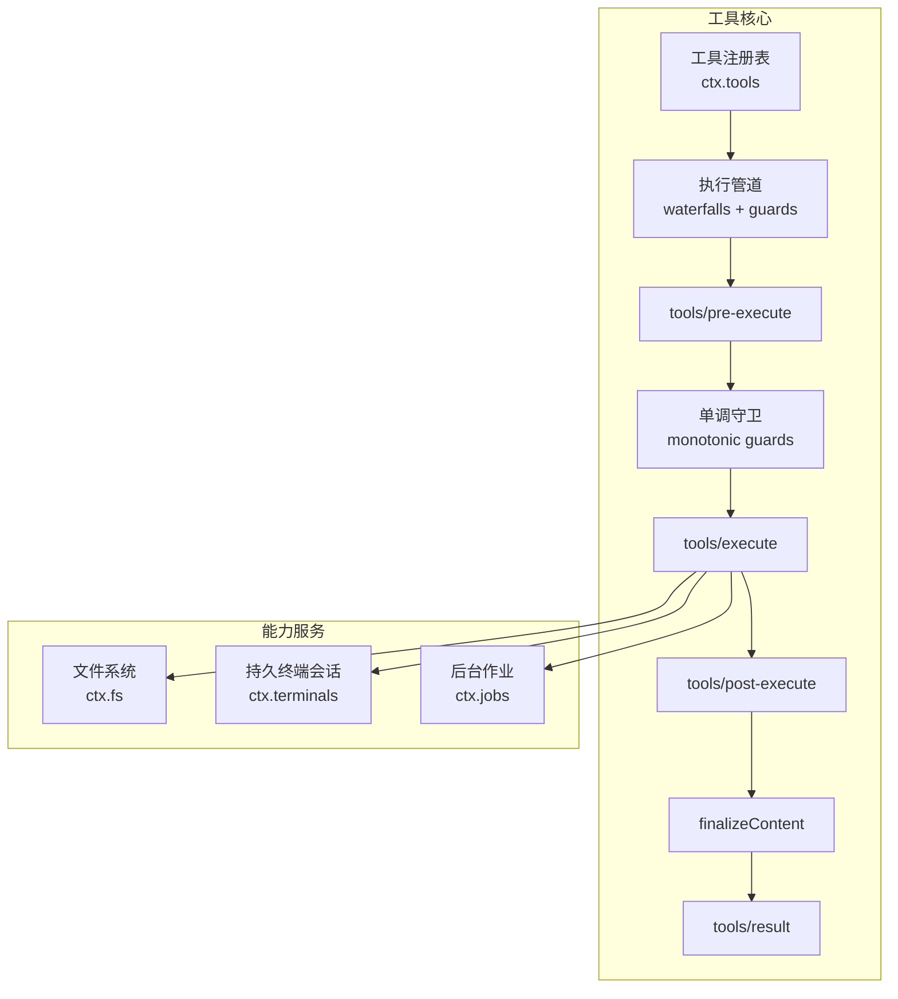
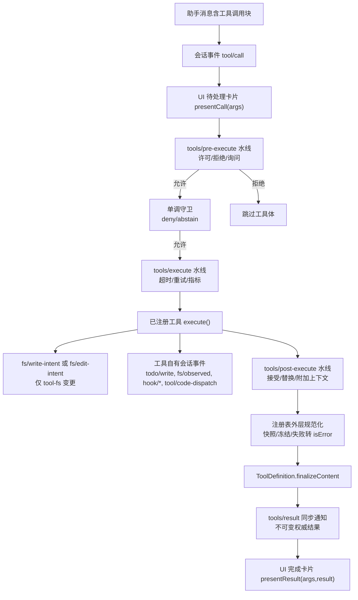
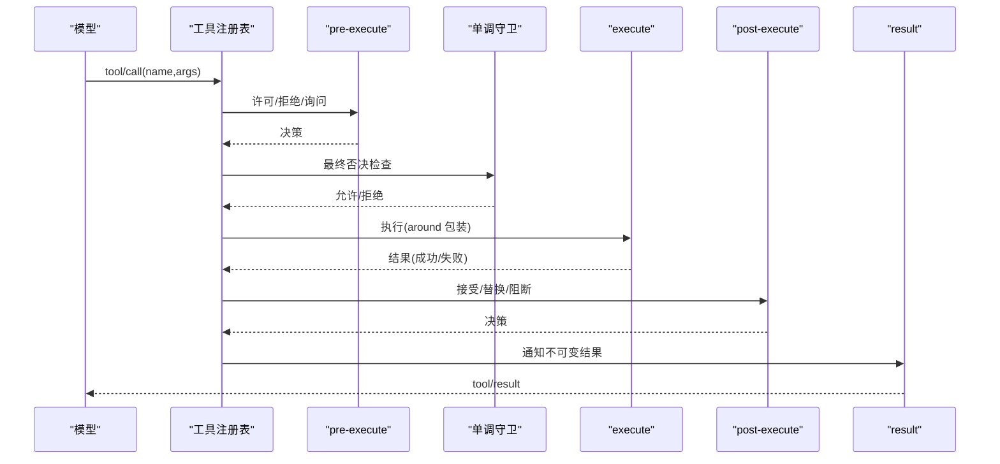
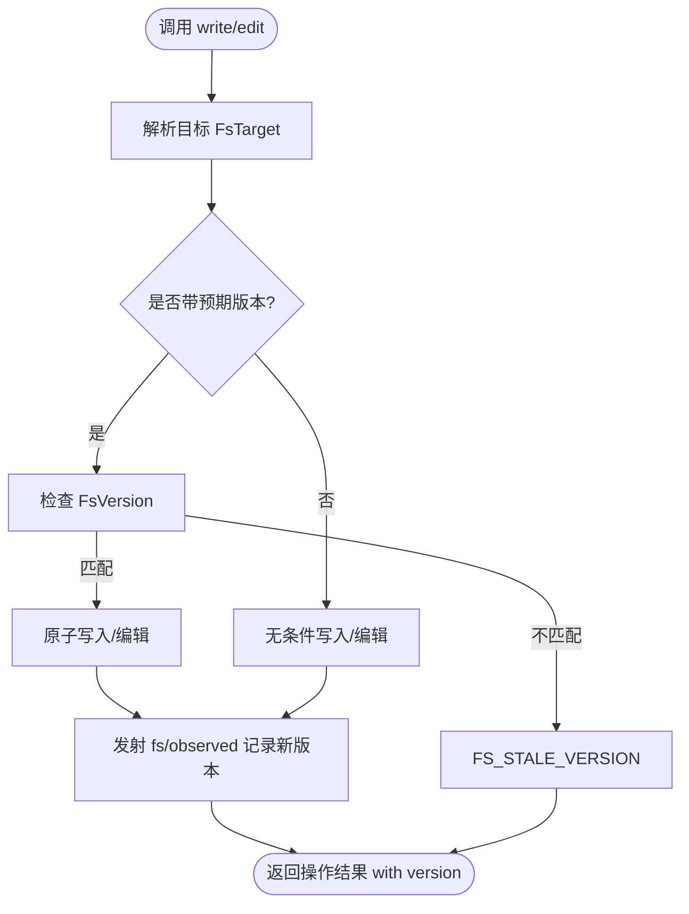
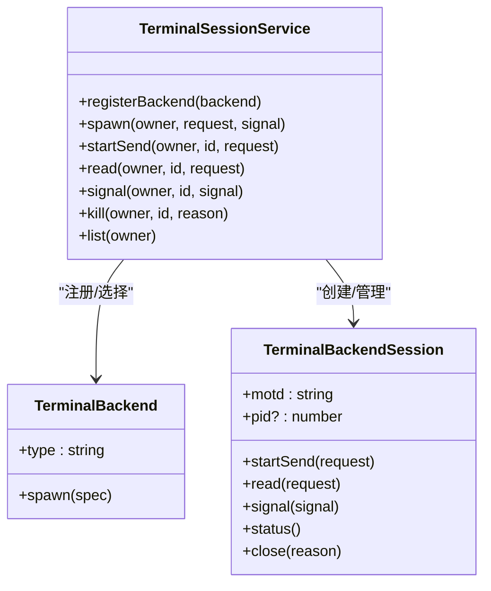
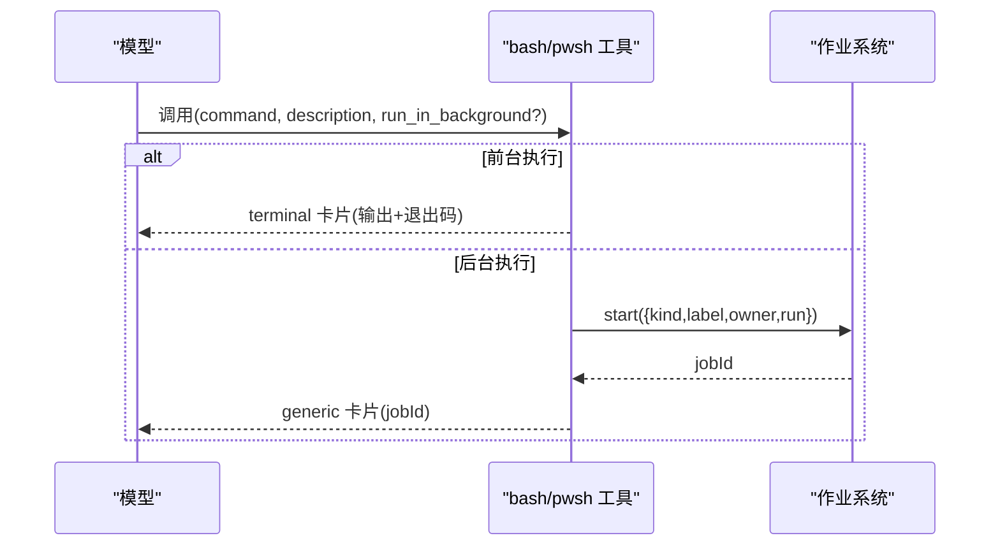
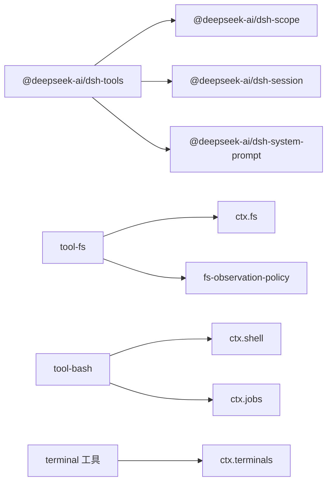

# 工具开发

<cite>
**本文引用的文件**
- [packages/core/tools/src/index.ts](file://packages/core/tools/src/index.ts)
- [docs/subsystems/tools.md](file://docs/subsystems/tools.md)
- [docs/tool-execution-pipeline.md](file://docs/tool-execution-pipeline.md)
- [docs/tool-catalog.md](file://docs/tool-catalog.md)
- [docs/cookbook/adding-a-tool.md](file://docs/cookbook/adding-a-tool.md)
- [packages/shell/tool-bash/src/index.ts](file://packages/shell/tool-bash/src/index.ts)
- [packages/fs/tool-fs/src/index.ts](file://packages/fs/tool-fs/src/index.ts)
- [docs/subsystems/filesystem.md](file://docs/subsystems/filesystem.md)
- [docs/subsystems/terminal.md](file://docs/subsystems/terminal.md)
</cite>

## 目录
1. [简介](#简介)
2. [项目结构](#项目结构)
3. [核心组件](#核心组件)
4. [架构总览](#架构总览)
5. [详细组件分析](#详细组件分析)
6. [依赖关系分析](#依赖关系分析)
7. [性能考虑](#性能考虑)
8. [故障排查指南](#故障排查指南)
9. [结论](#结论)
10. [附录](#附录)

## 简介
本指南面向 DeepSeek Harness 的工具开发者，系统性说明工具系统的架构设计、注册机制与执行管道；明确工具的接口规范、参数定义与返回值格式；深入解析文件系统工具与终端工具等内置实现；提供从设计、实现、测试到部署的自定义工具完整流程；并覆盖权限控制、安全与资源管理、性能优化、错误处理与日志记录的最佳实践。文档同时给出丰富的代码示例路径，便于快速定位参考实现。

## 项目结构
DeepSeek Harness 将“工具”作为模型可调用能力的统一抽象，通过工具注册表集中管理，并通过可扩展的执行管道（pre-execute → guards → execute → post-execute → finalizeContent → result）完成策略、沙箱、超时、重试、结果规范化与最终观测。文件系统与终端能力以独立包提供，分别暴露 ctx.fs 与 ctx.terminals 服务，供工具消费。

图表来源
- [packages/core/tools/src/index.ts:1-200](file://packages/core/tools/src/index.ts#L1-L200)
- [docs/subsystems/tools.md:170-405](file://docs/subsystems/tools.md#L170-L405)

章节来源
- [packages/core/tools/src/index.ts:1-200](file://packages/core/tools/src/index.ts#L1-L200)
- [docs/subsystems/tools.md:1-100](file://docs/subsystems/tools.md#L1-L100)

## 核心组件
- 工具定义 ToolDefinition：包含 name/description/parameters、output.schema 与 render、可选 finalizeContent/presentCall/presentResult、timeoutMs、isConcurrencySafe 与 execute。注册后由 registry.schemas() 生成模型可见的 ToolSchema[]，不泄露执行回调。
- 执行输入与上下文：ToolExecutionInput/ToolExecution/ToolDispatchExecution/ToolRunContext，提供 callId、token、signal、agent、parent 等身份与取消语义，以及 deferContext/concludeTurn 等扩展能力。
- 执行模式：parallel/exclusive 用于并发调度与互斥屏障。
- 事件与水线：tools/pre-execute、tools/execute、tools/post-execute、tools/code-dispatch-log、tools/result 构成可扩展钩子点。
- 呈现协议：ToolCallView/ToolResultView 提供通用 UI 卡片词汇，跨宿主/客户端渲染。

章节来源
- [docs/subsystems/tools.md:9-152](file://docs/subsystems/tools.md#L9-L152)
- [docs/subsystems/tools.md:170-405](file://docs/subsystems/tools.md#L170-L405)
- [docs/subsystems/tools.md:459-468](file://docs/subsystems/tools.md#L459-L468)

## 架构总览
工具执行管道在每次 tool/call 时按固定顺序运行：
- 记录 tool/call 并展示待处理卡片
- tools/pre-execute：允许/拒绝/询问（审批）
- 单调守卫：最终否决权
- tools/execute：超时、重试、指标等 around 包装
- 工具体执行：可能触发 fs/* 事件或自有 session 事件
- tools/post-execute：接受/替换内容或值、附加上下文、阻断
- 定义级 finalizeContent：最后一次内容不变量保障
- tools/result：不可变权威结果通知
- 批量完成后注入 additionalContexts 并展示完成卡片

图表来源
- [docs/tool-execution-pipeline.md:1-63](file://docs/tool-execution-pipeline.md#L1-L63)
- [docs/subsystems/tools.md:170-405](file://docs/subsystems/tools.md#L170-L405)

章节来源
- [docs/tool-execution-pipeline.md:1-63](file://docs/tool-execution-pipeline.md#L1-L63)
- [docs/subsystems/tools.md:170-405](file://docs/subsystems/tools.md#L170-L405)

## 详细组件分析

### 工具注册与执行管道
- 注册：使用 defineTool 声明 name/description/parameters/output.execute，自动推断类型与校验；schemas() 仅暴露模型可见字段。
- 执行：ctx.tools.execute(exec) 进入管道；pre-execute 可 deny/ask；guards 为最终否决；execute 支持 around 包装；post-execute 可替换 content/value 或 block；finalizeContent 做最后内容约束；result 观察不可变结果。
- 并发：isConcurrencySafe 返回 true 才参与并行组；否则独占执行。
- 呈现：presentCall/presentResult 提供中性卡片词汇，UI 桥接渲染。

图表来源
- [packages/core/tools/src/index.ts:142-200](file://packages/core/tools/src/index.ts#L142-L200)
- [docs/subsystems/tools.md:170-405](file://docs/subsystems/tools.md#L170-L405)

章节来源
- [packages/core/tools/src/index.ts:142-200](file://packages/core/tools/src/index.ts#L142-L200)
- [docs/subsystems/tools.md:170-405](file://docs/subsystems/tools.md#L170-L405)

### 文件系统工具（tool-fs）
- 能力边界：tool-fs 是模型侧读/写/编辑工具集合，基于 ctx.fs 抽象；读写窗口、格式化与观察事件在此包内实现，不绑定具体后端。
- 策略插件：dsh-fs-observation-policy 通过 fs/write-intent 与 fs/edit-intent 单槽水线决定创建/替换意图，并记录 fs/observed 存在/缺失状态；未加载时退化为无条件写入/编辑。
- 安全与一致性：writeText/editText 支持版本守卫 FsWriteIntent/FsVersion，避免竞态；read 支持行/字节限制与流式读取；错误码稳定且可路由。
- 图片读取：read_image 仅在挂载 attachments 时注册，执行期要求模型具备图像输入能力。

图表来源
- [docs/subsystems/filesystem.md:114-179](file://docs/subsystems/filesystem.md#L114-L179)
- [docs/subsystems/filesystem.md:181-243](file://docs/subsystems/filesystem.md#L181-L243)
- [packages/fs/tool-fs/src/index.ts:54-79](file://packages/fs/tool-fs/src/index.ts#L54-L79)

章节来源
- [docs/subsystems/filesystem.md:1-10](file://docs/subsystems/filesystem.md#L1-L10)
- [docs/subsystems/filesystem.md:114-179](file://docs/subsystems/filesystem.md#L114-L179)
- [docs/subsystems/filesystem.md:181-243](file://docs/subsystems/filesystem.md#L181-L243)
- [packages/fs/tool-fs/src/index.ts:1-80](file://packages/fs/tool-fs/src/index.ts#L1-L80)

### 终端工具（persistent PTY）
- 能力边界：ctx.terminals 提供可替换的 PTY 后端注册与生命周期管理；工具层暴露 terminal_open/close/list/read/send/signal 等模型能力。
- 会话所有权：每个会话绑定精确 Agent 所有者，跨重载保持存活；发送操作互斥，输出分页读取；信号与退出状态可观测。
- 与作业系统协作：terminal_send(run_in_background: true) 通过 ctx.jobs 注册后台任务，统一管理与终止。

图表来源
- [docs/subsystems/terminal.md:25-57](file://docs/subsystems/terminal.md#L25-L57)
- [docs/subsystems/terminal.md:101-183](file://docs/subsystems/terminal.md#L101-L183)

章节来源
- [docs/subsystems/terminal.md:1-185](file://docs/subsystems/terminal.md#L1-L185)

### Bash/Pwsh 工具
- 行为契约：每次调用启动新进程（无状态），支持 workdir/timeoutMs/run_in_background；非零退出以结构化标记报告；长输出尾部截断并保存全文路径；受沙箱策略保护。
- 后台执行：run_in_background=true 立即返回 jobId，通过 job_* 工具收集输出与终止。
- 呈现：前台命令以 terminal 卡片展示，后台启动以 generic 卡片展示；结果根据是否后台/错误区分展示。

图表来源
- [packages/shell/tool-bash/src/index.ts:190-200](file://packages/shell/tool-bash/src/index.ts#L190-L200)
- [docs/tool-catalog.md:176-218](file://docs/tool-catalog.md#L176-L218)
- [docs/tool-catalog.md:220-263](file://docs/tool-catalog.md#L220-L263)

章节来源
- [packages/shell/tool-bash/src/index.ts:1-200](file://packages/shell/tool-bash/src/index.ts#L1-L200)
- [docs/tool-catalog.md:176-218](file://docs/tool-catalog.md#L176-L218)
- [docs/tool-catalog.md:220-263](file://docs/tool-catalog.md#L220-L263)

### 自定义工具开发流程
- 设计：明确工具目的、参数 schema、输出 schema、呈现意图（presentCall/presentResult）、是否需要后台执行与作业集成、是否需要沙箱/审批策略。
- 实现：使用 defineTool 注册；在 execute 中遵守只读 args、响应 exec.signal、返回单一 JSON 值；必要时通过 ctx.jobs.start 启动后台任务；通过 output.render 生成模型内容，presentationMeta 生成可回放 UI 元数据。
- 测试：遵循仓库测试策略；对参数校验、异常路径、后台任务生命周期、呈现逻辑进行覆盖；使用 fixtures 与快照验证。
- 部署：通过 Cordis 插件 apply(ctx, config) 注册；按需组合 systemPrompt、sandboxPolicy、jobs 等能力；确保 schemas() 仅暴露模型可见字段。

章节来源
- [docs/cookbook/adding-a-tool.md:1-95](file://docs/cookbook/adding-a-tool.md#L1-L95)

## 依赖关系分析
- 工具核心依赖：@deepseek-ai/dsh-tools 提供 defineTool、注册表、水线与呈现协议；@deepseek-ai/dsh-scope 提供作用域与层级；@deepseek-ai/dsh-session 提供快照与用户消息；@deepseek-ai/dsh-system-prompt 提供工具提示装配。
- 能力依赖：文件系统工具依赖 ctx.fs 抽象与可选 dsh-fs-observation-policy；终端工具依赖 ctx.terminals 与 PTY 后端；shell 工具依赖 ctx.shell 与 ctx.jobs。
- 外部集成：Code Mode 通过 reserved transport run_code 桥接所有可见工具；MCP/动态插件可通过 raw JSON Schema 注册工具。

图表来源
- [packages/core/tools/src/index.ts:1-200](file://packages/core/tools/src/index.ts#L1-L200)
- [packages/fs/tool-fs/src/index.ts:1-80](file://packages/fs/tool-fs/src/index.ts#L1-L80)
- [packages/shell/tool-bash/src/index.ts:1-200](file://packages/shell/tool-bash/src/index.ts#L1-L200)
- [docs/subsystems/terminal.md:101-183](file://docs/subsystems/terminal.md#L101-L183)

章节来源
- [packages/core/tools/src/index.ts:1-200](file://packages/core/tools/src/index.ts#L1-L200)
- [packages/fs/tool-fs/src/index.ts:1-80](file://packages/fs/tool-fs/src/index.ts#L1-L80)
- [packages/shell/tool-bash/src/index.ts:1-200](file://packages/shell/tool-bash/src/index.ts#L1-L200)
- [docs/subsystems/terminal.md:101-183](file://docs/subsystems/terminal.md#L101-L183)

## 性能考虑
- 并发与互斥：利用 isConcurrencySafe 让无副作用工具加入并行组；对共享状态工具声明 exclusive 以避免竞争。
- 超时与取消：在工具体与异步工作（包括后台任务）中始终监听 exec.signal；对进程/网络/IO 使用可取消 API。
- 输出裁剪：read/grep/glob/web 等工具应限制内联输出大小，必要时通过 spillStore 保存完整结果并提供定位器。
- 呈现分离：将 UI 格式化放入 presentCall/presentResult 与 presentationMeta，避免污染模型内容与 canonical value。
- 资源回收：后台任务需实现 cancel/done/readOutput，并在 owner 销毁时清理；PTY 会话 close 等待进程树静默。

章节来源
- [docs/subsystems/tools.md:54-74](file://docs/subsystems/tools.md#L54-L74)
- [docs/tool-catalog.md:716-774](file://docs/tool-catalog.md#L716-L774)
- [docs/subsystems/terminal.md:89-92](file://docs/subsystems/terminal.md#L89-L92)

## 故障排查指南
- 常见错误分类：
  - 工具不存在/不可见：UNKNOWN_TOOL（注册或作用域过滤导致）
  - 参数非法：ToolArgsError（INVALID_ARGS）
  - 输出非法：ToolOutputError（INVALID_TOOL_OUTPUT）
  - 文件系统：FS_NOT_FOUND/FS_PERMISSION_DENIED/FS_SANDBOX_DENIED/FS_STALE_VERSION/FS_NOT_OBSERVED 等
  - 终端：TerminalBackendCleanupError（启动阶段资源清理失败）
- 诊断步骤：
  - 查看 tools/result 事件中的 isError、error.message、error.info
  - 检查 pre-execute 与 guards 是否拒绝（审批缺失或策略不允许）
  - 对于 fs 操作，确认是否加载了 observation policy，以及 fs/observed 是否正确记录
  - 对于后台任务，检查 job_* 工具输出与作业生命周期
- 恢复建议：
  - 审批缺失：补充审批服务或调整策略
  - 沙箱拒绝：在同一轮中使用 escalation 参数与 justification 重试一次（若允许）
  - 版本冲突：重新读取最新内容后再 edit/write

章节来源
- [docs/subsystems/tools.md:327-405](file://docs/subsystems/tools.md#L327-L405)
- [docs/subsystems/filesystem.md:244-274](file://docs/subsystems/filesystem.md#L244-L274)
- [docs/subsystems/terminal.md:25-37](file://docs/subsystems/terminal.md#L25-L37)

## 结论
DeepSeek Harness 的工具系统以统一的 ToolDefinition 与可扩展执行管道为核心，结合文件系统与终端等能力服务，提供了安全、可观测、可呈现的工具生态。通过严格的参数与输出校验、幂等的策略水线、稳定的错误码与呈现协议，开发者可以构建高质量、可维护、可复用的工具。建议在开发中优先关注并发安全、超时与取消、输出裁剪、呈现分离与资源回收，以获得更好的性能与用户体验。

## 附录
- 工具目录与模型可见名称映射、JSON Schema 与来源文件参见工具目录页。
- 工具执行管道流程图与关键事件签名参见子系统文档。
- 自定义工具最小示例与最佳实践参见烹饪书。

章节来源
- [docs/tool-catalog.md:12-41](file://docs/tool-catalog.md#L12-L41)
- [docs/tool-execution-pipeline.md:1-63](file://docs/tool-execution-pipeline.md#L1-L63)
- [docs/cookbook/adding-a-tool.md:1-95](file://docs/cookbook/adding-a-tool.md#L1-L95)