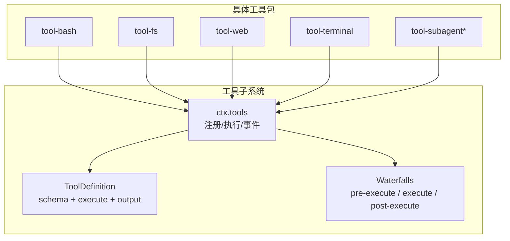
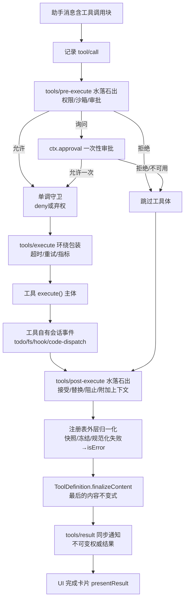
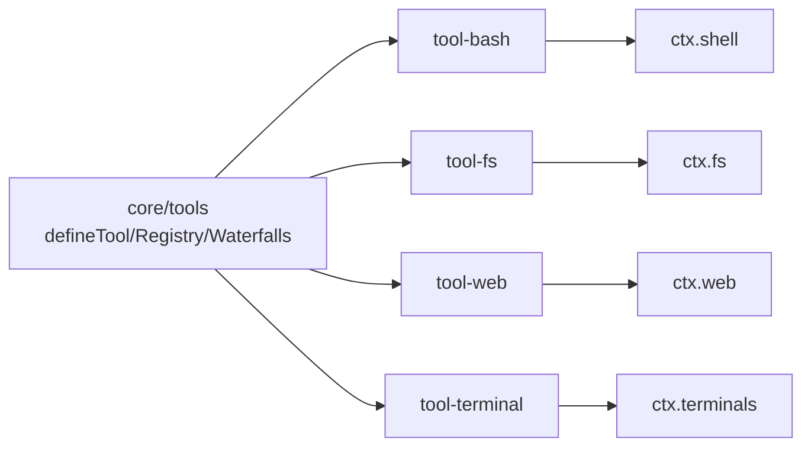

# 工具开发指南

<cite>
**本文引用的文件**
- [docs/cookbook/adding-a-tool.md](file://docs/cookbook/adding-a-tool.md)
- [docs/cookbook/adding-a-tool.zh.md](file://docs/cookbook/adding-a-tool.zh.md)
- [docs/subsystems/tools.md](file://docs/subsystems/tools.md)
- [docs/tool-catalog.md](file://docs/tool-catalog.md)
- [docs/tool-execution-pipeline.md](file://docs/tool-execution-pipeline.md)
- [packages/shell/tool-bash/src/index.ts](file://packages/shell/tool-bash/src/index.ts)
- [packages/fs/tool-fs/src/index.ts](file://packages/fs/tool-fs/src/index.ts)
</cite>

## 目录
1. [简介](#简介)
2. [项目结构](#项目结构)
3. [核心组件](#核心组件)
4. [架构总览](#架构总览)
5. [详细组件分析](#详细组件分析)
6. [依赖关系分析](#依赖关系分析)
7. [性能与资源管理](#性能与资源管理)
8. [调试与故障排除](#调试与故障排除)
9. [结论](#结论)
10. [附录：从零到一的开发流程](#附录从零到一的开发流程)

## 简介
本指南面向希望从零开始开发一个“工具”的开发者，覆盖从设计、接口定义、实现编写、测试验证到部署发布的全流程。重点解释工具接口的关键属性（name、description、parameters、output、execute 等）的作用与配置方法，提供多种实现模式的参考路径，并总结最佳实践（错误处理、性能优化、资源管理）、调试与排障方法。文档同时为初学者提供循序渐进的学习路径，并为有经验的开发者提供高级特性（执行策略、UI 呈现、后台任务、并行执行等）参考。

## 项目结构
仓库采用多包（monorepo）组织，工具以独立包形式存在，遵循统一的注册与执行管线。核心能力集中在 core/tools 子系统，并通过 ctx.tools 暴露注册、查询、执行与扩展点；各功能域（shell、fs、web、terminal、subagent 等）以 tool-* 包对外暴露模型可见的工具。

图表来源
- [docs/subsystems/tools.md:9-96](file://docs/subsystems/tools.md#L9-L96)
- [docs/tool-catalog.md:16-42](file://docs/tool-catalog.md#L16-L42)

章节来源
- [docs/subsystems/tools.md:9-96](file://docs/subsystems/tools.md#L9-L96)
- [docs/tool-catalog.md:16-42](file://docs/tool-catalog.md#L16-L42)

## 核心组件
- ToolDefinition：一个已注册工具的完整描述，包含模型可见的 schema（name、description、parameters）以及执行与输出契约（output、execute），并可附加 UI 呈现（presentCall/presentResult）和最终内容转换（finalizeContent）。
- 统一 JSON 值 Schema DSL：用于参数与输出的类型声明，支持标量、数组、对象、oneOf 等，运行时严格校验。
- 执行管线：tools/pre-execute → 单调守卫 → tools/execute → 工具体 → tools/post-execute → finalizeContent → tools/result。
- UI 呈现：通过 card-tagged 渲染意图（generic/terminal/diff/search/web/read）在调用中和完成后展示卡片。

章节来源
- [docs/subsystems/tools.md:9-96](file://docs/subsystems/tools.md#L9-L96)
- [docs/subsystems/tools.md:98-151](file://docs/subsystems/tools.md#L98-L151)
- [docs/subsystems/tools.md:170-405](file://docs/subsystems/tools.md#L170-L405)
- [docs/subsystems/tools.md:459-468](file://docs/subsystems/tools.md#L459-L468)

## 架构总览
下图展示了工具调用的端到端流程：从模型消息触发，到策略、守卫、超时重试、工具体执行、结果归一化、最终观察与 UI 呈现。

图表来源
- [docs/tool-execution-pipeline.md:8-60](file://docs/tool-execution-pipeline.md#L8-L60)

章节来源
- [docs/tool-execution-pipeline.md:8-60](file://docs/tool-execution-pipeline.md#L8-L60)

## 详细组件分析

### 工具接口与属性说明
- name：工具的唯一名称，用于注册与查找。
- description：面向模型的说明，影响系统提示词组装与 UI 展示。
- parameters：参数 schema，使用统一 ValueSchemaSpec 声明，运行时严格校验。
- output：规范输出契约，包含 schema（JSON 值根）、render（模型可见内容）、presentationMeta（可回放 UI 元数据）。
- execute：执行函数，接收已校验的参数与执行上下文，返回规范 JSON 值。
- presentCall/presentResult：可选的 UI 呈现方法，分别描述调用中/完成后的卡片。
- finalizeContent：可选的最终内容转换，仅能修改模型可见内容，不能改变 value。
- timeoutMs/isConcurrencySafe：可选的执行元信息，控制超时与并行分组。

章节来源
- [docs/subsystems/tools.md:9-96](file://docs/subsystems/tools.md#L9-L96)
- [docs/subsystems/tools.md:98-151](file://docs/subsystems/tools.md#L98-L151)
- [docs/subsystems/tools.md:459-468](file://docs/subsystems/tools.md#L459-L468)

### 最小实现模式（参考路径）
- 使用 defineTool 注册工具，声明 name、description、parameters、output、execute。
- 在 apply(ctx) 中通过 ctx.tools.register 完成注册，基于副作用的生命周期自动注销。
- 将 output.schema 设计为程序化 API，将人类可读的解释放入 render。

章节来源
- [docs/cookbook/adding-a-tool.md:7-49](file://docs/cookbook/adding-a-tool.md#L7-L49)
- [docs/cookbook/adding-a-tool.zh.md:7-67](file://docs/cookbook/adding-a-tool.zh.md#L7-L67)

### 执行契约与规则
- 参数由 defineTool 在 execute 前进行严格校验，确保 args 类型安全。
- 执行身份受保护：arguments 被物化为无损 JSON 并冻结，exec.token 不透明且只用于关联。
- 必须返回单一规范 JSON 值；抛出异常或无效值会被捕获为 isError。
- 必须遵守 exec.signal 取消信号。
- 可使用 presentationMeta 投影持久化的卡片数据，便于回放重现。
- 可通过 exec.agent 发送异步通知（追加上下文给下一次模型请求）。

章节来源
- [docs/cookbook/adding-a-tool.md:40-66](file://docs/cookbook/adding-a-tool.md#L40-L66)
- [docs/cookbook/adding-a-tool.zh.md:40-67](file://docs/cookbook/adding-a-tool.zh.md#L40-L67)

### 长时间运行任务（后台任务）
- 通过 run_in_background 启用后台执行，使用 ctx.jobs.start 注册任务。
- 成功返回结构化句柄（如 { kind: 'background', jobId }），由 job_* 工具管理与收集。
- 前台工作仍与 exec.signal 耦合；后台任务使用任务自有的取消信号。

章节来源
- [docs/cookbook/adding-a-tool.md:51-55](file://docs/cookbook/adding-a-tool.md#L51-L55)
- [docs/cookbook/adding-a-tool.zh.md:51-55](file://docs/cookbook/adding-a-tool.zh.md#L51-L55)

### UI 呈现与卡片
- presentCall：描述调用中的卡片（generic/terminal/diff）。
- presentResult：描述完成后的卡片（generic/terminal/diff/search/web/read）。
- 纯函数要求：在实时流与回放中均须无副作用。
- UI 格式不应进入模型结果；模型可见内容归属 output.render。

章节来源
- [docs/cookbook/adding-a-tool.md:67-90](file://docs/cookbook/adding-a-tool.md#L67-L90)
- [docs/cookbook/adding-a-tool.zh.md:69-90](file://docs/cookbook/adding-a-tool.zh.md#L69-L90)
- [docs/subsystems/tools.md:459-468](file://docs/subsystems/tools.md#L459-L468)

### 执行策略与观测（扩展点）
- tools/pre-execute：可扩展的允许/拒绝/询问策略。
- ctx.tools.guard()：最终的单调拒绝，后续监听器无法撤销。
- tools/execute：围绕分发的超时、重试、指标等。
- tools/post-execute：替换内容或返回值、阻止结果、附加上下文。
- tools/result：观测不可变的最终结果。

章节来源
- [docs/cookbook/adding-a-tool.md:57-66](file://docs/cookbook/adding-a-tool.md#L57-L66)
- [docs/cookbook/adding-a-tool.zh.md:57-67](file://docs/cookbook/adding-a-tool.zh.md#L57-L67)
- [docs/subsystems/tools.md:170-405](file://docs/subsystems/tools.md#L170-L405)

### 典型工具实现参考
- Bash 工具：封装 shell 执行、沙箱策略、后台任务、终端卡片呈现。
- FS 工具：封装 read/write/edit/read_image，带读取窗口与大小限制、沙箱控制器。

章节来源
- [packages/shell/tool-bash/src/index.ts:1-200](file://packages/shell/tool-bash/src/index.ts#L1-L200)
- [packages/fs/tool-fs/src/index.ts:1-80](file://packages/fs/tool-fs/src/index.ts#L1-L80)

## 依赖关系分析
- 工具包依赖 core/tools 提供的 defineTool、注册表与执行管线。
- 工具包通常注入 services（如 ctx.shell、ctx.fs、ctx.web、ctx.terminals），通过服务抽象解耦具体实现。
- 工具通过 ctx.tools.schemas() 暴露模型可见的 schema，不包含执行与呈现回调。

图表来源
- [docs/tool-catalog.md:16-42](file://docs/tool-catalog.md#L16-L42)
- [packages/shell/tool-bash/src/index.ts:11-27](file://packages/shell/tool-bash/src/index.ts#L11-L27)
- [packages/fs/tool-fs/src/index.ts:8-16](file://packages/fs/tool-fs/src/index.ts#L8-L16)

章节来源
- [docs/tool-catalog.md:16-42](file://docs/tool-catalog.md#L16-L42)
- [packages/shell/tool-bash/src/index.ts:11-27](file://packages/shell/tool-bash/src/index.ts#L11-L27)
- [packages/fs/tool-fs/src/index.ts:8-16](file://packages/fs/tool-fs/src/index.ts#L8-L16)

## 性能与资源管理
- 参数与输出校验：利用统一 schema 减少运行时分支与错误处理成本。
- 大输出处理：FS 工具提供读取窗口与字节限制，避免内存膨胀。
- 后台任务：长耗时操作通过 jobs 注册，释放调用线程，使用任务级取消信号。
- 超时与并发：通过 timeoutMs 与 isConcurrencySafe 控制执行预算与并行分组。
- 资源清理：后台任务的 done 需在不 reject 的情况下完成资源回收。

章节来源
- [docs/subsystems/tools.md:53-74](file://docs/subsystems/tools.md#L53-L74)
- [packages/fs/tool-fs/src/index.ts:24-41](file://packages/fs/tool-fs/src/index.ts#L24-L41)
- [docs/cookbook/adding-a-tool.md:51-55](file://docs/cookbook/adding-a-tool.md#L51-L55)

## 调试与故障排除
- 常见错误分类：
  - 参数不合法：ToolArgsError（INVALID_ARGS），检查 parameters 与 required。
  - 输出不合法：ToolOutputError（INVALID_TOOL_OUTPUT），检查 output.schema 与返回值。
  - 工具不存在：UNKNOWN_TOOL，检查注册名与可见性。
- 日志与事件：
  - tool/call：记录调用入口。
  - tool/result：记录最终结果（content、error、meta）。
  - tools/result：同步观测不可变结果。
- 策略与守卫：
  - tools/pre-execute：排查权限/审批是否阻断。
  - ctx.tools.guard()：确认是否有最终拒绝。
  - tools/post-execute：检查是否替换了内容或阻塞了结果。
- 取消与超时：
  - 检查 exec.signal 是否被正确传播与消费。
  - 对后台任务使用任务级取消信号，而非 exec.signal。

章节来源
- [docs/subsystems/tools.md:170-405](file://docs/subsystems/tools.md#L170-L405)
- [docs/tool-execution-pipeline.md:8-60](file://docs/tool-execution-pipeline.md#L8-L60)

## 结论
本指南系统化梳理了工具开发的完整生命周期与关键概念：从接口定义、执行管线、UI 呈现到策略扩展与后台任务。通过统一 schema 与严格的执行契约，工具具备强类型、可观测、可回放与可扩展的特性。建议在实际开发中遵循最小实现模式，逐步引入后台任务、策略与 UI 呈现，并在测试与发布阶段关注覆盖率与兼容性。

## 附录：从零到一的开发流程

### 1. 工具设计
- 明确工具职责与输入输出，选择合适的数据根类型（对象/数组/标量/null）。
- 设计用户可见的描述与参数说明，确保模型能准确理解工具用途。
- 规划 UI 呈现：调用中与完成后的卡片类型（generic/terminal/diff/search/web/read）。

章节来源
- [docs/cookbook/adding-a-tool.md:7-49](file://docs/cookbook/adding-a-tool.md#L7-L49)
- [docs/subsystems/tools.md:459-468](file://docs/subsystems/tools.md#L459-L468)

### 2. 接口定义
- 使用 defineTool 声明 name、description、parameters、output、execute。
- 使用统一 ValueSchemaSpec 声明参数与输出 schema，确保类型推断与运行时校验一致。
- 如需 UI 呈现，添加 presentCall 与 presentResult，保持纯函数。

章节来源
- [docs/cookbook/adding-a-tool.md:7-49](file://docs/cookbook/adding-a-tool.md#L7-L49)
- [docs/subsystems/tools.md:98-151](file://docs/subsystems/tools.md#L98-L151)

### 3. 实现编写
- 在 apply(ctx) 中通过 ctx.tools.register 注册工具。
- 在 execute 中实现业务逻辑，严格遵守参数校验与返回规范值。
- 处理取消信号 exec.signal，保证可中断。
- 对于长耗时任务，使用 ctx.jobs.start 注册后台任务，返回结构化句柄。

章节来源
- [docs/cookbook/adding-a-tool.md:7-49](file://docs/cookbook/adding-a-tool.md#L7-L49)
- [docs/cookbook/adding-a-tool.md:51-55](file://docs/cookbook/adding-a-tool.md#L51-L55)
- [packages/shell/tool-bash/src/index.ts:1-200](file://packages/shell/tool-bash/src/index.ts#L1-L200)

### 4. 测试验证
- 单元测试：覆盖参数校验、输出 schema、UI 呈现、取消与超时。
- 集成测试：通过 ctx.tools.execute 走完整管线，验证 pre/post waterfalls、守卫与结果。
- 回归测试：确保 schema 变更不影响模型可见行为。

章节来源
- [docs/cookbook/adding-a-tool.md:92-95](file://docs/cookbook/adding-a-tool.md#L92-L95)
- [docs/subsystems/tools.md:170-405](file://docs/subsystems/tools.md#L170-L405)

### 5. 部署发布
- 将工具作为独立包发布，遵循 monorepo 规范。
- 在配置中注入所需服务（如 ctx.shell、ctx.fs）。
- 更新工具目录与文档，确保 schemas() 暴露最新 schema。

章节来源
- [docs/tool-catalog.md:1-10](file://docs/tool-catalog.md#L1-L10)
- [packages/fs/tool-fs/src/index.ts:18-23](file://packages/fs/tool-fs/src/index.ts#L18-L23)