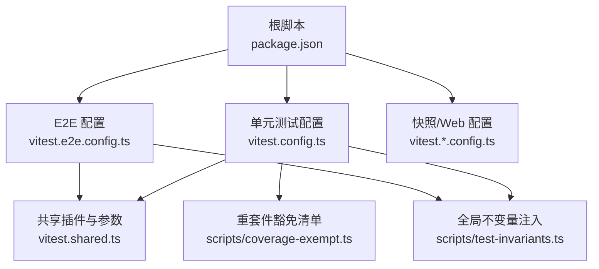
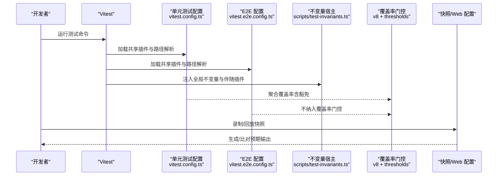
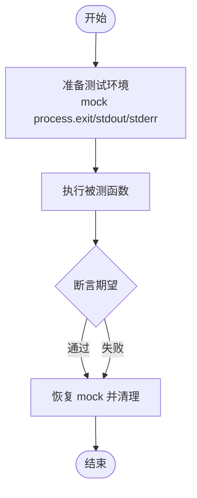
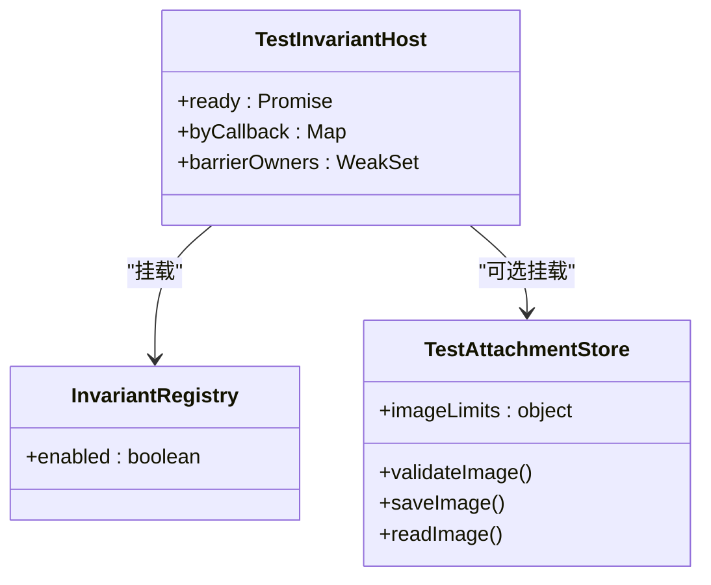
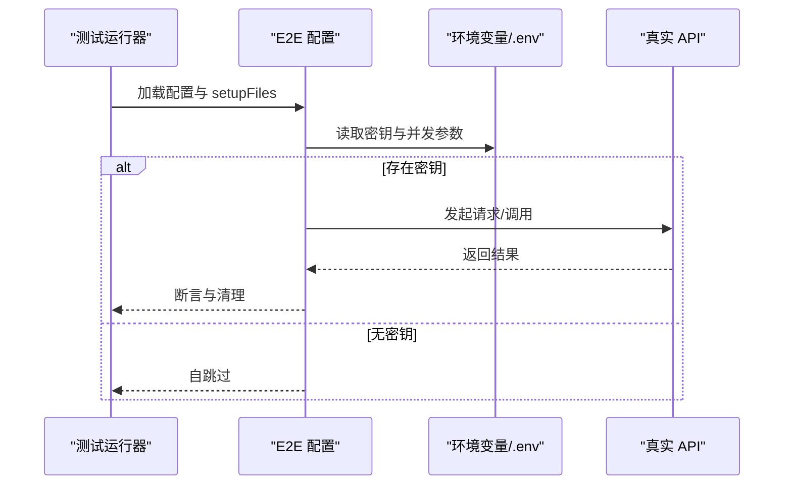
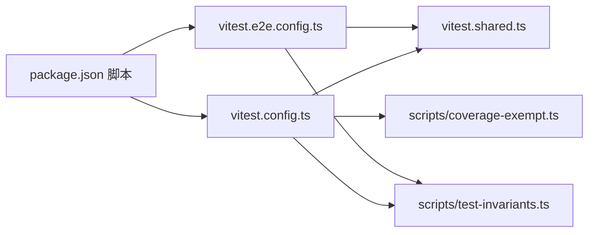

# 工具测试与调试

<cite>
**本文引用的文件**
- [vitest.config.ts](file://vitest.config.ts)
- [vitest.e2e.config.ts](file://vitest.e2e.config.ts)
- [vitest.shared.ts](file://vitest.shared.ts)
- [scripts/test-invariants.ts](file://scripts/test-invariants.ts)
- [scripts/coverage-exempt.ts](file://scripts/coverage-exempt.ts)
- [package.json](file://package.json)
- [docs/testing.md](file://docs/testing.md)
- [apps/cli/tests/args.spec.ts](file://apps/cli/tests/args.spec.ts)
- [examples/acp-agent/tests/cleanup.e2e.ts](file://examples/acp-agent/tests/cleanup.e2e.ts)
- [packages/test-support/client-runtime/src/sessions.ts](file://packages/test-support/client-runtime/src/sessions.ts)
</cite>

## 目录
1. [简介](#简介)
2. [项目结构](#项目结构)
3. [核心组件](#核心组件)
4. [架构总览](#架构总览)
5. [详细组件分析](#详细组件分析)
6. [依赖关系分析](#依赖关系分析)
7. [性能考量](#性能考量)
8. [故障排查指南](#故障排查指南)
9. [结论](#结论)
10. [附录](#附录)

## 简介
本指南面向开发者，系统化说明如何在仓库中进行工具测试与调试，覆盖单元测试、集成测试、端到端（E2E）测试与快照测试的策略与实践。文档基于仓库现有配置与测试实现，给出可操作的命令、覆盖率要求、模拟外部依赖的方法、异步操作测试要点、调试技巧与质量保证流程，帮助建立高效的测试驱动开发工作流。

## 项目结构
仓库采用多包工作区组织，测试按层级划分：
- 单元测试：使用 Vitest 运行各包的 tests 与 scripts 中的 spec 文件，启用 v8 覆盖率门控，强制每文件 100%。
- 端到端测试：独立配置文件 vitest.e2e.config.ts，针对真实 API 或构建产物进行 E2E 场景验证。
- 快照测试：通过专用配置与脚本记录/回放关键输出，确保协议与呈现稳定。
- Web 浏览器测试：单独配置，构建前端后在 Chromium 中比对快照。

**图表来源**
- [package.json:19-47](file://package.json#L19-L47)
- [vitest.config.ts:117-159](file://vitest.config.ts#L117-L159)
- [vitest.e2e.config.ts:31-57](file://vitest.e2e.config.ts#L31-L57)
- [vitest.shared.ts:1-43](file://vitest.shared.ts#L1-L43)
- [scripts/test-invariants.ts:1-47](file://scripts/test-invariants.ts#L1-L47)
- [scripts/coverage-exempt.ts:1-42](file://scripts/coverage-exempt.ts#L1-L42)

**章节来源**
- [package.json:19-47](file://package.json#L19-L47)
- [vitest.config.ts:117-159](file://vitest.config.ts#L117-L159)
- [vitest.e2e.config.ts:31-57](file://vitest.e2e.config.ts#L31-L57)

## 核心组件
- 测试框架与入口
  - 使用 Vitest 作为统一测试运行时；根脚本提供 test、test:coverage、test:e2e、test:snapshot、test:web 等命令。
  - 单元测试与 E2E 分别通过不同配置文件隔离执行域与超时策略。
- 覆盖率门控
  - 使用 v8 提供者，阈值设置为每文件 100%，对 packages/*/*/src 下的源码进行严格覆盖检查。
  - 对重型套件进行豁免，避免编译器与子进程带来的测量开销影响整体速度。
- 测试不变量与装配
  - 通过 setupFiles 注入全局不变量宿主，自动挂载每个包的 invariant 伴随插件，保证服务拓扑与生命周期约束在测试中生效。
- 装饰器与路径解析
  - 预转换 TypeScript 装饰器，并通过 vite-tsconfig-paths 将裸工作区导入映射到 src，避免加载已构建产物导致单例重复。
- 平台与环境适配
  - Windows 下排除不支持的包与测试；根据是否存在 pwsh 动态调整覆盖率豁免；E2E 支持从 .env 加载密钥并控制并发。

**章节来源**
- [package.json:19-47](file://package.json#L19-L47)
- [vitest.config.ts:15-22](file://vitest.config.ts#L15-L22)
- [vitest.config.ts:21-83](file://vitest.config.ts#L21-L83)
- [vitest.config.ts:117-159](file://vitest.config.ts#L117-L159)
- [vitest.config.ts:160-283](file://vitest.config.ts#L160-L283)
- [vitest.shared.ts:1-43](file://vitest.shared.ts#L1-L43)
- [scripts/test-invariants.ts:1-47](file://scripts/test-invariants.ts#L1-L47)
- [scripts/coverage-exempt.ts:1-42](file://scripts/coverage-exempt.ts#L1-L42)
- [vitest.e2e.config.ts:1-14](file://vitest.e2e.config.ts#L1-L14)
- [vitest.e2e.config.ts:31-57](file://vitest.e2e.config.ts#L31-L57)

## 架构总览
下图展示测试运行时的关键交互：Vitest 启动后加载共享插件与不变量宿主，单元测试与 E2E 分别进入各自配置域；覆盖率门控聚合所有项目结果，并对重型套件进行豁免；快照与 Web 测试通过独立配置与脚本完成录制/回放与浏览器比对。

**图表来源**
- [vitest.config.ts:117-159](file://vitest.config.ts#L117-L159)
- [vitest.e2e.config.ts:31-57](file://vitest.e2e.config.ts#L31-L57)
- [scripts/test-invariants.ts:1-47](file://scripts/test-invariants.ts#L1-L47)
- [vitest.config.ts:160-283](file://vitest.config.ts#L160-L283)

## 详细组件分析

### 单元测试策略与规范
- 目标与范围
  - 覆盖 packages/*/*/tests 与 scripts/**/*.spec.ts；测试应与被测代码同区域放置，便于维护与定位。
- 用例编写建议
  - 优先覆盖边界条件、错误路径、事件顺序、并发竞态与契约回归；为每个注册点添加 HMR 安全测试（释放 fiber 并断言清理）。
- 资源管理
  - 测试内创建 harness，在 afterEach 中 dispose（即使失败/重试/超时也要释放）；共享 fixture 放在普通 harness 文件中，避免重复注册真实 API 调用。
- 示例参考
  - CLI 参数解析测试展示了如何捕获 process.exit 与 stdout/stderr 写入，断言退出码与路由行为。

**图表来源**
- [apps/cli/tests/args.spec.ts:1-21](file://apps/cli/tests/args.spec.ts#L1-L21)
- [apps/cli/tests/args.spec.ts:23-106](file://apps/cli/tests/args.spec.ts#L23-L106)

**章节来源**
- [docs/testing.md:7-14](file://docs/testing.md#L7-L14)
- [docs/testing.md:27-35](file://docs/testing.md#L27-L35)
- [apps/cli/tests/args.spec.ts:1-21](file://apps/cli/tests/args.spec.ts#L1-L21)
- [apps/cli/tests/args.spec.ts:23-106](file://apps/cli/tests/args.spec.ts#L23-L106)

### 集成测试与装配
- 测试不变量宿主
  - 通过 setupFiles 注入，自动发现并挂载每个包的 invariant 伴随插件，确保服务拓扑、生命周期与校验在测试中生效。
  - 对需要手动拓扑的测试提供例外，避免干扰聚焦测试。
- 附件存储与限制
  - 在测试环境中提供最小化图片限制与失败路径，便于覆盖边界逻辑。
- 示例参考
  - 会话夹具提供 fail-loud 的未存根方法，确保测试显式声明所需行为，避免半工作假实现。

**图表来源**
- [scripts/test-invariants.ts:54-109](file://scripts/test-invariants.ts#L54-L109)
- [scripts/test-invariants.ts:158-209](file://scripts/test-invariants.ts#L158-L209)
- [scripts/test-invariants.ts:114-134](file://scripts/test-invariants.ts#L114-L134)
- [packages/test-support/client-runtime/src/sessions.ts:18-115](file://packages/test-support/client-runtime/src/sessions.ts#L18-L115)

**章节来源**
- [scripts/test-invariants.ts:1-47](file://scripts/test-invariants.ts#L1-L47)
- [scripts/test-invariants.ts:54-109](file://scripts/test-invariants.ts#L54-L109)
- [scripts/test-invariants.ts:114-134](file://scripts/test-invariants.ts#L114-L134)
- [scripts/test-invariants.ts:158-209](file://scripts/test-invariants.ts#L158-L209)
- [packages/test-support/client-runtime/src/sessions.ts:18-115](file://packages/test-support/client-runtime/src/sessions.ts#L18-L115)

### 端到端测试与真实 API
- 配置与并发
  - 独立配置文件，设置较长超时与重试；通过环境变量控制最大工作线程数，平衡 CI 与本地运行效率。
- 密钥与环境
  - 尝试加载根 .env；无密钥时自跳过，保持 keyless CI 绿色；有密钥时执行真实模型调用与供应商冒烟测试。
- 示例参考
  - ACP 清理测试演示了进程关闭失败时的资源回收与错误聚合断言。

**图表来源**
- [vitest.e2e.config.ts:1-14](file://vitest.e2e.config.ts#L1-L14)
- [vitest.e2e.config.ts:31-57](file://vitest.e2e.config.ts#L31-L57)
- [examples/acp-agent/tests/cleanup.e2e.ts:1-39](file://examples/acp-agent/tests/cleanup.e2e.ts#L1-L39)

**章节来源**
- [vitest.e2e.config.ts:1-14](file://vitest.e2e.config.ts#L1-L14)
- [vitest.e2e.config.ts:31-57](file://vitest.e2e.config.ts#L31-L57)
- [examples/acp-agent/tests/cleanup.e2e.ts:1-39](file://examples/acp-agent/tests/cleanup.e2e.ts#L1-L39)

### 快照测试与浏览器测试
- 快照测试
  - 通过专用配置与脚本录制/回放关键输出；CI 强制只读模式，仅本地记录/刷新；变更需人工审查差异。
- 浏览器测试
  - 先构建前端，再运行 Playwright 驱动的浏览器场景；对比 apps/web/tests/snapshots 中的预期输出。
- 最佳实践
  - 非平凡模型/协议/人类可见变化应增加键无关场景；使用示例工程驱动快照套件，确保端到端语义稳定。

**章节来源**
- [docs/testing.md:12-15](file://docs/testing.md#L12-L15)
- [docs/testing.md:47-50](file://docs/testing.md#L47-L50)

### 模拟外部依赖与异步操作
- 模拟策略
  - 仅对昂贵或非确定性边界（LLM 适配器、网络、时钟）进行模拟；下游保持真实实现，以验证数据流动与副作用。
- 异步与并发
  - 使用 vi.waitFor 明确间隔与超时；对子进程与 Worker 使用独立进程池与超时保护；E2E 通过重试缓解瞬态抖动。
- 资源清理
  - 测试内创建 harness，afterEach 中 dispose；对进程关闭失败进行聚合错误断言，确保资源释放与可观测性。

**章节来源**
- [docs/testing.md:21-26](file://docs/testing.md#L21-L26)
- [examples/acp-agent/tests/cleanup.e2e.ts:1-39](file://examples/acp-agent/tests/cleanup.e2e.ts#L1-L39)

## 依赖关系分析
- 配置间依赖
  - vitest.config.ts 与 vitest.e2e.config.ts 均依赖 vitest.shared.ts 提供的装饰器预处理与 execArgv 参数。
  - 两者都通过 setupFiles 注入 scripts/test-invariants.ts，确保测试环境一致性。
- 覆盖率与豁免
  - vitest.config.ts 定义覆盖率包含/排除与阈值；scripts/coverage-exempt.ts 提供重型套件豁免清单，由环境变量控制是否启用。
- 脚本与命令
  - package.json 暴露测试命令，串联 Vitest、覆盖率、快照与 Web 测试；CI 通过 gates 脚本组合执行。

**图表来源**
- [package.json:19-47](file://package.json#L19-L47)
- [vitest.config.ts:117-159](file://vitest.config.ts#L117-L159)
- [vitest.e2e.config.ts:31-57](file://vitest.e2e.config.ts#L31-L57)
- [vitest.shared.ts:1-43](file://vitest.shared.ts#L1-L43)
- [scripts/test-invariants.ts:1-47](file://scripts/test-invariants.ts#L1-L47)
- [scripts/coverage-exempt.ts:1-42](file://scripts/coverage-exempt.ts#L1-L42)

**章节来源**
- [package.json:19-47](file://package.json#L19-L47)
- [vitest.config.ts:117-159](file://vitest.config.ts#L117-L159)
- [vitest.e2e.config.ts:31-57](file://vitest.e2e.config.ts#L31-L57)
- [vitest.shared.ts:1-43](file://vitest.shared.ts#L1-L43)
- [scripts/test-invariants.ts:1-47](file://scripts/test-invariants.ts#L1-L47)
- [scripts/coverage-exempt.ts:1-42](file://scripts/coverage-exempt.ts#L1-L42)

## 性能考量
- 覆盖率门控
  - 使用 v8 提供者与 perFile 100% 阈值，确保每文件高质量覆盖；对重型套件进行豁免，减少编译器与子进程测量开销。
- 并行与隔离
  - 单元测试使用 fork 池以避免 Node 线程问题；E2E 通过环境变量控制并发，兼顾速度与稳定性。
- 资源与超时
  - E2E 设置较长超时与重试；测试内显式管理资源与清理，避免泄漏与竞争条件。

**章节来源**
- [vitest.config.ts:160-283](file://vitest.config.ts#L160-L283)
- [vitest.config.ts:124-159](file://vitest.config.ts#L124-L159)
- [vitest.e2e.config.ts:46-57](file://vitest.e2e.config.ts#L46-L57)
- [scripts/coverage-exempt.ts:1-42](file://scripts/coverage-exempt.ts#L1-L42)

## 故障排查指南
- 常见问题
  - 覆盖率不达标：检查 perFile 阈值与豁免清单；确认未覆盖行是否为死代码或需删除。
  - E2E 失败：检查密钥与环境变量；降低并发或增加超时；查看重试日志。
  - 快照不一致：确认是否在本地记录/刷新；CI 强制只读，需人工审查差异。
- 调试技巧
  - 使用 setupFiles 注入的不变量宿主观察服务装配；对子进程与 Worker 使用独立进程池与超时保护。
  - 对 CLI 与进程相关测试，捕获 process.exit 与 stdout/stderr 写入，断言退出码与输出。
- 资源清理
  - 在 afterEach 中 dispose；对进程关闭失败进行聚合错误断言，确保资源释放与可观测性。

**章节来源**
- [vitest.config.ts:160-283](file://vitest.config.ts#L160-L283)
- [vitest.e2e.config.ts:46-57](file://vitest.e2e.config.ts#L46-L57)
- [docs/testing.md:27-35](file://docs/testing.md#L27-L35)
- [apps/cli/tests/args.spec.ts:1-21](file://apps/cli/tests/args.spec.ts#L1-L21)
- [examples/acp-agent/tests/cleanup.e2e.ts:1-39](file://examples/acp-agent/tests/cleanup.e2e.ts#L1-L39)

## 结论
本仓库通过分层测试策略与严格的覆盖率门控，确保工具与系统的可靠性与可维护性。单元测试聚焦契约与边界，集成测试保障装配与服务拓扑，E2E 与快照测试验证端到端语义与用户可见行为。配合完善的调试与故障排查手段，开发者可以高效地进行测试驱动开发与持续改进。

## 附录
- 常用命令
  - 单元测试：pnpm run test
  - 覆盖率门控：pnpm run test:coverage
  - 端到端测试：pnpm run test:e2e
  - 快照测试：pnpm run test:snapshot / test:snapshot:record / test:snapshot:refresh
  - Web 浏览器测试：pnpm run test:web / test:web:built / test:web:perf
- 质量门禁
  - 覆盖率阈值：perFile 100%（packages/*/*/src）
  - E2E 并发：DSH_E2E_MAX_WORKERS
  - 快照模式：DSH_SNAPSHOT=record/refresh/replay

**章节来源**
- [package.json:19-47](file://package.json#L19-L47)
- [vitest.config.ts:160-283](file://vitest.config.ts#L160-L283)
- [vitest.e2e.config.ts:31-57](file://vitest.e2e.config.ts#L31-L57)
- [docs/testing.md:7-15](file://docs/testing.md#L7-L15)