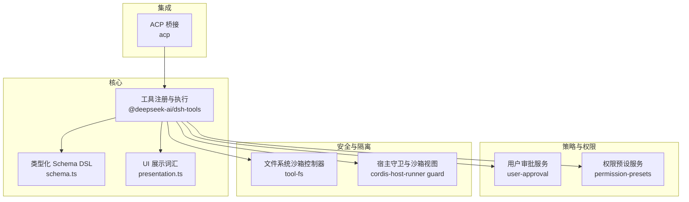
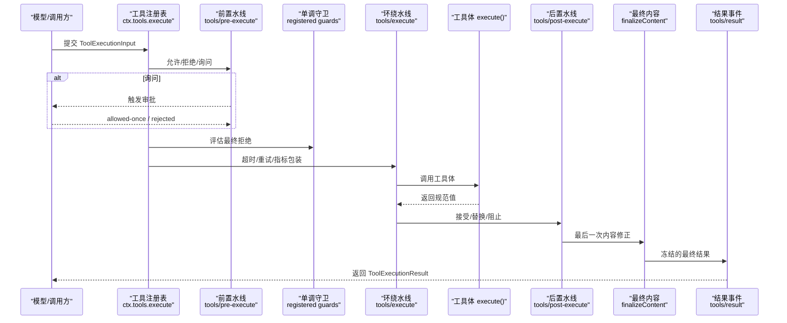
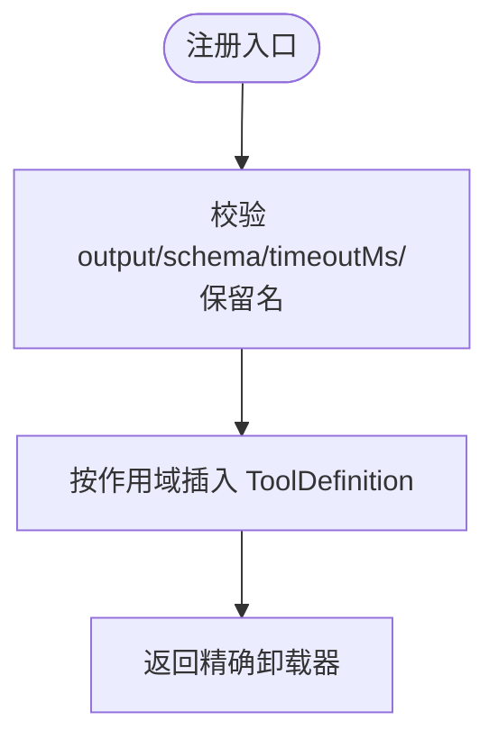
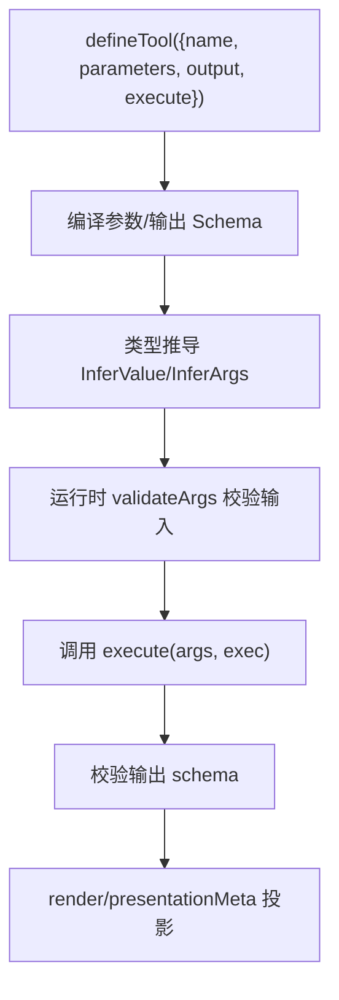
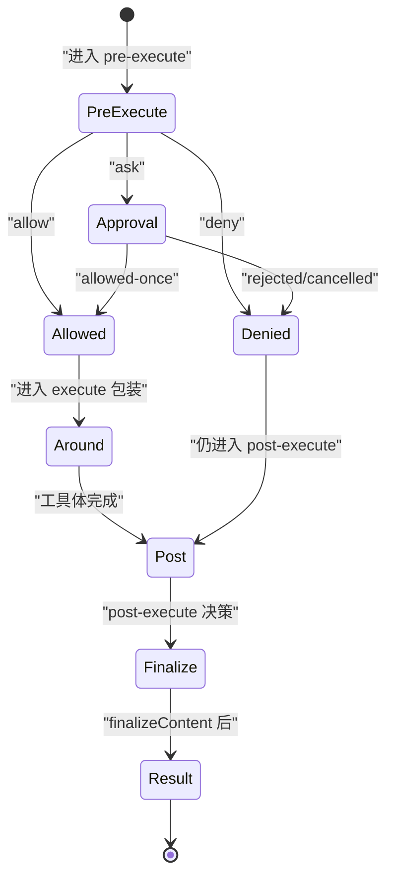
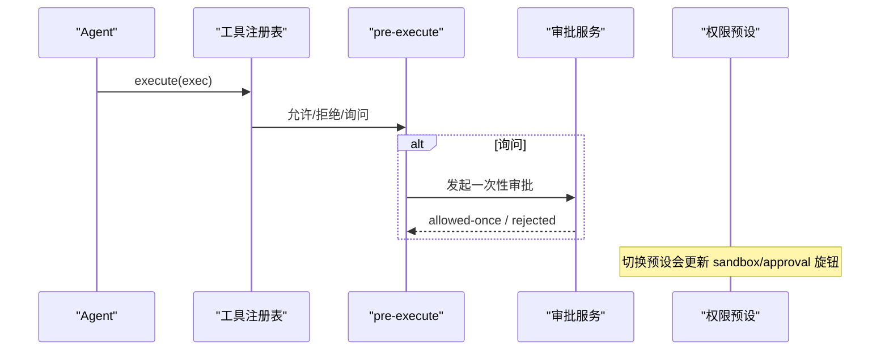
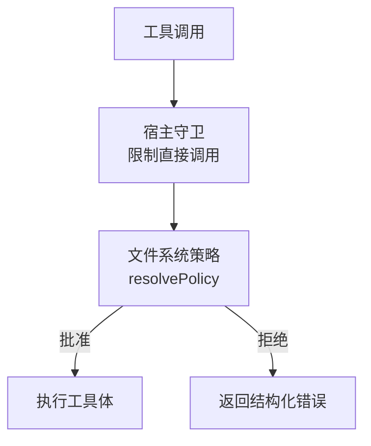
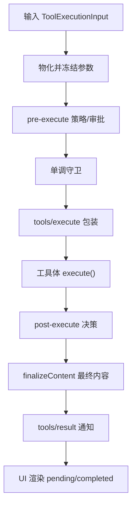
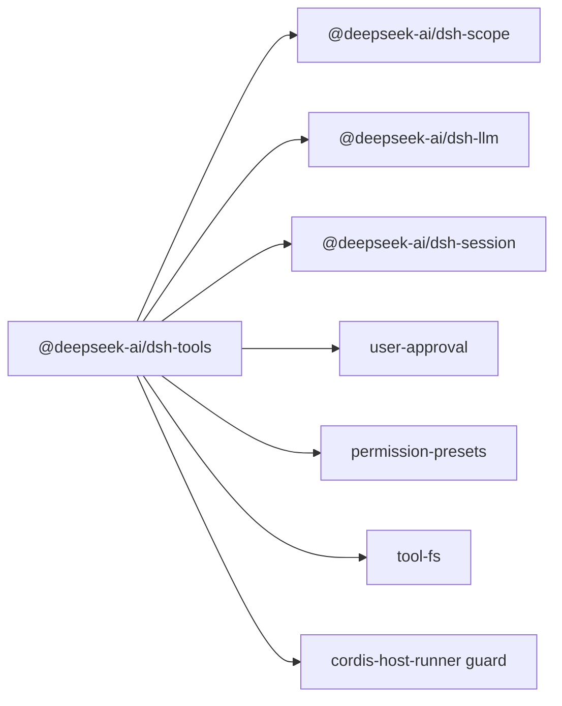

# 工具系统架构

<cite>
**本文引用的文件**
- [packages/core/tools/src/index.ts](file://packages/core/tools/src/index.ts)
- [packages/core/tools/src/schema.ts](file://packages/core/tools/src/schema.ts)
- [packages/core/tools/src/presentation.ts](file://packages/core/tools/src/presentation.ts)
- [packages/core/tools/tests/tools.spec.ts](file://packages/core/tools/tests/tools.spec.ts)
- [packages/core/tools/tests/invariant.spec.ts](file://packages/core/tools/tests/invariant.spec.ts)
- [packages/extensions/cordis-host-runner/src/guard.ts](file://packages/extensions/cordis-host-runner/src/guard.ts)
- [packages/acp/acp/src/index.ts](file://packages/acp/acp/src/index.ts)
- [packages/interaction/user-approval/src/index.ts](file://packages/interaction/user-approval/src/index.ts)
- [packages/fs/tool-fs/src/sandbox.ts](file://packages/fs/tool-fs/src/sandbox.ts)
- [docs/subsystems/tools.md](file://docs/subsystems/tools.md)
- [docs/subsystems/tools.zh.md](file://docs/subsystems/tools.zh.md)
- [docs/tool-execution-pipeline.md](file://docs/tool-execution-pipeline.md)
- [docs/subsystems/permission-presets.md](file://docs/subsystems/permission-presets.md)
</cite>

## 目录
1. [简介](#简介)
2. [项目结构](#项目结构)
3. [核心组件](#核心组件)
4. [架构总览](#架构总览)
5. [详细组件分析](#详细组件分析)
6. [依赖关系分析](#依赖关系分析)
7. [性能与并发特性](#性能与并发特性)
8. [故障排查指南](#故障排查指南)
9. [结论](#结论)
10. [附录：扩展点与自定义机制](#附录：扩展点与自定义机制)

## 简介
本文件系统性阐述 DeepSeek Harness 工具系统的整体设计原理与实现细节，覆盖工具注册、执行管道、生命周期管理、参数验证、执行上下文、Agent 交互、权限与安全控制、以及从调用到结果返回的完整流程。文档同时提供面向开发者的扩展点与自定义机制说明，帮助读者深入理解工具系统内部工作原理。

## 项目结构
工具系统以 packages/core/tools 为核心，围绕“注册表 + 执行管道 + 展示投影”展开；配合权限与审批子系统（user-approval、permission-presets）、沙箱文件系统（tool-fs）以及 ACP 桥接等模块，形成完整的工具能力边界与策略体系。

图表来源
- [packages/core/tools/src/index.ts:1-200](file://packages/core/tools/src/index.ts#L1-L200)
- [packages/core/tools/src/schema.ts:1-200](file://packages/core/tools/src/schema.ts#L1-L200)
- [packages/core/tools/src/presentation.ts](file://packages/core/tools/src/presentation.ts)
- [packages/interaction/user-approval/src/index.ts:219-237](file://packages/interaction/user-approval/src/index.ts#L219-L237)
- [docs/subsystems/permission-presets.md:1-132](file://docs/subsystems/permission-presets.md#L1-L132)
- [packages/fs/tool-fs/src/sandbox.ts:26-108](file://packages/fs/tool-fs/src/sandbox.ts#L26-L108)
- [packages/extensions/cordis-host-runner/src/guard.ts:639-655](file://packages/extensions/cordis-host-runner/src/guard.ts#L639-L655)
- [packages/acp/acp/src/index.ts:198-229](file://packages/acp/acp/src/index.ts#L198-L229)

章节来源
- [docs/subsystems/tools.md:1-12](file://docs/subsystems/tools.md#L1-L12)
- [docs/subsystems/tools.zh.md:1-12](file://docs/subsystems/tools.zh.md#L1-L12)

## 核心组件
- 工具定义与注册：ToolDefinition、register、schemas、restrict、guard、executionMode、execute。
- 执行管道：tools/pre-execute → 单调守卫 → tools/execute → tools/post-execute → finalizeContent → tools/result。
- 参数与输出校验：统一的 JSON 值 Schema DSL、defineTool、validateArgs、assertSupportedJsonSchema。
- 执行上下文：ToolExecutionInput/ToolExecution、ToolRunContext（deferContext、concludeTurn）。
- UI 展示：presentCall/presentResult 渲染意图（card 标签联合）。
- 权限与审批：pre-execute 中的 ask 流程、用户审批服务、权限预设。
- 安全与沙箱：文件系统访问策略、宿主守卫限制直接调用、保留名称保护。

章节来源
- [packages/core/tools/src/index.ts:703-718](file://packages/core/tools/src/index.ts#L703-L718)
- [packages/core/tools/src/index.ts:1031-1088](file://packages/core/tools/src/index.ts#L1031-L1088)
- [packages/core/tools/src/schema.ts:1-200](file://packages/core/tools/src/schema.ts#L1-L200)
- [docs/subsystems/tools.md:170-405](file://docs/subsystems/tools.md#L170-L405)
- [docs/subsystems/tools.zh.md:170-405](file://docs/subsystems/tools.zh.md#L170-L405)

## 架构总览
工具系统采用“注册表 + 可插拔水线（waterfall）+ 作用域可见性”的架构。注册表维护全局与按 Agent 作用域的 ToolDefinition，并通过 schemas() 暴露给模型请求的只读元数据；execute() 将一次调用贯穿 pre-execute、monotonic guards、around-dispatch、post-execute、finalizeContent 与 result 通知，确保策略、审计、呈现与持久化解耦且可组合。

图表来源
- [docs/tool-execution-pipeline.md:8-60](file://docs/tool-execution-pipeline.md#L8-L60)
- [packages/core/tools/src/index.ts:152-197](file://packages/core/tools/src/index.ts#L152-L197)
- [packages/core/tools/src/index.ts:703-718](file://packages/core/tools/src/index.ts#L703-L718)

章节来源
- [docs/tool-execution-pipeline.md:1-63](file://docs/tool-execution-pipeline.md#L1-L63)

## 详细组件分析

### 工具注册与可见性
- register(definition)：校验 output 声明、JSON Schema 支持、timeoutMs 语义、保留名称保护；通过 layers.effect 在作用域内插入 ToolDefinition，并返回精确的卸载器。
- restrict(filter)：对继承的全局工具进行 allow/deny 过滤，交集生效；不允许影响作用域内注册与保留名称。
- get/schemas：按作用域解析可见工具；schemas() 仅暴露面向模型的白名单字段，不泄露执行与展示回调。
- executionMode：基于 isConcurrencySafe 分类为 parallel/exclusive，用于调度屏障与滚动池并行。

图表来源
- [packages/core/tools/src/index.ts:1031-1062](file://packages/core/tools/src/index.ts#L1031-L1062)
- [packages/core/tools/src/index.ts:1064-1088](file://packages/core/tools/src/index.ts#L1064-L1088)

章节来源
- [packages/core/tools/src/index.ts:1031-1088](file://packages/core/tools/src/index.ts#L1031-L1088)
- [packages/core/tools/tests/tools.spec.ts:1966-1997](file://packages/core/tools/tests/tools.spec.ts#L1966-L1997)

### defineTool API 与参数验证
- 统一 Schema DSL：ValueSchemaSpec 支持 string/number/integer/boolean/null/array/object/json/oneOf；ParameterSchemaSpec 描述参数对象根；InferValue/InferArgs 提供编译期类型推导。
- defineTool：绑定参数推导与 validateArgs；output.schema 经 valueSchemaSpecToJsonSchema 编译为受控原始 JSON Schema；运行时严格校验输入与输出，错误走标准工具错误路径。
- 约束与回退：推断深度上限 16 层后回退 JsonValue；raw schema 默认开放但关键字受控；oneOf 至少两分支且必须恰好匹配一个。

图表来源
- [packages/core/tools/src/schema.ts:1-200](file://packages/core/tools/src/schema.ts#L1-L200)
- [docs/subsystems/tools.md:98-151](file://docs/subsystems/tools.md#L98-L151)
- [docs/subsystems/tools.zh.md:98-151](file://docs/subsystems/tools.zh.md#L98-L151)

章节来源
- [packages/core/tools/src/schema.ts:1-200](file://packages/core/tools/src/schema.ts#L1-L200)
- [docs/subsystems/tools.md:98-151](file://docs/subsystems/tools.md#L98-L151)
- [docs/subsystems/tools.zh.md:98-151](file://docs/subsystems/tools.zh.md#L98-L151)

### 执行上下文与生命周期
- ToolExecutionInput/ToolExecution：包含 callId、rootCallId、name、arguments、agent、parent token、signal；注册表分配不可变 token 并冻结参数。
- ToolRunContext：提供 deferContext（附加上下文至本次执行结果）与 concludeTurn（标记本轮终止）。
- 生命周期阶段：
  - tools/pre-execute：允许/拒绝/询问（审批）。
  - 单调守卫：最终拒绝权，顺序不可逆。
  - tools/execute：超时、重试、指标等环绕逻辑。
  - tools/post-execute：接受/替换/阻止，注入 additionalContexts。
  - finalizeContent：最后一次内容修正，保证同步无副作用。
  - tools/result：冻结的最终结果通知。

图表来源
- [packages/core/tools/src/index.ts:152-197](file://packages/core/tools/src/index.ts#L152-L197)
- [docs/subsystems/tools.md:170-405](file://docs/subsystems/tools.md#L170-L405)
- [docs/tool-execution-pipeline.md:8-60](file://docs/tool-execution-pipeline.md#L8-L60)

章节来源
- [packages/core/tools/src/index.ts:152-197](file://packages/core/tools/src/index.ts#L152-L197)
- [docs/subsystems/tools.md:170-405](file://docs/subsystems/tools.md#L170-L405)

### 工具与 Agent 的交互与权限控制
- 作用域可见性：每个 Agent 拥有独立 scope，注册与限制在该 scope 内生效；全局工具可通过 restrict 过滤。
- 审批流：pre-execute 中 ask 会调用 ctx.approval，返回 allowed-once 才放行；缺失或不支持时降级为 deny。
- 权限预设：permission-presets 将 sandbox/mode 与 approval/policy 打包为预设，切换时记录事件并写入各旋钮。
- ACP 桥接：将 approval/request 映射为一次性选项（allow_once/reject_once），不建立持久授权。

图表来源
- [packages/acp/acp/src/index.ts:198-229](file://packages/acp/acp/src/index.ts#L198-L229)
- [packages/interaction/user-approval/src/index.ts:219-237](file://packages/interaction/user-approval/src/index.ts#L219-L237)
- [docs/subsystems/permission-presets.md:1-132](file://docs/subsystems/permission-presets.md#L1-L132)

章节来源
- [packages/acp/acp/src/index.ts:198-229](file://packages/acp/acp/src/index.ts#L198-L229)
- [packages/interaction/user-approval/src/index.ts:219-237](file://packages/interaction/user-approval/src/index.ts#L219-L237)
- [docs/subsystems/permission-presets.md:1-132](file://docs/subsystems/permission-presets.md#L1-L132)

### 安全考虑与沙箱
- 宿主守卫：sandboxTools 仅提供 register/schemas/get 的受限视图，避免包代码直接持有 execute 引用绕过注册表。
- 文件系统沙箱：FsSandboxController 根据会话策略与审批决定是否提升权限；escalation 需要 justification 与 approved mode。
- 保留名称：run_code 为 Code Mode 传输专用，禁止注册或遮蔽，防止越权直调。

图表来源
- [packages/extensions/cordis-host-runner/src/guard.ts:639-655](file://packages/extensions/cordis-host-runner/src/guard.ts#L639-L655)
- [packages/fs/tool-fs/src/sandbox.ts:26-108](file://packages/fs/tool-fs/src/sandbox.ts#L26-L108)
- [packages/core/tools/src/index.ts:1031-1062](file://packages/core/tools/src/index.ts#L1031-L1062)

章节来源
- [packages/extensions/cordis-host-runner/src/guard.ts:639-655](file://packages/extensions/cordis-host-runner/src/guard.ts#L639-L655)
- [packages/fs/tool-fs/src/sandbox.ts:26-108](file://packages/fs/tool-fs/src/sandbox.ts#L26-L108)
- [packages/core/tools/src/index.ts:1031-1062](file://packages/core/tools/src/index.ts#L1031-L1062)

### 工具执行流程（从调用到结果返回）
- 输入物化：ToolExecutionInput 被转换为 ToolExecution，参数一次性 JSON 物化并冻结。
- 策略与审批：pre-execute 允许/拒绝/询问；单调守卫做最终拒绝；审批失败即拒绝。
- 执行与包装：tools/execute 支持超时、重试、指标；工具体需响应 exec.signal 并在取消时达到静默。
- 结果归一化：post-execute 接受/替换/阻止；finalizeContent 做最后一次内容修正；tools/result 发出冻结结果。
- 持久化与展示：tool/call 与 tool/result 事件记录；UI 使用 presentCall/presentResult 渲染待执行与已完成卡片。

图表来源
- [docs/tool-execution-pipeline.md:8-60](file://docs/tool-execution-pipeline.md#L8-L60)
- [packages/core/tools/src/index.ts:152-197](file://packages/core/tools/src/index.ts#L152-L197)

章节来源
- [docs/tool-execution-pipeline.md:1-63](file://docs/tool-execution-pipeline.md#L1-L63)

## 依赖关系分析
- 工具注册表依赖 Scope 层（dsh-scope）实现作用域注册与限制；依赖 LLM 协议类型（ToolSchema、ContentBlock）；依赖 Session 快照与类型（JsonValue、UserMessage）。
- 执行管道通过 Cordis 事件/水线机制串联策略与观察点；与 user-approval、permission-presets、tool-fs 等模块协作。
- 宿主守卫限制包代码直接访问 execute，确保所有调用经过注册表与策略。

图表来源
- [packages/core/tools/src/index.ts:1-200](file://packages/core/tools/src/index.ts#L1-L200)
- [packages/extensions/cordis-host-runner/src/guard.ts:639-655](file://packages/extensions/cordis-host-runner/src/guard.ts#L639-L655)

章节来源
- [packages/core/tools/src/index.ts:1-200](file://packages/core/tools/src/index.ts#L1-L200)

## 性能与并发特性
- 并发模式：executionMode 基于 isConcurrencySafe 将调用分类为 parallel 或 exclusive，用于构建独占屏障与滚动池并行执行。
- 超时预算：timeoutMs 由 tools/execute 包装策略执行，要求工具体协作式响应取消信号并尽快达到静默。
- 冻结与快照：参数与结果在关键边界冻结，减少竞争条件与回放不一致风险。

章节来源
- [docs/subsystems/tools.md:243-253](file://docs/subsystems/tools.md#L243-L253)
- [docs/subsystems/tools.zh.md:243-253](file://docs/subsystems/tools.zh.md#L243-L253)

## 故障排查指南
- 重复注册与作用域冲突：同一层重复 name 会报错；HMR 下 fiber dispose 会注销作用域内工具。
- 非法 timeoutMs：非正有限数抛出类型错误。
- 未知工具：不可见或未注册的工具在执行前被识别为 UNKNOWN_TOOL。
- 流水线不变量：重复或乱序的阶段会被拒绝；结果冻结后不可再修改。
- 审批缺失：ask 在无审批支持时降级为 deny。

章节来源
- [packages/core/tools/tests/tools.spec.ts:1966-1997](file://packages/core/tools/tests/tools.spec.ts#L1966-L1997)
- [packages/core/tools/tests/invariant.spec.ts:40-70](file://packages/core/tools/tests/invariant.spec.ts#L40-L70)
- [docs/subsystems/tools.md:170-405](file://docs/subsystems/tools.md#L170-L405)

## 结论
DeepSeek Harness 工具系统通过严格的注册表、可扩展的执行水线与作用域可见性，实现了安全的工具调用与灵活的策略组合。defineTool 提供类型安全的参数与输出契约；执行管道确保策略、审计、呈现与持久化的解耦与一致性；权限与沙箱机制保障敏感操作的安全边界。开发者可基于扩展点（注册、守卫、水线、展示）定制工具行为，满足复杂场景需求。

## 附录：扩展点与自定义机制
- 注册扩展：通过 ctx.tools.register 添加新工具，或使用 harness.defineTool 在宿主侧声明参数 schema。
- 策略扩展：在 tools/pre-execute 中实现 allow/deny/ask；通过 registered guards 施加最终拒绝。
- 执行包装：在 tools/execute 中实现超时、重试、指标收集；注意恢复 signal 并确保静默。
- 结果处理：在 tools/post-execute 中接受/替换/阻止结果，或注入 additionalContexts。
- 内容修正：实现 finalizeContent 进行最后一次内容修正，保持同步无副作用。
- 展示定制：实现 presentCall/presentResult 返回 card 标签的渲染意图，适配不同 UI。
- 权限与沙箱：结合 permission-presets 与 tool-fs 的沙箱策略，必要时通过 escalation 申请更高权限。

章节来源
- [packages/core/tools/src/index.ts:152-197](file://packages/core/tools/src/index.ts#L152-L197)
- [packages/core/tools/src/index.ts:703-718](file://packages/core/tools/src/index.ts#L703-L718)
- [packages/core/tools/src/index.ts:1031-1088](file://packages/core/tools/src/index.ts#L1031-L1088)
- [packages/extensions/cordis-host-runner/src/guard.ts:639-655](file://packages/extensions/cordis-host-runner/src/guard.ts#L639-L655)
- [packages/fs/tool-fs/src/sandbox.ts:26-108](file://packages/fs/tool-fs/src/sandbox.ts#L26-L108)
- [docs/subsystems/tools.md:459-468](file://docs/subsystems/tools.md#L459-L468)
- [docs/subsystems/tools.zh.md:459-468](file://docs/subsystems/tools.zh.md#L459-L468)