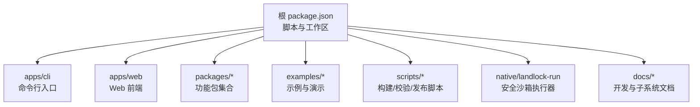
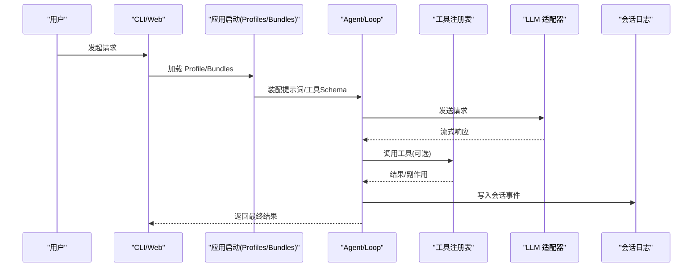
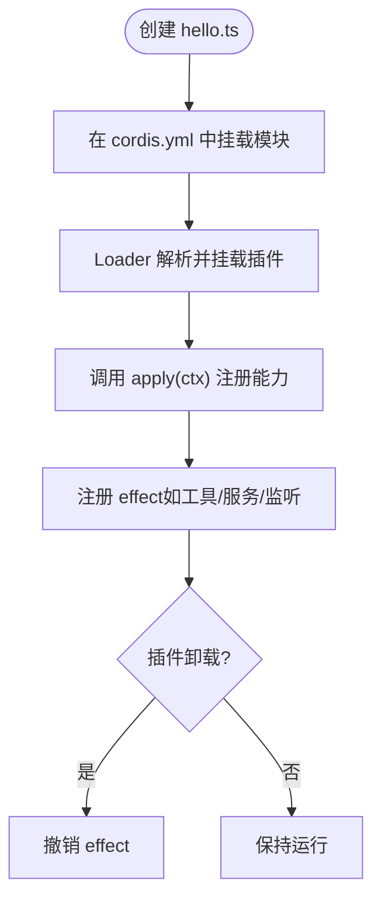
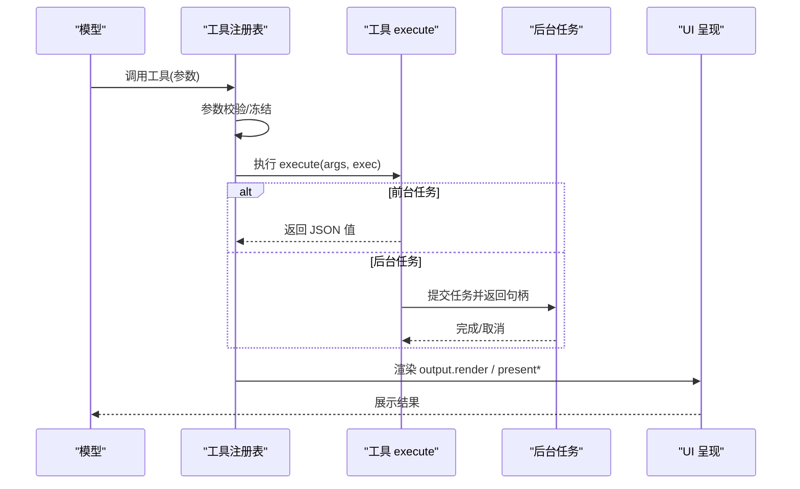
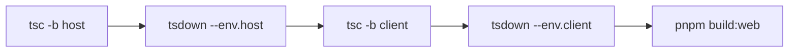
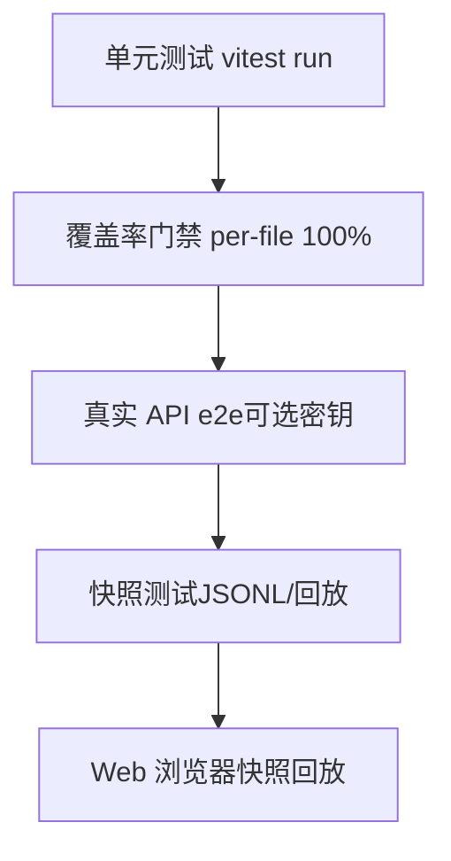
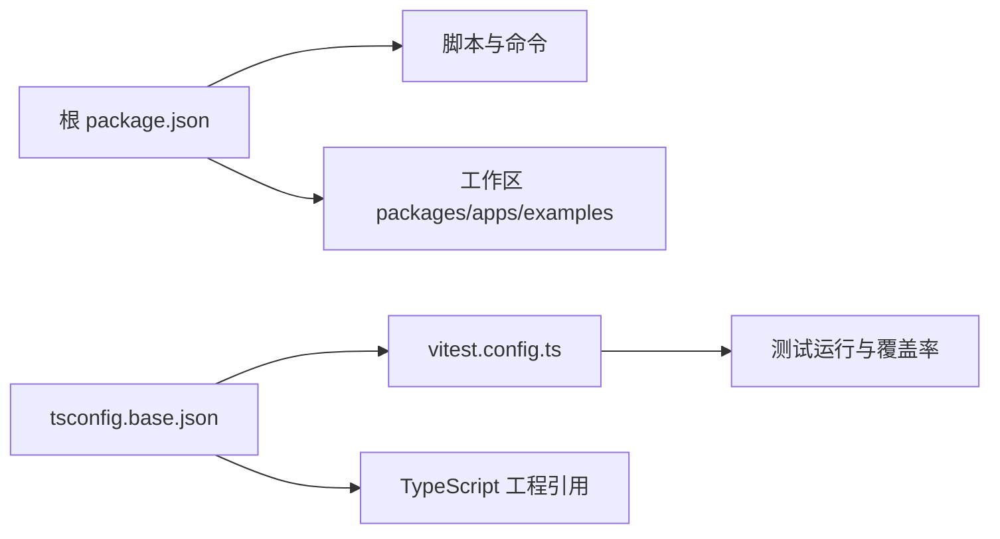

# 开发指南

<cite>
**本文引用的文件**
- [README.md](file://README.md)
- [CONTRIBUTING.md](file://CONTRIBUTING.md)
- [package.json](file://package.json)
- [development.md](file://docs/development.md)
- [testing.md](file://docs/testing.md)
- [architecture.md](file://docs/architecture.md)
- [01-first-plugin.md](file://docs/cordis-tutorial/01-first-plugin.md)
- [adding-a-tool.md](file://docs/cookbook/adding-a-tool.md)
- [adding-a-package.md](file://docs/cookbook/adding-a-package.md)
- [vitest.config.ts](file://vitest.config.ts)
- [tsconfig.base.json](file://tsconfig.base.json)
</cite>

## 目录
1. [简介](#简介)
2. [项目结构](#项目结构)
3. [核心组件](#核心组件)
4. [架构总览](#架构总览)
5. [详细组件分析](#详细组件分析)
6. [依赖分析](#依赖分析)
7. [性能考虑](#性能考虑)
8. [故障排查指南](#故障排查指南)
9. [结论](#结论)
10. [附录](#附录)

## 简介
本指南面向 DeepSeek Harness（dsh）的贡献者与维护者，覆盖从环境搭建、代码规范与提交流程，到插件与工具开发、测试策略、构建系统、调试与性能分析、以及完整的开发工作流。文档同时提供代码级图示与可追溯的“章节来源”，帮助快速定位实现细节。

## 项目结构
仓库采用多包工作区组织，包含 CLI、Web、示例、原生子进程、脚本与文档等。根配置统一了构建、类型检查、测试与发布流程；Host/Client 双聚合 TypeScript 工程分离运行时边界；Cordis 插件体系贯穿所有能力扩展点。

**图表来源**
- [package.json:1-18](file://package.json#L1-L18)
- [development.md:44-78](file://docs/development.md#L44-L78)

**章节来源**
- [README.md:15-35](file://README.md#L15-L35)
- [package.json:19-142](file://package.json#L19-L142)
- [development.md:44-78](file://docs/development.md#L44-L78)

## 核心组件
- 插件系统与 Cordis：一切皆插件，通过 Context 注册服务、事件与副作用，卸载时自动撤销。
- 工具注册与执行：通过 defineTool 声明参数、输出与执行逻辑，进入统一的执行管道与呈现层。
- 会话与事件：会话日志是模型可见输入的唯一来源；事件分为会话、Agent 与能力三类。
- 构建与类型：Host/Client 双聚合 + tsdown 打包；Typert 在 Host 阶段生成远程契约。
- 测试与质量：Vitest 分层测试、覆盖率门禁、快照与 Web 浏览器回放；lefthook 本地门禁。

**章节来源**
- [architecture.md:9-37](file://docs/architecture.md#L9-L37)
- [architecture.md:53-127](file://docs/architecture.md#L53-L127)
- [development.md:44-88](file://docs/development.md#L44-L88)
- [testing.md:7-15](file://docs/testing.md#L7-L15)

## 架构总览
dsh 以 Cordis 为内核，按 Profile/Bundles 组装运行态；每个能力通过服务定义、提供者与消费者形成可替换的“能力接缝”。

**图表来源**
- [architecture.md:15-37](file://docs/architecture.md#L15-L37)
- [architecture.md:63-90](file://docs/architecture.md#L63-L90)

## 详细组件分析

### 插件开发教程（从零到一）
- 最小插件：导出 name 与 apply(ctx)，在 cordis.yml 中挂载。
- 三种形态：函数插件、对象插件、类插件（继承 Service）。
- 生命周期：插件卸载时其注册的 effect 会回滚。
- 组合与 HMR：配置文件即插件树，支持热重载与诊断。

**图表来源**
- [01-first-plugin.md:5-51](file://docs/cordis-tutorial/01-first-plugin.md#L5-L51)
- [01-first-plugin.md:53-93](file://docs/cordis-tutorial/01-first-plugin.md#L53-L93)

**章节来源**
- [01-first-plugin.md:5-51](file://docs/cordis-tutorial/01-first-plugin.md#L5-L51)
- [01-first-plugin.md:53-93](file://docs/cordis-tutorial/01-first-plugin.md#L53-L93)

### 工具开发指南
- 最小形状：defineTool 声明 name/description/parameters/output/execute。
- execute 契约：参数已校验、返回值必须为单一 JSON 值、抛出或非法返回视为错误、尊重 exec.signal、可投影 presentationMeta。
- 长任务：通过 jobs 后台执行，返回句柄；前台任务耦合 exec.signal。
- 执行策略：pre-execute/execute/post-execute/result 扩展点，支持超时、重试、度量、内容替换与保密策略。
- UI 呈现：presentCall/presentResult 返回 card 意图（generic/terminal/diff/search/web），纯函数且可回放。

**图表来源**
- [adding-a-tool.md:7-55](file://docs/cookbook/adding-a-tool.md#L7-L55)
- [adding-a-tool.md:57-90](file://docs/cookbook/adding-a-tool.md#L57-L90)

**章节来源**
- [adding-a-tool.md:7-90](file://docs/cookbook/adding-a-tool.md#L7-L90)

### 新增工作区包（packages）
- 包结构：package.json、tsconfig.json、src/index.ts、README.md。
- 注册位置：根据 Host/Client 归属加入对应 tsconfig 引用；必要时更新 knip.json。
- 角色命名：Controller/Store/Registry/Runtime/Provider 等命名约定确保职责清晰。
- README 模板：包含“模型体验”、“KV Cache 影响”、“已知限制与延期工作”等固定段落。
- 验证命令：安装、doc-sync、constraints/typecheck/lint/build/hygiene。

**章节来源**
- [adding-a-package.md:7-39](file://docs/cookbook/adding-a-package.md#L7-L39)
- [adding-a-package.md:41-71](file://docs/cookbook/adding-a-package.md#L41-L71)
- [adding-a-package.md:73-116](file://docs/cookbook/adding-a-package.md#L73-L116)

### 构建系统与类型工程
- 双聚合：Host 与 Client 各自独立编译，避免 Context 合并冲突。
- 构建顺序：tsc(host) → tsdown(host) → tsc(client) → tsdown(client) → web build。
- Typert：仅在 Host 阶段运行，生成 Host-for-Client 远程契约。
- 路径解析：tsconfig.base.json 作为全局 paths 门面，测试与脚本均基于 src 解析。

**图表来源**
- [development.md:64-78](file://docs/development.md#L64-L78)
- [tsconfig.base.json:1-5](file://tsconfig.base.json#L1-L5)

**章节来源**
- [development.md:44-88](file://docs/development.md#L44-L88)
- [tsconfig.base.json:1-5](file://tsconfig.base.json#L1-L5)

### 测试策略
- 分层：单元、覆盖率门禁、真实 API e2e、快照、Web 浏览器快照。
- 覆盖率：per-file 100%（部分平台/场景豁免），强调“行覆盖必要但不充分”。
- 真实优先：尽量使用真实实现，仅对昂贵/非确定性边界打桩。
- 入口路径：用构建产物做冒烟，暴露 tsx 掩盖的问题。
- Vitest 配置：paths 指向 src，分线程/进程隔离，Windows 差异处理。

**图表来源**
- [testing.md:7-15](file://docs/testing.md#L7-L15)
- [vitest.config.ts:117-159](file://vitest.config.ts#L117-L159)

**章节来源**
- [testing.md:7-15](file://docs/testing.md#L7-L15)
- [testing.md:17-49](file://docs/testing.md#L17-L49)
- [vitest.config.ts:15-20](file://vitest.config.ts#L15-L20)
- [vitest.config.ts:160-283](file://vitest.config.ts#L160-L283)

### 调试技巧
- 启动与注入：使用 dsh 命令或 demo 脚本，结合 --profile 与 --dump-config 观察实际装配。
- 日志与事件：利用 Cordis 日志服务与 session/event 追踪模型可见输入。
- 断点与回放：快照测试与 JSONL 回放用于复现问题；Web 端可使用浏览器回放模式。
- 环境变量：DEEPSEEK_API_KEY/DEEPSEEK_BASE_URL 控制真实 API 行为。

**章节来源**
- [development.md:90-100](file://docs/development.md#L90-L100)
- [architecture.md:29-37](file://docs/architecture.md#L29-L37)
- [architecture.md:92-97](file://docs/architecture.md#L92-L97)

### 性能分析方法
- Web 性能探针：通过 performance.now、requestAnimationFrame、MutationObserver 测量 DOM 可见性与绘制。
- 压力测试：browser stress lane 提供端到端响应信号与可视化 profiling 入口。
- 指标关注：批次数量、记录数、首帧时间、渲染帧间隔等。

**章节来源**
- [apps/web/tests/complex-history.perf.ts:647-686](file://apps/web/tests/complex-history.perf.ts#L647-L686)
- [apps/web/tests/complex-history.perf.ts:894-916](file://apps/web/tests/complex-history.perf.ts#L894-L916)

## 依赖分析
- 工作区与脚本：根 package.json 管理 workspaces、脚本与依赖；CI 通过 gates 组织。
- 类型映射：tsconfig.base.json 集中维护 @deepseek-ai/* 到源码的路径映射，保证测试与脚本直接解析 src。
- 测试隔离：vitest 将进程绑定测试与线程安全测试分项目运行，避免全局状态干扰。

**图表来源**
- [package.json:1-18](file://package.json#L1-L18)
- [tsconfig.base.json:27-276](file://tsconfig.base.json#L27-L276)
- [vitest.config.ts:15-20](file://vitest.config.ts#L15-L20)

**章节来源**
- [package.json:19-142](file://package.json#L19-L142)
- [tsconfig.base.json:1-5](file://tsconfig.base.json#L1-L5)
- [vitest.config.ts:117-159](file://vitest.config.ts#L117-L159)

## 性能考虑
- 构建优化：Host/Client 分离减少重复编译；tsdown 按需产出；Typert 仅在 Host 阶段运行。
- 测试效率：按项目分池运行，进程绑定用例隔离；Windows 差异跳过无关套件。
- 运行时性能：工具执行尊重信号与超时；后台任务解耦前台；UI 呈现纯函数便于回放与缓存。

[本节为通用指导，不直接分析具体文件]

## 故障排查指南
- 插件加载失败：检查 cordis.yml 中的模块路径与拼写；未解析的条目通过 Cordis 日志报告而非崩溃。
- 类型/构建错误：先运行 typecheck/build；确认 Host/Client 聚合是否正确注册新包。
- 测试失败：查看 Vitest 输出与覆盖率报告；对进程绑定用例单独运行；Windows 下注意平台差异。
- 环境变量缺失：缺少 DEEPSEEK_API_KEY 会导致真实 API 测试自跳过；本地 .env 不要提交。

**章节来源**
- [01-first-plugin.md:89-93](file://docs/cordis-tutorial/01-first-plugin.md#L89-L93)
- [development.md:34-40](file://docs/development.md#L34-L40)
- [development.md:90-100](file://docs/development.md#L90-L100)
- [vitest.config.ts:21-46](file://vitest.config.ts#L21-L46)

## 结论
DeepSeek Harness 以 Cordis 插件为核心，配合清晰的 Host/Client 构建、严格的测试与质量门禁，提供了可扩展、可观测、可回放的 Agent 运行时。遵循本指南的工作流与规范，可高效地贡献插件、工具与子系统，并确保变更在 CI 中稳定通过。

## 附录

### 完整开发工作流（需求→提交）
- 需求分析与设计：明确能力接缝、事件与模型可见性；规划测试层级与快照。
- 环境搭建：安装依赖、配置 lefthook、首次 typecheck。
- 实现与本地验证：编写插件/工具/包；运行 lint/typecheck/build；执行相关测试与快照。
- 提交前自检：运行 hygiene 与 gates；确保 README/文档更新；提交前 hooks 自动校验。
- 提交与审查：遵循贡献说明；PR 需包含必要的快照与 e2e；CI 通过后合并。

**章节来源**
- [development.md:16-40](file://docs/development.md#L16-L40)
- [development.md:101-125](file://docs/development.md#L101-L125)
- [CONTRIBUTING.md:5-23](file://CONTRIBUTING.md#L5-L23)