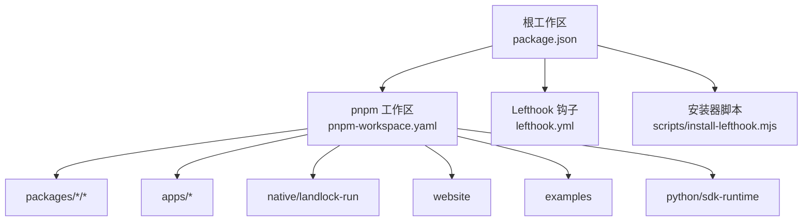
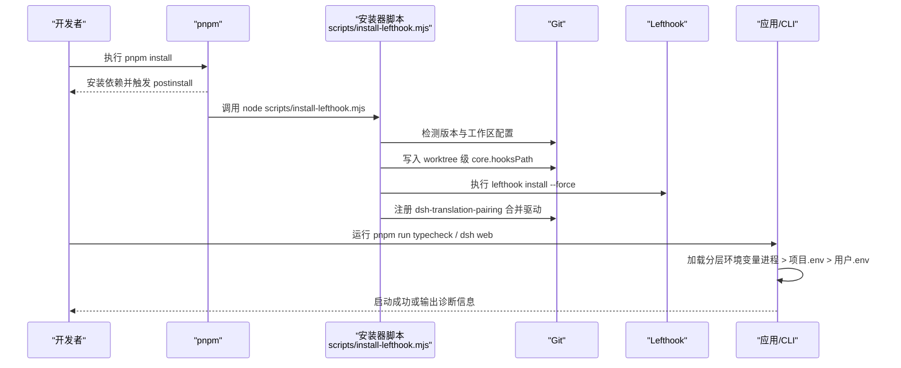
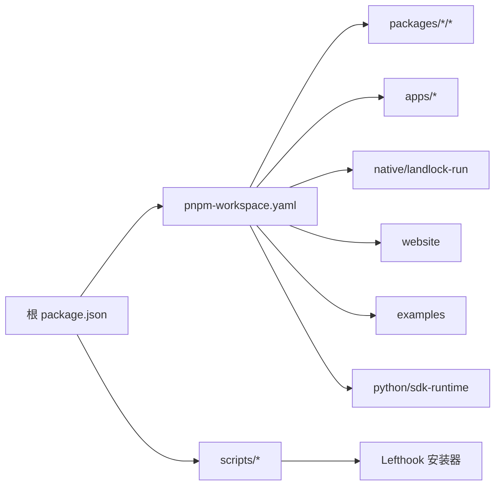

# 开发环境设置

<cite>
**本文引用的文件**
- [package.json](file://package.json)
- [pnpm-workspace.yaml](file://pnpm-workspace.yaml)
- [lefthook.yml](file://lefthook.yml)
- [scripts/install-lefthook.mjs](file://scripts/install-lefthook.mjs)
- [docs/development.md](file://docs/development.md)
- [README.md](file://README.md)
- [packages/boot/app-boot/src/index.ts](file://packages/boot/app-boot/src/index.ts)
- [packages/util/launch-environment/README.md](file://packages/util/launch-environment/README.md)
- [packages/util/launch-environment/src/index.ts](file://packages/util/launch-environment/src/index.ts)
- [packages/credentials/credentials-local/src/index.ts](file://packages/credentials/credentials-local/src/index.ts)
- [packages/llm/llm/src/index.ts](file://packages/llm/llm/src/index.ts)
- [scripts/publish-npm-baseline.ts](file://scripts/publish-npm-baseline.ts)
</cite>

## 目录
1. [简介](#简介)
2. [项目结构](#项目结构)
3. [核心组件](#核心组件)
4. [架构总览](#架构总览)
5. [详细组件分析](#详细组件分析)
6. [依赖关系分析](#依赖关系分析)
7. [性能注意事项](#性能注意事项)
8. [故障排除指南](#故障排除指南)
9. [结论](#结论)
10. [附录](#附录)

## 简介
本指南面向首次参与 DeepSeek Harness（dsh）开发的工程师，提供从零开始的环境搭建、依赖安装、Git 钩子与合并驱动配置、环境变量设置、验证步骤与常见问题排查。内容基于仓库中的工程化脚本与文档，确保每一步均可在本地复现。

## 项目结构
- 根工作区使用 pnpm workspace，统一管理 packages、apps、native、website、examples 等成员。
- Node.js 引擎要求为 22.19+ 或 24+；包管理器通过 packageManager 字段锁定 pnpm@11.7.0。
- 构建与脚本集中在根 package.json 的 scripts 中，postinstall 会自动安装 Lefthook 并配置 Git hooks。
- 开发文档 docs/development.md 提供了前置条件、首次安装、类型检查与环境变量说明。

图表来源
- [package.json:1-18](file://package.json#L1-L18)
- [pnpm-workspace.yaml:1-22](file://pnpm-workspace.yaml#L1-L22)

章节来源
- [package.json:1-18](file://package.json#L1-L18)
- [pnpm-workspace.yaml:1-22](file://pnpm-workspace.yaml#L1-L22)
- [docs/development.md:9-30](file://docs/development.md#L9-L30)
- [README.md:25-35](file://README.md#L25-L35)

## 核心组件
- 包管理与工作区：pnpm workspace 定义所有成员与覆盖规则，允许构建脚本与依赖解析。
- 钩子与合并驱动：Lefthook 负责提交前快速校验；安装器脚本自动配置 worktree 级别的 Git hooks 与翻译配对合并驱动。
- 启动环境与凭据：应用启动时按“进程继承 > 项目 .env > 用户 .env”的顺序加载环境变量，并对敏感/引导类变量进行保护；凭据通过 credentials-local 分层管理。
- 开发与运行脚本：根 scripts 提供 build、typecheck、lint、测试、演示命令等。

章节来源
- [pnpm-workspace.yaml:23-73](file://pnpm-workspace.yaml#L23-L73)
- [lefthook.yml:1-56](file://lefthook.yml#L1-L56)
- [scripts/install-lefthook.mjs:19-42](file://scripts/install-lefthook.mjs#L19-L42)
- [packages/boot/app-boot/src/index.ts:92-128](file://packages/boot/app-boot/src/index.ts#L92-L128)
- [packages/util/launch-environment/README.md:1-19](file://packages/util/launch-environment/README.md#L1-L19)
- [packages/credentials/credentials-local/src/index.ts:1-28](file://packages/credentials/credentials-local/src/index.ts#L1-L28)

## 架构总览
下图展示了从克隆仓库到可运行的完整流程，包括依赖安装、Lefthook 安装、Git 合并驱动配置、类型检查与环境变量注入。

图表来源
- [package.json:19-142](file://package.json#L19-L142)
- [scripts/install-lefthook.mjs:691-794](file://scripts/install-lefthook.mjs#L691-L794)
- [docs/development.md:16-38](file://docs/development.md#L16-L38)
- [packages/boot/app-boot/src/index.ts:166-191](file://packages/boot/app-boot/src/index.ts#L166-L191)

## 详细组件分析

### 前置要求与环境初始化
- Node.js：支持 22.19+ 与 24+；CI 覆盖 22.19、24、26。
- Corepack + pnpm：仓库通过 packageManager 锁定 pnpm@11.7.0；若 pnpm 未通过 Corepack 解析，请先启用 Corepack。
- Git：需要 2.26+，以便启用 worktree 级别配置扩展与本地 hooks。
- 可选：DeepSeek API 密钥用于 Web、headless、ACP 自动化演示与真实 API e2e 测试。

首次安装步骤
- 进入仓库根目录执行 pnpm install。
- 安装完成后会触发 postinstall，自动安装 Lefthook 并配置 worktree 级别的 Git hooks 与翻译配对合并驱动。
- 如果因缓存恢复或跳过 postinstall 导致集成缺失，可手动运行 node scripts/install-lefthook.mjs。
- 首次克隆后执行一次 pnpm run typecheck，成功后表示环境就绪。

章节来源
- [docs/development.md:9-38](file://docs/development.md#L9-L38)
- [package.json:7-10](file://package.json#L7-L10)
- [scripts/install-lefthook.mjs:233-244](file://scripts/install-lefthook.mjs#L233-L244)

### 依赖安装过程
- 工作区成员由 pnpm-workspace.yaml 声明，包含 vendor、packages、apps、native、website、examples、python/sdk-runtime。
- 允许构建的依赖通过 allowBuilds 白名单控制，避免未知生命周期脚本带来的风险。
- 部分依赖通过 patches 修复（如 node-pty）。

章节来源
- [pnpm-workspace.yaml:1-22](file://pnpm-workspace.yaml#L1-L22)
- [pnpm-workspace.yaml:35-73](file://pnpm-workspace.yaml#L35-L73)

### Lefthook 钩子配置
- pre-commit：校验翻译配对记录、归档代理笔记、对暂存代码执行 Oxlint 修复、再生成第三方通知、空白字符检查、供应商清单守卫。
- pre-merge-commit：在创建自动合并提交前再次校验翻译配对记录与归档笔记。
- pre-push：执行类型检查，确保 Host 库阶段完成后再进行客户端 TypeScript 检查。

章节来源
- [lefthook.yml:5-56](file://lefthook.yml#L5-L56)

### Git 合并驱动设置
- 安装器脚本会在 worktree 配置中注册名为 dsh-translation-pairing 的合并驱动，用于处理双语翻译记录的冲突合并。
- 安装前会探测 Node/tsx 驱动入口可用性；若后续不可用，Git 会保留普通文本结果并提示恢复路径。
- 若 pre-merge-commit 拒绝合并，Git 会将完整结果暂存但不创建提交，修复后可继续提交或中止合并。

章节来源
- [scripts/install-lefthook.mjs:30-42](file://scripts/install-lefthook.mjs#L30-L42)
- [scripts/install-lefthook.mjs:611-689](file://scripts/install-lefthook.mjs#L611-L689)
- [docs/development.md:101-113](file://docs/development.md#L101-L113)

### 环境变量配置方法
- 环境变量加载顺序（从高到低信任度）：
  - 进程继承环境（最高优先级，只读）
  - 调用目录下的 .env（项目层）
  - $DSH_HOME/.env（用户层）
- 受保护的引导类变量（如 PATH、NODE_OPTIONS、SSL_*、代理相关、DSH_*、XDG_* 等）仅能来自继承环境，禁止从 .env 设置。
- 凭据（API 密钥）建议通过以下方式之一提供：
  - 进程导出：DEEPSEEK_API_KEY=sk-...
  - 项目根 .env：DEEPSEEK_API_KEY=sk-...（不提交真实密钥）
  - 用户层 $DSH_HOME/.env：作为默认值，但会被更高优先级覆盖
- 可选：DEEPSEEK_BASE_URL 指定 API 端点，默认为公开地址。

章节来源
- [packages/util/launch-environment/README.md:7-13](file://packages/util/launch-environment/README.md#L7-L13)
- [packages/util/launch-environment/src/index.ts:11-29](file://packages/util/launch-environment/src/index.ts#L11-L29)
- [packages/boot/app-boot/src/index.ts:92-128](file://packages/boot/app-boot/src/index.ts#L92-L128)
- [packages/boot/app-boot/src/index.ts:166-191](file://packages/boot/app-boot/src/index.ts#L166-L191)
- [docs/development.md:90-99](file://docs/development.md#L90-L99)
- [packages/credentials/credentials-local/src/index.ts:1-28](file://packages/credentials/credentials-local/src/index.ts#L1-L28)
- [packages/llm/llm/src/index.ts:119-143](file://packages/llm/llm/src/index.ts#L119-L143)

### 验证环境正确性
- 执行 pnpm run typecheck，若成功则表明环境已就绪。
- 如需运行 Web UI，请确保已构建并设置必要的 API 密钥。
- 可通过演示命令验证关键能力：
  - Headless 编码演示：pnpm dsh --profile headless "summarize this workspace"
  - Cordis 自引用演示：pnpm run demo:cordis
  - ACP 自动化服务器：pnpm run demo:acp

章节来源
- [docs/development.md:34-40](file://docs/development.md#L34-L40)
- [docs/development.md:127-151](file://docs/development.md#L127-L151)
- [README.md:25-35](file://README.md#L25-L35)

## 依赖关系分析
- 工作区成员与构建约束：
  - 工作区成员包括 vendor、packages、apps、native、website、examples、python/sdk-runtime。
  - peerDependencyRules 限制 TypeScript 范围，保证兼容性。
  - allowBuilds 白名单仅允许必要依赖的生命周期脚本。
- 外部依赖与补丁：
  - node-pty 通过 patches 进行修复。
  - 某些依赖被显式禁用生命周期脚本以避免不必要的构建。

图表来源
- [pnpm-workspace.yaml:1-22](file://pnpm-workspace.yaml#L1-L22)
- [pnpm-workspace.yaml:27-73](file://pnpm-workspace.yaml#L27-L73)
- [package.json:19-142](file://package.json#L19-L142)

章节来源
- [pnpm-workspace.yaml:23-73](file://pnpm-workspace.yaml#L23-L73)
- [package.json:19-142](file://package.json#L19-L142)

## 性能注意事项
- 本地钩子保持轻量：pre-commit 仅对暂存文件执行快速检查，完整仓库级门禁由 CI 承担。
- 构建产物按需生成：只有当检查消费构建输出时才需先执行 pnpm run build。
- 类型检查与契约生成：Host 构建阶段会生成 Typert 契约，Client 阶段再执行类型检查，避免重复工作。

章节来源
- [docs/development.md:107-117](file://docs/development.md#L107-L117)
- [docs/development.md:64-88](file://docs/development.md#L64-L88)

## 故障排除指南
- 缓存恢复后缺少钩子或合并驱动：
  - 手动运行 node scripts/install-lefthook.mjs 重新安装 Lefthook 并配置合并驱动。
- 工作树移动后的重新配置：
  - 移动检出目录后，重新运行安装器以生成受管 hooks 路径。
- Git 配置冲突：
  - 若安装器拒绝现有 Git 配置或报告锁过期，遵循其诊断信息与链接的 Agent Note，不要盲目编辑 worktree 元数据。
- 合并驱动不可用：
  - 若 Node/tsx 驱动入口不可用，Git 会保留普通文本结果并提示恢复路径；恢复依赖后运行 resolve-translation-pairing-conflicts 或中止合并。
- 环境变量被拒绝：
  - 若 .env 设置了受保护的引导类变量（如 PATH、NODE_OPTIONS、DSH_*、代理相关），启动将失败；请将此类变量放入进程环境而非 .env。
- 凭据问题：
  - 确保 DEEPSEEK_API_KEY 已正确设置；适配器会对密钥进行格式校验，错误时会给出明确诊断。

章节来源
- [docs/development.md:24-32](file://docs/development.md#L24-L32)
- [docs/development.md:101-113](file://docs/development.md#L101-L113)
- [packages/boot/app-boot/src/index.ts:92-128](file://packages/boot/app-boot/src/index.ts#L92-L128)
- [packages/llm/llm/src/index.ts:119-143](file://packages/llm/llm/src/index.ts#L119-L143)

## 结论
通过遵循本指南的前置要求、安装步骤、钩子与合并驱动配置、环境变量设置以及验证与排障流程，你可以快速搭建稳定可靠的 DeepSeek Harness 开发环境。建议在每次切换分支或移动工作树后重新运行安装器，以确保 hooks 与合并驱动处于最新状态。

## 附录
- 常用命令速查：
  - 安装依赖：pnpm install
  - 类型检查：pnpm run typecheck
  - 构建：pnpm run build
  - 运行 Web：pnpm dsh web
  - 演示命令：pnpm run demo:cordis / pnpm run demo:acp
- 环境变量示例：
  - DEEPSEEK_API_KEY=sk-...
  - DEEPSEEK_BASE_URL=https://...（可选）

章节来源
- [docs/development.md:16-38](file://docs/development.md#L16-L38)
- [docs/development.md:90-99](file://docs/development.md#L90-L99)
- [docs/development.md:127-151](file://docs/development.md#L127-L151)
- [README.md:25-35](file://README.md#L25-L35)