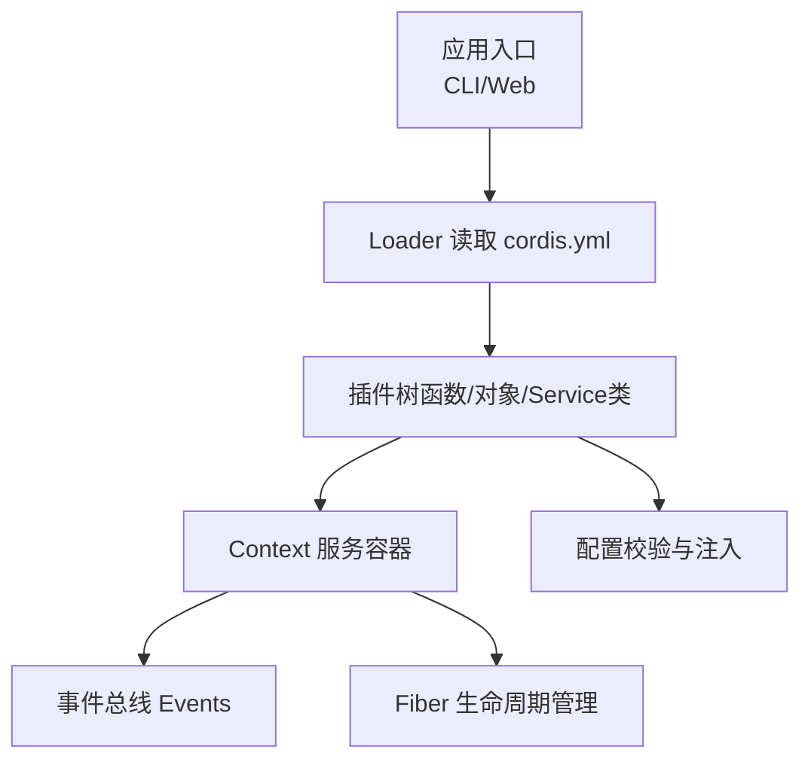
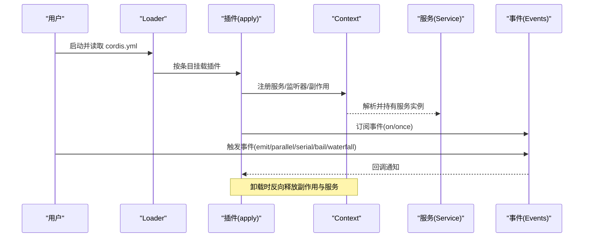
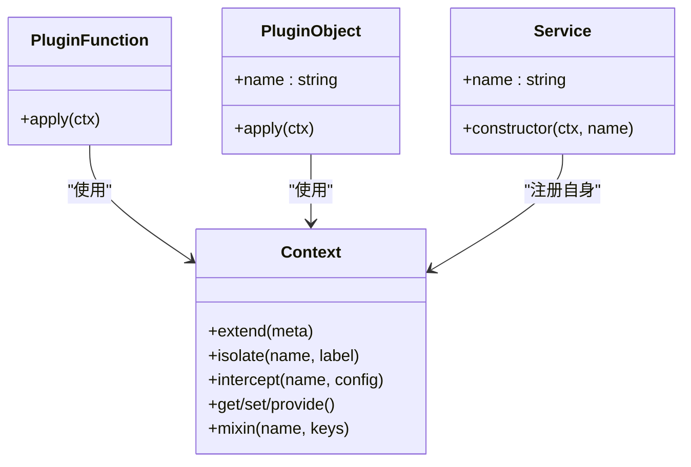
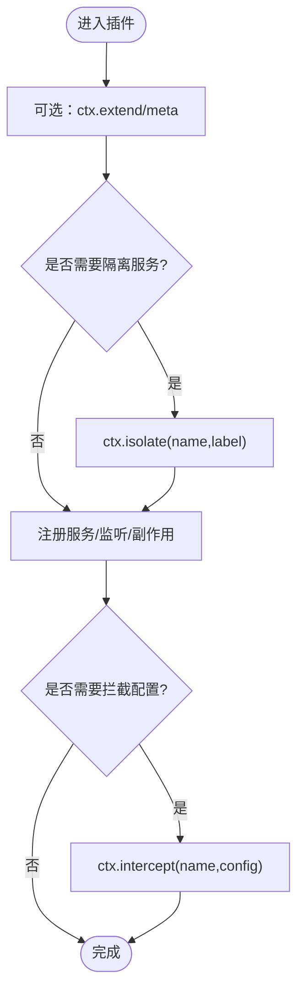
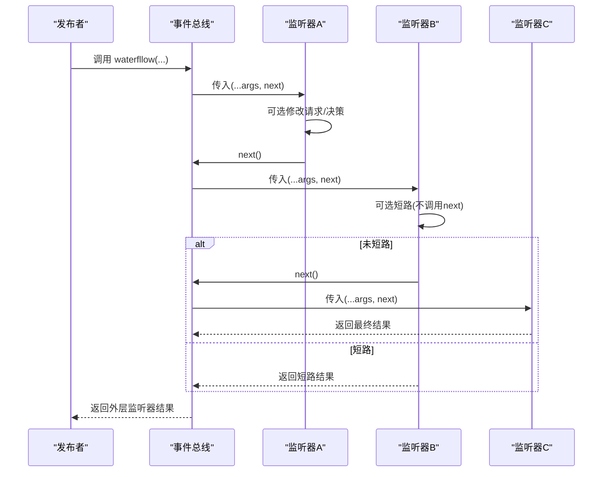
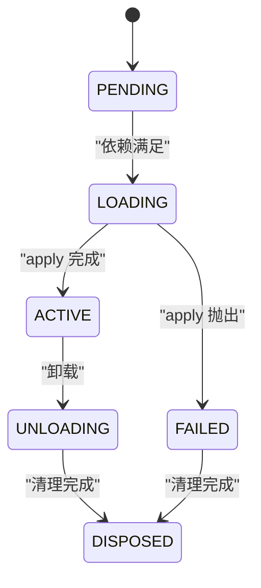
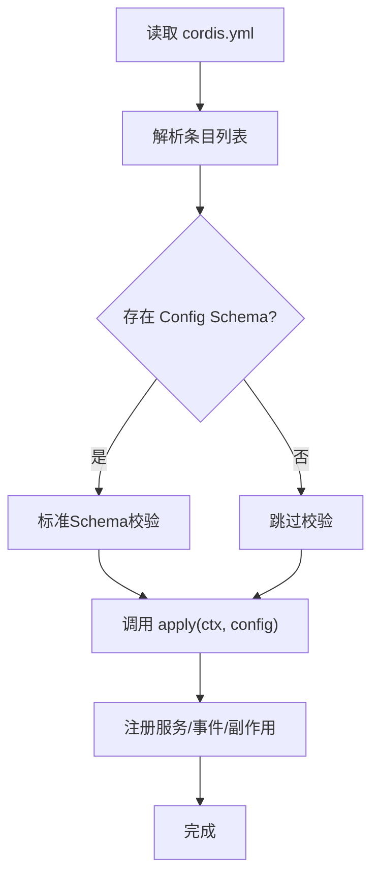

# Cordis框架基础

<cite>
**本文引用的文件**
- [cordis-primer.md](file://docs/cordis-primer.md)
- [01-first-plugin.md](file://docs/cordis-tutorial/01-first-plugin.md)
- [02-lifecycle-and-effects.md](file://docs/cordis-tutorial/02-lifecycle-and-effects.md)
- [03-services.md](file://docs/cordis-tutorial/03-services.md)
- [05-config.md](file://docs/cordis-tutorial/05-config.md)
- [06-composition-and-hmr.md](file://docs/cordis-tutorial/06-composition-and-hmr.md)
- [context.md](file://docs/cordis-api/context.md)
- [events.md](file://docs/cordis-api/events.md)
- [fiber.zh.md](file://docs/cordis-api/fiber.zh.md)
- [service.md](file://docs/cordis-api/service.md)
- [index.ts](file://packages/boot/app-boot/src/index.ts)
- [headless-agent cordis.yml](file://examples/headless-agent/cordis.yml)
- [web-cordis cordis.yml](file://examples/web-cordis/cordis.yml)
</cite>

## 目录
1. [简介](#简介)
2. [项目结构](#项目结构)
3. [核心组件](#核心组件)
4. [架构总览](#架构总览)
5. [详细组件分析](#详细组件分析)
6. [依赖关系分析](#依赖关系分析)
7. [性能考量](#性能考量)
8. [故障排查指南](#故障排查指南)
9. [结论](#结论)
10. [附录：第一个插件示例](#附录第一个插件示例)

## 简介
Cordis 是 DeepSeek Harness 内置的插件化运行时。它通过“上下文（Context）”组织服务、事件与生命周期，让插件以声明式方式组合应用。理解以下五个要点即可快速上手：
- 插件可以是函数、对象或继承自 Service 的类；它们通过 Context 注册能力。
- Context 是服务的容器与代理，支持扩展、隔离与拦截，形成可组合的作用域。
- 插件通过 inject 声明依赖，加载顺序由依赖决定而非配置文件位置。
- 事件提供 emit、parallel、serial、bail、waterfall 等分发模式，用于解耦通信与策略拦截。
- 所有注册都是可逆的“副作用”，卸载时自动回滚，便于热重载与清理。

本节为概念性介绍，不直接分析具体代码文件。

## 项目结构
本仓库将 Cordis 的基础文档与教程集中在 docs/cordis-* 目录下，并通过 examples 中的 cordis.yml 展示真实配置组合。核心参考包括：
- 入门与教程：docs/cordis-primer.md、docs/cordis-tutorial/*
- API 参考：docs/cordis-api/{context,events,fiber,service}.md
- 示例配置：examples/headless-agent/cordis.yml、examples/web-cordis/cordis.yml



图表来源
- [01-first-plugin.md:23-51](file://docs/cordis-tutorial/01-first-plugin.md#L23-L51)
- [06-composition-and-hmr.md:7-21](file://docs/cordis-tutorial/06-composition-and-hmr.md#L7-L21)
- [headless-agent cordis.yml:1-166](file://examples/headless-agent/cordis.yml#L1-L166)

章节来源
- [01-first-plugin.md:23-51](file://docs/cordis-tutorial/01-first-plugin.md#L23-L51)
- [06-composition-and-hmr.md:7-21](file://docs/cordis-tutorial/06-composition-and-hmr.md#L7-L21)
- [headless-agent cordis.yml:1-166](file://examples/headless-agent/cordis.yml#L1-L166)

## 核心组件
- 插件（Plugin）
  - 三种形式：函数插件、对象插件、Service 类插件。函数插件最常见；对象插件适合附带 name 等元信息；Service 类插件在需要暴露稳定 ctx.<name> 时使用。
- 上下文（Context）
  - 服务注册与解析、作用域扩展（extend）、服务隔离（isolate）、配置拦截（intercept）。
- 事件（Events）
  - 多种分发模式：emit（同步广播）、parallel（并发等待）、serial（串行直到 bail）、bail（同步短路）、waterfall（中间件式 next 链）。
- 纤维（Fiber）
  - 插件实例的生命周期状态机：PENDING → LOADING → ACTIVE → UNLOADING → DISPOSED，失败路径进入 FAILED。
- 服务（Service）
  - 基类，构造函数中向 Context 注册自身，随 Fiber 生命周期自动注销。

章节来源
- [01-first-plugin.md:53-77](file://docs/cordis-tutorial/01-first-plugin.md#L53-L77)
- [context.md:14-96](file://docs/cordis-api/context.md#L14-L96)
- [events.md:8-123](file://docs/cordis-api/events.md#L8-L123)
- [fiber.zh.md:333-378](file://docs/cordis-api/fiber.zh.md#L333-L378)
- [service.md:4-103](file://docs/cordis-api/service.md#L4-L103)

## 架构总览
下图展示了从配置到插件运行、再到服务与事件的交互流程。



图表来源
- [01-first-plugin.md:23-51](file://docs/cordis-tutorial/01-first-plugin.md#L23-L51)
- [03-services.md:7-42](file://docs/cordis-tutorial/03-services.md#L7-L42)
- [events.md:8-123](file://docs/cordis-api/events.md#L8-L123)
- [02-lifecycle-and-effects.md:84-94](file://docs/cordis-tutorial/02-lifecycle-and-effects.md#L84-L94)

## 详细组件分析

### 插件系统：三种形式与使用场景
- 函数插件
  - 最简形式，导出 apply(ctx)，适合只做一次性注册或轻量逻辑。
- 对象插件
  - 导出 { name, apply }，name 用于诊断显示，便于区分多个插件。
- 服务类插件
  - 继承 Service，在构造函数中调用 super(ctx, 'serviceName') 注册到 Context；适用于需要对外暴露稳定 API 的能力。



图表来源
- [01-first-plugin.md:53-77](file://docs/cordis-tutorial/01-first-plugin.md#L53-L77)
- [service.md:4-103](file://docs/cordis-api/service.md#L4-L103)
- [context.md:14-96](file://docs/cordis-api/context.md#L14-L96)

章节来源
- [01-first-plugin.md:53-77](file://docs/cordis-tutorial/01-first-plugin.md#L53-L77)
- [service.md:4-103](file://docs/cordis-api/service.md#L4-L103)

### Context 对象与作用域管理
- 作用域扩展：ctx.extend(meta) 创建子上下文，叠加元数据而不影响父上下文。
- 服务隔离：ctx.isolate(name, label) 为指定服务名创建独立作用域，便于多实现并存。
- 配置拦截：ctx.intercept(name, config) 为下游插件合并服务配置，实现覆盖与补丁。
- 服务存取：ctx.get/set/provide/mixin 构成服务注册与访问的核心接口。



图表来源
- [context.md:14-96](file://docs/cordis-api/context.md#L14-L96)

章节来源
- [context.md:14-96](file://docs/cordis-api/context.md#L14-L96)

### 事件系统与分发模式
- emit：同步广播，忽略返回值。
- parallel：并行执行所有监听器，全部完成后返回。
- serial：按序执行监听器，遇到首个“退出值”即停止。
- bail：同步短路，遇到首个非空返回值即停止。
- waterfall：中间件风格，最后一个参数为 next，允许包装与短路。



图表来源
- [events.md:97-123](file://docs/cordis-api/events.md#L97-L123)

章节来源
- [events.md:8-123](file://docs/cordis-api/events.md#L8-L123)

### 生命周期与副作用管理（Fiber）
- 状态机：PENDING → LOADING → ACTIVE → UNLOADING → DISPOSED；异常进入 FAILED。
- 副作用：通过 ctx.effect() 注册的资源会在卸载时按逆序释放；已管理的注册（如 on、plugin、服务）自带副作用语义。
- 依赖驱动加载：inject 列出的服务就绪后才进入 ACTIVE，缺失则保持 PENDING。



图表来源
- [02-lifecycle-and-effects.md:68-82](file://docs/cordis-tutorial/02-lifecycle-and-effects.md#L68-L82)
- [fiber.zh.md:333-378](file://docs/cordis-api/fiber.zh.md#L333-L378)

章节来源
- [02-lifecycle-and-effects.md:68-94](file://docs/cordis-tutorial/02-lifecycle-and-effects.md#L68-L94)
- [fiber.zh.md:333-378](file://docs/cordis-api/fiber.zh.md#L333-L378)

### 配置与加载机制（cordis.yml）
- 条目（Entry）：包含 id、name、config、disabled 等元数据；id 用于稳定标识，便于 HMR 增量更新。
- 配置校验：插件可导出 Config Schema，加载时校验，错误会中止并报告精确问题。
- 动态计算：config 内可使用 !!js 表达式在加载期计算；disabled 也可在挂载决策时基于 loader 上下文计算。
- 组合与覆盖：通过 id 定位条目进行 patch/overlay，替换或合并配置。



图表来源
- [05-config.md:1-85](file://docs/cordis-tutorial/05-config.md#L1-L85)
- [06-composition-and-hmr.md:7-21](file://docs/cordis-tutorial/06-composition-and-hmr.md#L7-L21)

章节来源
- [05-config.md:1-85](file://docs/cordis-tutorial/05-config.md#L1-L85)
- [06-composition-and-hmr.md:7-21](file://docs/cordis-tutorial/06-composition-and-hmr.md#L7-L21)

## 依赖关系分析
- 插件之间通过 Context 服务名解耦，避免硬编码导入；加载顺序由 inject 声明的依赖决定。
- 事件作为横切关注点，被多个插件订阅，实现策略拦截与扩展。
- Fiber 统一管理插件实例的生命周期，确保副作用有序释放。

```mermaid
graph LR
A["插件A(Service)"] --> |提供| S["服务'serviceX'"]
B["插件B(函数)"] --> |inject: ['serviceX']| S
C["插件C(对象)"] --> |on('eventY')| E["事件总线"]
D["插件D"] --> |emit('eventY')| E
```

图表来源
- [03-services.md:44-79](file://docs/cordis-tutorial/03-services.md#L44-L79)
- [events.md:8-123](file://docs/cordis-api/events.md#L8-L123)

章节来源
- [03-services.md:44-79](file://docs/cordis-tutorial/03-services.md#L44-L79)
- [events.md:8-123](file://docs/cordis-api/events.md#L8-L123)

## 性能考量
- 事件选择：高吞吐且互不影响的场景优先 parallel；需要顺序控制或短路决策使用 serial/bail；需要中间件式包装使用 waterfall。
- 副作用最小化：仅在 effect 中持有外部资源，避免长生命周期全局变量。
- 依赖粒度：尽量细粒度拆分服务，减少不必要的重装载范围。
- 配置校验前置：尽早失败，避免半配置运行带来的隐性开销。

本节为通用指导，不直接分析具体代码文件。

## 故障排查指南
- 插件无法解析或模块路径错误：启动时会记录日志并在审计阶段汇总报错。
- 插件激活失败：格式化原始错误栈并上报，便于定位。
- 插件处于 PENDING：检查 inject 依赖是否被提供；可通过遍历 registry 查看 fiber 状态。
- 配置校验失败：根据 ValidationError 提示修正 schema 或输入。

章节来源
- [index.ts:651-678](file://packages/boot/app-boot/src/index.ts#L651-L678)
- [06-composition-and-hmr.md:61-109](file://docs/cordis-tutorial/06-composition-and-hmr.md#L61-L109)
- [fiber.zh.md:333-378](file://docs/cordis-api/fiber.zh.md#L333-L378)

## 结论
Cordis 通过 Context 统一管理服务、事件与生命周期，使插件以声明式方式组合应用。掌握三种插件形式、事件分发模式、Fiber 状态机与配置校验后，开发者可以快速构建可扩展、可热重载、易维护的系统。

本节为总结性内容，不直接分析具体代码文件。

## 附录：第一个插件示例
下面给出从零开始创建、配置并运行一个插件的步骤概览（不含代码片段，仅列出关键步骤与对应文档位置）：
- 编写插件
  - 创建一个导出 name 与 apply(ctx) 的模块。
  - 参考：[01-first-plugin.md:7-21](file://docs/cordis-tutorial/01-first-plugin.md#L7-L21)
- 组合应用
  - 在 cordis.yml 中添加一条 name 指向该模块的条目。
  - 参考：[01-first-plugin.md:23-31](file://docs/cordis-tutorial/01-first-plugin.md#L23-L31)
- 运行
  - 使用 CLI 启动 Cordis 并观察输出。
  - 参考：[01-first-plugin.md:33-51](file://docs/cordis-tutorial/01-first-plugin.md#L33-L51)
- 进阶：带配置的插件
  - 导出 Config Schema，并在 cordis.yml 中提供 config。
  - 参考：[05-config.md:7-51](file://docs/cordis-tutorial/05-config.md#L7-L51)
- 进阶：服务与依赖
  - 使用 Service 类暴露 ctx.<name>，并通过 inject 声明依赖。
  - 参考：[03-services.md:7-42](file://docs/cordis-tutorial/03-services.md#L7-L42)
- 调试：查看 Fiber 状态
  - 遍历 registry 并打印 PENDING 的插件，定位缺失依赖。
  - 参考：[06-composition-and-hmr.md:61-109](file://docs/cordis-tutorial/06-composition-and-hmr.md#L61-L109)

章节来源
- [01-first-plugin.md:7-51](file://docs/cordis-tutorial/01-first-plugin.md#L7-L51)
- [05-config.md:7-51](file://docs/cordis-tutorial/05-config.md#L7-L51)
- [03-services.md:7-42](file://docs/cordis-tutorial/03-services.md#L7-L42)
- [06-composition-and-hmr.md:61-109](file://docs/cordis-tutorial/06-composition-and-hmr.md#L61-L109)