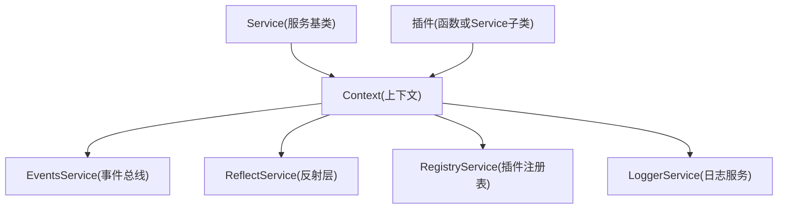
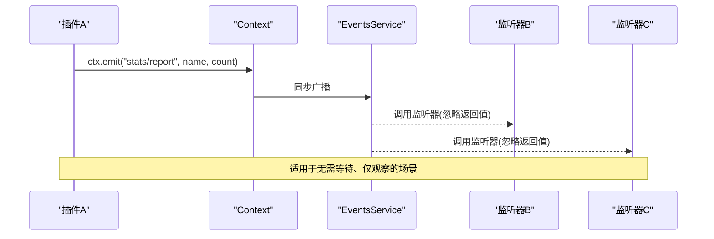
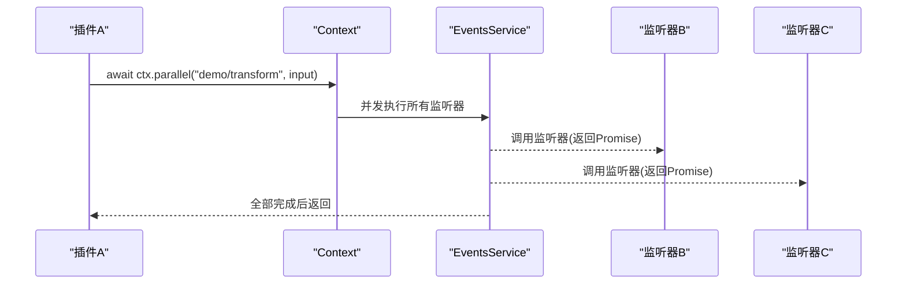
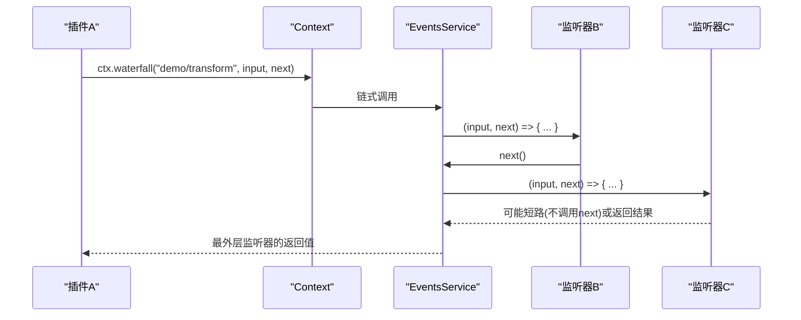
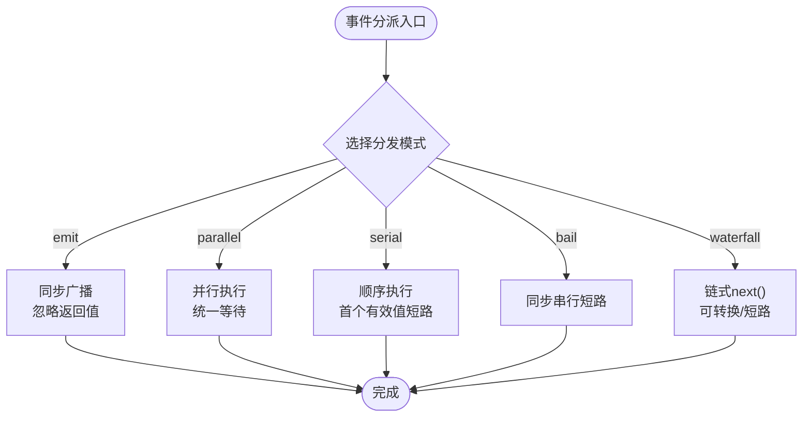
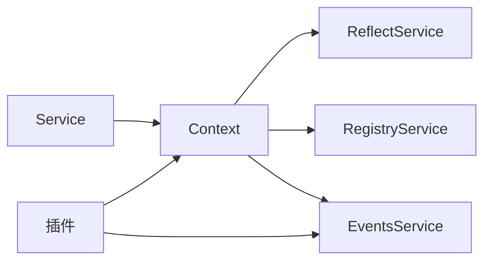

# 事件系统与上下文

<cite>
**本文引用的文件**
- [docs/cordis-api/context.md](file://docs/cordis-api/context.md)
- [docs/cordis-api/events.md](file://docs/cordis-api/events.md)
- [docs/cordis-api/service.md](file://docs/cordis-api/service.md)
- [docs/cordis-tutorial/04-events.md](file://docs/cordis-tutorial/04-events.md)
- [docs/event-producer-consumer.md](file://docs/event-producer-consumer.md)
- [docs/cordis-primer.md](file://docs/cordis-primer.md)
</cite>

## 目录
1. [简介](#简介)
2. [项目结构](#项目结构)
3. [核心组件](#核心组件)
4. [架构总览](#架构总览)
5. [详细组件分析](#详细组件分析)
6. [依赖关系分析](#依赖关系分析)
7. [性能考量](#性能考量)
8. [故障排除指南](#故障排除指南)
9. [结论](#结论)
10. [附录](#附录)

## 简介
本文件围绕 Cordis 的事件驱动架构与上下文管理，系统阐述 Context 对象的能力、事件的发布订阅模式、事件传播机制，以及在复杂业务场景中的处理模式与状态同步方案。文档同时提供事件调试、性能监控与故障排除建议，帮助读者在 Harness 中安全、高效地构建可扩展的插件体系。

## 项目结构
Cordis 将“上下文”作为所有服务、事件与生命周期 API 的统一入口。Context 是一个代理对象：普通属性读取走服务解析器；extend/isolate/intercept 创建子上下文而不修改父上下文。事件总线通过 ctx.events 暴露，且其方法被混入到 ctx 上（如 ctx.on、ctx.emit）。服务通过 Service 基类注册为 ctx.<name>，并通过 inject 声明依赖，实现解耦与可插拔。

图表来源
- [docs/cordis-api/context.md:1-163](file://docs/cordis-api/context.md#L1-L163)
- [docs/cordis-api/service.md:1-103](file://docs/cordis-api/service.md#L1-L103)

章节来源
- [docs/cordis-api/context.md:1-163](file://docs/cordis-api/context.md#L1-L163)
- [docs/cordis-api/service.md:1-103](file://docs/cordis-api/service.md#L1-L103)

## 核心组件
- Context：应用级根上下文与子上下文的容器，提供 extend/isolate/intercept、get/set/provide/accessor/mixin 等能力，并混入事件与插件注册能力。
- EventsService：事件总线，支持 emit、parallel、serial、bail、waterfall 五种分发模式，以及 on/once 监听器注册。
- Service：服务基类，用于以稳定键名向 Context 暴露 API，生命周期由 Fiber 管理。
- ReflectService：支撑 get/set/provide/accessor/mixin 的反射层。
- RegistryService：插件加载与注入能力。

章节来源
- [docs/cordis-api/context.md:1-163](file://docs/cordis-api/context.md#L1-L163)
- [docs/cordis-api/events.md:1-208](file://docs/cordis-api/events.md#L1-L208)
- [docs/cordis-api/service.md:1-103](file://docs/cordis-api/service.md#L1-L103)

## 架构总览
Cordis 采用“上下文 + 服务 + 事件”的三层协作：
- 上下文是作用域与依赖容器，支持隔离与拦截，便于多实例或多租户场景。
- 服务通过 Service 基类注册到 Context，其他插件通过 ctx.<name> 访问，避免硬耦合。
- 事件用于跨插件通信，按事件类型约定分发模式，保证行为契约清晰。

图表来源
- [docs/cordis-api/events.md:31-49](file://docs/cordis-api/events.md#L31-L49)

图表来源
- [docs/cordis-api/events.md:8-29](file://docs/cordis-api/events.md#L8-L29)

图表来源
- [docs/cordis-api/events.md:97-123](file://docs/cordis-api/events.md#L97-L123)

## 详细组件分析

### Context 对象：属性与方法
- 扩展与隔离
  - extend(meta)：创建携带额外元数据的子上下文，不修改父上下文。
  - isolate(name, label?)：为指定服务名创建独立作用域的子上下文，便于多实现共存或测试替换。
  - intercept(name, config)：为特定服务的配置增加拦截项，供子上下文中的插件使用。
- 服务存取
  - get(name, strict?)：读取服务，strict=true 时仅返回当前活跃 Fiber 提供的实现。
  - set(name, value)：覆盖已提供的服务值，仅限提供该服务的 Fiber 设置。
  - provide(name, value)：在当前 Fiber 下注册服务，Fiber 卸载时自动注销。
  - accessor(name, options)：定义计算属性(get/set钩子)，随 Fiber 卸载移除。
  - mixin(name, mixins)：将某服务的成员直接暴露到 ctx，便于简化调用（如 ctx.on -> ctx.events.on）。
- 内置能力
  - events：事件总线，方法混入 ctx。
  - logger：命名日志服务。
  - reflect：反射层，支撑 get/set/provide/accessor/mixin。
  - registry：插件注册表，方法混入 ctx（plugin/inject）。
- 静态成员
  - effect/filter/isolate/intercept：符号键，用于内部机制（如事件过滤、隔离映射、拦截映射）。
  - is(value)：跨 Realm 判断是否为 Context。

章节来源
- [docs/cordis-api/context.md:14-163](file://docs/cordis-api/context.md#L14-L163)
- [docs/cordis-api/context.md:235-365](file://docs/cordis-api/context.md#L235-L365)

### 事件系统：发布订阅与分发模式
- 事件声明与类型安全
  - 通过 TypeScript 模块合并声明 Events 接口，使 ctx.on/ctx.emit 具备完整类型提示。
- 监听器注册
  - on(name, listener, options?)：注册监听器，支持 prepend/global 选项；返回 disposer。
  - once(name, listener, options?)：一次性监听器，首次触发后自动移除。
- 分发模式
  - emit：同步广播，忽略返回值，适合纯副作用通知。
  - parallel：并发执行所有监听器，统一等待完成。
  - serial：顺序执行，首个非空返回值短路。
  - bail：同步版 serial。
  - waterfall：中间件风格，最后一个参数为 next，可转换或短路下游。
- 事件契约
  - 每个事件的 mode 是其公开契约的一部分，应在子系统文档中标注，生成工具会校验声明与分派点的一致性。

图表来源
- [docs/cordis-api/events.md:8-123](file://docs/cordis-api/events.md#L8-L123)
- [docs/cordis-primer.md:15-35](file://docs/cordis-primer.md#L15-L35)

章节来源
- [docs/cordis-api/events.md:8-208](file://docs/cordis-api/events.md#L8-L208)
- [docs/cordis-primer.md:15-35](file://docs/cordis-primer.md#L15-L35)

### 服务与依赖注入
- Service 基类：通过 super(ctx, name) 注册为 ctx.<name>，生命周期由 Fiber 管理。
- 依赖声明：插件可通过 inject 声明所需服务，Cordis 会在依赖就绪前挂起，确保加载顺序由依赖关系表达。
- 可组合性：通过 ctx.extend/isolate/intercept 实现多实例、多环境、多租户下的服务隔离与配置覆盖。

章节来源
- [docs/cordis-api/service.md:1-103](file://docs/cordis-api/service.md#L1-L103)
- [docs/cordis-api/context.md:14-96](file://docs/cordis-api/context.md#L14-L96)

### 复杂业务场景：事件处理模式与状态同步
- 观察者模式（emit）：用于无副作用的观测与记录，如统计上报、遥测采集。
- 策略拦截（waterfall）：用于决策链，如审批、权限、重试、压缩策略等，允许上游短路或转换结果。
- 并行任务（parallel）：用于多路并发处理，如持久化与遥测同时写入。
- 有序决策（serial/bail）：用于优先级决策，首个满足条件的策略生效。
- 状态同步：通过事件驱动的状态变更，配合 session/agent 等子系统事件，实现 UI、存储、遥测等多端一致。

章节来源
- [docs/event-producer-consumer.md:1-77](file://docs/event-producer-consumer.md#L1-L77)
- [docs/cordis-tutorial/04-events.md:80-141](file://docs/cordis-tutorial/04-events.md#L80-L141)

## 依赖关系分析
- 上下文与服务：Context 通过 ReflectService 管理服务注册与解析；Service 基类负责自身生命周期。
- 事件与插件：插件通过 ctx.on/ctx.once 注册监听器，事件总线根据模式调度；事件类型由 Events 接口约束。
- 插件与注册表：RegistryService 负责插件加载与注入，结合 inject 声明实现依赖驱动启动。

图表来源
- [docs/cordis-api/context.md:120-163](file://docs/cordis-api/context.md#L120-L163)
- [docs/cordis-api/service.md:1-103](file://docs/cordis-api/service.md#L1-L103)

章节来源
- [docs/cordis-api/context.md:120-163](file://docs/cordis-api/context.md#L120-L163)
- [docs/cordis-api/service.md:1-103](file://docs/cordis-api/service.md#L1-L103)

## 性能考量
- 选择合适的分发模式
  - emit：开销最小，适合高频、无副作用的通知。
  - parallel：并发执行，注意监听器内耗时与资源竞争。
  - serial/bail：有序短路，适合优先级决策，减少不必要后续处理。
  - waterfall：中间件链，注意 next 调用与短路语义，避免遗漏导致默认行为被吞掉。
- 监听器粒度
  - 尽量保持监听器轻量，重逻辑下沉到服务方法或后台任务。
- 作用域隔离
  - 使用 isolate 隔离同名服务，避免全局冲突；使用 intercept 精细控制配置合并。
- 资源释放
  - 所有注册（监听器、effect、mixin）都应可逆，利用 Cordis 的效应机制自动清理。

[本节为通用指导，不直接分析具体文件]

## 故障排除指南
- 事件未触发
  - 检查事件名称与类型声明是否匹配；确认监听器是否正确注册（on/once），是否在正确的上下文与作用域。
  - 若使用 global 选项，确认是否确实需要绕过上下文过滤器。
- 监听器未按预期短路
  - 对于 waterfall，确认是否调用了 next；对于 serial/bail，确认返回值是否符合短路条件。
- 服务获取不到
  - 检查是否在当前 Fiber 的作用域内提供了服务；必要时使用 get(strict=false) 放宽限制。
  - 使用 isolate 隔离同名服务时，确认当前上下文是否处于正确作用域。
- 性能问题
  - 对高频事件改用 emit；对可并行的处理使用 parallel；对决策链使用 serial/bail 以减少无效处理。
- 调试技巧
  - 使用 logger 在服务与监听器中输出关键路径信息。
  - 借助事件矩阵（event-producer-consumer）定位生产者与消费者，缩小排查范围。

章节来源
- [docs/event-producer-consumer.md:1-77](file://docs/event-producer-consumer.md#L1-L77)
- [docs/cordis-api/events.md:125-187](file://docs/cordis-api/events.md#L125-L187)
- [docs/cordis-api/context.md:235-365](file://docs/cordis-api/context.md#L235-L365)

## 结论
Cordis 通过 Context 统一管理服务与事件，以清晰的契约（事件模式、服务键名、依赖声明）实现高内聚、低耦合的插件架构。合理选择事件分发模式、善用上下文隔离与拦截、遵循效应可逆原则，可在复杂业务场景中构建健壮、可维护的系统。借助事件矩阵与日志工具，可快速定位问题并进行性能优化。

[本节为总结，不直接分析具体文件]

## 附录
- 教程与实践
  - 通过教程了解如何声明事件、注册监听器、使用不同分发模式，以及 waterfall 的中间件语义。
- 事件矩阵
  - 参考事件矩阵，了解各子系统的事件生产者与消费者关系，辅助设计与排障。

章节来源
- [docs/cordis-tutorial/04-events.md:1-145](file://docs/cordis-tutorial/04-events.md#L1-L145)
- [docs/event-producer-consumer.md:1-77](file://docs/event-producer-consumer.md#L1-L77)