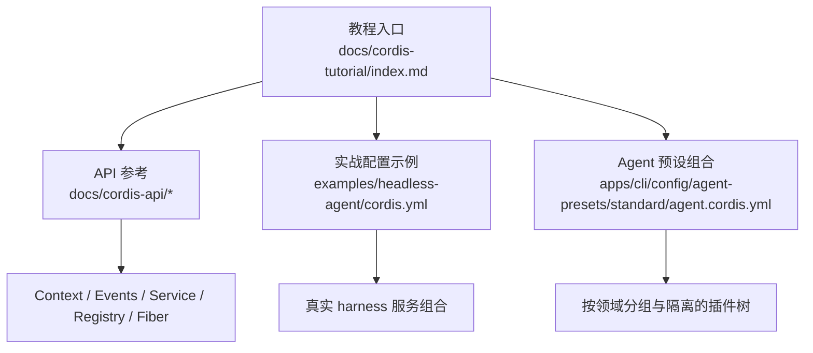
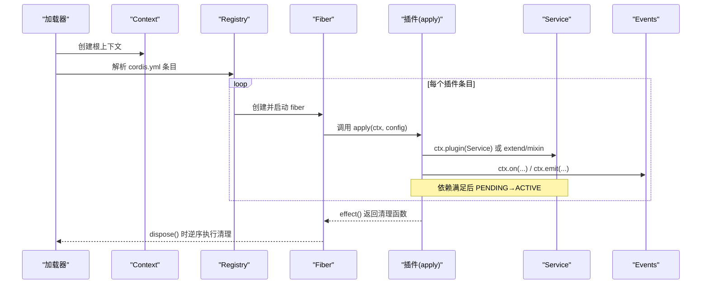
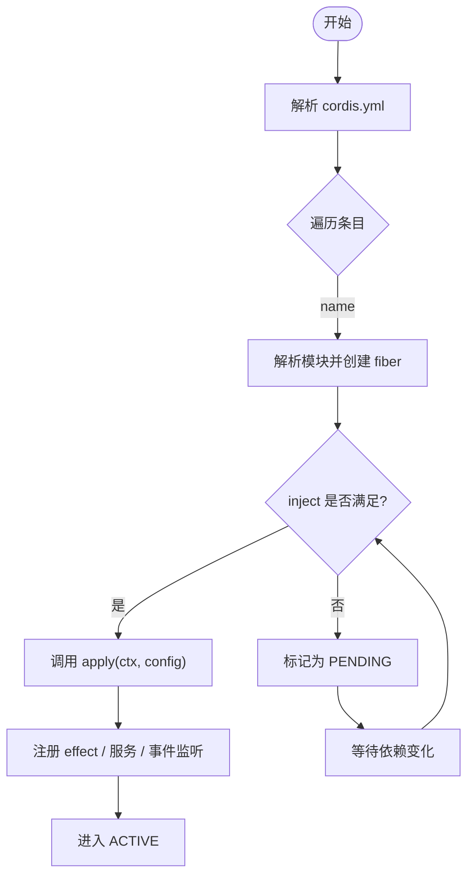
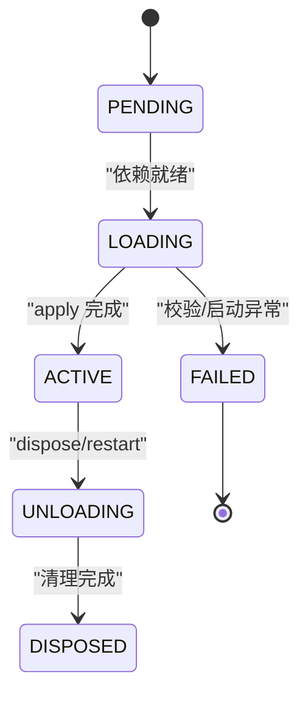
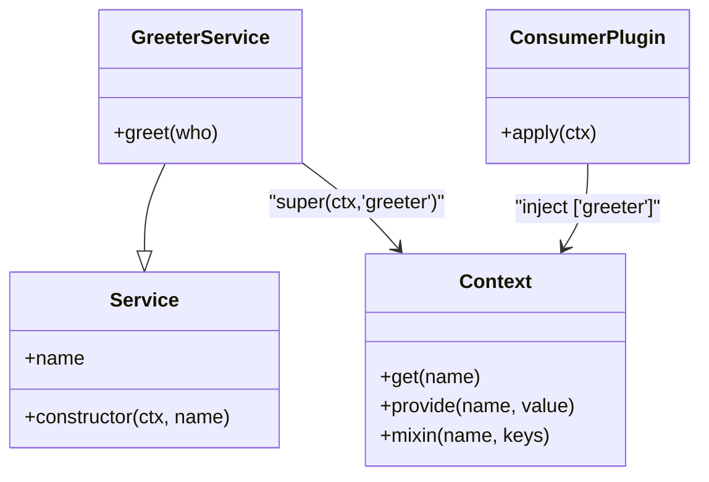
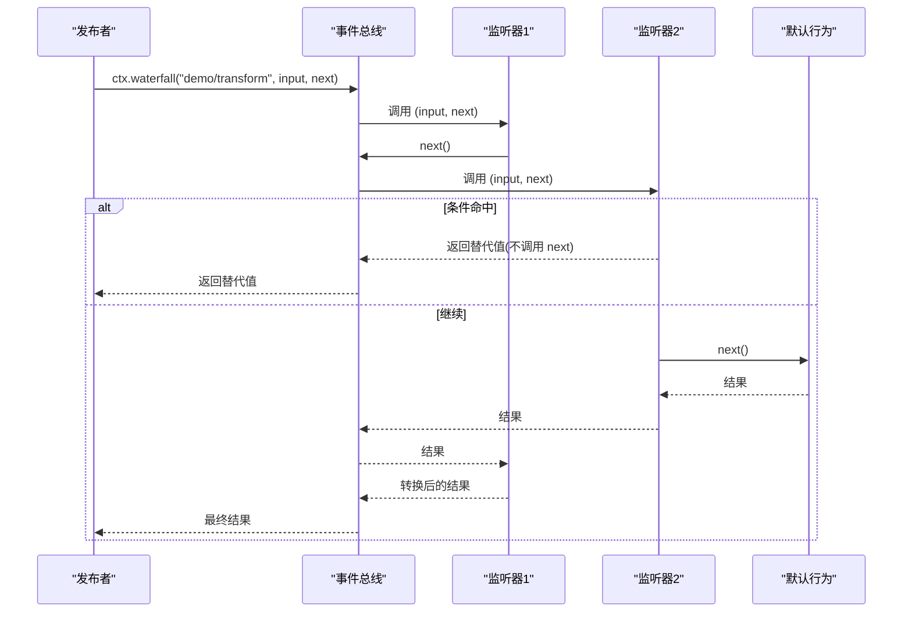
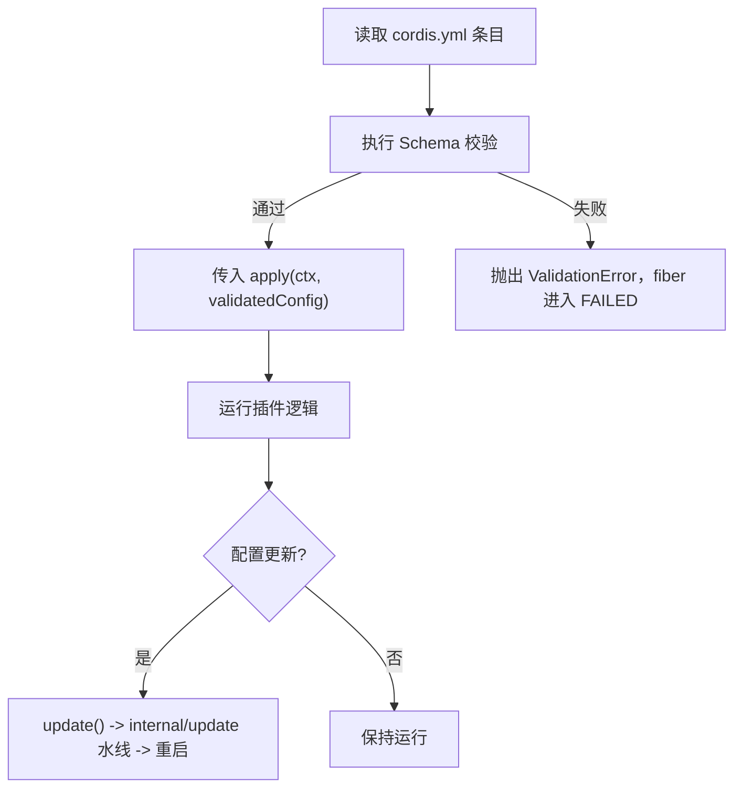
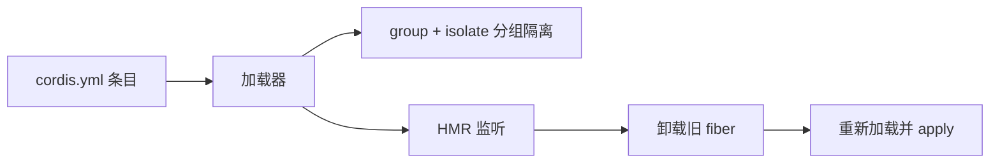
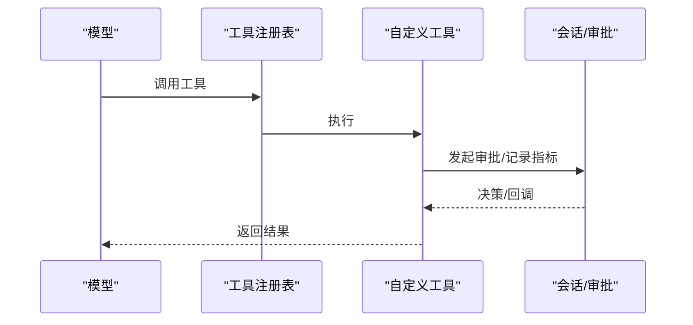
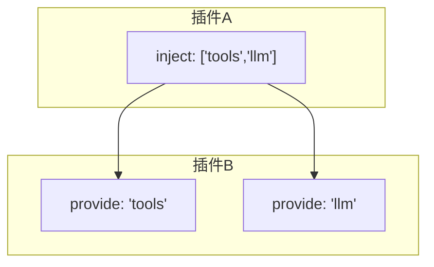

# 插件开发

<cite>
**本文引用的文件**
- [index.md](file://docs/cordis-tutorial/index.md)
- [01-first-plugin.md](file://docs/cordis-tutorial/01-first-plugin.md)
- [02-lifecycle-and-effects.md](file://docs/cordis-tutorial/02-lifecycle-and-effects.md)
- [03-services.md](file://docs/cordis-tutorial/03-services.md)
- [04-events.md](file://docs/cordis-tutorial/04-events.md)
- [05-config.md](file://docs/cordis-tutorial/05-config.md)
- [06-composition-and-hmr.md](file://docs/cordis-tutorial/06-composition-and-hmr.md)
- [context.md](file://docs/cordis-api/context.md)
- [events.md](file://docs/cordis-api/events.md)
- [service.md](file://docs/cordis-api/service.md)
- [registry.md](file://docs/cordis-api/registry.md)
- [fiber.md](file://docs/cordis-api/fiber.md)
- [agent.cordis.yml](file://apps/cli/config/agent-presets/standard/agent.cordis.yml)
- [cordis.yml](file://examples/headless-agent/cordis.yml)
</cite>

## 目录
1. [简介](#简介)
2. [项目结构](#项目结构)
3. [核心组件](#核心组件)
4. [架构总览](#架构总览)
5. [详细组件分析](#详细组件分析)
6. [依赖关系分析](#依赖关系分析)
7. [性能考虑](#性能考虑)
8. [故障排查指南](#故障排查指南)
9. [结论](#结论)
10. [附录](#附录)

## 简介
本教程面向 DeepSeek Harness 的插件开发者，基于 Cordis 框架系统讲解插件架构、生命周期管理、事件处理机制与配置体系。内容从“第一个插件”起步，逐步深入到服务注册、上下文使用、状态管理与 HMR 热重载，并给出调试、测试与性能优化策略，帮助开发者从入门到精通。

Cordis 是一个小型运行时：工具、LLM 适配器、文件系统访问、智能体循环等能力均以插件形式挂载到共享上下文中。通过 cordis.yml 组合应用，插件之间通过服务与事件协作，借助 fiber 的生命周期自动管理资源清理。

**章节来源**
- [index.md:1-47](file://docs/cordis-tutorial/index.md#L1-L47)

## 项目结构
仓库围绕 Cordis 插件生态组织：
- docs/cordis-tutorial：分步教程，覆盖从首插件到进入 harness 的完整流程
- docs/cordis-api：由脚本生成的 API 参考（Context、Events、Service、Registry、Fiber）
- apps/cli/config/agent-presets：Agent 预设的插件组合示例
- examples/headless-agent：最小可运行的 headless agent 组合配置
- vendor/cordis：Cordis 运行时与加载器（教程中通过 tsx 直接运行）

**图表来源**
- [index.md:1-47](file://docs/cordis-tutorial/index.md#L1-L47)
- [cordis.yml:1-166](file://examples/headless-agent/cordis.yml#L1-L166)
- [agent.cordis.yml:1-252](file://apps/cli/config/agent-presets/standard/agent.cordis.yml#L1-L252)

**章节来源**
- [index.md:1-47](file://docs/cordis-tutorial/index.md#L1-L47)
- [cordis.yml:1-166](file://examples/headless-agent/cordis.yml#L1-L166)
- [agent.cordis.yml:1-252](file://apps/cli/config/agent-presets/standard/agent.cordis.yml#L1-L252)

## 核心组件
- Context：插件的根对象，提供事件总线、日志、反射层、插件注册表以及服务注入/提供能力
- Fiber：每个插件实例的运行态，负责配置校验、生命周期状态机、效果收集与清理
- Service：以命名方式暴露能力的基类，支持类型扩展与拦截配置
- Events：统一的事件分发模型，支持 emit/parallel/serial/bail/waterfall 多种模式
- Registry：插件加载与依赖注入，支持函数/类/对象三种插件形态

这些组件共同构成插件的“声明式组合 + 运行时装配”的基础设施。

**章节来源**
- [context.md:1-365](file://docs/cordis-api/context.md#L1-L365)
- [fiber.md:1-376](file://docs/cordis-api/fiber.md#L1-L376)
- [service.md:1-103](file://docs/cordis-api/service.md#L1-L103)
- [events.md:1-208](file://docs/cordis-api/events.md#L1-L208)
- [registry.md:1-153](file://docs/cordis-api/registry.md#L1-L153)

## 架构总览
下图展示了插件在 Cordis 中的加载与交互路径：加载器读取 cordis.yml，解析插件条目，创建 root Context，依次挂载插件；插件通过 Service 暴露能力，通过 Events 通信，通过 inject 声明依赖，由 Fiber 管理生命周期与清理。

**图表来源**
- [registry.md:1-153](file://docs/cordis-api/registry.md#L1-L153)
- [fiber.md:1-376](file://docs/cordis-api/fiber.md#L1-L376)
- [context.md:1-365](file://docs/cordis-api/context.md#L1-L365)
- [events.md:1-208](file://docs/cordis-api/events.md#L1-L208)

## 详细组件分析

### 插件形态与加载流程
- 函数插件：导出 apply(ctx)，最常用
- 对象插件：导出 { name, apply }
- 类插件：继承 Service，构造时注册自身为服务

加载顺序不依赖 cordis.yml 中的位置，而由依赖图决定；未满足依赖的插件处于 PENDING 状态。

**图表来源**
- [registry.md:1-153](file://docs/cordis-api/registry.md#L1-L153)
- [fiber.md:1-376](file://docs/cordis-api/fiber.md#L1-L376)

**章节来源**
- [01-first-plugin.md:1-96](file://docs/cordis-tutorial/01-first-plugin.md#L1-L96)
- [registry.md:1-153](file://docs/cordis-api/registry.md#L1-L153)

### 生命周期与效果（effect）
- 所有通过 Cordis API 的注册（如 on、plugin、服务提供）都是 effect，卸载时自动撤销
- 外部资源（定时器、连接、观察者）需包裹在 ctx.effect() 中并返回清理函数
- Fiber 状态机：PENDING → LOADING → ACTIVE → UNLOADING → DISPOSED（失败分支 FAILED）

**图表来源**
- [fiber.md:1-376](file://docs/cordis-api/fiber.md#L1-L376)
- [02-lifecycle-and-effects.md:1-99](file://docs/cordis-tutorial/02-lifecycle-and-effects.md#L1-L99)

**章节来源**
- [02-lifecycle-and-effects.md:1-99](file://docs/cordis-tutorial/02-lifecycle-and-effects.md#L1-L99)
- [fiber.md:1-376](file://docs/cordis-api/fiber.md#L1-L376)

### 服务注册与依赖注入
- 通过继承 Service 并在构造函数中 super(ctx, 'name') 注册服务
- 消费者通过 inject 声明所需服务，Cordis 保证 apply 内可用
- 支持可选依赖：ctx.get('name') 获取可能不存在的服务
- 服务替换：提供者卸载/热更后，依赖者自动重启

**图表来源**
- [service.md:1-103](file://docs/cordis-api/service.md#L1-L103)
- [context.md:1-365](file://docs/cordis-api/context.md#L1-L365)
- [03-services.md:1-99](file://docs/cordis-tutorial/03-services.md#L1-L99)

**章节来源**
- [03-services.md:1-99](file://docs/cordis-tutorial/03-services.md#L1-L99)
- [service.md:1-103](file://docs/cordis-api/service.md#L1-L103)
- [context.md:1-365](file://docs/cordis-api/context.md#L1-L365)

### 事件系统与中间件式拦截
- 事件模式：emit（同步广播）、parallel（并发）、serial（串行短路）、bail（同步短路）、waterfall（中间件链）
- 通过 declare module 合并 Events 接口，获得类型安全
- waterfall 用于拦截与改写默认行为，必须显式调用 next() 才能继续

**图表来源**
- [events.md:1-208](file://docs/cordis-api/events.md#L1-L208)
- [04-events.md:1-145](file://docs/cordis-tutorial/04-events.md#L1-L145)

**章节来源**
- [04-events.md:1-145](file://docs/cordis-tutorial/04-events.md#L1-L145)
- [events.md:1-208](file://docs/cordis-api/events.md#L1-L208)

### 配置校验与动态开关
- 插件可导出 Config 描述 schema，加载时严格校验，错误即失败
- 支持 !!js 标签在 config 中计算运行时值，或控制 disabled 字段
- 配置变更可通过 update() 触发重新加载，结合 effect 实现热更新

**图表来源**
- [05-config.md:1-85](file://docs/cordis-tutorial/05-config.md#L1-L85)
- [fiber.md:1-376](file://docs/cordis-api/fiber.md#L1-L376)

**章节来源**
- [05-config.md:1-85](file://docs/cordis-tutorial/05-config.md#L1-L85)
- [fiber.md:1-376](file://docs/cordis-api/fiber.md#L1-L376)

### 组合与热重载（HMR）
- cordis.yml 是应用本身：id 稳定标识，disabled 可临时禁用
- 通过 group + isolate 实现服务隔离，避免跨组冲突
- HMR 插件监听文件变更，卸载旧 fiber 并重新加载新代码，effect 自动清理

**图表来源**
- [06-composition-and-hmr.md:1-114](file://docs/cordis-tutorial/06-composition-and-hmr.md#L1-L114)
- [agent.cordis.yml:1-252](file://apps/cli/config/agent-presets/standard/agent.cordis.yml#L1-L252)

**章节来源**
- [06-composition-and-hmr.md:1-114](file://docs/cordis-tutorial/06-composition-and-hmr.md#L1-L114)
- [agent.cordis.yml:1-252](file://apps/cli/config/agent-presets/standard/agent.cordis.yml#L1-L252)

### 进入 Harness：对接真实服务
- 通过 inject 接入 harness 提供的工具、LLM、工作流等服务
- 将自定义工具注册到 harness 工具注册表，使模型可调用
- 使用事件参与审批、请求路由等关键流程

**图表来源**
- [cordis.yml:1-166](file://examples/headless-agent/cordis.yml#L1-L166)
- [04-events.md:1-145](file://docs/cordis-tutorial/04-events.md#L1-L145)

**章节来源**
- [cordis.yml:1-166](file://examples/headless-agent/cordis.yml#L1-L166)
- [04-events.md:1-145](file://docs/cordis-tutorial/04-events.md#L1-L145)

## 依赖关系分析
- 插件间耦合通过服务名与事件名解耦，避免直接导入
- 依赖图驱动加载顺序，PENDING 表示依赖缺失，不会崩溃
- 通过 isolate 实现服务实例隔离，适合多租户或多会话场景

**图表来源**
- [registry.md:1-153](file://docs/cordis-api/registry.md#L1-L153)
- [context.md:1-365](file://docs/cordis-api/context.md#L1-L365)

**章节来源**
- [registry.md:1-153](file://docs/cordis-api/registry.md#L1-L153)
- [context.md:1-365](file://docs/cordis-api/context.md#L1-L365)

## 性能考虑
- 优先使用并行事件（parallel）进行非阻塞通知，减少主链路阻塞
- 对高频短任务使用节流/防抖（可借助 timer 服务）
- 合理划分 group/isolate，避免不必要的服务复制与重建
- 使用 waterfalls 做轻量拦截，避免重型计算放在默认路径
- 利用 HMR 快速迭代，但注意频繁 reload 带来的开销

[本节为通用指导，无需特定文件引用]

## 故障排查指南
- 插件无输出：检查 fiber 状态是否为 PENDING，确认依赖是否全部提供
- 配置错误：查看 ValidationError 的具体字段定位问题
- 热更新无效：确认 HMR 已启用且文件被正确监听；检查 id 是否稳定
- 资源泄漏：确保所有外部资源都在 ctx.effect() 中释放
- 诊断方法：遍历 ctx.registry.values() 与 fiber.state，打印 PENDING 原因

**章节来源**
- [06-composition-and-hmr.md:61-114](file://docs/cordis-tutorial/06-composition-and-hmr.md#L61-L114)
- [fiber.md:1-376](file://docs/cordis-api/fiber.md#L1-L376)
- [05-config.md:53-85](file://docs/cordis-tutorial/05-config.md#L53-L85)

## 结论
Cordis 以“配置即组合、插件即能力”的理念，让 DeepSeek Harness 具备高度可扩展性。通过 Context/Fiber/Service/Events/Registry 的协同，开发者可以以声明式方式构建复杂系统，同时享受强类型、热重载与健壮的生命周期管理。遵循最佳实践（明确依赖、合理使用隔离、谨慎使用 waterfall），可在保证可维护性的前提下快速交付高质量插件。

[本节为总结性内容，无需特定文件引用]

## 附录

### 快速上手清单
- 准备环境：克隆仓库并安装依赖，使用 tsx 运行 Cordis 加载器
- 编写首个插件：导出 apply(ctx)，在 cordis.yml 中挂载
- 管理服务：继承 Service 并通过 inject 消费
- 事件通信：声明 Events 接口，选择合适的事件模式
- 配置校验：导出 Config schema，利用 !!js 动态值
- 组合与 HMR：使用 id/group/isolate，开启 HMR 提升效率
- 进入 Harness：注册工具、订阅事件、对接审批与工作流

**章节来源**
- [index.md:13-47](file://docs/cordis-tutorial/index.md#L13-L47)
- [01-first-plugin.md:1-96](file://docs/cordis-tutorial/01-first-plugin.md#L1-L96)
- [03-services.md:1-99](file://docs/cordis-tutorial/03-services.md#L1-L99)
- [04-events.md:1-145](file://docs/cordis-tutorial/04-events.md#L1-L145)
- [05-config.md:1-85](file://docs/cordis-tutorial/05-config.md#L1-L85)
- [06-composition-and-hmr.md:1-114](file://docs/cordis-tutorial/06-composition-and-hmr.md#L1-L114)

### 常见陷阱与最佳实践
- 不要忽略 effect 清理：所有外部资源都应放入 ctx.effect()
- 谨慎使用 waterfall：只观察时必须调用 next()
- 服务命名空间：避免与 harness 内置名称冲突，必要时使用前缀
- 依赖显式化：尽量使用 inject 而非隐式全局查找
- 配置尽早失败：在 schema 中定义约束，避免半配置运行
- 使用 isolate：在多会话/多租户场景下隔离服务实例

**章节来源**
- [02-lifecycle-and-effects.md:1-99](file://docs/cordis-tutorial/02-lifecycle-and-effects.md#L1-L99)
- [04-events.md:94-145](file://docs/cordis-tutorial/04-events.md#L94-L145)
- [03-services.md:92-99](file://docs/cordis-tutorial/03-services.md#L92-L99)
- [05-config.md:1-85](file://docs/cordis-tutorial/05-config.md#L1-L85)
- [06-composition-and-hmr.md:1-114](file://docs/cordis-tutorial/06-composition-and-hmr.md#L1-L114)