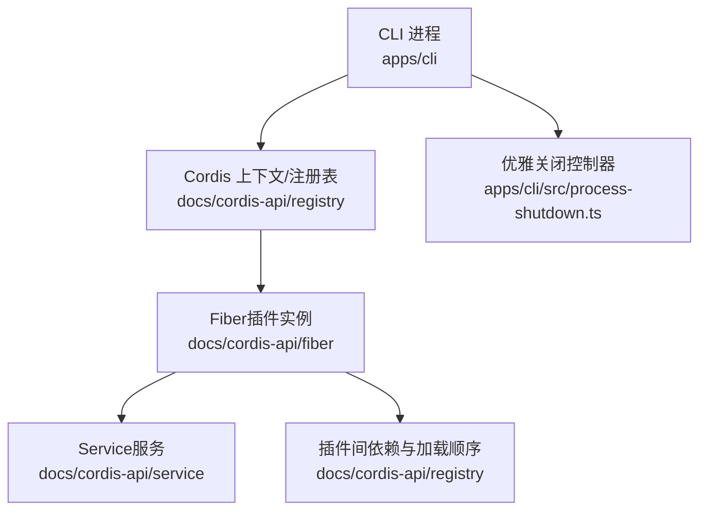
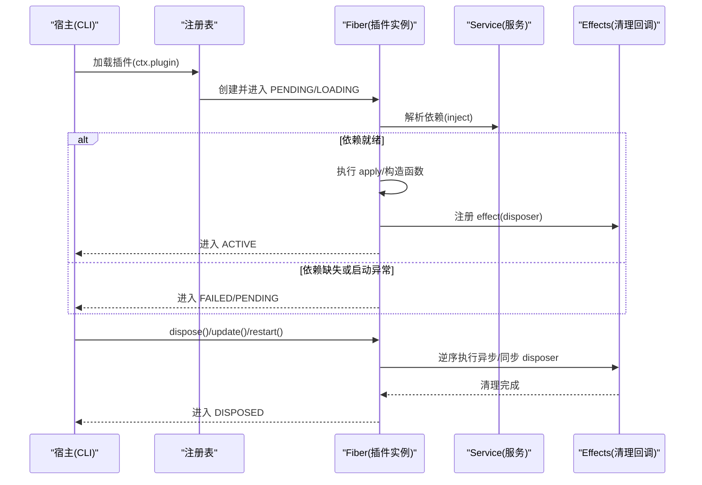
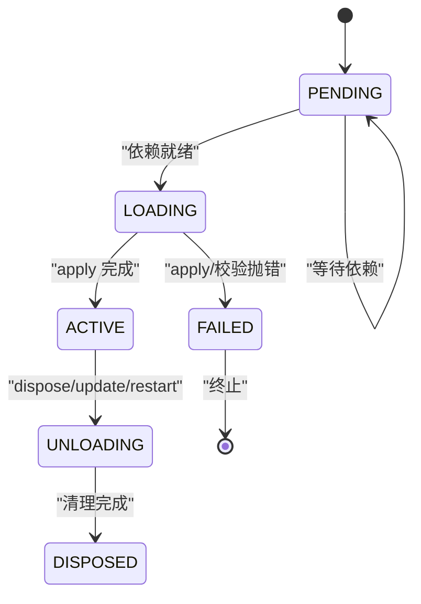
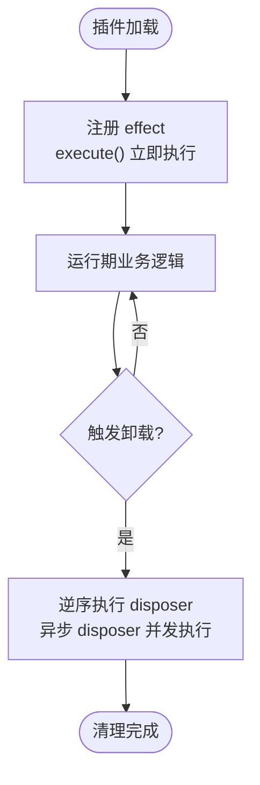
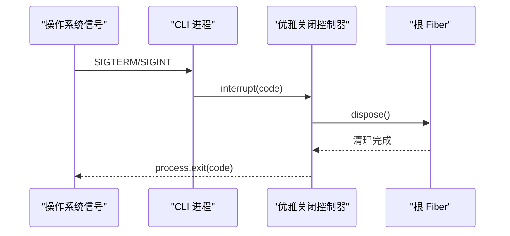

# 插件生命周期管理

<cite>
**本文引用的文件**
- [docs/cordis-tutorial/02-lifecycle-and-effects.md](file://docs/cordis-tutorial/02-lifecycle-and-effects.md)
- [docs/cordis-tutorial/02-lifecycle-and-effects.zh.md](file://docs/cordis-tutorial/02-lifecycle-and-effects.zh.md)
- [docs/cordis-api/fiber.md](file://docs/cordis-api/fiber.md)
- [docs/cordis-api/service.md](file://docs/cordis-api/service.md)
- [docs/cordis-api/registry.md](file://docs/cordis-api/registry.md)
- [docs/cordis-api/registry.zh.md](file://docs/cordis-api/registry.zh.md)
- [apps/cli/src/process-shutdown.ts](file://apps/cli/src/process-shutdown.ts)
- [packages/extensions/tool-cordis/tests/cordis-lifecycle.spec.ts](file://packages/extensions/tool-cordis/tests/cordis-lifecycle.spec.ts)
- [apps/cli/src/profile-boot.ts](file://apps/cli/src/profile-boot.ts)
</cite>

## 目录
1. [简介](#简介)
2. [项目结构](#项目结构)
3. [核心组件](#核心组件)
4. [架构总览](#架构总览)
5. [详细组件分析](#详细组件分析)
6. [依赖关系与启动顺序](#依赖关系与启动顺序)
7. [性能考虑](#性能考虑)
8. [故障排查指南](#故障排查指南)
9. [结论](#结论)
10. [附录：示例场景与最佳实践](#附录示例场景与最佳实践)

## 简介
本文面向插件开发者，系统化阐述插件从加载到卸载的完整生命周期，包括初始化、运行和资源清理三个阶段；深入解释 effects 机制（注册清理函数、处理异步操作）；说明插件间的依赖关系与启动顺序控制；并提供处理启动失败、资源泄漏和优雅关闭的具体实践与优化建议。

## 项目结构
本仓库围绕 Cordis 插件系统组织代码与文档：
- 教程与 API 文档位于 docs/cordis-tutorial 与 docs/cordis-api，描述 Fiber、Service、Registry 等核心概念与用法。
- CLI 应用层包含进程级优雅关闭实现与启动配置，展示如何在宿主中协调 fiber 的生命周期。
- 测试用例覆盖生命周期状态转换、依赖注入与热重载行为。

图表来源
- [docs/cordis-api/registry.md:1-56](file://docs/cordis-api/registry.md#L1-L56)
- [docs/cordis-api/fiber.md:1-110](file://docs/cordis-api/fiber.md#L1-L110)
- [docs/cordis-api/service.md:1-23](file://docs/cordis-api/service.md#L1-L23)
- [apps/cli/src/process-shutdown.ts:1-78](file://apps/cli/src/process-shutdown.ts#L1-L78)

章节来源
- [docs/cordis-api/registry.md:1-56](file://docs/cordis-api/registry.md#L1-L56)
- [docs/cordis-api/fiber.md:1-110](file://docs/cordis-api/fiber.md#L1-L110)
- [docs/cordis-api/service.md:1-23](file://docs/cordis-api/service.md#L1-L23)
- [apps/cli/src/process-shutdown.ts:1-78](file://apps/cli/src/process-shutdown.ts#L1-L78)

## 核心组件
- Fiber：一个已加载插件实例的运行时句柄，持有当前生命周期状态、已校验的配置以及注册的 effects。通过 ctx.fiber 访问，ctx.effect() 委托给当前 fiber。
- Service：上下文服务的基类，作为插件提供或消费的能力单元，随 fiber 生命周期自动注册与移除。
- Registry：插件加载与依赖注入的核心，支持以数组或对象声明依赖，保证在所需服务可用前保持 PENDING。

关键要点
- 插件可通过函数、类或对象形式定义入口，并声明 inject/provide 等元数据。
- 所有通过 Cordis API 建立的注册都是 effect，会在所属插件卸载时撤销。
- 非框架管理的资源必须用 ctx.effect() 包装并返回 disposer，确保卸载时释放。

章节来源
- [docs/cordis-api/fiber.md:1-110](file://docs/cordis-api/fiber.md#L1-L110)
- [docs/cordis-api/service.md:1-23](file://docs/cordis-api/service.md#L1-L23)
- [docs/cordis-api/registry.md:1-56](file://docs/cordis-api/registry.md#L1-L56)

## 架构总览
下图展示了插件从加载到卸载的关键阶段与交互：

图表来源
- [docs/cordis-api/fiber.md:1-110](file://docs/cordis-api/fiber.md#L1-L110)
- [docs/cordis-api/registry.md:1-56](file://docs/cordis-api/registry.md#L1-L56)
- [docs/cordis-api/service.md:1-23](file://docs/cordis-api/service.md#L1-L23)

## 详细组件分析

### Fiber 与生命周期状态机
- 状态流转：PENDING → LOADING → ACTIVE → UNLOADING → DISPOSED；LOADING 可能失败进入 FAILED。
- 关键属性与方法：
  - state：当前生命周期状态，状态变化会发出 internal/status。
  - config：经过校验的配置，可由 update() 更新。
  - dispose()：卸载插件并等待清理完成。
  - await()：等待当前生命周期工作完成并重新抛出启动错误。
  - restart()：立即以当前配置重启。
  - update(config, noSave?)：验证并应用新配置后重启。
- 诊断能力：getEffects() 可获取当前已注册 effect 的元信息树。

图表来源
- [docs/cordis-api/fiber.md:82-146](file://docs/cordis-api/fiber.md#L82-L146)
- [docs/cordis-api/fiber.md:212-274](file://docs/cordis-api/fiber.md#L212-L274)

章节来源
- [docs/cordis-api/fiber.md:82-146](file://docs/cordis-api/fiber.md#L82-L146)
- [docs/cordis-api/fiber.md:212-274](file://docs/cordis-api/fiber.md#L212-L274)

### Effects 机制与清理
- 作用域：effect 主体在加载期间立即执行；其返回的 disposer 在卸载时按逆序执行。
- 异步支持：多个异步 disposer 并发运行；如需顺序清理，应在同一 disposer 内依次 await。
- 内置注册即 effect：事件监听、子插件挂载、服务注册等均为 effect，卸载时自动撤销。
- 外部资源：定时器、连接、watcher 等需包裹在 ctx.effect() 中并返回 disposer，避免资源泄漏。

图表来源
- [docs/cordis-tutorial/02-lifecycle-and-effects.md:7-94](file://docs/cordis-tutorial/02-lifecycle-and-effects.md#L7-L94)
- [docs/cordis-api/fiber.md:164-210](file://docs/cordis-api/fiber.md#L164-L210)

章节来源
- [docs/cordis-tutorial/02-lifecycle-and-effects.md:7-94](file://docs/cordis-tutorial/02-lifecycle-and-effects.md#L7-L94)
- [docs/cordis-api/fiber.md:164-210](file://docs/cordis-api/fiber.md#L164-L210)

### Service 与依赖注入
- Service 作为命名能力单元，随 fiber 生命周期自动注册与移除。
- 依赖声明：inject 可以是数组或对象映射，表示所需服务及其拦截配置。
- 加载顺序：由依赖决定而非配置文件顺序；当依赖缺失时插件保持 PENDING。
- 动态替换：运行期间若提供方被卸载或热替换，依赖方也会卸载并在服务恢复后重新加载，避免悬空引用。

图表来源
- [docs/cordis-api/registry.md:1-56](file://docs/cordis-api/registry.md#L1-L56)
- [docs/cordis-api/registry.zh.md:1-33](file://docs/cordis-api/registry.zh.md#L1-L33)

章节来源
- [docs/cordis-api/registry.md:1-56](file://docs/cordis-api/registry.md#L1-L56)
- [docs/cordis-api/registry.zh.md:1-33](file://docs/cordis-api/registry.zh.md#L1-L33)

### 宿主集成与优雅关闭
- 进程级优雅关闭：通过 createProcessShutdown 封装应用级 dispose，支持超时强制退出与信号中断。
- CLI 启动流程：检查 fiber 状态为 ACTIVE 后再进行后续操作；在进程退出时调用 fiber.dispose() 确保清理。
- 组合策略：将 fiber.dispose 纳入 shutdown 流程，保证所有 effect 清理完成后再退出。

图表来源
- [apps/cli/src/process-shutdown.ts:1-78](file://apps/cli/src/process-shutdown.ts#L1-L78)
- [apps/cli/src/profile-boot.ts:197-224](file://apps/cli/src/profile-boot.ts#L197-L224)

章节来源
- [apps/cli/src/process-shutdown.ts:1-78](file://apps/cli/src/process-shutdown.ts#L1-L78)
- [apps/cli/src/profile-boot.ts:197-224](file://apps/cli/src/profile-boot.ts#L197-L224)

## 依赖关系与启动顺序
- 依赖驱动启动：插件的 inject 声明决定何时激活；未满足依赖时处于 PENDING，不会阻塞事件循环。
- 文件顺序无关：cordis.yml 中的条目顺序不影响启动顺序，真正决定的是依赖图。
- 运行期依赖变更：提供方卸载或热替换会导致依赖方卸载并重建，确保引用一致性。
- 内部事件扩展：internal/plugin 事件可用于探测 fiber 状态与注入时机，便于调试与增强。

章节来源
- [docs/cordis-api/registry.md:1-56](file://docs/cordis-api/registry.md#L1-L56)
- [docs/cordis-api/registry.zh.md:1-33](file://docs/cordis-api/registry.zh.md#L1-L33)
- [packages/extensions/tool-cordis/tests/cordis-lifecycle.spec.ts:122-161](file://packages/extensions/tool-cordis/tests/cordis-lifecycle.spec.ts#L122-L161)

## 性能考虑
- 避免长耗时初始化：将昂贵初始化放入懒加载或按需触发，减少启动时间。
- 合理拆分 effect：将独立资源的清理放在各自 effect 中，提升并行清理效率；需要顺序清理时合并至单一 disposer。
- 谨慎使用全局单例：尽量通过 Service 暴露能力，利用依赖注入与生命周期管理，降低耦合与内存占用。
- 监控 PENDING 状态：长时间 PENDING 通常意味着依赖缺失或服务不可用，应通过日志与诊断定位。
- 热重载友好：所有注册均为 effect，HMR 会自动撤销旧实例注册，无需手动清理。

[本节为通用指导，不直接分析具体文件]

## 故障排查指南
- 启动失败
  - 现象：fiber.state 进入 FAILED。
  - 排查：检查配置校验与 apply 抛错；使用 fiber.await() 捕获并打印错误。
  - 参考：fiber.await() 会等待当前生命周期工作并重新抛出启动错误。
- 资源泄漏
  - 现象：定时器、连接、订阅未释放。
  - 排查：确认所有外部资源均在 ctx.effect() 中注册并返回 disposer；检查异步 disposer 是否全部 await。
  - 参考：教程强调“对于 Cordis 尚未管理的资源，应将其包装在 ctx.effect() 中并返回 disposer”。
- 优雅关闭
  - 现象：进程退出时仍有后台任务运行。
  - 排查：确保宿主在收到信号时调用 fiber.dispose()；使用 createProcessShutdown 统一封装并设置超时。
  - 参考：CLI 进程通过 createProcessShutdown 协调 fiber.dispose() 与进程退出。

章节来源
- [docs/cordis-api/fiber.md:212-274](file://docs/cordis-api/fiber.md#L212-L274)
- [docs/cordis-tutorial/02-lifecycle-and-effects.zh.md:7-94](file://docs/cordis-tutorial/02-lifecycle-and-effects.zh.md#L7-L94)
- [apps/cli/src/process-shutdown.ts:1-78](file://apps/cli/src/process-shutdown.ts#L1-L78)

## 结论
Cordis 通过 Fiber、Service 与 Registry 构建了健壮的插件生命周期体系：以依赖驱动的启动顺序、以 effect 为核心的资源管理与清理、以及宿主集成的优雅关闭机制。遵循本文的实践建议，可有效避免启动失败、资源泄漏与关闭不完整等问题，同时获得良好的热重载与可观测性体验。

[本节为总结，不直接分析具体文件]

## 附录：示例场景与最佳实践

- 处理插件启动失败
  - 使用 fiber.await() 捕获并处理配置校验或 apply 阶段的错误。
  - 在宿主层对 fiber 的 Promise 附加 catch 处理器，避免未处理拒绝。
  - 参考：fiber.await() 的行为与错误重抛。

- 防止资源泄漏
  - 所有非框架管理的资源（定时器、连接、watcher）必须在 ctx.effect() 中注册并返回 disposer。
  - 多个异步 disposer 并发执行；如需顺序清理，合并至单一 disposer 并依次 await。
  - 参考：教程关于 effect 与 disposer 的说明。

- 优雅关闭
  - 在 CLI 或宿主进程中，使用 createProcessShutdown 封装 fiber.dispose()，并设置合理的超时。
  - 在信号处理中调用 interrupt(code)，或在正常退出时调用 shutdown(code)。
  - 参考：process-shutdown.ts 的实现与 CLI profile-boot.ts 的使用。

- 依赖与启动顺序
  - 通过 inject 声明依赖，确保插件在所需服务可用后才进入 ACTIVE。
  - 依赖缺失时保持 PENDING，不阻塞事件循环；可通过 internal/plugin 事件观察状态。
  - 参考：Registry 的 inject 语义与 PENDING 行为。

章节来源
- [docs/cordis-api/fiber.md:212-274](file://docs/cordis-api/fiber.md#L212-L274)
- [docs/cordis-tutorial/02-lifecycle-and-effects.zh.md:7-94](file://docs/cordis-tutorial/02-lifecycle-and-effects.zh.md#L7-L94)
- [apps/cli/src/process-shutdown.ts:1-78](file://apps/cli/src/process-shutdown.ts#L1-L78)
- [docs/cordis-api/registry.md:1-56](file://docs/cordis-api/registry.md#L1-L56)