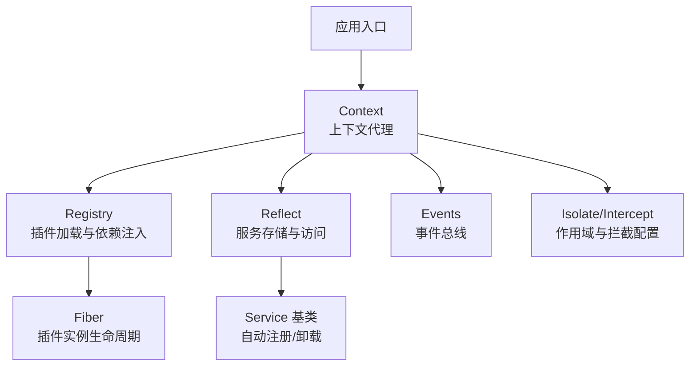
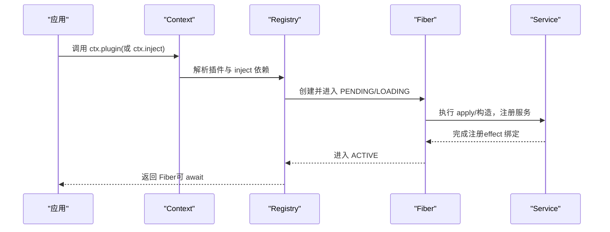
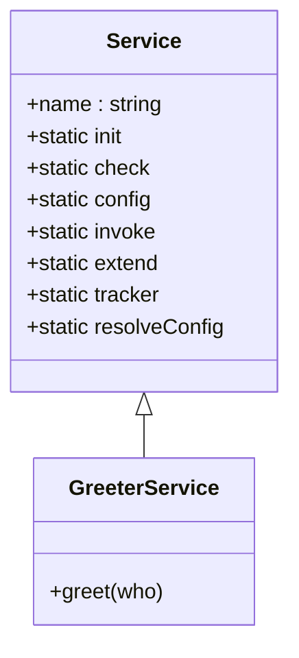
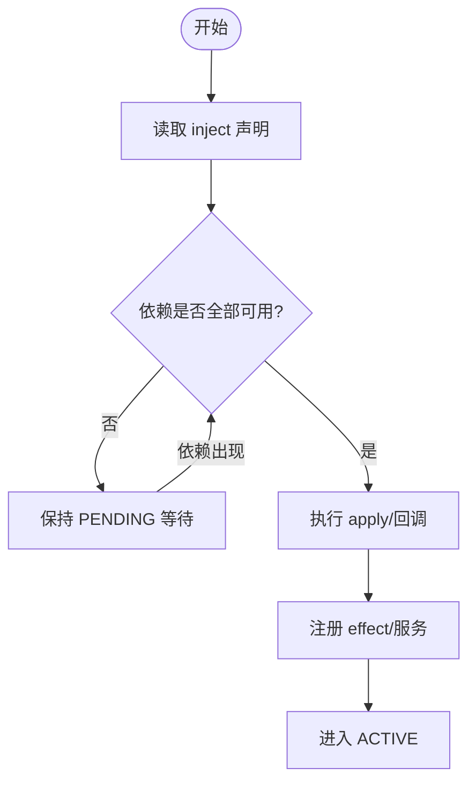
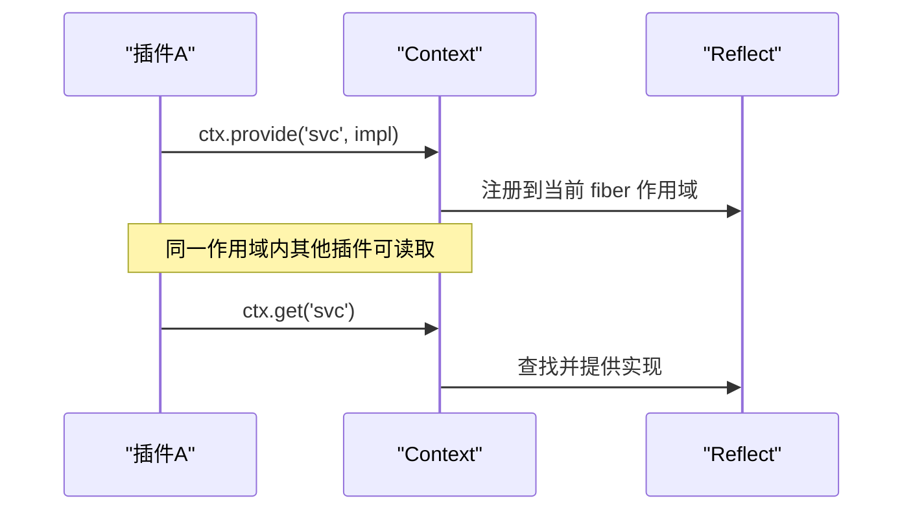
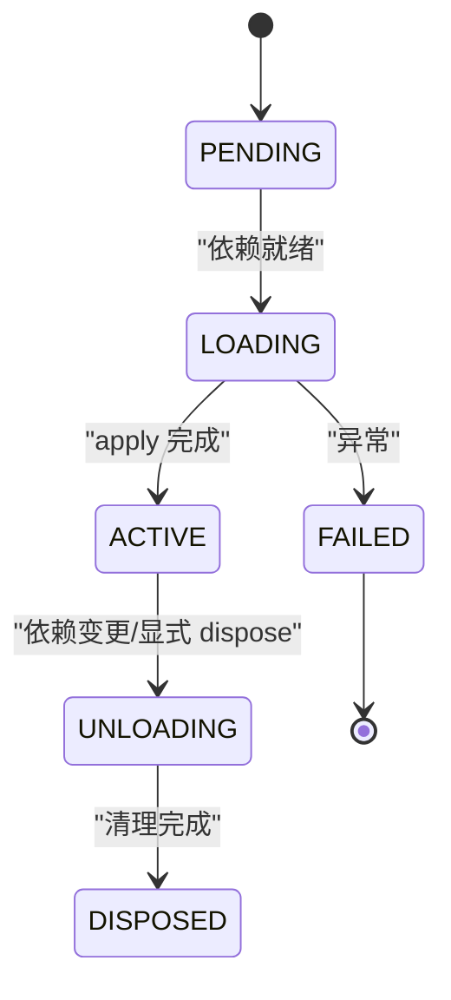
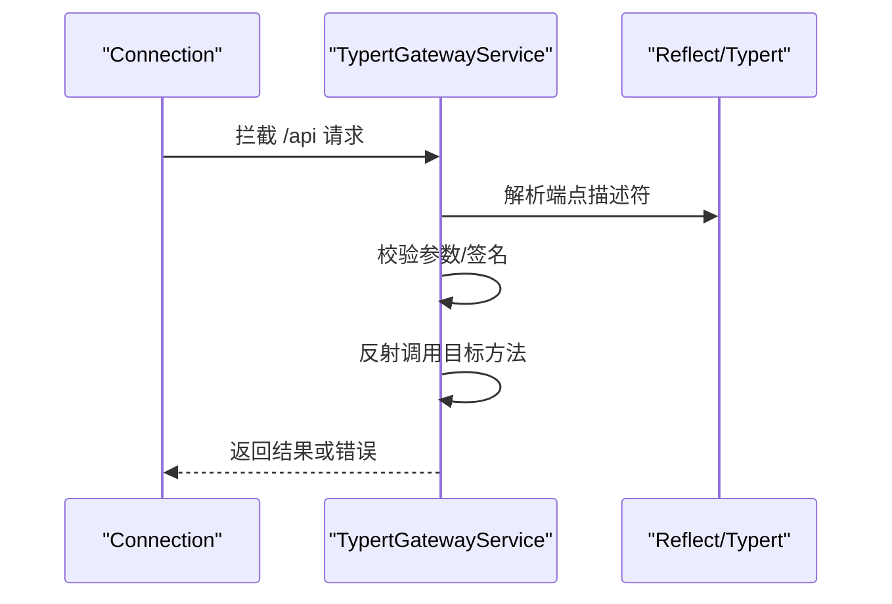
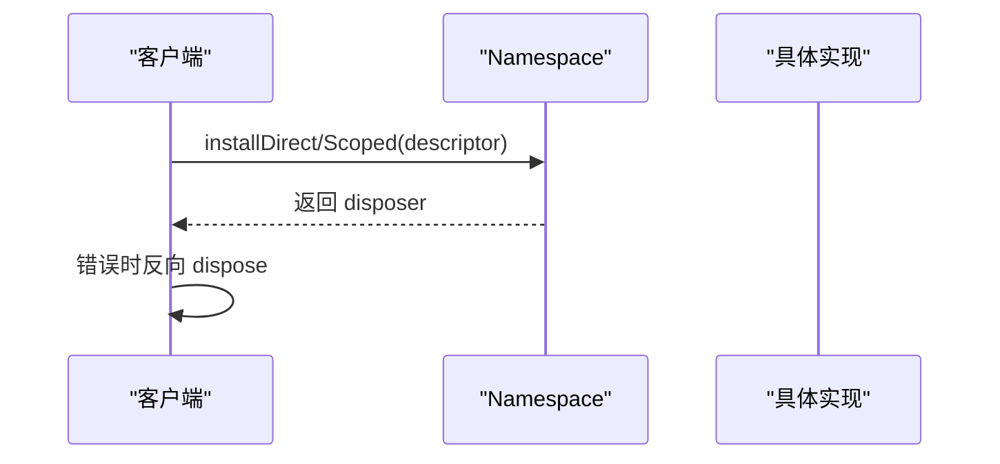
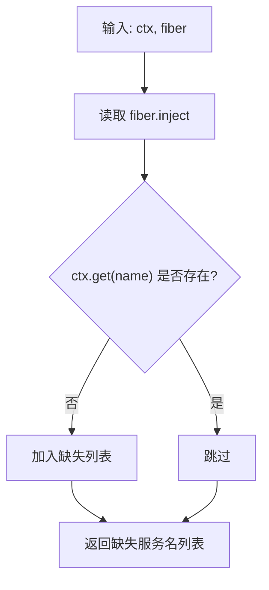
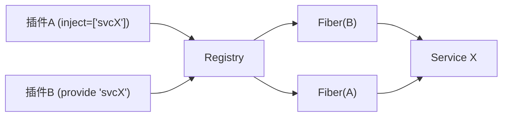

# 服务与依赖注入

<cite>
**本文引用的文件**
- [service.md](file://docs/cordis-api/service.md)
- [registry.md](file://docs/cordis-api/registry.md)
- [context.md](file://docs/cordis-api/context.md)
- [03-services.md](file://docs/cordis-tutorial/03-services.md)
- [02-lifecycle-and-effects.md](file://docs/cordis-tutorial/02-lifecycle-and-effects.md)
- [index.ts（网关服务）](file://packages/api/gateway/src/index.ts)
- [client/index.ts（客户端安装）](file://packages/api/gateway/src/client/index.ts)
- [lifecycle.ts（宿主运行器）](file://packages/extensions/cordis-host-runner/src/lifecycle.ts)
- [inspect.ts（诊断工具）](file://packages/extensions/tool-cordis/src/inspect.ts)
- [app-boot/index.ts（启动引导）](file://packages/boot/app-boot/src/index.ts)
</cite>

## 目录
1. [简介](#简介)
2. [项目结构](#项目结构)
3. [核心组件](#核心组件)
4. [架构总览](#架构总览)
5. [详细组件分析](#详细组件分析)
6. [依赖关系分析](#依赖关系分析)
7. [性能考量](#性能考量)
8. [故障排查指南](#故障排查指南)
9. [结论](#结论)
10. [附录](#附录)

## 简介
本文件系统性阐述 Cordis 的服务系统与依赖注入机制，覆盖服务的注册、发现、生命周期管理；如何使用 Service 基类创建可复用服务；依赖注入的工作原理与 inject 装饰器的使用方式；服务间通信模式与最佳实践；复杂依赖关系处理、循环依赖检测思路与性能优化策略；以及在实际项目中如何设计服务并进行重构。

## 项目结构
Cordis 将“上下文”作为核心对象，所有服务、事件与生命周期能力均通过 ctx 暴露。服务以命名能力形式提供，消费者通过名称获取实现，从而在配置层替换提供者而不改动消费方。插件加载与依赖解析由 Registry 负责，Context 提供隔离与作用域控制，Service 基类简化服务实例的注册与生命周期绑定。

图表来源
- [context.md:1-160](file://docs/cordis-api/context.md#L1-L160)
- [registry.md:1-120](file://docs/cordis-api/registry.md#L1-L120)
- [service.md:1-103](file://docs/cordis-api/service.md#L1-L103)

章节来源
- [context.md:1-160](file://docs/cordis-api/context.md#L1-L160)
- [registry.md:1-120](file://docs/cordis-api/registry.md#L1-L120)
- [service.md:1-103](file://docs/cordis-api/service.md#L1-L103)

## 核心组件
- Context：上下文代理，提供 get/set/provide/accessor/mixin/isolate/intercept 等能力，并混入 events、logger、reflect、registry。
- Registry：插件加载与依赖注入，支持函数/类/对象三种插件形态，维护 fiber 状态机与依赖图。
- Service：服务基类，构造时立即按名称注册到当前 fiber，随 fiber 卸载自动移除。
- Fiber：插件实例的生命周期容器，状态包括 PENDING/LOADING/ACTIVE/UNLOADING/DISPOSED/FAILED。

章节来源
- [context.md:1-160](file://docs/cordis-api/context.md#L1-L160)
- [registry.md:1-120](file://docs/cordis-api/registry.md#L1-L120)
- [service.md:1-103](file://docs/cordis-api/service.md#L1-L103)
- [02-lifecycle-and-effects.md:68-95](file://docs/cordis-tutorial/02-lifecycle-and-effects.md#L68-L95)

## 架构总览
Cordis 的服务系统围绕“声明式依赖 + 作用域隔离 + 动态装配”展开：
- 声明式依赖：插件通过 inject 声明所需服务，框架保证依赖就绪后才激活。
- 作用域隔离：isolate 为特定服务建立独立作用域，intercept 为下游插件合并拦截配置。
- 动态装配：服务可在运行时提供/替换，依赖方自动重新加载，避免悬挂引用。

图表来源
- [registry.md:8-56](file://docs/cordis-api/registry.md#L8-L56)
- [03-services.md:44-79](file://docs/cordis-tutorial/03-services.md#L44-L79)
- [02-lifecycle-and-effects.md:68-95](file://docs/cordis-tutorial/02-lifecycle-and-effects.md#L68-L95)

## 详细组件分析

### 服务基类 Service：注册与生命周期
- 继承 Service 并在构造中调用 super(ctx, name)，即完成命名注册。
- 服务是 effect：当提供 fiber 卸载时，服务自动移除，依赖该服务的插件也会随之卸载并重新加载。
- 静态符号键用于扩展点：init/check/config/invoke/extend/tracker/resolveConfig。

图表来源
- [service.md:1-103](file://docs/cordis-api/service.md#L1-L103)
- [03-services.md:7-43](file://docs/cordis-tutorial/03-services.md#L7-L43)

章节来源
- [service.md:1-103](file://docs/cordis-api/service.md#L1-L103)
- [03-services.md:7-43](file://docs/cordis-tutorial/03-services.md#L7-L43)

### 依赖注入与插件加载：inject 与 ctx.inject
- inject 声明支持数组与对象两种形式：数组表示无拦截配置的强依赖；对象可将服务名映射到拦截配置。
- ctx.inject(deps, callback) 是 ctx.plugin({ inject, apply }) 的便捷写法，回调会在依赖可用时运行，并在依赖变化时卸载并重载。
- 插件形态：函数、类、对象（含 apply），统一由 Registry 管理。

图表来源
- [registry.md:8-56](file://docs/cordis-api/registry.md#L8-L56)
- [registry.md:123-153](file://docs/cordis-api/registry.md#L123-L153)
- [03-services.md:44-79](file://docs/cordis-tutorial/03-services.md#L44-L79)

章节来源
- [registry.md:8-56](file://docs/cordis-api/registry.md#L8-L56)
- [registry.md:123-153](file://docs/cordis-api/registry.md#L123-L153)
- [03-services.md:44-79](file://docs/cordis-tutorial/03-services.md#L44-L79)

### 上下文与作用域：get/set/provide/isolate/intercept
- ctx.get(name, strict?)：读取服务，strict=true 仅返回当前活跃 fiber 提供的实现。
- ctx.set(name, value)：覆写已提供的服务值，仅限提供 fiber 设置。
- ctx.provide(name, value)：在当前 fiber 注册服务，返回 disposer；fiber 卸载时自动注销。
- ctx.isolate(name, label?)：为指定服务创建子作用域，便于在不同分支提供不同实现。
- ctx.intercept(name, config)：为下游插件合并拦截配置，不改变父上下文。

图表来源
- [context.md:235-365](file://docs/cordis-api/context.md#L235-L365)

章节来源
- [context.md:235-365](file://docs/cordis-api/context.md#L235-L365)

### 生命周期与效果：Fiber 状态机与 effect
- Fiber 状态机：PENDING → LOADING → ACTIVE → UNLOADING → DISPOSED，失败路径进入 FAILED。
- 所有通过 Cordis API 的注册都是 effect，卸载时自动回滚；外部资源需包裹 ctx.effect()。
- 依赖丢失会触发依赖方卸载与重加载，避免悬挂引用。

图表来源
- [02-lifecycle-and-effects.md:68-95](file://docs/cordis-tutorial/02-lifecycle-and-effects.md#L68-L95)

章节来源
- [02-lifecycle-and-effects.md:68-95](file://docs/cordis-tutorial/02-lifecycle-and-effects.md#L68-L95)

### 实际服务示例：TypertGatewayService
- 通过 static inject = ['typert'] 声明依赖。
- 在构造中监听内部事件并拦截 RPC 路由，基于反射收集端点声明并分发调用。
- 展示服务如何在运行时组合多个子系统（连接、RPC、反射）。

图表来源
- [index.ts（网关服务）:90-112](file://packages/api/gateway/src/index.ts#L90-L112)
- [index.ts（网关服务）:145-184](file://packages/api/gateway/src/index.ts#L145-L184)
- [index.ts（网关服务）:224-279](file://packages/api/gateway/src/index.ts#L224-L279)

章节来源
- [index.ts（网关服务）:90-112](file://packages/api/gateway/src/index.ts#L90-L112)
- [index.ts（网关服务）:145-184](file://packages/api/gateway/src/index.ts#L145-L184)
- [index.ts（网关服务）:224-279](file://packages/api/gateway/src/index.ts#L224-L279)

### 客户端侧安装与撤销：Typert 客户端
- 安装流程包含直接安装与 scoped 投影安装，失败时反向撤销已安装项。
- 返回 disposer 用于卸载，确保资源释放顺序正确。

图表来源
- [client/index.ts（客户端安装）:238-274](file://packages/api/gateway/src/client/index.ts#L238-L274)

章节来源
- [client/index.ts（客户端安装）:238-274](file://packages/api/gateway/src/client/index.ts#L238-L274)

### 缺失依赖检测与诊断
- missingServices：列出 fiber.inject 中尚未存在的依赖，帮助定位 PENDING 原因。
- providedServices：列出某 fiber 子树提供的服务集合，辅助调试作用域与覆盖关系。
- withinFiber：判断 fiber 是否在某个根 fiber 的子树中。

图表来源
- [lifecycle.ts（宿主运行器）:47-57](file://packages/extensions/cordis-host-runner/src/lifecycle.ts#L47-L57)
- [inspect.ts（诊断工具）:82-121](file://packages/extensions/tool-cordis/src/inspect.ts#L82-L121)

章节来源
- [lifecycle.ts（宿主运行器）:47-57](file://packages/extensions/cordis-host-runner/src/lifecycle.ts#L47-L57)
- [inspect.ts（诊断工具）:82-121](file://packages/extensions/tool-cordis/src/inspect.ts#L82-L121)

### 启动引导中的激活检查
- 启动阶段遍历所有 entry，若 fiber 处于 PENDING，则报告缺失服务并汇总失败信息。
- 有助于在应用启动时尽早发现依赖问题。

章节来源
- [app-boot/index.ts（启动引导）:706-725](file://packages/boot/app-boot/src/index.ts#L706-L725)

## 依赖关系分析
- 耦合与内聚：Service 仅关注自身能力与生命周期；Context 提供统一的访问与隔离；Registry 解耦插件与依赖解析。
- 直接依赖：插件通过 inject 声明依赖；服务通过 ctx.get/provide 访问；网关服务依赖 typert/connection/reflect。
- 间接依赖：客户端安装依赖命名空间与服务实现；诊断工具依赖 fiber 元数据。
- 循环依赖：Cordis 通过“延迟激活”与“作用域隔离”降低风险；建议通过事件或接口抽象进一步解耦。

图表来源
- [registry.md:8-56](file://docs/cordis-api/registry.md#L8-L56)
- [03-services.md:44-79](file://docs/cordis-tutorial/03-services.md#L44-L79)

章节来源
- [registry.md:8-56](file://docs/cordis-api/registry.md#L8-L56)
- [03-services.md:44-79](file://docs/cordis-tutorial/03-services.md#L44-L79)

## 性能考量
- 延迟激活：PENDING 状态不会阻塞事件循环，仅在依赖就绪时激活，减少无效工作。
- 作用域隔离：isolate 避免全局污染，提高并发安全性与测试隔离性。
- 拦截配置合并：intercept 允许局部覆盖，减少重复实现。
- 反射与类型安全：网关服务结合严格定义与 SRC 标记，提升调用效率与错误定位速度。
- 批量卸载：fiber 卸载时按逆序并行异步清理，必要时在单个 disposer 中串行化关键步骤。

[本节为通用指导，无需源码引用]

## 故障排查指南
- 插件未激活：检查 fiber 是否为 PENDING，使用 missingServices 列出缺失依赖。
- 服务不可用：确认提供 fiber 是否 ACTIVE，必要时使用 ctx.get('svc', false) 放宽严格模式。
- 作用域冲突：使用 isolate 隔离同名服务，或通过 intercept 注入差异化配置。
- 启动失败：查看启动引导输出的失败条目，定位具体 entry 与 fiber 状态。
- 资源泄漏：确保外部资源通过 ctx.effect() 管理，并在 disposer 中释放。

章节来源
- [lifecycle.ts（宿主运行器）:47-57](file://packages/extensions/cordis-host-runner/src/lifecycle.ts#L47-L57)
- [inspect.ts（诊断工具）:82-121](file://packages/extensions/tool-cordis/src/inspect.ts#L82-L121)
- [app-boot/index.ts（启动引导）:706-725](file://packages/boot/app-boot/src/index.ts#L706-L725)
- [02-lifecycle-and-effects.md:68-95](file://docs/cordis-tutorial/02-lifecycle-and-effects.md#L68-L95)

## 结论
Cordis 的服务与依赖注入系统以“声明式依赖 + 作用域隔离 + 动态装配”为核心，配合 Service 基类与 Fiber 生命周期管理，提供了高内聚、低耦合、可热插拔的服务体系。通过 inject、isolate、intercept 的组合，既能满足复杂依赖场景，又能保持清晰的边界与可观测性。实践中应优先使用 effect 管理资源、利用诊断工具定位问题，并通过事件与接口抽象降低耦合度。

[本节为总结，无需源码引用]

## 附录
- 服务设计模式
  - 单一职责：每个 Service 聚焦一个能力域，通过组合而非继承扩展功能。
  - 可替换实现：通过相同服务名提供不同实现，借助配置切换。
  - 可选依赖：使用 ctx.get 探测可选服务，避免硬依赖。
- 重构指南
  - 将全局单例拆分为服务，纳入 fiber 生命周期。
  - 将跨模块耦合通过事件或接口抽象解耦。
  - 引入 isolate 拆分作用域，便于测试与并行运行。
  - 使用 intercept 注入差异化配置，减少分支逻辑。

[本节为通用指导，无需源码引用]