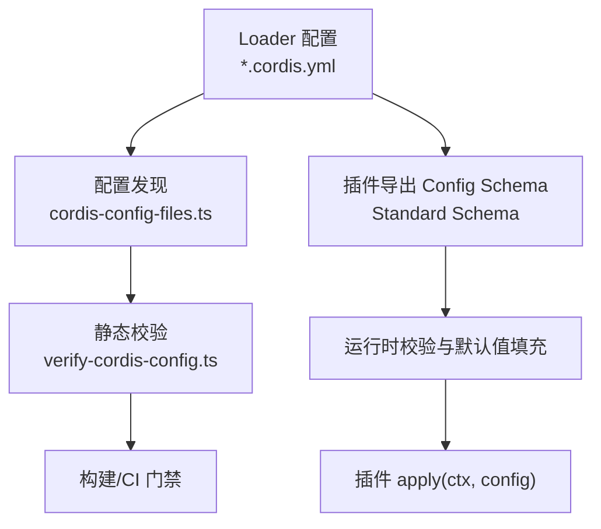
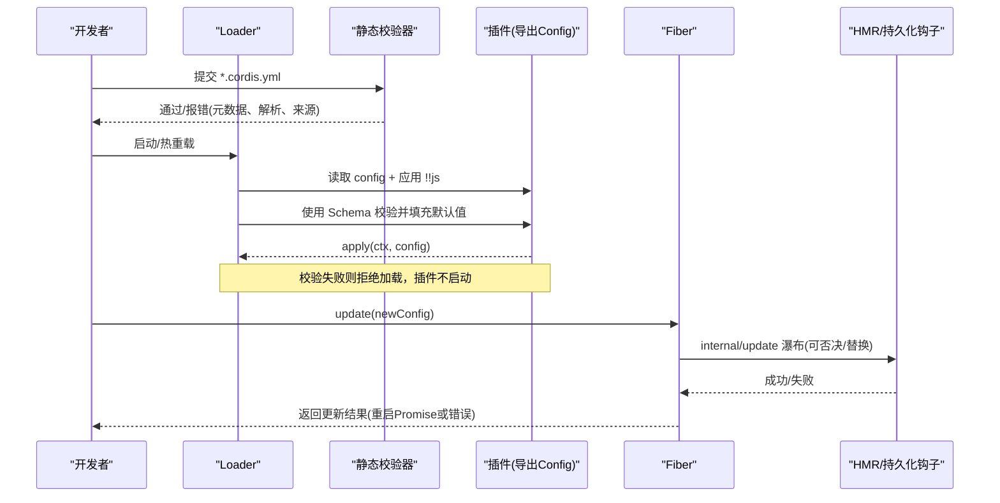
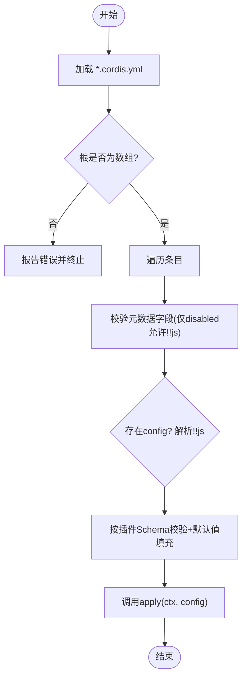
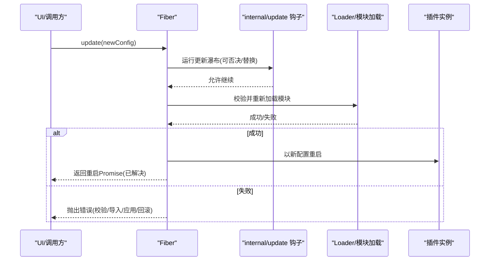
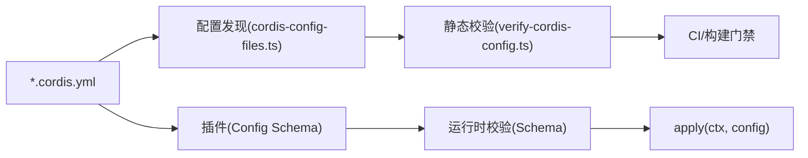

# 配置管理

<cite>
**本文引用的文件**
- [verify-cordis-config.ts](file://scripts/verify-cordis-config.ts)
- [cordis-config-files.ts](file://scripts/cordis-config-files.ts)
- [verify-config-source-ownership.ts](file://scripts/verify-config-source-ownership.ts)
- [05-config.md](file://docs/cordis-tutorial/05-config.md)
- [config.zh.md](file://docs/user/develop/basic/config.zh.md)
- [config.md](file://docs/user/develop/basic/config.md)
- [fiber.zh.md](file://docs/cordis-api/fiber.zh.md)
- [registry.zh.md](file://docs/cordis-api/registry.zh.md)
- [2026-08-04-configuration-source-ownership.md](file://.agents/notes/implemented/architecture/2026-08-04-configuration-source-ownership.md)
- [2026-08-04-configuration-source-ownership.zh.md](file://.agents/notes/implemented/architecture/2026-08-04-configuration-source-ownership.zh.md)
- [2026-07-20-config-hot-reload-resilience.md](file://.agents/notes/implemented/bug-fix/2026-07-20-config-hot-reload-resilience.md)
- [client/index.ts](file://packages/client/hmr/src/client/index.ts)
- [node-half.client.spec.ts](file://packages/client/hmr/tests/node-half.client.spec.ts)
- [hmr-config.spec.ts](file://packages/boot/app-boot/tests/hmr-config.spec.ts)
</cite>

## 目录
1. [简介](#简介)
2. [项目结构](#项目结构)
3. [核心组件](#核心组件)
4. [架构总览](#架构总览)
5. [详细组件分析](#详细组件分析)
6. [依赖关系分析](#依赖关系分析)
7. [性能考虑](#性能考虑)
8. [故障排查指南](#故障排查指南)
9. [结论](#结论)
10. [附录](#附录)

## 简介
本文件系统性说明 Cordis 的配置管理机制，覆盖配置文件格式、优先级与合并规则、插件中读取与验证配置的方式、动态更新与热重载机制、最佳实践（环境隔离、敏感信息处理、版本管理）、调试工具与常见错误定位。目标是帮助开发者在插件中安全、可维护地管理配置，并在运行时以最小风险进行变更。

## 项目结构
Cordis 的配置由 Loader 管理的 YAML 清单驱动，配合插件导出的 Schema 完成类型化校验与默认值填充；同时提供脚本对仓库内所有 cordis 配置文件进行静态校验，确保元数据合法、解析路径正确、来源合规。

图表来源
- [cordis-config-files.ts:1-19](file://scripts/cordis-config-files.ts#L1-L19)
- [verify-cordis-config.ts:72-99](file://scripts/verify-cordis-config.ts#L72-L99)
- [registry.zh.md:72-121](file://docs/cordis-api/registry.zh.md#L72-L121)

章节来源
- [cordis-config-files.ts:1-19](file://scripts/cordis-config-files.ts#L1-L19)
- [verify-cordis-config.ts:1-99](file://scripts/verify-cordis-config.ts#L1-L99)
- [registry.zh.md:72-121](file://docs/cordis-api/registry.zh.md#L72-L121)

## 核心组件
- 配置清单：每个 Loader 条目可携带 config 块，支持 !!js 表达式用于在加载时计算值（仅限 config 与 disabled）。
- 插件 Schema：插件通过导出同名 Config（实现 Standard Schema）声明字段、默认值与约束；Cordis 在 apply 前执行校验并补齐默认值。
- 静态校验器：扫描仓库内所有 *.cordis.yml/*.yaml，校验根为数组、元数据字段合法性、示例与应用包解析、预设平面分离、客户端半面声明等。
- 来源所有权检查：禁止在随仓分发的配置中以简单行内形式直接注入凭据或端点，强制走受控的凭据与环境快照通道。
- 动态更新：Fiber.update(config) 在校验通过后重启插件；HMR 与持久化钩子参与更新瀑布流，失败可回滚且不中断运行。

章节来源
- [05-config.md:1-85](file://docs/cordis-tutorial/05-config.md#L1-L85)
- [config.md:1-107](file://docs/user/develop/basic/config.md#L1-L107)
- [verify-cordis-config.ts:72-99](file://scripts/verify-cordis-config.ts#L72-L99)
- [verify-config-source-ownership.ts:1-57](file://scripts/verify-config-source-ownership.ts#L1-L57)
- [fiber.zh.md:244-280](file://docs/cordis-api/fiber.zh.md#L244-L280)

## 架构总览
下图展示从配置清单到插件运行的完整链路，包括静态校验、Schema 校验、动态更新与 HMR 的交互。

图表来源
- [verify-cordis-config.ts:72-99](file://scripts/verify-cordis-config.ts#L72-L99)
- [05-config.md:70-85](file://docs/cordis-tutorial/05-config.md#L70-L85)
- [fiber.zh.md:244-280](file://docs/cordis-api/fiber.zh.md#L244-L280)

## 详细组件分析

### 配置清单与加载流程
- 清单格式：根为 Loader 条目数组；每个条目包含 id/name/group/inject/intercept/isolate 等元数据，以及可选 config 与 insert。
- 表达式支持：仅在 config 与 disabled 处允许 !!js；其他元数据必须静态。
- 解析与校验：Loader 在启用注入后对 config 求值，再按插件导出的 Schema 校验并填充默认值；无效配置导致加载失败并给出精确路径。

图表来源
- [verify-cordis-config.ts:416-453](file://scripts/verify-cordis-config.ts#L416-L453)
- [05-config.md:70-85](file://docs/cordis-tutorial/05-config.md#L70-L85)
- [registry.zh.md:72-121](file://docs/cordis-api/registry.zh.md#L72-L121)

章节来源
- [verify-cordis-config.ts:416-453](file://scripts/verify-cordis-config.ts#L416-L453)
- [05-config.md:1-85](file://docs/cordis-tutorial/05-config.md#L1-L85)
- [registry.zh.md:72-121](file://docs/cordis-api/registry.zh.md#L72-L121)

### 优先级与合并规则
非机密值的统一解析顺序（从高到低）：
- 本次运行显式覆盖（每操作覆盖、CLI 参数）
- 用户设置（settings.yaml）
- 组合层（profile bundles、用户 patch 层、--patch 叠加）
- 本次启动 shell 继承的环境变量
- 发现的文件（<invocation cwd>/.env，然后 $DSH_HOME/.env）
- 默认值（schema 默认、提供方公开默认）

凭据采用独立且更窄的顺序：
- 继承进程环境变量（只读，最高优先）
- $DSH_HOME/.credentials.yaml（提供方管理，可写）
- <invocation cwd>/.env
- $DSH_HOME/.env

注意：settings 位于 composition 之上；composition 仍高于环境，因此陈旧的环境变量无法覆盖已配置的端点。

章节来源
- [2026-08-04-configuration-source-ownership.md:17-69](file://.agents/notes/implemented/architecture/2026-08-04-configuration-source-ownership.md#L17-L69)
- [2026-08-04-configuration-source-ownership.zh.md:17-40](file://.agents/notes/implemented/architecture/2026-08-04-configuration-source-ownership.zh.md#L17-L40)

### 插件中读取与验证配置
- 定义 Config 类型与同名 Schema（推荐 Schemastery），将默认值写在字段上。
- 在 cordis.yml 对应条目下提供 config；加载时由框架校验并补齐默认值，apply 始终收到完整、类型安全的配置。
- 若传入非法配置，会在加载阶段抛出带路径的 ValidationError，插件不会以“半配置”状态启动。

章节来源
- [config.md:1-107](file://docs/user/develop/basic/config.md#L1-L107)
- [05-config.md:1-69](file://docs/cordis-tutorial/05-config.md#L1-L69)

### 动态配置更新与热重载
- Fiber.update(config, noSave?)：先运行 internal/update 瀑布（更新钩子/HMR），校验新配置后再重启插件；返回更新结果（默认重启 Promise）。
- HMR 行为：客户端侧会失效旧模块并预取新模块，避免重复注册副作用；节点侧测试表明能监听图构建变化并在 dispose 时取消监听。
- 健壮性：无效编辑不应杀死正在运行的代理；更新失败可回滚，区分校验、导入、应用、回滚失败；EntryTree.await() 在服务门控 fiber 就绪后重检并拒绝已结算失败。

图表来源
- [fiber.zh.md:244-280](file://docs/cordis-api/fiber.zh.md#L244-L280)
- [client/index.ts:104-116](file://packages/client/hmr/src/client/index.ts#L104-L116)
- [node-half.client.spec.ts:73-101](file://packages/client/hmr/tests/node-half.client.spec.ts#L73-L101)
- [2026-07-20-config-hot-reload-resilience.md:1-15](file://.agents/notes/implemented/bug-fix/2026-07-20-config-hot-reload-resilience.md#L1-L15)

章节来源
- [fiber.zh.md:244-280](file://docs/cordis-api/fiber.zh.md#L244-L280)
- [client/index.ts:104-116](file://packages/client/hmr/src/client/index.ts#L104-L116)
- [node-half.client.spec.ts:73-101](file://packages/client/hmr/tests/node-half.client.spec.ts#L73-L101)
- [2026-07-20-config-hot-reload-resilience.md:1-15](file://.agents/notes/implemented/bug-fix/2026-07-20-config-hot-reload-resilience.md#L1-L15)

### 静态校验与来源所有权
- 配置发现：glob 匹配仓库内所有 *.cordis.yml/*.yaml（排除翻译旁支与 vendor）。
- 元数据校验：限制 metadata 字段中的 !!js 使用范围；disabled 表达式需可解析。
- 解析校验：示例与应用覆盖层的命名插件需可从其所属工作区清单解析；本地包需在 tsconfig 引用图中；客户端半面声明需与 dsh.client 一致。
- 来源所有权：禁止在随仓分发配置中以单行形式内联 apiKey/baseURL/authToken 等敏感或端点值，强制走凭据与环境快照通道。

章节来源
- [cordis-config-files.ts:1-19](file://scripts/cordis-config-files.ts#L1-L19)
- [verify-cordis-config.ts:72-99](file://scripts/verify-cordis-config.ts#L72-L99)
- [verify-cordis-config.ts:416-453](file://scripts/verify-cordis-config.ts#L416-L453)
- [verify-config-source-ownership.ts:1-57](file://scripts/verify-config-source-ownership.ts#L1-L57)

## 依赖关系分析
- 配置清单与插件解耦：Loader 仅负责解析与调度，具体语义由插件 Schema 与 apply 实现。
- 校验链：静态校验（脚本）→ 运行时校验（Schema）→ 更新瀑布（HMR/持久化钩子）。
- 外部依赖：Schemastery/Standard Schema 用于校验；JS-YAML 用于解析；TypeScript 用于源码级解析与引用检查。

图表来源
- [cordis-config-files.ts:1-19](file://scripts/cordis-config-files.ts#L1-L19)
- [verify-cordis-config.ts:72-99](file://scripts/verify-cordis-config.ts#L72-L99)
- [registry.zh.md:72-121](file://docs/cordis-api/registry.zh.md#L72-L121)

章节来源
- [cordis-config-files.ts:1-19](file://scripts/cordis-config-files.ts#L1-L19)
- [verify-cordis-config.ts:72-99](file://scripts/verify-cordis-config.ts#L72-L99)
- [registry.zh.md:72-121](file://docs/cordis-api/registry.zh.md#L72-L121)

## 性能考虑
- 配置校验发生在加载阶段，避免运行时分支判断开销；Schema 默认值一次性填充，减少后续空值检查。
- HMR 更新采用失效+预取策略，避免重复注册副作用；节点侧在 dispose 时取消监听，降低资源占用。
- 静态校验在 CI 中提前拦截问题，减少启动失败重试成本。

[本节为通用指导，无需特定文件来源]

## 故障排查指南
- 加载失败（ValidationError）：检查 cordis.yml 中对应条目的 config 是否与插件 Schema 匹配；关注错误路径定位具体字段。
- 表达式错误：确认 !!js 仅出现在 config 或 disabled 中；disabled 表达式需语法正确。
- 解析失败：核对插件名称是否可从对应工作区清单解析；本地包是否在 tsconfig 引用图中；客户端半面声明是否一致。
- 来源违规：随仓分发配置不得以单行形式内联 apiKey/baseURL/authToken 等；改用凭据与环境快照通道。
- 热重载异常：观察 internal/update 钩子是否否决更新；确认 HMR 失效与预取流程；必要时降级为冷启动。

章节来源
- [05-config.md:53-85](file://docs/cordis-tutorial/05-config.md#L53-L85)
- [verify-cordis-config.ts:416-453](file://scripts/verify-cordis-config.ts#L416-L453)
- [verify-config-source-ownership.ts:1-57](file://scripts/verify-config-source-ownership.ts#L1-L57)
- [2026-07-20-config-hot-reload-resilience.md:1-15](file://.agents/notes/implemented/bug-fix/2026-07-20-config-hot-reload-resilience.md#L1-L15)

## 结论
Cordis 的配置系统以“清单驱动 + Schema 校验 + 严格来源控制”为核心，结合动态更新与 HMR，既保证开发期灵活，又确保生产期稳定。遵循优先级与合并规则、使用静态校验与来源所有权检查、并通过 Fiber.update 安全地热更新配置，是实现高可靠插件配置的最佳实践。

[本节为总结，无需特定文件来源]

## 附录

### 最佳实践清单
- 环境特定配置
  - 使用优先级规则：部署固定值置于 settings/composition，运行时覆盖通过 CLI 或 per-run 显式参数。
  - 凭据走专用通道：优先使用继承环境变量与 $DSH_HOME/.credentials.yaml，避免在 .env 中硬编码。
- 敏感信息处理
  - 不在随仓配置中内联 apiKey/baseURL/authToken；使用 ctx.credentials 与环境快照。
  - 对 .env 文件进行最小权限与最小暴露原则。
- 配置版本管理
  - 将 Schema 与插件代码一起演进，保持向后兼容；利用默认值平滑过渡。
  - 通过静态校验与 CI 门禁防止破坏性变更进入主分支。
- 调试与观测
  - 使用 Fiber.update 的返回值与日志定位更新失败阶段。
  - 借助 HMR 的失效/预取日志快速定位模块刷新问题。

[本节为通用指导，无需特定文件来源]