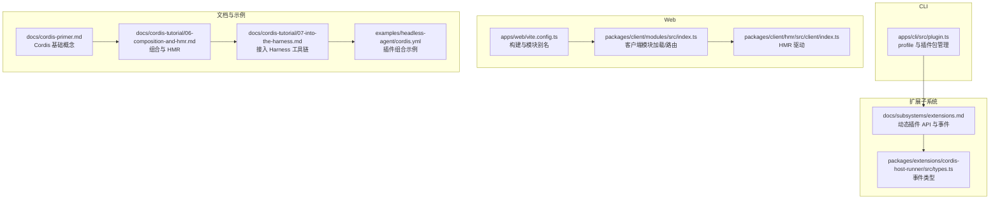
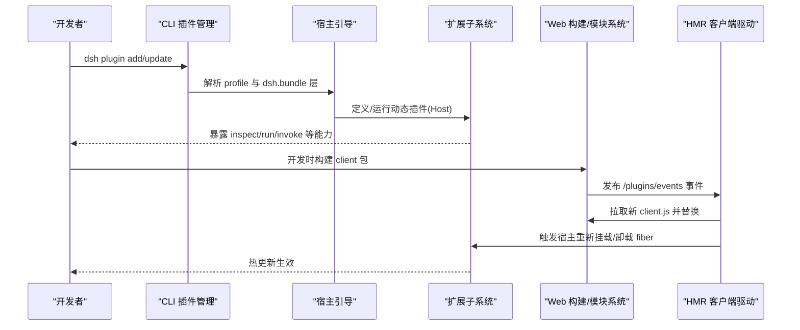
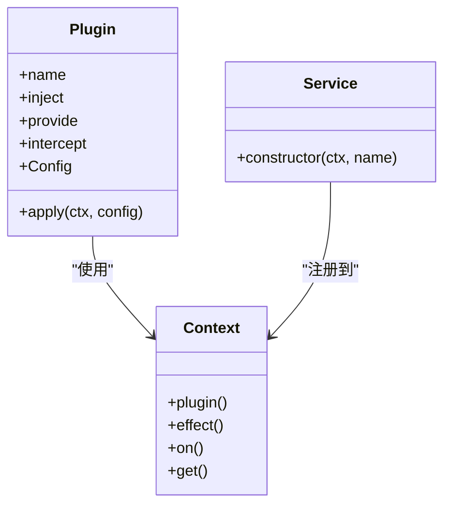
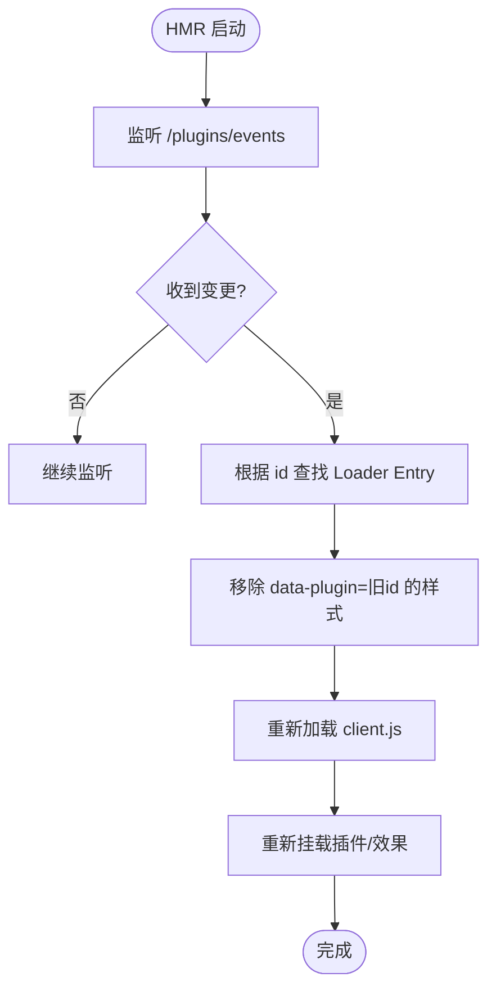
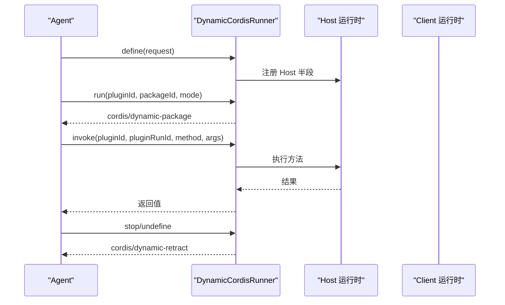
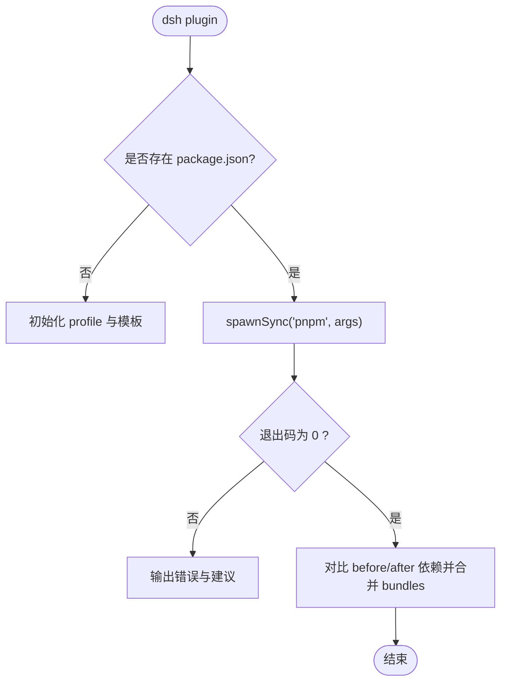
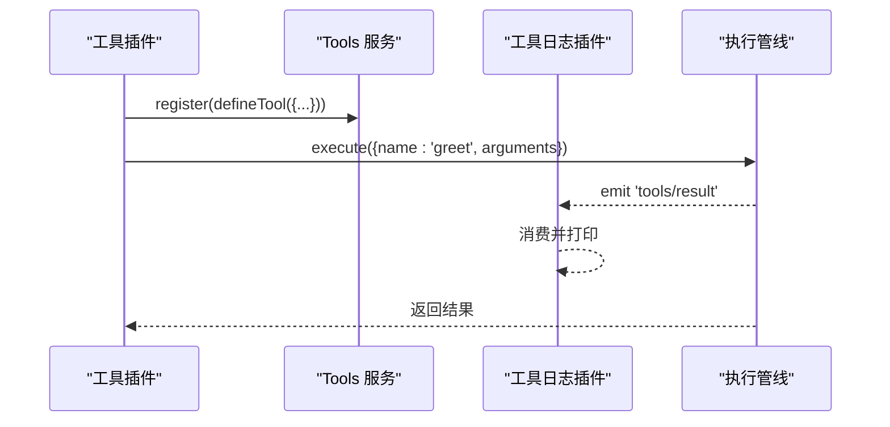
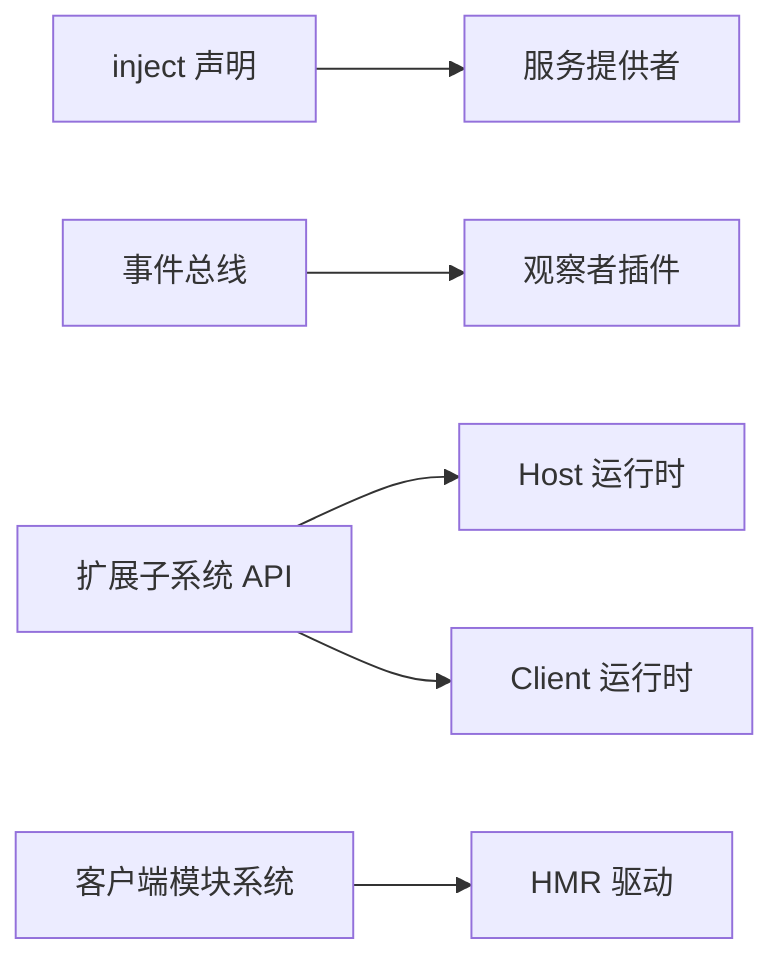

# 高级插件模式

<cite>
**本文引用的文件**
- [apps/cli/src/plugin.ts](file://apps/cli/src/plugin.ts)
- [apps/web/vite.config.ts](file://apps/web/vite.config.ts)
- [packages/client/hmr/src/client/index.ts](file://packages/client/hmr/src/client/index.ts)
- [packages/client/modules/src/index.ts](file://packages/client/modules/src/index.ts)
- [packages/extensions/cordis-host-runner/src/types.ts](file://packages/extensions/cordis-host-runner/src/types.ts)
- [packages/extensions/tool-cordis/tests/cordis-lifecycle.spec.ts](file://packages/extensions/tool-cordis/tests/cordis-lifecycle.spec.ts)
- [docs/cordis-primer.md](file://docs/cordis-primer.md)
- [docs/cordis-tutorial/06-composition-and-hmr.md](file://docs/cordis-tutorial/06-composition-and-hmr.md)
- [docs/cordis-tutorial/07-into-the-harness.md](file://docs/cordis-tutorial/07-into-the-harness.md)
- [docs/subsystems/extensions.md](file://docs/subsystems/extensions.md)
- [examples/headless-agent/cordis.yml](file://examples/headless-agent/cordis.yml)
</cite>

## 目录
1. [简介](#简介)
2. [项目结构](#项目结构)
3. [核心组件](#核心组件)
4. [架构总览](#架构总览)
5. [详细组件分析](#详细组件分析)
6. [依赖关系分析](#依赖关系分析)
7. [性能考量](#性能考量)
8. [故障排查指南](#故障排查指南)
9. [结论](#结论)
10. [附录](#附录)

## 简介
本文件面向希望构建可复用插件库与插件生态的高级开发者，围绕 DeepSeek Harness 的 Cordis 插件体系，系统讲解：
- 插件组合与模块化设计模式（服务、事件、注册表、隔离）
- 热重载（HMR）在宿主与客户端的配置与使用
- 将插件集成到 Harness 主应用（宿主环境适配、扩展点使用）
- 复杂插件架构的设计模式与性能优化策略
- 插件打包、分发与版本管理的最佳实践

## 项目结构
DeepSeek Harness 采用多包工作区组织，插件能力通过 Cordis 以“服务 + 事件 + 配置”的方式组合。关键位置包括：
- CLI 侧：负责 profile 与插件包的安装、解析与层叠管理
- Web 侧：Vite 构建与客户端模块加载、HMR 事件通道
- 扩展子系统：动态插件定义、运行、鉴权与生命周期管理
- 示例与教程：展示如何组合插件、接入工具与服务

图表来源
- [apps/cli/src/plugin.ts:1-159](file://apps/cli/src/plugin.ts#L1-L159)
- [apps/web/vite.config.ts:1-161](file://apps/web/vite.config.ts#L1-L161)
- [packages/client/modules/src/index.ts:421-460](file://packages/client/modules/src/index.ts#L421-L460)
- [packages/client/hmr/src/client/index.ts:69-102](file://packages/client/hmr/src/client/index.ts#L69-L102)
- [docs/subsystems/extensions.md:1-365](file://docs/subsystems/extensions.md#L1-L365)
- [packages/extensions/cordis-host-runner/src/types.ts:259-363](file://packages/extensions/cordis-host-runner/src/types.ts#L259-L363)
- [docs/cordis-primer.md:1-45](file://docs/cordis-primer.md#L1-L45)
- [docs/cordis-tutorial/06-composition-and-hmr.md:1-114](file://docs/cordis-tutorial/06-composition-and-hmr.md#L1-L114)
- [docs/cordis-tutorial/07-into-the-harness.md:1-108](file://docs/cordis-tutorial/07-into-the-harness.md#L1-L108)
- [examples/headless-agent/cordis.yml:1-166](file://examples/headless-agent/cordis.yml#L1-L166)

章节来源
- [apps/cli/src/plugin.ts:1-159](file://apps/cli/src/plugin.ts#L1-L159)
- [apps/web/vite.config.ts:1-161](file://apps/web/vite.config.ts#L1-L161)
- [docs/cordis-primer.md:1-45](file://docs/cordis-primer.md#L1-L45)

## 核心组件
- 插件框架与上下文：Cordis 提供 Context、Service、Inject、Effect、Event 等基础能力，强调声明式依赖与可逆注册。
- 服务与依赖：通过 inject 声明所需服务，确保加载顺序；支持可选依赖与隔离组。
- 事件系统：emit/waterfall/parallel/serial 多种分发模式，解耦插件间通信。
- 动态插件：通过扩展子系统定义、运行、撤销、查询插件，支持 Host/Client 双端。
- 客户端模块系统与 HMR：按包名加载 client.js，监听事件进行热替换，清理样式与状态。
- CLI 插件管理：profile 初始化、pnpm 转发、dsh.bundle 层识别与自动合并。

章节来源
- [docs/cordis-primer.md:1-45](file://docs/cordis-primer.md#L1-L45)
- [docs/cordis-tutorial/06-composition-and-hmr.md:1-114](file://docs/cordis-tutorial/06-composition-and-hmr.md#L1-L114)
- [docs/subsystems/extensions.md:1-365](file://docs/subsystems/extensions.md#L1-L365)
- [apps/cli/src/plugin.ts:1-159](file://apps/cli/src/plugin.ts#L1-L159)

## 架构总览
下图展示了从 CLI 到 Web 再到扩展子系统的插件装配与运行时交互路径，以及 HMR 在客户端的刷新流程。

图表来源
- [apps/cli/src/plugin.ts:1-159](file://apps/cli/src/plugin.ts#L1-L159)
- [docs/subsystems/extensions.md:1-365](file://docs/subsystems/extensions.md#L1-L365)
- [apps/web/vite.config.ts:1-161](file://apps/web/vite.config.ts#L1-L161)
- [packages/client/modules/src/index.ts:421-460](file://packages/client/modules/src/index.ts#L421-L460)
- [packages/client/hmr/src/client/index.ts:69-102](file://packages/client/hmr/src/client/index.ts#L69-L102)

## 详细组件分析

### 组件A：Cordis 插件模型与生命周期
- 插件入口形态：函数、类、对象三种形式，均支持 name、inject、provide、intercept、Config 等元数据。
- 生命周期：加载时等待 inject 依赖就绪；卸载时按 effect 反向释放；服务消失时依赖方自动 dispose 并在回归后重载。
- 诊断：通过 Fiber 状态枚举（如 PENDING）定位未满足依赖或阻塞的插件。

图表来源
- [docs/cordis-api/registry.md:58-119](file://docs/cordis-api/registry.md#L58-L119)
- [docs/cordis-api/registry.zh.md:60-121](file://docs/cordis-api/registry.zh.md#L60-L121)
- [docs/cordis-primer.md:1-45](file://docs/cordis-primer.md#L1-L45)

章节来源
- [docs/cordis-primer.md:1-45](file://docs/cordis-primer.md#L1-L45)
- [docs/cordis-api/registry.md:58-119](file://docs/cordis-api/registry.md#L58-L119)
- [docs/cordis-api/registry.zh.md:60-121](file://docs/cordis-api/registry.zh.md#L60-L121)

### 组件B：HMR 客户端驱动与模块系统
- 模块加载：客户端模块系统提供 /plugins/<id>/client.js 与 .map 的路由，按需读取并返回内容。
- HMR 驱动：订阅 SSE 事件，找到对应 Loader Entry，移除旧样式标签，重新加载模块并挂载。
- 安全与幂等：按 id 精确匹配，避免误删其他插件样式；失败时回退到 404 提示而非静默失败。

图表来源
- [packages/client/modules/src/index.ts:421-460](file://packages/client/modules/src/index.ts#L421-L460)
- [packages/client/hmr/src/client/index.ts:69-102](file://packages/client/hmr/src/client/index.ts#L69-L102)

章节来源
- [packages/client/modules/src/index.ts:421-460](file://packages/client/modules/src/index.ts#L421-L460)
- [packages/client/hmr/src/client/index.ts:69-102](file://packages/client/hmr/src/client/index.ts#L69-L102)

### 组件C：动态插件与扩展点（Host/Client）
- 动态定义与运行：通过 ctx.dynamicCordisRunner 定义、运行、停止、撤销插件，支持 Host/Client 双端。
- 事件总线：cordis/dynamic-package、cordis/dynamic-retract、cordis/request-run 等事件贯穿激活与撤销流程。
- 安全与审计：invoke 调用需携带 pluginRunId，仅对活跃运行授权；渲染失败与守卫拒绝会上报。

图表来源
- [docs/subsystems/extensions.md:1-365](file://docs/subsystems/extensions.md#L1-L365)
- [packages/extensions/cordis-host-runner/src/types.ts:259-363](file://packages/extensions/cordis-host-runner/src/types.ts#L259-L363)

章节来源
- [docs/subsystems/extensions.md:1-365](file://docs/subsystems/extensions.md#L1-L365)
- [packages/extensions/cordis-host-runner/src/types.ts:259-363](file://packages/extensions/cordis-host-runner/src/types.ts#L259-L363)

### 组件D：CLI 插件管理与 Profile 层
- Profile 初始化：首次使用创建 profile 目录与模板。
- pnpm 转发：在 profile 目录执行 pnpm 命令，处理相对路径锚定与 Windows shell 兼容。
- 层合并：扫描已安装包是否声明 dsh.bundle，自动加入 profile 层列表；若不再声明则移除。

图表来源
- [apps/cli/src/plugin.ts:1-159](file://apps/cli/src/plugin.ts#L1-L159)

章节来源
- [apps/cli/src/plugin.ts:1-159](file://apps/cli/src/plugin.ts#L1-L159)

### 组件E：接入 Harness 工具链（工具注册与事件观察）
- 工具注册：通过 ctx.tools.register(defineTool(...)) 注册工具，参数与输出 schema 由框架校验与渲染。
- 事件观察：订阅 tools/result 事件，实现跨插件无侵入观测。
- 组合运行：在 cordis.yml 中组合 dsh-tools 与自定义工具插件，即可通过 Harness 工具管线执行。

图表来源
- [docs/cordis-tutorial/07-into-the-harness.md:1-108](file://docs/cordis-tutorial/07-into-the-harness.md#L1-L108)

章节来源
- [docs/cordis-tutorial/07-into-the-harness.md:1-108](file://docs/cordis-tutorial/07-into-the-harness.md#L1-L108)

### 组件F：Vite 构建与客户端模块别名
- 禁止独立 serve：非通过 dsh web 启动时直接报错，避免缺少 boot manifest。
- 分包策略：将重型第三方包抽到 vendor chunk，语法高亮语言按需分包，字体资源归类。
- 模块别名：将 @deepseek-ai/dsh-client-modules/client 指向客户端模块系统入口，使插件以运行时 bundle 方式加载。

章节来源
- [apps/web/vite.config.ts:1-161](file://apps/web/vite.config.ts#L1-L161)

## 依赖关系分析
- 插件与服务的耦合：通过 inject 声明强依赖，避免隐式导入；可选依赖通过 ctx.get 获取。
- 事件驱动的松耦合：工具执行、渲染失败、动态插件激活等通过事件广播，降低直接调用耦合。
- 客户端与宿主的边界：Host 负责业务逻辑与持久化，Client 负责 UI 与交互，通过扩展子系统的事件与远程调用协调。

图表来源
- [docs/cordis-primer.md:1-45](file://docs/cordis-primer.md#L1-L45)
- [docs/subsystems/extensions.md:1-365](file://docs/subsystems/extensions.md#L1-L365)
- [packages/client/modules/src/index.ts:421-460](file://packages/client/modules/src/index.ts#L421-L460)
- [packages/client/hmr/src/client/index.ts:69-102](file://packages/client/hmr/src/client/index.ts#L69-L102)

章节来源
- [docs/cordis-primer.md:1-45](file://docs/cordis-primer.md#L1-L45)
- [docs/subsystems/extensions.md:1-365](file://docs/subsystems/extensions.md#L1-L365)

## 性能考量
- 依赖图最小化：仅在必要时声明 inject，避免不必要的等待与重挂。
- 事件粒度控制：优先使用 emit 做轻量通知，waterfall/serial 用于需要顺序处理的场景。
- 客户端分包与缓存：将稳定第三方库放入 vendor chunk，减少索引块变化带来的全量失效。
- HMR 精准替换：按 id 匹配并仅移除受影响的样式节点，避免全局重绘。
- 动态插件限流：对频繁 define/run 操作进行节流与队列化，避免过载。

[本节为通用指导，不直接分析具体文件]

## 故障排查指南
- 插件永远 PENDING：检查 inject 中的服务是否被提供；可通过遍历 registry 的 fibers 状态定位缺失依赖。
- HMR 不生效：确认 HMR 插件已加入组合；确认 root 配置包含源码目录；确认浏览器能访问 /plugins/events。
- 工具无输出：确认已组合 dsh-tools；确认工具注册与 execute 调用正确；订阅 tools/result 观察事件。
- 动态插件无法调用：确认 pluginRunId 有效且未被撤销；检查 invoke 权限与请求链路。

章节来源
- [docs/cordis-tutorial/06-composition-and-hmr.md:61-114](file://docs/cordis-tutorial/06-composition-and-hmr.md#L61-L114)
- [docs/cordis-tutorial/07-into-the-harness.md:74-108](file://docs/cordis-tutorial/07-into-the-harness.md#L74-L108)
- [packages/extensions/tool-cordis/tests/cordis-lifecycle.spec.ts:231-287](file://packages/extensions/tool-cordis/tests/cordis-lifecycle.spec.ts#L231-L287)

## 结论
DeepSeek Harness 通过 Cordis 提供了强大的插件化能力：以服务和事件为核心的组合式架构、完善的动态插件生命周期、客户端 HMR 与模块系统，以及 CLI 的 profile 层管理。遵循本文的模式与实践，可以构建高内聚、低耦合、可热更新的插件库与生态系统，并将插件无缝集成到 Harness 主应用中。

[本节为总结性内容，不直接分析具体文件]

## 附录
- 推荐学习路径：先掌握 Cordis 基础概念，再阅读组合与 HMR 教程，最后深入扩展子系统 API。
- 参考示例：headless-agent 的 cordis.yml 展示了完整的服务组合与工具链接入。

章节来源
- [docs/cordis-primer.md:1-45](file://docs/cordis-primer.md#L1-L45)
- [docs/cordis-tutorial/06-composition-and-hmr.md:1-114](file://docs/cordis-tutorial/06-composition-and-hmr.md#L1-L114)
- [examples/headless-agent/cordis.yml:1-166](file://examples/headless-agent/cordis.yml#L1-L166)