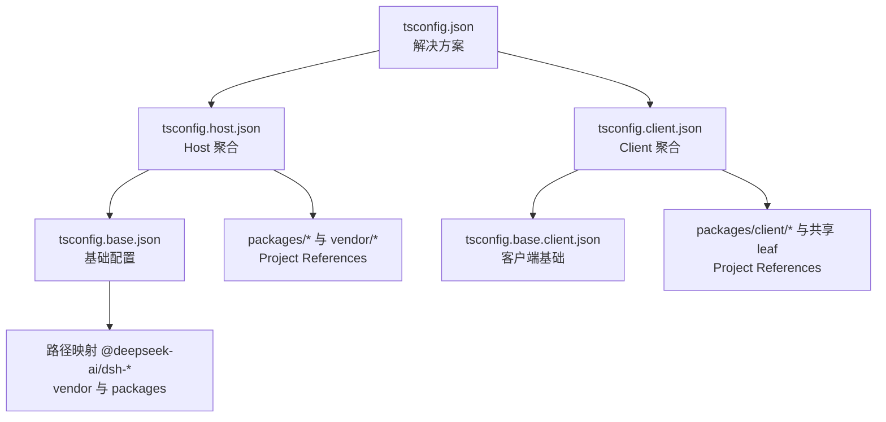
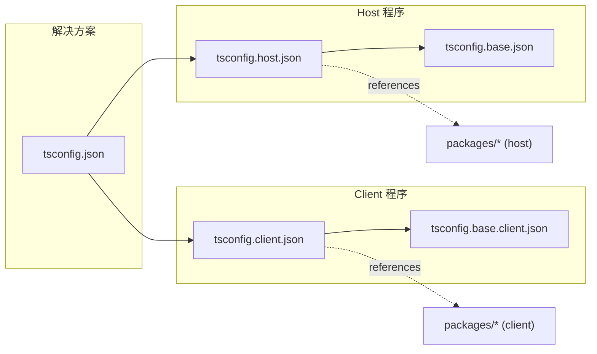
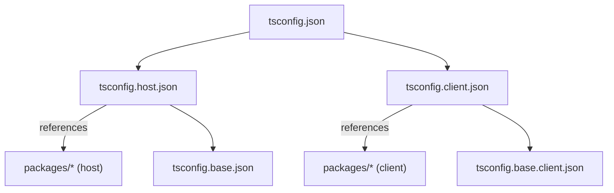
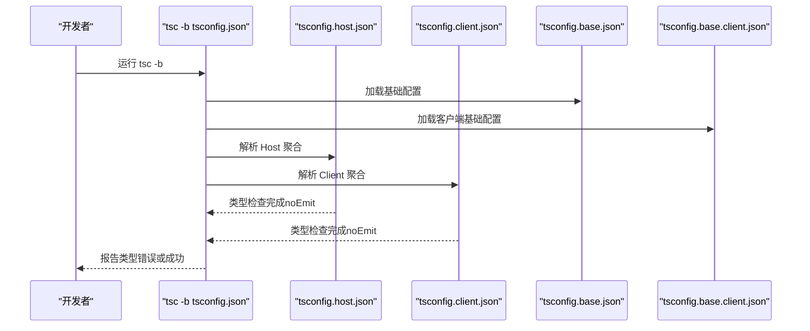

# TypeScript 配置管理

<cite>
**本文引用的文件**
- [tsconfig.base.json](file://tsconfig.base.json)
- [tsconfig.base.client.json](file://tsconfig.base.client.json)
- [tsconfig.host.json](file://tsconfig.host.json)
- [tsconfig.client.json](file://tsconfig.client.json)
- [tsconfig.json](file://tsconfig.json)
- [apps/cli/tsconfig.json](file://apps/cli/tsconfig.json)
- [apps/web/tsconfig.json](file://apps/web/tsconfig.json)
- [packages/core/session/tsconfig.json](file://packages/core/session/tsconfig.json)
- [packages/client/web/tsconfig.json](file://packages/client/web/tsconfig.json)
- [scripts/ts-project.ts](file://scripts/ts-project.ts)
</cite>

## 目录
1. [简介](#简介)
2. [项目结构](#项目结构)
3. [核心组件](#核心组件)
4. [架构总览](#架构总览)
5. [详细组件分析](#详细组件分析)
6. [依赖关系分析](#依赖关系分析)
7. [性能考量](#性能考量)
8. [故障排查指南](#故障排查指南)
9. [结论](#结论)
10. [附录：自定义与最佳实践](#附录：自定义与最佳实践)

## 简介
本仓库采用“基础配置 + 聚合配置 + 包级配置”的分层策略，通过 TypeScript Project References 组织多包、多目标的类型检查与构建。根 tsconfig.json 作为解决方案入口，将 Host 与 Client 两个聚合程序解耦；tsconfig.base.json 提供全局编译选项与路径映射；tsconfig.base.client.json 为客户端侧共享配置；Host/Client 聚合分别声明 include/exclude 与 references，确保两侧不会合并同一 Context 键，避免类型冲突。

## 项目结构
- 根解决方案：tsconfig.json 引用 tsconfig.host.json 与 tsconfig.client.json，保持 Host/Client 两个独立的 TypeScript Program。
- 基础配置：tsconfig.base.json 定义目标版本、模块解析、严格模式、增量编译、路径别名等。
- 客户端基础：tsconfig.base.client.json 继承基础配置，设置浏览器库、JSX 与类型环境。
- 聚合配置：
  - tsconfig.host.json：Host 侧类型检查聚合，包含大量 packages/* 与 vendor/* 的 project references，并排除 client 侧测试与源码。
  - tsconfig.client.json：Client 侧类型检查聚合，引用 client 相关包与 webserver 等共享 leaf，并排除 host 侧测试。
- 应用与包：
  - apps/cli/tsconfig.json、apps/web/tsconfig.json：各自扩展基础配置，声明 rootDir/outDir/include/references。
  - packages/*/tsconfig.json：每个包扩展基础或客户端基础配置，声明自身引用与输出目录。

图表来源
- [tsconfig.json:1-16](file://tsconfig.json#L1-L16)
- [tsconfig.host.json:1-12](file://tsconfig.host.json#L1-L12)
- [tsconfig.client.json:1-15](file://tsconfig.client.json#L1-L15)
- [tsconfig.base.json:1-30](file://tsconfig.base.json#L1-L30)
- [tsconfig.base.client.json:1-12](file://tsconfig.base.client.json#L1-L12)

章节来源
- [tsconfig.json:1-16](file://tsconfig.json#L1-L16)
- [tsconfig.base.json:1-30](file://tsconfig.base.json#L1-L30)
- [tsconfig.base.client.json:1-12](file://tsconfig.base.client.json#L1-L12)
- [tsconfig.host.json:1-12](file://tsconfig.host.json#L1-L12)
- [tsconfig.client.json:1-15](file://tsconfig.client.json#L1-L15)

## 核心组件
- 基础配置（tsconfig.base.json）
  - 目标与模块：target=es2024，module=esnext，moduleResolution=bundler。
  - 类型与声明：declaration=true，declarationMap=true，sourceMap=true，incremental=true，composite=true。
  - 严格模式：strict=true，noUncheckedIndexedAccess=true，exactOptionalPropertyTypes=true，noImplicitOverride=true，noFallthroughCasesInSwitch=true，noUnusedLocals=true，noUnusedParameters=true。
  - 模块语法：esModuleInterop=true，allowImportingTsExtensions=true，rewriteRelativeImportExtensions=true，verbatimModuleSyntax=false。
  - 类型环境：types=["node"]。
  - 路径映射：集中定义 @deepseek-ai/dsh-* 与 vendor 包的源路径映射，支持通配符与子路径导出。
- 客户端基础（tsconfig.base.client.json）
  - 继承基础配置，覆盖 lib=["ES2024","DOM","DOM.Iterable"]，jsx="react-jsx"，types=[]（由具体包按需添加）。
- Host 聚合（tsconfig.host.json）
  - noEmit=true，rewriteRelativeImportExtensions=false，include 大量 e2e/test/scripts/website，exclude 排除 client 侧源码与测试。
  - references 指向所有需要参与 Host 类型检查的包与 vendor。
- Client 聚合（tsconfig.client.json）
  - noEmit=true，rewriteRelativeImportExtensions=false，types=["node"]（测试在 Node 执行），include 客户端测试与 CSS 声明，exclude 排除 host 侧测试。
  - references 指向 client 相关包与共享 leaf（如 webserver、compaction 等）。

章节来源
- [tsconfig.base.json:5-27](file://tsconfig.base.json#L5-L27)
- [tsconfig.base.json:27-278](file://tsconfig.base.json#L27-L278)
- [tsconfig.base.client.json:1-12](file://tsconfig.base.client.json#L1-L12)
- [tsconfig.host.json:1-12](file://tsconfig.host.json#L1-L12)
- [tsconfig.host.json:10-108](file://tsconfig.host.json#L10-L108)
- [tsconfig.host.json:109-297](file://tsconfig.host.json#L109-L297)
- [tsconfig.client.json:1-15](file://tsconfig.client.json#L1-L15)
- [tsconfig.client.json:16-37](file://tsconfig.client.json#L16-L37)
- [tsconfig.client.json:38-97](file://tsconfig.client.json#L38-L97)

## 架构总览
Host 与 Client 是两个独立的 TypeScript Program，通过 tsconfig.json 组合。两者共享基础配置与部分 leaf 包（通过各自的 references 引入），但通过 include/exclude 与路径别名隔离，避免合并 cordis Context 的同名键导致类型冲突。

图表来源
- [tsconfig.json:1-16](file://tsconfig.json#L1-L16)
- [tsconfig.host.json:1-12](file://tsconfig.host.json#L1-L12)
- [tsconfig.client.json:1-15](file://tsconfig.client.json#L1-L15)
- [tsconfig.base.json:1-30](file://tsconfig.base.json#L1-L30)
- [tsconfig.base.client.json:1-12](file://tsconfig.base.client.json#L1-L12)

## 详细组件分析

### 基础配置（tsconfig.base.json）
- 目标与模块
  - target=es2024，module=esnext，moduleResolution=bundler，适配现代 bundler 生态。
- 严格模式与类型安全
  - strict=true，noUncheckedIndexedAccess=true，exactOptionalPropertyTypes=true，noImplicitOverride=true，noFallthroughCasesInSwitch=true，noUnusedLocals=true，noUnusedParameters=true。
- 增量与复合
  - composite=true，incremental=true，配合 Project References 实现跨包增量编译。
- 模块语法
  - esModuleInterop=true，allowImportingTsExtensions=true，rewriteRelativeImportExtensions=true，verbatimModuleSyntax=false。
- 类型环境
  - types=["node"]，供宿主侧使用；客户端基础覆盖 types=[]，由各包按需引入。
- 路径映射
  - 集中维护 @deepseek-ai/dsh-* 与 vendor 包的源路径映射，支持通配符与子路径导出，便于统一解析与开发体验。

章节来源
- [tsconfig.base.json:5-27](file://tsconfig.base.json#L5-L27)
- [tsconfig.base.json:27-278](file://tsconfig.base.json#L27-L278)

### Host 与 Client 聚合差异
- 路径映射策略
  - 两者均继承基础配置的 paths，但通过各自的 references 与 include/exclude 控制可见范围。
- 类型定义分离
  - Host 聚合 types=["node"]（默认），Client 聚合在测试场景下 types=["node"]，而客户端源码 lib 包含 DOM。
- 构建优化
  - 两者均 noEmit=true（仅类型检查），composite/incremental 启用以加速增量编译。
  - Host 聚合 exclude 大量 client 侧测试与源码；Client 聚合 exclude host 侧测试，避免上下文合并冲突。

章节来源
- [tsconfig.host.json:1-12](file://tsconfig.host.json#L1-L12)
- [tsconfig.host.json:10-108](file://tsconfig.host.json#L10-L108)
- [tsconfig.client.json:1-15](file://tsconfig.client.json#L1-L15)
- [tsconfig.client.json:16-37](file://tsconfig.client.json#L16-L37)

### 包间依赖管理
- 项目引用机制
  - 通过 references 显式声明依赖，保证类型图完整且可增量构建。
  - Host 聚合引用大量 packages/* 与 vendor/*；Client 聚合引用 client 相关包与共享 leaf。
- 路径别名配置
  - 基础配置中集中维护 @deepseek-ai/dsh-* 与 vendor 的路径映射，简化导入并统一解析。
- 模块解析规则
  - moduleResolution=bundler，配合 rewriteRelativeImportExtensions=true，提升与 bundler 的一致性。

章节来源
- [tsconfig.base.json:27-278](file://tsconfig.base.json#L27-L278)
- [tsconfig.host.json:109-297](file://tsconfig.host.json#L109-L297)
- [tsconfig.client.json:38-97](file://tsconfig.client.json#L38-L97)

### 自定义 TypeScript 配置方法
- 添加新包
  - 在包内创建 tsconfig.json，extends 基础或客户端基础配置，设置 rootDir/outDir/include，并在父聚合（Host/Client）的 references 中添加该包路径。
  - 若需新增路径别名，在 tsconfig.base.json 的 paths 中添加映射。
- 修改编译选项
  - 优先在基础配置中调整通用选项；针对特定环境（如客户端）在 tsconfig.base.client.json 或包级配置中覆盖。
- 集成第三方类型定义
  - 在包级 tsconfig.json 的 compilerOptions.types 中添加所需类型包；或在聚合配置中按环境注入。

章节来源
- [packages/core/session/tsconfig.json:1-34](file://packages/core/session/tsconfig.json#L1-L34)
- [packages/client/web/tsconfig.json:1-46](file://packages/client/web/tsconfig.json#L1-L46)
- [tsconfig.base.json:27-278](file://tsconfig.base.json#L27-L278)

### 类型检查最佳实践
- 严格模式配置
  - 保持 strict=true，启用 noUncheckedIndexedAccess、exactOptionalPropertyTypes、noImplicitOverride、noFallthroughCasesInSwitch 等，提高类型安全性。
- 类型安全与错误处理
  - 使用 Project References 明确依赖边界，避免隐式依赖；通过 noUnusedLocals/noUnusedParameters 清理无用代码。
  - 在测试环境中按需引入 types=["node"]，在客户端源码中通过 lib 指定 DOM 能力。

章节来源
- [tsconfig.base.json:5-27](file://tsconfig.base.json#L5-L27)
- [tsconfig.base.client.json:1-12](file://tsconfig.base.client.json#L1-L12)
- [tsconfig.client.json:1-15](file://tsconfig.client.json#L1-L15)

## 依赖关系分析
- 聚合依赖
  - tsconfig.json 作为解决方案，引用 Host 与 Client 两个聚合。
  - Host 聚合引用大量 packages/* 与 vendor/*，形成完整的宿主侧类型图。
  - Client 聚合引用 client 相关包与共享 leaf，形成客户端类型图。
- 包级依赖
  - 各包通过 references 声明对其它包的依赖，确保类型检查时符号解析正确。

图表来源
- [tsconfig.json:1-16](file://tsconfig.json#L1-L16)
- [tsconfig.host.json:109-297](file://tsconfig.host.json#L109-L297)
- [tsconfig.client.json:38-97](file://tsconfig.client.json#L38-L97)
- [tsconfig.base.json:1-30](file://tsconfig.base.json#L1-L30)
- [tsconfig.base.client.json:1-12](file://tsconfig.base.client.json#L1-L12)

章节来源
- [tsconfig.json:1-16](file://tsconfig.json#L1-L16)
- [tsconfig.host.json:109-297](file://tsconfig.host.json#L109-L297)
- [tsconfig.client.json:38-97](file://tsconfig.client.json#L38-L97)

## 性能考量
- 增量编译
  - composite=true 与 incremental=true 启用后，TypeScript 会缓存中间结果，显著提升大型仓库的增量构建速度。
- 模块化与引用
  - 通过 Project References 将大仓库拆分为多个小 Program，减少单次编译范围，提升响应速度。
- 路径映射
  - 集中路径映射减少重复配置，降低解析开销，同时便于统一管理。

[本节为通用指导，不直接分析具体文件]

## 故障排查指南
- 常见配置问题
  - 路径别名未生效：检查 tsconfig.base.json 中的 paths 是否包含对应映射，并确保包级 tsconfig 已 extends 基础配置。
  - 类型冲突（Context 合并）：确认 Host/Client 聚合的 include/exclude 是否正确分离，避免双方同时看到同一 Context 键。
  - 测试环境类型缺失：在 tsconfig.client.json 中 types=["node"] 用于测试执行；客户端源码通过 lib 指定 DOM。
- 脚本辅助
  - scripts/ts-project.ts 提供加载 Host 聚合并扁平化为单一语义图的能力，可用于诊断与工具链集成。

章节来源
- [tsconfig.base.json:27-278](file://tsconfig.base.json#L27-L278)
- [tsconfig.host.json:10-108](file://tsconfig.host.json#L10-L108)
- [tsconfig.client.json:16-37](file://tsconfig.client.json#L16-L37)
- [scripts/ts-project.ts:31-52](file://scripts/ts-project.ts#L31-L52)

## 结论
本仓库通过分层配置与 Project References 实现了清晰的 Host/Client 类型检查边界，结合严格模式与增量编译，兼顾了类型安全与构建性能。路径映射集中管理，便于扩展与维护。开发者可按需添加包、调整编译选项与集成类型定义，遵循最佳实践以确保类型一致性与可维护性。

[本节为总结，不直接分析具体文件]

## 附录：自定义与最佳实践

### 添加新包步骤
- 在包目录下创建 tsconfig.json，extends 基础或客户端基础配置，设置 rootDir/outDir/include。
- 在父聚合（Host/Client）的 references 中添加该包路径。
- 如需路径别名，在 tsconfig.base.json 的 paths 中添加映射。

章节来源
- [packages/core/session/tsconfig.json:1-34](file://packages/core/session/tsconfig.json#L1-L34)
- [packages/client/web/tsconfig.json:1-46](file://packages/client/web/tsconfig.json#L1-L46)
- [tsconfig.base.json:27-278](file://tsconfig.base.json#L27-L278)

### 修改编译选项
- 通用选项在 tsconfig.base.json 中调整。
- 客户端特定选项在 tsconfig.base.client.json 或包级配置中覆盖。
- 测试环境类型在 tsconfig.client.json 中注入 types=["node"]。

章节来源
- [tsconfig.base.json:5-27](file://tsconfig.base.json#L5-L27)
- [tsconfig.base.client.json:1-12](file://tsconfig.base.client.json#L1-L12)
- [tsconfig.client.json:1-15](file://tsconfig.client.json#L1-L15)

### 集成第三方类型定义
- 在包级 tsconfig.json 的 compilerOptions.types 中添加所需类型包。
- 或在聚合配置中按环境注入，避免污染无关程序。

章节来源
- [packages/core/session/tsconfig.json:1-34](file://packages/core/session/tsconfig.json#L1-L34)
- [packages/client/web/tsconfig.json:1-46](file://packages/client/web/tsconfig.json#L1-L46)

### 类型检查流程示意

图表来源
- [tsconfig.json:1-16](file://tsconfig.json#L1-L16)
- [tsconfig.base.json:1-30](file://tsconfig.base.json#L1-L30)
- [tsconfig.base.client.json:1-12](file://tsconfig.base.client.json#L1-L12)
- [tsconfig.host.json:1-12](file://tsconfig.host.json#L1-L12)
- [tsconfig.client.json:1-15](file://tsconfig.client.json#L1-L15)