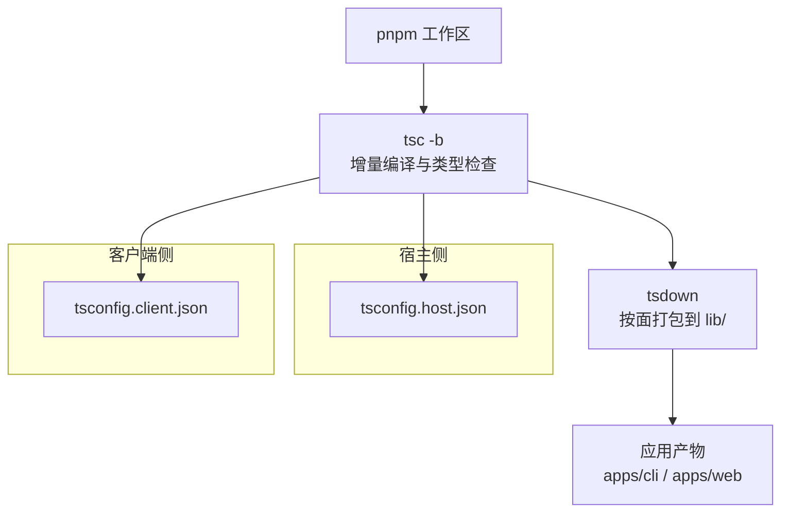
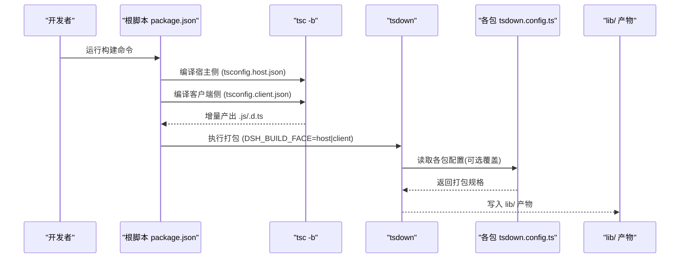
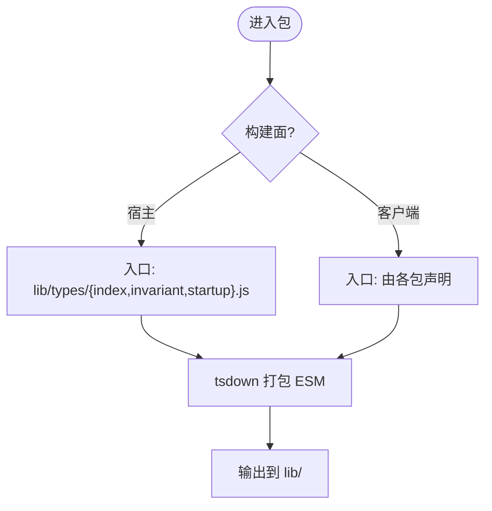
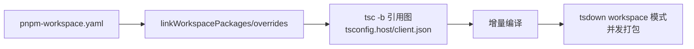
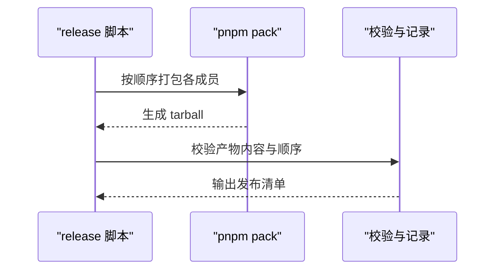
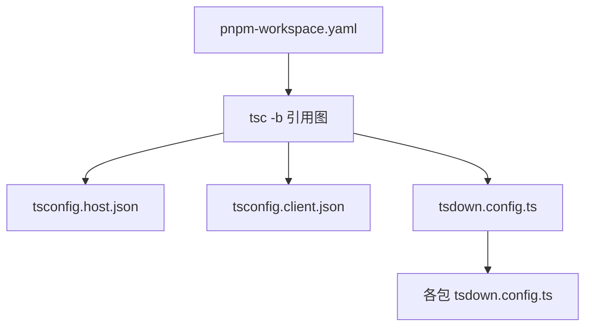

# 包构建流程

<cite>
**本文引用的文件**
- [package.json](file://package.json)
- [pnpm-workspace.yaml](file://pnpm-workspace.yaml)
- [tsconfig.base.json](file://tsconfig.base.json)
- [tsconfig.json](file://tsconfig.json)
- [tsconfig.host.json](file://tsconfig.host.json)
- [tsconfig.client.json](file://tsconfig.client.json)
- [tsdown.config.ts](file://tsdown.config.ts)
- [scripts/dev-web.ts](file://scripts/dev-web.ts)
- [scripts/release/bump.ts](file://scripts/release/bump.ts)
- [scripts/release/pack.ts](file://scripts/release/pack.ts)
- [apps/cli/tsdown.config.ts](file://apps/cli/tsdown.config.ts)
- [packages/api/gateway/tsdown.config.ts](file://packages/api/gateway/tsdown.config.ts)
- [packages/client/runtime/src/env.d.ts](file://packages/client/runtime/src/env.d.ts)
</cite>

## 目录
1. [简介](#简介)
2. [项目结构](#项目结构)
3. [核心组件](#核心组件)
4. [架构总览](#架构总览)
5. [详细组件分析](#详细组件分析)
6. [依赖分析](#依赖分析)
7. [性能考虑](#性能考虑)
8. [故障排查指南](#故障排查指南)
9. [结论](#结论)
10. [附录](#附录)

## 简介
本文件面向包开发者，系统化说明仓库的包构建流程：从单个包的 TypeScript 编译、声明文件生成与依赖打包，到多包工作区的依赖顺序解析、增量编译与并行构建；并覆盖构建产物管理（输出结构、版本控制与发布准备）、自定义构建扩展（修改配置、添加钩子、集成质量工具）以及优化技巧（树摇、代码分割、缓存策略）。目标是让读者掌握完整的构建理解与优化能力。

## 项目结构
仓库采用 pnpm 工作区组织，根脚本将“宿主侧”和“客户端侧”两类构建解耦，并通过 TypeScript Project References 实现增量编译与类型检查边界。构建由两步组成：
- tsc -b：基于 tsconfig.* 进行增量编译，产出 .js/.d.ts 及映射文件，同时维护增量状态。
- tsdown：对已编译的 JS 进行打包，统一输出到 lib/，并按“宿主/客户端”两种构建面选择不同入口与插件。

图表来源
- [package.json:19-24](file://package.json#L19-L24)
- [tsconfig.json:1-15](file://tsconfig.json#L1-L15)
- [tsconfig.host.json:1-10](file://tsconfig.host.json#L1-L10)
- [tsconfig.client.json:1-15](file://tsconfig.client.json#L1-L15)
- [tsdown.config.ts:16-29](file://tsdown.config.ts#L16-L29)

章节来源
- [package.json:19-24](file://package.json#L19-L24)
- [pnpm-workspace.yaml:1-22](file://pnpm-workspace.yaml#L1-L22)
- [tsconfig.json:1-15](file://tsconfig.json#L1-L15)

## 核心组件
- 工作区与依赖解析
  - pnpm-workspace.yaml 定义工作区成员、linkWorkspacePackages、allowBuilds 等，确保本地源码优先解析与受控安装/构建。
- TypeScript 编译与类型检查
  - tsconfig.base.json 提供全局编译器选项（目标 ES2024、模块解析为 bundler、开启 declaration/sourceMap/composite/incremental 等），并通过 paths 将内部别名指向源码路径。
  - tsconfig.json 作为解决方案文件，引用 host/client 两个聚合程序，避免合并两侧 Context。
  - tsconfig.host.json 与 tsconfig.client.json 分别限定 include/exclude 与 references，形成独立的类型检查单元。
- 打包器与构建面
  - tsdown.config.ts 以 workspace 模式扫描 vendor/* 与 packages/*/*，根据环境变量 DSH_BUILD_FACE 决定宿主或客户端构建面，并设置输出目录、格式、平台、目标与插件。
  - 各包可拥有自己的 tsdown.config.ts 以覆盖默认行为（如 apps/cli、packages/api/gateway 等）。
- 开发时监听
  - scripts/dev-web.ts 封装了 tsdown 的 watch 模式与 build:done 钩子，用于开发期增量构建与就绪同步。

章节来源
- [pnpm-workspace.yaml:1-22](file://pnpm-workspace.yaml#L1-L22)
- [tsconfig.base.json:5-18](file://tsconfig.base.json#L5-L18)
- [tsconfig.json:1-15](file://tsconfig.json#L1-L15)
- [tsconfig.host.json:1-10](file://tsconfig.host.json#L1-L10)
- [tsconfig.client.json:1-15](file://tsconfig.client.json#L1-L15)
- [tsdown.config.ts:16-29](file://tsdown.config.ts#L16-L29)
- [scripts/dev-web.ts:47-86](file://scripts/dev-web.ts#L47-L86)

## 架构总览
下图展示了从根脚本到最终产物的完整构建链路，包括宿主/客户端两条路径与共享的基础配置。

图表来源
- [package.json:19-24](file://package.json#L19-L24)
- [tsconfig.host.json:109-296](file://tsconfig.host.json#L109-L296)
- [tsconfig.client.json:38-96](file://tsconfig.client.json#L38-L96)
- [tsdown.config.ts:16-29](file://tsdown.config.ts#L16-L29)
- [apps/cli/tsdown.config.ts](file://apps/cli/tsdown.config.ts)
- [packages/api/gateway/tsdown.config.ts](file://packages/api/gateway/tsdown.config.ts)

## 详细组件分析

### 单个包的构建过程（TypeScript 编译、声明文件生成、依赖打包）
- 编译阶段
  - 通过 tsconfig.base.json 启用 composite/incremental，配合 Project References，实现跨包增量编译与类型检查。
  - 每个包在宿主或客户端聚合中通过 references 被纳入图，保证依赖顺序正确。
- 声明文件
  - 基础配置开启 declaration/declarationMap，由 tsc -b 负责生成 .d.ts 与映射文件，位于 lib/types 下（由 tsdown 打包时的输入约定）。
- 打包阶段
  - tsdown 以 workspace 模式遍历 vendor/* 与 packages/*/*，读取各包 tsdown.config.ts 或默认规则，将已编译的 JS 打包为 ESM，输出到 lib/。
  - 构建面由 DSH_BUILD_FACE 控制：宿主面使用 lib/types/*.js 作为入口；客户端面为空字符串表示由各包自行声明浏览器入口。

图表来源
- [tsdown.config.ts:16-29](file://tsdown.config.ts#L16-L29)
- [tsconfig.base.json:5-18](file://tsconfig.base.json#L5-L18)

章节来源
- [tsconfig.base.json:5-18](file://tsconfig.base.json#L5-L18)
- [tsdown.config.ts:16-29](file://tsdown.config.ts#L16-L29)

### 多包工作区构建（依赖顺序、增量编译、并行构建）
- 依赖顺序解析
  - pnpm-workspace.yaml 通过 linkWorkspacePackages 与 overrides 将同名包解析到本地源码，避免注册表副本导致的双份依赖。
  - tsconfig.host.json 与 tsconfig.client.json 的 references 列表显式声明依赖关系，tsc -b 据此确定构建顺序。
- 增量编译
  - 启用 incremental/composite，tsc 维护增量状态，仅重编译变更依赖链上的包。
- 并行构建
  - tsc -b 在多核上并行编译引用图；tsdown 的 workspace 模式也会并发处理多个包。

图表来源
- [pnpm-workspace.yaml:23-56](file://pnpm-workspace.yaml#L23-L56)
- [tsconfig.host.json:109-296](file://tsconfig.host.json#L109-L296)
- [tsconfig.client.json:38-96](file://tsconfig.client.json#L38-L96)
- [tsdown.config.ts:16-29](file://tsdown.config.ts#L16-L29)

章节来源
- [pnpm-workspace.yaml:23-56](file://pnpm-workspace.yaml#L23-L56)
- [tsconfig.host.json:109-296](file://tsconfig.host.json#L109-L296)
- [tsconfig.client.json:38-96](file://tsconfig.client.json#L38-L96)

### 构建输出管理（产物结构、版本控制、发布准备）
- 产物结构
  - tsc 产出 .js/.d.ts 与映射文件；tsdown 将 JS 打包至 lib/，保持宿主/客户端两套产物。
  - 客户端环境通过 env.d.ts 声明 process.env 以便构建期替换常量。
- 版本控制
  - scripts/release/bump.ts 支持 dsh 家族共享版本与 vendor 家族独立版本递增，更新 manifest 与 lockfile，提交后人工打标签。
- 发布准备
  - scripts/release/pack.ts 按发布顺序打包所有成员为 tarball，校验产物内容并记录发布顺序，供后续发布步骤使用。

图表来源
- [scripts/release/bump.ts:1-369](file://scripts/release/bump.ts#L1-L369)
- [scripts/release/pack.ts:1-62](file://scripts/release/pack.ts#L1-L62)
- [packages/client/runtime/src/env.d.ts:1-5](file://packages/client/runtime/src/env.d.ts#L1-L5)

章节来源
- [scripts/release/bump.ts:1-369](file://scripts/release/bump.ts#L1-L369)
- [scripts/release/pack.ts:1-62](file://scripts/release/pack.ts#L1-L62)
- [packages/client/runtime/src/env.d.ts:1-5](file://packages/client/runtime/src/env.d.ts#L1-L5)

### 自定义包构建（修改配置、添加钩子、集成质量工具）
- 修改构建配置
  - 在包目录下新增/编辑 tsdown.config.ts 覆盖默认行为（例如 apps/cli、packages/api/gateway）。
  - 通过 tsconfig.* 调整编译选项与引用关系。
- 添加构建钩子
  - 使用 tsdown 的 hooks（如 build:done）实现构建完成后的动作，参考 scripts/dev-web.ts 中的用法。
- 集成代码质量工具
  - 根脚本集成了 lint/typecheck/test 等任务，可在构建前后接入（如 run-oxlint、doc-typecheck 等）。

章节来源
- [apps/cli/tsdown.config.ts](file://apps/cli/tsdown.config.ts)
- [packages/api/gateway/tsdown.config.ts](file://packages/api/gateway/tsdown.config.ts)
- [scripts/dev-web.ts:47-86](file://scripts/dev-web.ts#L47-L86)
- [package.json:19-142](file://package.json#L19-L142)

### 构建优化技巧（树摇、代码分割、缓存策略）
- 树摇优化
  - 使用 ESM 与 bundler 模块解析，结合 tsdown 的 tree-shaking 能力移除未使用代码。
- 代码分割
  - 客户端构建面由各包声明入口，便于按功能域拆分；宿主面集中入口利于内联公共逻辑。
- 缓存策略
  - 利用 tsc 的 incremental 与 tsdown 的 clean:false 保留中间态，减少重复构建时间。
  - 开发时使用 watch 模式与 build:done 钩子提升迭代效率。

章节来源
- [tsdown.config.ts:16-29](file://tsdown.config.ts#L16-L29)
- [tsconfig.base.json:5-18](file://tsconfig.base.json#L5-L18)
- [scripts/dev-web.ts:47-86](file://scripts/dev-web.ts#L47-L86)

## 依赖分析
- 组件耦合与内聚
  - 宿主/客户端通过各自 tsconfig 聚合，共享 leaf 包通过 references 复用，降低耦合。
- 直接/间接依赖
  - pnpm-workspace.yaml 的 linkWorkspacePackages 与 overrides 确保本地源码优先；vendor 包通过 link: 方式引入。
- 外部依赖与集成点
  - tsc 与 tsdown 是核心工具链；release 脚本与 pnpm pack 构成发布流水线。

图表来源
- [pnpm-workspace.yaml:1-22](file://pnpm-workspace.yaml#L1-L22)
- [tsconfig.host.json:109-296](file://tsconfig.host.json#L109-L296)
- [tsconfig.client.json:38-96](file://tsconfig.client.json#L38-L96)
- [tsdown.config.ts:16-29](file://tsdown.config.ts#L16-L29)

章节来源
- [pnpm-workspace.yaml:1-22](file://pnpm-workspace.yaml#L1-L22)
- [tsconfig.host.json:109-296](file://tsconfig.host.json#L109-L296)
- [tsconfig.client.json:38-96](file://tsconfig.client.json#L38-L96)
- [tsdown.config.ts:16-29](file://tsdown.config.ts#L16-L29)

## 性能考虑
- 增量编译：启用 composite/incremental，避免全量重建。
- 并行构建：tsc -b 与 tsdown workspace 模式均支持并发。
- 减少无效清理：tsdown 关闭 clean，保留中间态。
- 开发体验：watch + build:done 钩子提升反馈速度。

[本节为通用指导，不直接分析具体文件]

## 故障排查指南
- 构建面错误
  - 症状：DSH_BUILD_FACE 非 host/client 时报错。
  - 定位：tsdown.config.ts 的环境变量校验。
- 工作区安装/构建被阻断
  - 症状：pnpm 阻止某些包的 prepare/build 脚本。
  - 处理：在 pnpm-workspace.yaml 的 allowBuilds 中添加对应包名。
- 锁定文件不一致
  - 症状：发布前锁文件与 manifest 不一致。
  - 处理：使用 release:bump 更新版本并重新生成锁文件。
- 产物缺失或顺序错误
  - 症状：pack 后缺少 tarball 或顺序不正确。
  - 处理：检查 release:pack 的输出与校验日志。

章节来源
- [tsdown.config.ts:4-8](file://tsdown.config.ts#L4-L8)
- [pnpm-workspace.yaml:35-56](file://pnpm-workspace.yaml#L35-L56)
- [scripts/release/bump.ts:300-369](file://scripts/release/bump.ts#L300-L369)
- [scripts/release/pack.ts:37-62](file://scripts/release/pack.ts#L37-L62)

## 结论
本仓库采用“tsc -b + tsdown”的两段式构建：前者负责增量编译与类型检查，后者负责按构建面打包。通过 pnpm 工作区与 TypeScript Project References 精确控制依赖顺序与增量状态，配合 release 脚本完成版本管理与发布打包。开发者可通过包级 tsdown.config.ts 定制构建行为，利用钩子与质量工具增强流程，并以增量、并行与缓存策略优化构建性能。

## 附录
- 常用命令
  - 构建宿主与客户端库：见根脚本 build:lib:host/build:lib:client。
  - 构建 Web：见根脚本 build:web。
  - 类型检查：见根脚本 typecheck。
  - 发布流程：见 release:dsh/release:vendor/release:pack。

章节来源
- [package.json:19-142](file://package.json#L19-L142)