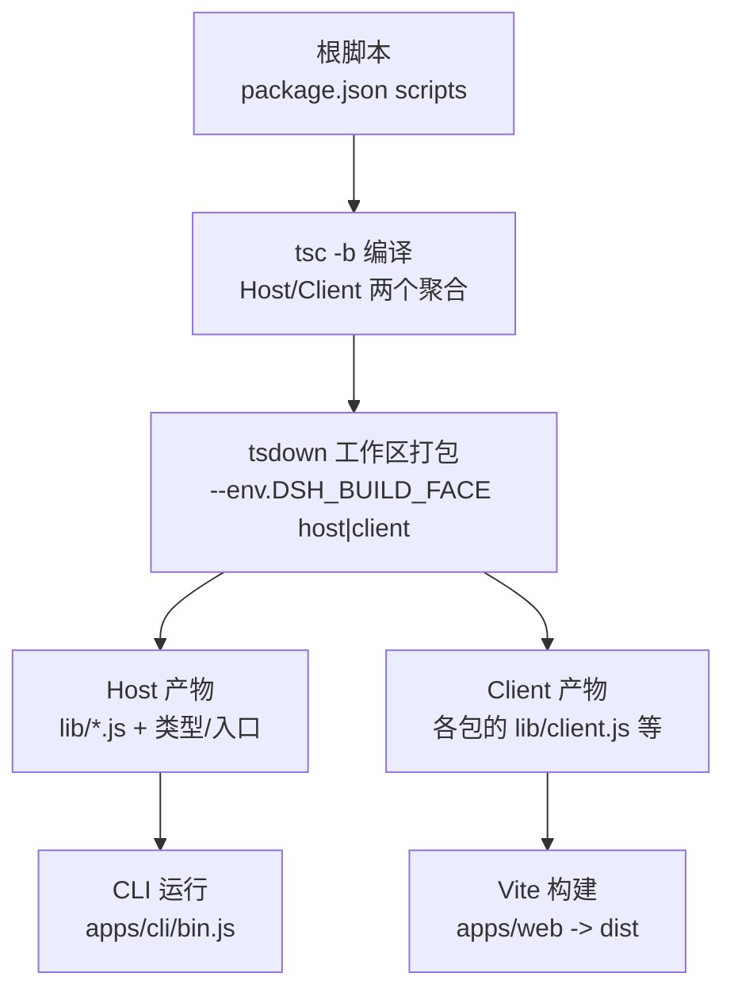
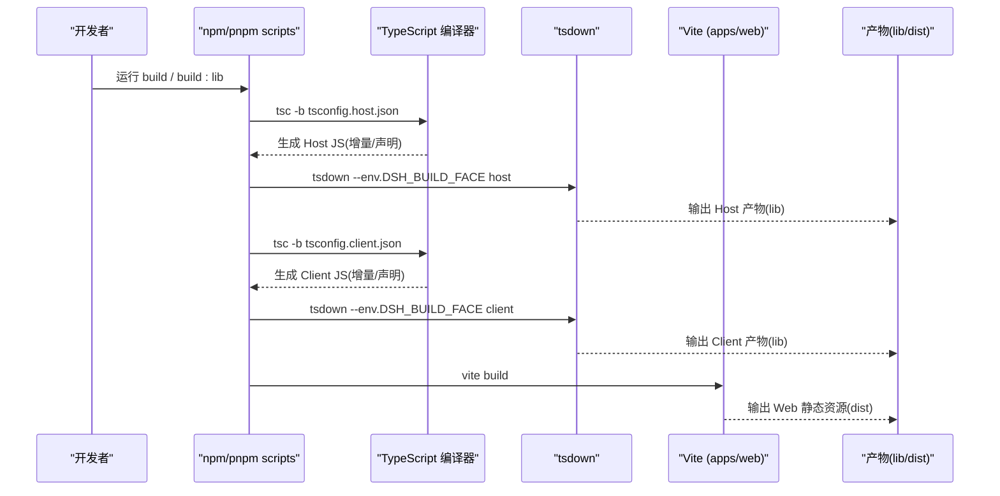
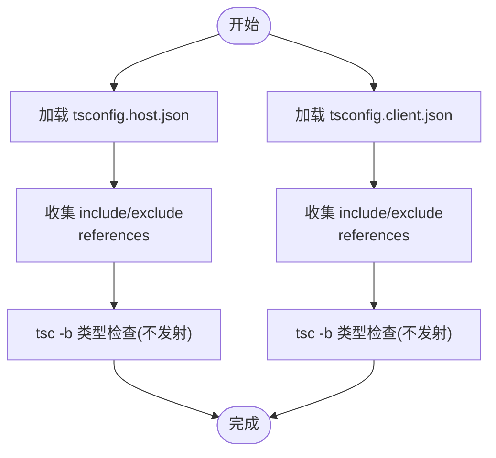
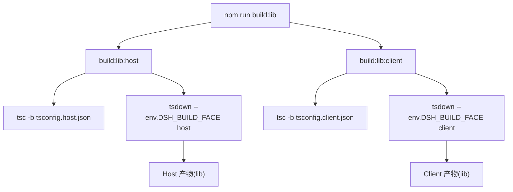
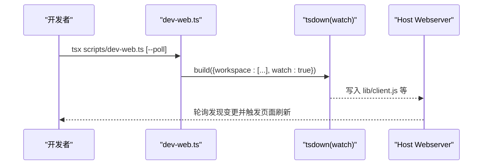
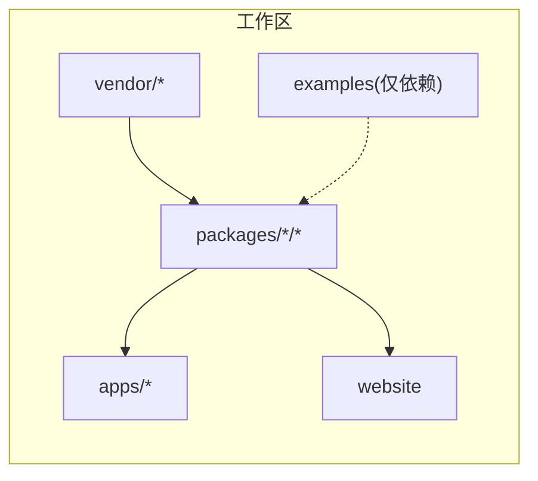

# 构建系统

<cite>
**本文引用的文件**
- [package.json](file://package.json)
- [tsconfig.base.json](file://tsconfig.base.json)
- [tsconfig.host.json](file://tsconfig.host.json)
- [tsconfig.client.json](file://tsconfig.client.json)
- [tsconfig.base.client.json](file://tsconfig.base.client.json)
- [tsdown.config.ts](file://tsdown.config.ts)
- [pnpm-workspace.yaml](file://pnpm-workspace.yaml)
- [scripts/ts-project.ts](file://scripts/ts-project.ts)
- [scripts/package-graph.ts](file://scripts/package-graph.ts)
- [scripts/dev-web.ts](file://scripts/dev-web.ts)
- [apps/cli/package.json](file://apps/cli/package.json)
- [apps/web/package.json](file://apps/web/package.json)
</cite>

## 目录
1. [简介](#简介)
2. [项目结构](#项目结构)
3. [核心组件](#核心组件)
4. [架构总览](#架构总览)
5. [详细组件分析](#详细组件分析)
6. [依赖关系分析](#依赖关系分析)
7. [性能考虑](#性能考虑)
8. [故障排查指南](#故障排查指南)
9. [结论](#结论)
10. [附录](#附录)

## 简介
本文件面向 DeepSeek Harness 的构建维护者，系统性说明 TypeScript 项目的 Host/Client 聚合设计、编译与打包流程、路径映射与类型检查策略、自定义构建任务扩展方法以及优化与排错实践。目标是让读者在不深入源码细节的情况下，也能理解并定制整个构建系统。

## 项目结构
仓库采用 pnpm workspace 管理多包工程，核心产物分为两类：
- Host 侧：Node 端运行时与 CLI 应用（apps/cli），通过 tsc -b 生成 JS，再由 tsdown 进行二次处理（如 Typert 代码生成）。
- Client 侧：浏览器端 UI 与插件（packages/client/*），同样先由 tsc -b 产出 JS，再由 tsdown 按包级配置生成浏览器 bundle；Web 前端入口 apps/web 使用 Vite 对 @deepseek-ai/dsh-client-web 进行最终打包。



图表来源
- [package.json:19-24](file://package.json#L19-L24)
- [tsdown.config.ts:16-29](file://tsdown.config.ts#L16-L29)
- [apps/web/package.json:22-25](file://apps/web/package.json#L22-L25)

章节来源
- [package.json:19-24](file://package.json#L19-L24)
- [pnpm-workspace.yaml:1-21](file://pnpm-workspace.yaml#L1-L21)

## 核心组件
- 根构建脚本：定义 build/build:lib/host/client、typecheck、lint 等命令，串联 tsc 与 tsdown。
- TypeScript 聚合：
  - tsconfig.host.json：Host 聚合，仅做类型检查（noEmit），引用大量 packages 子项目。
  - tsconfig.client.json：Client 聚合，仅做类型检查（noEmit），引用 client 相关子项目。
  - tsconfig.base.json：共享编译器选项与路径映射（paths），提供跨包解析能力。
  - tsconfig.base.client.json：客户端基础配置（JSX、DOM 类型）。
- 打包器：tsdown 工作区模式，根据 DSH_BUILD_FACE 选择 host 或 client 入口集合，并在 host 模式下启用 Typert 插件。
- Web 前端：apps/web 使用 Vite 构建，依赖已产出的 client 库。

章节来源
- [package.json:19-28](file://package.json#L19-L28)
- [tsconfig.host.json:1-10](file://tsconfig.host.json#L1-L10)
- [tsconfig.client.json:1-15](file://tsconfig.client.json#L1-L15)
- [tsconfig.base.json:5-27](file://tsconfig.base.json#L5-L27)
- [tsconfig.base.client.json:1-11](file://tsconfig.base.client.json#L1-L11)
- [tsdown.config.ts:1-31](file://tsdown.config.ts#L1-L31)
- [apps/web/package.json:22-25](file://apps/web/package.json#L22-L25)

## 架构总览
下图展示从源码到可执行/可部署产物的完整链路，包括 Host/Client 双聚合、tsdown 的工作区打包、以及 Web 前端的 Vite 构建。



图表来源
- [package.json:19-24](file://package.json#L19-L24)
- [tsdown.config.ts:16-29](file://tsdown.config.ts#L16-L29)
- [apps/web/package.json:22-25](file://apps/web/package.json#L22-L25)

## 详细组件分析

### Host/Client 聚合设计与职责分离
- 为什么拆分：Host 与 Client 两侧都会合并 cordis Context 的同名键但服务不同，因此必须拆成两个独立程序进行类型检查，避免冲突。
- Host 聚合：包含 CLI、服务端工具链、测试与示例等，引用大量 packages 子项目作为 project references。
- Client 聚合：聚焦 packages/client/* 及其测试，引用浏览器端所需的子项目，确保浏览器纯净性由各包自身 tsconfig 保证。



图表来源
- [tsconfig.host.json:1-108](file://tsconfig.host.json#L1-L108)
- [tsconfig.client.json:1-37](file://tsconfig.client.json#L1-L37)

章节来源
- [tsconfig.host.json:1-108](file://tsconfig.host.json#L1-L108)
- [tsconfig.client.json:1-37](file://tsconfig.client.json#L1-L37)

### 构建脚本工作原理：tsc 编译、tsdown 打包与依赖顺序
- 根脚本顺序：
  - build:lib:host 先 tsc -b 再 tsdown host。
  - build:lib:client 先 tsc -b 再 tsdown client。
  - build 同时触发 host 与 client 构建。
- tsdown 行为：
  - workspace 指定要打包的包范围。
  - entry 在 host 模式下指向 lib/types/{index,invariant,startup}.js；client 模式为空字符串以走包级配置。
  - platform=node，target=es2024，dts=false，clean=false。
  - host 模式启用 typertPlugin，用于类型驱动的代码生成。
- 依赖顺序：
  - 通过 TypeScript project references 显式声明依赖图，tsc -b 会按拓扑顺序增量编译。
  - tsdown 基于包清单与工作区发现，按包粒度并行打包。



图表来源
- [package.json:19-24](file://package.json#L19-L24)
- [tsdown.config.ts:16-29](file://tsdown.config.ts#L16-L29)

章节来源
- [package.json:19-24](file://package.json#L19-L24)
- [tsdown.config.ts:1-31](file://tsdown.config.ts#L1-L31)

### 路径映射、模块解析与类型检查
- 路径映射（paths）：
  - 集中定义在 tsconfig.base.json，将 @deepseek-ai/* 别名映射到本地 packages/vendor 源码路径，支持通配符批量映射。
  - 特别为 host/client 分组下的 invariant/client 等子面提供专用映射，避免通用规则覆盖。
- 模块解析：
  - moduleResolution=bundler，配合 rewriteRelativeImportExtensions=true（base），便于现代工具链解析。
  - base.client 关闭 node types，强制浏览器环境纯净；host/base 开启 node types。
- 类型检查：
  - 两个聚合均 noEmit，只做类型检查；实际 JS 由 tsc -b 在各自目标下生成（由根脚本控制）。
  - 严格模式、noUnusedLocals/Parameters、exactOptionalPropertyTypes 等保障类型质量。

```mermaid
classDiagram
class BaseConfig {
+moduleResolution="bundler"
+incremental=true
+strict=true
+paths{...}
}
class HostConfig {
+extends="base"
+noEmit=true
+include[...tests,examples,scripts]
+references[...packages/*]
}
class ClientConfig {
+extends="base.client"
+noEmit=true
+include[...client tests]
+references[...client packages]
}
BaseConfig <|-- HostConfig
BaseConfig <|-- ClientConfig
```

图表来源
- [tsconfig.base.json:5-27](file://tsconfig.base.json#L5-L27)
- [tsconfig.base.json:30-276](file://tsconfig.base.json#L30-L276)
- [tsconfig.host.json:1-108](file://tsconfig.host.json#L1-L108)
- [tsconfig.client.json:1-37](file://tsconfig.client.json#L1-L37)
- [tsconfig.base.client.json:1-11](file://tsconfig.base.client.json#L1-L11)

章节来源
- [tsconfig.base.json:5-27](file://tsconfig.base.json#L5-L27)
- [tsconfig.base.json:30-276](file://tsconfig.base.json#L30-L276)
- [tsconfig.host.json:1-108](file://tsconfig.host.json#L1-L108)
- [tsconfig.client.json:1-37](file://tsconfig.client.json#L1-L37)
- [tsconfig.base.client.json:1-11](file://tsconfig.base.client.json#L1-L11)

### 自定义构建任务：添加新包、修改流程、集成第三方工具
- 添加新包：
  - 在 packages/<group>/<pkg> 创建 package.json，并确保 peerDependencies 中只引用同仓库包（由脚本自动收集依赖图）。
  - 若该包需要被 tsdown 打包，需在其目录下提供 tsdown 配置（client 模式通常由包级配置决定）。
  - 若该包属于 Host 类型检查范围，需在 tsconfig.host.json 的 references 中添加引用；Client 同理。
- 修改构建流程：
  - 调整根 package.json 的 scripts，或在 tsdown.config.ts 中调整 workspace/entry/plugins。
  - 新增环境变量开关（如 DSH_BUILD_FACE）可在 tsdown 中分支逻辑。
- 集成第三方工具：
  - 通过 tsdown plugins 注入（例如 typertPlugin）。
  - 通过 pnpm overrides/allowBuilds 控制第三方构建脚本是否允许执行。

章节来源
- [scripts/package-graph.ts:34-57](file://scripts/package-graph.ts#L34-L57)
- [tsdown.config.ts:16-29](file://tsdown.config.ts#L16-L29)
- [pnpm-workspace.yaml:27-55](file://pnpm-workspace.yaml#L27-L55)

### Web 前端开发与 HMR 工作流
- apps/web 通过 Vite 构建，依赖 @deepseek-ai/dsh-client-web。
- 开发时可使用 scripts/dev-web.ts 启动 tsdown watch，监听所有 dsh.client 插件包的变化，重新生成 lib 下的 client 产物；宿主 webserver 轮询这些文件变化并广播重建事件，实现 HMR。
- 支持 --poll 参数适配网络挂载场景。



图表来源
- [scripts/dev-web.ts:28-85](file://scripts/dev-web.ts#L28-L85)
- [scripts/dev-web.ts:88-114](file://scripts/dev-web.ts#L88-L114)
- [apps/web/package.json:22-25](file://apps/web/package.json#L22-L25)

章节来源
- [scripts/dev-web.ts:28-85](file://scripts/dev-web.ts#L28-L85)
- [scripts/dev-web.ts:88-114](file://scripts/dev-web.ts#L88-L114)
- [apps/web/package.json:22-25](file://apps/web/package.json#L22-L25)

## 依赖关系分析
- 工作区成员：vendor/*、packages/*/*、native/landlock-run、apps/*、website、examples（仅依赖解析）、python/sdk-runtime（部署闭包）。
- 包依赖图：scripts/package-graph.ts 读取每个包的 peerDependencies，过滤出 @deepseek-ai/dsh-* 内部依赖，并按组优先级进行拓扑排序，用于生成文档图或校验。
- Host/Client 聚合通过 TypeScript project references 显式声明依赖，确保增量编译顺序正确。



图表来源
- [pnpm-workspace.yaml:1-21](file://pnpm-workspace.yaml#L1-L21)
- [scripts/package-graph.ts:34-57](file://scripts/package-graph.ts#L34-L57)

章节来源
- [pnpm-workspace.yaml:1-21](file://pnpm-workspace.yaml#L1-L21)
- [scripts/package-graph.ts:34-57](file://scripts/package-graph.ts#L34-L57)

## 性能考虑
- 增量构建：
  - TypeScript 启用 incremental/composite，tsc -b 利用 .tsbuildinfo 增量编译。
  - tsdown 设置 clean=false，减少不必要的清理开销。
- 并行编译：
  - tsc -b 内部按 project references 拓扑并行编译无环依赖的子项目。
  - tsdown 工作区模式对多个包并行打包。
- 缓存策略：
  - 保持 .tsbuildinfo 与 lib 目录稳定，CI 中可缓存这些目录加速冷启动。
  - 开发时使用 dev-web.ts 的 watch 模式，避免全量重建。
- 类型检查优化：
  - skipLibCheck=true，减少第三方库类型检查成本。
  - 将类型检查与发射分离（noEmit），仅在需要时生成 JS。

章节来源
- [tsconfig.base.json:5-27](file://tsconfig.base.json#L5-L27)
- [tsdown.config.ts:16-29](file://tsdown.config.ts#L16-L29)
- [scripts/dev-web.ts:28-85](file://scripts/dev-web.ts#L28-L85)

## 故障排查指南
- 常见错误与定位：
  - DSH_BUILD_FACE 非法值：tsdown 会抛出错误，需确保传入 host 或 client。
  - 路径映射失效：检查 tsconfig.base.json 的 paths 是否覆盖到对应包，必要时添加新的通配或精确映射。
  - 循环依赖：scripts/package-graph.ts 会在检测到循环时抛出错误，需调整包间依赖。
  - 类型冲突：Host/Client 两侧不可共用同一 program，确保分别使用 tsconfig.host.json 与 tsconfig.client.json。
- 诊断工具：
  - scripts/ts-project.ts 提供 TypeScriptProject 类，可加载 flattened host 项目图，用于语义查询与调试。
  - scripts/package-graph.ts 提供 collectPackageGraph，用于导出依赖图与检测环。
- 常见问题：
  - 在 Windows 或网络挂载环境下，watch 可能无法收到 inotify 事件，使用 dev-web.ts 的 --poll 参数切换轮询模式。
  - 某些包未出现在 tsdown 工作区中，确认其 package.json 是否在 pnpm-workspace.yaml 的扫描范围内，或 tsdown.workspace 是否包含。

章节来源
- [tsdown.config.ts:4-8](file://tsdown.config.ts#L4-L8)
- [tsconfig.base.json:30-276](file://tsconfig.base.json#L30-L276)
- [scripts/package-graph.ts:59-75](file://scripts/package-graph.ts#L59-L75)
- [scripts/ts-project.ts:31-52](file://scripts/ts-project.ts#L31-L52)
- [scripts/dev-web.ts:88-114](file://scripts/dev-web.ts#L88-L114)

## 结论
DeepSeek Harness 的构建系统通过“双聚合 + 工作区打包”的模式，清晰划分了 Host 与 Client 的职责边界，借助 TypeScript project references 与 tsdown 工作区能力实现了高效的增量编译与并行打包。结合路径映射、严格的类型检查与完善的开发脚本，既保证了大型仓库的可维护性，也为扩展新包与集成第三方工具提供了清晰的入口。

## 附录
- 常用命令速查：
  - 构建全部：npm run build
  - 仅构建库：npm run build:lib
  - 仅构建 Host：npm run build:lib:host
  - 仅构建 Client：npm run build:lib:client
  - 类型检查：npm run typecheck
  - Web 开发：tsx scripts/dev-web.ts [--poll]
- 关键配置文件：
  - 根脚本：package.json
  - 类型配置：tsconfig.base.json、tsconfig.host.json、tsconfig.client.json、tsconfig.base.client.json
  - 打包配置：tsdown.config.ts
  - 工作区：pnpm-workspace.yaml
  - 应用包：apps/cli/package.json、apps/web/package.json

章节来源
- [package.json:19-28](file://package.json#L19-L28)
- [tsconfig.base.json:5-27](file://tsconfig.base.json#L5-L27)
- [tsconfig.host.json:1-108](file://tsconfig.host.json#L1-L108)
- [tsconfig.client.json:1-37](file://tsconfig.client.json#L1-L37)
- [tsconfig.base.client.json:1-11](file://tsconfig.base.client.json#L1-L11)
- [tsdown.config.ts:16-29](file://tsdown.config.ts#L16-L29)
- [pnpm-workspace.yaml:1-21](file://pnpm-workspace.yaml#L1-L21)
- [apps/cli/package.json:14-19](file://apps/cli/package.json#L14-L19)
- [apps/web/package.json:22-25](file://apps/web/package.json#L22-L25)