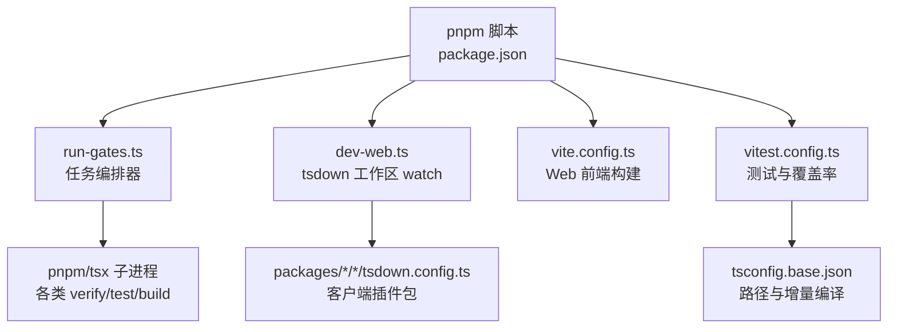
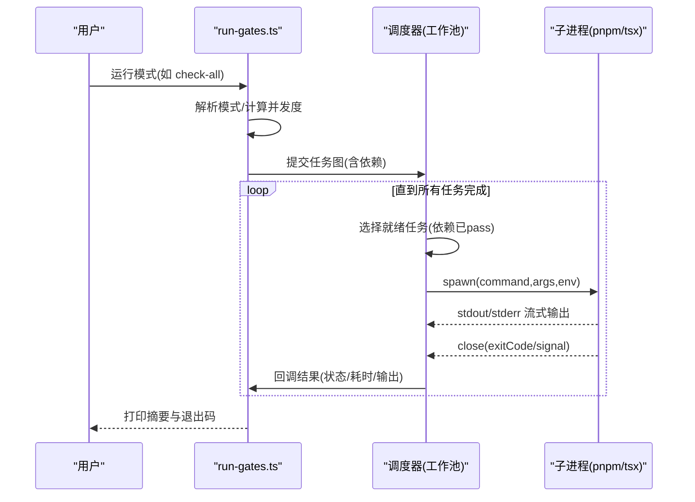
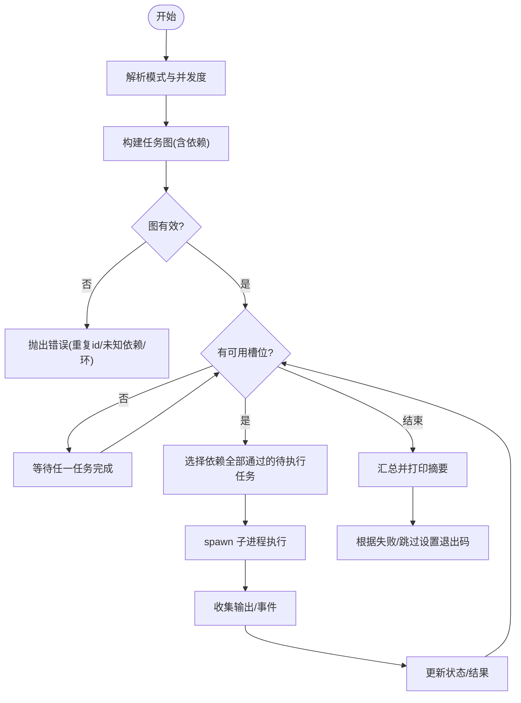
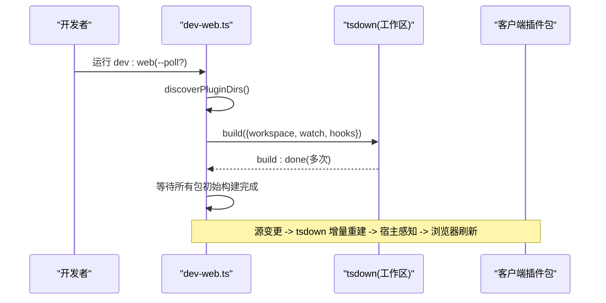
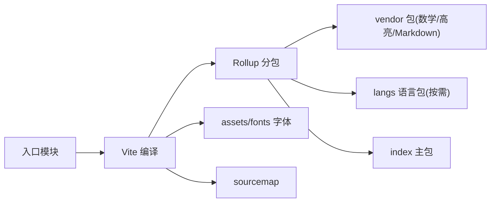
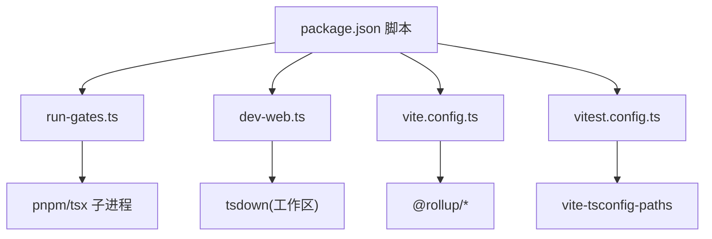

# 构建脚本系统

<cite>
**本文引用的文件**
- [scripts/run-gates.ts](file://scripts/run-gates.ts)
- [scripts/dev-web.ts](file://scripts/dev-web.ts)
- [package.json](file://package.json)
- [apps/web/vite.config.ts](file://apps/web/vite.config.ts)
- [vitest.config.ts](file://vitest.config.ts)
- [tsconfig.base.json](file://tsconfig.base.json)
</cite>

## 目录
1. [简介](#简介)
2. [项目结构](#项目结构)
3. [核心组件](#核心组件)
4. [架构总览](#架构总览)
5. [详细组件分析](#详细组件分析)
6. [依赖关系分析](#依赖关系分析)
7. [性能考量](#性能考量)
8. [故障排查指南](#故障排查指南)
9. [结论](#结论)
10. [附录](#附录)

## 简介
本文件系统化地梳理了仓库的构建与质量门禁体系，重点解释：
- run-gates.ts 的并行执行机制、任务依赖管理与错误处理策略
- dev-web.ts 的热重载实现、Vite 集成与调试支持
- 构建流程控制：任务调度、并发控制与资源管理
- 自定义构建任务的扩展方法
- 构建性能优化：并行执行、缓存策略与增量构建
- 构建错误的诊断与解决方法

目标是让维护者深入理解并具备定制能力。

## 项目结构
构建系统由“编排器 + 子任务 + 工具链配置”组成：
- 编排器：run-gates.ts 负责解析模式、组装任务图、并发调度与结果汇总
- 开发热更新：dev-web.ts 通过 tsdown 工作区 watch 模式驱动客户端插件包增量构建
- 前端构建：apps/web/vite.config.ts 定义 Vite/Rollup 产物布局、分包与别名
- 测试与覆盖率：vitest.config.ts 统一测试入口、覆盖范围与阈值
- 类型与路径：tsconfig.base.json 提供全局路径映射与增量编译开关
- 脚本入口：package.json 将上述脚本暴露为命令

图表来源
- [package.json:19-142](file://package.json#L19-L142)
- [scripts/run-gates.ts:80-97](file://scripts/run-gates.ts#L80-L97)
- [scripts/dev-web.ts:54-86](file://scripts/dev-web.ts#L54-L86)
- [apps/web/vite.config.ts:92-128](file://apps/web/vite.config.ts#L92-L128)
- [vitest.config.ts:117-159](file://vitest.config.ts#L117-L159)
- [tsconfig.base.json:1-20](file://tsconfig.base.json#L1-L20)

章节来源
- [package.json:19-142](file://package.json#L19-L142)

## 核心组件
- 任务编排器（run-gates.ts）
  - 模式解析：ci-primary / ci-static / check-all / doc-sync / node-compat 等
  - 任务图：每个 Gate 包含 id、label、command、args、needs、env、allowFailure
  - 并发调度：基于 maxActive 的工作池，按依赖就绪顺序启动
  - 错误处理：失败或跳过传播；允许失败的 gate 不阻塞整体退出码
- 开发热更新（dev-web.ts）
  - 自动发现 dsh.client platform=web 的包
  - 使用 tsdown workspace 模式开启 watch，监听源变更并重建
  - 可选 polling 模式适配网络挂载
- Web 构建（apps/web/vite.config.ts）
  - 禁止独立 serve，强制通过宿主运行
  - Rollup manualChunks 拆分 vendor/langs/fonts
  - 别名指向源码，确保 CSS 走 Vite 管线
- 测试与覆盖率（vitest.config.ts）
  - 双项目隔离：thread-safe 与 process-bound
  - 严格覆盖率阈值（每文件 100%）
  - 平台相关排除与覆盖豁免
- 类型与路径（tsconfig.base.json）
  - 启用 incremental/composite/sourceMap
  - 集中 paths 映射，避免重复模块实例

章节来源
- [scripts/run-gates.ts:14-74](file://scripts/run-gates.ts#L14-L74)
- [scripts/dev-web.ts:28-86](file://scripts/dev-web.ts#L28-L86)
- [apps/web/vite.config.ts:11-19](file://apps/web/vite.config.ts#L11-L19)
- [apps/web/vite.config.ts:92-128](file://apps/web/vite.config.ts#L92-L128)
- [vitest.config.ts:117-159](file://vitest.config.ts#L117-L159)
- [tsconfig.base.json:1-20](file://tsconfig.base.json#L1-L20)

## 架构总览
run-gates.ts 作为中央调度器，根据模式生成任务图，并通过内部工作池并发执行各 Gate。每个 Gate 以子进程方式调用 pnpm/tsx 命令，收集 stdout/stderr，记录耗时与退出码，最终输出摘要。

图表来源
- [scripts/run-gates.ts:80-97](file://scripts/run-gates.ts#L80-L97)
- [scripts/run-gates.ts:709-777](file://scripts/run-gates.ts#L709-L777)
- [scripts/run-gates.ts:788-832](file://scripts/run-gates.ts#L788-L832)

## 详细组件分析

### run-gates.ts：并行执行、依赖管理与错误处理
- 模式与任务图
  - gatesForMode(mode) 返回不同 CI/本地场景的任务集合
  - 通过 needs 声明依赖，形成 DAG
- 并发控制
  - defaultConcurrency(mode, total, available) 决定默认 worker 数
  - DSH_GATE_CONCURRENCY 可覆盖并发度
- 调度算法
  - runGates() 维护 states Map 与 running 队列
  - 每次循环尝试填充至 maxActive，若无可运行则等待任一 Promise 完成
  - 依赖失败/跳过的后续任务会被标记为 skipped
- 错误处理
  - 子进程启动失败、非零退出码或信号终止均视为 failed
  - allowFailure=true 的 gate 失败不影响总体退出码
  - 输出逐块收集，便于定位问题

图表来源
- [scripts/run-gates.ts:123-156](file://scripts/run-gates.ts#L123-L156)
- [scripts/run-gates.ts:649-699](file://scripts/run-gates.ts#L649-L699)
- [scripts/run-gates.ts:709-777](file://scripts/run-gates.ts#L709-L777)
- [scripts/run-gates.ts:788-832](file://scripts/run-gates.ts#L788-L832)

章节来源
- [scripts/run-gates.ts:80-97](file://scripts/run-gates.ts#L80-L97)
- [scripts/run-gates.ts:192-243](file://scripts/run-gates.ts#L192-L243)
- [scripts/run-gates.ts:649-699](file://scripts/run-gates.ts#L649-L699)
- [scripts/run-gates.ts:709-777](file://scripts/run-gates.ts#L709-L777)
- [scripts/run-gates.ts:788-832](file://scripts/run-gates.ts#L788-L832)

### dev-web.ts：热重载、tsdown 集成与调试
- 插件发现：扫描 packages/*/*/package.json，筛选 dsh.client.platform=web 的包
- 构建引擎：使用 tsdown 的 build API 开启 workspace 模式与 watch
- 初始构建同步：通过 hooks.build:done 计数，确保所有插件包完成首次构建后再对外暴露
- 调试支持：
  - --poll[=ms] 切换为轮询模式，适配网络挂载环境
  - 控制台输出当前监听的包列表与轮询间隔
- 与宿主协作：宿主 webserver 通过 stat 轮询 lib/client.js 变化并广播 rebuilt 帧触发浏览器刷新

图表来源
- [scripts/dev-web.ts:28-45](file://scripts/dev-web.ts#L28-L45)
- [scripts/dev-web.ts:54-86](file://scripts/dev-web.ts#L54-L86)
- [scripts/dev-web.ts:88-114](file://scripts/dev-web.ts#L88-L114)

章节来源
- [scripts/dev-web.ts:1-115](file://scripts/dev-web.ts#L1-L115)

### apps/web/vite.config.ts：Vite 集成与产物组织
- 安全限制：拒绝直接 serve，要求通过宿主启动
- 分包策略：
  - manualChunks：将特定 npm 包归入 vendor，语法高亮语言按需分包
  - chunkFileNames/assetFileNames：统一输出到 assets/ 子目录，字体单独分组
- 源码解析：alias 指向 src，保证 CSS 走 Vite 管线
- 运行时替换：define 注入 process.* 占位，屏蔽 Node 特性

图表来源
- [apps/web/vite.config.ts:11-19](file://apps/web/vite.config.ts#L11-L19)
- [apps/web/vite.config.ts:92-128](file://apps/web/vite.config.ts#L92-L128)
- [apps/web/vite.config.ts:129-159](file://apps/web/vite.config.ts#L129-L159)

章节来源
- [apps/web/vite.config.ts:1-161](file://apps/web/vite.config.ts#L1-L161)

### vitest.config.ts：测试与覆盖率
- 双项目隔离：thread-safe 与 process-bound，避免进程级状态污染
- 覆盖率：v8 provider，严格 100% 阈值，按文件统计
- 平台差异：Windows 下排除不支持的套件；PowerShell 缺失时豁免部分覆盖
- 覆盖豁免：在 CI 覆盖率门中，重套件在另一通道无仪器运行，避免放大开销

章节来源
- [vitest.config.ts:1-286](file://vitest.config.ts#L1-L286)

### tsconfig.base.json：类型系统与增量构建
- 启用 incremental 与 composite，配合 tsc -b 实现增量编译
- 集中 paths 映射，避免重复模块实例，提升解析一致性
- 严格编译选项保障类型安全

章节来源
- [tsconfig.base.json:1-20](file://tsconfig.base.json#L1-L20)
- [tsconfig.base.json:27-277](file://tsconfig.base.json#L27-L277)

## 依赖关系分析
- package.json 暴露的脚本是外部入口，内部委托给 scripts/*.ts 与工具链
- run-gates.ts 通过 pnpm/tsx 子进程间接依赖各验证/构建脚本
- dev-web.ts 依赖 tsdown 与工作区包清单
- vite.config.ts 依赖 @vitejs/plugin-react 与 Rollup 能力
- vitest.config.ts 依赖 vite-tsconfig-paths 与 v8 覆盖率

图表来源
- [package.json:19-142](file://package.json#L19-L142)
- [scripts/run-gates.ts:158-185](file://scripts/run-gates.ts#L158-L185)
- [scripts/dev-web.ts:23-24](file://scripts/dev-web.ts#L23-L24)
- [apps/web/vite.config.ts:1-4](file://apps/web/vite.config.ts#L1-L4)
- [vitest.config.ts:1-7](file://vitest.config.ts#L1-L7)

章节来源
- [package.json:19-142](file://package.json#L19-L142)

## 性能考量
- 并行执行
  - run-gates.ts 默认并发受 CPU 数量与模式限制；check-all/doc-sync 本地模式上限为 4，避免内存爆炸
  - 可通过 DSH_GATE_CONCURRENCY 精确控制
- 增量构建
  - TypeScript 启用 incremental/composite，tsc -b 复用 .tsbuildinfo
  - tsdown watch 仅重建变更包
  - Vite/Rollup 利用模块缓存与分包，减少无效重建
- 覆盖率优化
  - 重套件在无仪器通道运行，避免 v8 插桩带来的多倍开销
  - 通过 COVERAGE_EXEMPT_ENV 与 coverageExemptHeavySuites 精准划分
- 文档与站点构建
  - doc-sync 模式聚合大量文档校验与构建，需合理并发与依赖顺序

章节来源
- [scripts/run-gates.ts:123-156](file://scripts/run-gates.ts#L123-L156)
- [scripts/run-gates.ts:497-518](file://scripts/run-gates.ts#L497-L518)
- [tsconfig.base.json:1-20](file://tsconfig.base.json#L1-L20)
- [scripts/dev-web.ts:54-86](file://scripts/dev-web.ts#L54-L86)
- [apps/web/vite.config.ts:92-128](file://apps/web/vite.config.ts#L92-L128)

## 故障排查指南
- 任务图无效
  - 重复 id、未知依赖或存在环会直接报错，检查 needs 引用是否正确
- 子进程启动失败
  - 检查 npm_execpath 是否可用（必须通过 pnpm 脚本调用），以及命令是否存在
- 依赖失败导致跳过
  - 上游 gate 失败/跳过会导致下游被 skip，查看上游日志定位根因
- 覆盖率门失败
  - 确认 COVERAGE_EXEMPT_ENV 仅在覆盖率通道设置为 '1'，否则抛错
  - 检查 per-file 100% 阈值对应的未覆盖位置报告
- 开发热更新不生效
  - 网络挂载环境需使用 --poll 参数
  - 确保宿主 webserver 能检测到 lib/client.js 变化并广播刷新
- Vite 独立启动被拒
  - 禁止直接 serve，需通过宿主或 dsh web 启动

章节来源
- [scripts/run-gates.ts:649-699](file://scripts/run-gates.ts#L649-L699)
- [scripts/run-gates.ts:788-832](file://scripts/run-gates.ts#L788-L832)
- [vitest.config.ts:92-98](file://vitest.config.ts#L92-L98)
- [scripts/dev-web.ts:88-114](file://scripts/dev-web.ts#L88-L114)
- [apps/web/vite.config.ts:11-19](file://apps/web/vite.config.ts#L11-L19)

## 结论
该构建系统以 run-gates.ts 为核心，结合 tsdown/Vite/Vitest 等工具，实现了：
- 可配置的并行任务调度与严格的依赖管理
- 面向开发者的快速热重载体验
- 严格的类型、质量与覆盖率门禁
- 可扩展的自定义任务与第三方工具集成点

维护者可据此安全地扩展构建步骤、优化性能与排障。

## 附录

### 如何添加新的构建步骤
- 在 run-gates.ts 中新增一个 Gate 构造函数或使用 pnpmScript/pnpmExec 包装
- 在 gatesForMode 对应模式中注册新 Gate，并通过 needs 声明依赖
- 如需环境变量，使用 env 字段传入
- 若允许失败但不阻塞，设置 allowFailure: true

章节来源
- [scripts/run-gates.ts:158-185](file://scripts/run-gates.ts#L158-L185)
- [scripts/run-gates.ts:192-243](file://scripts/run-gates.ts#L192-L243)
- [scripts/run-gates.ts:709-777](file://scripts/run-gates.ts#L709-L777)

### 如何集成第三方工具
- 使用 pnpmExec 直接调用任意可执行命令，或通过 pnpmScript 调用 package.json 中的脚本
- 通过 env 注入工具所需的环境变量
- 在任务图中声明依赖，确保前置产物就绪

章节来源
- [scripts/run-gates.ts:158-185](file://scripts/run-gates.ts#L158-L185)
- [scripts/run-gates.ts:788-832](file://scripts/run-gates.ts#L788-L832)

### 构建性能调优建议
- 调整并发：生产 CI 可使用更高并发；本地大任务集建议限制并发
- 增量构建：保持 TypeScript incremental 与 tsdown watch 启用
- 分包优化：按依赖稳定度拆分 vendor/langs，减少不必要重建
- 覆盖率通道分离：重套件在无仪器通道运行，缩短整体时长

章节来源
- [scripts/run-gates.ts:123-156](file://scripts/run-gates.ts#L123-L156)
- [scripts/run-gates.ts:497-518](file://scripts/run-gates.ts#L497-L518)
- [apps/web/vite.config.ts:92-128](file://apps/web/vite.config.ts#L92-L128)
- [tsconfig.base.json:1-20](file://tsconfig.base.json#L1-L20)