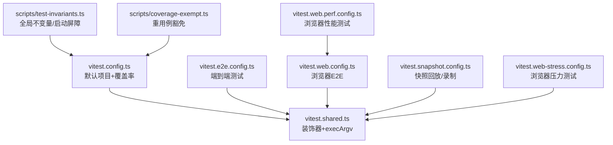
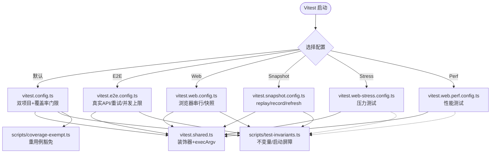
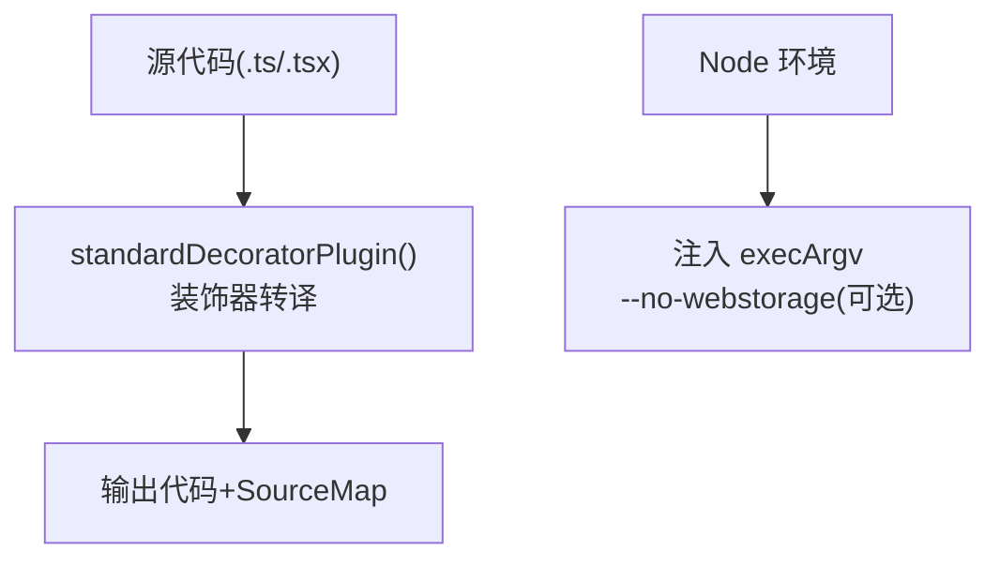
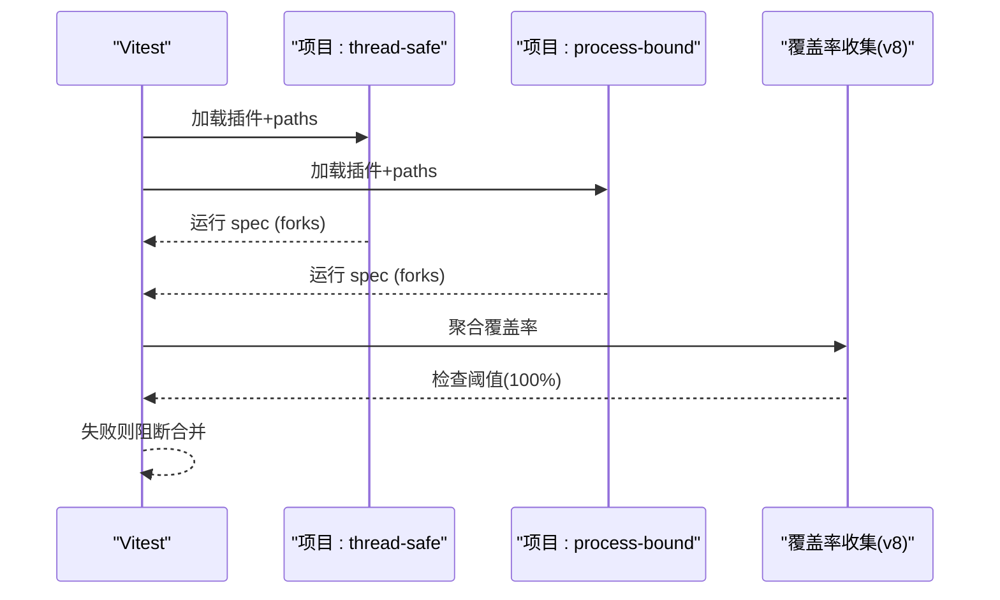
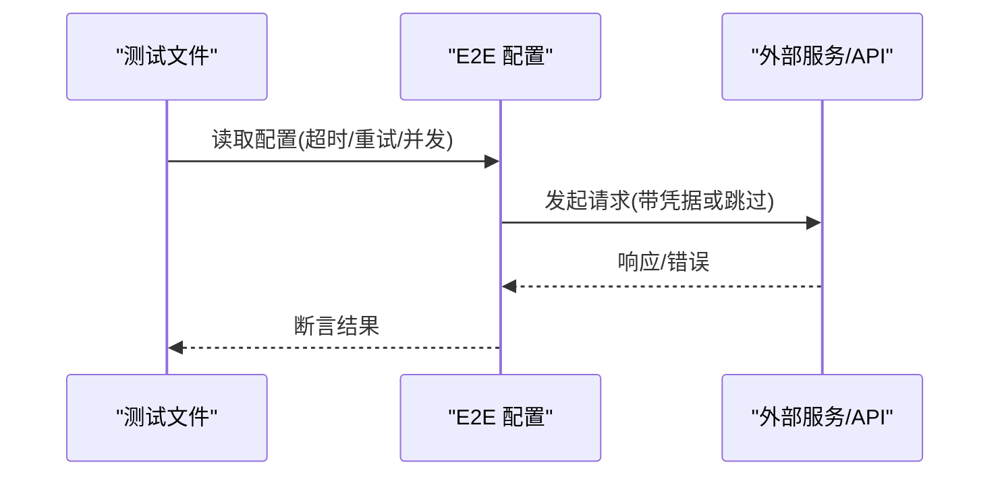
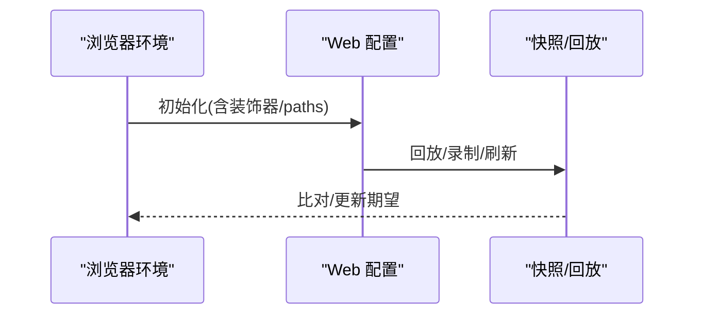
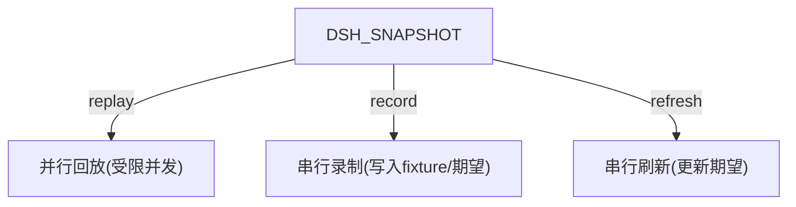
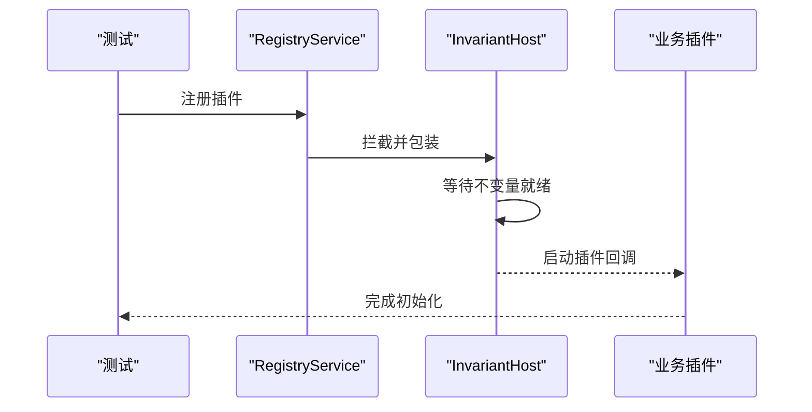
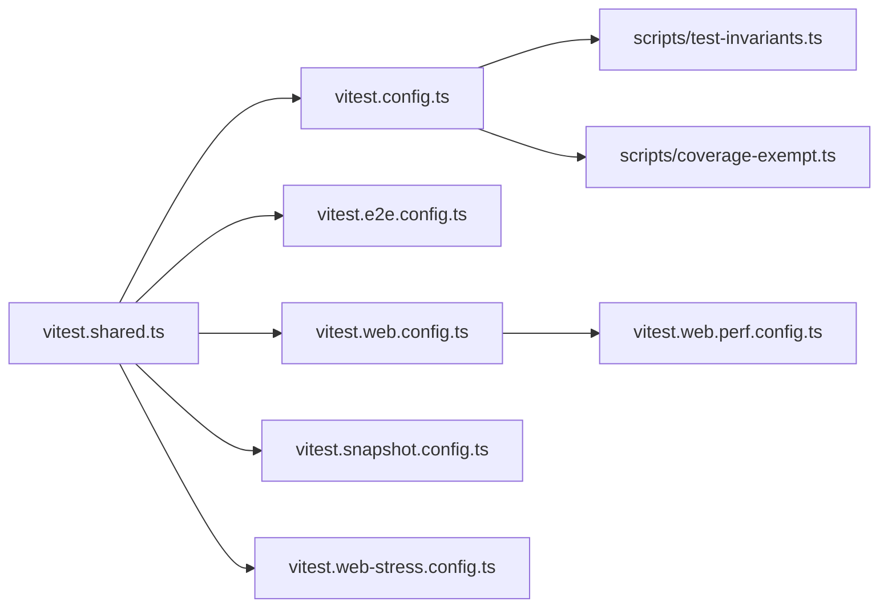

# 测试构建集成

<cite>
**本文引用的文件**
- [vitest.config.ts](file://vitest.config.ts)
- [vitest.shared.ts](file://vitest.shared.ts)
- [vitest.e2e.config.ts](file://vitest.e2e.config.ts)
- [vitest.web.config.ts](file://vitest.web.config.ts)
- [vitest.snapshot.config.ts](file://vitest.snapshot.config.ts)
- [vitest.web-stress.config.ts](file://vitest.web-stress.config.ts)
- [vitest.web.perf.config.ts](file://vitest.web.perf.config.ts)
- [scripts/test-invariants.ts](file://scripts/test-invariants.ts)
- [scripts/coverage-exempt.ts](file://scripts/coverage-exempt.ts)
</cite>

## 目录
1. [简介](#简介)
2. [项目结构](#项目结构)
3. [核心组件](#核心组件)
4. [架构总览](#架构总览)
5. [详细组件分析](#详细组件分析)
6. [依赖关系分析](#依赖关系分析)
7. [性能考虑](#性能考虑)
8. [故障排查指南](#故障排查指南)
9. [结论](#结论)
10. [附录](#附录)

## 简介
本文件面向测试开发者，系统化说明仓库的 Vitest 测试构建与集成方案。内容涵盖：
- 共享配置、环境特定配置与测试套件组织方式
- 单元测试、集成测试、端到端测试、Web 测试与压力/性能测试的构建差异
- 测试环境配置：模拟服务、测试数据与 fixtures 管理
- 自定义测试构建：新增测试环境、集成测试工具、配置覆盖率
- 测试性能优化：并行执行、测试隔离与内存管理
- 常见问题诊断与解决

## 项目结构
仓库采用多配置文件 + 多项目的 Vitest 架构：
- 共享能力集中在 vitest.shared.ts（装饰器预处理、Node 标志）
- 根级 vitest.config.ts 定义默认项目与覆盖率门限
- 按场景拆分的独立配置：E2E、Web、Snapshot、Web Stress、Web Perf
- 统一的测试前置脚本 scripts/test-invariants.ts 提供全局不变量与插件启动屏障
- 重用例豁免清单 scripts/coverage-exempt.ts 控制覆盖率采集范围

图表来源
- [vitest.config.ts:117-159](file://vitest.config.ts#L117-L159)
- [vitest.shared.ts:1-43](file://vitest.shared.ts#L1-L43)
- [vitest.e2e.config.ts:31-57](file://vitest.e2e.config.ts#L31-L57)
- [vitest.web.config.ts:16-35](file://vitest.web.config.ts#L16-L35)
- [vitest.snapshot.config.ts:39-68](file://vitest.snapshot.config.ts#L39-L68)
- [vitest.web-stress.config.ts:6-15](file://vitest.web-stress.config.ts#L6-L15)
- [vitest.web.perf.config.ts:6-15](file://vitest.web.perf.config.ts#L6-L15)
- [scripts/test-invariants.ts:1-274](file://scripts/test-invariants.ts#L1-L274)
- [scripts/coverage-exempt.ts:1-42](file://scripts/coverage-exempt.ts#L1-L42)

章节来源
- [vitest.config.ts:1-286](file://vitest.config.ts#L1-L286)
- [vitest.shared.ts:1-43](file://vitest.shared.ts#L1-L43)
- [vitest.e2e.config.ts:1-59](file://vitest.e2e.config.ts#L1-L59)
- [vitest.web.config.ts:1-36](file://vitest.web.config.ts#L1-L36)
- [vitest.snapshot.config.ts:1-69](file://vitest.snapshot.config.ts#L1-L69)
- [vitest.web-stress.config.ts:1-16](file://vitest.web-stress.config.ts#L1-L16)
- [vitest.web.perf.config.ts:1-16](file://vitest.web.perf.config.ts#L1-L16)
- [scripts/test-invariants.ts:1-274](file://scripts/test-invariants.ts#L1-L274)
- [scripts/coverage-exempt.ts:1-42](file://scripts/coverage-exempt.ts#L1-L42)

## 核心组件
- 共享插件与参数
  - 标准装饰器预处理：在 Vite 解析前将 TypeScript 装饰器转译为可执行代码，并清理无关 source map 行
  - execArgv 注入：通过 --no-webstorage 避免 Node Web Storage 与 jsdom 冲突
- 默认项目与覆盖率
  - 双项目策略：thread-safe（线程池）与 process-bound（进程隔离），保证进程相关测试稳定
  - v8 覆盖率：严格 100% 阈值，按文件粒度；包含 packages/*/src/**，排除类型/入口/客户端债务区等
- 端到端与 Web 测试
  - E2E：真实 API 调用，重试与超时放宽，受并发上限控制
  - Web：单浏览器串行运行，支持快照回放/录制模式
- 快照与回放
  - 支持 replay/record/refresh 三种模式；replay 可并行但限制并发度；record/refresh 串行写盘
- 测试不变量与启动屏障
  - 自动发现并挂载各包 invariant 配套，确保所有插件在“就绪”后才开始业务逻辑
  - 对手动拓扑测试提供例外路径

章节来源
- [vitest.shared.ts:1-43](file://vitest.shared.ts#L1-L43)
- [vitest.config.ts:117-159](file://vitest.config.ts#L117-L159)
- [vitest.config.ts:160-283](file://vitest.config.ts#L160-L283)
- [vitest.e2e.config.ts:31-57](file://vitest.e2e.config.ts#L31-L57)
- [vitest.web.config.ts:16-35](file://vitest.web.config.ts#L16-L35)
- [vitest.snapshot.config.ts:24-68](file://vitest.snapshot.config.ts#L24-L68)
- [scripts/test-invariants.ts:1-274](file://scripts/test-invariants.ts#L1-L274)

## 架构总览
下图展示不同测试类型的入口、包含规则与关键行为。

图表来源
- [vitest.config.ts:117-159](file://vitest.config.ts#L117-L159)
- [vitest.shared.ts:1-43](file://vitest.shared.ts#L1-L43)
- [vitest.e2e.config.ts:31-57](file://vitest.e2e.config.ts#L31-L57)
- [vitest.web.config.ts:16-35](file://vitest.web.config.ts#L16-L35)
- [vitest.snapshot.config.ts:24-68](file://vitest.snapshot.config.ts#L24-L68)
- [vitest.web-stress.config.ts:6-15](file://vitest.web-stress.config.ts#L6-L15)
- [vitest.web.perf.config.ts:6-15](file://vitest.web.perf.config.ts#L6-L15)
- [scripts/test-invariants.ts:1-274](file://scripts/test-invariants.ts#L1-L274)
- [scripts/coverage-exempt.ts:1-42](file://scripts/coverage-exempt.ts#L1-L42)

## 详细组件分析

### 共享配置（vitest.shared.ts）
- 目标：为所有源模式测试统一处理装饰器与 Node 标志
- 关键点：
  - 装饰器预转换：使用 TypeScript 编译器选项进行最小化转译，保留源码映射
  - execArgv：当 Node 允许时注入 --no-webstorage，避免与 jsdom 冲突
  - 作为插件被各配置复用，保证一致性

图表来源
- [vitest.shared.ts:1-43](file://vitest.shared.ts#L1-L43)

章节来源
- [vitest.shared.ts:1-43](file://vitest.shared.ts#L1-L43)

### 默认项目与覆盖率（vitest.config.ts）
- 双项目隔离：
  - thread-safe：使用 forks 池，排除进程绑定测试与重用例豁免集
  - process-bound：仅运行进程绑定测试，确保稳定性
- 覆盖率：
  - 提供者：v8
  - 包含：packages/*/src/**.{ts,tsx}
  - 排除：类型文件、bin/worker、客户端债务区、Windows-only 等
  - 阈值：perFile=100%，语句/分支/函数/行均为 100%
  - 报告：CI 输出文本与未覆盖位置报告；本地额外生成 HTML
- 平台适配：
  - Windows 不支持的包与测试自动排除
  - pwsh 可用性检测决定覆盖排除项

图表来源
- [vitest.config.ts:117-159](file://vitest.config.ts#L117-L159)
- [vitest.config.ts:160-283](file://vitest.config.ts#L160-L283)

章节来源
- [vitest.config.ts:1-286](file://vitest.config.ts#L1-L286)

### 端到端测试（vitest.e2e.config.ts）
- 适用：真实模型/外部服务的端到端用例
- 特性：
  - 自动加载 .env（若存在）
  - 较长超时与重试，缓解网络抖动
  - 并发上限由环境变量控制，默认有限并行
  - 仅包含 e2e 文件，不纳入覆盖率门限

图表来源
- [vitest.e2e.config.ts:31-57](file://vitest.e2e.config.ts#L31-L57)

章节来源
- [vitest.e2e.config.ts:1-59](file://vitest.e2e.config.ts#L1-L59)

### Web 测试（vitest.web.config.ts）
- 适用：浏览器端交互、快照对比、真实模型场景
- 特性：
  - 单浏览器实例，文件串行执行
  - 较长的钩子/测试超时
  - 包含 e2e 与 snapshot 两类文件
  - 支持 .env 加载以启用真实模型

图表来源
- [vitest.web.config.ts:16-35](file://vitest.web.config.ts#L16-L35)

章节来源
- [vitest.web.config.ts:1-36](file://vitest.web.config.ts#L1-L36)

### 快照与回放（vitest.snapshot.config.ts）
- 模式：
  - replay：默认，基于已提交期望输出进行回放，可并行但受限
  - record：从真实 API 录制并更新 fixture 与期望输出
  - refresh：回放已提交脚本并更新当前期望输出
- 并发：
  - replay 可通过环境变量控制最大并发
  - record/refresh 保持串行以避免竞争写盘

图表来源
- [vitest.snapshot.config.ts:24-68](file://vitest.snapshot.config.ts#L24-L68)

章节来源
- [vitest.snapshot.config.ts:1-69](file://vitest.snapshot.config.ts#L1-L69)

### 压力与性能测试（vitest.web-stress.config.ts / vitest.web.perf.config.ts）
- 压力测试：
  - 显式包含 *.stress.ts，超长超时，禁用文件并行
- 性能测试：
  - 继承 web 配置，仅包含 *.perf.ts，关闭控制台拦截，更长超时

章节来源
- [vitest.web-stress.config.ts:1-16](file://vitest.web-stress.config.ts#L1-L16)
- [vitest.web.perf.config.ts:1-16](file://vitest.web.perf.config.ts#L1-L16)

### 测试不变量与启动屏障（scripts/test-invariants.ts）
- 作用：
  - 自动发现并挂载每个包的 invariant 配套，确保插件注册顺序与生命周期一致
  - 提供 TEST_INVARIANT_READY_SERVICE，使所有插件启动等待不变量就绪
  - 对特殊测试（如 service.spec.ts）提供手动拓扑例外
- 机制：
  - 拦截 RegistryService.prototype.plugin，将目标插件包装为等待就绪后再执行
  - 按需挂载 AttachmentStore 等测试专用服务

图表来源
- [scripts/test-invariants.ts:67-98](file://scripts/test-invariants.ts#L67-L98)
- [scripts/test-invariants.ts:158-210](file://scripts/test-invariants.ts#L158-L210)
- [scripts/test-invariants.ts:227-273](file://scripts/test-invariants.ts#L227-L273)

章节来源
- [scripts/test-invariants.ts:1-274](file://scripts/test-invariants.ts#L1-L274)

### 覆盖率重用例豁免（scripts/coverage-exempt.ts）
- 目的：将极慢或高开销的用例从仪器化覆盖率中剔除，但仍会在无仪器模式下运行以保证正确性信号
- 规则：
  - 仅当被测源码已被其他用例完全覆盖时才加入豁免
  - 通过环境变量开关，配合 vitest.config.ts 动态排除

章节来源
- [scripts/coverage-exempt.ts:1-42](file://scripts/coverage-exempt.ts#L1-L42)

## 依赖关系分析
- 配置间依赖：
  - 所有配置均依赖 vitest.shared.ts 提供的装饰器插件与 execArgv
  - vitest.web.perf.config.ts 继承自 vitest.web.config.ts
- 运行时依赖：
  - 测试前置脚本 test-invariants.ts 被多个配置引入
  - 覆盖率豁免清单被根配置引用，用于动态调整 include/exclude
- 平台与环境：
  - Windows 下自动排除部分包与测试
  - pwsh 可用性影响覆盖排除
  - E2E/Web/Snapshot 根据环境变量决定是否加载 .env 与并发策略

图表来源
- [vitest.config.ts:117-159](file://vitest.config.ts#L117-L159)
- [vitest.shared.ts:1-43](file://vitest.shared.ts#L1-L43)
- [vitest.e2e.config.ts:31-57](file://vitest.e2e.config.ts#L31-L57)
- [vitest.web.config.ts:16-35](file://vitest.web.config.ts#L16-L35)
- [vitest.snapshot.config.ts:39-68](file://vitest.snapshot.config.ts#L39-L68)
- [vitest.web-stress.config.ts:6-15](file://vitest.web-stress.config.ts#L6-L15)
- [vitest.web.perf.config.ts:6-15](file://vitest.web.perf.config.ts#L6-L15)
- [scripts/test-invariants.ts:1-274](file://scripts/test-invariants.ts#L1-L274)
- [scripts/coverage-exempt.ts:1-42](file://scripts/coverage-exempt.ts#L1-L42)

章节来源
- [vitest.config.ts:1-286](file://vitest.config.ts#L1-L286)
- [vitest.shared.ts:1-43](file://vitest.shared.ts#L1-L43)
- [vitest.e2e.config.ts:1-59](file://vitest.e2e.config.ts#L1-L59)
- [vitest.web.config.ts:1-36](file://vitest.web.config.ts#L1-L36)
- [vitest.snapshot.config.ts:1-69](file://vitest.snapshot.config.ts#L1-L69)
- [vitest.web-stress.config.ts:1-16](file://vitest.web-stress.config.ts#L1-L16)
- [vitest.web.perf.config.ts:1-16](file://vitest.web.perf.config.ts#L1-L16)
- [scripts/test-invariants.ts:1-274](file://scripts/test-invariants.ts#L1-L274)
- [scripts/coverage-exempt.ts:1-42](file://scripts/coverage-exempt.ts#L1-L42)

## 性能考虑
- 并行执行
  - 默认项目使用 forks 池，避免线程共享状态导致的崩溃
  - E2E 通过环境变量限制最大工作进程，平衡 CI 速度与资源占用
  - Snapshot replay 支持可控并发；record/refresh 串行写盘
  - Web 与压力测试禁用文件并行，降低浏览器上下文竞争
- 测试隔离
  - 进程绑定测试单独项目运行，避免相互干扰
  - 测试不变量屏障确保插件启动顺序一致，减少竞态
- 内存管理
  - 浏览器测试串行，减少多标签页/上下文带来的内存压力
  - 快照回放/刷新避免并发写盘导致的数据损坏
- 覆盖率开销
  - 重用例通过豁免清单在仪器化运行中被排除，显著缩短耗时
  - 严格 per-file 100% 阈值促使细化测试，长期提升质量

[本节为通用指导，无需具体文件来源]

## 故障排查指南
- 覆盖率门限失败
  - 现象：合并前因覆盖率不足被阻断
  - 定位：查看未覆盖位置报告（CI 输出文本与自定义报告）
  - 处理：补充测试或合理扩大 exclude（需附理由）
  - 参考：覆盖率配置与阈值设置
- 进程相关测试不稳定
  - 现象：随机失败或挂起
  - 原因：线程池无法可靠隔离进程全局状态
  - 处理：使用 process-bound 项目或 fork 池
  - 参考：默认项目划分
- Windows 平台测试缺失
  - 现象：某些测试未被执行
  - 原因：Windows 不支持 POSIX shell 等依赖
  - 处理：确认排除列表是否合理，必要时添加兼容实现
  - 参考：平台相关排除逻辑
- pwsh 不可用导致覆盖偏差
  - 现象：pwsh-local 相关源码未覆盖
  - 处理：安装 pwsh 或在无 pwsh 环境下接受豁免
  - 参考：pwsh 可用性检测与覆盖排除
- E2E 超时或失败
  - 现象：真实 API 调用超时或配额限制
  - 处理：调整超时、重试次数与并发上限；检查凭据
  - 参考：E2E 配置中的超时与重试
- Web 测试卡顿
  - 现象：浏览器测试缓慢或内存增长
  - 处理：保持串行执行；减少同时打开页面；检查资源释放
  - 参考：Web 配置串行策略
- 快照不一致
  - 现象：回放失败或期望不匹配
  - 处理：确认模式（replay/record/refresh）；避免并发写盘
  - 参考：快照配置的模式与并发控制

章节来源
- [vitest.config.ts:160-283](file://vitest.config.ts#L160-L283)
- [vitest.config.ts:117-159](file://vitest.config.ts#L117-L159)
- [vitest.config.ts:21-83](file://vitest.config.ts#L21-L83)
- [vitest.e2e.config.ts:31-57](file://vitest.e2e.config.ts#L31-L57)
- [vitest.web.config.ts:16-35](file://vitest.web.config.ts#L16-L35)
- [vitest.snapshot.config.ts:24-68](file://vitest.snapshot.config.ts#L24-L68)

## 结论
该仓库通过共享配置与多环境配置的清晰分层，实现了高质量、可扩展且高性能的测试构建体系。默认项目保障稳定性与覆盖率门限，E2E/Web/Snapshot 分别针对真实交互、浏览器与回放场景优化。借助测试不变量与启动屏障，保证了复杂插件生态下的可预测行为。结合平台适配与重用例豁免，兼顾了跨平台兼容性与 CI 效率。遵循本文档的实践，可为团队提供一致的测试构建体验与持续改进的基础。

[本节为总结，无需具体文件来源]

## 附录
- 如何添加新的测试环境
  - 新建配置文件（例如 vitest.custom.config.ts），复用 vitest.shared.ts 的装饰器插件与 execArgv
  - 指定 include 与必要的超时/重试/并发策略
  - 如需不变量支持，引入 scripts/test-invariants.ts 作为 setupFiles
- 如何集成测试工具
  - 将工具封装为可被测试导入的模块，并在 setupFiles 中初始化
  - 对于需要外部服务的场景，使用 fixtures 启动并优雅关闭
- 如何配置覆盖率
  - 在配置中设置 provider、include、exclude 与 thresholds
  - 使用 scripts/coverage-exempt.ts 管理重用例豁免
- 最佳实践
  - 优先使用 forks 池隔离进程相关测试
  - 严格控制并发，避免资源竞争
  - 为每个被测单元编写聚焦测试，逐步提升覆盖率
  - 利用快照回放验证协议与输出稳定性

[本节为通用指导，无需具体文件来源]