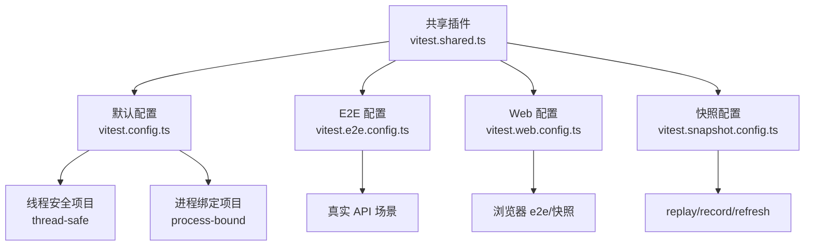
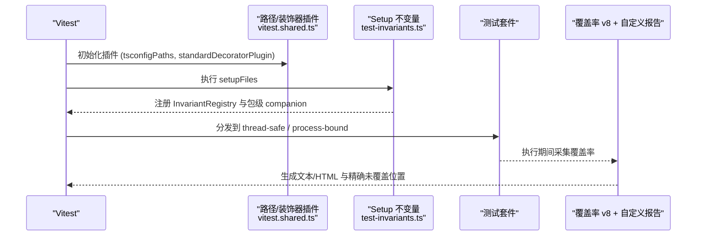
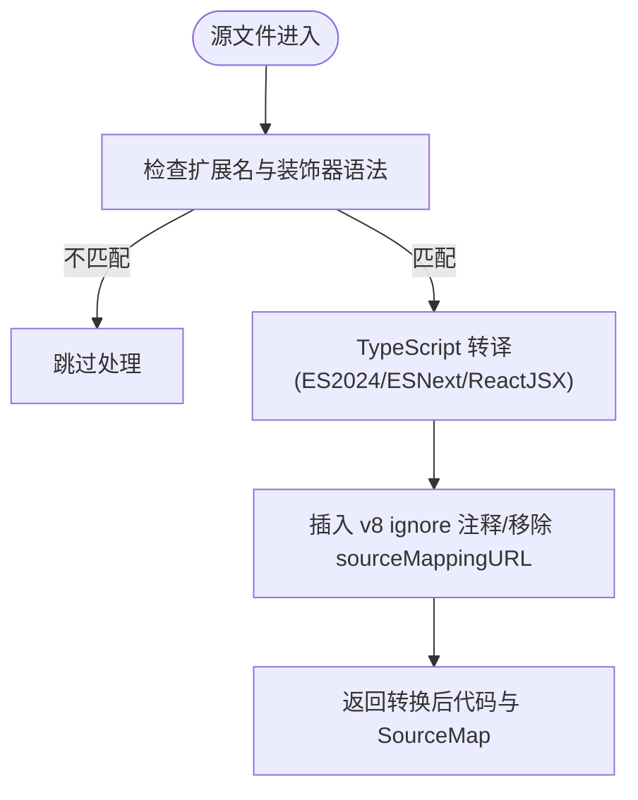
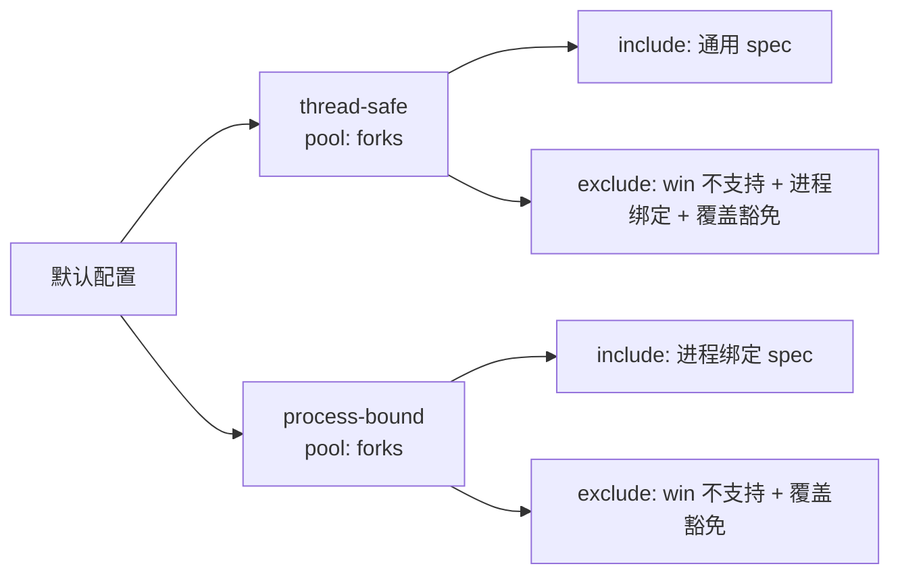
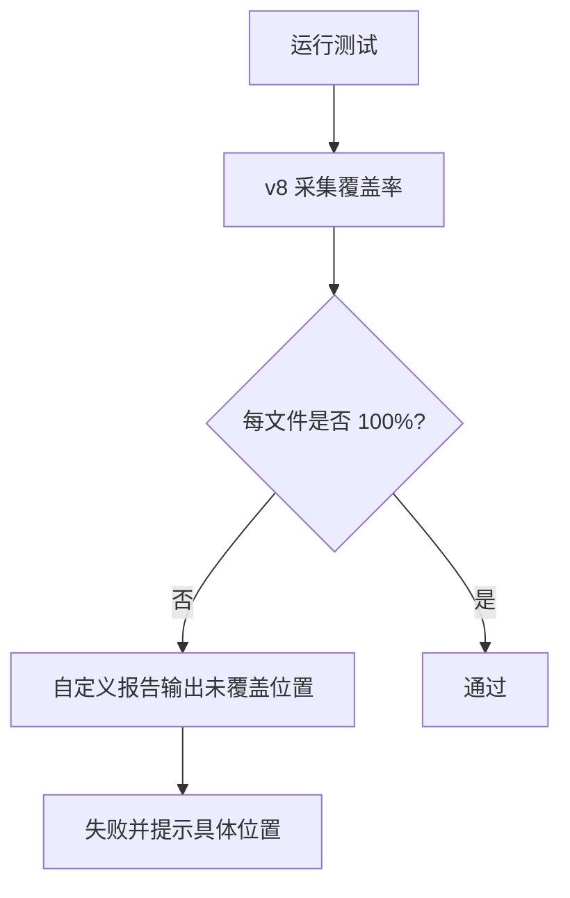
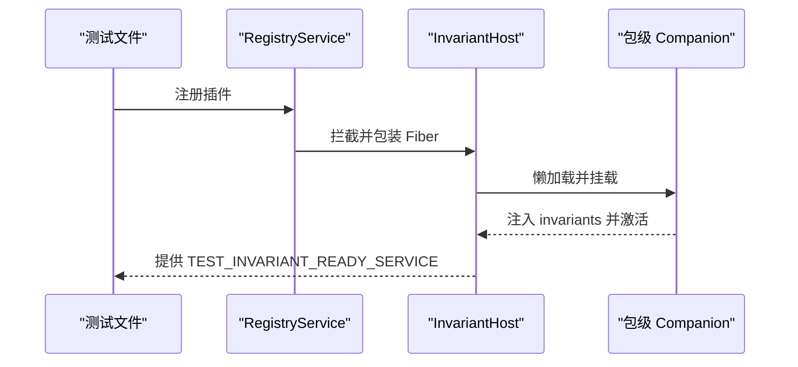
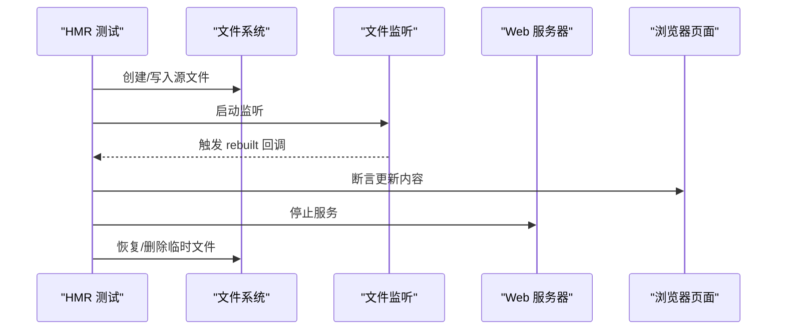
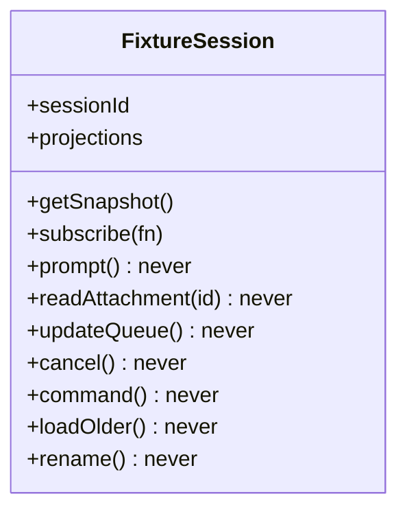
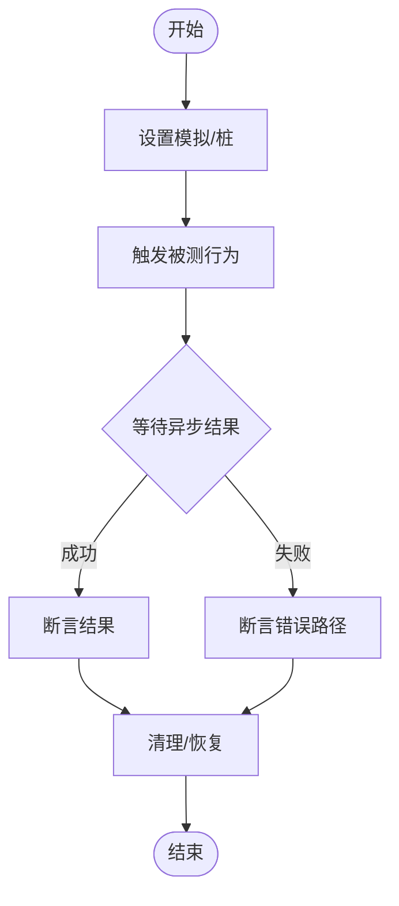
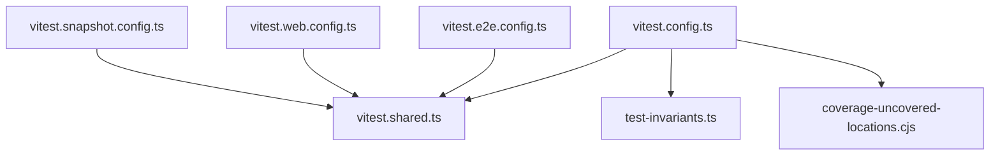

# 单元测试

<cite>
**本文引用的文件**
- [vitest.config.ts](file://vitest.config.ts)
- [vitest.shared.ts](file://vitest.shared.ts)
- [vitest.e2e.config.ts](file://vitest.e2e.config.ts)
- [vitest.web.config.ts](file://vitest.web.config.ts)
- [vitest.snapshot.config.ts](file://vitest.snapshot.config.ts)
- [test-invariants.ts](file://scripts/test-invariants.ts)
- [coverage-uncovered-locations.cjs](file://scripts/coverage-uncovered-locations.cjs)
- [args.spec.ts](file://apps/cli/tests/args.spec.ts)
- [approval.spec.ts](file://packages/acp/acp/tests/approval.spec.ts)
- [node-half.client.spec.ts](file://packages/client/hmr/tests/node-half.client.spec.ts)
- [hmr-live.e2e.ts](file://apps/web/tests/hmr-live.e2e.ts)
- [sessions.ts](file://packages/test-support/client-runtime/src/sessions.ts)
</cite>

## 目录
1. [简介](#简介)
2. [项目结构](#项目结构)
3. [核心组件](#核心组件)
4. [架构总览](#架构总览)
5. [详细组件分析](#详细组件分析)
6. [依赖关系分析](#依赖关系分析)
7. [性能考量](#性能考量)
8. [故障排查指南](#故障排查指南)
9. [结论](#结论)
10. [附录](#附录)

## 简介
本文件面向 DeepSeek Harness 的单元测试体系，系统性说明 Vitest 测试框架在本仓库中的配置与使用方式，涵盖多项目并行、路径映射、装饰器预处理、HMR 安全测试、资源清理与生命周期管理、并发与异步测试、错误路径覆盖、模拟对象与测试数据最佳实践，以及覆盖率要求与分析工具。目标是帮助读者快速理解并高质量地编写与维护测试用例。

## 项目结构
仓库采用多配置文件驱动的多项目测试：
- 单元与脚本测试：默认 vitest.config.ts，包含 thread-safe 与 process-bound 两个子项目，分别控制并发与进程隔离策略。
- E2E 测试：vitest.e2e.config.ts，针对真实 API 场景，具备重试、超时与并发限制。
- Web 浏览器测试：vitest.web.config.ts，串行执行以共享浏览器实例，支持快照回放。
- 快照测试：vitest.snapshot.config.ts，支持 replay/record/refresh 三种模式，按环境控制并发与写入策略。

图表来源
- [vitest.config.ts:117-159](file://vitest.config.ts#L117-L159)
- [vitest.e2e.config.ts:31-57](file://vitest.e2e.config.ts#L31-L57)
- [vitest.web.config.ts:16-35](file://vitest.web.config.ts#L16-L35)
- [vitest.snapshot.config.ts:39-67](file://vitest.snapshot.config.ts#L39-L67)
- [vitest.shared.ts:15-42](file://vitest.shared.ts#L15-L42)

章节来源
- [vitest.config.ts:1-286](file://vitest.config.ts#L1-L286)
- [vitest.e2e.config.ts:1-59](file://vitest.e2e.config.ts#L1-L59)
- [vitest.web.config.ts:1-36](file://vitest.web.config.ts#L1-L36)
- [vitest.snapshot.config.ts:1-69](file://vitest.snapshot.config.ts#L1-L69)
- [vitest.shared.ts:1-43](file://vitest.shared.ts#L1-L43)

## 核心组件
- 路径解析与装饰器预处理：通过 vite-tsconfig-paths 将工作区裸导入映射到源码；自定义 pre-transform 插件在 Vite 默认解析前转译 TypeScript 装饰器，避免运行时问题。
- 多项目与并发模型：默认配置定义 thread-safe（forks）与 process-bound（forks）两个项目，隔离进程全局状态与时序敏感测试。
- 平台与环境适配：Windows 下排除不支持的包与测试；根据是否存在 pwsh 动态调整覆盖率排除；Node 环境变量 --no-webstorage 防止 jsdom 存储被 Node 全局存储覆盖。
- 覆盖率门控：v8 提供者，严格 per-file 100% 阈值；自定义 istanbul 报告输出精确未覆盖位置（行/列/类型）。
- 测试前置与不变量：统一 setupFiles 挂载 test-invariants，自动发现并启动各包的 invariant 伴随服务，确保服务拓扑正确。

章节来源
- [vitest.config.ts:15-118](file://vitest.config.ts#L15-L118)
- [vitest.config.ts:126-159](file://vitest.config.ts#L126-L159)
- [vitest.config.ts:160-283](file://vitest.config.ts#L160-L283)
- [vitest.shared.ts:5-42](file://vitest.shared.ts#L5-L42)
- [test-invariants.ts:1-274](file://scripts/test-invariants.ts#L1-L274)
- [coverage-uncovered-locations.cjs:33-108](file://scripts/coverage-uncovered-locations.cjs#L33-L108)

## 架构总览
下图展示测试运行时的关键交互：Vitest 加载共享插件与路径映射，按项目分发到不同并发池；setupFiles 注入不变量宿主；覆盖率收集由 v8 提供并由自定义报告增强。

图表来源
- [vitest.shared.ts:15-42](file://vitest.shared.ts#L15-L42)
- [test-invariants.ts:158-209](file://scripts/test-invariants.ts#L158-L209)
- [vitest.config.ts:117-159](file://vitest.config.ts#L117-L159)
- [vitest.config.ts:160-283](file://vitest.config.ts#L160-L283)

## 详细组件分析

### 路径映射与装饰器预处理
- 路径映射：所有测试项目共用 tsconfig.base.json 的路径门面，保证工作区裸导入解析到源码而非构建产物，避免模块单例重复加载。
- 装饰器处理：pre-transform 阶段使用 TypeScript 编译器将装饰器语法转译为 ESNext，并保留 source map；对生成的访问器添加 v8 ignore 注释以避免影响覆盖率。

图表来源
- [vitest.shared.ts:15-42](file://vitest.shared.ts#L15-L42)

章节来源
- [vitest.config.ts:15-20](file://vitest.config.ts#L15-L20)
- [vitest.shared.ts:15-42](file://vitest.shared.ts#L15-L42)

### 多项目与并发模型
- thread-safe：使用 forks 池，排除进程绑定测试与覆盖豁免项，适合大多数纯函数或可隔离逻辑。
- process-bound：仅包含进程绑定测试，同样使用 forks 池，避免 worker 线程对进程全局状态的干扰。
- Windows 兼容：排除 bash/sandbox/hooks/terminal 等 POSIX 相关包及 subprocess 测试；同时调整覆盖率排除。

图表来源
- [vitest.config.ts:117-159](file://vitest.config.ts#L117-L159)
- [vitest.config.ts:21-50](file://vitest.config.ts#L21-L50)

章节来源
- [vitest.config.ts:21-50](file://vitest.config.ts#L21-L50)
- [vitest.config.ts:117-159](file://vitest.config.ts#L117-L159)

### 覆盖率门控与未覆盖位置报告
- 提供者与范围：v8 提供者，仅统计 packages/*/src/**/*.{ts,tsx}，排除类型、入口、worker、客户端 UI 债务区域等。
- 阈值：perFile 开启，语句/分支/函数/行均为 100%，任一文件不达标即失败。
- 报告：CI 输出 text 与自定义报告；本地额外生成 HTML；自定义报告为每个未覆盖语句/分支/函数输出一行“路径:行:列 未覆盖 类型”的可点击记录。

图表来源
- [vitest.config.ts:160-283](file://vitest.config.ts#L160-L283)
- [coverage-uncovered-locations.cjs:33-108](file://scripts/coverage-uncovered-locations.cjs#L33-L108)

章节来源
- [vitest.config.ts:160-283](file://vitest.config.ts#L160-L283)
- [coverage-uncovered-locations.cjs:33-108](file://scripts/coverage-uncovered-locations.cjs#L33-L108)

### 测试前置与不变量宿主
- 作用：在每个测试根自动启用 InvariantRegistry，并按测试所在包自动挂载对应的 invariant companion，确保服务拓扑与依赖满足预期。
- 机制：拦截 RegistryService.prototype.plugin，将目标 fiber 与“就绪”屏障串联，保证 companion 与服务在测试启动时完成激活；对附件存储提供测试实现以限制图片大小与验证行为。
- 手动拓扑例外：特定测试文件可绕过自动装配，自行构造服务树。

图表来源
- [test-invariants.ts:63-98](file://scripts/test-invariants.ts#L63-L98)
- [test-invariants.ts:158-209](file://scripts/test-invariants.ts#L158-L209)

章节来源
- [test-invariants.ts:1-274](file://scripts/test-invariants.ts#L1-L274)

### HMR 安全测试与资源清理
- 节点端 HMR 测试：通过临时目录与文件变更事件，验证 bundle 监听、stat 变化上报与 dispose 卸载；使用 vi.waitFor 等待异步信号。
- 浏览器端 HMR 测试：启动真实主机与浏览器，修改源文件后断言页面更新且无错误；finally 中确保关闭浏览器、停止 watcher/host、删除临时目录，聚合异常以便定位。
- 生命周期：通过 Cordis fiber 的 effect/dispose 与 await 语义，确保副作用随 fiber 销毁而释放。

图表来源
- [node-half.client.spec.ts:1-101](file://packages/client/hmr/tests/node-half.client.spec.ts#L1-L101)
- [hmr-live.e2e.ts:115-132](file://apps/web/tests/hmr-live.e2e.ts#L115-L132)

章节来源
- [node-half.client.spec.ts:1-101](file://packages/client/hmr/tests/node-half.client.spec.ts#L1-L101)
- [hmr-live.e2e.ts:115-132](file://apps/web/tests/hmr-live.e2e.ts#L115-L132)

### 模拟对象与测试数据最佳实践
- 失败即抛的桩：FixtureSession 对未提供的会话方法抛出明确错误，强制测试显式声明所需行为，避免半真半假的隐式成功。
- 结构化桩：通过 Pick+cast 的方式只暴露被测代码所需的接口表面，减少维护成本。
- 固定数据与快照：会话 fixture 使用 JSONL 序列化的 session.jsonl 与有序子会话文件，校验文件名规范与顺序，确保回放稳定。
- 外部依赖模拟：使用 vi.spyOn/vi.mock 替换 process.exit/stdout/stderr 或网络/文件系统调用，并在 afterEach 中恢复。

图表来源
- [sessions.ts:25-140](file://packages/test-support/client-runtime/src/sessions.ts#L25-L140)

章节来源
- [sessions.ts:1-200](file://packages/test-support/client-runtime/src/sessions.ts#L1-L200)

### 并发测试、异步测试与错误路径
- 并发：默认 thread-safe 项目使用 forks 池隔离进程状态；E2E 与快照测试通过环境变量控制 maxWorkers/maxConcurrency，必要时串行化。
- 异步：广泛使用 Promise、vi.waitFor 与超时保护，确保等待外部事件（文件变更、HTTP 响应、子进程标记）有界。
- 错误路径：对权限请求失败、未知选项、客户端不可用等场景进行断言；CLI 参数解析通过捕获 process.exit 来验证退出码。

图表来源
- [args.spec.ts:1-107](file://apps/cli/tests/args.spec.ts#L1-L107)
- [approval.spec.ts:1-79](file://packages/acp/acp/tests/approval.spec.ts#L1-L79)

章节来源
- [args.spec.ts:1-107](file://apps/cli/tests/args.spec.ts#L1-L107)
- [approval.spec.ts:1-79](file://packages/acp/acp/tests/approval.spec.ts#L1-L79)

## 依赖关系分析
- 配置层：vitest.config.ts 依赖 vitest.shared.ts 提供的装饰器插件与 execArgv；E2E/Web/Snapshot 配置复用同一共享插件。
- 运行时：test-invariants.ts 依赖 Cordis 与 dsh-invariants，拦截插件注册并管理生命周期。
- 覆盖率：vitest.config.ts 集成 v8 提供者与自定义 istanbul 报告，后者读取覆盖率数据并输出精确位置。

图表来源
- [vitest.config.ts:117-159](file://vitest.config.ts#L117-L159)
- [vitest.e2e.config.ts:31-57](file://vitest.e2e.config.ts#L31-L57)
- [vitest.web.config.ts:16-35](file://vitest.web.config.ts#L16-L35)
- [vitest.snapshot.config.ts:39-67](file://vitest.snapshot.config.ts#L39-L67)

章节来源
- [vitest.config.ts:117-159](file://vitest.config.ts#L117-L159)
- [vitest.e2e.config.ts:31-57](file://vitest.e2e.config.ts#L31-L57)
- [vitest.web.config.ts:16-35](file://vitest.web.config.ts#L16-L35)
- [vitest.snapshot.config.ts:39-67](file://vitest.snapshot.config.ts#L39-L67)

## 性能考量
- 并发控制：E2E 与快照测试通过环境变量限制最大工作进程数，避免 API 配额耗尽或磁盘竞争；快照 replay 允许并行但限制文件内并发，record/refresh 保持串行以确保 golden 一致性。
- 浏览器共享：Web 测试串行执行以共享浏览器实例，降低启动开销。
- 覆盖率范围：排除类型与 UI 债务区域，聚焦可执行源码，缩短采集时间。

[本节为通用指导，无需列出具体文件来源]

## 故障排查指南
- 覆盖率失败：查看 CI 日志中的“Uncovered locations”部分，定位具体文件与行/列；必要时本地打开 HTML 报告对照。
- 装饰器报错：确认已启用标准装饰器预处理插件；检查文件扩展名与语法是否符合预期。
- HMR 测试不稳定：增加超时或使用 vi.waitFor 等待事件；确保 finally 块中正确关闭浏览器、停止监听与清理临时文件。
- 进程绑定测试失败：确认使用 process-bound 项目运行；避免在 thread-safe 项目中执行进程全局操作。

章节来源
- [coverage-uncovered-locations.cjs:33-108](file://scripts/coverage-uncovered-locations.cjs#L33-L108)
- [vitest.shared.ts:15-42](file://vitest.shared.ts#L15-L42)
- [hmr-live.e2e.ts:115-132](file://apps/web/tests/hmr-live.e2e.ts#L115-L132)

## 结论
DeepSeek Harness 的测试体系以多项目、严格覆盖率与强一致性的快照为核心，配合不变量宿主与 HMR 安全测试，形成从单元到端到端的完整质量保障。遵循本文的配置与实践建议，可以高效编写稳定、可维护且高覆盖率的测试用例。

## 附录
- 常见测试模式
  - CLI 参数解析：通过 vi.spyOn 捕获 process.exit 并断言退出码，覆盖路由、转发与错误路径。
  - 权限策略：使用 harness 构造最小上下文，断言协议选项映射与异常降级。
  - HMR 节点端：临时文件 + 监听回调 + 断言 rebuilt 次数与路由注册。
- 反模式
  - 在 thread-safe 项目中执行进程绑定操作导致不稳定。
  - 未清理浏览器/子进程/临时目录导致资源泄漏。
  - 未显式 stub 必要方法导致 FixtureSession 抛出“未桩”错误。

章节来源
- [args.spec.ts:1-107](file://apps/cli/tests/args.spec.ts#L1-L107)
- [approval.spec.ts:1-79](file://packages/acp/acp/tests/approval.spec.ts#L1-L79)
- [node-half.client.spec.ts:1-101](file://packages/client/hmr/tests/node-half.client.spec.ts#L1-L101)
- [sessions.ts:25-140](file://packages/test-support/client-runtime/src/sessions.ts#L25-L140)