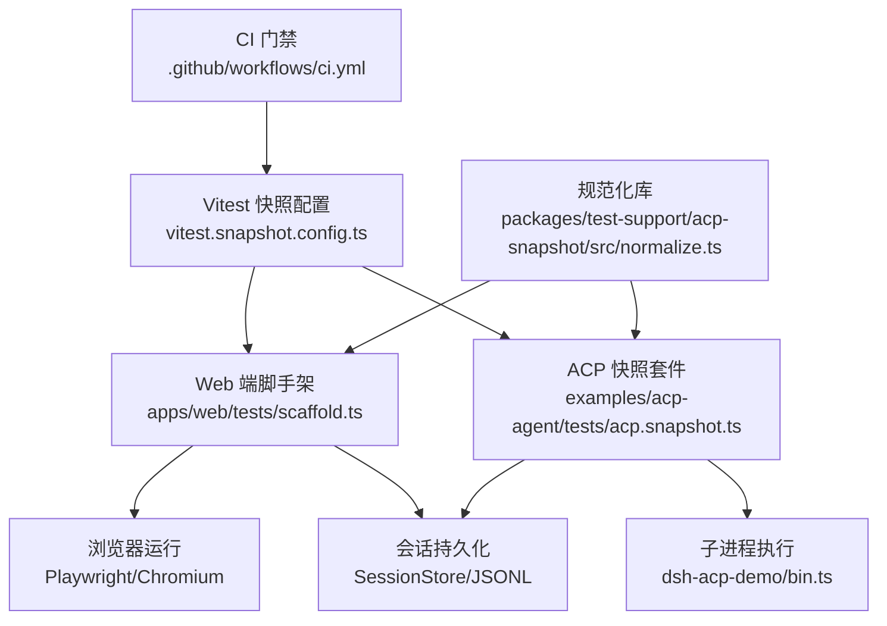
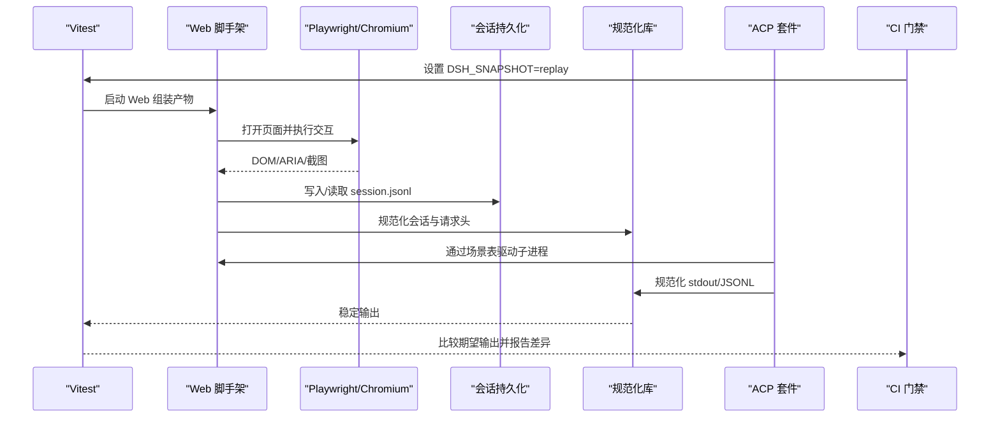
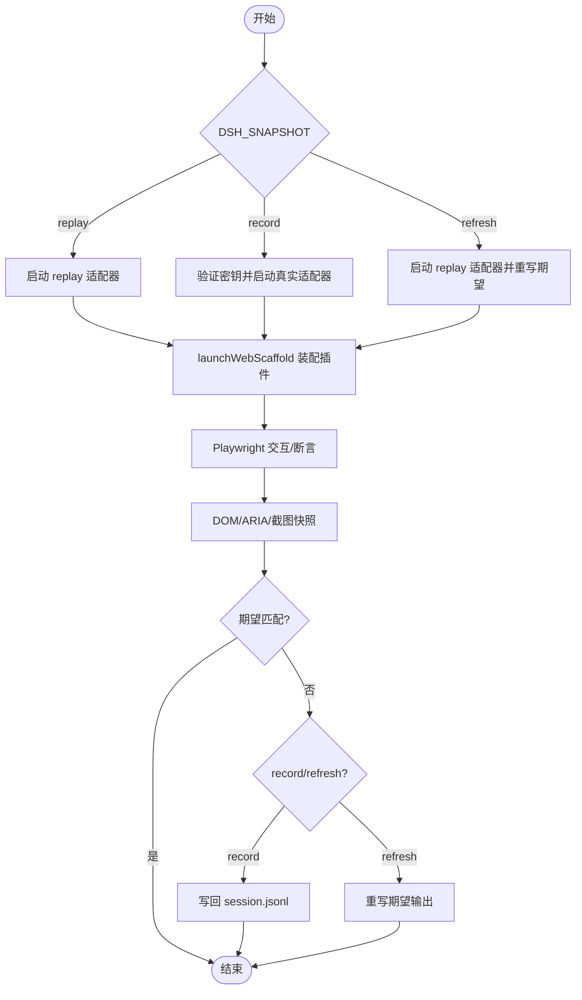
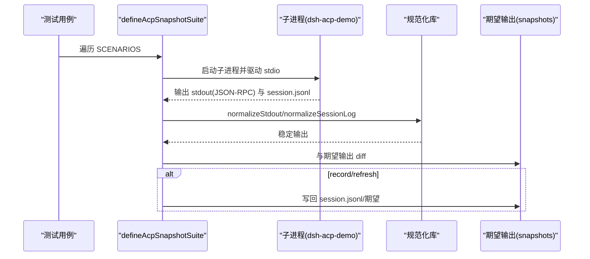
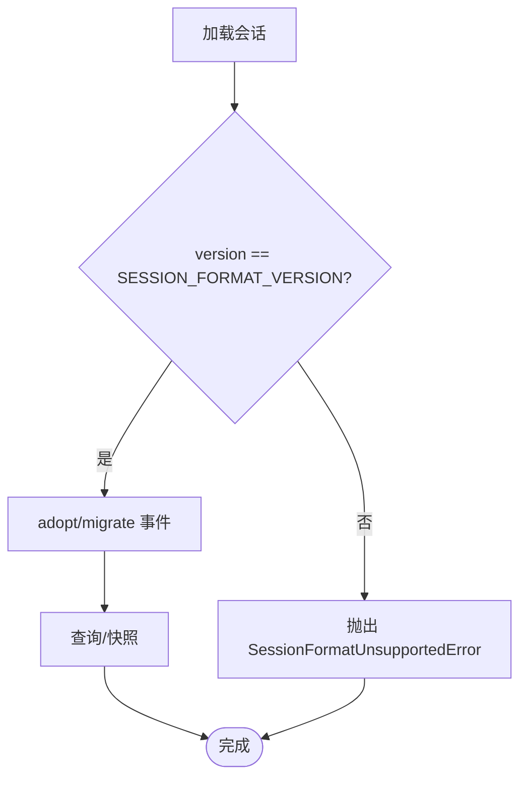
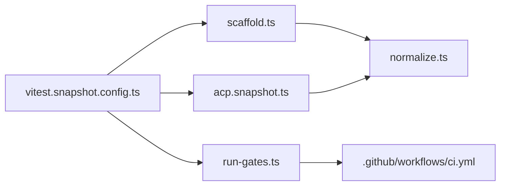

# 快照测试

<cite>
**本文引用的文件**
- [vitest.snapshot.config.ts](file://vitest.snapshot.config.ts)
- [scaffold.ts](file://apps/web/tests/scaffold.ts)
- [normalize.ts](file://packages/test-support/acp-snapshot/src/normalize.ts)
- [acp.snapshot.ts](file://examples/acp-agent/tests/acp.snapshot.ts)
- [image-display.snapshot.ts](file://apps/web/tests/image-display.snapshot.ts)
- [coordinator.ts](file://packages/session/session-persistence/src/coordinator.ts)
- [session-query/corpus.ts](file://packages/session-query/session-query/src/corpus.ts)
- [test-invariants.ts](file://scripts/test-invariants.ts)
- [run-gates.ts](file://scripts/run-gates.ts)
- [ci.yml](file://.github/workflows/ci.yml)
</cite>

## 目录
1. [简介](#简介)
2. [项目结构](#项目结构)
3. [核心组件](#核心组件)
4. [架构总览](#架构总览)
5. [详细组件分析](#详细组件分析)
6. [依赖关系分析](#依赖关系分析)
7. [性能考量](#性能考量)
8. [故障排除指南](#故障排除指南)
9. [结论](#结论)
10. [附录](#附录)

## 简介
本文件系统化说明 DeepSeek Harness 的快照测试体系，覆盖三类快照：
- UI 快照：基于浏览器或 jsdom 的 DOM/可访问性输出与截图比较，确保用户界面稳定。
- API 响应快照：对 ACP 自动化协议（ACP）的会话日志、请求头、工具调用等关键数据进行规范化后比对。
- 会话日志快照：对持久化的 JSONL 会话进行标准化，屏蔽时间戳、路径、ID 等不稳定字段，保证跨环境可重现。

文档同时涵盖 Web 浏览器快照的配置与执行流程（Chromium 设置、截图比较机制）、ACP 自动化快照的实施方法（JSONL 处理与数据规范化）、快照更新策略（何时更新、如何审查）、会话格式迁移与旧版兼容、最佳实践以及持续集成中的角色与故障排除。

## 项目结构
快照测试在仓库中按用途分层组织：
- 配置层：根级 Vitest 快照专用配置集中管理并发、模式与环境加载。
- Web 端：以 Playwright + 真实浏览器驱动 assembled 应用，通过 scaffold 启动并注入 replay/record/refresh 模式。
- ACP 自动化：示例工程定义场景表，驱动子进程执行，采集并对比规范化后的会话日志与请求头。
- 通用工具：提供 JSONL 与 stdout 的规范化能力，屏蔽不稳定信息。
- CI 集成：通过 gates 与工作流将快照作为质量门禁。

图表来源
- [vitest.snapshot.config.ts:1-69](file://vitest.snapshot.config.ts#L1-L69)
- [scaffold.ts:1-120](file://apps/web/tests/scaffold.ts#L1-L120)
- [acp.snapshot.ts:1-70](file://examples/acp-agent/tests/acp.snapshot.ts#L1-L70)
- [normalize.ts:1-80](file://packages/test-support/acp-snapshot/src/normalize.ts#L1-L80)
- [ci.yml:1-200](file://.github/workflows/ci.yml#L1-L200)

章节来源
- [vitest.snapshot.config.ts:1-69](file://vitest.snapshot.config.ts#L1-L69)
- [scaffold.ts:1-120](file://apps/web/tests/scaffold.ts#L1-L120)
- [acp.snapshot.ts:1-70](file://examples/acp-agent/tests/acp.snapshot.ts#L1-L70)
- [normalize.ts:1-80](file://packages/test-support/acp-snapshot/src/normalize.ts#L1-L80)

## 核心组件
- 快照配置与模式控制
  - 通过环境变量 DSH_SNAPSHOT 控制三种模式：replay（默认，只读回放）、record（录制真实 API 并写回金样）、refresh（仅重写当前期望输出）。
  - 并发控制由 DSH_SNAPSHOT_MAX_CONCURRENCY 调节；replay 支持文件级并行，record/refresh 串行以避免竞争写。
  - record 模式会加载根 .env 以获取密钥；replay/refresh 不加载 .env。
- Web 端脚手架
  - 启动真实 Web 组装产物，注入 session persistence、webserver、settings、credentials 等行，禁用非确定性服务（如 session-title-llm），并在 keyless 模式下安装 LLM replay 适配器。
  - 支持 replayFixture、replayChildFixtures、replayOverride、paceMs、toolsMode、cordisTools、deepSeekSearch、agentPresets 等选项，用于精确控制模型行为与工具呈现。
  - 提供 whenTurnSettled 等待 turn/end 并 flush 会话，close 时校验 fixture 消费完整性。
- ACP 快照套件
  - 使用 defineAcpSnapshotSuite 声明场景表，每个场景指定是否包含模型轮次、是否记录、是否固定请求头等。
  - 通过子进程执行 dsh-acp-demo/bin.ts，结合 cordis.yml 与 tsconfig.json，隔离工作区与 home。
  - 支持 pwshOnly、posixOnly、prepareWorkspace 等条件执行与准备逻辑。
- 规范化库
  - normalizeSessionLog：将 JSONL 会话日志中的 createdAt/time/time0/durationMs 等不稳定字段归一化，替换 sessionId/cwd/rpcId/UUID 为占位符，保留 seq 序列号。
  - scrubRequestHeaders/scrubSystemPrompts/scrubToolSchemas：对请求头中的系统提示与工具 schema 进行令牌化，便于单独固定头部侧车。
  - normalizeStdout：对 NDJSON 帧的 id 映射为稳定序号，并对值递归清洗。
  - tokenizeSessionFixtureCwd：将临时根下的 cwd 统一替换为 {{cwd}}，保持其他字段不变。
- 会话持久化与版本兼容
  - 加载时检查 SESSION_FORMAT_VERSION，拒绝过新或过旧的版本，抛出 SessionFormatUnsupportedError。
  - 对存储事件进行 adopt/migrate，兼容历史事件结构。

章节来源
- [vitest.snapshot.config.ts:24-67](file://vitest.snapshot.config.ts#L24-L67)
- [scaffold.ts:85-120](file://apps/web/tests/scaffold.ts#L85-L120)
- [scaffold.ts:289-316](file://apps/web/tests/scaffold.ts#L289-L316)
- [scaffold.ts:488-568](file://apps/web/tests/scaffold.ts#L488-L568)
- [scaffold.ts:651-662](file://apps/web/tests/scaffold.ts#L651-L662)
- [acp.snapshot.ts:118-131](file://examples/acp-agent/tests/acp.snapshot.ts#L118-L131)
- [acp.snapshot.ts:615-621](file://examples/acp-agent/tests/acp.snapshot.ts#L615-L621)
- [normalize.ts:283-330](file://packages/test-support/acp-snapshot/src/normalize.ts#L283-L330)
- [normalize.ts:332-374](file://packages/test-support/acp-snapshot/src/normalize.ts#L332-L374)
- [normalize.ts:246-281](file://packages/test-support/acp-snapshot/src/normalize.ts#L246-L281)
- [coordinator.ts:1046-1049](file://packages/session/session-persistence/src/coordinator.ts#L1046-L1049)
- [coordinator.ts:559-572](file://packages/session/session-persistence/src/coordinator.ts#L559-L572)

## 架构总览
快照测试的整体流程如下：
- 配置阶段：读取 DSH_SNAPSHOT 与并发参数，必要时加载 .env。
- Web 端：
  - 启动真实 Web 应用，注入 replay 适配器或路由-only 适配器。
  - 通过 Playwright 打开页面，执行交互或断言 DOM/ARIA 快照。
  - 在 record 模式下捕获会话并写回 fixture；在 refresh/replay 模式下比较期望输出。
- ACP 端：
  - 根据场景表启动子进程，驱动 stdio 协议。
  - 收集 stdout 与 session.jsonl，使用规范化库清洗不稳定字段。
  - 与已提交的期望输出进行 diff，或在 record/refresh 模式下写回。
- CI 门禁：
  - 通过 run-gates 注册 test:web:built 为 ci-consumers 门，强制 DSH_SNAPSHOT=replay，禁止写入，确保 PR 必须显式刷新金样。

图表来源
- [vitest.snapshot.config.ts:24-67](file://vitest.snapshot.config.ts#L24-L67)
- [scaffold.ts:289-316](file://apps/web/tests/scaffold.ts#L289-L316)
- [scaffold.ts:488-568](file://apps/web/tests/scaffold.ts#L488-L568)
- [normalize.ts:283-330](file://packages/test-support/acp-snapshot/src/normalize.ts#L283-L330)
- [acp.snapshot.ts:615-621](file://examples/acp-agent/tests/acp.snapshot.ts#L615-L621)
- [run-gates.ts:99-121](file://scripts/run-gates.ts#L99-L121)

## 详细组件分析

### Web 浏览器快照测试
- 配置与模式
  - webSnapshotMode() 解析 DSH_SNAPSHOT，限制为 replay/record/refresh。
  - record 模式要求 DEEPSEEK_API_KEY；replay/refresh 为 keyless，可插入 LLM replay 适配器。
- 启动与装配
  - 通过 loadOverlayPatches 组合 base/web 补丁，注入 session-persistence-jsonl、storage-json、skill-filesystem、webserver、settings、credentials 等行。
  - 禁用 agent-instructions、session-title-llm、session-telemetry-otel（除非显式提供 telemetryUrl）。
  - 在 keyless 且无 replayFixture 时注册 RouteOnlyAdapter，防止空提供者导致路由失败。
- 交互与断言
  - whenTurnSettled 等待 turn/end 并 flush 会话，确保持久化完成后再做浏览器断言。
  - close 时调用 replayHandle.assertConsumed()，确保 fixture 被完全消费，避免静默漂移。
- 截图与 DOM 快照
  - 使用 jsdom 环境进行 DOM/ARIA 快照；DOM 序列化器对 class 与 SVG 内容进行归一化，屏蔽动态类名与内容指纹。
  - aria 快照中路径、UUID、耗时、吞吐等不稳定信息会被替换为占位符。

图表来源
- [scaffold.ts:85-120](file://apps/web/tests/scaffold.ts#L85-L120)
- [scaffold.ts:289-316](file://apps/web/tests/scaffold.ts#L289-L316)
- [scaffold.ts:488-568](file://apps/web/tests/scaffold.ts#L488-L568)
- [scaffold.ts:651-662](file://apps/web/tests/scaffold.ts#L651-L662)
- [image-display.snapshot.ts:1-40](file://apps/web/tests/image-display.snapshot.ts#L1-L40)

章节来源
- [scaffold.ts:85-120](file://apps/web/tests/scaffold.ts#L85-L120)
- [scaffold.ts:289-316](file://apps/web/tests/scaffold.ts#L289-L316)
- [scaffold.ts:488-568](file://apps/web/tests/scaffold.ts#L488-L568)
- [scaffold.ts:651-662](file://apps/web/tests/scaffold.ts#L651-L662)
- [image-display.snapshot.ts:1-40](file://apps/web/tests/image-display.snapshot.ts#L1-L40)

### ACP 自动化快照测试
- 场景表驱动
  - SCENARIOS 数组定义每个场景的名称、是否包含模型轮次、是否记录、是否固定请求头、平台限制、工作区准备等。
  - 通过 defineAcpSnapshotSuite 统一执行 compare/guard/write-back。
- 子进程与配置
  - 使用绝对路径指向 binScript、configPath、tsconfigPath，确保子进程在工作区隔离下执行。
  - 支持 overlay 配置（如 code-mode.cordis.yml）与 sidecar 头部固定（pinsHeader/headerClass/systemPromptSource/toolSchemasSource）。
- 规范化与比对
  - 使用 normalizeSessionLog/scrubRequestHeaders 对会话日志与请求头进行清洗，屏蔽 sessionId/cwd/rpcId/UUID/时间戳等。
  - 对 packed chunk 行进行 time0/dt 归零，保留 seq/seq0 以确保逻辑等价。
- 特殊场景
  - pwshOnly/posixOnly 条件执行。
  - prepareWorkspace 创建固定 mtime 的文件树，保证 glob 排序稳定。
  - packed-chunks 场景验证所有 packed row 类型存在且逻辑等价。

图表来源
- [acp.snapshot.ts:118-131](file://examples/acp-agent/tests/acp.snapshot.ts#L118-L131)
- [acp.snapshot.ts:615-621](file://examples/acp-agent/tests/acp.snapshot.ts#L615-L621)
- [normalize.ts:246-281](file://packages/test-support/acp-snapshot/src/normalize.ts#L246-L281)
- [normalize.ts:283-330](file://packages/test-support/acp-snapshot/src/normalize.ts#L283-L330)

章节来源
- [acp.snapshot.ts:118-131](file://examples/acp-agent/tests/acp.snapshot.ts#L118-L131)
- [acp.snapshot.ts:615-621](file://examples/acp-agent/tests/acp.snapshot.ts#L615-L621)
- [normalize.ts:246-281](file://packages/test-support/acp-snapshot/src/normalize.ts#L246-L281)
- [normalize.ts:283-330](file://packages/test-support/acp-snapshot/src/normalize.ts#L283-L330)

### 会话格式迁移与兼容性
- 版本检查
  - 加载会话时检查 header.version 与 SESSION_FORMAT_VERSION，不一致则抛出 SessionFormatUnsupportedError，提示升级方向或不可升级。
- 事件迁移
  - 对存储事件进行 adopt/migrate，兼容历史 turn/start、turn/end、steering、message 等事件结构。
- 查询与快照
  - 查询层对持久化异常进行包装，区分 corruption 与 persistence failure。
  - 快照 live session 时使用 structuredClone 复制 header/events，避免共享状态。

图表来源
- [coordinator.ts:1046-1049](file://packages/session/session-persistence/src/coordinator.ts#L1046-L1049)
- [coordinator.ts:559-572](file://packages/session/session-persistence/src/coordinator.ts#L559-L572)
- [session-query/corpus.ts:268-309](file://packages/session-query/session-query/src/corpus.ts#L268-L309)

章节来源
- [coordinator.ts:1046-1049](file://packages/session/session-persistence/src/coordinator.ts#L1046-L1049)
- [coordinator.ts:559-572](file://packages/session/session-persistence/src/coordinator.ts#L559-L572)
- [session-query/corpus.ts:268-309](file://packages/session-query/session-query/src/corpus.ts#L268-L309)

## 依赖关系分析
- 配置到执行
  - vitest.snapshot.config.ts 决定 include 范围、并发、模式与环境加载。
  - scaffold.ts 依赖 @deepseek-ai/dsh-session、@deepseek-ai/dsh-llm-replay、@deepseek-ai/dsh-app-boot 等包装配真实行为。
  - acp.snapshot.ts 依赖 defineAcpSnapshotSuite 与 dsh-acp-demo 子进程。
  - normalize.ts 提供纯函数式清洗能力，被 Web 与 ACP 两端复用。
- CI 集成
  - run-gates.ts 注册 test:web:built 为 ci-consumers 门，强制 DSH_SNAPSHOT=replay，禁止写入。
  - ci.yml 定义 Windows/Linux 任务，确保快照门禁生效。

图表来源
- [vitest.snapshot.config.ts:1-69](file://vitest.snapshot.config.ts#L1-L69)
- [scaffold.ts:1-120](file://apps/web/tests/scaffold.ts#L1-L120)
- [acp.snapshot.ts:1-70](file://examples/acp-agent/tests/acp.snapshot.ts#L1-L70)
- [normalize.ts:1-80](file://packages/test-support/acp-snapshot/src/normalize.ts#L1-L80)
- [run-gates.ts:99-121](file://scripts/run-gates.ts#L99-L121)
- [ci.yml:1-200](file://.github/workflows/ci.yml#L1-L200)

章节来源
- [vitest.snapshot.config.ts:1-69](file://vitest.snapshot.config.ts#L1-L69)
- [scaffold.ts:1-120](file://apps/web/tests/scaffold.ts#L1-L120)
- [acp.snapshot.ts:1-70](file://examples/acp-agent/tests/acp.snapshot.ts#L1-L70)
- [normalize.ts:1-80](file://packages/test-support/acp-snapshot/src/normalize.ts#L1-L80)
- [run-gates.ts:99-121](file://scripts/run-gates.ts#L99-L121)
- [ci.yml:1-200](file://.github/workflows/ci.yml#L1-L200)

## 性能考量
- 并发控制
  - DSH_SNAPSHOT_MAX_CONCURRENCY 控制文件级并行；replay 允许并行，record/refresh 串行以避免竞争写。
  - 默认上限为 min(5, availableParallelism())，避免过度并行导致资源争用。
- I/O 与持久化
  - Web 端使用临时 workspace/persistenceRoot，避免污染用户环境；关闭时清理。
  - ACP 端通过子进程隔离工作区，减少交叉影响。
- 规范化开销
  - normalizeSessionLog/normalizeStdout 对 JSONL/NDJSON 逐行解析与清洗，适合中小规模会话；超大会话建议分片处理。
- 浏览器渲染
  - jsdom 快照轻量但无法模拟完整渲染；复杂 UI 建议使用 Playwright 截图与 ARIA 快照结合。

[本节提供一般性指导，无需特定文件引用]

## 故障排除指南
- 常见错误
  - 缺少密钥：record 模式需要 DEEPSEEK_API_KEY；若未设置会抛出明确错误。
  - 非法模式：DSH_SNAPSHOT 必须为 replay/record/refresh，否则报错。
  - 版本不兼容：会话版本过新或过旧会抛出 SessionFormatUnsupportedError，需升级 harness 或迁移会话。
  - Fixture 未消费：close 时 assertConsumed 失败，说明模型调用少于记录，需调整场景或修复代码。
- 调试步骤
  - 切换模式：replay 定位回归，record 重新录制，refresh 仅更新期望。
  - 查看规范化输出：使用 normalizeSessionLog/normalizeStdout 生成稳定输出，辅助定位不稳定字段。
  - 检查 CI 门禁：确认 run-gates 已注册 test:web:built 为 ci-consumers，且 DSH_SNAPSHOT=replay。
- 日志与断言
  - Web 端 whenTurnSettled 超时：检查 turn/end 是否触发，或增加超时。
  - ACP 子进程失败：检查 configPath/tsconfigPath 是否正确，prepareWorkspace 是否成功。

章节来源
- [scaffold.ts:289-316](file://apps/web/tests/scaffold.ts#L289-L316)
- [scaffold.ts:592-624](file://apps/web/tests/scaffold.ts#L592-L624)
- [coordinator.ts:1046-1049](file://packages/session/session-persistence/src/coordinator.ts#L1046-L1049)
- [normalize.ts:283-330](file://packages/test-support/acp-snapshot/src/normalize.ts#L283-L330)
- [run-gates.ts:99-121](file://scripts/run-gates.ts#L99-L121)

## 结论
DeepSeek Harness 的快照测试体系通过三层快照（UI、API、会话日志）与严格的规范化机制，确保跨环境、跨时间的稳定性。Web 端借助 Playwright 与真实浏览器，ACP 端通过子进程与 JSONL 回放，配合 CI 门禁，形成完整的回归保障。遵循本文的最佳实践与故障排除方法，可有效维护快照质量并快速定位问题。

[本节为总结性内容，无需特定文件引用]

## 附录
- 快照更新策略
  - 何时更新：当功能变更导致预期输出变化，或发现不稳定字段未被正确屏蔽时。
  - 如何审查：使用 refresh 仅更新期望，review 差异后提交；record 模式需谨慎，确保密钥安全。
- 最佳实践
  - 快照文件组织：按场景命名，session.jsonl 与期望输出同目录。
  - 命名约定：使用语义化名称，避免平台相关字符。
  - 维护策略：定期 review 快照变更，清理废弃场景。
- 持续集成
  - 门禁：test:web:built 作为 ci-consumers，强制 replay 模式。
  - 故障排除：检查 CI 日志中的 diff，定位不稳定字段或配置问题。

[本节提供一般性指导，无需特定文件引用]