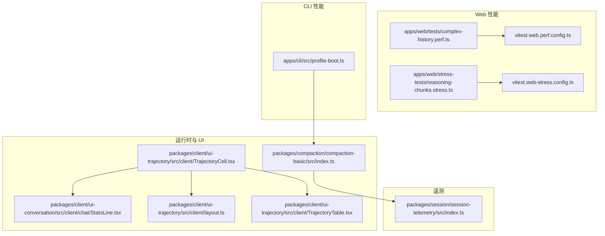
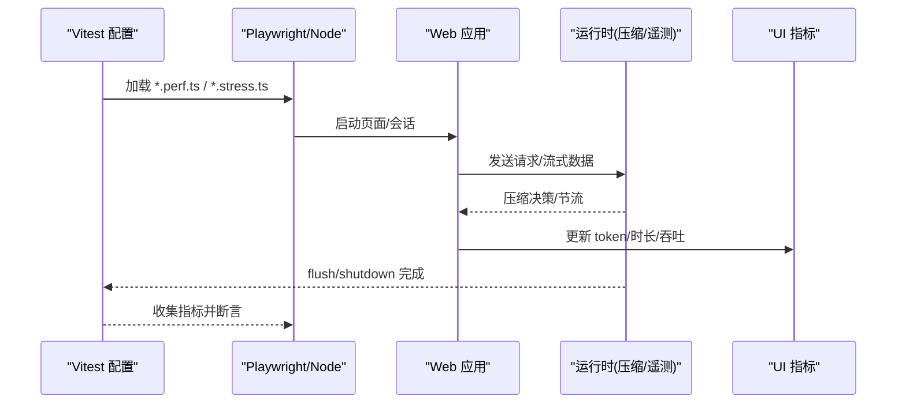
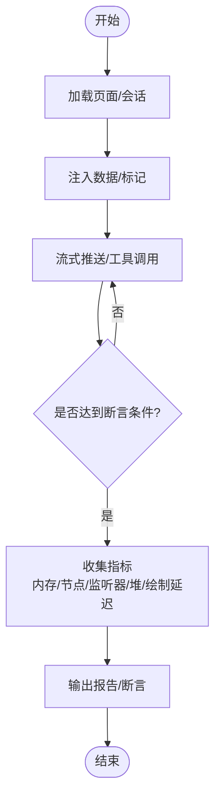
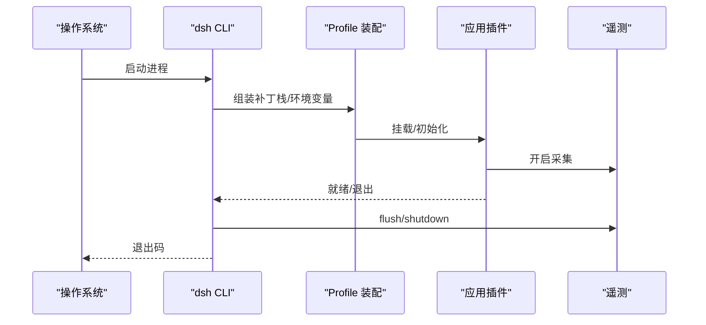
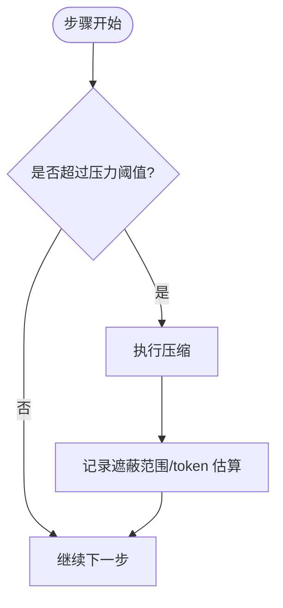
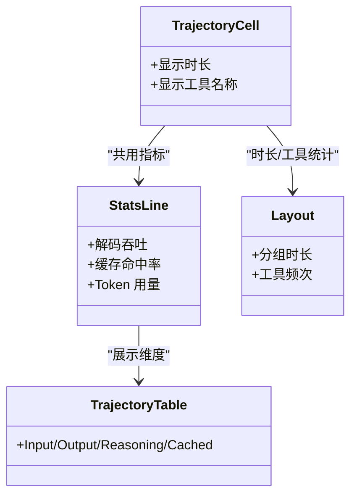
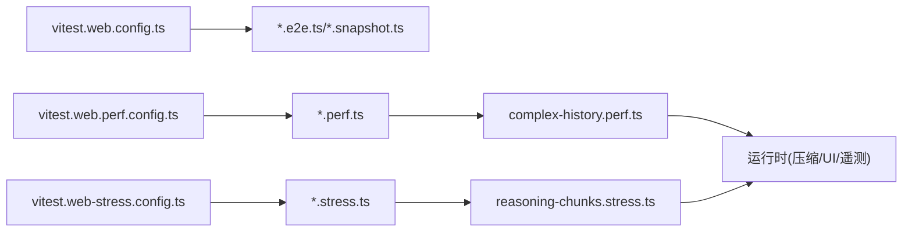

# 性能测试

<cite>
**本文引用的文件**
- [BENCHMARK.md](file://BENCHMARK.md)
- [vitest.web-stress.config.ts](file://vitest.web-stress.config.ts)
- [vitest.web.perf.config.ts](file://vitest.web.perf.config.ts)
- [vitest.web.config.ts](file://vitest.web.config.ts)
- [apps/web/stress-tests/reasoning-chunks.stress.ts](file://apps/web/stress-tests/reasoning-chunks.stress.ts)
- [apps/web/tests/complex-history.perf.ts](file://apps/web/tests/complex-history.perf.ts)
- [apps/cli/src/profile-boot.ts](file://apps/cli/src/profile-boot.ts)
- [packages/compaction/compaction-basic/src/index.ts](file://packages/compaction/compaction-basic/src/index.ts)
- [packages/client/ui-trajectory/src/client/TrajectoryCell.tsx](file://packages/client/ui-trajectory/src/client/TrajectoryCell.tsx)
- [packages/client/ui-trajectory/src/client/layout.ts](file://packages/client/ui-trajectory/src/client/layout.ts)
- [packages/client/ui-conversation/src/client/chat/StatsLine.tsx](file://packages/client/ui-conversation/src/client/chat/StatsLine.tsx)
- [packages/client/ui-trajectory/src/client/TrajectoryTable.tsx](file://packages/client/ui-trajectory/src/client/TrajectoryTable.tsx)
- [packages/session/session-telemetry/src/index.ts](file://packages/session/session-telemetry/src/index.ts)
</cite>

## 目录
1. [简介](#简介)
2. [项目结构](#项目结构)
3. [核心组件](#核心组件)
4. [架构总览](#架构总览)
5. [详细组件分析](#详细组件分析)
6. [依赖关系分析](#依赖关系分析)
7. [性能考量](#性能考量)
8. [故障排查指南](#故障排查指南)
9. [结论](#结论)
10. [附录](#附录)

## 简介
本文件面向 DeepSeek Harness 的性能测试，覆盖负载、压力与基准三类策略，并分别针对 Web 应用与 CLI 工具给出可执行的评估方法。内容包含：
- Web 端：内存使用监控、渲染性能分析、并发请求与交互响应延迟测量。
- CLI 端：启动时间测量、执行效率分析与资源释放路径验证。
- 分布式与微服务场景：会话回放、遥测采集与压测隔离。
- 自动化回归：基准用例持续运行、指标对比与报告输出。
- 结果解读与报告生成：关键指标定义、阈值建议与可视化呈现。

## 项目结构
仓库将性能相关能力分散在多个层面：
- 浏览器性能与压力测试：位于 apps/web 下的 perf 与 stress 用例，配合独立的 Vitest 配置以启用高耗时、非并行执行。
- CLI 启动与生命周期：apps/cli 提供 profile 装配与进程级关闭钩子，便于测量启动时间与资源回收。
- 运行时指标与展示：UI 层暴露 token 用量、解码吞吐、轨迹时长等指标；压缩子系统在步骤前进行压力自适应压缩。
- 遥测接口：session telemetry 抽象出 emit/flush/shutdown 契约，便于接入外部后端。

**图示来源**
- [apps/web/tests/complex-history.perf.ts:1-120](file://apps/web/tests/complex-history.perf.ts#L1-L120)
- [apps/web/stress-tests/reasoning-chunks.stress.ts:1-60](file://apps/web/stress-tests/reasoning-chunks.stress.ts#L1-L60)
- [vitest.web.perf.config.ts:1-15](file://vitest.web.perf.config.ts#L1-L15)
- [vitest.web-stress.config.ts:1-16](file://vitest.web-stress.config.ts#L1-L16)
- [apps/cli/src/profile-boot.ts:1-60](file://apps/cli/src/profile-boot.ts#L1-L60)
- [packages/compaction/compaction-basic/src/index.ts:132-165](file://packages/compaction/compaction-basic/src/index.ts#L132-L165)
- [packages/client/ui-trajectory/src/client/TrajectoryCell.tsx:79-93](file://packages/client/ui-trajectory/src/client/TrajectoryCell.tsx#L79-L93)
- [packages/client/ui-conversation/src/client/chat/StatsLine.tsx:183-213](file://packages/client/ui-conversation/src/client/chat/StatsLine.tsx#L183-L213)
- [packages/client/ui-trajectory/src/client/layout.ts:618-648](file://packages/client/ui-trajectory/src/client/layout.ts#L618-L648)
- [packages/client/ui-trajectory/src/client/TrajectoryTable.tsx:718-764](file://packages/client/ui-trajectory/src/client/TrajectoryTable.tsx#L718-L764)
- [packages/session/session-telemetry/src/index.ts:162-178](file://packages/session/session-telemetry/src/index.ts#L162-L178)

**章节来源**
- [vitest.web.config.ts:1-36](file://vitest.web.config.ts#L1-L36)
- [vitest.web.perf.config.ts:1-15](file://vitest.web.perf.config.ts#L1-L15)
- [vitest.web-stress.config.ts:1-16](file://vitest.web-stress.config.ts#L1-L16)

## 核心组件
- Web 性能基准与压力测试
  - 复杂历史与流式渲染基准：通过构造长会话、大量工具调用与流式增量，测量 DOM 节点数、事件监听器数量、JS 堆大小、用户可见绘制延迟等。
  - 推理分片风暴压力：向渲染管线注入海量分片，测量主线程阻塞与交互响应延迟，确保长时间渲染不卡死。
- CLI 启动与生命周期
  - Profile 装配与补丁栈：按顺序组合 bundle、profile、home、overlay 与遥测开关，保证可重复的启动环境。
  - 进程信号与关闭：SIGTERM/SIGINT 统一走 shutdown，便于测量完整生命周期与资源释放。
- 运行时自适应压缩
  - 步骤前压力检查：根据 token 占用触发压缩，避免上下文膨胀导致的性能退化。
- UI 指标与展示
  - 轨迹行时长、工具调用统计、token 用量与缓存命中等指标在 UI 中呈现，便于定位瓶颈。
- 遥测采集
  - 统一的 emit/flush/shutdown 接口，支持异步落盘或上报，保障压测期间可观测性。

**章节来源**
- [apps/web/tests/complex-history.perf.ts:37-120](file://apps/web/tests/complex-history.perf.ts#L37-L120)
- [apps/web/stress-tests/reasoning-chunks.stress.ts:1-60](file://apps/web/stress-tests/reasoning-chunks.stress.ts#L1-L60)
- [apps/cli/src/profile-boot.ts:141-171](file://apps/cli/src/profile-boot.ts#L141-L171)
- [packages/compaction/compaction-basic/src/index.ts:132-165](file://packages/compaction/compaction-basic/src/index.ts#L132-L165)
- [packages/client/ui-trajectory/src/client/TrajectoryCell.tsx:79-93](file://packages/client/ui-trajectory/src/client/TrajectoryCell.tsx#L79-L93)
- [packages/client/ui-conversation/src/client/chat/StatsLine.tsx:183-213](file://packages/client/ui-conversation/src/client/chat/StatsLine.tsx#L183-L213)
- [packages/client/ui-trajectory/src/client/layout.ts:618-648](file://packages/client/ui-trajectory/src/client/layout.ts#L618-L648)
- [packages/client/ui-trajectory/src/client/TrajectoryTable.tsx:718-764](file://packages/client/ui-trajectory/src/client/TrajectoryTable.tsx#L718-L764)
- [packages/session/session-telemetry/src/index.ts:162-178](file://packages/session/session-telemetry/src/index.ts#L162-L178)

## 架构总览
下图展示了从测试驱动到被测系统的关键路径：Vitest 配置选择用例集，Playwright 启动浏览器或 Node 进程，Web 用例通过 fixture 注入数据并测量指标；CLI 用例通过 profile 装配启动并测量生命周期；运行时压缩与遥测贯穿会话过程。

**图示来源**
- [vitest.web.perf.config.ts:1-15](file://vitest.web.perf.config.ts#L1-L15)
- [vitest.web-stress.config.ts:1-16](file://vitest.web-stress.config.ts#L1-L16)
- [apps/web/tests/complex-history.perf.ts:515-542](file://apps/web/tests/complex-history.perf.ts#L515-L542)
- [packages/compaction/compaction-basic/src/index.ts:132-165](file://packages/compaction/compaction-basic/src/index.ts#L132-L165)
- [packages/session/session-telemetry/src/index.ts:162-178](file://packages/session/session-telemetry/src/index.ts#L162-L178)

## 详细组件分析

### Web 应用性能测试（基准、压力、负载）
- 目标
  - 基准：在可控数据规模下测量首屏、滚动、流式渲染、长历史加载等关键路径的时延与资源占用。
  - 压力：在高吞吐分片或超长会话下保持主线程可用，交互延迟受控。
  - 负载：多会话/多标签页场景下的内存与 CPU 占用趋势。
- 方法与指标
  - 内存与节点：通过浏览器性能 API 获取 JSHeapUsedSize、Nodes、JSEventListeners，结合 DOM 元素计数。
  - 渲染性能：记录用户输入到 DOM 可见再到 paint 的时间差，统计 MutationObserver 批次与记录数。
  - 交互响应：周期性心跳与自定义事件测量主线程最大阻塞与交互处理延迟。
  - 流式吞吐：基于 token 用量与解码耗时计算每秒 token 数。
- 用例入口
  - 复杂历史基准：构造长会话、工具调用与流式增量，断言轨迹行数、DOM 规模与渲染时延。
  - 推理分片压力：注入十万级分片，断言主线程延迟预算与交互延迟预算。

**图示来源**
- [apps/web/tests/complex-history.perf.ts:515-542](file://apps/web/tests/complex-history.perf.ts#L515-L542)
- [apps/web/tests/complex-history.perf.ts:647-743](file://apps/web/tests/complex-history.perf.ts#L647-L743)
- [apps/web/stress-tests/reasoning-chunks.stress.ts:105-147](file://apps/web/stress-tests/reasoning-chunks.stress.ts#L105-L147)

**章节来源**
- [apps/web/tests/complex-history.perf.ts:37-120](file://apps/web/tests/complex-history.perf.ts#L37-L120)
- [apps/web/tests/complex-history.perf.ts:515-542](file://apps/web/tests/complex-history.perf.ts#L515-L542)
- [apps/web/tests/complex-history.perf.ts:647-743](file://apps/web/tests/complex-history.perf.ts#L647-L743)
- [apps/web/stress-tests/reasoning-chunks.stress.ts:1-60](file://apps/web/stress-tests/reasoning-chunks.stress.ts#L1-L60)
- [apps/web/stress-tests/reasoning-chunks.stress.ts:105-147](file://apps/web/stress-tests/reasoning-chunks.stress.ts#L105-L147)

### CLI 工具性能评估（启动时间、执行效率）
- 启动时间测量
  - 通过 profile 装配与补丁栈，固定启动环境，减少噪声。
  - 利用进程信号与 shutdown 钩子，精确测量从进程启动到应用就绪的端到端时间。
- 执行效率分析
  - 结合遥测 flush/shutdown 时机，确认后台任务已清空。
  - 通过命令参数与环境变量控制遥测开关，降低对启动时间的干扰。
- 参考
  - 基准文档指引使用 Python SDK 的最小变体进行独立任务执行。

**图示来源**
- [apps/cli/src/profile-boot.ts:141-171](file://apps/cli/src/profile-boot.ts#L141-L171)
- [apps/cli/src/profile-boot.ts:207-300](file://apps/cli/src/profile-boot.ts#L207-L300)
- [BENCHMARK.md:1-4](file://BENCHMARK.md#L1-L4)

**章节来源**
- [apps/cli/src/profile-boot.ts:141-171](file://apps/cli/src/profile-boot.ts#L141-L171)
- [apps/cli/src/profile-boot.ts:207-300](file://apps/cli/src/profile-boot.ts#L207-L300)
- [BENCHMARK.md:1-4](file://BENCHMARK.md#L1-L4)

### 运行时压缩与压力保护
- 自动压缩触发点：在每个 agent 步骤开始前检查 token 占用，必要时触发压缩，记录被遮蔽的序列范围与 token 估算。
- 错误与告警：对目标压力配置异常进行去重告警，避免重复日志影响性能。
- 收益：防止上下文膨胀导致后续请求与渲染成本上升。

**图示来源**
- [packages/compaction/compaction-basic/src/index.ts:132-165](file://packages/compaction/compaction-basic/src/index.ts#L132-L165)

**章节来源**
- [packages/compaction/compaction-basic/src/index.ts:132-165](file://packages/compaction/compaction-basic/src/index.ts#L132-L165)

### UI 指标与可视化
- 轨迹行时长与工具统计：按绝对时间与工具耗时聚合，生成“墙钟跨度 + 工具直方图”描述，辅助识别热点工具。
- Token 用量与缓存命中：在对话行与轨迹表中展示输入/输出/推理/缓存等维度，便于评估模型侧开销。
- 解码吞吐：基于 decodeMs 与 decodeTokens 计算每秒 token 数，作为 LLM 响应速度指标。

**图示来源**
- [packages/client/ui-trajectory/src/client/TrajectoryCell.tsx:79-93](file://packages/client/ui-trajectory/src/client/TrajectoryCell.tsx#L79-L93)
- [packages/client/ui-conversation/src/client/chat/StatsLine.tsx:183-213](file://packages/client/ui-conversation/src/client/chat/StatsLine.tsx#L183-L213)
- [packages/client/ui-trajectory/src/client/layout.ts:618-648](file://packages/client/ui-trajectory/src/client/layout.ts#L618-L648)
- [packages/client/ui-trajectory/src/client/TrajectoryTable.tsx:718-764](file://packages/client/ui-trajectory/src/client/TrajectoryTable.tsx#L718-L764)

**章节来源**
- [packages/client/ui-trajectory/src/client/TrajectoryCell.tsx:79-93](file://packages/client/ui-trajectory/src/client/TrajectoryCell.tsx#L79-L93)
- [packages/client/ui-conversation/src/client/chat/StatsLine.tsx:183-213](file://packages/client/ui-conversation/src/client/chat/StatsLine.tsx#L183-L213)
- [packages/client/ui-trajectory/src/client/layout.ts:618-648](file://packages/client/ui-trajectory/src/client/layout.ts#L618-L648)
- [packages/client/ui-trajectory/src/client/TrajectoryTable.tsx:718-764](file://packages/client/ui-trajectory/src/client/TrajectoryTable.tsx#L718-L764)

### 遥测与可观测性
- 接口契约：emit 提交记录，flush 刷新管道，shutdown 等待后端空闲后返回。
- 用途：在压测过程中采集 token 用量、步骤时序、压缩事件等，用于事后分析与回归检测。

**章节来源**
- [packages/session/session-telemetry/src/index.ts:162-178](file://packages/session/session-telemetry/src/index.ts#L162-L178)

## 依赖关系分析
- 配置层
  - vitest.web.config.ts：默认 Web 用例集（e2e/snapshot），串行执行，较长超时。
  - vitest.web.perf.config.ts：仅包含 *.perf.ts，禁用控制台拦截，提高诊断信息可见性。
  - vitest.web-stress.config.ts：仅包含 *.stress.ts，关闭文件并行，延长超时，适合真实浏览器压力。
- 用例层
  - complex-history.perf.ts：复杂历史与流式渲染基准。
  - reasoning-chunks.stress.ts：推理分片压力测试。
- 运行时层
  - compaction-basic：步骤前压力检查与压缩。
  - UI 组件：指标展示与统计。
- 遥测层
  - session-telemetry：统一采集与上报。

**图示来源**
- [vitest.web.config.ts:1-36](file://vitest.web.config.ts#L1-L36)
- [vitest.web.perf.config.ts:1-15](file://vitest.web.perf.config.ts#L1-L15)
- [vitest.web-stress.config.ts:1-16](file://vitest.web-stress.config.ts#L1-L16)
- [apps/web/tests/complex-history.perf.ts:1-120](file://apps/web/tests/complex-history.perf.ts#L1-L120)
- [apps/web/stress-tests/reasoning-chunks.stress.ts:1-60](file://apps/web/stress-tests/reasoning-chunks.stress.ts#L1-L60)

**章节来源**
- [vitest.web.config.ts:1-36](file://vitest.web.config.ts#L1-L36)
- [vitest.web.perf.config.ts:1-15](file://vitest.web.perf.config.ts#L1-L15)
- [vitest.web-stress.config.ts:1-16](file://vitest.web-stress.config.ts#L1-L16)

## 性能考量
- Web 应用
  - 内存与节点规模：关注 JSHeapUsedSize、Nodes、JSEventListeners 与 DOM 元素数量变化趋势，避免泄漏。
  - 渲染性能：记录 sendAt→domAt→paintAt 三段延迟，确保用户感知流畅。
  - 主线程阻塞：心跳间隔抖动与交互延迟应低于预算（例如 250ms）。
  - 流式吞吐：以 decodeMs 与 decodeTokens 计算吞吐，评估模型响应速度。
- CLI 工具
  - 启动时间：固定 profile 与补丁栈，排除遥测与 HMR 干扰；使用 SIGTERM/SIGINT 统一收尾。
  - 执行效率：结合遥测 flush/shutdown 确认后台任务清理；避免长时间挂起。
- 分布式与微服务
  - 会话回放：使用独立工作区与会话 ID 隔离压测任务，避免相互干扰。
  - 遥测隔离：通过环境变量关闭遥测或切换后端，降低额外开销。
  - 压缩策略：在步骤前进行压力检查，防止上下文膨胀引发连锁性能问题。
- 自动化回归
  - 持续执行：将 *.perf.ts 与 *.stress.ts 纳入 CI 可选通道，定期运行并归档指标。
  - 结果对比：比较基线指标（如主线程延迟、堆大小、吞吐）与阈值，超阈报警。
  - 报告生成：将 stdout 中的 JSON 报告持久化，供看板与趋势分析。

[本节为通用指导，不直接分析具体文件]

## 故障排查指南
- 浏览器性能测试失败
  - 现象：交互未处理、主线程延迟超标、指标缺失。
  - 排查：检查心跳与自定义事件是否触发；确认 CDP 指标可用；查看控制台错误与警告。
- CLI 启动异常
  - 现象：启动慢、无法退出、遥测未关闭。
  - 排查：确认 profile 装配顺序与补丁栈；检查 SIGTERM/SIGINT 处理；验证 flush/shutdown 调用。
- 压缩与上下文膨胀
  - 现象：后续步骤变慢、token 用量飙升。
  - 排查：观察步骤前压缩触发日志；检查目标压力配置是否正确；确认压缩后遮蔽范围合理。

**章节来源**
- [apps/web/stress-tests/reasoning-chunks.stress.ts:105-147](file://apps/web/stress-tests/reasoning-chunks.stress.ts#L105-L147)
- [apps/cli/src/profile-boot.ts:207-300](file://apps/cli/src/profile-boot.ts#L207-L300)
- [packages/compaction/compaction-basic/src/index.ts:132-165](file://packages/compaction/compaction-basic/src/index.ts#L132-L165)

## 结论
DeepSeek Harness 提供了完善的 Web 与 CLI 性能测试基础设施：通过独立的 Vitest 配置区分基准与压力用例，结合 Playwright 与浏览器 API 实现细粒度指标采集；CLI 通过 profile 装配与进程级关闭钩子保障启动与生命周期测量的准确性；运行时压缩与 UI 指标帮助快速定位瓶颈；遥测接口为分布式场景提供可观测性。建议在 CI 中持续运行基准与压力用例，建立指标基线与阈值，形成自动化回归闭环。

[本节为总结，不直接分析具体文件]

## 附录
- 常用指标定义
  - 主线程延迟：心跳间隔抖动最大值。
  - 交互延迟：从调度时刻到处理完成的毫秒差。
  - 渲染延迟：sendAt→domAt→paintAt 的三段时延。
  - 解码吞吐：decodeTokens / (decodeMs / 1000)。
  - 内存占用：JSHeapUsedSize、Nodes、JSEventListeners。
- 执行方式
  - Web 基准：vitest.web.perf.config.ts 对应的 *.perf.ts。
  - Web 压力：vitest.web-stress.config.ts 对应的 *.stress.ts。
  - CLI 基准：遵循 BENCHMARK.md 指引，使用最小变体与独立工作区。

[本节为补充说明，不直接分析具体文件]