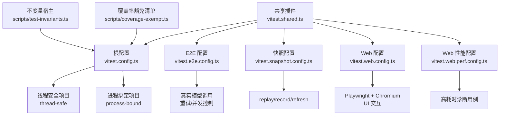
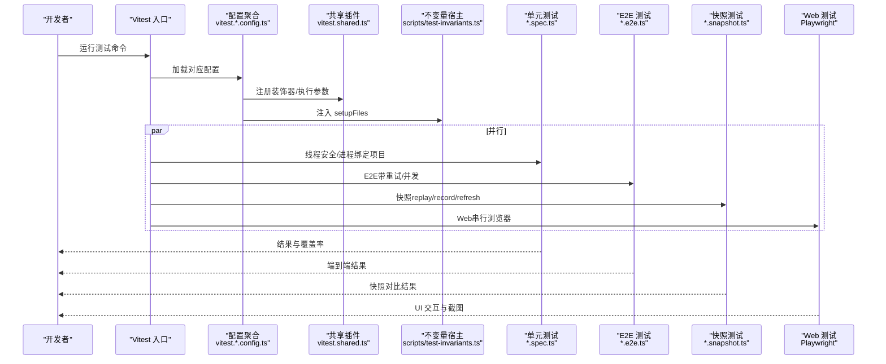
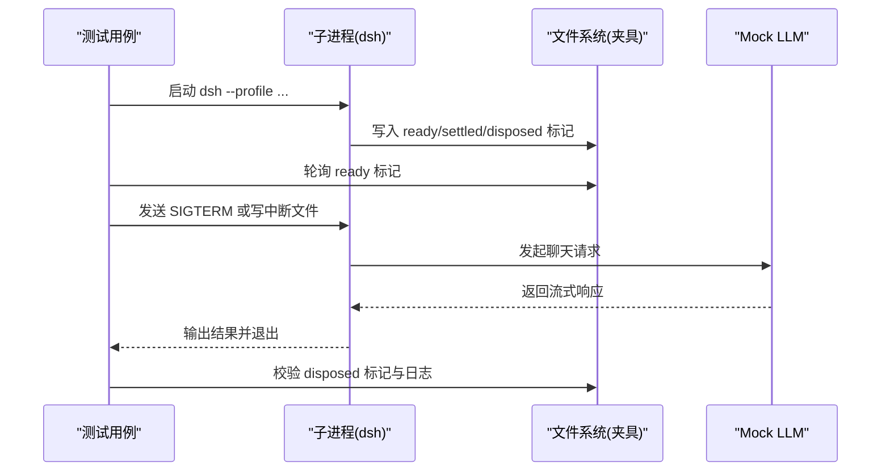
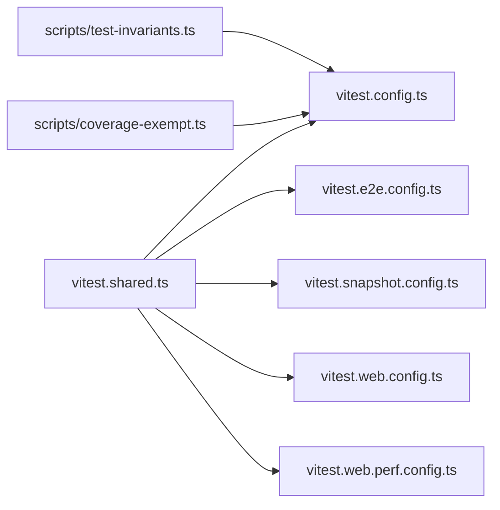

# 测试策略

<cite>
**本文引用的文件**
- [vitest.config.ts](file://vitest.config.ts)
- [vitest.e2e.config.ts](file://vitest.e2e.config.ts)
- [vitest.snapshot.config.ts](file://vitest.snapshot.config.ts)
- [vitest.web.config.ts](file://vitest.web.config.ts)
- [vitest.web.perf.config.ts](file://vitest.web.perf.config.ts)
- [vitest.shared.ts](file://vitest.shared.ts)
- [scripts/test-invariants.ts](file://scripts/test-invariants.ts)
- [scripts/coverage-exempt.ts](file://scripts/coverage-exempt.ts)
- [package.json](file://package.json)
- [apps/cli/tests/args.spec.ts](file://apps/cli/tests/args.spec.ts)
- [apps/cli/tests/built-bin.e2e.ts](file://apps/cli/tests/built-bin.e2e.ts)
- [apps/web/tests/access-confirmation.e2e.ts](file://apps/web/tests/access-confirmation.e2e.ts)
</cite>

## 目录
1. [简介](#简介)
2. [项目结构](#项目结构)
3. [核心组件](#核心组件)
4. [架构总览](#架构总览)
5. [详细组件分析](#详细组件分析)
6. [依赖关系分析](#依赖关系分析)
7. [性能考量](#性能考量)
8. [故障排查指南](#故障排查指南)
9. [结论](#结论)
10. [附录](#附录)

## 简介
本文件为 DeepSeek Harness 的测试策略综合文档，覆盖单元测试、集成测试、端到端（E2E）测试、快照测试、性能与压力测试、覆盖率门禁以及持续集成中的执行与报告。文档基于仓库中实际的 Vitest 配置、共享插件与脚本，给出可操作的编写指南、最佳实践与排错建议，帮助测试开发者快速上手并稳定维护测试套件。

## 项目结构
仓库采用多包工作区组织，测试按“层”拆分到多个 Vitest 配置文件：
- 单元测试：默认 vitest.config.ts，包含 packages/apps/examples/scripts 下的 spec 文件，使用 v8 覆盖率门禁（每文件 100%）。
- E2E 测试：vitest.e2e.config.ts，聚焦真实 API 调用场景，具备重试与并发控制。
- 快照测试：vitest.snapshot.config.ts，支持 replay/record/refresh 三种模式，用于协议与输出一致性校验。
- Web 浏览器测试：vitest.web.config.ts 与 vitest.web.perf.config.ts，基于 Playwright + Chromium 进行 UI 交互与性能诊断。
- 共享能力：vitest.shared.ts 提供装饰器预转换与跨 worker 的 webstorage 隔离参数；scripts/test-invariants.ts 提供全局不变量宿主与配套服务装配。

图表来源
- [vitest.config.ts:117-159](file://vitest.config.ts#L117-L159)
- [vitest.e2e.config.ts:31-57](file://vitest.e2e.config.ts#L31-L57)
- [vitest.snapshot.config.ts:39-67](file://vitest.snapshot.config.ts#L39-L67)
- [vitest.web.config.ts:16-34](file://vitest.web.config.ts#L16-L34)
- [vitest.web.perf.config.ts:6-15](file://vitest.web.perf.config.ts#L6-L15)
- [vitest.shared.ts:15-42](file://vitest.shared.ts#L15-L42)
- [scripts/test-invariants.ts:1-274](file://scripts/test-invariants.ts#L1-L274)
- [scripts/coverage-exempt.ts:1-42](file://scripts/coverage-exempt.ts#L1-L42)

章节来源
- [vitest.config.ts:85-159](file://vitest.config.ts#L85-L159)
- [vitest.e2e.config.ts:1-59](file://vitest.e2e.config.ts#L1-L59)
- [vitest.snapshot.config.ts:1-69](file://vitest.snapshot.config.ts#L1-L69)
- [vitest.web.config.ts:1-36](file://vitest.web.config.ts#L1-L36)
- [vitest.web.perf.config.ts:1-16](file://vitest.web.perf.config.ts#L1-L16)
- [vitest.shared.ts:1-43](file://vitest.shared.ts#L1-L43)
- [scripts/test-invariants.ts:1-274](file://scripts/test-invariants.ts#L1-L274)
- [scripts/coverage-exempt.ts:1-42](file://scripts/coverage-exempt.ts#L1-L42)

## 核心组件
- 多项目运行与隔离
  - 将“线程安全”和“进程绑定”两类用例分离，避免进程级状态污染，提升稳定性。
  - 通过 pool: forks 规避 Node 24 在多线程路径下的已知问题。
- 覆盖率门禁
  - 使用 v8 提供者，阈值要求每文件语句/分支/函数/行均为 100%，并输出未覆盖位置明细。
  - 对重型或平台相关用例提供豁免机制，保证 CI 效率与严格性平衡。
- 装饰器与模块解析
  - 统一在 Vite 解析前对 TypeScript 装饰器进行转译，确保源码模式零构建运行。
  - 通过 tsconfig.base.json 路径映射，避免加载产物副本导致单例重复。
- 不变量宿主
  - 自动发现并挂载各包的 invariant 配套，确保服务拓扑与生命周期在测试中受控。
  - 提供专用附件存储实现以限制图片大小等约束，便于断言边界行为。
- Web 与 E2E 环境
  - Web 测试使用 Playwright 与 Chromium，串行执行以保证浏览器资源稳定。
  - E2E 测试支持 .env 密钥注入、重试与并发上限，适配真实模型调用。

章节来源
- [vitest.config.ts:117-283](file://vitest.config.ts#L117-L283)
- [vitest.shared.ts:1-43](file://vitest.shared.ts#L1-L43)
- [scripts/test-invariants.ts:1-274](file://scripts/test-invariants.ts#L1-L274)
- [vitest.e2e.config.ts:1-59](file://vitest.e2e.config.ts#L1-L59)
- [vitest.web.config.ts:1-36](file://vitest.web.config.ts#L1-L36)

## 架构总览
下图展示了测试运行时如何串联配置、共享插件与各类用例集，并在不同环境中执行。

图表来源
- [vitest.config.ts:117-159](file://vitest.config.ts#L117-L159)
- [vitest.e2e.config.ts:31-57](file://vitest.e2e.config.ts#L31-L57)
- [vitest.snapshot.config.ts:39-67](file://vitest.snapshot.config.ts#L39-L67)
- [vitest.web.config.ts:16-34](file://vitest.web.config.ts#L16-L34)
- [vitest.shared.ts:15-42](file://vitest.shared.ts#L15-L42)
- [scripts/test-invariants.ts:158-209](file://scripts/test-invariants.ts#L158-L209)

## 详细组件分析

### 单元测试（Unit Tests）
- 目标与范围
  - 覆盖 packages、apps、examples、scripts 中的 *.spec.ts。
  - 通过 projects 拆分为 thread-safe 与 process-bound，分别处理线程安全与进程绑定场景。
- 关键配置要点
  - pool: forks 提升稳定性；setupFiles 注入不变量宿主。
  - include/exclude 精细控制 Windows 不支持套件与进程绑定套件。
  - 覆盖率阈值 perFile 100%，并输出未覆盖位置。
- 编写指南
  - 模拟对象：使用 Vitest 内置 vi 进行方法/模块/属性替换，注意 afterEach 恢复。
  - 异步测试：优先使用 async/await 与 expect 的异步断言；必要时设置超时。
  - 并发测试：避免共享进程级状态；需要时放入 process-bound 项目。
  - 错误处理测试：捕获异常或退出码，验证错误消息与副作用。
- 参考示例
  - CLI 参数解析与错误路径断言，展示如何拦截 process.exit 并验证退出码。

章节来源
- [vitest.config.ts:117-159](file://vitest.config.ts#L117-L159)
- [vitest.config.ts:160-283](file://vitest.config.ts#L160-L283)
- [apps/cli/tests/args.spec.ts:1-107](file://apps/cli/tests/args.spec.ts#L1-L107)

### 集成测试（Integration Tests）
- 目标与范围
  - 针对跨模块协作、服务装配、配置合并与生命周期等集成点。
  - 通过不变量宿主自动挂载各包 companion，保证服务拓扑一致。
- 关键配置要点
  - 通过 testInvariantCompanionPaths 选择当前包对应的 invariant 配套。
  - 对特殊测试（如 runtime-diagnostics、examples）提供例外路径。
- 编写指南
  - 使用上下文注入服务，断言服务启动顺序与状态。
  - 利用 TestAttachmentStore 限制图片大小等约束，验证边界行为。
  - 对复杂装配流程，显式 await 服务 fiber 的激活状态。

章节来源
- [scripts/test-invariants.ts:144-209](file://scripts/test-invariants.ts#L144-L209)
- [scripts/test-invariants.ts:227-273](file://scripts/test-invariants.ts#L227-L273)

### 端到端测试（E2E Tests）
- 目标与范围
  - 覆盖 apps/cli 与 examples 的 e2e 场景，包括真实模型调用、CLI 发布入口、配置 dump、热重载与信号处理。
- 关键配置要点
  - 单独配置 vitest.e2e.config.ts，启用 .env 加载、重试与并发上限。
  - 长超时与 hookTimeout，适应外部系统延迟。
- 编写指南
  - 子进程执行：使用 execa 启动已构建的二进制，隔离环境变量与工作目录。
  - 临时夹具：使用 mkdtemp 创建隔离目录，测试后清理。
  - 等待与健壮性：轮询文件标记或事件，避免竞态导致的 flaky。
  - 真实模型：通过 mock server 或密钥注入，断言请求体与响应。
- 参考示例
  - 构建后的 dsh 二进制入口测试，涵盖 help、headless 任务、patch 覆盖、热重载与信号关闭。

图表来源
- [apps/cli/tests/built-bin.e2e.ts:17-47](file://apps/cli/tests/built-bin.e2e.ts#L17-L47)
- [apps/cli/tests/built-bin.e2e.ts:134-158](file://apps/cli/tests/built-bin.e2e.ts#L134-L158)
- [apps/cli/tests/built-bin.e2e.ts:370-395](file://apps/cli/tests/built-bin.e2e.ts#L370-L395)
- [apps/cli/tests/built-bin.e2e.ts:480-546](file://apps/cli/tests/built-bin.e2e.ts#L480-L546)

章节来源
- [vitest.e2e.config.ts:1-59](file://vitest.e2e.config.ts#L1-L59)
- [apps/cli/tests/built-bin.e2e.ts:312-764](file://apps/cli/tests/built-bin.e2e.ts#L312-L764)

### 快照测试（Snapshot Tests）
- 目标与范围
  - 校验协议、组装请求、规范化输出与持久化日志的一致性。
  - 支持 replay（默认）、record（录制真实 API）、refresh（刷新期望值）。
- 关键配置要点
  - 并发控制：replay 模式允许文件级并行与 maxConcurrency 控制；record/refresh 保持串行以避免竞争写。
  - 环境：record 模式加载 .env 获取密钥；replay/refresh 不加载。
- 编写指南
  - 每个场景拥有独立临时状态与夹具集合，避免交叉污染。
  - 使用 compareOrRefreshGolden 比较或更新黄金文件。
  - 在 CI 中固定为 replay，仅本地 record/refresh。

章节来源
- [vitest.snapshot.config.ts:1-69](file://vitest.snapshot.config.ts#L1-L69)

### Web 浏览器测试（UI E2E）
- 目标与范围
  - 基于 Playwright + Chromium 验证 Web 应用的用户交互、权限确认、国际化与 UI 快照。
- 关键配置要点
  - 串行执行（fileParallelism: false），减少浏览器资源竞争。
  - 较长超时，适应页面加载与服务启动。
- 编写指南
  - 使用 scaffold 启动 Web 环境，连接工作区并操作页面元素。
  - 使用 captureStableAria 与 compareOrRefreshGolden 进行 UI 快照对比。
  - 记录失败截图，便于定位问题。

章节来源
- [vitest.web.config.ts:1-36](file://vitest.web.config.ts#L1-L36)
- [apps/web/tests/access-confirmation.e2e.ts:1-81](file://apps/web/tests/access-confirmation.e2e.ts#L1-L81)

### 性能与压力测试（Performance & Stress）
- 目标与范围
  - 在高耗时场景下进行手动诊断，收集指标与日志，辅助性能回归定位。
- 关键配置要点
  - 继承 Web 配置，调整 include 至 *.perf.ts，禁用控制台拦截，提高超时阈值。
- 编写指南
  - 明确测量目标（首屏时间、交互延迟、内存峰值等）。
  - 结合浏览器 DevTools 或自定义埋点，导出可复现实验数据。
  - 在 CI 外运行，避免阻塞主流水线。

章节来源
- [vitest.web.perf.config.ts:1-16](file://vitest.web.perf.config.ts#L1-L16)

## 依赖关系分析
- 配置间依赖
  - 所有配置均复用 vitest.shared.ts 提供的装饰器插件与执行参数。
  - 单元测试通过 scripts/test-invariants.ts 注入不变量宿主，保障服务装配一致性。
  - 覆盖率门禁通过 scripts/coverage-exempt.ts 管理重型用例的豁免。
- 测试与代码依赖
  - 单元测试直接断言业务逻辑；E2E 通过子进程与 mock server 验证完整链路；Web 测试通过 Playwright 驱动浏览器。
- 潜在循环与耦合
  - 通过 projects 拆分与 include/exclude 控制降低耦合；进程绑定用例隔离避免相互影响。

图表来源
- [vitest.shared.ts:15-42](file://vitest.shared.ts#L15-L42)
- [vitest.config.ts:117-159](file://vitest.config.ts#L117-L159)
- [vitest.e2e.config.ts:31-57](file://vitest.e2e.config.ts#L31-L57)
- [vitest.snapshot.config.ts:39-67](file://vitest.snapshot.config.ts#L39-L67)
- [vitest.web.config.ts:16-34](file://vitest.web.config.ts#L16-L34)
- [vitest.web.perf.config.ts:6-15](file://vitest.web.perf.config.ts#L6-L15)
- [scripts/test-invariants.ts:158-209](file://scripts/test-invariants.ts#L158-L209)
- [scripts/coverage-exempt.ts:21-42](file://scripts/coverage-exempt.ts#L21-L42)

章节来源
- [vitest.config.ts:117-283](file://vitest.config.ts#L117-L283)
- [vitest.shared.ts:1-43](file://vitest.shared.ts#L1-L43)
- [scripts/test-invariants.ts:1-274](file://scripts/test-invariants.ts#L1-L274)
- [scripts/coverage-exempt.ts:1-42](file://scripts/coverage-exempt.ts#L1-L42)

## 性能考量
- 运行模式
  - 单元测试使用 fork 池，避免线程共享路径问题；E2E 与 Web 根据场景控制并发。
- 覆盖率开销
  - 重型套件在覆盖门禁中以非插桩方式运行，缩短 CI 时长。
- 浏览器资源
  - Web 测试串行执行，减少浏览器实例竞争；性能测试单独配置以提升超时容忍度。
- 外部依赖
  - E2E 与快照测试对模型调用进行重试与并发限制，避免配额耗尽导致的抖动。

[本节提供通用指导，无需特定文件引用]

## 故障排查指南
- 常见问题定位
  - 装饰器报错：确认已通过 standardDecoratorPlugin 预处理；检查文件扩展名与语法。
  - jsdom 存储冲突：确保使用 vitestExecArgv 传入 --no-webstorage，避免进程级 storage 干扰。
  - 进程绑定用例失败：将其归入 process-bound 项目，避免与其他用例共享进程状态。
  - 覆盖率不达标：查看未覆盖位置报告，补充分支与异常路径断言；必要时申请豁免并说明理由。
  - E2E 超时或 flaky：增加重试次数、延长超时；使用临时夹具与轮询等待，避免竞态。
  - Web 测试不稳定：串行执行浏览器用例；记录失败截图与控制台日志。
- 工具与脚本
  - 使用 scripts/test-invariants.ts 的服务装配断言，快速定位生命周期问题。
  - 使用 scripts/coverage-exempt.ts 管理豁免清单，确保不影响整体覆盖率门禁。

章节来源
- [vitest.shared.ts:5-9](file://vitest.shared.ts#L5-L9)
- [vitest.config.ts:117-159](file://vitest.config.ts#L117-L159)
- [scripts/test-invariants.ts:158-209](file://scripts/test-invariants.ts#L158-L209)
- [scripts/coverage-exempt.ts:21-42](file://scripts/coverage-exempt.ts#L21-L42)

## 结论
DeepSeek Harness 的测试体系通过多配置分层、共享插件与不变量宿主，实现了高内聚、低耦合且稳定的测试执行环境。单元测试强调覆盖率门禁与隔离性，E2E 与 Web 测试关注真实环境与用户旅程，快照测试保障契约一致性，性能测试提供深度诊断能力。遵循本文编写的规范与实践，可有效提升测试质量与可维护性，并在持续集成中提供可靠的反馈。

[本节总结性内容，无需特定文件引用]

## 附录
- 常用命令
  - 运行全部单元测试：pnpm test
  - 生成覆盖率报告：pnpm test:coverage
  - 运行 E2E：pnpm test:e2e
  - 运行快照：pnpm test:snapshot
  - 录制快照：pnpm test:snapshot:record
  - 刷新快照：pnpm test:snapshot:refresh
  - 运行 Web 测试：pnpm test:web
  - 运行 Web 性能：pnpm test:web:perf
- 环境变量
  - DSH_E2E_MAX_WORKERS：控制 E2E 并发上限
  - DSH_SNAPSHOT：replay/record/refresh 模式切换
  - DSH_COVERAGE_EXEMPT_HEAVY：开启重型套件豁免
  - DEEPSEEK_API_KEY、DEEPSEEK_BASE_URL：E2E 与快照测试的模型接入
- 最佳实践
  - 命名规范：spec/e2e/snapshot/perf 后缀清晰区分类型
  - 断言策略：优先精确断言，辅以快照与契约对比
  - 错误处理：覆盖异常路径与边界条件，记录必要上下文
  - 持续集成：在 PR 与主分支触发相应 gate，确保质量门禁生效

章节来源
- [package.json:19-58](file://package.json#L19-L58)
- [vitest.e2e.config.ts:5-14](file://vitest.e2e.config.ts#L5-L14)
- [vitest.snapshot.config.ts:24-37](file://vitest.snapshot.config.ts#L24-L37)
- [scripts/coverage-exempt.ts:21-42](file://scripts/coverage-exempt.ts#L21-L42)