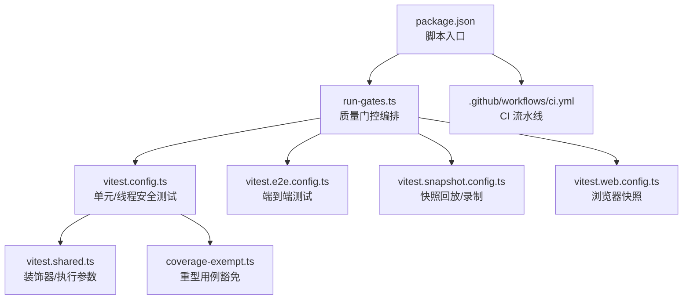
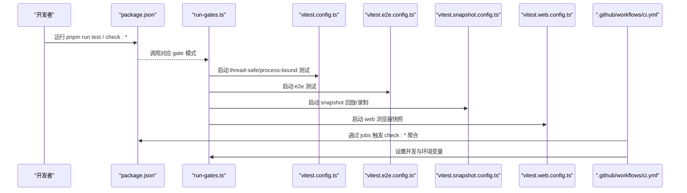
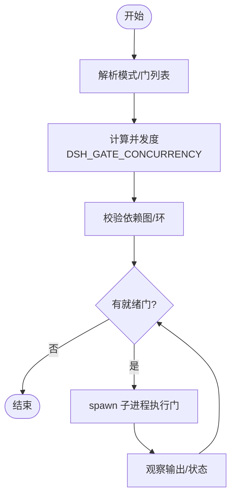
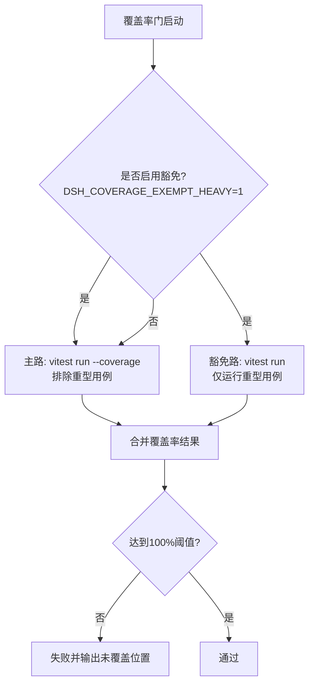
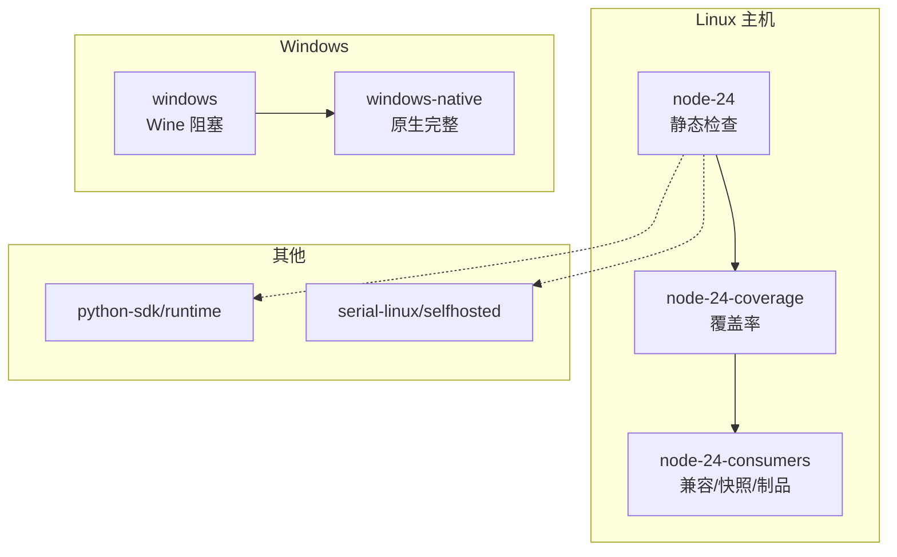
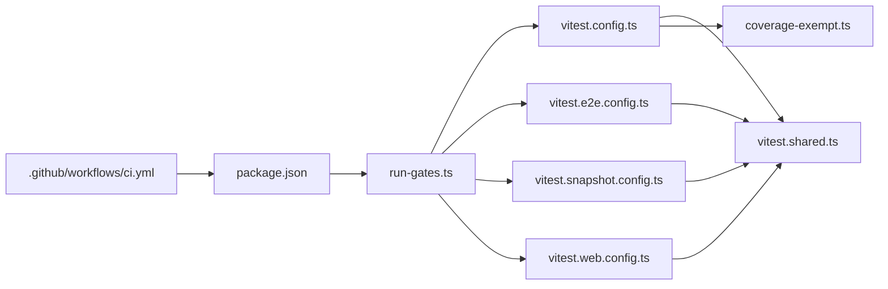

# 测试自动化

<cite>
**本文引用的文件**
- [package.json](file://package.json)
- [vitest.config.ts](file://vitest.config.ts)
- [vitest.e2e.config.ts](file://vitest.e2e.config.ts)
- [vitest.web.config.ts](file://vitest.web.config.ts)
- [vitest.snapshot.config.ts](file://vitest.snapshot.config.ts)
- [vitest.shared.ts](file://vitest.shared.ts)
- [scripts/run-gates.ts](file://scripts/run-gates.ts)
- [scripts/coverage-exempt.ts](file://scripts/coverage-exempt.ts)
- [.github/workflows/ci.yml](file://.github/workflows/ci.yml)
</cite>

## 目录
1. [简介](#简介)
2. [项目结构](#项目结构)
3. [核心组件](#核心组件)
4. [架构总览](#架构总览)
5. [详细组件分析](#详细组件分析)
6. [依赖关系分析](#依赖关系分析)
7. [性能考量](#性能考量)
8. [故障诊断指南](#故障诊断指南)
9. [结论](#结论)
10. [附录](#附录)

## 简介
本文件系统化说明 DeepSeek Harness 的测试自动化体系，覆盖持续集成中的测试流水线设计、不同测试类型的执行顺序与并行策略、GitHub Actions 工作流配置（环境准备、依赖安装、结果收集）、本地测试脚本使用（批量执行与结果汇总）、测试报告生成与可视化（覆盖率、趋势、失败分析）、版本管理与依赖锁定策略，以及开发环境下快速运行特定测试套件的方法与调试工具链。

## 项目结构
仓库采用多包 monorepo 组织，测试相关的关键位置包括：
- 根级 Vitest 配置与共享插件：vitest.config.ts、vitest.shared.ts
- 专用测试通道：E2E、Web、Snapshot
- 质量门控编排器：scripts/run-gates.ts
- 覆盖率豁免清单：scripts/coverage-exempt.ts
- CI 工作流：.github/workflows/ci.yml
- 顶层脚本入口：package.json 中 test 系列命令与 check:* 聚合



**图表来源**
- [package.json:19-142](file://package.json#L19-L142)
- [scripts/run-gates.ts:192-243](file://scripts/run-gates.ts#L192-L243)
- [vitest.config.ts:117-159](file://vitest.config.ts#L117-L159)
- [vitest.e2e.config.ts:31-57](file://vitest.e2e.config.ts#L31-L57)
- [vitest.snapshot.config.ts:39-67](file://vitest.snapshot.config.ts#L39-L67)
- [vitest.web.config.ts:16-34](file://vitest.web.config.ts#L16-L34)
- [vitest.shared.ts:1-43](file://vitest.shared.ts#L1-L43)
- [scripts/coverage-exempt.ts:1-42](file://scripts/coverage-exempt.ts#L1-L42)
- [.github/workflows/ci.yml:1-120](file://.github/workflows/ci.yml#L1-L120)

**章节来源**
- [package.json:19-142](file://package.json#L19-L142)
- [vitest.config.ts:117-159](file://vitest.config.ts#L117-L159)
- [vitest.e2e.config.ts:31-57](file://vitest.e2e.config.ts#L31-L57)
- [vitest.snapshot.config.ts:39-67](file://vitest.snapshot.config.ts#L39-L67)
- [vitest.web.config.ts:16-34](file://vitest.web.config.ts#L16-L34)
- [vitest.shared.ts:1-43](file://vitest.shared.ts#L1-L43)
- [scripts/coverage-exempt.ts:1-42](file://scripts/coverage-exempt.ts#L1-L42)
- [.github/workflows/ci.yml:1-120](file://.github/workflows/ci.yml#L1-L120)

## 核心组件
- 质量门控编排器（run-gates）：定义并调度各类质量门禁（类型检查、Lint、覆盖率、快照、构建产物校验等），支持并发控制与依赖图验证。
- Vitest 多通道配置：
  - 单元测试与线程安全测试（thread-safe/process-bound 双项目）
  - E2E 测试（可配置并发、重试、超时）
  - Web 浏览器快照（串行文件级执行，长超时）
  - 快照回放/录制（replay/record/refresh 模式）
- 覆盖率策略：V8 提供者，严格 100% 阈值；重型用例在独立无插桩通道运行，避免影响主覆盖率门限。
- CI 流水线：按 job 拆分静态检查、覆盖率、消费者/制品、兼容性、Windows Wine/原生、Python SDK 等，具备缓存、回退池与并发控制。

**章节来源**
- [scripts/run-gates.ts:192-243](file://scripts/run-gates.ts#L192-L243)
- [vitest.config.ts:117-159](file://vitest.config.ts#L117-L159)
- [vitest.e2e.config.ts:31-57](file://vitest.e2e.config.ts#L31-L57)
- [vitest.web.config.ts:16-34](file://vitest.web.config.ts#L16-L34)
- [vitest.snapshot.config.ts:39-67](file://vitest.snapshot.config.ts#L39-L67)
- [scripts/coverage-exempt.ts:1-42](file://scripts/coverage-exempt.ts#L1-L42)
- [.github/workflows/ci.yml:115-257](file://.github/workflows/ci.yml#L115-L257)

## 架构总览
下图展示了从 package.json 脚本到 run-gates 编排器，再到各 Vitest 通道的调用关系，以及 CI 如何触发这些脚本。



**图表来源**
- [package.json:19-142](file://package.json#L19-L142)
- [scripts/run-gates.ts:192-243](file://scripts/run-gates.ts#L192-L243)
- [vitest.config.ts:117-159](file://vitest.config.ts#L117-L159)
- [vitest.e2e.config.ts:31-57](file://vitest.e2e.config.ts#L31-L57)
- [vitest.snapshot.config.ts:39-67](file://vitest.snapshot.config.ts#L39-L67)
- [vitest.web.config.ts:16-34](file://vitest.web.config.ts#L16-L34)
- [.github/workflows/ci.yml:115-257](file://.github/workflows/ci.yml#L115-L257)

## 详细组件分析

### 质量门控编排器（run-gates）
- 职责：集中管理所有质量门禁的依赖图、并发度、环境变量与输出摘要。
- 关键能力：
  - 模式解析与门列表构造（ci-primary、ci-coverage、ci-snapshot、ci-consumers 等）
  - 并发默认值计算与 DSH_GATE_CONCURRENCY 覆盖
  - 子进程边界执行，捕获 stdout/stderr、退出码与信号
  - 依赖图校验与环检测，失败传播导致下游跳过
- 典型门：
  - 类型检查、Lint、重复率检测、模块图校验、文档站点构建
  - 覆盖率（含重型用例豁免并行门）
  - 快照（CLI/Web/示例）
  - 构建产物校验、发布前校验、Node 兼容性冒烟



**图表来源**
- [scripts/run-gates.ts:80-97](file://scripts/run-gates.ts#L80-L97)
- [scripts/run-gates.ts:130-156](file://scripts/run-gates.ts#L130-L156)
- [scripts/run-gates.ts:649-699](file://scripts/run-gates.ts#L649-L699)
- [scripts/run-gates.ts:709-777](file://scripts/run-gates.ts#L709-L777)
- [scripts/run-gates.ts:788-800](file://scripts/run-gates.ts#L788-L800)

**章节来源**
- [scripts/run-gates.ts:80-97](file://scripts/run-gates.ts#L80-L97)
- [scripts/run-gates.ts:130-156](file://scripts/run-gates.ts#L130-L156)
- [scripts/run-gates.ts:192-243](file://scripts/run-gates.ts#L192-L243)
- [scripts/run-gates.ts:497-518](file://scripts/run-gates.ts#L497-L518)
- [scripts/run-gates.ts:649-699](file://scripts/run-gates.ts#L649-L699)
- [scripts/run-gates.ts:709-777](file://scripts/run-gates.ts#L709-L777)
- [scripts/run-gates.ts:788-800](file://scripts/run-gates.ts#L788-L800)

### Vitest 多通道配置
- 通用插件与执行参数：
  - 标准装饰器预转换（standardDecoratorPlugin）
  - 统一 execArgv 以避免 Web Storage 冲突
- 单元测试（vitest.config.ts）：
  - 双项目：thread-safe（forks 池，排除进程绑定用例）与 process-bound（仅进程绑定用例）
  - 覆盖率：V8 提供者，100% 阈值，perFile 开启；包含 packages/*/src/**/*.{ts,tsx}，大量排除项
  - Windows 平台差异：排除不支持 Bash 的包与测试
- E2E（vitest.e2e.config.ts）：
  - 加载 .env（可选），文件级并行受 DSH_E2E_MAX_WORKERS 控制，重试 2 次，较长超时
- Web 浏览器（vitest.web.config.ts）：
  - 文件级串行，长超时，适合真实浏览器会话
- 快照（vitest.snapshot.config.ts）：
  - replay/record/refresh 三种模式；replay 默认并行受 DSH_SNAPSHOT_MAX_CONCURRENCY 限制；record/refresh 串行写盘

```mermaid
classDiagram
class VitestConfig {
+projects : ["thread-safe","process-bound"]
+coverage.thresholds : { perFile : true, statements : 100,... }
+include/exclude : 路径集合
}
class E2EConfig {
+testTimeout : 120000
+retry : 2
+maxWorkers : DSH_E2E_MAX_WORKERS
}
class WebConfig {
+fileParallelism : false
+testTimeout : 180000
}
class SnapshotConfig {
+fileParallelism : (mode==replay && concurrency>1)
+maxConcurrency : DSH_SNAPSHOT_MAX_CONCURRENCY
}
VitestConfig <.. E2EConfig : "共享插件/参数"
VitestConfig <.. WebConfig : "共享插件/参数"
VitestConfig <.. SnapshotConfig : "共享插件/参数"
```

**图表来源**
- [vitest.config.ts:117-159](file://vitest.config.ts#L117-L159)
- [vitest.config.ts:160-283](file://vitest.config.ts#L160-L283)
- [vitest.e2e.config.ts:31-57](file://vitest.e2e.config.ts#L31-L57)
- [vitest.web.config.ts:16-34](file://vitest.web.config.ts#L16-L34)
- [vitest.snapshot.config.ts:39-67](file://vitest.snapshot.config.ts#L39-L67)
- [vitest.shared.ts:1-43](file://vitest.shared.ts#L1-L43)

**章节来源**
- [vitest.config.ts:117-159](file://vitest.config.ts#L117-L159)
- [vitest.config.ts:160-283](file://vitest.config.ts#L160-L283)
- [vitest.e2e.config.ts:31-57](file://vitest.e2e.config.ts#L31-L57)
- [vitest.web.config.ts:16-34](file://vitest.web.config.ts#L16-L34)
- [vitest.snapshot.config.ts:39-67](file://vitest.snapshot.config.ts#L39-L67)
- [vitest.shared.ts:1-43](file://vitest.shared.ts#L1-L43)

### 覆盖率策略与重型用例豁免
- 覆盖率提供者：v8
- 阈值：每文件 100%（语句、分支、函数、行）
- 重型用例豁免：
  - 由 coverage-exempt.ts 声明 filter 与 exclude 对
  - 在覆盖率门中，以环境变量标记“豁免”并分两路并行：
    - 主路：带插桩，排除重型用例
    - 豁免路：无插桩，单独运行重型用例
  - 通过 DSH_COVERAGE_MAX_WORKERS 控制两路总并发预算



**图表来源**
- [vitest.config.ts:160-283](file://vitest.config.ts#L160-L283)
- [scripts/coverage-exempt.ts:1-42](file://scripts/coverage-exempt.ts#L1-L42)
- [scripts/run-gates.ts:497-518](file://scripts/run-gates.ts#L497-L518)

**章节来源**
- [vitest.config.ts:160-283](file://vitest.config.ts#L160-L283)
- [scripts/coverage-exempt.ts:1-42](file://scripts/coverage-exempt.ts#L1-L42)
- [scripts/run-gates.ts:497-518](file://scripts/run-gates.ts#L497-L518)

### GitHub Actions 工作流（CI）
- 触发与并发：
  - PR/Push/手动触发；PR 自动取消旧运行；Push 保留以便演练
- 主要 Job：
  - node-24（静态检查）
  - node-24-coverage（覆盖率，含 bubblewrap 准备）
  - node-24-consumers（兼容/快照/制品）
  - node-compat（多 Node 版本冒烟）
  - python-sdk / python-runtime（Python SDK 与运行时制品）
  - windows（Wine 阻塞性检查）
  - windows-native（原生 Windows 完整门禁）
  - serial-linux/selfhosted（串行全量参考）
- 缓存与依赖：
  - pnpm store 缓存键基于 pnpm-lock.yaml
  - Playwright 系统依赖缓存
  - Wine apt 包缓存
- 并发控制：
  - DSH_GATE_CONCURRENCY、DSH_COVERAGE_MAX_WORKERS、DSH_SNAPSHOT_MAX_CONCURRENCY、DSH_E2E_MAX_WORKERS



**图表来源**
- [.github/workflows/ci.yml:63-257](file://.github/workflows/ci.yml#L63-L257)
- [.github/workflows/ci.yml:260-327](file://.github/workflows/ci.yml#L260-L327)
- [.github/workflows/ci.yml:338-489](file://.github/workflows/ci.yml#L338-L489)
- [.github/workflows/ci.yml:495-696](file://.github/workflows/ci.yml#L495-L696)

**章节来源**
- [.github/workflows/ci.yml:63-257](file://.github/workflows/ci.yml#L63-L257)
- [.github/workflows/ci.yml:260-327](file://.github/workflows/ci.yml#L260-L327)
- [.github/workflows/ci.yml:338-489](file://.github/workflows/ci.yml#L338-L489)
- [.github/workflows/ci.yml:495-696](file://.github/workflows/ci.yml#L495-L696)

### 本地测试自动化脚本使用方法
- 常用命令（来自 package.json scripts）：
  - 单元测试：pnpm run test
  - 覆盖率：pnpm run test:coverage
  - E2E：pnpm run test:e2e
  - 快照回放/录制/刷新：pnpm run test:snapshot / test:snapshot:record / test:snapshot:refresh
  - Web 浏览器测试：pnpm run test:web / test:web:refresh / test:web:perf
  - GUI 测试：pnpm run test:gui
  - 聚合门禁：pnpm run check:ci / check:ci:static / check:ci:coverage / check:ci:snapshot / check:ci:consumers / check:ci:artifacts
- 批量执行与结果汇总：
  - 通过 run-gates 的模式（如 ci-primary、ci-coverage、ci-snapshot、ci-consumers）统一调度多个子任务，输出汇总与退出码
- 并发与环境：
  - DSH_GATE_CONCURRENCY 控制整体并发
  - DSH_E2E_MAX_WORKERS、DSH_SNAPSHOT_MAX_CONCURRENCY、DSH_COVERAGE_MAX_WORKERS 分别控制各通道并发
  - DSH_EXAMPLE_MODE、DSH_SNAPSHOT 控制示例与快照行为

**章节来源**
- [package.json:19-142](file://package.json#L19-L142)
- [scripts/run-gates.ts:192-243](file://scripts/run-gates.ts#L192-L243)
- [vitest.e2e.config.ts:18-29](file://vitest.e2e.config.ts#L18-L29)
- [vitest.snapshot.config.ts:8-22](file://vitest.snapshot.config.ts#L8-L22)

### 测试报告的生成与可视化
- 覆盖率报告：
  - 使用 v8 提供者，HTML 与文本报告；CI 下额外输出未覆盖位置明细
  - 阈值：每文件 100%，不达标即失败
- 快照报告：
  - replay 模式对比已提交黄金文件；record 模式调用真实 API 更新；refresh 模式回放脚本并更新当前期望
- 失败分析：
  - run-gates 输出每个门的 stdout/stderr 与耗时；CI 日志可直接定位失败门与子任务
- 趋势与可视化建议：
  - 将覆盖率 HTML 作为工件上传至 CI 平台（当前配置未直接上传，可在 CI 步骤中添加归档）
  - 将快照 diff 与错误堆栈纳入 PR 评论或工件

**章节来源**
- [vitest.config.ts:160-283](file://vitest.config.ts#L160-L283)
- [vitest.snapshot.config.ts:24-67](file://vitest.snapshot.config.ts#L24-L67)
- [scripts/run-gates.ts:788-800](file://scripts/run-gates.ts#L788-L800)

### 测试环境的版本管理与依赖锁定策略
- Node 版本：
  - 根 package.json 指定 engines.node；CI PRIMARY_NODE_VERSION 为 24；兼容性矩阵包含 22.19 与 26
- 包管理器与锁定：
  - pnpm@11.7.0；pnpm-lock.yaml 用于锁定依赖；CI 使用 --frozen-lockfile 确保不可变安装
- 缓存策略：
  - pnpm store 缓存键基于 pnpm-lock.yaml
  - Playwright 系统依赖缓存键基于 pnpm-lock.yaml
  - Wine apt 包缓存键基于镜像 OS 版本
- Python SDK：
  - uv 管理 Python 环境与依赖；pytest 运行测试

**章节来源**
- [package.json:1-18](file://package.json#L1-L18)
- [.github/workflows/ci.yml:37-42](file://.github/workflows/ci.yml#L37-L42)
- [.github/workflows/ci.yml:88-108](file://.github/workflows/ci.yml#L88-L108)
- [.github/workflows/ci.yml:143-176](file://.github/workflows/ci.yml#L143-L176)
- [.github/workflows/ci.yml:206-257](file://.github/workflows/ci.yml#L206-L257)
- [.github/workflows/ci.yml:260-327](file://.github/workflows/ci.yml#L260-L327)
- [.github/workflows/ci.yml:371-402](file://.github/workflows/ci.yml#L371-L402)

### 开发环境中快速运行特定测试套件
- 仅运行某包下的 spec：
  - 使用 vitest 直接过滤路径，例如：pnpm exec vitest run packages/<pkg>/tests/*.spec.ts
- 仅运行 E2E：
  - pnpm run test:e2e
- 仅运行快照回放：
  - pnpm run test:snapshot
- 仅运行 Web 浏览器测试：
  - pnpm run test:web:built
- 调整并发加速：
  - 设置 DSH_GATE_CONCURRENCY、DSH_E2E_MAX_WORKERS、DSH_SNAPSHOT_MAX_CONCURRENCY 等环境变量
- 跳过类型检查/构建：
  - 使用 check:ci:static 或具体 gate 模式，避免不必要的 build 阶段

**章节来源**
- [package.json:19-142](file://package.json#L19-L142)
- [vitest.e2e.config.ts:31-57](file://vitest.e2e.config.ts#L31-L57)
- [vitest.snapshot.config.ts:39-67](file://vitest.snapshot.config.ts#L39-L67)
- [vitest.web.config.ts:16-34](file://vitest.web.config.ts#L16-L34)
- [scripts/run-gates.ts:192-243](file://scripts/run-gates.ts#L192-L243)

### 测试故障诊断与调试的工具链和方法
- 查看未覆盖位置：
  - 覆盖率模式下会输出未覆盖的具体位置（CI 下使用自定义 reporter）
- 隔离问题：
  - 使用 run-gates 的单一 gate 模式（如 ci-static、ci-coverage）缩小范围
  - 针对 E2E/Snapshot/Web 使用各自配置文件单独运行
- 并发与资源争用：
  - 降低 DSH_GATE_CONCURRENCY、DSH_E2E_MAX_WORKERS、DSH_SNAPSHOT_MAX_CONCURRENCY
  - 进程绑定测试已在独立项目内运行，避免干扰
- 平台差异：
  - Windows 下 Bash 相关测试被排除；pwsh 相关测试保留
  - 使用 wine 与 native Windows 两种通道交叉验证
- 日志与工件：
  - run-gates 捕获子进程 stdout/stderr 与退出码；CI 日志可直接定位失败点
  - 可将覆盖率 HTML、快照 diff 作为工件保存便于离线分析

**章节来源**
- [vitest.config.ts:160-283](file://vitest.config.ts#L160-L283)
- [scripts/run-gates.ts:788-800](file://scripts/run-gates.ts#L788-L800)
- [vitest.config.ts:21-46](file://vitest.config.ts#L21-L46)
- [.github/workflows/ci.yml:338-489](file://.github/workflows/ci.yml#L338-L489)

## 依赖关系分析
- 入口依赖：
  - package.json 脚本驱动 run-gates 与各 Vitest 配置
- 内部依赖：
  - run-gates 依赖 coverage-exempt 决定覆盖率豁免
  - 各 Vitest 配置共享 vitest.shared 提供的装饰器插件与执行参数
- 外部依赖：
  - CI 依赖 pnpm、Playwright、Wine、Python/uv 等工具链
- 耦合与内聚：
  - run-gates 高内聚地管理门禁图与并发；Vitest 配置按通道解耦；CI 通过环境变量与缓存松耦合连接



**图表来源**
- [package.json:19-142](file://package.json#L19-L142)
- [scripts/run-gates.ts:192-243](file://scripts/run-gates.ts#L192-L243)
- [vitest.config.ts:117-159](file://vitest.config.ts#L117-L159)
- [vitest.e2e.config.ts:31-57](file://vitest.e2e.config.ts#L31-L57)
- [vitest.snapshot.config.ts:39-67](file://vitest.snapshot.config.ts#L39-L67)
- [vitest.web.config.ts:16-34](file://vitest.web.config.ts#L16-L34)
- [vitest.shared.ts:1-43](file://vitest.shared.ts#L1-L43)
- [scripts/coverage-exempt.ts:1-42](file://scripts/coverage-exempt.ts#L1-L42)
- [.github/workflows/ci.yml:115-257](file://.github/workflows/ci.yml#L115-L257)

**章节来源**
- [package.json:19-142](file://package.json#L19-L142)
- [scripts/run-gates.ts:192-243](file://scripts/run-gates.ts#L192-L243)
- [vitest.config.ts:117-159](file://vitest.config.ts#L117-L159)
- [vitest.e2e.config.ts:31-57](file://vitest.e2e.config.ts#L31-L57)
- [vitest.snapshot.config.ts:39-67](file://vitest.snapshot.config.ts#L39-L67)
- [vitest.web.config.ts:16-34](file://vitest.web.config.ts#L16-L34)
- [vitest.shared.ts:1-43](file://vitest.shared.ts#L1-L43)
- [scripts/coverage-exempt.ts:1-42](file://scripts/coverage-exempt.ts#L1-L42)
- [.github/workflows/ci.yml:115-257](file://.github/workflows/ci.yml#L115-L257)

## 性能考量
- 并发控制：
  - 通过 DSH_GATE_CONCURRENCY 与通道级并发变量（E2E、Snapshot、Coverage）精细调优
- 隔离策略：
  - 进程绑定测试独立项目运行，避免共享状态污染
  - 重型用例豁免通道减少插桩开销
- 缓存优化：
  - pnpm store、Playwright、Wine 依赖缓存显著缩短冷启动时间
- 超时与重试：
  - E2E/Web 使用更长超时；E2E 支持重试以降低瞬态失败影响

[本节提供通用指导，无需特定文件引用]

## 故障诊断指南
- 覆盖率失败：
  - 检查未覆盖位置输出；确认重型用例是否在豁免通道运行
- 快照失败：
  - 确认 DSH_SNAPSHOT 模式（replay/record/refresh）；必要时重新录制
- E2E 不稳定：
  - 降低并发；增加超时；检查 API 配额与重试
- 平台差异：
  - Windows 下 Bash 相关测试被排除；使用 pwsh 替代或切换 native Windows 通道
- 日志定位：
  - 使用 run-gates 输出与 CI 日志定位失败门与子任务

**章节来源**
- [vitest.config.ts:160-283](file://vitest.config.ts#L160-L283)
- [vitest.snapshot.config.ts:24-67](file://vitest.snapshot.config.ts#L24-L67)
- [vitest.e2e.config.ts:31-57](file://vitest.e2e.config.ts#L31-L57)
- [scripts/run-gates.ts:788-800](file://scripts/run-gates.ts#L788-L800)

## 结论
DeepSeek Harness 的测试自动化体系以 run-gates 为核心编排器，结合多通道 Vitest 配置与严格的覆盖率策略，构建了稳定高效的本地与 CI 测试体验。通过并发控制、缓存优化、平台差异化处理与完善的失败诊断手段，既保证了质量门槛，又兼顾了开发与 CI 的效率。建议在后续迭代中继续完善覆盖率可视化工件归档与趋势追踪，进一步提升可观测性与回归效率。

[本节总结性内容，无需特定文件引用]

## 附录
- 常用命令速查：
  - 单元测试：pnpm run test
  - 覆盖率：pnpm run test:coverage
  - E2E：pnpm run test:e2e
  - 快照：pnpm run test:snapshot / test:snapshot:record / test:snapshot:refresh
  - Web：pnpm run test:web / test:web:refresh / test:web:perf
  - 聚合门禁：pnpm run check:ci / check:ci:static / check:ci:coverage / check:ci:snapshot / check:ci:consumers / check:ci:artifacts
- 关键环境变量：
  - DSH_GATE_CONCURRENCY、DSH_E2E_MAX_WORKERS、DSH_SNAPSHOT_MAX_CONCURRENCY、DSH_COVERAGE_MAX_WORKERS
  - DSH_SNAPSHOT（replay/record/refresh）、DSH_EXAMPLE_MODE（lib/source）

**章节来源**
- [package.json:19-142](file://package.json#L19-L142)
- [vitest.e2e.config.ts:18-29](file://vitest.e2e.config.ts#L18-L29)
- [vitest.snapshot.config.ts:8-22](file://vitest.snapshot.config.ts#L8-L22)
- [scripts/run-gates.ts:130-156](file://scripts/run-gates.ts#L130-L156)