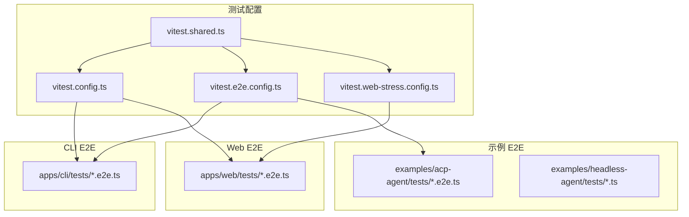
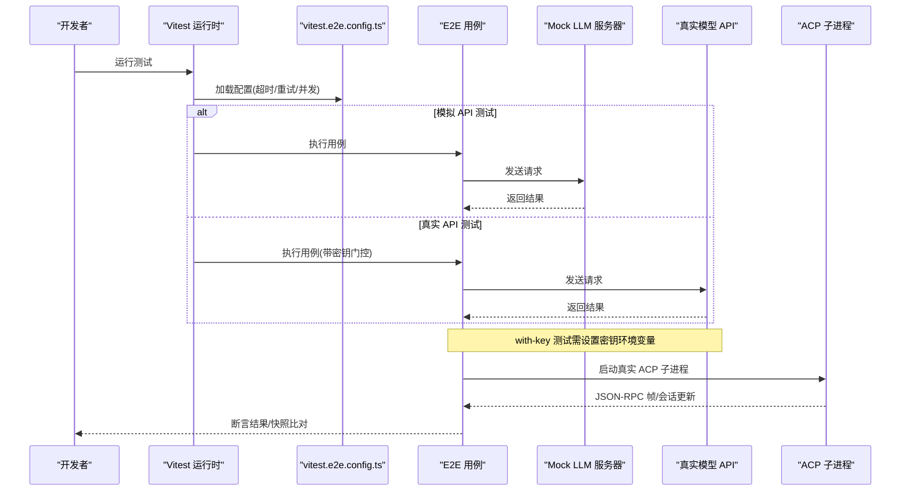
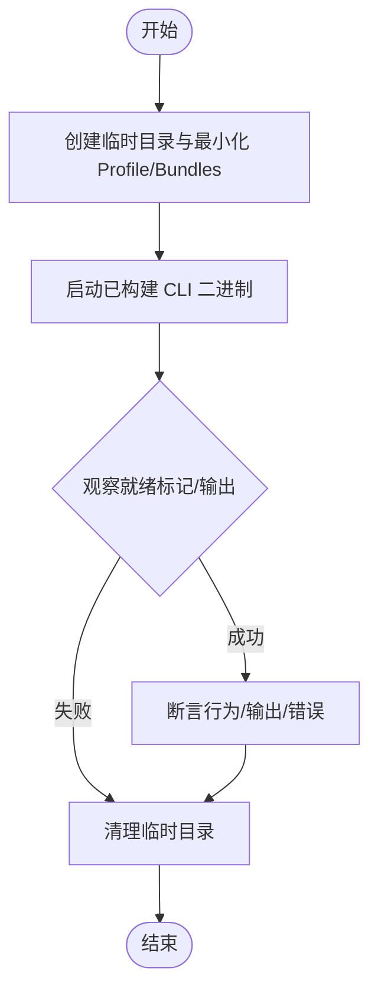
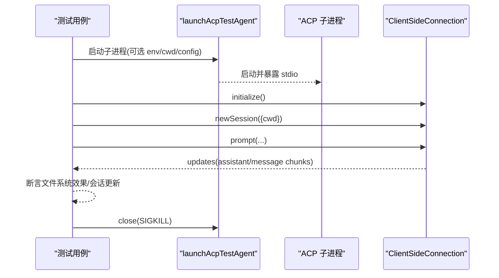
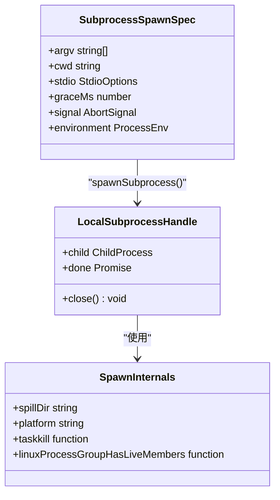
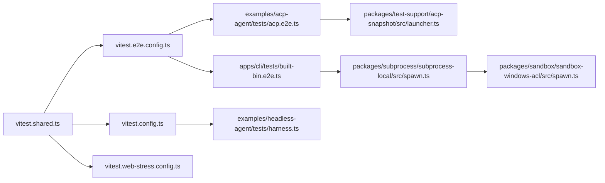

# 集成测试

<cite>
**本文引用的文件**
- [vitest.e2e.config.ts](file://vitest.e2e.config.ts)
- [vitest.config.ts](file://vitest.config.ts)
- [vitest.shared.ts](file://vitest.shared.ts)
- [apps/cli/tests/built-bin.e2e.ts](file://apps/cli/tests/built-bin.e2e.ts)
- [examples/acp-agent/tests/acp.e2e.ts](file://examples/acp-agent/tests/acp.e2e.ts)
- [examples/acp-agent/tests/cleanup.ts](file://examples/acp-agent/tests/cleanup.ts)
- [packages/test-support/acp-snapshot/src/launcher.ts](file://packages/test-support/acp-snapshot/src/launcher.ts)
- [examples/headless-agent/tests/harness.ts](file://examples/headless-agent/tests/harness.ts)
- [packages/subprocess/subprocess-local/src/spawn.ts](file://packages/subprocess/subprocess-local/src/spawn.ts)
- [packages/sandbox/sandbox-windows-acl/src/spawn.ts](file://packages/sandbox/sandbox-windows-acl/src/spawn.ts)
- [vitest.web-stress.config.ts](file://vitest.web-stress.config.ts)
- [scripts/test-invariants.ts](file://scripts/test-invariants.ts)
</cite>

## 目录
1. [简介](#简介)
2. [项目结构](#项目结构)
3. [核心组件](#核心组件)
4. [架构总览](#架构总览)
5. [详细组件分析](#详细组件分析)
6. [依赖关系分析](#依赖关系分析)
7. [性能考量](#性能考量)
8. [故障排查指南](#故障排查指南)
9. [结论](#结论)
10. [附录](#附录)

## 简介
本文件面向 DeepSeek Harness 的集成测试体系，覆盖真实 API 与模拟 API 测试策略、with-key 密钥与环境变量管理、端到端测试编写（夹具、数据与环境）、ACP 自动化测试（录制/回放/差异比较）、子进程启动模式与跨平台兼容、性能与压力测试建议，以及测试隔离与资源清理的最佳实践。目标是帮助读者在不深入源码细节的前提下，理解并正确使用该项目的集成测试能力。

## 项目结构
DeepSeek Harness 将测试按用途分层组织：
- 单元与单测：由 vitest.config.ts 统一配置，包含线程安全与进程绑定两类项目，严格覆盖率门禁。
- 端到端（E2E）：由 vitest.e2e.config.ts 管理，针对真实模型调用场景，支持令牌消耗控制与并发度调节。
- Web 性能/压力：由 vitest.web-stress.config.ts 提供独立入口，用于浏览器侧性能证据收集。
- 示例与插件：通过 examples/* 下的 e2e 套件验证完整装配体行为（如 ACP）。

图表来源
- [vitest.config.ts:1-286](file://vitest.config.ts#L1-L286)
- [vitest.e2e.config.ts:1-59](file://vitest.e2e.config.ts#L1-L59)
- [vitest.web-stress.config.ts:1-15](file://vitest.web-stress.config.ts#L1-L15)
- [vitest.shared.ts:1-43](file://vitest.shared.ts#L1-L43)

章节来源
- [vitest.config.ts:1-286](file://vitest.config.ts#L1-L286)
- [vitest.e2e.config.ts:1-59](file://vitest.e2e.config.ts#L1-L59)
- [vitest.web-stress.config.ts:1-15](file://vitest.web-stress.config.ts#L1-L15)
- [vitest.shared.ts:1-43](file://vitest.shared.ts#L1-L43)

## 核心组件
- 真实 API 与模拟 API 测试分离
  - 真实 API 套件在 vitest.e2e.config.ts 中单独定义，具备较长超时、重试与并发限制，避免影响 CI 稳定性；每个测试在无凭据时自跳过，确保 keyless CI 可运行。
  - 模拟 API 测试通过本地 Mock 服务或内置适配器完成，不消耗令牌，适合快速回归。
- with-key 测试策略
  - 通过环境变量注入密钥（例如 DEEPSEEK_API_KEY），或在根级 .env 中加载；CI 中预检所需密钥，本地开发可借助 .env 文件。
  - 并发度可通过 DSH_E2E_MAX_WORKERS 控制，便于在共享配额下串行执行。
- 端到端测试夹具与环境
  - CLI 构建产物测试通过临时目录与动态生成的 profile/bundle 构造最小化环境，验证生命周期、热重载、参数传递等。
  - Headless 示例使用共享 harness 装配 AgentLoop、工具链与持久化后端，按需启用压缩与检查点策略。
- ACP 自动化测试
  - 通过 @deepseek-ai/dsh-acp-snapshot 启动真实 ACP 子进程，驱动 stdio JSON-RPC，支持无密钥初始化与有密钥提示流程。
  - 快照测试以一次真实会话 JSONL 为 fixture，后续回放比对，保证确定性。
- 子进程启动与跨平台
  - 子进程环境清洗与合并逻辑在 subprocess-local 中实现，Windows 大小写敏感处理与句柄继承在 sandbox-windows-acl 中补齐。
- 性能与压力测试
  - 浏览器压力测试通过独立配置文件启用，关闭文件并行，延长超时，作为显式性能证据通道。

章节来源
- [vitest.e2e.config.ts:1-59](file://vitest.e2e.config.ts#L1-L59)
- [apps/cli/tests/built-bin.e2e.ts:1-764](file://apps/cli/tests/built-bin.e2e.ts#L1-L764)
- [examples/headless-agent/tests/harness.ts:1-105](file://examples/headless-agent/tests/harness.ts#L1-L105)
- [examples/acp-agent/tests/acp.e2e.ts:1-127](file://examples/acp-agent/tests/acp.e2e.ts#L1-L127)
- [packages/test-support/acp-snapshot/src/launcher.ts:38-70](file://packages/test-support/acp-snapshot/src/launcher.ts#L38-L70)
- [packages/subprocess/subprocess-local/src/spawn.ts:29-341](file://packages/subprocess/subprocess-local/src/spawn.ts#L29-L341)
- [packages/sandbox/sandbox-windows-acl/src/spawn.ts:283-304](file://packages/sandbox/sandbox-windows-acl/src/spawn.ts#L283-L304)
- [vitest.web-stress.config.ts:1-15](file://vitest.web-stress.config.ts#L1-L15)

## 架构总览
下图展示了集成测试从配置到执行的总体路径，包括真实 API 与模拟 API 两条主线，以及 ACP 子进程驱动的端到端链路。

图表来源
- [vitest.e2e.config.ts:1-59](file://vitest.e2e.config.ts#L1-L59)
- [examples/acp-agent/tests/acp.e2e.ts:1-127](file://examples/acp-agent/tests/acp.e2e.ts#L1-L127)
- [packages/test-support/acp-snapshot/src/launcher.ts:38-70](file://packages/test-support/acp-snapshot/src/launcher.ts#L38-L70)

## 详细组件分析

### 真实 API 与模拟 API 测试策略
- 真实 API 测试
  - 通过 vitest.e2e.config.ts 中的超时、重试与并发限制保障稳定性；当缺少凭据时，测试自跳过，确保 keyless CI 可用。
  - 密钥来源：环境变量或根级 .env；支持 provider 特定的端点覆盖。
- 模拟 API 测试
  - 使用本地 Mock 服务（如 dsh-llm-mock-server）拦截请求，验证消息体、路径与鉴权头，无需真实令牌。
  - 适用于快速回归与边界条件验证。

章节来源
- [vitest.e2e.config.ts:1-59](file://vitest.e2e.config.ts#L1-L59)
- [apps/cli/tests/built-bin.e2e.ts:370-395](file://apps/cli/tests/built-bin.e2e.ts#L370-L395)

### with-key 测试策略与密钥/环境变量管理
- 密钥注入
  - 通过环境变量（如 DEEPSEEK_API_KEY、DEEPSEEK_BASE_URL）注入；也可在根级 .env 中集中管理。
  - CI 中预检所需密钥，本地开发可借助 .env 文件。
- 并发控制
  - 通过 DSH_E2E_MAX_WORKERS 调整并发度，必要时设为 1 以串行执行，避免共享配额冲突。
- 凭据优先级与隔离
  - 受管凭据存储优先于用户 .env；用户 .env 仅作为后备值，不会污染进程全局环境。
  - 子进程环境会进行清洗与合并，确保敏感信息可控传播。

章节来源
- [vitest.e2e.config.ts:5-14](file://vitest.e2e.config.ts#L5-L14)
- [vitest.e2e.config.ts:18-29](file://vitest.e2e.config.ts#L18-L29)
- [apps/cli/tests/built-bin.e2e.ts:420-458](file://apps/cli/tests/built-bin.e2e.ts#L420-L458)
- [packages/subprocess/subprocess-local/src/spawn.ts:29-46](file://packages/subprocess/subprocess-local/src/spawn.ts#L29-L46)

### 端到端测试编写指南（夹具、数据与环境）
- CLI 构建产物测试
  - 使用临时目录与动态生成的 profile/bundle，构造最小化环境，验证生命周期、热重载、参数传递、错误诊断等。
  - 通过 execa 启动已构建的二进制，捕获 stdout/stderr 与退出码，断言行为。
- Headless 示例测试
  - 使用共享 harness 装配 AgentLoop、工具链与持久化后端，按需启用压缩与检查点策略。
  - 通过事件监听等待空闲状态，提取最终文本输出进行断言。
- Web 测试夹具
  - 提供 realizeSeedFixture 等工具，基于模板生成含 sessionId 与 cwd 的夹具内容，确保可替换与一致性。

图表来源
- [apps/cli/tests/built-bin.e2e.ts:62-147](file://apps/cli/tests/built-bin.e2e.ts#L62-L147)
- [apps/cli/tests/built-bin.e2e.ts:215-310](file://apps/cli/tests/built-bin.e2e.ts#L215-L310)
- [examples/headless-agent/tests/harness.ts:56-84](file://examples/headless-agent/tests/harness.ts#L56-L84)

章节来源
- [apps/cli/tests/built-bin.e2e.ts:1-764](file://apps/cli/tests/built-bin.e2e.ts#L1-L764)
- [examples/headless-agent/tests/harness.ts:1-105](file://examples/headless-agent/tests/harness.ts#L1-L105)

### ACP 自动化测试（会话录制、回放与差异比较）
- 启动与驱动
  - 通过 launchAcpTestAgent 启动真实 ACP 子进程，使用 ClientSideConnection 驱动 JSON-RPC 协议。
  - 支持无密钥初始化与有密钥提示流程；stdout 必须仅包含结构化 JSON-RPC 帧。
- 快照测试
  - 以一次真实会话 JSONL 为 fixture，后续回放比对，保证确定性。
  - 通过 updates 流收集会话更新，断言交互顺序与内容。
- 清理与隔离
  - afterEach 统一关闭子进程并删除工作目录，聚合所有清理失败以便定位问题。

图表来源
- [examples/acp-agent/tests/acp.e2e.ts:1-127](file://examples/acp-agent/tests/acp.e2e.ts#L1-L127)
- [packages/test-support/acp-snapshot/src/launcher.ts:38-70](file://packages/test-support/acp-snapshot/src/launcher.ts#L38-L70)
- [examples/acp-agent/tests/cleanup.ts:1-24](file://examples/acp-agent/tests/cleanup.ts#L1-L24)

章节来源
- [examples/acp-agent/tests/acp.e2e.ts:1-127](file://examples/acp-agent/tests/acp.e2e.ts#L1-L127)
- [packages/test-support/acp-snapshot/src/launcher.ts:38-70](file://packages/test-support/acp-snapshot/src/launcher.ts#L38-L70)
- [examples/acp-agent/tests/cleanup.ts:1-24](file://examples/acp-agent/tests/cleanup.ts#L1-L24)

### 子进程启动模式与跨平台兼容性
- 子进程环境构建
  - childEnv 对父进程环境进行清洗后合并额外条目；Windows 环境下键名大小写规范化，避免重复与覆盖问题。
- 句柄继承与跨平台
  - Windows 下通过 setHandleInformation 启用 stdin/stdout/stderr 继承，确保子进程正确读写。
- 启动规范
  - spawnSubprocess 接收 argv、cwd、stdio、grace、cancellation、environment 等参数，抛出无效参数错误，并在 graceMs 越界时报错。

图表来源
- [packages/subprocess/subprocess-local/src/spawn.ts:29-341](file://packages/subprocess/subprocess-local/src/spawn.ts#L29-L341)
- [packages/sandbox/sandbox-windows-acl/src/spawn.ts:283-304](file://packages/sandbox/sandbox-windows-acl/src/spawn.ts#L283-L304)

章节来源
- [packages/subprocess/subprocess-local/src/spawn.ts:29-341](file://packages/subprocess/subprocess-local/src/spawn.ts#L29-L341)
- [packages/sandbox/sandbox-windows-acl/src/spawn.ts:283-304](file://packages/sandbox/sandbox-windows-acl/src/spawn.ts#L283-L304)

### 性能测试与压力测试实施建议
- 浏览器压力测试
  - 使用 vitest.web-stress.config.ts 独立入口，关闭文件并行，延长超时，作为显式性能证据通道。
  - 适用于响应性信号与可见性能剖析，但不替代确定性聚焦测试。
- 建议
  - 将压力测试与常规回归测试解耦，仅在明确需要性能证据时运行。
  - 结合硬件基线与调度差异，记录趋势而非单次绝对值。

章节来源
- [vitest.web-stress.config.ts:1-15](file://vitest.web-stress.config.ts#L1-L15)

## 依赖关系分析
- 配置层
  - vitest.shared.ts 提供装饰器预处理与 execArgv 标准化，被各测试配置复用。
  - vitest.config.ts 定义线程安全与进程绑定两类项目，严格覆盖率门禁与排除规则。
  - vitest.e2e.config.ts 定义真实 API 套件，加载根级 .env，控制并发与超时。
  - vitest.web-stress.config.ts 定义浏览器压力测试入口。
- 测试层
  - apps/cli/tests/built-bin.e2e.ts 验证 CLI 构建产物行为。
  - examples/acp-agent/tests/acp.e2e.ts 验证 ACP 子进程端到端行为。
  - examples/headless-agent/tests/harness.ts 提供 headless 示例的共享装配。
- 基础设施层
  - packages/test-support/acp-snapshot/src/launcher.ts 提供 ACP 子进程启动与客户端连接。
  - packages/subprocess/subprocess-local/src/spawn.ts 与 packages/sandbox/sandbox-windows-acl/src/spawn.ts 提供跨平台子进程启动支持。

图表来源
- [vitest.shared.ts:1-43](file://vitest.shared.ts#L1-L43)
- [vitest.config.ts:1-286](file://vitest.config.ts#L1-L286)
- [vitest.e2e.config.ts:1-59](file://vitest.e2e.config.ts#L1-L59)
- [vitest.web-stress.config.ts:1-15](file://vitest.web-stress.config.ts#L1-L15)
- [apps/cli/tests/built-bin.e2e.ts:1-764](file://apps/cli/tests/built-bin.e2e.ts#L1-L764)
- [examples/acp-agent/tests/acp.e2e.ts:1-127](file://examples/acp-agent/tests/acp.e2e.ts#L1-L127)
- [examples/headless-agent/tests/harness.ts:1-105](file://examples/headless-agent/tests/harness.ts#L1-L105)
- [packages/test-support/acp-snapshot/src/launcher.ts:38-70](file://packages/test-support/acp-snapshot/src/launcher.ts#L38-L70)
- [packages/subprocess/subprocess-local/src/spawn.ts:29-341](file://packages/subprocess/subprocess-local/src/spawn.ts#L29-L341)
- [packages/sandbox/sandbox-windows-acl/src/spawn.ts:283-304](file://packages/sandbox/sandbox-windows-acl/src/spawn.ts#L283-L304)

章节来源
- [vitest.shared.ts:1-43](file://vitest.shared.ts#L1-L43)
- [vitest.config.ts:1-286](file://vitest.config.ts#L1-L286)
- [vitest.e2e.config.ts:1-59](file://vitest.e2e.config.ts#L1-L59)
- [vitest.web-stress.config.ts:1-15](file://vitest.web-stress.config.ts#L1-L15)

## 性能考量
- 真实 API 测试应谨慎开启高并发，必要时通过 DSH_E2E_MAX_WORKERS=1 串行执行，避免触发配额限制。
- 浏览器压力测试仅作为显式性能证据，不应混入常规回归流水线。
- 子进程启动应避免不必要的句柄继承与冗余环境变量，减少跨平台差异带来的不稳定因素。

[本节为通用指导，不直接分析具体文件]

## 故障排查指南
- 常见失败点
  - 缺少密钥导致真实 API 测试自跳过或启动失败：确认环境变量或 .env 已正确配置。
  - 子进程未正常退出：检查 graceMs 与 killSignal 设置，确保清理逻辑生效。
  - stdout/stderr 泄漏：ACP 测试要求 stdout 仅包含 JSON-RPC 帧，任何非 JSON 行都会导致失败。
- 调试建议
  - 使用临时目录与最小化 profile 复现问题，逐步缩小范围。
  - 查看子进程 stderr 与原始 stdout，定位协议或日志泄漏。
  - 在 Windows 上检查句柄继承与权限设置，确保子进程 I/O 正常。

章节来源
- [examples/acp-agent/tests/acp.e2e.ts:42-66](file://examples/acp-agent/tests/acp.e2e.ts#L42-L66)
- [apps/cli/tests/built-bin.e2e.ts:312-368](file://apps/cli/tests/built-bin.e2e.ts#L312-L368)
- [packages/subprocess/subprocess-local/src/spawn.ts:326-341](file://packages/subprocess/subprocess-local/src/spawn.ts#L326-L341)

## 结论
DeepSeek Harness 的集成测试体系通过分层配置与模块化设计，实现了真实 API 与模拟 API 的清晰分离、with-key 测试的安全可控、端到端测试的可维护性与可扩展性，以及 ACP 自动化测试的确定性与可回放性。配合严格的覆盖率门禁与跨平台子进程支持，能够在保证稳定性的同时，提供高质量的回归与性能证据。

[本节为总结，不直接分析具体文件]

## 附录
- 测试隔离与资源清理最佳实践
  - 每个测试使用独立临时目录，避免状态污染。
  - 统一在 afterEach 中关闭子进程并删除工作目录，聚合清理失败以便定位。
  - 使用共享 harness 与夹具工厂，减少重复代码与不一致配置。
- 环境与配置
  - 通过 scripts/test-invariants.ts 进行前置校验，确保测试环境满足约束。
  - 合理设置超时与重试，平衡稳定性与反馈速度。

章节来源
- [examples/acp-agent/tests/cleanup.ts:1-24](file://examples/acp-agent/tests/cleanup.ts#L1-L24)
- [scripts/test-invariants.ts](file://scripts/test-invariants.ts)