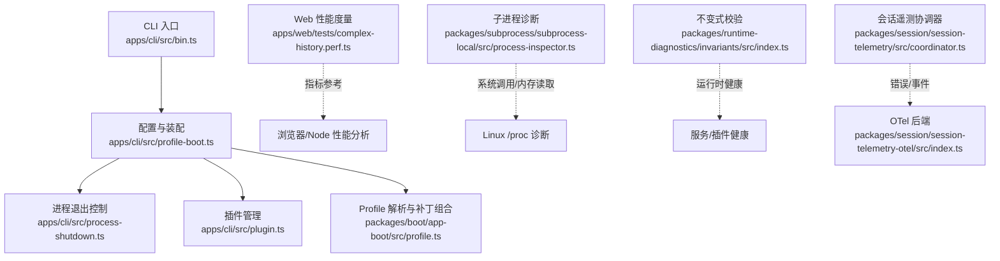
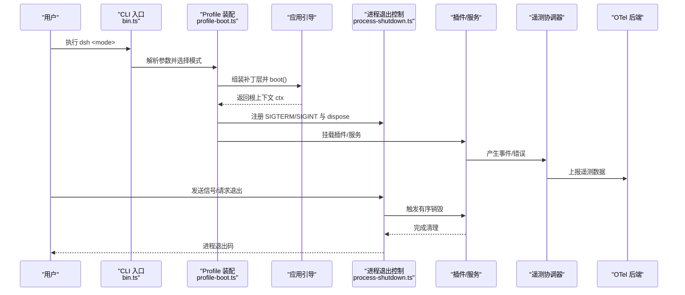
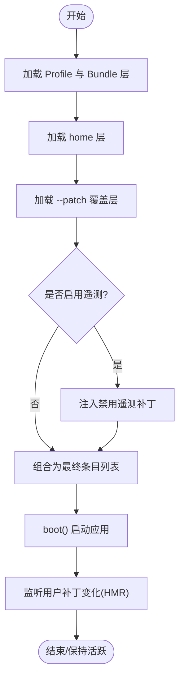
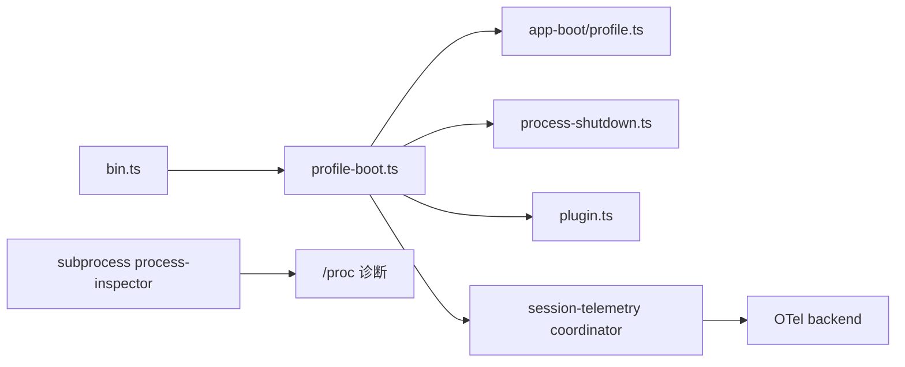

# 调试与性能分析

<cite>
**本文引用的文件**
- [apps/cli/src/bin.ts](file://apps/cli/src/bin.ts)
- [apps/cli/src/profile-boot.ts](file://apps/cli/src/profile-boot.ts)
- [apps/cli/src/process-shutdown.ts](file://apps/cli/src/process-shutdown.ts)
- [apps/cli/src/plugin.ts](file://apps/cli/src/plugin.ts)
- [packages/boot/app-boot/src/profile.ts](file://packages/boot/app-boot/src/profile.ts)
- [packages/runtime-diagnostics/invariants/src/index.ts](file://packages/runtime-diagnostics/invariants/src/index.ts)
- [packages/session/session-telemetry/src/coordinator.ts](file://packages/session/session-telemetry/src/coordinator.ts)
- [packages/session/session-telemetry-otel/src/index.ts](file://packages/session/session-telemetry-otel/src/index.ts)
- [packages/subprocess/subprocess-local/src/process-inspector.ts](file://packages/subprocess/subprocess-local/src/process-inspector.ts)
- [apps/web/tests/complex-history.perf.ts](file://apps/web/tests/complex-history.perf.ts)
</cite>

## 目录
1. [简介](#简介)
2. [项目结构](#项目结构)
3. [核心组件](#核心组件)
4. [架构总览](#架构总览)
5. [详细组件分析](#详细组件分析)
6. [依赖关系分析](#依赖关系分析)
7. [性能考量](#性能考量)
8. [故障排查指南](#故障排查指南)
9. [结论](#结论)
10. [附录](#附录)

## 简介
本指南面向 DeepSeek Harness 的开发者与运维人员，聚焦“调试与性能分析”的实战能力：从开发环境的 VS Code 调试配置、断点与变量检查，到运行时的内存/CPU/网络诊断；从启动时间分析、内存泄漏检测、瓶颈识别，到插件加载、会话状态异常、工具执行错误的常见排障；并给出生产监控与日志收集方案及优化实践。内容基于仓库内 CLI 入口、配置文件热重载、进程退出控制、遥测与不变式校验等实现进行说明，确保可落地、可追溯。

## 项目结构
DeepSeek Harness 采用多包（monorepo）组织，CLI 是统一入口，通过“配置文件 + 补丁层”装配运行时插件树；Web 端提供前端性能度量；子进程模块提供系统级诊断能力；遥测子系统负责事件采集与上报；不变式校验用于运行时健康检查。

**图示来源**
- [apps/cli/src/bin.ts:1-54](file://apps/cli/src/bin.ts#L1-L54)
- [apps/cli/src/profile-boot.ts:1-301](file://apps/cli/src/profile-boot.ts#L1-L301)
- [apps/cli/src/process-shutdown.ts:1-78](file://apps/cli/src/process-shutdown.ts#L1-L78)
- [apps/cli/src/plugin.ts:1-159](file://apps/cli/src/plugin.ts#L1-L159)
- [packages/boot/app-boot/src/profile.ts:1-421](file://packages/boot/app-boot/src/profile.ts#L1-L421)
- [packages/subprocess/subprocess-local/src/process-inspector.ts:127-167](file://packages/subprocess/subprocess-local/src/process-inspector.ts#L127-L167)
- [packages/session/session-telemetry/src/coordinator.ts:228-268](file://packages/session/session-telemetry/src/coordinator.ts#L228-L268)
- [packages/session/session-telemetry-otel/src/index.ts:141-168](file://packages/session/session-telemetry-otel/src/index.ts#L141-L168)
- [apps/web/tests/complex-history.perf.ts:544-568](file://apps/web/tests/complex-history.perf.ts#L544-L568)

**章节来源**
- [apps/cli/src/bin.ts:1-54](file://apps/cli/src/bin.ts#L1-L54)
- [apps/cli/src/profile-boot.ts:1-301](file://apps/cli/src/profile-boot.ts#L1-L301)
- [packages/boot/app-boot/src/profile.ts:1-421](file://packages/boot/app-boot/src/profile.ts#L1-L421)

## 核心组件
- CLI 入口与模式分发：根据命令行参数动态导入 profile、plugin、dump-config 等模式，避免无关代码进入启动路径，缩短冷启动。
- Profile 装配与补丁层：将 bundle 层、用户 patch、home 层、--patch 覆盖层与遥测开关按序组合，形成最终插件树。
- 进程退出控制：统一的优雅退出与强制退出，支持超时保护，防止进程悬挂。
- 插件生命周期：首次初始化、pnpm 转发、依赖变更后的层列表自动对齐。
- 遥测与不变式：捕获 agent 错误、记录操作事件，并通过 OTel 后端上报；不变式校验保障关键约束不被破坏。
- 子进程诊断：读取 /proc 信息判断阻塞与 IO 等待，辅助定位卡死或资源争用。

**章节来源**
- [apps/cli/src/bin.ts:1-54](file://apps/cli/src/bin.ts#L1-L54)
- [apps/cli/src/profile-boot.ts:1-301](file://apps/cli/src/profile-boot.ts#L1-L301)
- [apps/cli/src/process-shutdown.ts:1-78](file://apps/cli/src/process-shutdown.ts#L1-L78)
- [apps/cli/src/plugin.ts:1-159](file://apps/cli/src/plugin.ts#L1-L159)
- [packages/boot/app-boot/src/profile.ts:1-421](file://packages/boot/app-boot/src/profile.ts#L1-L421)
- [packages/session/session-telemetry/src/coordinator.ts:228-268](file://packages/session/session-telemetry/src/coordinator.ts#L228-L268)
- [packages/session/session-telemetry-otel/src/index.ts:141-168](file://packages/session/session-telemetry-otel/src/index.ts#L141-L168)
- [packages/subprocess/subprocess-local/src/process-inspector.ts:127-167](file://packages/subprocess/subprocess-local/src/process-inspector.ts#L127-L167)

## 架构总览
下图展示一次 dsh 调用的启动装配流程，以及配置热重载、信号处理、遥测与退出控制的交互。

**图示来源**
- [apps/cli/src/bin.ts:1-54](file://apps/cli/src/bin.ts#L1-L54)
- [apps/cli/src/profile-boot.ts:1-301](file://apps/cli/src/profile-boot.ts#L1-L301)
- [apps/cli/src/process-shutdown.ts:1-78](file://apps/cli/src/process-shutdown.ts#L1-L78)
- [packages/session/session-telemetry/src/coordinator.ts:228-268](file://packages/session/session-telemetry/src/coordinator.ts#L228-L268)
- [packages/session/session-telemetry-otel/src/index.ts:141-168](file://packages/session/session-telemetry-otel/src/index.ts#L141-L168)

## 详细组件分析

### CLI 入口与模式分发
- 功能要点：
  - 解析命令行参数后，按 mode 动态 import profile、plugin、dump-config，减少冷启动开销。
  - 版本读取自 package.json，便于诊断与报告。
- 调试建议：
  - 在 bin 处设置断点，观察 invocation.mode 与 args，确认路由正确。
  - 使用 Node Inspector 附加到进程，逐步进入对应模式的实现。

**章节来源**
- [apps/cli/src/bin.ts:1-54](file://apps/cli/src/bin.ts#L1-L54)

### Profile 装配与补丁层
- 功能要点：
  - 将 bundle 层、profile 自身 patch、home 层、--patch 覆盖层与遥测开关按序组合。
  - 写入空根配置以作为 Loader 的 baseUrl 锚点，避免重复写入导致配置膨胀。
  - 支持用户 patch 文件的热重载（HMR），长驻进程可实时生效。
- 调试建议：
  - 在 composeProfile 与 allPatches 处打断点，查看各层顺序与最终 rows。
  - 修改 cordis.patch.yml 后观察是否触发 watchUserPatches 重编译。
  - 通过环境变量关闭遥测行，验证开关逻辑。

**图示来源**
- [apps/cli/src/profile-boot.ts:1-301](file://apps/cli/src/profile-boot.ts#L1-L301)
- [packages/boot/app-boot/src/profile.ts:1-421](file://packages/boot/app-boot/src/profile.ts#L1-L421)

**章节来源**
- [apps/cli/src/profile-boot.ts:1-301](file://apps/cli/src/profile-boot.ts#L1-L301)
- [packages/boot/app-boot/src/profile.ts:1-421](file://packages/boot/app-boot/src/profile.ts#L1-L421)

### 进程退出控制
- 功能要点：
  - 提供 shutdown/interrupt 两种退出语义，支持超时强制退出，避免进程悬挂。
  - 统一处理 SIGTERM/SIGINT，保证插件有序销毁。
- 调试建议：
  - 在 dispose 回调中设置断点，确认资源释放顺序。
  - 调整超时时间，观察不同场景下的退出行为。

**章节来源**
- [apps/cli/src/process-shutdown.ts:1-78](file://apps/cli/src/process-shutdown.ts#L1-L78)

### 插件管理与依赖对齐
- 功能要点：
  - 首次使用初始化 profile，转发 pnpm 命令，安装后自动对齐 bundles 列表。
  - 对未声明 bundle 的依赖输出提示，帮助开发者理解为何未生效。
- 调试建议：
  - 在 reconcilePlugins 处断点，检查 bundles 列表变更原因。
  - 当 git 依赖构建被阻止时，根据提示信息添加 allowBuilds。

**章节来源**
- [apps/cli/src/plugin.ts:1-159](file://apps/cli/src/plugin.ts#L1-L159)

### 子进程诊断与阻塞检测
- 功能要点：
  - 读取 /proc/<pid>/task/<tid>/syscall 与内存映射，判断线程是否在等待 stdin 或处于 select/poll/epoll 等待。
- 调试建议：
  - 结合 isStdinWaiting 结果，定位 shell/终端相关阻塞问题。
  - 在 Linux 环境下配合 strace 进一步确认系统调用。

**章节来源**
- [packages/subprocess/subprocess-local/src/process-inspector.ts:127-167](file://packages/subprocess/subprocess-local/src/process-inspector.ts#L127-L167)

### 会话遥测与错误上报
- 功能要点：
  - 捕获 agent/error 事件，转换为 operational 记录，脱敏后上报。
  - OTel 后端支持多种模式，DISABLED 时仅本地告警不上传。
- 调试建议：
  - 在 coordinator.relayAgentError 处断点，检查错误详情与属性。
  - 切换 OTel 模式，验证上报链路是否正常。

**章节来源**
- [packages/session/session-telemetry/src/coordinator.ts:228-268](file://packages/session/session-telemetry/src/coordinator.ts#L228-L268)
- [packages/session/session-telemetry-otel/src/index.ts:141-168](file://packages/session/session-telemetry-otel/src/index.ts#L141-L168)

### Web 端性能度量
- 功能要点：
  - 对比前后 Chromium 指标，计算任务耗时、脚本耗时、布局耗时、节点数、堆大小等增量。
- 调试建议：
  - 在 metricDelta 处断点，观察各项指标变化，定位 UI 卡顿或内存增长。

**章节来源**
- [apps/web/tests/complex-history.perf.ts:544-568](file://apps/web/tests/complex-history.perf.ts#L544-L568)

## 依赖关系分析
- 低耦合高内聚：CLI 入口仅做路由，装配逻辑集中在 profile-boot；Profile 解析与补丁组合独立于具体业务。
- 外部依赖：
  - Cordis 插件系统与 Loader：用于插件装载与配置组合。
  - Node /proc：子进程诊断依赖 Linux 内核接口。
  - OpenTelemetry：遥测上报。
- 潜在循环依赖：通过按需动态 import 与分层装配避免。

**图示来源**
- [apps/cli/src/bin.ts:1-54](file://apps/cli/src/bin.ts#L1-L54)
- [apps/cli/src/profile-boot.ts:1-301](file://apps/cli/src/profile-boot.ts#L1-L301)
- [packages/boot/app-boot/src/profile.ts:1-421](file://packages/boot/app-boot/src/profile.ts#L1-L421)
- [packages/session/session-telemetry/src/coordinator.ts:228-268](file://packages/session/session-telemetry/src/coordinator.ts#L228-L268)
- [packages/session/session-telemetry-otel/src/index.ts:141-168](file://packages/session/session-telemetry-otel/src/index.ts#L141-L168)
- [packages/subprocess/subprocess-local/src/process-inspector.ts:127-167](file://packages/subprocess/subprocess-local/src/process-inspector.ts#L127-L167)

**章节来源**
- [apps/cli/src/bin.ts:1-54](file://apps/cli/src/bin.ts#L1-L54)
- [apps/cli/src/profile-boot.ts:1-301](file://apps/cli/src/profile-boot.ts#L1-L301)
- [packages/boot/app-boot/src/profile.ts:1-421](file://packages/boot/app-boot/src/profile.ts#L1-L421)

## 性能考量
- 启动时间优化：
  - 使用 CLI 的动态 import 模式，避免无关代码进入启动路径。
  - 合理拆分 profile 与补丁层，减少初始装配复杂度。
- 内存分析与泄漏检测：
  - 使用 Node 堆快照（如 node --heapsnapshot）对比启动与长时间运行后的差异。
  - 关注插件/服务的 dispose 是否正确释放引用，结合 process-shutdown 的 dispose 钩子验证。
- CPU 分析与热点定位：
  - 使用 v8 采样分析（node --prof）或 Chrome DevTools 的 Performance 面板。
  - 在 profile-boot 的 boot() 与 watchUserPatches 附近设置采样点，识别装配与热重载开销。
- 网络请求监控：
  - 借助 OTel 后端与代理抓包（如 mitmproxy），追踪 LLM 调用与外部 API。
  - 在 coordinator 的错误上报处断点，关联失败请求与重试策略。
- 性能基准与回归：
  - 复用 Web 端的指标计算方法，建立端到端性能基线，纳入 CI 门禁。

[本节为通用指导，无需特定文件来源]

## 故障排查指南
- 插件加载问题：
  - 现象：bundle 未生效或报错无法解析。
  - 排查：检查 dsh.profile.bundles 列表与依赖安装状态；在 reconcilePlugins 处断点确认自动对齐逻辑；若为 git 依赖构建被阻止，按提示添加 allowBuilds。
  - 参考：插件管理与依赖对齐。
- 会话状态异常：
  - 现象：会话中断、状态不一致或错误未上报。
  - 排查：在 coordinator.relayAgentError 处断点，检查错误详情与属性；确认 OTel 后端模式与上报链路；必要时临时关闭遥测隔离问题。
  - 参考：会话遥测与错误上报。
- 工具执行错误：
  - 现象：工具执行失败或无响应。
  - 排查：结合子进程诊断判断是否卡在 stdin 等待或系统调用；使用 strace 跟踪系统调用；检查进程退出控制是否超时强制退出。
  - 参考：子进程诊断与阻塞检测。
- 配置热重载不生效：
  - 现象：修改 cordis.patch.yml 后未生效。
  - 排查：确认 watchUserPatches 已挂载；检查 HMR 服务是否存在；必要时重启进程。
  - 参考：Profile 装配与补丁层。

**章节来源**
- [apps/cli/src/plugin.ts:1-159](file://apps/cli/src/plugin.ts#L1-L159)
- [packages/session/session-telemetry/src/coordinator.ts:228-268](file://packages/session/session-telemetry/src/coordinator.ts#L228-L268)
- [packages/subprocess/subprocess-local/src/process-inspector.ts:127-167](file://packages/subprocess/subprocess-local/src/process-inspector.ts#L127-L167)
- [apps/cli/src/profile-boot.ts:1-301](file://apps/cli/src/profile-boot.ts#L1-L301)

## 结论
通过对 CLI 入口、Profile 装配、进程退出控制、遥测与子进程诊断等核心组件的系统化分析，开发者可以高效定位插件加载、会话状态与工具执行等问题；结合内存/CPU/网络诊断与性能基线，持续优化启动时间与运行稳定性。建议在开发与生产环境中统一采用上述调试与监控方案，形成闭环的问题定位与性能治理体系。

[本节为总结性内容，无需特定文件来源]

## 附录

### VS Code 调试配置建议
- 调试 CLI：
  - 在 .vscode/launch.json 中添加 Node 调试配置，指向 apps/cli/src/bin.ts，传入所需参数（如 --profile、--patch）。
  - 在 bin.ts 与 profile-boot.ts 的关键分支设置断点，观察装配过程。
- 调试 Web：
  - 使用 Vite 自带的调试能力，开启 sourcemap，在复杂历史渲染处断点，结合性能面板分析。
- 变量检查：
  - 在 composeProfile 中检查 layers、rows 与 overlays；在 process-shutdown 中检查 pending 与 timeout；在 coordinator 中检查错误对象与属性。

[本节为通用指导，无需特定文件来源]

### 运行时诊断工具清单
- 内存分析：Node 堆快照、Chrome DevTools Memory 面板。
- CPU 分析：v8 --prof、Chrome Performance 面板。
- 网络监控：代理抓包、OTel 后端链路追踪。
- 系统级诊断：strace、/proc 读取（子进程诊断模块已封装常用判断）。

[本节为通用指导，无需特定文件来源]

### 生产监控与日志收集方案
- 遥测上报：
  - 使用 OTel 后端集中采集事件与错误，配置合适的采样与脱敏策略。
  - 在生产环境默认开启遥测，开发/测试环境可按需关闭。
- 日志规范：
  - 统一结构化日志，包含 session.id、agent.id、turn、step 等上下文。
  - 对敏感信息进行脱敏，避免泄露密钥与隐私数据。
- 告警与看板：
  - 基于遥测数据建立错误率、延迟、吞吐看板，设置阈值告警。
  - 针对 agent-error 与工具执行失败建立专项告警。

**章节来源**
- [packages/session/session-telemetry/src/coordinator.ts:228-268](file://packages/session/session-telemetry/src/coordinator.ts#L228-L268)
- [packages/session/session-telemetry-otel/src/index.ts:141-168](file://packages/session/session-telemetry-otel/src/index.ts#L141-L168)

### 性能优化最佳实践
- 启动阶段：
  - 最小化初始补丁层数量，延迟加载非关键插件。
  - 利用动态 import 与条件装配减少冷启动体积。
- 运行阶段：
  - 定期生成堆快照，对比基线发现内存泄漏。
  - 对热点路径进行采样分析，消除不必要的同步阻塞。
- 网络阶段：
  - 合并请求、启用缓存与重试退避，降低远端调用成本。
  - 使用 OTel 追踪跨服务调用，定位慢调用根因。

[本节为通用指导，无需特定文件来源]