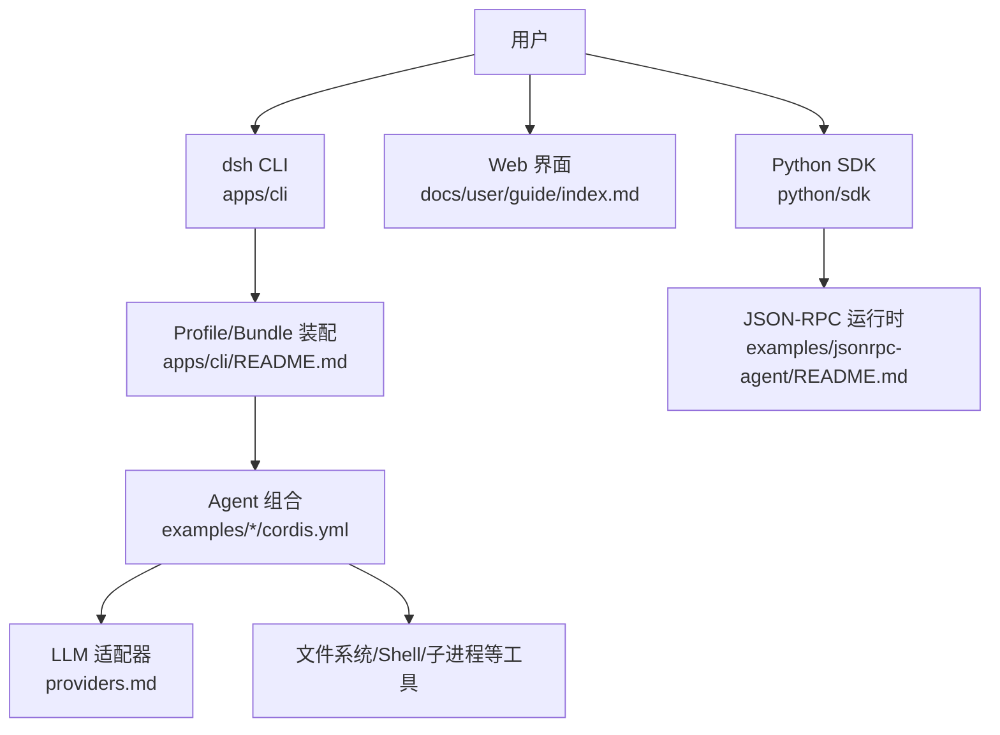
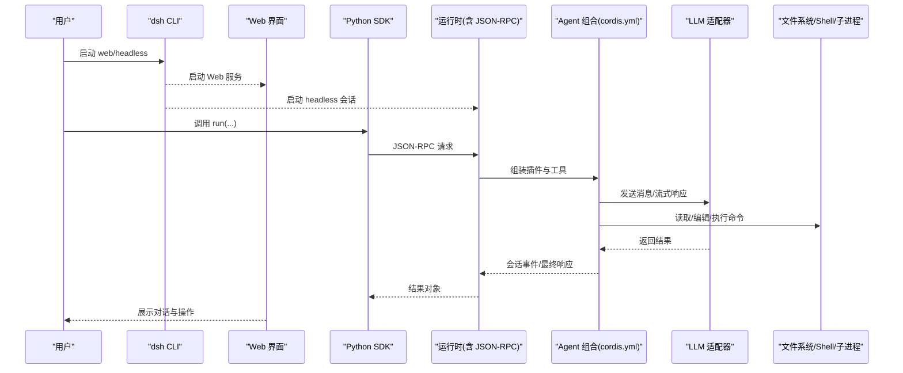
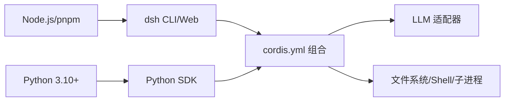

# 快速开始

<cite>
**本文引用的文件**
- [README.md](file://README.md)
- [package.json](file://package.json)
- [apps/cli/README.md](file://apps/cli/README.md)
- [examples/README.md](file://examples/README.md)
- [python/README.md](file://python/README.md)
- [docs/user/guide/index.md](file://docs/user/guide/index.md)
- [docs/user/guide/providers.md](file://docs/user/guide/providers.md)
- [docs/user/guide/python-sdk.md](file://docs/user/guide/python-sdk.md)
- [examples/headless-agent/README.md](file://examples/headless-agent/README.md)
- [examples/jsonrpc-agent/README.md](file://examples/jsonrpc-agent/README.md)
- [examples/jsonrpc-agent/cordis.yml](file://examples/jsonrpc-agent/cordis.yml)
- [apps/cli/config/agent-presets/minimal/agent.cordis.yml](file://apps/cli/config/agent-presets/minimal/agent.cordis.yml)
</cite>

## 目录
1. [简介](#简介)
2. [项目结构](#项目结构)
3. [核心组件](#核心组件)
4. [架构总览](#架构总览)
5. [详细组件分析](#详细组件分析)
6. [依赖分析](#依赖分析)
7. [性能注意事项](#性能注意事项)
8. [故障排除指南](#故障排除指南)
9. [结论](#结论)
10. [附录](#附录)

## 简介
本指南面向首次接触 DeepSeek Harness（简称 dsh）的用户，目标是帮助你：
- 准备运行环境（Node.js、Python 与必要依赖）
- 通过 npm 包或源码两种方式启动项目
- 创建你的第一个 Agent（包含基础 cordis.yml 配置和简单工具）
- 使用 Web 界面、命令行模式与 Python SDK
- 解决常见问题并完成初步排障

DeepSeek Harness 是一个“一切皆插件”的开源 Agent 编排框架，基于 Cordis 构建。它提供 Web 界面、命令行与 Python SDK 三种交互方式，并支持无头（headless）执行与持久化会话。

## 项目结构
仓库采用多包工作区组织，关键入口与示例如下：
- 根 README 提供 npm 与源码两种运行方式
- apps/cli 提供统一的 dsh 命令入口与 profile 机制
- examples 提供可运行的 Agent 组合示例（headless、jsonrpc、web-cordis、acp 等）
- python/sdk 与 python/sdk-runtime 提供 Python SDK 与运行时二进制分发
- docs/user/guide 提供 Web UI、模型配置与 Python SDK 的使用指南

图表来源
- [apps/cli/README.md:1-48](file://apps/cli/README.md#L1-L48)
- [docs/user/guide/index.md:1-31](file://docs/user/guide/index.md#L1-L31)
- [python/README.md:1-21](file://python/README.md#L1-L21)
- [examples/jsonrpc-agent/README.md:1-41](file://examples/jsonrpc-agent/README.md#L1-L41)

章节来源
- [README.md:13-35](file://README.md#L13-L35)
- [apps/cli/README.md:1-48](file://apps/cli/README.md#L1-L48)
- [examples/README.md:1-30](file://examples/README.md#L1-L30)
- [python/README.md:1-21](file://python/README.md#L1-L21)

## 核心组件
- dsh CLI：统一入口，解析参数并加载指定 profile，将后续参数转发给被启动的应用（如 web、headless）。
- Profile/Bundle：以有序层叠的方式组合插件与补丁，支持默认模板与用户自定义覆盖。
- Agent 组合（cordis.yml）：声明式描述 LLM、工具、会话持久化、权限策略等。
- Web 界面：浏览器中管理模型、工作区、会话与任务。
- Python SDK：通过 JSON-RPC stdio 驱动 dsh 运行时，适合脚本化与自动化。

章节来源
- [apps/cli/README.md:1-48](file://apps/cli/README.md#L1-L48)
- [examples/jsonrpc-agent/README.md:1-41](file://examples/jsonrpc-agent/README.md#L1-L41)
- [docs/user/guide/index.md:1-31](file://docs/user/guide/index.md#L1-L31)

## 架构总览
下图展示了从用户到 Agent 执行的端到端流程，涵盖 CLI、Web 与 Python SDK 三种入口。

图表来源
- [apps/cli/README.md:1-48](file://apps/cli/README.md#L1-L48)
- [examples/jsonrpc-agent/README.md:1-41](file://examples/jsonrpc-agent/README.md#L1-L41)
- [docs/user/guide/index.md:1-31](file://docs/user/guide/index.md#L1-L31)

## 详细组件分析

### 环境要求与安装
- Node.js：需要满足引擎版本约束（见根 package.json engines），推荐使用 pnpm 进行依赖安装与脚本执行。
- Python：Python SDK 教程要求 Python 3.10+，并提供虚拟环境与 pip 安装步骤。
- 其他：根据示例可能需要 Bash、POSIX 终端环境（PTY）以及可选的第三方凭据（如 DeepSeek API Key）。

安装与运行要点：
- 通过 npm 包运行 Web 界面：使用 npx 直接启动，无需本地构建。
- 通过源码运行：克隆仓库后执行 pnpm install、pnpm run build，再使用 pnpm dsh web 启动。
- Python SDK：pip 安装 deepseek-harness-sdk，其会附带同版本运行时二进制；设置环境变量后直接运行示例脚本或在自己的程序中使用。

章节来源
- [package.json:8-10](file://package.json#L8-L10)
- [README.md:13-35](file://README.md#L13-L35)
- [docs/user/guide/python-sdk.md:7-27](file://docs/user/guide/python-sdk.md#L7-L27)
- [python/sdk/README.md:1-52](file://python/sdk/README.md#L1-L52)

### 通过 npm 包启动 Web 界面
- 在已安装 Node.js 的环境中，使用 npx 启动 Web 界面。
- 启动后访问默认地址（通常为本地 3080 端口），按提示选择工作区并配置模型即可开始对话。

章节来源
- [README.md:13-23](file://README.md#L13-L23)
- [docs/user/guide/index.md:1-31](file://docs/user/guide/index.md#L1-L31)

### 通过源码启动项目
- 克隆仓库并进入目录。
- 使用 pnpm 安装依赖并构建产物。
- 使用 pnpm dsh web 启动 Web 界面；或使用 pnpm dsh --profile headless 运行一次性任务。

章节来源
- [README.md:25-35](file://README.md#L25-L35)
- [apps/cli/README.md:1-48](file://apps/cli/README.md#L1-L48)

### 创建你的第一个 Agent（最小可用组合）
你可以从内置的最小预设开始，也可以参考 jsonrpc-agent 的完整组合。

- 最小预设（minimal）：仅包含固定系统提示、持久化 bash 与 str_replace_editor 两个工具，适合快速体验。
- 完整组合（jsonrpc-agent）：包含 JSON-RPC 服务器、DeepSeek 适配器、子进程/Shell、文件系统、会话持久化、子代理、任务工具、上下文压缩等，适合自动化与集成。

你可以：
- 在 Web 界面中选择 minimal 预设或加载自定义 cordis.yml。
- 在 Python SDK 中通过 cordis 选项指向示例配置文件，实现无头执行。

章节来源
- [apps/cli/config/agent-presets/minimal/agent.cordis.yml:1-63](file://apps/cli/config/agent-presets/minimal/agent.cordis.yml#L1-L63)
- [examples/jsonrpc-agent/cordis.yml:1-90](file://examples/jsonrpc-agent/cordis.yml#L1-L90)
- [examples/jsonrpc-agent/README.md:1-41](file://examples/jsonrpc-agent/README.md#L1-L41)

### Web 界面基本使用
- 启动后打开 Settings → Models，输入 DeepSeek API Key 并保存，模型路由立即可用。
- 选择工作区后，可在会话中发送任务，Agent 可读写文件、执行命令、委派任务并维护计划。
- 涉及敏感操作时，界面会在当前权限策略下请求批准。

章节来源
- [docs/user/guide/index.md:1-31](file://docs/user/guide/index.md#L1-L31)
- [docs/user/guide/providers.md:1-99](file://docs/user/guide/providers.md#L1-L99)

### 命令行模式（headless）
- 使用 dsh --profile headless 接受一个非空任务，创建并持久化一次会话，输出最终助手文本后退出。
- 可通过环境变量配置模型、工作区、会话目录等。

章节来源
- [examples/headless-agent/README.md:1-33](file://examples/headless-agent/README.md#L1-L33)
- [examples/jsonrpc-agent/README.md:16-29](file://examples/jsonrpc-agent/README.md#L16-L29)

### Python SDK 基本使用
- 安装 deepseek-harness-sdk，它会附带同版本的运行时二进制，无需额外安装 Node.js。
- 设置环境变量（如 DEEPSEEK_API_KEY、DEEPSEEK_BASE_URL、DSH_MODEL、DSH_SYSTEM_PROMPT 等）。
- 运行示例脚本或在自己的程序中通过 DeepSeekHarness 调用 run()，获取最终响应与会话日志。

章节来源
- [docs/user/guide/python-sdk.md:7-105](file://docs/user/guide/python-sdk.md#L7-L105)
- [python/sdk/README.md:1-52](file://python/sdk/README.md#L1-L52)
- [examples/jsonrpc-agent/README.md:16-29](file://examples/jsonrpc-agent/README.md#L16-L29)

## 依赖分析
- 运行时依赖：Node.js（满足 engines 要求）、pnpm（工作区与脚本）、Python（SDK 使用）。
- 插件与组合：通过 cordis.yml 声明式装配 LLM、工具、会话、权限等模块。
- 外部依赖：模型提供商（如 DeepSeek/OpenAI 兼容接口）、可选沙箱（如 E2B）。

图表来源
- [package.json:8-10](file://package.json#L8-L10)
- [examples/jsonrpc-agent/cordis.yml:1-90](file://examples/jsonrpc-agent/cordis.yml#L1-L90)
- [docs/user/guide/python-sdk.md:7-27](file://docs/user/guide/python-sdk.md#L7-L27)

章节来源
- [package.json:8-10](file://package.json#L8-L10)
- [examples/jsonrpc-agent/cordis.yml:1-90](file://examples/jsonrpc-agent/cordis.yml#L1-L90)

## 性能注意事项
- 会话持久化与压缩：jsonrpc-agent 组合默认启用 zstd 压缩，快照场景可关闭以提升可读性。
- 上下文压缩：可根据阈值与保留比例调整，避免过长上下文影响性能。
- Bash 超时与编辑器输出限制：合理设置以避免长时间阻塞或过大输出。
- Token 限制：可通过 max_tokens 控制单次请求输出上限，结合 compaction 策略平衡质量与成本。

章节来源
- [examples/jsonrpc-agent/cordis.yml:39-90](file://examples/jsonrpc-agent/cordis.yml#L39-L90)
- [apps/cli/config/agent-presets/minimal/agent.cordis.yml:18-63](file://apps/cli/config/agent-presets/minimal/agent.cordis.yml#L18-L63)

## 故障排除指南
常见错误与处理建议：
- MISSING_CREDENTIAL：未设置模型提供商密钥或未提供对应环境变量。请在 Web 界面的 Models 页面或通过环境变量配置。
- UNKNOWN_MODEL：选择了未配置的模型。请添加模型或切换到已配置的模型。
- 获取模型列表失败（401）：检查 API Key；若端点不提供 /models，请手动填写模型。
- 图片被拒绝：模型未声明图像模态。为自定义提供商的模型添加 input: [text, image]。
- 提供商拒绝携带图片的请求：模型声明了图像但端点不支持。移除多余的图像能力并新建会话重试。
- 安全与环境注入：确保不在 .env 中设置受保护的环境变量（如权限模式、代理等），以免启动被拒绝。

章节来源
- [docs/user/guide/providers.md:88-99](file://docs/user/guide/providers.md#L88-L99)
- [packages/boot/app-boot/tests/app-boot.spec.ts:129-149](file://packages/boot/app-boot/tests/app-boot.spec.ts#L129-L149)

## 结论
通过本指南，你已经了解了 DeepSeek Harness 的环境要求、两种启动方式、第一个 Agent 的配置方法，以及 Web、命令行与 Python SDK 的基本用法。建议从 minimal 预设入手，逐步过渡到更完整的 jsonrpc-agent 组合，并结合 Web 界面与 Python SDK 完成你的自动化任务。

## 附录
- 更多示例：examples 目录下提供多种可运行示例，包括 headless-agent、jsonrpc-agent、web-cordis、acp-agent 等。
- 文档导航：docs/user/guide 提供 Web 界面、模型配置与 Python SDK 的详细教程。
- 贡献与开发：遵循 CONTRIBUTING.md 与 development 文档参与开发与测试。

章节来源
- [examples/README.md:1-30](file://examples/README.md#L1-L30)
- [docs/user/guide/index.md:1-31](file://docs/user/guide/index.md#L1-L31)