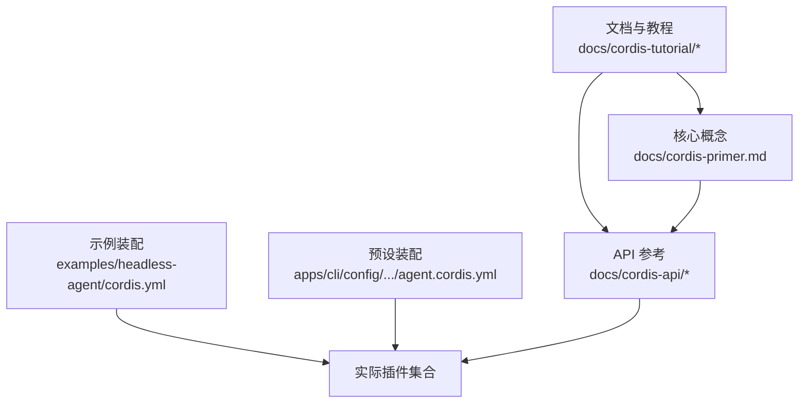
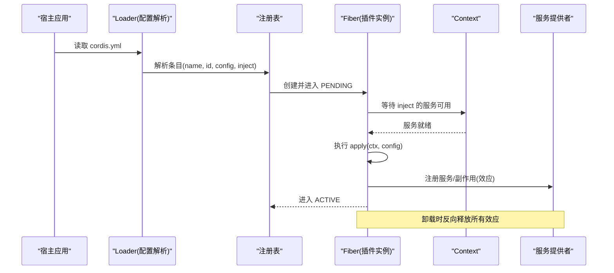
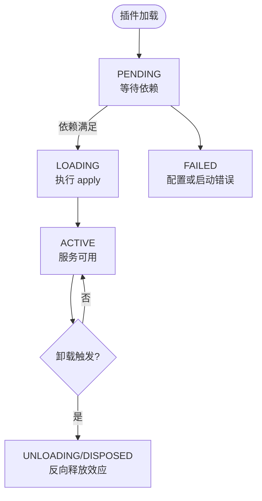
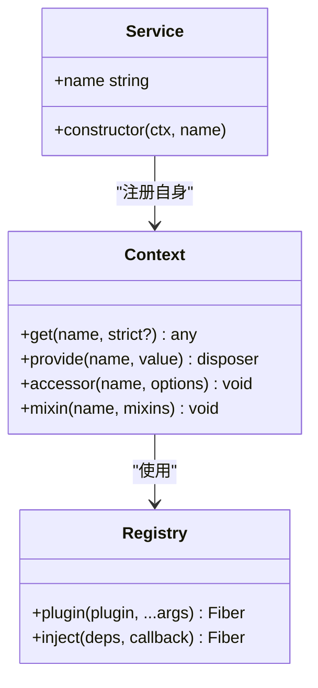
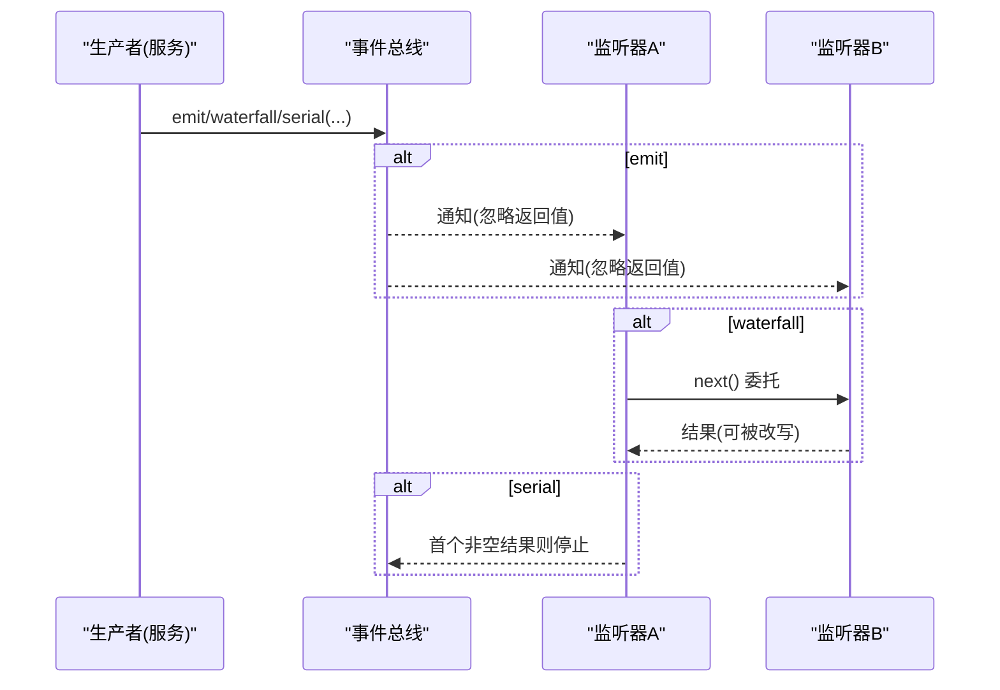
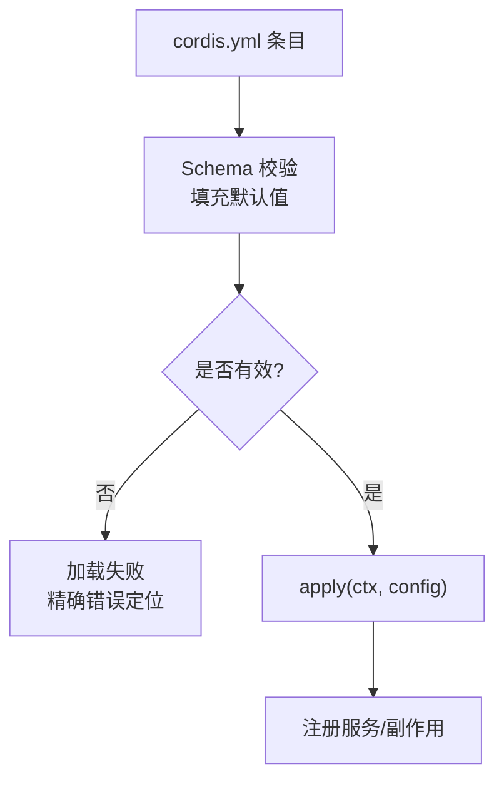
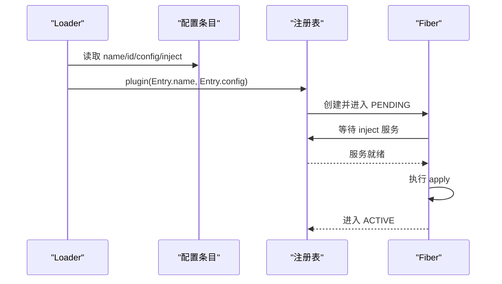
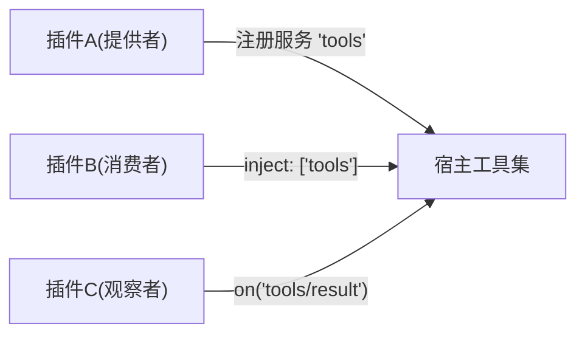

# Cordis 框架基础

<cite>
**本文引用的文件**
- [Cordis 入门](file://docs/cordis-primer.md)
- [教程：第一个插件](file://docs/cordis-tutorial/01-first-plugin.md)
- [教程：生命周期与副作用](file://docs/cordis-tutorial/02-lifecycle-and-effects.md)
- [教程：服务](file://docs/cordis-tutorial/03-services.md)
- [教程：事件](file://docs/cordis-tutorial/04-events.md)
- [教程：配置](file://docs/cordis-tutorial/05-config.md)
- [教程：组合与热重载](file://docs/cordis-tutorial/06-composition-and-hmr.md)
- [教程：接入宿主能力](file://docs/cordis-tutorial/07-into-the-harness.md)
- [上下文 API](file://docs/cordis-api/context.md)
- [服务 API](file://docs/cordis-api/service.md)
- [注册表 API](file://docs/cordis-api/registry.md)
- [无头代理示例配置](file://examples/headless-agent/cordis.yml)
- [标准智能体预设配置](file://apps/cli/config/agent-presets/standard/agent.cordis.yml)
</cite>

## 目录
1. [简介](#简介)
2. [项目结构](#项目结构)
3. [核心组件](#核心组件)
4. [架构总览](#架构总览)
5. [详细组件分析](#详细组件分析)
6. [依赖关系分析](#依赖关系分析)
7. [性能考量](#性能考量)
8. [故障排查指南](#故障排查指南)
9. [结论](#结论)
10. [附录](#附录)

## 简介
本文件面向首次接触 Cordis 的插件开发者，系统阐述插件架构的核心原理与实践方法。内容涵盖：
- 插件生命周期、服务容器与依赖注入机制
- 插件注册与发现流程
- 插件间通信（事件）模式
- 插件配置结构与环境变量处理
- 从零到一开发一个可运行插件的完整流程
- 最佳实践与常见陷阱
- 插件与宿主应用的集成模式

## 项目结构
仓库将 Cordis 的概念、API 与教程集中在 docs 目录下，并通过 examples 与 apps 中的 cordis.yml 展示真实装配方式。教程按“概念渐进”组织：从第一个插件开始，逐步引入生命周期、服务、事件、配置、组合与 HMR，最后接入宿主能力。

图表来源
- [Cordis 入门:1-45](file://docs/cordis-primer.md#L1-L45)
- [教程：第一个插件:1-96](file://docs/cordis-tutorial/01-first-plugin.md#L1-L96)
- [无头代理示例配置:1-166](file://examples/headless-agent/cordis.yml#L1-L166)
- [标准智能体预设配置:1-252](file://apps/cli/config/agent-presets/standard/agent.cordis.yml#L1-L252)

章节来源
- [Cordis 入门:1-45](file://docs/cordis-primer.md#L1-L45)
- [教程：第一个插件:1-96](file://docs/cordis-tutorial/01-first-plugin.md#L1-L96)

## 核心组件
- 上下文 Context：插件运行时唯一入口，承载服务查找、事件总线、日志、插件注册等能力。
- 服务 Service：以稳定键名注册的“能力”，通过依赖声明 inject 被消费，实现解耦与可替换。
- 事件 Events：插件间松耦合通信，支持 emit、parallel、serial、bail、waterfall 多种分发模式。
- 注册表 Registry：负责插件加载、依赖解析、Fiber 生命周期管理。
- Fiber：单个插件实例的运行句柄，经历 PENDING→LOADING→ACTIVE→UNLOADING→DISPOSED 状态机。

章节来源
- [上下文 API:1-365](file://docs/cordis-api/context.md#L1-L365)
- [服务 API:1-103](file://docs/cordis-api/service.md#L1-L103)
- [注册表 API:1-153](file://docs/cordis-api/registry.md#L1-L153)
- [教程：生命周期与副作用:1-99](file://docs/cordis-tutorial/02-lifecycle-and-effects.md#L1-L99)

## 架构总览
Cordis 以“插件即对象”为中心：每个插件要么导出 apply 函数，要么提供类/对象形式的 Service；通过 Context 暴露的能力进行协作。Loader 读取 cordis.yml 并挂载插件树，基于 inject 声明构建依赖图，驱动 Fiber 状态迁移。

图表来源
- [注册表 API:35-56](file://docs/cordis-api/registry.md#L35-L56)
- [上下文 API:237-313](file://docs/cordis-api/context.md#L237-L313)
- [教程：生命周期与副作用:68-81](file://docs/cordis-tutorial/02-lifecycle-and-effects.md#L68-L81)

## 详细组件分析

### 插件生命周期与副作用
- 插件以 Fiber 为单位运行，状态机为 PENDING→LOADING→ACTIVE→UNLOADING→DISPOSED，失败路径进入 FAILED。
- 通过 ctx.effect() 包装外部资源（定时器、连接、监听器），在卸载时自动回收；未用 effect 包裹的资源可能导致泄漏或悬挂回调。
- 子插件通过 ctx.plugin(child) 挂载，返回 fiber 句柄，可调用 dispose() 触发级联卸载。

图表来源
- [教程：生命周期与副作用:68-81](file://docs/cordis-tutorial/02-lifecycle-and-effects.md#L68-L81)

章节来源
- [教程：生命周期与副作用:1-99](file://docs/cordis-tutorial/02-lifecycle-and-effects.md#L1-L99)

### 服务容器与依赖注入
- 服务以稳定键名注册于 Context，消费者通过 inject 声明硬依赖，或通过 ctx.get 进行可选获取。
- 依赖变化会触发依赖方卸载并重新加载，保证引用一致性；这使配置可替换实现成为可能。
- 服务命名在同一应用内全局唯一，建议前缀化避免冲突。

图表来源
- [上下文 API:237-365](file://docs/cordis-api/context.md#L237-L365)
- [服务 API:1-103](file://docs/cordis-api/service.md#L1-L103)
- [注册表 API:8-56](file://docs/cordis-api/registry.md#L8-L56)

章节来源
- [教程：服务:1-99](file://docs/cordis-tutorial/03-services.md#L1-L99)
- [上下文 API:237-365](file://docs/cordis-api/context.md#L237-L365)

### 事件系统与插件通信
- 事件用于“广播/拦截/串联决策”等场景，每种事件有明确的分发模式契约。
- 常用模式：
  - emit：同步广播，不收集返回值
  - parallel：并行执行，统一 await
  - serial/bail：顺序执行，首个非空结果短路
  - waterfall：中间件式拦截，可转换或否决下游
- 事件签名通过 TypeScript 声明合并定义，确保类型安全。

图表来源
- [教程：事件:80-141](file://docs/cordis-tutorial/04-events.md#L80-L141)
- [Cordis 入门:15-34](file://docs/cordis-primer.md#L15-L34)

章节来源
- [教程：事件:1-145](file://docs/cordis-tutorial/04-events.md#L1-L145)
- [Cordis 入门:15-34](file://docs/cordis-primer.md#L15-L34)

### 配置结构与环境变量处理
- 每个 cordis.yml 条目可携带 config 块，插件需导出同名 Schema 进行校验，缺失字段由 schema 默认值补齐。
- 配置在 apply 之前完成验证，错误会直接导致加载失败，避免“半配置”运行。
- 支持 !!js 表达式在 config 与 disabled 中动态计算，可读取环境变量或平台信息。

图表来源
- [教程：配置:1-85](file://docs/cordis-tutorial/05-config.md#L1-L85)

章节来源
- [教程：配置:1-85](file://docs/cordis-tutorial/05-config.md#L1-L85)

### 插件注册与发现
- Loader 读取 cordis.yml 列表，逐项解析 name/id/config/inject/disabled/group/isolate 等元数据。
- 通过 ctx.plugin 或 ctx.inject 动态挂载插件；inject 会等待依赖服务就绪后再执行。
- 组 group 与隔离 isolate 可将一组插件作为单元装载，并为特定服务建立独立作用域。

图表来源
- [注册表 API:8-56](file://docs/cordis-api/registry.md#L8-L56)
- [教程：组合与热重载:7-22](file://docs/cordis-tutorial/06-composition-and-hmr.md#L7-L22)

章节来源
- [教程：组合与热重载:1-114](file://docs/cordis-tutorial/06-composition-and-hmr.md#L1-L114)

### 第一个插件：从创建到运行
- 编写最小插件：导出 name 与 apply(ctx)，在 cordis.yml 中以 name 引用模块。
- 运行：通过 CLI 导入 Cordis 引导脚本，即可加载并执行插件。
- 三种插件形态：函数、对象（含 apply）、类（继承 Service）。

章节来源
- [教程：第一个插件:1-96](file://docs/cordis-tutorial/01-first-plugin.md#L1-L96)

### 接入宿主能力（工具与服务）
- 通过宿主提供的 tools 服务注册工具，并使用 defineTool 描述参数与输出。
- 通过 events 观察工具执行结果，实现观测与审计。
- 典型装配：先加载宿主能力（如 dsh-tools），再加载自定义工具与观察者。

章节来源
- [教程：接入宿主能力:1-108](file://docs/cordis-tutorial/07-into-the-harness.md#L1-L108)

## 依赖关系分析
- 插件之间通过服务键名与事件名称耦合，而非直接 import，提升可替换性与可测试性。
- 依赖图由 inject 声明驱动，Loader 据此决定加载顺序与重试时机。
- 组与隔离允许同一服务在不同作用域提供不同实现，避免进程级冲突。

图表来源
- [教程：服务:44-79](file://docs/cordis-tutorial/03-services.md#L44-L79)
- [教程：事件:80-141](file://docs/cordis-tutorial/04-events.md#L80-L141)

章节来源
- [教程：服务:1-99](file://docs/cordis-tutorial/03-services.md#L1-L99)
- [教程：事件:1-145](file://docs/cordis-tutorial/04-events.md#L1-L145)

## 性能考量
- 事件分发模式选择影响性能与语义：emit 最轻量；parallel 并发但需控制资源；serial/bail 适合决策链；waterfall 适合拦截与改写。
- 避免在高频路径中进行昂贵初始化；将重工作放入按需触发的服务方法或事件处理器。
- 合理使用 isolate 与 group 控制作用域，减少不必要的共享状态竞争。
- 利用 HMR 快速迭代，但注意卸载时的副作用清理，避免重复订阅或悬挂定时器。

[本节为通用指导，不直接分析具体文件]

## 故障排查指南
- 插件始终 PENDING：检查 inject 声明的服务是否由其他插件提供；可通过遍历 registry 查看 Fiber 状态定位缺失依赖。
- 插件加载失败：核对 cordis.yml 中 name 拼写与模块解析；配置错误会在加载阶段抛出明确错误。
- 热重载无效：确认已启用 HMR 插件且 root 包含目标文件；编辑 cordis.yml 时需显式 id 以避免每次都被视为“删除+新增”。
- 事件未触发：确认事件模式与调用方式匹配；waterfall 必须调用 next() 才能继续下游。

章节来源
- [教程：组合与热重载:61-110](file://docs/cordis-tutorial/06-composition-and-hmr.md#L61-L110)
- [教程：第一个插件:79-93](file://docs/cordis-tutorial/01-first-plugin.md#L79-L93)
- [教程：事件:80-141](file://docs/cordis-tutorial/04-events.md#L80-L141)

## 结论
Cordis 以“插件即对象、上下文即容器、事件即通信”为核心，通过声明式依赖与可逆副作用，实现了高内聚、低耦合的可插拔架构。借助配置校验、HMR 与宿主能力集成，开发者可以高效地扩展与定制应用行为。遵循本文的最佳实践，可显著降低集成风险与维护成本。

[本节为总结，不直接分析具体文件]

## 附录

### 实战清单：开发你的第一个插件
- 新建插件文件，导出 name 与 apply(ctx)
- 在 cordis.yml 中添加条目 name 指向该模块
- 运行 CLI 引导脚本，观察输出
- 如需配置，导出 Config Schema 并在条目中传入 config
- 如需依赖服务，添加 inject 声明；如需可选能力，使用 ctx.get
- 如需对外通信，定义事件并监听；如需拦截，使用 waterfall
- 使用 ctx.effect 管理外部资源，确保卸载时正确释放

章节来源
- [教程：第一个插件:1-96](file://docs/cordis-tutorial/01-first-plugin.md#L1-L96)
- [教程：配置:1-85](file://docs/cordis-tutorial/05-config.md#L1-L85)
- [教程：服务:1-99](file://docs/cordis-tutorial/03-services.md#L1-L99)
- [教程：事件:1-145](file://docs/cordis-tutorial/04-events.md#L1-L145)

### 真实装配参考
- 无头代理示例展示了多插件组合：设置、凭据、LLM 适配、子进程、工具、持久化、压缩策略、工作流等。
- 标准智能体预设展示了按领域分组与隔离的装配方式，包括计划模式、压缩、委派与工作流等。

章节来源
- [无头代理示例配置:1-166](file://examples/headless-agent/cordis.yml#L1-L166)
- [标准智能体预设配置:1-252](file://apps/cli/config/agent-presets/standard/agent.cordis.yml#L1-L252)