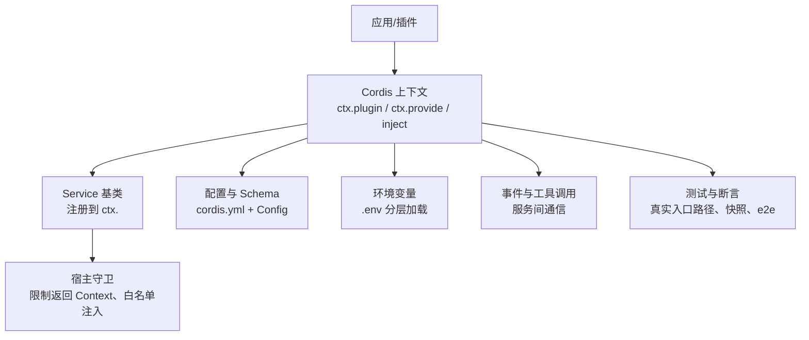
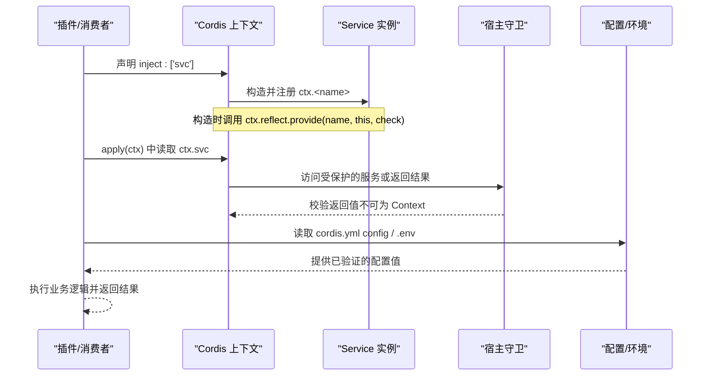
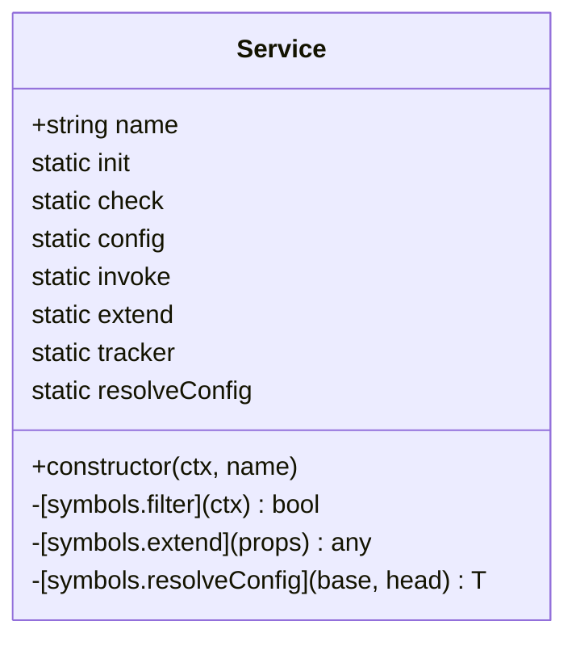
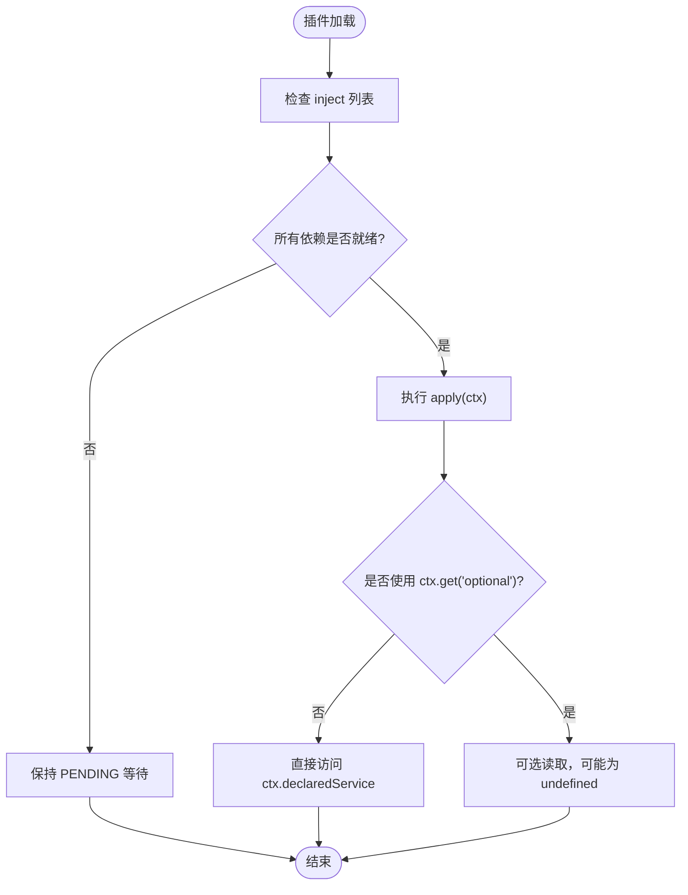
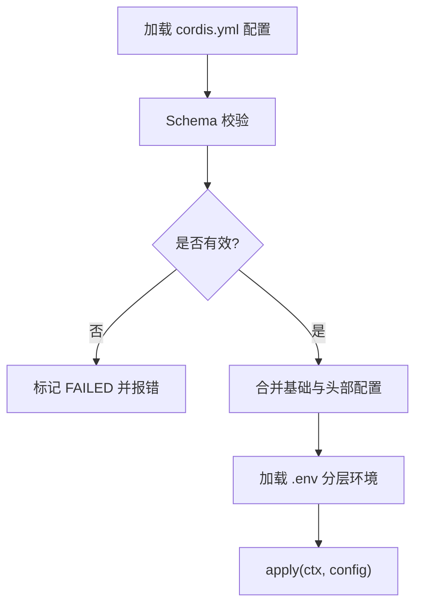
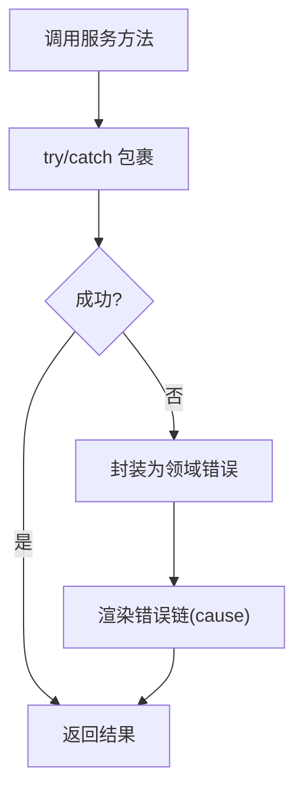
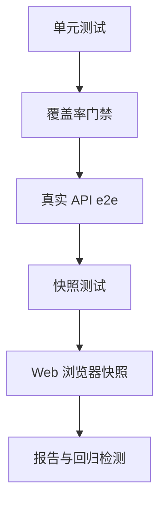
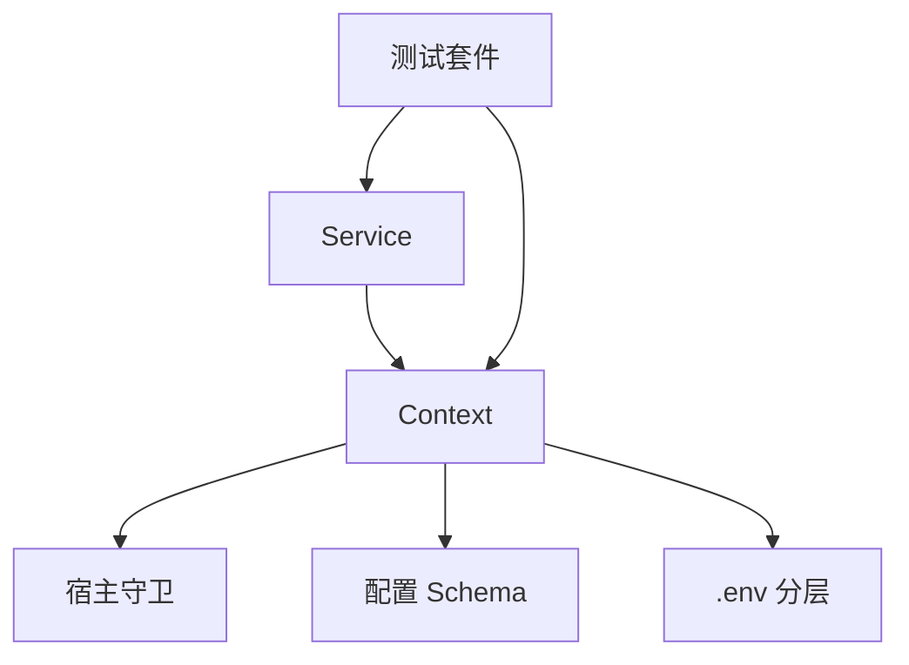

# Service 开发

<cite>
**本文引用的文件**
- [vendor/cordis/src/service.ts](file://vendor/cordis/src/service.ts)
- [docs/cordis-api/service.md](file://docs/cordis-api/service.md)
- [docs/cordis-tutorial/03-services.md](file://docs/cordis-tutorial/03-services.md)
- [docs/cordis-tutorial/05-config.md](file://docs/cordis-tutorial/05-config.md)
- [packages/extensions/cordis-host-runner/src/guard.ts](file://packages/extensions/cordis-host-runner/src/guard.ts)
- [packages/boot/app-boot/src/index.ts](file://packages/boot/app-boot/src/index.ts)
- [docs/testing.md](file://docs/testing.md)
- [packages/session-query/tool-session-query/src/service-boundary.ts](file://packages/session-query/tool-session-query/src/service-boundary.ts)
- [packages/code-runtime/code-runtime/src/index.ts](file://packages/code-runtime/code-runtime/src/index.ts)
- [packages/preset/agent-presets/tests/fixtures/plugins/global-service.js](file://packages/preset/agent-presets/tests/fixtures/plugins/global-service.js)
</cite>

## 目录
1. [简介](#简介)
2. [项目结构](#项目结构)
3. [核心组件](#核心组件)
4. [架构总览](#架构总览)
5. [详细组件分析](#详细组件分析)
6. [依赖关系分析](#依赖关系分析)
7. [性能考量](#性能考量)
8. [故障排查指南](#故障排查指南)
9. [结论](#结论)
10. [附录](#附录)

## 简介
本指南面向在 Harness/Cordis 中开发 Service 的工程师，系统讲解如何正确实现 Service、使用生命周期钩子与状态管理、声明与获取依赖、处理配置与环境变量、进行服务间通信、设计错误处理策略，并提供完整示例与测试方法。内容基于仓库中的 Cordis 运行时与服务基类、教程文档、宿主沙箱守卫、启动环境加载以及测试规范等源码与文档整理而成。

## 项目结构
围绕 Service 开发的关键位置：
- 服务基类与能力定义：vendor/cordis/src/service.ts
- 服务教程与用法：docs/cordis-tutorial/03-services.md、docs/cordis-tutorial/05-config.md
- 宿主侧安全与注入约束：packages/extensions/cordis-host-runner/src/guard.ts
- 环境变量加载：packages/boot/app-boot/src/index.ts
- 测试策略与最佳实践：docs/testing.md
- 服务边界与错误封装：packages/session-query/tool-session-query/src/service-boundary.ts
- 抽象服务接口示例：packages/code-runtime/code-runtime/src/index.ts
- 通过 effect 提供服务的示例：packages/preset/agent-presets/tests/fixtures/plugins/global-service.js

**章节来源**
- [vendor/cordis/src/service.ts:1-116](file://vendor/cordis/src/service.ts#L1-L116)
- [docs/cordis-tutorial/03-services.md:1-99](file://docs/cordis-tutorial/03-services.md#L1-L99)
- [docs/cordis-tutorial/05-config.md:1-85](file://docs/cordis-tutorial/05-config.md#L1-L85)
- [packages/extensions/cordis-host-runner/src/guard.ts:657-738](file://packages/extensions/cordis-host-runner/src/guard.ts#L657-L738)
- [packages/boot/app-boot/src/index.ts:71-90](file://packages/boot/app-boot/src/index.ts#L71-L90)
- [docs/testing.md:1-50](file://docs/testing.md#L1-L50)

## 核心组件
- Service 基类：提供构造函数注册、可调用实例（可选）、配置合并、追踪元数据等能力。子类在构造时调用 super(ctx, name)，即完成注册；随所属 fiber 卸载自动移除。
- 静态符号键：init、check、config、invoke、extend、tracker、resolveConfig，用于扩展点、可用性判断、拦截配置、可调用体、扩展实例、追踪与配置解析。
- 配置合并：支持祖先拦截配置叠加，优先顺序由靠近根的配置先应用，base 前置、head 后置；若服务声明了 Config.merge，则使用该合并器，否则浅合并。
- 可调用服务：若实现 invoke 符号键，服务实例会被包装为可调用对象，便于以函数形式访问（如 ctx.logger()）。

**章节来源**
- [vendor/cordis/src/service.ts:11-102](file://vendor/cordis/src/service.ts#L11-L102)
- [docs/cordis-api/service.md:1-103](file://docs/cordis-api/service.md#L1-L103)

## 架构总览
下图展示了服务从声明、注册到消费的生命周期与交互关系，包括依赖注入、宿主守卫、配置与环境的参与。

**图表来源**
- [vendor/cordis/src/service.ts:42-58](file://vendor/cordis/src/service.ts#L42-L58)
- [packages/extensions/cordis-host-runner/src/guard.ts:657-697](file://packages/extensions/cordis-host-runner/src/guard.ts#L657-L697)
- [docs/cordis-tutorial/03-services.md:44-79](file://docs/cordis-tutorial/03-services.md#L44-L79)
- [docs/cordis-tutorial/05-config.md:1-85](file://docs/cordis-tutorial/05-config.md#L1-L85)

## 详细组件分析

### Service 基类与生命周期
- 构造阶段：传入 ctx 与 name，内部创建追踪元数据，必要时将实例包装为可调用对象，并通过 ctx.reflect.provide 注册；当拥有 fiber 卸载时自动移除。
- 过滤与扩展：提供 filter 与 extend 保护点，便于按作用域过滤与派生实例。
- 配置解析：resolveConfig 会沿拦截链收集配置，结合 base/head 生成最终配置；若服务定义了 Config.merge，则采用自定义合并策略。

**图表来源**
- [vendor/cordis/src/service.ts:11-102](file://vendor/cordis/src/service.ts#L11-L102)

**章节来源**
- [vendor/cordis/src/service.ts:11-102](file://vendor/cordis/src/service.ts#L11-L102)

### 依赖注入与可选依赖
- 强依赖：通过 inject 声明所需服务名，Cordis 会在所有依赖就绪前挂起插件，确保 apply 内可直接访问。
- 弱依赖：未声明的服务可通过 ctx.get('name') 进行可选读取，避免硬耦合。
- 动态替换：当提供者被卸载或热替换，依赖方也会随之卸载并重新加载，保证引用一致性。

**图表来源**
- [docs/cordis-tutorial/03-services.md:44-79](file://docs/cordis-tutorial/03-services.md#L44-L79)

**章节来源**
- [docs/cordis-tutorial/03-services.md:44-79](file://docs/cordis-tutorial/03-services.md#L44-L79)

### 配置选项与环境变量
- 配置 Schema：每个 cordis.yml 条目可携带 config，插件导出同名 Config Schema，加载时校验失败会阻止插件启动。
- 计算值：支持 !!js 标签在 config 与 disabled 字段中进行加载期计算。
- 环境变量：应用启动时按层级加载 .env（项目层与用户层），缺失时回退到进程环境；不覆盖已存在的高优先级值。

**图表来源**
- [docs/cordis-tutorial/05-config.md:1-85](file://docs/cordis-tutorial/05-config.md#L1-L85)
- [packages/boot/app-boot/src/index.ts:71-90](file://packages/boot/app-boot/src/index.ts#L71-L90)

**章节来源**
- [docs/cordis-tutorial/05-config.md:1-85](file://docs/cordis-tutorial/05-config.md#L1-L85)
- [packages/boot/app-boot/src/index.ts:71-90](file://packages/boot/app-boot/src/index.ts#L71-L90)

### 服务间通信模式与最佳实践
- 通过 ctx 暴露具名 API：服务作为插件挂载后，其他插件通过 ctx.<name> 访问，实现松耦合。
- 事件机制：对于跨服务广播与解耦通信，可使用事件（见教程后续章节）。
- 工具调用：在服务中注册工具，供上层编排调用，形成“服务-工具”协作模式。
- 安全约束：宿主守卫禁止服务返回 Context，防止逃逸到沙箱代码；仅允许声明的注入项访问。

**图表来源**
- [packages/extensions/cordis-host-runner/src/guard.ts:657-697](file://packages/extensions/cordis-host-runner/src/guard.ts#L657-L697)
- [docs/cordis-tutorial/03-services.md:1-99](file://docs/cordis-tutorial/03-services.md#L1-L99)

**章节来源**
- [packages/extensions/cordis-host-runner/src/guard.ts:657-738](file://packages/extensions/cordis-host-runner/src/guard.ts#L657-L738)
- [docs/cordis-tutorial/03-services.md:1-99](file://docs/cordis-tutorial/03-services.md#L1-L99)

### 错误处理与异常管理策略
- 服务边界：对外暴露统一的服务边界，捕获业务异常并转换为模型安全的错误信息，保留错误链以便诊断。
- 宿主守卫：对注入服务的返回值进行守卫，拒绝返回 Context，避免沙箱逃逸。
- 配置失败：Schema 校验失败立即终止加载，避免半配置运行。
- 错误渲染：递归拼接 cause 链，输出可读的诊断信息。

**图表来源**
- [packages/session-query/tool-session-query/src/service-boundary.ts:143-179](file://packages/session-query/tool-session-query/src/service-boundary.ts#L143-L179)
- [packages/extensions/cordis-host-runner/src/guard.ts:657-697](file://packages/extensions/cordis-host-runner/src/guard.ts#L657-L697)
- [docs/cordis-tutorial/05-config.md:53-68](file://docs/cordis-tutorial/05-config.md#L53-L68)

**章节来源**
- [packages/session-query/tool-session-query/src/service-boundary.ts:143-179](file://packages/session-query/tool-session-query/src/service-boundary.ts#L143-L179)
- [packages/extensions/cordis-host-runner/src/guard.ts:657-697](file://packages/extensions/cordis-host-runner/src/guard.ts#L657-L697)
- [docs/cordis-tutorial/05-config.md:53-68](file://docs/cordis-tutorial/05-config.md#L53-L68)

### 完整 Service 开发示例（复杂业务逻辑）
以下示例展示一个抽象服务接口与具体实现的思路（以代码路径代替片段）：
- 抽象服务接口：定义 run 等方法，作为契约供不同实现遵循。
- 具体实现：继承 Service，在构造中注册名称，并在方法中实现复杂业务逻辑（如参数校验、资源准备、错误封装）。
- 配置与依赖：通过 Config Schema 声明配置项，使用 inject 声明外部依赖，按需读取环境变量。
- 通信：在服务中注册工具或发布事件，供其他服务消费。

参考路径：
- 抽象服务接口定义：[packages/code-runtime/code-runtime/src/index.ts:121-135](file://packages/code-runtime/code-runtime/src/index.ts#L121-L135)
- 通过 effect 提供服务的示例：[packages/preset/agent-presets/tests/fixtures/plugins/global-service.js:1-5](file://packages/preset/agent-presets/tests/fixtures/plugins/global-service.js#L1-L5)

**章节来源**
- [packages/code-runtime/code-runtime/src/index.ts:121-135](file://packages/code-runtime/code-runtime/src/index.ts#L121-L135)
- [packages/preset/agent-presets/tests/fixtures/plugins/global-service.js:1-5](file://packages/preset/agent-presets/tests/fixtures/plugins/global-service.js#L1-L5)

### 服务的测试方法与模拟策略
- 测试分层：单元测试、覆盖率门禁、真实 API e2e、快照测试、Web 浏览器快照。
- 优先真实实现：仅在昂贵或非确定性边界（LLM 适配器、网络、时钟）使用模拟；其余尽量走真实路径。
- 真实入口路径：通过 Loader 与 app/process 启动测试组合，断言可见行为、持久化状态或用户可见输出。
- 资源管理：测试内创建并释放 harness，避免共享 fixture 重复注册导致副作用。
- 快照对比：关键场景使用 JSONL 驱动回放，比较标准化输出。

**图表来源**
- [docs/testing.md:1-50](file://docs/testing.md#L1-L50)

**章节来源**
- [docs/testing.md:1-50](file://docs/testing.md#L1-L50)

## 依赖关系分析
- 服务与上下文：Service 通过 ctx.reflect.provide 注册到上下文，消费者通过 inject 声明依赖，Cordis 负责生命周期与可用性跟踪。
- 宿主守卫：对注入服务的方法调用与返回值进行守卫，禁止返回 Context，保障沙箱安全。
- 配置与环境：配置经 Schema 校验后注入 apply；环境变量按层级加载，不覆盖高优先级值。
- 测试与断言：测试套件覆盖服务契约、事件顺序、并发竞态与永久回归用例。

**图表来源**
- [vendor/cordis/src/service.ts:42-58](file://vendor/cordis/src/service.ts#L42-L58)
- [packages/extensions/cordis-host-runner/src/guard.ts:657-738](file://packages/extensions/cordis-host-runner/src/guard.ts#L657-L738)
- [docs/cordis-tutorial/05-config.md:1-85](file://docs/cordis-tutorial/05-config.md#L1-L85)
- [packages/boot/app-boot/src/index.ts:71-90](file://packages/boot/app-boot/src/index.ts#L71-L90)
- [docs/testing.md:1-50](file://docs/testing.md#L1-L50)

**章节来源**
- [vendor/cordis/src/service.ts:42-58](file://vendor/cordis/src/service.ts#L42-L58)
- [packages/extensions/cordis-host-runner/src/guard.ts:657-738](file://packages/extensions/cordis-host-runner/src/guard.ts#L657-L738)
- [docs/cordis-tutorial/05-config.md:1-85](file://docs/cordis-tutorial/05-config.md#L1-L85)
- [packages/boot/app-boot/src/index.ts:71-90](file://packages/boot/app-boot/src/index.ts#L71-L90)
- [docs/testing.md:1-50](file://docs/testing.md#L1-L50)

## 性能考量
- 延迟加载与挂起：依赖未就绪时插件保持 PENDING，不阻塞事件循环，减少无效开销。
- 配置合并成本：合理拆分 Config.merge，避免深层深拷贝；优先使用浅合并与必要时的定制合并。
- 事件与工具：控制事件粒度与频率，避免高频广播造成背压；工具调用应幂等且可重试。
- 测试效率：优先真实实现但限定范围，使用快照与最小化 e2e 提升反馈速度。

## 故障排查指南
- 配置错误：查看 Schema 校验错误定位具体字段；修正 cordis.yml 配置或默认值。
- 依赖缺失：确认 inject 声明与服务提供者是否加载；观察 PENDING 状态与卸载重载行为。
- 安全拒绝：若出现“服务返回 Context”的错误，检查服务方法返回值，确保只返回数据而非上下文。
- 环境变量问题：检查 .env 层级与进程环境覆盖规则，确认敏感值来源与优先级。
- 测试失败：区分单元、e2e、快照失败原因；必要时刷新快照并审查差异。

**章节来源**
- [docs/cordis-tutorial/05-config.md:53-68](file://docs/cordis-tutorial/05-config.md#L53-L68)
- [docs/cordis-tutorial/03-services.md:74-79](file://docs/cordis-tutorial/03-services.md#L74-L79)
- [packages/extensions/cordis-host-runner/src/guard.ts:657-697](file://packages/extensions/cordis-host-runner/src/guard.ts#L657-L697)
- [packages/boot/app-boot/src/index.ts:71-90](file://packages/boot/app-boot/src/index.ts#L71-L90)
- [docs/testing.md:1-50](file://docs/testing.md#L1-L50)

## 结论
在本仓库中，Service 是插件化的能力单元，通过 Service 基类与 Cordis 上下文完成注册、依赖管理与生命周期控制。配合 Schema 配置、分层环境变量、宿主守卫与事件/工具通信，可实现健壮、可维护的服务体系。测试策略强调真实入口路径与快照对比，确保契约稳定与行为可观测。遵循上述指南，可高效构建复杂业务逻辑的服务，并在生产环境中获得良好的可观测性与稳定性。

## 附录
- 快速参考
  - 服务基类与静态符号键：[vendor/cordis/src/service.ts:11-102](file://vendor/cordis/src/service.ts#L11-L102)
  - 服务教程（注入、可选依赖、命名）：[docs/cordis-tutorial/03-services.md:1-99](file://docs/cordis-tutorial/03-services.md#L1-L99)
  - 配置与 Schema：[docs/cordis-tutorial/05-config.md:1-85](file://docs/cordis-tutorial/05-config.md#L1-L85)
  - 环境变量加载：[packages/boot/app-boot/src/index.ts:71-90](file://packages/boot/app-boot/src/index.ts#L71-L90)
  - 宿主守卫与安全：[packages/extensions/cordis-host-runner/src/guard.ts:657-738](file://packages/extensions/cordis-host-runner/src/guard.ts#L657-L738)
  - 测试策略：[docs/testing.md:1-50](file://docs/testing.md#L1-L50)
  - 服务边界与错误封装：[packages/session-query/tool-session-query/src/service-boundary.ts:143-179](file://packages/session-query/tool-session-query/src/service-boundary.ts#L143-L179)
  - 抽象服务接口示例：[packages/code-runtime/code-runtime/src/index.ts:121-135](file://packages/code-runtime/code-runtime/src/index.ts#L121-L135)
  - 通过 effect 提供服务：[packages/preset/agent-presets/tests/fixtures/plugins/global-service.js:1-5](file://packages/preset/agent-presets/tests/fixtures/plugins/global-service.js#L1-L5)