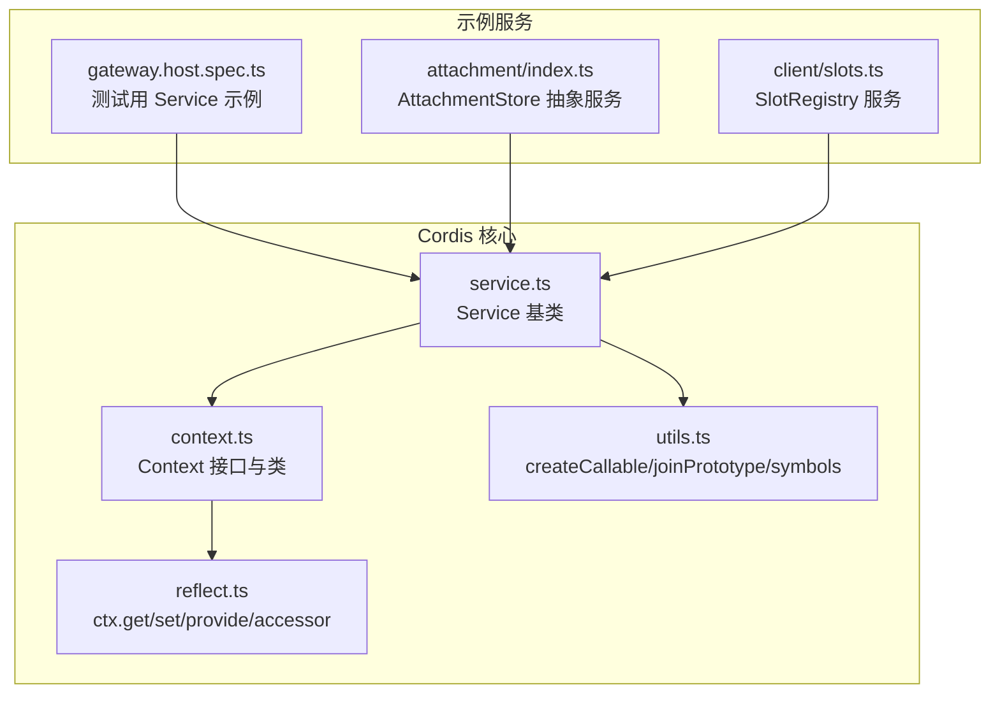
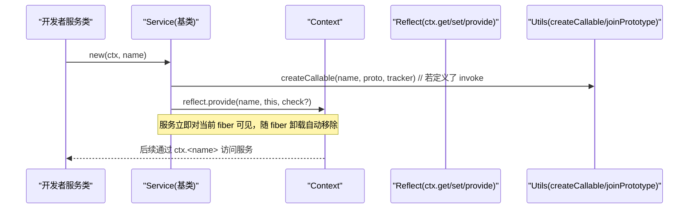
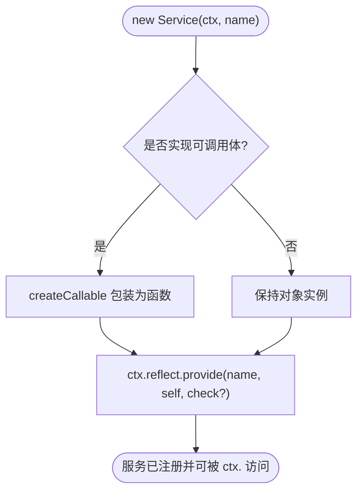
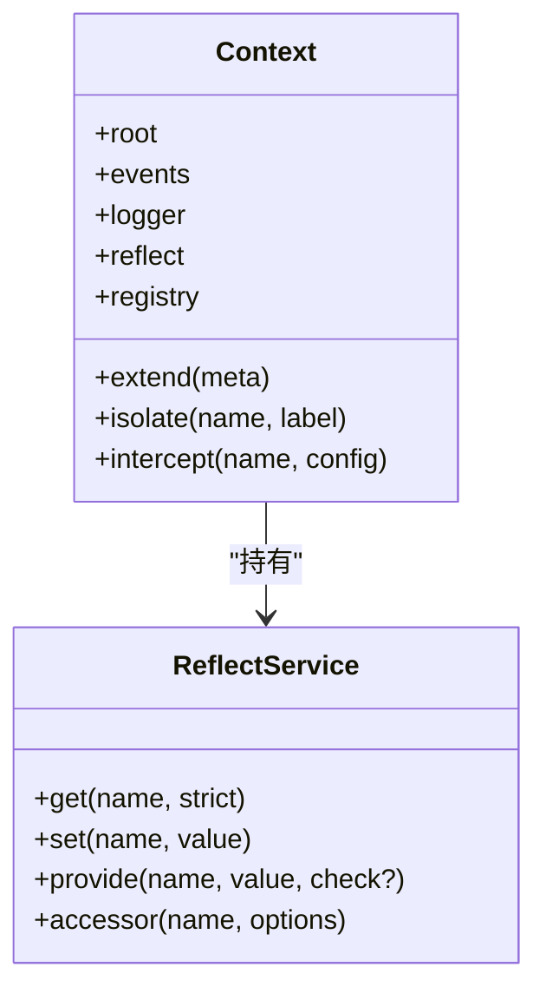
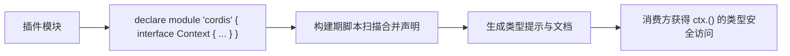
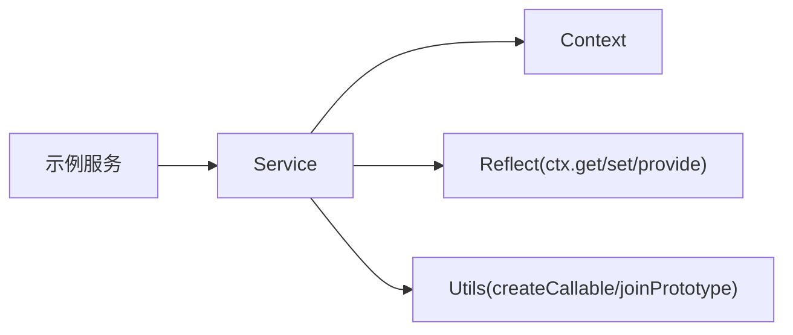

# Service 接口实现

<cite>
**本文引用的文件**
- [vendor/cordis/src/service.ts](file://vendor/cordis/src/service.ts)
- [vendor/cordis/src/context.ts](file://vendor/cordis/src/context.ts)
- [vendor/cordis/src/reflect.ts](file://vendor/cordis/src/reflect.ts)
- [vendor/cordis/src/utils.ts](file://vendor/cordis/src/utils.ts)
- [packages/api/gateway/tests/gateway.host.spec.ts](file://packages/api/gateway/tests/gateway.host.spec.ts)
- [packages/attachment/attachment/src/index.ts](file://packages/attachment/attachment/src/index.ts)
- [packages/client/runtime/src/client/slots.ts](file://packages/client/runtime/src/client/slots.ts)
- [scripts/cordis-core-api.ts](file://scripts/cordis-core-api.ts)
</cite>

## 目录
1. [简介](#简介)
2. [项目结构](#项目结构)
3. [核心组件](#核心组件)
4. [架构总览](#架构总览)
5. [详细组件分析](#详细组件分析)
6. [依赖关系分析](#依赖关系分析)
7. [性能考量](#性能考量)
8. [故障排查指南](#故障排查指南)
9. [结论](#结论)
10. [附录](#附录)

## 简介
本文面向需要在 DeepSeek Harness（基于 Cordis 插件框架）中实现自定义服务的开发者，系统讲解如何继承 Service 基类、在构造函数中完成上下文传递与服务名称注册、通过 TypeScript 声明合并为 Context 扩展类型以获得类型安全的服务访问、以及命名规范与错误处理的最佳实践。文中所有说明均对应仓库中的实际源码位置，便于读者对照查阅。

## 项目结构
围绕 Service 的核心代码位于 vendor/cordis 包内：Service 基类定义、Context 代理与反射层、工具函数等；业务侧的示例服务分布在 packages/* 中，用于展示不同场景下的继承与使用方式。

图表来源
- [vendor/cordis/src/service.ts:11-58](file://vendor/cordis/src/service.ts#L11-L58)
- [vendor/cordis/src/context.ts:16-84](file://vendor/cordis/src/context.ts#L16-L84)
- [vendor/cordis/src/reflect.ts:237-331](file://vendor/cordis/src/reflect.ts#L237-L331)
- [vendor/cordis/src/utils.ts:1-20](file://vendor/cordis/src/utils.ts#L1-L20)
- [packages/api/gateway/tests/gateway.host.spec.ts:184-207](file://packages/api/gateway/tests/gateway.host.spec.ts#L184-L207)
- [packages/attachment/attachment/src/index.ts:29-40](file://packages/attachment/attachment/src/index.ts#L29-L40)
- [packages/client/runtime/src/client/slots.ts:93-110](file://packages/client/runtime/src/client/slots.ts#L93-L110)

章节来源
- [vendor/cordis/src/service.ts:11-58](file://vendor/cordis/src/service.ts#L11-L58)
- [vendor/cordis/src/context.ts:16-84](file://vendor/cordis/src/context.ts#L16-L84)

## 核心组件
- Service 基类：提供统一的构造流程、名称注册、可调用封装、拦截配置合并、实例检测等能力。
- Context：上下文对象，作为服务容器与事件总线入口，支持 extend/isolate/intercept 创建子作用域。
- Reflect 层：提供 ctx.get/set/provide/accessor 等低层服务存取 API。
- 工具函数：createCallable、joinPrototype、symbols 等支撑 Service 的可调用与追踪能力。

章节来源
- [vendor/cordis/src/service.ts:11-116](file://vendor/cordis/src/service.ts#L11-L116)
- [vendor/cordis/src/context.ts:16-147](file://vendor/cordis/src/context.ts#L16-L147)
- [vendor/cordis/src/reflect.ts:237-331](file://vendor/cordis/src/reflect.ts#L237-L331)
- [vendor/cordis/src/utils.ts:1-20](file://vendor/cordis/src/utils.ts#L1-L20)

## 架构总览
下图展示了“继承 Service -> 构造函数注册 -> 通过 ctx 暴露 API”的整体流程，以及 Context 的作用域隔离与拦截配置机制。

图表来源
- [vendor/cordis/src/service.ts:42-58](file://vendor/cordis/src/service.ts#L42-L58)
- [vendor/cordis/src/context.ts:70-84](file://vendor/cordis/src/context.ts#L70-L84)
- [vendor/cordis/src/reflect.ts:286-314](file://vendor/cordis/src/reflect.ts#L286-L314)
- [vendor/cordis/src/utils.ts:1-20](file://vendor/cordis/src/utils.ts#L1-L20)

## 详细组件分析

### Service 基类与生命周期
- 构造函数职责
  - 接收 Context 与 name，并记录到实例属性。
  - 若服务实现了可调用体（通过静态符号标识），则包装为可调用的函数，保留原型链以便方法解析。
  - 通过 ctx.reflect.provide 将自身注册到当前 fiber 的作用域，并附带可用性谓词（可选）。
  - 注册后，服务随所属 fiber 自动销毁。
- 拦截配置合并
  - 提供 resolveConfig 方法，从祖先上下文收集拦截配置并按优先级合并，支持自定义 Config.merge。
- 实例检测
  - 重写 Symbol.hasInstance，支持跨 realm 的多份 cordis 拷贝进行 instanceof 判断。

图表来源
- [vendor/cordis/src/service.ts:42-58](file://vendor/cordis/src/service.ts#L42-L58)
- [vendor/cordis/src/service.ts:86-102](file://vendor/cordis/src/service.ts#L86-L102)
- [vendor/cordis/src/service.ts:104-114](file://vendor/cordis/src/service.ts#L104-L114)

章节来源
- [vendor/cordis/src/service.ts:11-116](file://vendor/cordis/src/service.ts#L11-L116)

### Context 与作用域隔离
- Context 是一个代理对象，普通属性读取走服务解析器；extend/isolate/intercept 会创建子上下文而不修改父上下文。
- isolate 可为指定服务名建立独立作用域，使同名服务在不同作用域下可分别提供。
- intercept 为特定服务注入拦截配置，供服务在启动时合并使用。
- provide/get/set/accessor 构成服务存储与访问的基础设施。

图表来源
- [vendor/cordis/src/context.ts:16-147](file://vendor/cordis/src/context.ts#L16-L147)
- [vendor/cordis/src/reflect.ts:237-331](file://vendor/cordis/src/reflect.ts#L237-L331)

章节来源
- [vendor/cordis/src/context.ts:16-147](file://vendor/cordis/src/context.ts#L16-L147)
- [vendor/cordis/src/reflect.ts:237-331](file://vendor/cordis/src/reflect.ts#L237-L331)

### TypeScript 类型声明合并与类型安全的 ctx 访问
- 原理
  - Cordis 的 Context 接口会在运行时被 core services 与插件通过模块级声明合并进行增强，从而让 ctx 上出现具名属性（如 ctx.tools、ctx.llm 等）。
  - 脚本在构建时会扫描各模块中对 Context 接口的合并声明，生成文档与类型提示。
- 最佳实践
  - 在服务所在模块中，以 declare module 形式对 Context 接口进行合并，声明你的服务键名与方法签名，即可获得类型安全的 ctx.<yourService>() 访问。
  - 避免重复或冲突的键名；如需多实现共存，结合 isolate 的作用域隔离。

图表来源
- [scripts/cordis-core-api.ts:239-258](file://scripts/cordis-core-api.ts#L239-L258)

章节来源
- [scripts/cordis-core-api.ts:239-258](file://scripts/cordis-core-api.ts#L239-L258)

### 完整 Service 实现示例与要点
以下示例来自仓库中的真实实现，涵盖基础注册、命名空间绑定、参数校验与返回值处理等常见模式。请根据路径查看具体代码片段。

- 基础注册与命名
  - 示例：在测试中定义的共享服务，构造函数调用 super(ctx, 'secondShared') 完成注册。
  - 参考路径：[packages/api/gateway/tests/gateway.host.spec.ts:184-207](file://packages/api/gateway/tests/gateway.host.spec.ts#L184-L207)

- 抽象服务模板
  - 示例：AttachmentStore 抽象服务，统一了附件存储的契约，子类只需实现具体逻辑。
  - 参考路径：[packages/attachment/attachment/src/index.ts:29-40](file://packages/attachment/attachment/src/index.ts#L29-L40)

- 注册表型服务
  - 示例：SlotRegistry 维护槽位集合，提供添加/查询/清理等方法，体现服务聚合能力。
  - 参考路径：[packages/client/runtime/src/client/slots.ts:93-110](file://packages/client/runtime/src/client/slots.ts#L93-L110)

- 方法定义、参数验证与返回值处理
  - 建议在方法入口处进行参数校验（类型、范围、必填项），失败时抛出明确异常；返回稳定数据结构，必要时做不可变化处理。
  - 对于异步方法，确保错误传播与取消信号（如适用）的正确处理。

- 可调用服务（可选）
  - 若希望服务本身可作为函数调用（例如 ctx.logger()），可通过在 Service 子类中实现可调用体（由框架识别并包装），使实例既可作为对象也可作为函数使用。

章节来源
- [packages/api/gateway/tests/gateway.host.spec.ts:184-207](file://packages/api/gateway/tests/gateway.host.spec.ts#L184-L207)
- [packages/attachment/attachment/src/index.ts:29-40](file://packages/attachment/attachment/src/index.ts#L29-L40)
- [packages/client/runtime/src/client/slots.ts:93-110](file://packages/client/runtime/src/client/slots.ts#L93-L110)

### 命名规范与命名空间管理
- 命名规范
  - 服务名应短小、语义清晰、全局唯一；避免使用保留字或易混淆的名称。
  - 建议采用“领域_功能”或“模块_服务”的形式，如 secondShared、defaultParameter。
- 命名空间管理
  - 当需要多实现并存时，优先使用 ctx.isolate(name, label) 划分作用域，再分别 provide。
  - 对于远程服务或网关服务，可使用命名空间前缀区分不同端点（见测试中的 namespace 用法）。

章节来源
- [packages/api/gateway/tests/gateway.host.spec.ts:184-207](file://packages/api/gateway/tests/gateway.host.spec.ts#L184-L207)
- [vendor/cordis/src/context.ts:121-125](file://vendor/cordis/src/context.ts#L121-L125)

### 错误处理与异常抛出标准模式
- 参数校验失败：抛出包含错误码与字段信息的结构化异常，便于上层捕获与定位。
- 资源不可用：当依赖服务未提供或作用域不匹配时，返回 undefined 或抛出明确的“缺失依赖”异常，并在日志中记录上下文信息。
- 异步错误：确保 Promise 拒绝路径正确传播，必要时提供取消信号或超时控制。
- 可观测性：在关键路径记录必要日志，避免泄露敏感信息。

章节来源
- [vendor/cordis/src/reflect.ts:286-314](file://vendor/cordis/src/reflect.ts#L286-L314)
- [packages/api/gateway/tests/gateway.host.spec.ts:265-284](file://packages/api/gateway/tests/gateway.host.spec.ts#L265-L284)

## 依赖关系分析
Service 的实现强依赖于 Context 与 Reflect 层，并通过工具函数完成可调用包装与原型链拼接。示例服务通过继承 Service 复用这些能力。

图表来源
- [vendor/cordis/src/service.ts:11-58](file://vendor/cordis/src/service.ts#L11-L58)
- [vendor/cordis/src/context.ts:16-84](file://vendor/cordis/src/context.ts#L16-L84)
- [vendor/cordis/src/reflect.ts:237-331](file://vendor/cordis/src/reflect.ts#L237-L331)
- [vendor/cordis/src/utils.ts:1-20](file://vendor/cordis/src/utils.ts#L1-L20)

章节来源
- [vendor/cordis/src/service.ts:11-58](file://vendor/cordis/src/service.ts#L11-L58)
- [vendor/cordis/src/context.ts:16-84](file://vendor/cordis/src/context.ts#L16-L84)
- [vendor/cordis/src/reflect.ts:237-331](file://vendor/cordis/src/reflect.ts#L237-L331)
- [vendor/cordis/src/utils.ts:1-20](file://vendor/cordis/src/utils.ts#L1-L20)

## 性能考量
- 服务注册开销：Service 构造函数仅执行一次注册，成本较低；避免在构造函数中进行重型初始化。
- 作用域隔离：isolate 会创建新的隔离映射，频繁创建大量隔离作用域可能带来内存与查找开销，应合理复用 label。
- 拦截配置合并：resolveConfig 每次调用都会遍历祖先拦截链，建议缓存结果或在服务内部按需合并。
- 可调用包装：createCallable 会带来额外包装，仅在确实需要函数式调用时使用。

## 故障排查指南
- 服务未找到
  - 检查是否在正确的 fiber 作用域内 provide；确认名称一致且未被覆盖。
  - 使用 ctx.get(name, strict=false) 调试是否存在其他作用域的实现。
- 重复提供
  - 同一作用域内重复 provide 同名服务会抛错；先 ensure 唯一性或改用 isolate 隔离。
- 类型提示缺失
  - 确认已在模块中通过 declare module 对 Context 接口进行合并；运行构建脚本重新生成类型与文档。
- 可调用服务行为异常
  - 检查是否正确实现可调用体；确认原型链拼接与 this 绑定符合预期。

章节来源
- [vendor/cordis/src/reflect.ts:237-331](file://vendor/cordis/src/reflect.ts#L237-L331)
- [scripts/cordis-core-api.ts:239-258](file://scripts/cordis-core-api.ts#L239-L258)

## 结论
通过继承 Service 基类，开发者可以以最小代价在 Cordis 上下文中注册具名服务，并利用 Context 的作用域隔离与拦截机制实现灵活的服务组合。借助 TypeScript 声明合并，可获得类型安全的 ctx 访问体验。遵循命名规范与错误处理模式，有助于构建可维护、可观测、可扩展的服务体系。

## 附录
- 快速上手清单
  - 继承 Service，构造函数调用 super(ctx, name)。
  - 在模块中 declare module 合并 Context 接口，声明服务键与方法签名。
  - 在方法入口进行参数校验，返回稳定数据结构。
  - 需要多实现时，使用 ctx.isolate(name, label) 隔离作用域。
  - 需要函数式调用时，实现可调用体并由框架包装。
- 参考路径
  - Service 基类：[vendor/cordis/src/service.ts:11-116](file://vendor/cordis/src/service.ts#L11-L116)
  - Context 与作用域：[vendor/cordis/src/context.ts:16-147](file://vendor/cordis/src/context.ts#L16-L147)
  - 服务存取 API：[vendor/cordis/src/reflect.ts:237-331](file://vendor/cordis/src/reflect.ts#L237-L331)
  - 示例服务：[packages/api/gateway/tests/gateway.host.spec.ts:184-207](file://packages/api/gateway/tests/gateway.host.spec.ts#L184-L207)
  - 抽象服务模板：[packages/attachment/attachment/src/index.ts:29-40](file://packages/attachment/attachment/src/index.ts#L29-L40)
  - 注册表服务：[packages/client/runtime/src/client/slots.ts:93-110](file://packages/client/runtime/src/client/slots.ts#L93-L110)
  - 类型合并脚本：[scripts/cordis-core-api.ts:239-258](file://scripts/cordis-core-api.ts#L239-L258)