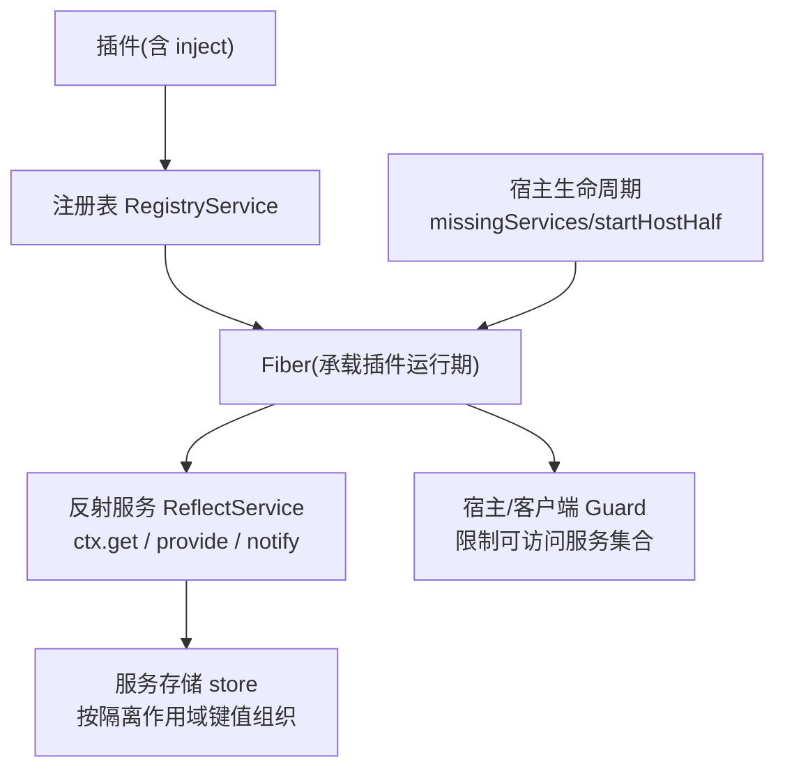
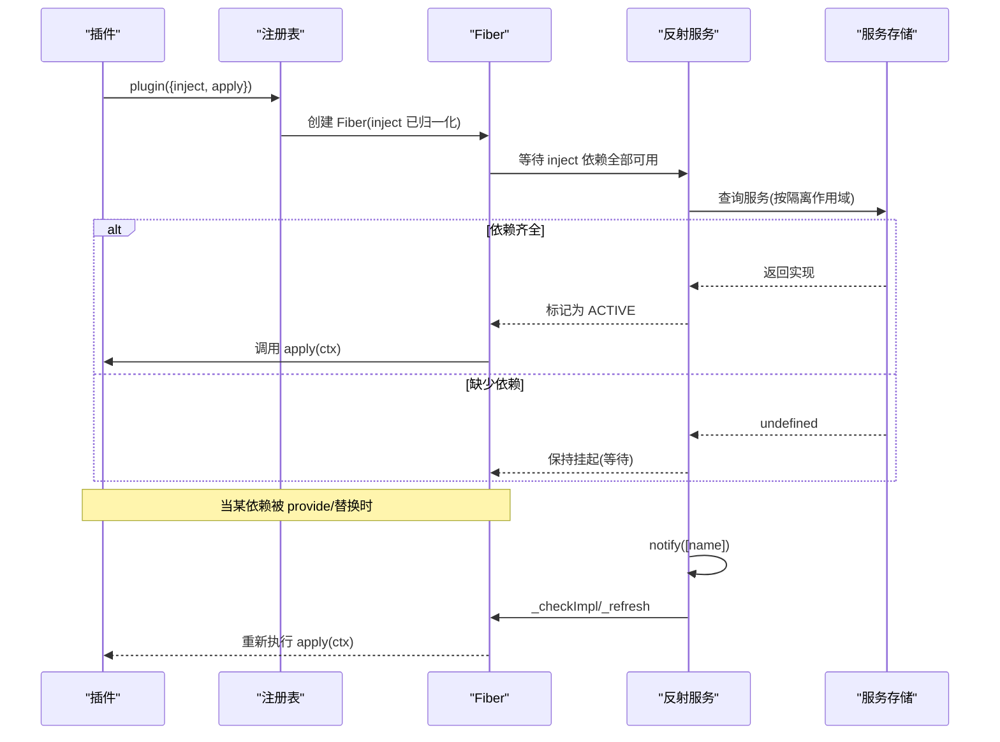
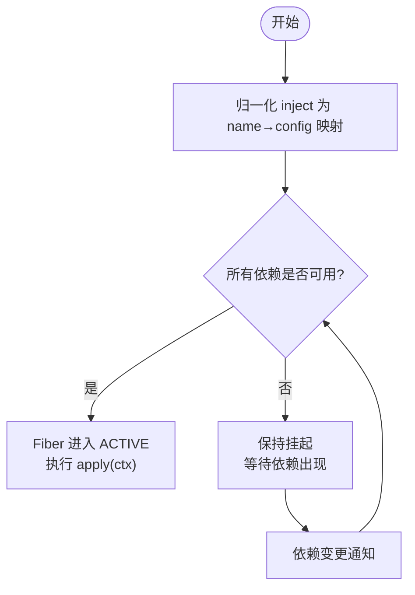
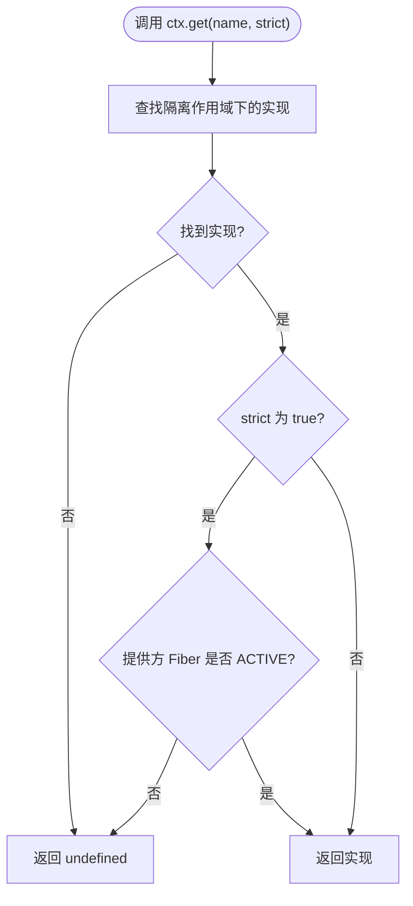
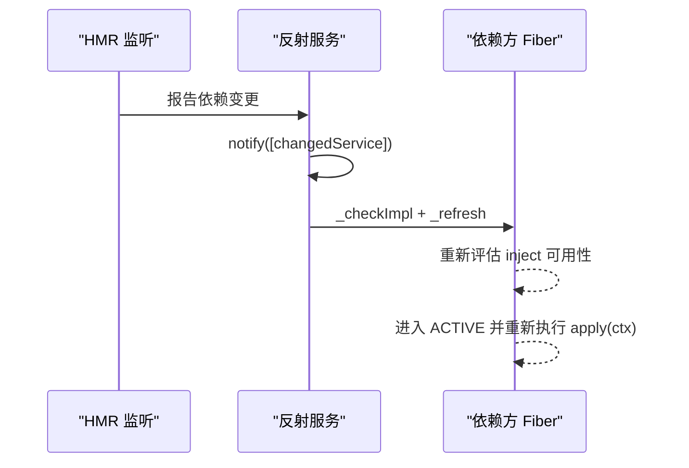
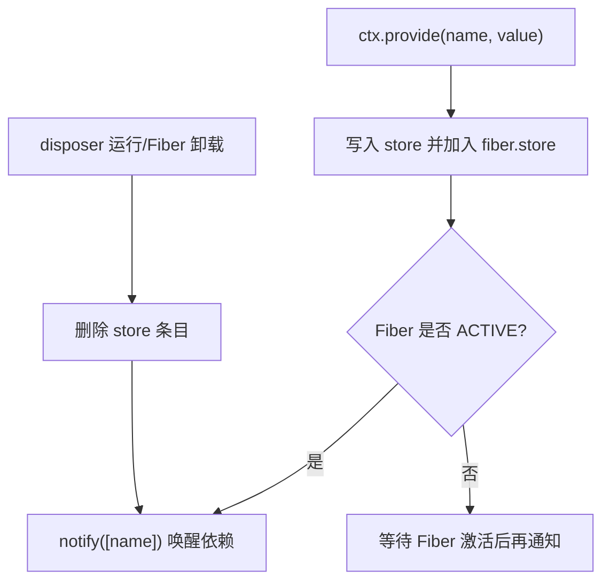
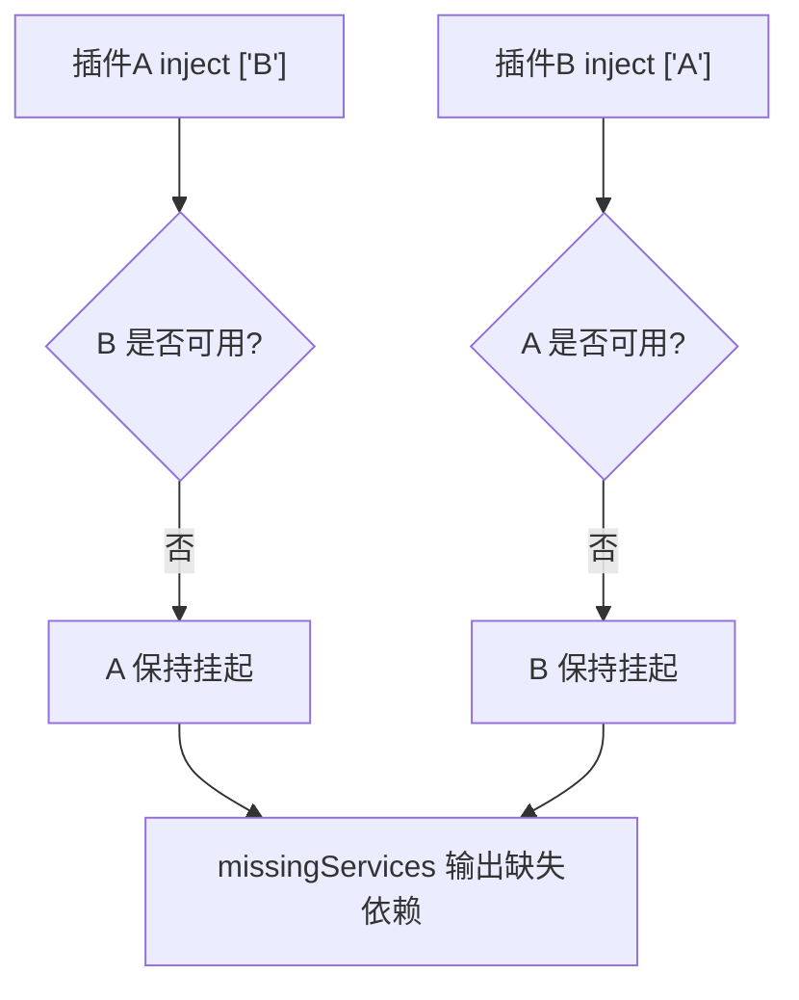
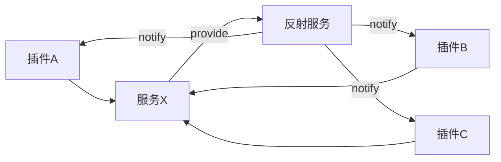

# 依赖注入

<cite>
**本文引用的文件**
- [vendor/cordis/src/registry.ts](file://vendor/cordis/src/registry.ts)
- [vendor/cordis/src/reflect.ts](file://vendor/cordis/src/reflect.ts)
- [packages/extensions/cordis-host-runner/src/lifecycle.ts](file://packages/extensions/cordis-host-runner/src/lifecycle.ts)
- [packages/extensions/cordis-host-runner/src/guard.ts](file://packages/extensions/cordis-host-runner/src/guard.ts)
- [packages/extensions/cordis-client-runner/src/client/guard.ts](file://packages/extensions/cordis-client-runner/src/client/guard.ts)
- [docs/cordis-api/context.md](file://docs/cordis-api/context.md)
- [docs/cordis-api/registry.md](file://docs/cordis-api/registry.md)
- [packages/test-support/client-runtime/src/index.ts](file://packages/test-support/client-runtime/src/index.ts)
- [packages/client/runtime/src/client/sessions/conversation-assembler.ts](file://packages/client/runtime/src/client/sessions/conversation-assembler.ts)
</cite>

## 目录
1. [简介](#简介)
2. [项目结构](#项目结构)
3. [核心组件](#核心组件)
4. [架构总览](#架构总览)
5. [详细组件分析](#详细组件分析)
6. [依赖关系分析](#依赖关系分析)
7. [性能考量](#性能考量)
8. [故障排查指南](#故障排查指南)
9. [结论](#结论)
10. [附录](#附录)

## 简介
本文件聚焦于 Cordis 框架中的依赖注入机制，围绕以下目标展开：
- inject 数组与对象声明方式、加载顺序与激活时机
- ctx.get() 的可选依赖获取、undefined 检查与降级策略
- 依赖追踪、热重载（HMR）与依赖卸载/替换时的行为
- 服务间解耦的设计模式与最佳实践
- 循环依赖的检测与避免方法
- 测试模拟策略与单元测试技巧

## 项目结构
依赖注入由“插件注册表”和“反射服务”共同实现：
- 插件注册表负责解析插件形状、收集 inject 声明、创建 Fiber 并驱动生命周期
- 反射服务提供 ctx.get/set/provide/accessor/mixin 等能力，维护服务存储与作用域隔离
- 宿主侧与客户端侧 Guard 对动态插件上下文进行安全限制，确保仅能访问已声明的服务
- 宿主生命周期工具用于检测缺失依赖、处理启动失败与替换流程

图表来源
- [vendor/cordis/src/registry.ts:195-336](file://vendor/cordis/src/registry.ts#L195-L336)
- [vendor/cordis/src/reflect.ts:133-336](file://vendor/cordis/src/reflect.ts#L133-L336)
- [packages/extensions/cordis-host-runner/src/lifecycle.ts:22-57](file://packages/extensions/cordis-host-runner/src/lifecycle.ts#L22-L57)
- [packages/extensions/cordis-host-runner/src/guard.ts:680-711](file://packages/extensions/cordis-host-runner/src/guard.ts#L680-L711)
- [packages/extensions/cordis-client-runner/src/client/guard.ts:180-204](file://packages/extensions/cordis-client-runner/src/client/guard.ts#L180-L204)

章节来源
- [vendor/cordis/src/registry.ts:195-336](file://vendor/cordis/src/registry.ts#L195-L336)
- [vendor/cordis/src/reflect.ts:133-336](file://vendor/cordis/src/reflect.ts#L133-L336)
- [packages/extensions/cordis-host-runner/src/lifecycle.ts:22-57](file://packages/extensions/cordis-host-runner/src/lifecycle.ts#L22-L57)
- [packages/extensions/cordis-host-runner/src/guard.ts:680-711](file://packages/extensions/cordis-host-runner/src/guard.ts#L680-L711)
- [packages/extensions/cordis-client-runner/src/client/guard.ts:180-204](file://packages/extensions/cordis-client-runner/src/client/guard.ts#L180-L204)

## 核心组件
- 插件与依赖声明
  - inject 支持数组与对象两种形式；对象形式可为每个服务附加拦截配置
  - 通过 @Inject 装饰器在类或方法上声明依赖，方法级延迟执行直到依赖就绪
- 插件注册表
  - 统一解析插件形状，收集 inject，创建 Fiber，管理运行时记录
  - 暴露 ctx.inject 快捷入口，等价于 ctx.plugin({ inject, apply })
- 反射服务
  - 提供 ctx.get(name, strict?) 无侵入读取服务；strict=true 时仅返回提供方 Fiber 处于 ACTIVE 的实现
  - 提供 ctx.provide(name, value) 注册当前 Fiber 拥有的服务，并在卸载时自动注销并唤醒依赖者
  - 提供 ctx.set(name, value) 覆盖已提供的服务值（仅限提供方 Fiber）
  - 提供 ctx.accessor/mixin 扩展上下文属性与便捷方法
- 宿主与客户端 Guard
  - 限制动态插件上下文只能访问其 inject 中声明的服务，未声明则拒绝访问并给出明确提示
  - 对注入服务的返回值进行代理守卫，防止泄露内部上下文
- 宿主生命周期
  - startHostHalf 包装插件启动，捕获启动错误并指导替换流程
  - missingServices 计算尚未满足的 inject 依赖列表，用于诊断与等待

章节来源
- [vendor/cordis/src/registry.ts:12-89](file://vendor/cordis/src/registry.ts#L12-L89)
- [vendor/cordis/src/registry.ts:164-186](file://vendor/cordis/src/registry.ts#L164-L186)
- [vendor/cordis/src/registry.ts:293-336](file://vendor/cordis/src/registry.ts#L293-L336)
- [vendor/cordis/src/reflect.ts:7-71](file://vendor/cordis/src/reflect.ts#L7-L71)
- [vendor/cordis/src/reflect.ts:225-336](file://vendor/cordis/src/reflect.ts#L225-L336)
- [packages/extensions/cordis-host-runner/src/lifecycle.ts:22-57](file://packages/extensions/cordis-host-runner/src/lifecycle.ts#L22-L57)
- [packages/extensions/cordis-host-runner/src/guard.ts:680-711](file://packages/extensions/cordis-host-runner/src/guard.ts#L680-L711)
- [packages/extensions/cordis-client-runner/src/client/guard.ts:180-204](file://packages/extensions/cordis-client-runner/src/client/guard.ts#L180-L204)

## 架构总览
下图展示了从插件声明到服务解析、通知与重装的完整链路。

图表来源
- [vendor/cordis/src/registry.ts:316-336](file://vendor/cordis/src/registry.ts#L316-L336)
- [vendor/cordis/src/reflect.ts:277-336](file://vendor/cordis/src/reflect.ts#L277-L336)

## 详细组件分析

### inject 声明与加载顺序
- 数组形式：请求不带拦截配置的服务，顺序即声明顺序
- 对象形式：将每个服务名映射到可选拦截配置，便于在不同上下文中注入不同行为
- 归一化：注册表会将数组/对象/继承链上的 inject 合并为 name→config 的普通映射
- 激活时机：只有当所有 inject 依赖在当前隔离作用域内均可用时，Fiber 才会进入 ACTIVE 并执行 apply

图表来源
- [vendor/cordis/src/registry.ts:62-89](file://vendor/cordis/src/registry.ts#L62-L89)
- [vendor/cordis/src/registry.ts:316-336](file://vendor/cordis/src/registry.ts#L316-L336)
- [vendor/cordis/src/reflect.ts:314-336](file://vendor/cordis/src/reflect.ts#L314-L336)

章节来源
- [vendor/cordis/src/registry.ts:62-89](file://vendor/cordis/src/registry.ts#L62-L89)
- [vendor/cordis/src/registry.ts:316-336](file://vendor/cordis/src/registry.ts#L316-L336)
- [docs/cordis-api/registry.md:121-153](file://docs/cordis-api/registry.md#L121-L153)

### ctx.get() 可选依赖与降级策略
- ctx.get(name, strict?) 可在不声明 inject 的情况下读取服务
- strict=true（默认）：仅返回提供方 Fiber 处于 ACTIVE 的实现，否则返回 undefined
- 典型用法：先 ctx.get('optional') 判断是否为 undefined，再决定使用真实实现或降级逻辑
- 与直接属性访问的区别：直接 ctx.serviceName 访问受 inject 约束，未声明会抛错；ctx.get 更灵活，适合可选依赖

图表来源
- [vendor/cordis/src/reflect.ts:225-243](file://vendor/cordis/src/reflect.ts#L225-L243)
- [docs/cordis-api/context.md:235-259](file://docs/cordis-api/context.md#L235-L259)

章节来源
- [vendor/cordis/src/reflect.ts:225-243](file://vendor/cordis/src/reflect.ts#L225-L243)
- [docs/cordis-api/context.md:235-259](file://docs/cordis-api/context.md#L235-L259)

### 依赖追踪与热重载（HMR）
- 依赖追踪：ReflectService.notify 遍历所有 Fiber，若其 inject 包含变更的服务名，则触发 _checkImpl 与 _refresh，使依赖变化后自动重新激活
- 热重载：宿主侧通过 HMR 服务监听模块变更，结合上述通知机制，实现依赖替换后的自动重装
- 客户端侧 HMR：节点端监听图变化并通过 clientModuleHost.rebuilt 上报，触发对应包的重建与依赖刷新

图表来源
- [vendor/cordis/src/reflect.ts:314-336](file://vendor/cordis/src/reflect.ts#L314-L336)
- [packages/client/hmr/tests/node-half.client.spec.ts:73-101](file://packages/client/hmr/tests/node-half.client.spec.ts#L73-L101)

章节来源
- [vendor/cordis/src/reflect.ts:314-336](file://vendor/cordis/src/reflect.ts#L314-L336)
- [packages/client/hmr/tests/node-half.client.spec.ts:73-101](file://packages/client/hmr/tests/node-half.client.spec.ts#L73-L101)

### 依赖卸载与替换行为
- 卸载：provide 返回的 disposer 会在 Fiber 卸载时移除服务，并通知依赖方重新评估状态
- 替换：同一作用域内不允许重复提供同名服务；需先停止旧版本（如 cordis_stop），再提供新版本
- 宿主侧启动：startHostHalf 捕获启动错误，遇到“已注册”冲突时给出明确的替换指引

图表来源
- [vendor/cordis/src/reflect.ts:277-305](file://vendor/cordis/src/reflect.ts#L277-L305)
- [packages/extensions/cordis-host-runner/src/lifecycle.ts:22-45](file://packages/extensions/cordis-host-runner/src/lifecycle.ts#L22-L45)

章节来源
- [vendor/cordis/src/reflect.ts:277-305](file://vendor/cordis/src/reflect.ts#L277-L305)
- [packages/extensions/cordis-host-runner/src/lifecycle.ts:22-45](file://packages/extensions/cordis-host-runner/src/lifecycle.ts#L22-L45)

### 服务间解耦与最佳实践
- 显式声明依赖：优先使用 inject 数组/对象声明强依赖，保证加载顺序与可观测性
- 可选依赖：使用 ctx.get(name, strict?) 获取可选依赖，配合 undefined 检查实现降级
- 隔离作用域：利用 ctx.isolate(name, label) 为特定服务创建独立作用域，避免互相影响
- 拦截配置：通过 intercept(name, config) 为下游插件注入差异化配置，增强可扩展性
- 最小暴露面：Guard 限制动态插件仅能访问其 inject 声明的服务，减少耦合面

章节来源
- [vendor/cordis/src/registry.ts:12-89](file://vendor/cordis/src/registry.ts#L12-L89)
- [vendor/cordis/src/reflect.ts:225-243](file://vendor/cordis/src/reflect.ts#L225-L243)
- [packages/extensions/cordis-host-runner/src/guard.ts:680-711](file://packages/extensions/cordis-host-runner/src/guard.ts#L680-L711)
- [packages/extensions/cordis-client-runner/src/client/guard.ts:180-204](file://packages/extensions/cordis-client-runner/src/client/guard.ts#L180-L204)

### 循环依赖的检测与避免
- 检测：系统不会主动抛出循环依赖错误，但会通过“等待不可用依赖”导致 Fiber 无法进入 ACTIVE；可通过 missingServices 诊断哪些依赖仍未满足
- 避免：
  - 将共享逻辑下沉到独立服务，消费方仅依赖该服务而非彼此
  - 使用事件总线或回调替代直接同步依赖
  - 将初始化拆分为阶段，避免在构造期相互引用
- 诊断：在宿主侧使用 missingServices 输出缺失依赖列表，定位循环点

图表来源
- [packages/extensions/cordis-host-runner/src/lifecycle.ts:47-57](file://packages/extensions/cordis-host-runner/src/lifecycle.ts#L47-L57)

章节来源
- [packages/extensions/cordis-host-runner/src/lifecycle.ts:47-57](file://packages/extensions/cordis-host-runner/src/lifecycle.ts#L47-L57)

### 测试模拟策略与单元测试技巧
- 使用 ctx.provide 注入测试替身：为被测插件注入 mock 或 stub 服务，验证其行为而不依赖外部资源
- 类型安全的替身：测试辅助工具提供 typed provide，针对已声明服务名的替身必须是其外表面 Partial，编译期即可发现不一致
- 组合测试：通过真实 Context 与插件装配，验证世界状态（如注册表、工具调度），而非仅断言内存对象
- 关注边界：覆盖错误路径、并发竞态、持久化、取消与超时等场景，确保健壮性

章节来源
- [packages/test-support/client-runtime/src/index.ts:217-244](file://packages/test-support/client-runtime/src/index.ts#L217-L244)

## 依赖关系分析
- 低耦合：插件之间通过服务名解耦，无需直接导入彼此
- 高内聚：每个 Fiber 只关心其 inject 声明的服务，职责清晰
- 可替换性：通过 provide 替换实现，支持热重载与多版本共存（通过作用域隔离）
- 安全性：Guard 限制动态插件上下文访问范围，防止泄露内部 API

图表来源
- [vendor/cordis/src/reflect.ts:277-336](file://vendor/cordis/src/reflect.ts#L277-L336)

章节来源
- [vendor/cordis/src/reflect.ts:277-336](file://vendor/cordis/src/reflect.ts#L277-L336)

## 性能考量
- 按需激活：只有依赖齐全才激活 Fiber，避免不必要的初始化开销
- 增量通知：notify 仅遍历受影响 Fiber，减少全局扫描成本
- 严格模式：ctx.get(..., true) 可避免访问非活跃实现，降低无效调用
- 作用域隔离：合理使用 isolate 避免大范围失效与重建

[本节为通用指导，不直接分析具体文件]

## 故障排查指南
- 启动失败且报“已注册”：说明存在命名冲突，需先停止旧版本再提供新版本
- 插件始终不激活：使用 missingServices 查看缺失依赖，确认上游是否提供
- 动态插件访问未声明服务：Guard 会拒绝访问并提示需在 inject 中声明
- 热重载无效：检查 HMR 服务与根 Include 配置是否正确，确认 rebuilt 回调是否触发

章节来源
- [packages/extensions/cordis-host-runner/src/lifecycle.ts:22-45](file://packages/extensions/cordis-host-runner/src/lifecycle.ts#L22-L45)
- [packages/extensions/cordis-host-runner/src/lifecycle.ts:47-57](file://packages/extensions/cordis-host-runner/src/lifecycle.ts#L47-L57)
- [packages/extensions/cordis-client-runner/src/client/guard.ts:180-204](file://packages/extensions/cordis-client-runner/src/client/guard.ts#L180-L204)

## 结论
Cordis 的依赖注入以“声明式依赖 + 反射服务 + 作用域隔离”为核心，提供了：
- 清晰的加载顺序与激活时机
- 灵活的可选依赖与降级策略
- 强大的依赖追踪与热重载能力
- 严格的上下文安全与最小暴露面
- 良好的可测试性与可替换性

遵循显式声明、可选获取、作用域隔离与最小耦合的实践，可以在复杂系统中构建稳定、可演进的服务架构。

[本节为总结，不直接分析具体文件]

## 附录
- 相关文档参考
  - 上下文 API：ctx.get/set/provide/accessor/mixin
  - 插件注册表：inject 类型与归一化
  - 宿主生命周期：missingServices 与启动包装

章节来源
- [docs/cordis-api/context.md:235-365](file://docs/cordis-api/context.md#L235-L365)
- [docs/cordis-api/registry.md:121-153](file://docs/cordis-api/registry.md#L121-L153)
- [packages/extensions/cordis-host-runner/src/lifecycle.ts:22-57](file://packages/extensions/cordis-host-runner/src/lifecycle.ts#L22-L57)