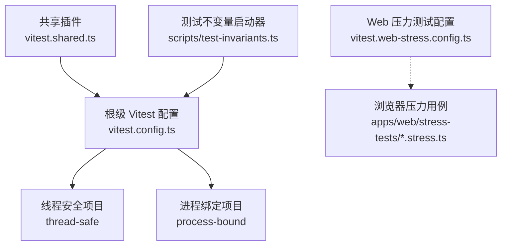
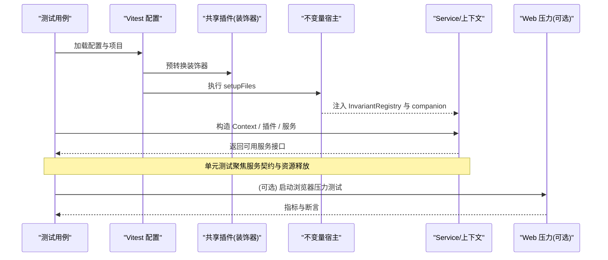
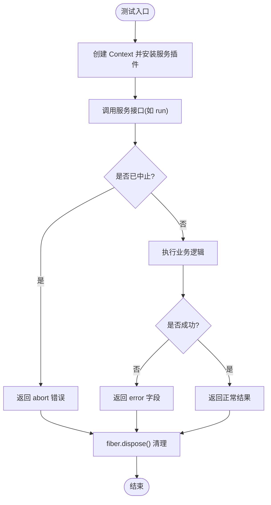
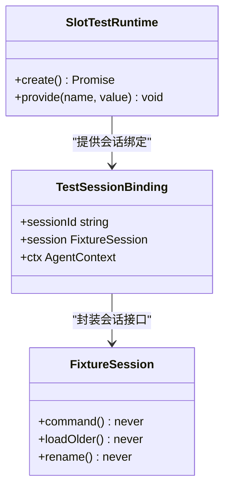
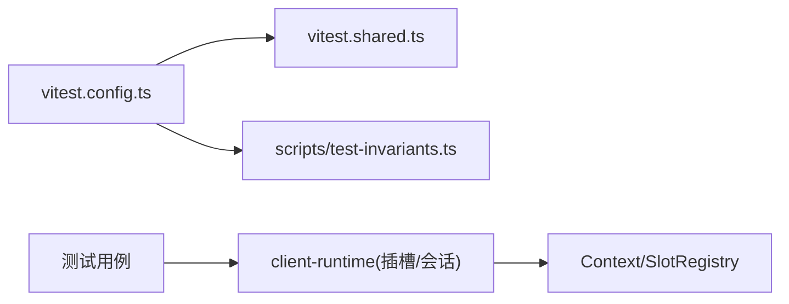

# 测试策略

<cite>
**本文引用的文件**
- [docs/testing.md](file://docs/testing.md)
- [docs/testing.zh.md](file://docs/testing.zh.md)
- [vitest.config.ts](file://vitest.config.ts)
- [vitest.shared.ts](file://vitest.shared.ts)
- [vitest.web-stress.config.ts](file://vitest.web-stress.config.ts)
- [scripts/test-invariants.ts](file://scripts/test-invariants.ts)
- [packages/code-runtime/code-runtime/tests/service.spec.ts](file://packages/code-runtime/code-runtime/tests/service.spec.ts)
- [apps/web/stress-tests/reasoning-chunks.stress.ts](file://apps/web/stress-tests/reasoning-chunks.stress.ts)
- [packages/test-support/README.md](file://packages/test-support/README.md)
- [packages/test-support/client-runtime/src/index.ts](file://packages/test-support/client-runtime/src/index.ts)
- [packages/test-support/client-runtime/src/sessions.ts](file://packages/test-support/client-runtime/src/sessions.ts)
- [apps/web/tests/scaffold.ts](file://apps/web/tests/scaffold.ts)
</cite>

## 目录
1. [简介](#简介)
2. [项目结构](#项目结构)
3. [核心组件](#核心组件)
4. [架构总览](#架构总览)
5. [详细组件分析](#详细组件分析)
6. [依赖关系分析](#依赖关系分析)
7. [性能考量](#性能考量)
8. [故障排查指南](#故障排查指南)
9. [结论](#结论)
10. [附录](#附录)

## 简介
本文件面向 Service 的测试策略，覆盖单元测试、集成测试、环境搭建与数据准备清理、性能与负载测试、覆盖率要求与最佳实践，以及常见场景（异步操作、错误处理、配置变更）的示例指引。内容基于仓库既有的测试分层、Vitest 配置、测试支撑包与示例用例进行系统化整理，确保读者既能快速上手，也能在复杂服务组合中保持可维护性与稳定性。

## 项目结构
仓库采用“按包组织”的结构，每个包的源码位于 packages/*/src，对应测试位于 packages/*/tests；应用层位于 apps/*，示例位于 examples/*；脚本与工具位于 scripts/*。测试框架统一使用 Vitest，并通过多配置文件区分不同运行环境（普通测试、Web 压力测试、快照等）。

图表来源
- [vitest.config.ts:117-159](file://vitest.config.ts#L117-L159)
- [vitest.shared.ts:15-42](file://vitest.shared.ts#L15-L42)
- [scripts/test-invariants.ts:158-209](file://scripts/test-invariants.ts#L158-L209)
- [vitest.web-stress.config.ts:5-14](file://vitest.web-stress.config.ts#L5-L14)

章节来源
- [docs/testing.md:7-15](file://docs/testing.md#L7-L15)
- [docs/testing.zh.md:7-13](file://docs/testing.zh.md#L7-L13)
- [vitest.config.ts:85-159](file://vitest.config.ts#L85-L159)
- [vitest.shared.ts:1-42](file://vitest.shared.ts#L1-L42)
- [vitest.web-stress.config.ts:1-15](file://vitest.web-stress.config.ts#L1-L15)

## 核心组件
- 测试分层与门禁
  - 单元测试：通过 vitest 运行各包 tests 与脚本 spec，强调 HMR 安全、边界与并发、契约回归。
  - 覆盖率门禁：对 packages/*/src 执行逐文件 100% 阈值，未覆盖行通常视为死代码需删除而非盲目补测。
  - 真实 API e2e：带密钥调用外部模型/服务，缺失密钥时自动跳过，保证 keyless CI 稳定。
  - 快照测试：无密钥预期输出固定传输与呈现行为，持久化日志固定后端组装行为。
  - Web 浏览器快照：Chromium 回放对比，CI 强制只读模式，本地记录与刷新需人工审查差异。
- 测试基础设施
  - 共享装饰器转换：vitest.shared.ts 提供标准 TypeScript 装饰器预转换，避免 Vite 解析冲突。
  - 测试不变量：scripts/test-invariants.ts 在每个测试根注入 InvariantRegistry 并挂载各包 companion，确保服务注册与生命周期约束在测试期生效。
  - 客户端运行时支撑：test-support/client-runtime 提供 SlotTestRuntime 与 provide 能力，便于为被测特性注入测试服务。

章节来源
- [docs/testing.md:7-15](file://docs/testing.md#L7-L15)
- [docs/testing.zh.md:7-13](file://docs/testing.zh.md#L7-L13)
- [vitest.shared.ts:15-42](file://vitest.shared.ts#L15-L42)
- [scripts/test-invariants.ts:158-209](file://scripts/test-invariants.ts#L158-L209)
- [packages/test-support/client-runtime/src/index.ts:217-244](file://packages/test-support/client-runtime/src/index.ts#L217-L244)
- [packages/test-support/README.md:1-19](file://packages/test-support/README.md#L1-L19)

## 架构总览
下图展示 Service 测试从用例到运行时的关键路径：用例通过 Vitest 加载，由共享插件预处理装饰器，setupFiles 启动不变量宿主，随后以 thread-safe 或 process-bound 项目池运行；Web 压力测试通过独立配置启用 Playwright 驱动浏览器。

图表来源
- [vitest.config.ts:117-159](file://vitest.config.ts#L117-L159)
- [vitest.shared.ts:15-42](file://vitest.shared.ts#L15-L42)
- [scripts/test-invariants.ts:158-209](file://scripts/test-invariants.ts#L158-L209)
- [vitest.web-stress.config.ts:5-14](file://vitest.web-stress.config.ts#L5-L14)

## 详细组件分析

### Service 单元测试：依赖模拟与上下文设置
- 使用 Context 与插件机制装配被测服务，最小实现 Stub 仅暴露必要方法，便于断言请求与副作用。
- 验证服务在 fiber dispose 后从 Context 移除，确保 HMR 安全与资源清理。
- 重复注册同一服务应被拒绝，防止上下文污染。
- 错误路径：run 失败以结果对象中的 error 字段返回，而非抛出异常；信号中止应返回 abort 类型错误。

图表来源
- [packages/code-runtime/code-runtime/tests/service.spec.ts:12-36](file://packages/code-runtime/code-runtime/tests/service.spec.ts#L12-L36)
- [packages/code-runtime/code-runtime/tests/service.spec.ts:55-86](file://packages/code-runtime/code-runtime/tests/service.spec.ts#L55-L86)

章节来源
- [packages/code-runtime/code-runtime/tests/service.spec.ts:1-89](file://packages/code-runtime/code-runtime/tests/service.spec.ts#L1-L89)

### 集成测试：服务间交互与依赖关系
- 通过 test-support/client-runtime 的 SlotTestRuntime 构建包含真实 Context、SlotRegistry 与渲染器的测试运行时，并以 provide 注入测试服务，隔离被测特性的外部依赖。
- 会话相关测试可使用 fixture 提供的 SessionBinding 与 FixtureSession，将命令、历史加载、重命名等操作替换为可控实现，从而验证服务组合下的交互流程。

图表来源
- [packages/test-support/client-runtime/src/index.ts:217-244](file://packages/test-support/client-runtime/src/index.ts#L217-L244)
- [packages/test-support/client-runtime/src/sessions.ts:117-158](file://packages/test-support/client-runtime/src/sessions.ts#L117-L158)

章节来源
- [packages/test-support/client-runtime/src/index.ts:217-244](file://packages/test-support/client-runtime/src/index.ts#L217-L244)
- [packages/test-support/client-runtime/src/sessions.ts:117-158](file://packages/test-support/client-runtime/src/sessions.ts#L117-L158)

### 测试环境与数据准备/清理
- 全局不变量：scripts/test-invariants.ts 在每个测试根启动 InvariantRegistry，并按测试所在包动态加载对应 companion，确保服务注册与生命周期约束在测试期生效。
- 资源管理：e2e 测试应在测试内创建 harness，并在 afterEach 中 dispose，即使失败/重试/超时也要释放；共享 fixture 放在普通 harness 文件中，避免重复注册导致真实 API 调用重复。
- Web 脚手架：apps/web/tests/scaffold.ts 提供 realizeSeedFixture 等工具，用于将模板中的占位符替换为实际值（如 sessionId、cwd），便于准备一致的测试数据。

章节来源
- [scripts/test-invariants.ts:158-209](file://scripts/test-invariants.ts#L158-L209)
- [docs/testing.md:27-35](file://docs/testing.md#L27-L35)
- [apps/web/tests/scaffold.ts:700-711](file://apps/web/tests/scaffold.ts#L700-L711)

### 性能测试与负载测试策略
- 浏览器压力测试：apps/web/stress-tests/reasoning-chunks.stress.ts 通过 Playwright 启动 Chromium，向页面注入大量推理分片，测量事件循环延迟与交互响应时间，验证长时间高吞吐下的 UI 响应性。
- 压力测试配置：vitest.web-stress.config.ts 单独定义 include 与超时，禁用文件并行，适合长耗时与资源密集的用例。
- 建议
  - 将压力测试与常规测试分离，仅在需要时显式运行。
  - 使用固定种子与回放输入，确保结果可复现。
  - 收集主线程阻塞与交互延迟指标，设定预算上限并断言。

章节来源
- [apps/web/stress-tests/reasoning-chunks.stress.ts:1-154](file://apps/web/stress-tests/reasoning-chunks.stress.ts#L1-L154)
- [vitest.web-stress.config.ts:1-15](file://vitest.web-stress.config.ts#L1-L15)

### 覆盖率要求与最佳实践
- 逐文件 100% 阈值：vitest.config.ts 对 statements、branches、functions、lines 均设为 100%，且 perFile 开启，确保大文件不会掩盖小文件的低覆盖。
- 排除策略：明确排除 types-only、bin/worker 入口、部分客户端 UI 债务区域、平台特定代码与 pwsh 不可用场景，避免误报。
- 报告：CI 下输出文本与自定义 reporter，本地额外生成 HTML 报告，便于定位未覆盖位置。
- 最佳实践
  - 优先覆盖边界情况、错误路径、事件顺序、并发竞态与契约回归。
  - 对于昂贵或非确定性边界（LLM 适配器、网络、时钟）才使用 mock，其余尽量走真实实现。
  - 使用真实入口路径（built lib）进行冒烟测试，避免 tsx 掩盖的问题。

章节来源
- [vitest.config.ts:160-283](file://vitest.config.ts#L160-L283)
- [docs/testing.md:21-35](file://docs/testing.md#L21-L35)

### 常见测试场景示例指引
- 异步操作
  - 使用 AbortController 触发中止，断言返回 abort 错误；或在等待过程中引入 vi.waitFor 与合理超时。
  - 参考路径：[packages/code-runtime/code-runtime/tests/service.spec.ts:66-72](file://packages/code-runtime/code-runtime/tests/service.spec.ts#L66-L72)
- 错误处理
  - 服务失败以结果对象中的 error 字段返回，不抛出异常；断言 error.kind 与 message。
  - 参考路径：[packages/code-runtime/code-runtime/tests/service.spec.ts:55-64](file://packages/code-runtime/code-runtime/tests/service.spec.ts#L55-L64)
- 配置变更
  - 通过 SlotTestRuntime.provide 注入测试服务或覆盖配置项，验证配置变化对行为的影响。
  - 参考路径：[packages/test-support/client-runtime/src/index.ts:232-244](file://packages/test-support/client-runtime/src/index.ts#L232-L244)

章节来源
- [packages/code-runtime/code-runtime/tests/service.spec.ts:55-72](file://packages/code-runtime/code-runtime/tests/service.spec.ts#L55-L72)
- [packages/test-support/client-runtime/src/index.ts:232-244](file://packages/test-support/client-runtime/src/index.ts#L232-L244)

## 依赖关系分析
- 测试配置依赖
  - vitest.config.ts 依赖 vitest.shared.ts 提供的装饰器转换与 execArgv 选项，确保测试进程行为一致。
  - setupFiles 指向 scripts/test-invariants.ts，使所有测试根具备不变量保障。
- 测试支撑包依赖
  - client-runtime 提供 SlotTestRuntime 与会话绑定，供前端特性与服务组合测试使用。
  - test-support README 汇总了各类支撑包角色，便于按需选用。

图表来源
- [vitest.config.ts:117-159](file://vitest.config.ts#L117-L159)
- [vitest.shared.ts:15-42](file://vitest.shared.ts#L15-L42)
- [scripts/test-invariants.ts:158-209](file://scripts/test-invariants.ts#L158-L209)
- [packages/test-support/client-runtime/src/index.ts:217-244](file://packages/test-support/client-runtime/src/index.ts#L217-L244)

章节来源
- [vitest.config.ts:117-159](file://vitest.config.ts#L117-L159)
- [vitest.shared.ts:15-42](file://vitest.shared.ts#L15-L42)
- [scripts/test-invariants.ts:158-209](file://scripts/test-invariants.ts#L158-L209)
- [packages/test-support/client-runtime/src/index.ts:217-244](file://packages/test-support/client-runtime/src/index.ts#L217-L244)
- [packages/test-support/README.md:1-19](file://packages/test-support/README.md#L1-L19)

## 性能考量
- 压力测试与常规测试分离：通过独立配置文件与 include 控制，避免拖慢日常开发体验。
- 指标采集：在主线程插入心跳采样与交互延迟测量，结合断言预算判断性能退化。
- 资源隔离：进程绑定测试与线程安全测试分项目运行，减少相互干扰。
- 回放与固定输入：使用 JSONL 与固定会话，确保性能回归可追踪。

章节来源
- [vitest.web-stress.config.ts:5-14](file://vitest.web-stress.config.ts#L5-L14)
- [apps/web/stress-tests/reasoning-chunks.stress.ts:46-154](file://apps/web/stress-tests/reasoning-chunks.stress.ts#L46-L154)
- [vitest.config.ts:124-159](file://vitest.config.ts#L124-L159)

## 故障排查指南
- 覆盖率门禁失败
  - 检查是否误排除了应覆盖的文件；确认 perFile 阈值与 exclude 列表是否符合预期。
  - 关注未覆盖位置报告，优先删除死代码而非盲目补测。
- 服务未正确释放
  - 确认 fiber.dispose() 被调用，且在 afterEach 中清理；HMR 安全测试应断言服务从 Context 移除。
- 浏览器压力测试不稳定
  - 检查 Playwright 启动参数与超时；确认页面就绪选择器与事件监听是否正确。
- 快照差异
  - 使用 record/refresh 更新预期输出前，务必逐项审查 diff；CI 强制只读模式，禁止自动写入。

章节来源
- [vitest.config.ts:160-283](file://vitest.config.ts#L160-L283)
- [packages/code-runtime/code-runtime/tests/service.spec.ts:74-86](file://packages/code-runtime/code-runtime/tests/service.spec.ts#L74-L86)
- [apps/web/stress-tests/reasoning-chunks.stress.ts:46-154](file://apps/web/stress-tests/reasoning-chunks.stress.ts#L46-L154)
- [docs/testing.md:11-15](file://docs/testing.md#L11-L15)

## 结论
本测试策略以分层测试为核心，配合严格的覆盖率门禁与快照机制，确保 Service 在单元、集成、端到端与性能层面均具备高质量保障。通过共享基础设施（装饰器转换、不变量宿主、客户端运行时支撑）与明确的资源管理约定，开发者可以高效编写稳定、可维护的测试。建议在新增服务时同步补充 HMR 安全、错误路径与契约回归用例，并在必要时扩展快照与压力测试，持续收紧质量门槛。

## 附录
- 常用命令
  - 单元测试：pnpm run test
  - 覆盖率门禁：pnpm run test:coverage
  - 真实 API e2e：pnpm run test:e2e
  - 快照测试：pnpm run test:snapshot / :record / :refresh
  - Web 浏览器快照：pnpm run test:web
  - 浏览器压力测试：使用 vitest.web-stress.config.ts 指定运行
- 参考路径
  - 测试分层与规则：[docs/testing.md:7-15](file://docs/testing.md#L7-L15)、[docs/testing.zh.md:7-13](file://docs/testing.zh.md#L7-L13)
  - Vitest 配置与覆盖率：[vitest.config.ts:117-283](file://vitest.config.ts#L117-L283)
  - 共享插件：[vitest.shared.ts:15-42](file://vitest.shared.ts#L15-L42)
  - 不变量宿主：[scripts/test-invariants.ts:158-209](file://scripts/test-invariants.ts#L158-L209)
  - 客户端运行时支撑：[packages/test-support/client-runtime/src/index.ts:217-244](file://packages/test-support/client-runtime/src/index.ts#L217-L244)
  - 压力测试用例：[apps/web/stress-tests/reasoning-chunks.stress.ts:46-154](file://apps/web/stress-tests/reasoning-chunks.stress.ts#L46-L154)