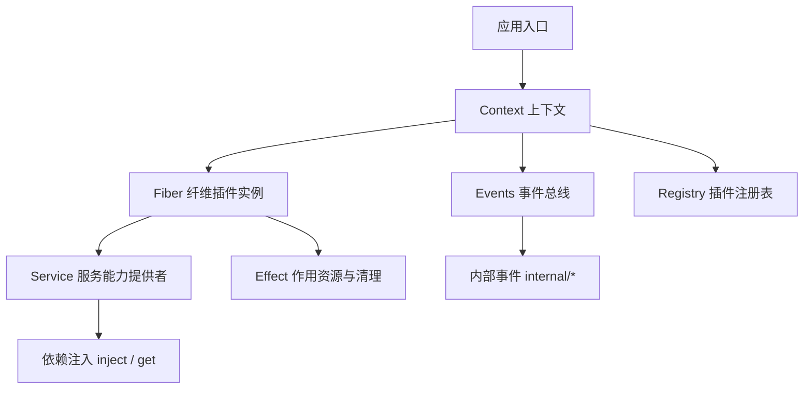
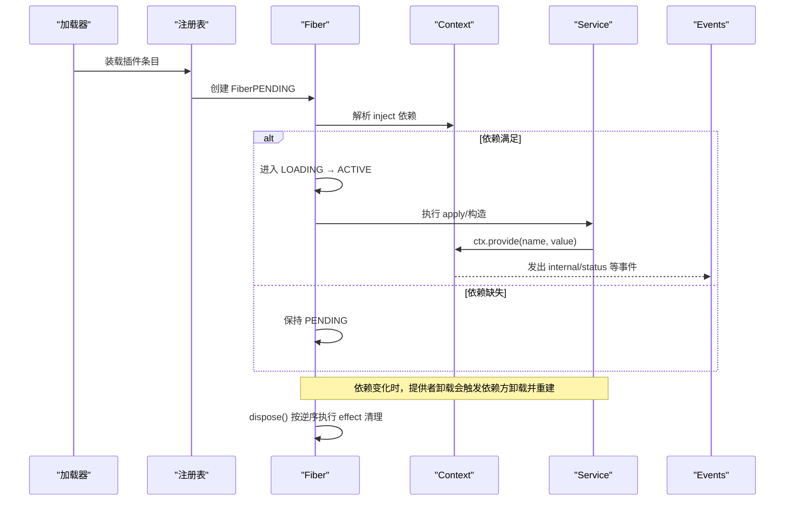
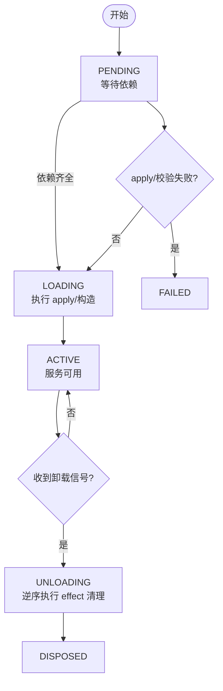
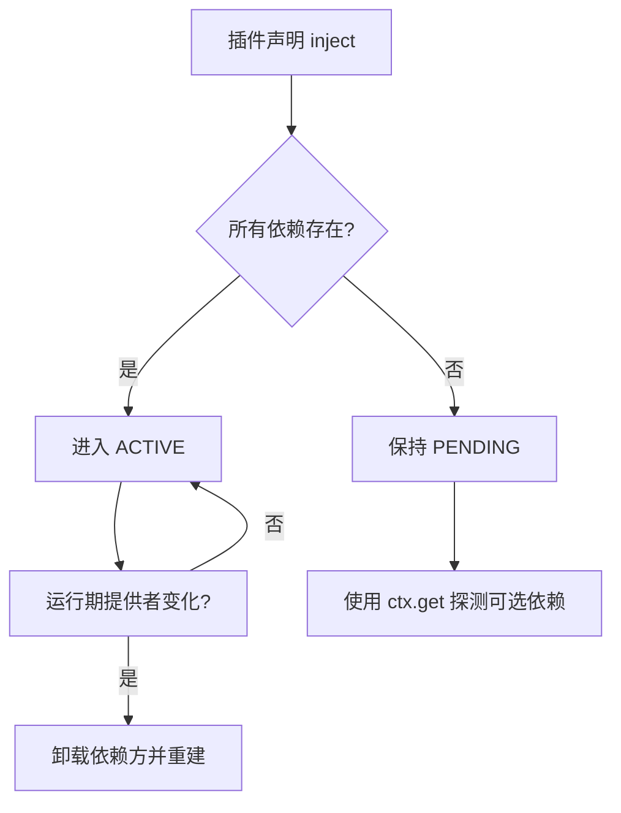
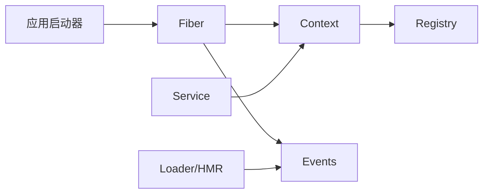

# 生命周期管理

<cite>
**本文引用的文件**
- [服务文档](file://docs/cordis-api/service.md)
- [上下文文档](file://docs/cordis-api/context.md)
- [纤维文档](file://docs/cordis-api/fiber.md)
- [事件文档](file://docs/cordis-api/events.md)
- [继承事件列表](file://docs/cordis-api/inherited.md)
- [教程：生命周期与效果](file://docs/cordis-tutorial/02-lifecycle-and-effects.md)
- [教程：服务](file://docs/cordis-tutorial/03-services.md)
- [教程：组合与热重载](file://docs/cordis-tutorial/06-composition-and-hmr.md)
- [注册表文档](file://docs/cordis-api/registry.md)
- [宿主运行器生命周期工具](file://packages/extensions/cordis-host-runner/src/lifecycle.ts)
- [工具检查辅助](file://packages/extensions/tool-cordis/src/inspect.ts)
- [插槽注入实现](file://packages/client/runtime/src/client/slots.ts)
- [应用启动诊断测试](file://packages/boot/app-boot/tests/app-boot.spec.ts)
</cite>

## 目录
1. [简介](#简介)
2. [项目结构](#项目结构)
3. [核心组件](#核心组件)
4. [架构总览](#架构总览)
5. [详细组件分析](#详细组件分析)
6. [依赖分析](#依赖分析)
7. [性能考虑](#性能考虑)
8. [故障排查指南](#故障排查指南)
9. [结论](#结论)
10. [附录](#附录)

## 简介
本文件围绕 Cordis 框架中的服务生命周期管理，系统阐述服务的启动、运行与销毁阶段，解释 effect（作用）机制如何自动清理资源并在依赖变化时触发重新加载；说明硬依赖与可选依赖的追踪方式；给出异步初始化与并发控制的实践建议；并总结生命周期事件的处理模式与调试技巧。目标是帮助开发者以最小心智负担构建健壮、可热重载、易排错的插件与服务体系。

## 项目结构
本节聚焦与生命周期相关的 API 与文档位置，便于快速定位源码与示例：
- 核心概念与 API 文档位于 docs/cordis-api 下，包括 Service、Context、Fiber、Events 等。
- 教程位于 docs/cordis-tutorial，涵盖生命周期、服务、组合与 HMR。
- 运行时与工具位于 packages 下，如宿主运行器的缺失依赖检测、插槽注入、诊断测试等。



图表来源
- [上下文文档:14-163](file://docs/cordis-api/context.md#L14-L163)
- [纤维文档:8-100](file://docs/cordis-api/fiber.md#L8-L100)
- [服务文档:25-103](file://docs/cordis-api/service.md#L25-L103)
- [事件文档:8-123](file://docs/cordis-api/events.md#L8-L123)

章节来源
- [上下文文档:14-163](file://docs/cordis-api/context.md#L14-L163)
- [纤维文档:8-100](file://docs/cordis-api/fiber.md#L8-L100)
- [服务文档:25-103](file://docs/cordis-api/service.md#L25-L103)
- [事件文档:8-123](file://docs/cordis-api/events.md#L8-L123)

## 核心组件
- Fiber（纤维）：每个插件实例的生命周期容器，负责状态机、配置校验、effect 收集与清理、重启与更新。
- Context（上下文）：服务解析、隔离范围、拦截配置、事件总线、反射层与插件注册表的统一入口。
- Service（服务）：以名称暴露能力的插件类基类，支持构造后初始化钩子、可用性判定、调用体扩展等。
- Events（事件）：提供 emit/parallel/serial/bail/waterfall 等多种分发模式，以及 on/once 监听注册。
- Registry（注册表）：插件装载、依赖声明 normalize、inject 解析与挂载。

章节来源
- [纤维文档:50-247](file://docs/cordis-api/fiber.md#L50-L247)
- [上下文文档:14-163](file://docs/cordis-api/context.md#L14-L163)
- [服务文档:25-103](file://docs/cordis-api/service.md#L25-L103)
- [事件文档:8-123](file://docs/cordis-api/events.md#L8-L123)
- [注册表文档:121-153](file://docs/cordis-api/registry.md#L121-L153)

## 架构总览
下图展示从插件装载到服务可用、再到依赖变更触发的重载流程，以及 effect 在卸载时的反向清理顺序。



图表来源
- [教程：生命周期与效果:68-95](file://docs/cordis-tutorial/02-lifecycle-and-effects.md#L68-L95)
- [教程：服务:59-79](file://docs/cordis-tutorial/03-services.md#L59-L79)
- [纤维文档:91-133](file://docs/cordis-api/fiber.md#L91-L133)
- [上下文文档:286-314](file://docs/cordis-api/context.md#L286-L314)
- [事件文档:8-123](file://docs/cordis-api/events.md#L8-L123)

## 详细组件分析

### 服务生命周期：启动、运行、销毁
- 启动阶段
  - Fiber 进入 PENDING，等待 inject 中声明的服务全部就绪。
  - 依赖满足后进入 LOADING，执行插件 apply 或 Service 构造，随后进入 ACTIVE。
  - 通过 ctx.provide 将服务暴露给同隔离域内的消费者。
- 运行阶段
  - 服务可通过 ctx.get 读取，或通过属性访问（由反射层代理）。
  - 依赖变化（提供者卸载/热替换）会触发依赖方卸载并重建，避免持有过期引用。
- 销毁阶段
  - fiber.dispose() 触发 UNLOADING → DISPOSED，按注册逆序执行所有 effect 清理。
  - 多个异步清理并发执行；如需顺序，应在同一 disposer 内 await。



图表来源
- [教程：生命周期与效果:68-95](file://docs/cordis-tutorial/02-lifecycle-and-effects.md#L68-L95)
- [纤维文档:91-133](file://docs/cordis-api/fiber.md#L91-L133)

章节来源
- [教程：生命周期与效果:68-95](file://docs/cordis-tutorial/02-lifecycle-and-effects.md#L68-L95)
- [教程：服务:59-79](file://docs/cordis-tutorial/03-services.md#L59-L79)
- [纤维文档:91-133](file://docs/cordis-api/fiber.md#L91-L133)

### Effect 机制与自动清理
- effect 的作用
  - 在 effect 体内获取外部资源（定时器、连接、监听器等），返回一个清理函数（disposer）。
  - 当 fiber 卸载或手动调用返回的 disposer 时，框架按逆序执行清理。
- 内置效应
  - ctx.on/once 注册的监听器、ctx.plugin 挂载的子插件、服务注册等均为 effect，随 fiber 卸载自动清理。
- 并发与顺序
  - 多个异步清理并发执行；若需严格顺序，请在单一 disposer 中串行 await。

```mermaid
sequenceDiagram
participant F as "Fiber"
participant E as "Effect 集合"
participant U as "用户代码"
U->>F : ctx.effect(() => { 获取资源; return 清理 })
F->>E : 收集 disposer
Note over F,E : 卸载时按逆序执行
F->>E : 逆序执行清理
```

图表来源
- [教程：生命周期与效果:84-95](file://docs/cordis-tutorial/02-lifecycle-and-effects.md#L84-L95)
- [纤维文档:276-313](file://docs/cordis-api/fiber.md#L276-L313)

章节来源
- [教程：生命周期与效果:84-95](file://docs/cordis-tutorial/02-lifecycle-and-effects.md#L84-L95)
- [纤维文档:276-313](file://docs/cordis-api/fiber.md#L276-L313)

### 依赖追踪：硬依赖与可选依赖
- 硬依赖（inject 数组/对象）
  - 声明式列出所需服务名；Fiber 在 PENDING 直到全部满足。
  - 运行期若提供者被卸载或热替换，依赖方将被卸载并重新加载，确保引用最新实现。
- 可选依赖（ctx.get）
  - 不声明 inject，使用 ctx.get('name') 按需探测；未提供时为 undefined，不影响插件加载。
- 缺失依赖诊断
  - 可通过工具函数查询某 Fiber 的 inject 中缺失的服务名，用于诊断“永远 PENDING”的问题。



图表来源
- [教程：服务:59-90](file://docs/cordis-tutorial/03-services.md#L59-L90)
- [宿主运行器生命周期工具:47-57](file://packages/extensions/cordis-host-runner/src/lifecycle.ts#L47-L57)
- [工具检查辅助:111-121](file://packages/extensions/tool-cordis/src/inspect.ts#L111-L121)

章节来源
- [教程：服务:59-90](file://docs/cordis-tutorial/03-services.md#L59-L90)
- [宿主运行器生命周期工具:47-57](file://packages/extensions/cordis-host-runner/src/lifecycle.ts#L47-L57)
- [工具检查辅助:111-121](file://packages/extensions/tool-cordis/src/inspect.ts#L111-L121)

### 服务状态管理与最佳实践
- 异步初始化
  - 在 effect 体内发起异步任务，并确保清理逻辑能取消或释放资源。
  - 使用 fiber.await() 等待当前生命周期工作完成并抛出启动错误。
- 并发控制
  - 多个异步清理并发执行；需要顺序时合并到单一 disposer。
  - 对长耗时操作（网络、I/O）建议使用节流/防抖工具，其计时器随 fiber 自动清理。
- 隔离与拦截
  - 使用 ctx.isolate 为特定服务建立独立作用域，避免互相影响。
  - 使用 ctx.intercept 为下游插件注入服务级拦截配置。
- 热重载（HMR）
  - 依赖驱动的加载与 effect 的自动清理使 HMR 能够安全地卸载旧实例并加载新代码。

章节来源
- [纤维文档:212-274](file://docs/cordis-api/fiber.md#L212-L274)
- [上下文文档:39-96](file://docs/cordis-api/context.md#L39-L96)
- [教程：组合与热重载:23-60](file://docs/cordis-tutorial/06-composition-and-hmr.md#L23-L60)

### 生命周期事件处理模式
- 常用事件
  - internal/status：Fiber 状态变更，可用于监控加载/卸载过程。
  - internal/plugin：插件 Fiber 创建。
  - internal/update：配置更新瀑布流，允许拦截或否决重启。
  - internal/get/set：服务读写拦截，用于审计或缓存。
  - hmr/change、hmr/reload：文件变更与热重载。
  - exit、loader/*：进程退出与加载器生命周期。
- 推荐用法
  - 使用 ctx.on/once 订阅事件，配合 effect 自动清理监听器。
  - 使用 waterfall 模式串联多个处理器，支持 next/veto。

章节来源
- [事件文档:8-123](file://docs/cordis-api/events.md#L8-L123)
- [继承事件列表:23-40](file://docs/cordis-api/inherited.md#L23-L40)

### 调试技巧
- 诊断“永远 PENDING”
  - 遍历注册表中的 Fiber，筛选 state === PENDING 的项，打印其 name 与缺失依赖。
  - 使用 missingServices 工具直接获取缺失的服务名列表。
- 查看 effects 树
  - 通过 fiber.getEffects() 获取当前已注册 effect 的诊断树，定位资源泄漏或未清理的监听器。
- 启动失败报告
  - 应用启动时会格式化激活失败的条目，包含无栈错误与未解析服务的提示。

章节来源
- [教程：组合与热重载:61-110](file://docs/cordis-tutorial/06-composition-and-hmr.md#L61-L110)
- [宿主运行器生命周期工具:47-57](file://packages/extensions/cordis-host-runner/src/lifecycle.ts#L47-L57)
- [工具检查辅助:111-121](file://packages/extensions/tool-cordis/src/inspect.ts#L111-L121)
- [应用启动诊断测试:487-526](file://packages/boot/app-boot/tests/app-boot.spec.ts#L487-L526)

## 依赖分析
- 组件耦合
  - Fiber 强依赖 Context 进行服务解析与事件分发；Service 通过 Context 暴露能力。
  - Events 贯穿生命周期事件，供调试与扩展点使用。
- 外部集成点
  - Loader/HMR 通过事件驱动插件重载；应用启动器通过 fiber.await 聚合启动结果。
- 循环依赖规避
  - 通过 inject 声明硬依赖，避免模块级导入造成的循环；运行期通过 ctx.get 做可选依赖探测。



图表来源
- [上下文文档:14-163](file://docs/cordis-api/context.md#L14-L163)
- [纤维文档:8-100](file://docs/cordis-api/fiber.md#L8-L100)
- [事件文档:8-123](file://docs/cordis-api/events.md#L8-L123)

章节来源
- [上下文文档:14-163](file://docs/cordis-api/context.md#L14-L163)
- [纤维文档:8-100](file://docs/cordis-api/fiber.md#L8-L100)
- [事件文档:8-123](file://docs/cordis-api/events.md#L8-L123)

## 性能考虑
- 避免在 effect 中执行阻塞同步操作；将耗时任务放入异步流程并妥善清理。
- 合理使用节流/防抖减少高频回调带来的开销，其计时器随 fiber 自动释放。
- 谨慎使用全局事件广播，优先采用服务接口或局部作用域通信。
- 利用隔离（isolate）与拦截（intercept）降低跨插件副作用。

[本节为通用指导，无需具体文件来源]

## 故障排查指南
- 症状：插件始终 PENDING
  - 检查 inject 是否声明了不存在的服务；使用 missingServices 工具输出缺失项。
  - 确认提供者是否正确注册且处于 ACTIVE。
- 症状：热重载后行为异常
  - 确认 effect 清理是否完整；必要时在单一 disposer 中串行 await 保证顺序。
  - 使用 internal/status 事件观察 Fiber 状态转换。
- 症状：启动失败但无堆栈
  - 应用启动器会汇总激活失败的条目信息；根据提示定位问题插件与原因。

章节来源
- [宿主运行器生命周期工具:47-57](file://packages/extensions/cordis-host-runner/src/lifecycle.ts#L47-L57)
- [应用启动诊断测试:487-526](file://packages/boot/app-boot/tests/app-boot.spec.ts#L487-L526)
- [继承事件列表:23-40](file://docs/cordis-api/inherited.md#L23-L40)

## 结论
通过 Fiber 的状态机、Context 的服务解析与隔离、Service 的能力暴露、Events 的全局协作以及 effect 的自动清理，Cordis 提供了完整的生命周期管理能力。借助 inject 的硬依赖与 ctx.get 的可选依赖，结合 HMR 与内部事件，开发者可以构建稳定、可观测、可热重载的服务体系。遵循本文的最佳实践与调试方法，可有效降低复杂性并提升可维护性。

[本节为总结，无需具体文件来源]

## 附录
- 关键 API 速查
  - 启动/等待：fiber.await()、fiber.update()、fiber.restart()
  - 资源管理：ctx.effect()、fiber.getEffects()
  - 服务存取：ctx.provide()、ctx.get()、ctx.set()
  - 作用域：ctx.isolate()、ctx.intercept()
  - 事件：ctx.emit/parallel/serial/bail/waterfall、ctx.on/once
- 相关文档路径
  - 服务：docs/cordis-api/service.md
  - 上下文：docs/cordis-api/context.md
  - 纤维：docs/cordis-api/fiber.md
  - 事件：docs/cordis-api/events.md
  - 继承事件：docs/cordis-api/inherited.md
  - 教程：docs/cordis-tutorial/02-lifecycle-and-effects.md、03-services.md、06-composition-and-hmr.md

[本节为索引，无需具体文件来源]