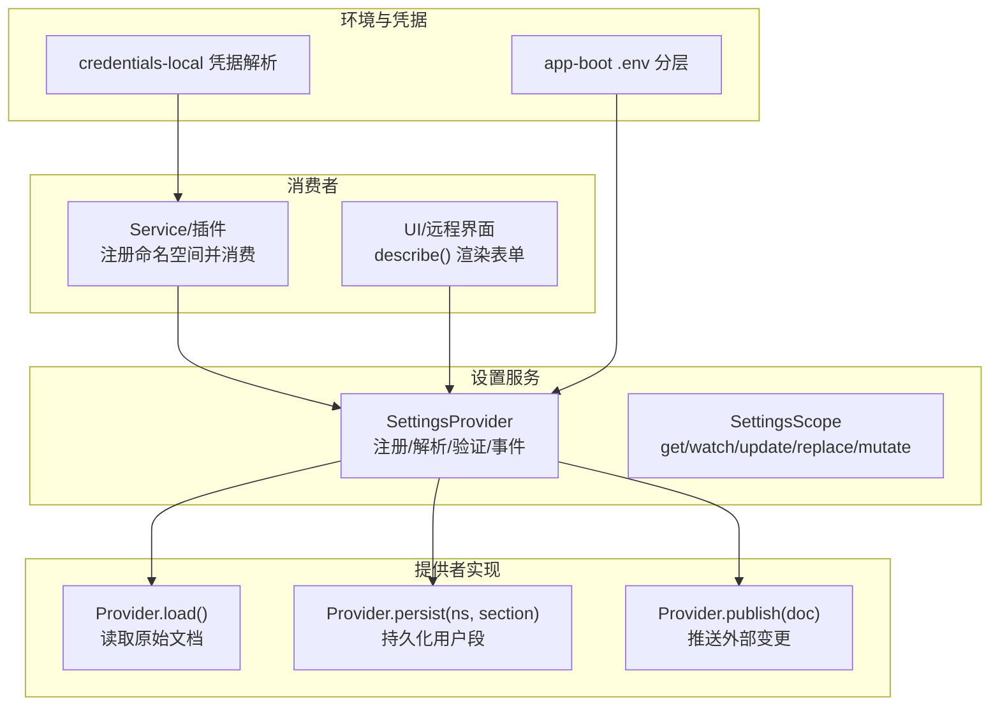
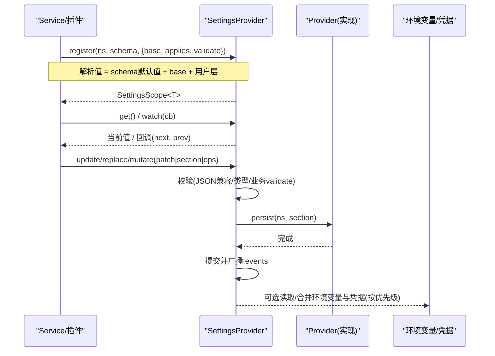
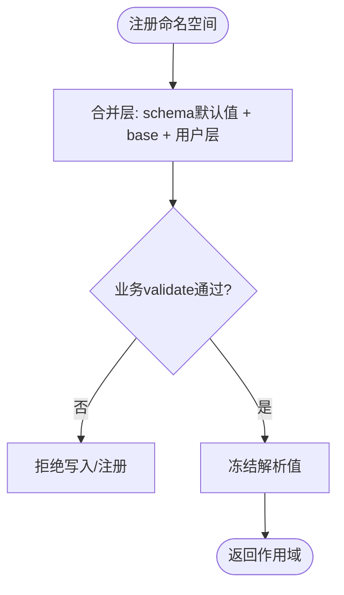
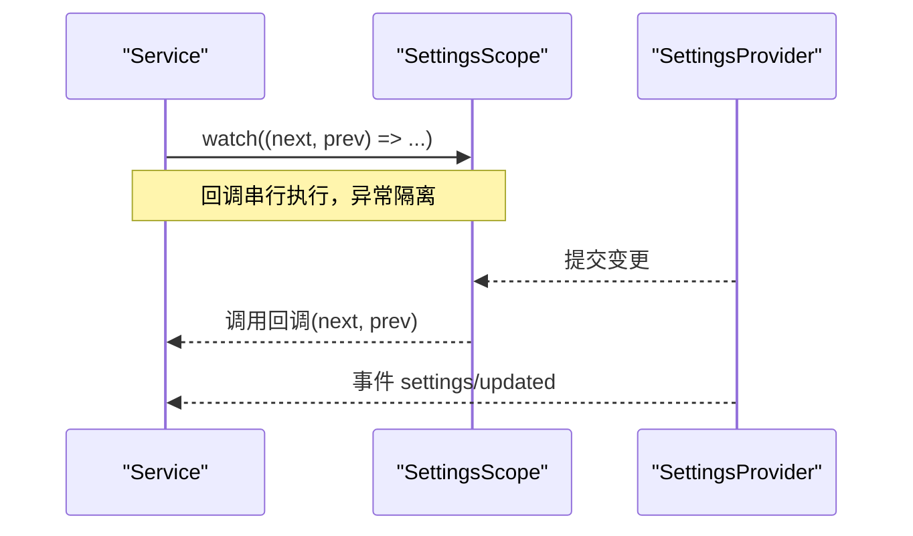
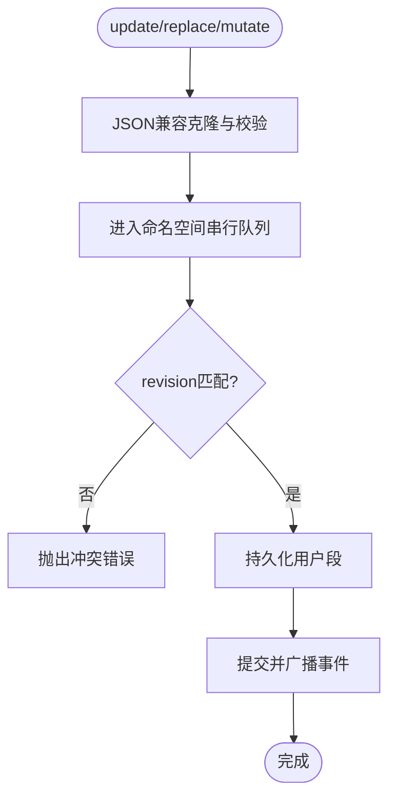
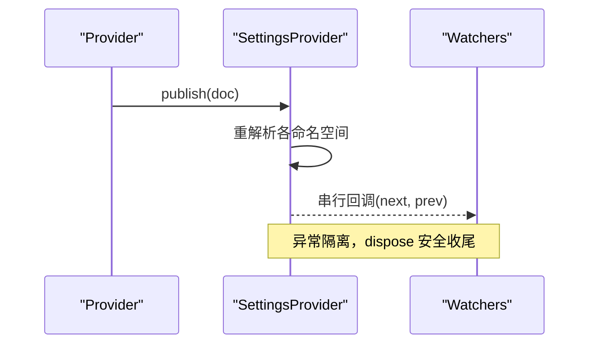
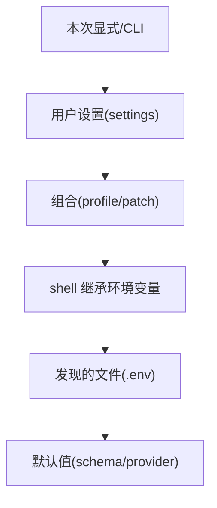
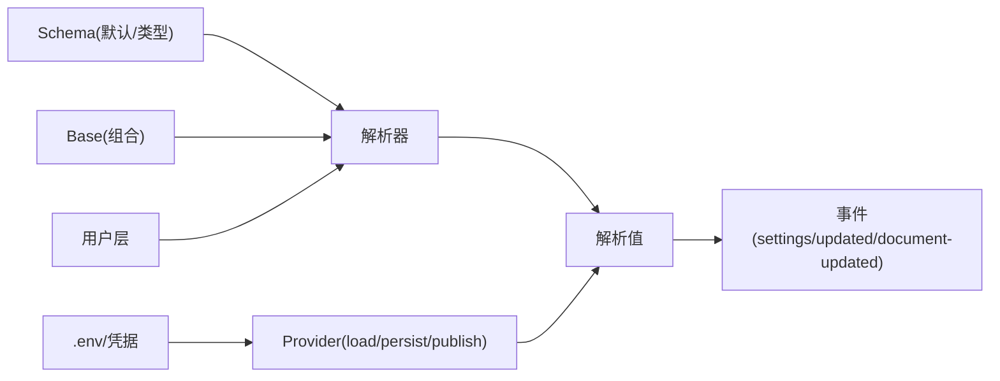

# 配置管理

<cite>
**本文引用的文件**
- [packages/settings/settings/src/index.ts](file://packages/settings/settings/src/index.ts)
- [packages/settings/settings/src/types.ts](file://packages/settings/settings/src/types.ts)
- [packages/settings/settings/src/invariant.ts](file://packages/settings/settings/src/invariant.ts)
- [docs/subsystems/settings.md](file://docs/subsystems/settings.md)
- [docs/subsystems/settings.zh.md](file://docs/subsystems/settings.zh.md)
- [packages/boot/app-boot/src/index.ts](file://packages/boot/app-boot/src/index.ts)
- [scripts/verify-config-source-ownership.ts](file://scripts/verify-config-source-ownership.ts)
- [packages/credentials/credentials-local/src/index.ts](file://packages/credentials/credentials-local/src/index.ts)
- [apps/cli/src/profile-boot.ts](file://apps/cli/src/profile-boot.ts)
- [packages/client/hmr/src/client/index.ts](file://packages/client/hmr/src/client/index.ts)
</cite>

## 目录
1. [简介](#简介)
2. [项目结构](#项目结构)
3. [核心组件](#核心组件)
4. [架构总览](#架构总览)
5. [详细组件分析](#详细组件分析)
6. [依赖关系分析](#依赖关系分析)
7. [性能考量](#性能考量)
8. [故障排除指南](#故障排除指南)
9. [结论](#结论)
10. [附录](#附录)

## 简介
本文件面向在 Service 中读取与响应配置变更的开发者，系统性说明：
- 如何在 Service 中注册命名空间、读取解析后的配置、监听并安全地响应运行时更新。
- 配置验证与默认值处理机制（schema 默认值、组合 base、用户层）。
- 环境变量集成方式与优先级规则，以及敏感信息的安全处理。
- 配置的动态更新机制与运行时刷新策略。
- 配置模块化组织与命名规范。
- 配置错误的诊断与排错方法。
- 最佳实践与安全注意事项。

## 项目结构
配置系统由“设置服务抽象”和“提供者实现”组成：
- 设置服务抽象提供命名空间注册、解析、验证、变更事件与持久化编排。
- 提供者负责加载/持久化原始文档，并将外部变更推入服务。
- 客户端/主机侧通过描述接口获取 schema、当前值与可写能力，用于 UI 或远程写入。
- 环境变量与凭据子系统提供独立的来源与优先级，确保启动期与运行期的安全与一致性。

图表来源
- [packages/settings/settings/src/index.ts:350-800](file://packages/settings/settings/src/index.ts#L350-L800)
- [packages/settings/settings/src/types.ts:1-51](file://packages/settings/settings/src/types.ts#L1-L51)
- [packages/boot/app-boot/src/index.ts:130-164](file://packages/boot/app-boot/src/index.ts#L130-L164)
- [packages/credentials/credentials-local/src/index.ts:296-331](file://packages/credentials/credentials-local/src/index.ts#L296-L331)

章节来源
- [packages/settings/settings/src/index.ts:350-800](file://packages/settings/settings/src/index.ts#L350-L800)
- [packages/settings/settings/src/types.ts:1-51](file://packages/settings/settings/src/types.ts#L1-L51)
- [docs/subsystems/settings.md:1-311](file://docs/subsystems/settings.md#L1-L311)
- [docs/subsystems/settings.zh.md:1-59](file://docs/subsystems/settings.zh.md#L1-L59)

## 核心组件
- SettingsProvider（抽象服务）
  - 负责命名空间注册、解析（schema 默认值 → base → 用户层）、验证、变更检测、持久化编排与事件发布。
  - 提供 describe/get/update/replace/mutate/publish 等能力。
- SettingsScope（命名空间作用域）
  - 暴露 get/watch/update/replace 给 Service 使用；watch 回调串行执行，保证顺序与稳定性。
- 事件与不变式
  - settings/updated：当解析值发生深相等变化时发出，附带来源标记。
  - settings/document-updated：当原始用户段发生变化时发出（即使解析值未变），供 UI 感知覆盖状态与修订号。
  - invariant 检查确保事件与权威值一致。

章节来源
- [packages/settings/settings/src/index.ts:350-800](file://packages/settings/settings/src/index.ts#L350-L800)
- [packages/settings/settings/src/types.ts:15-51](file://packages/settings/settings/src/types.ts#L15-L51)
- [packages/settings/settings/src/invariant.ts:17-49](file://packages/settings/settings/src/invariant.ts#L17-L49)
- [docs/subsystems/settings.md:155-162](file://docs/subsystems/settings.md#L155-L162)

## 架构总览
下图展示 Service 从注册到读取、观察与更新的完整流程，以及与提供者、环境/凭据的关系。

图表来源
- [packages/settings/settings/src/index.ts:435-648](file://packages/settings/settings/src/index.ts#L435-L648)
- [packages/settings/settings/src/types.ts:15-51](file://packages/settings/settings/src/types.ts#L15-L51)
- [packages/credentials/credentials-local/src/index.ts:296-331](file://packages/credentials/credentials-local/src/index.ts#L296-L331)

## 详细组件分析

### 命名空间注册与解析
- 命名空间标识：小写 kebab-case 的品牌类型，避免与其他 ID 混淆。
- 解析顺序：schema 默认值 → 组合 base → 用户层。
- 自定义验证：validate 在 schema 接纳后运行，可表达跨字段约束；失败会拒绝写入或在注册阶段失败。
- 生效时机：applies 为 'live' 或 'restart'，后者通常不订阅 watch，仅构造时读取一次。

图表来源
- [packages/settings/settings/src/index.ts:696-710](file://packages/settings/settings/src/index.ts#L696-L710)
- [docs/subsystems/settings.md:18-59](file://docs/subsystems/settings.md#L18-L59)

章节来源
- [packages/settings/settings/src/index.ts:350-512](file://packages/settings/settings/src/index.ts#L350-L512)
- [docs/subsystems/settings.md:18-59](file://docs/subsystems/settings.md#L18-L59)
- [docs/subsystems/settings.zh.md:1-59](file://docs/subsystems/settings.zh.md#L1-L59)

### 读取与监听配置变更
- 读取：通过 SettingsScope.get() 获取当前解析值。
- 监听：watch(callback) 以串行方式接收 next/prev，异常被隔离并记录。
- 事件：settings/updated 仅在解析值发生深相等变化时触发；settings/document-updated 对原始用户段变化更敏感，适合 UI 感知覆盖状态。

图表来源
- [packages/settings/settings/src/index.ts:457-470](file://packages/settings/settings/src/index.ts#L457-L470)
- [packages/settings/settings/src/index.ts:748-799](file://packages/settings/settings/src/index.ts#L748-L799)
- [packages/settings/settings/src/types.ts:15-51](file://packages/settings/settings/src/types.ts#L15-L51)

章节来源
- [packages/settings/settings/src/index.ts:457-470](file://packages/settings/settings/src/index.ts#L457-L470)
- [packages/settings/settings/src/index.ts:748-799](file://packages/settings/settings/src/index.ts#L748-L799)
- [packages/settings/settings/src/types.ts:15-51](file://packages/settings/settings/src/types.ts#L15-L51)

### 写入与冲突控制
- 写入模式：
  - update：合并补丁到用户层。
  - replace：整体替换用户层，缺失键回退到 base/schema 默认值。
  - mutate：路径级 set/unset 操作，适合持有部分视图（如脱敏描述）的调用方。
- 数据校验：仅允许 JSON 兼容数据，非 JSON 类型会在持久化前拒绝。
- 并发与冲突：每命名空间串行队列；支持 expectedRevision 冲突检测，避免基于过期快照的覆盖。

图表来源
- [packages/settings/settings/src/index.ts:534-648](file://packages/settings/settings/src/index.ts#L534-L648)

章节来源
- [packages/settings/settings/src/index.ts:534-648](file://packages/settings/settings/src/index.ts#L534-L648)

### 动态更新与运行时刷新
- 外部变更：Provider.publish(doc) 将外部编辑推入，重新解析每个命名空间，保持最后有效值并告警无效段。
- 观察者：watch 回调串行执行，dispose 后不再启动新调用，已排队调用跳过，已启动调用继续直至结束。
- HMR/热更新：客户端模块重载先失效再预取，避免旧工厂导致的重复注册或竞态。

图表来源
- [packages/settings/settings/src/index.ts:657-684](file://packages/settings/settings/src/index.ts#L657-L684)
- [packages/settings/settings/src/index.ts:748-799](file://packages/settings/settings/src/index.ts#L748-L799)
- [packages/client/hmr/src/client/index.ts:104-116](file://packages/client/hmr/src/client/index.ts#L104-L116)

章节来源
- [packages/settings/settings/src/index.ts:657-684](file://packages/settings/settings/src/index.ts#L657-L684)
- [packages/settings/settings/src/index.ts:748-799](file://packages/settings/settings/src/index.ts#L748-L799)
- [packages/client/hmr/src/client/index.ts:104-116](file://packages/client/hmr/src/client/index.ts#L104-L116)

### 环境变量集成与优先级
- 非凭据值的统一优先级（从高到低）：
  - 本次显式参数 > 操作级覆盖/CLI > 用户设置(settings.yaml) > 组合(profile bundles/patch overlays) > 本次 shell 继承的环境变量 > 发现的.env文件(项目cwd/.env, $DSH_HOME/.env) > 默认值(schema/provider)。
- 凭据采用独立且更窄的优先级：
  - 继承进程环境变量(只读且最高) > $DSH_HOME/.credentials.yaml(可写) > <invocation cwd>/.env > $DSH_HOME/.env。
- 启动期 .env 解析会拒绝引导专用变量名，防止误用。

图表来源
- [.agents/notes/implemented/architecture/2026-08-04-configuration-source-ownership.md:17-39](file://.agents/notes/implemented/architecture/2026-08-04-configuration-source-ownership.md#L17-L39)
- [packages/boot/app-boot/src/index.ts:130-164](file://packages/boot/app-boot/src/index.ts#L130-L164)
- [packages/credentials/credentials-local/src/index.ts:296-331](file://packages/credentials/credentials-local/src/index.ts#L296-L331)

章节来源
- [packages/boot/app-boot/src/index.ts:130-164](file://packages/boot/app-boot/src/index.ts#L130-L164)
- [packages/credentials/credentials-local/src/index.ts:296-331](file://packages/credentials/credentials-local/src/index.ts#L296-L331)
- [.agents/notes/implemented/architecture/2026-08-04-configuration-source-ownership.md:17-39](file://.agents/notes/implemented/architecture/2026-08-04-configuration-source-ownership.md#L17-L39)

### 配置模块化与命名规范
- 命名空间：小写 kebab-case，作为插件所有分段的唯一标识。
- 模块化：每个插件/子系统的配置应通过独立命名空间声明 schema 与 base，便于组合与测试。
- 组合 base：将不可变或共享默认放入 base，用户层仅覆盖差异。
- 描述接口：describe() 输出 schema/value/base/user/applies/revisions，驱动 UI 渲染与远端写入。

章节来源
- [packages/settings/settings/src/index.ts:19-31](file://packages/settings/settings/src/index.ts#L19-L31)
- [packages/settings/settings/src/index.ts:472-512](file://packages/settings/settings/src/index.ts#L472-L512)
- [docs/subsystems/settings.md:96-153](file://docs/subsystems/settings.md#L96-L153)

### 敏感信息与脱敏
- 描述接口支持 redactSecrets：移除 role('secret') 字段并在 secrets 中列出位置，供 UI 渲染只写输入而不泄露密钥。
- 禁止在 shipped 配置中内联凭据或端点，必须通过 ctx.credentials 与环境快照解析。

章节来源
- [packages/settings/settings/src/index.ts:92-100](file://packages/settings/settings/src/index.ts#L92-L100)
- [scripts/verify-config-source-ownership.ts:25-56](file://scripts/verify-config-source-ownership.ts#L25-L56)

## 依赖关系分析
- SettingsProvider 依赖：
  - Context/Service/Cordis 事件与生命周期。
  - schemastery schema 进行类型与默认值解析。
  - Provider 实现 load/persist/publish 以对接存储与外部变更。
- 事件契约：
  - settings/updated 与 settings/document-updated 由 provider 统一发出，invariant 检查保障一致性。
- 环境与凭据：
  - app-boot 负责 .env 分层与引导保护。
  - credentials-local 提供凭据解析与可写性描述。

图表来源
- [packages/settings/settings/src/index.ts:696-710](file://packages/settings/settings/src/index.ts#L696-L710)
- [packages/settings/settings/src/types.ts:15-51](file://packages/settings/settings/src/types.ts#L15-L51)
- [packages/boot/app-boot/src/index.ts:130-164](file://packages/boot/app-boot/src/index.ts#L130-L164)
- [packages/credentials/credentials-local/src/index.ts:296-331](file://packages/credentials/credentials-local/src/index.ts#L296-L331)

章节来源
- [packages/settings/settings/src/index.ts:696-710](file://packages/settings/settings/src/index.ts#L696-L710)
- [packages/settings/settings/src/types.ts:15-51](file://packages/settings/settings/src/types.ts#L15-L51)

## 性能考量
- 解析值冻结：每次提交的解析值会被深冻结，避免意外修改与提升比较效率。
- 串行回调：watch 回调串行执行，避免并发竞争与乱序问题。
- 序列化写入：每命名空间维护写队列，失败不会污染后续写入。
- 最小化事件：settings/updated 仅在解析值深相等变化时发出，减少不必要通知。

章节来源
- [packages/settings/settings/src/index.ts:307-312](file://packages/settings/settings/src/index.ts#L307-L312)
- [packages/settings/settings/src/index.ts:748-799](file://packages/settings/settings/src/index.ts#L748-L799)
- [packages/settings/settings/src/index.ts:577-648](file://packages/settings/settings/src/index.ts#L577-L648)

## 故障排除指南
- 常见错误与定位
  - 命名空间未注册：访问 get/update 时报错，确认已在 fiber effect 中注册。
  - 只读提供者：update/replace/mutate 抛出不允许写入的错误，检查提供者 writable 标志。
  - 非 JSON 数据：写入前校验失败，检查对象/数组是否包含 Date/Map/循环引用等。
  - 冲突错误：expectedRevision 不匹配，重新读取 descriptor 的 revision 并重试。
  - 无效用户段：publish 时保留最后有效值并告警，检查外部编辑的文档格式。
- 事件不一致
  - invariant 检查会捕获 settings/updated 与权威值不一致的情况，排查自定义监听器逻辑。
- 环境变量问题
  - 引导专用变量不得出现在 .env 文件中，否则会启动期报错。
  - 凭据优先于普通环境变量，若期望被覆盖，请调整来源层级。

章节来源
- [packages/settings/settings/src/index.ts:577-648](file://packages/settings/settings/src/index.ts#L577-L648)
- [packages/settings/settings/src/index.ts:657-684](file://packages/settings/settings/src/index.ts#L657-L684)
- [packages/settings/settings/src/invariant.ts:17-49](file://packages/settings/settings/src/invariant.ts#L17-L49)
- [packages/boot/app-boot/src/index.ts:130-164](file://packages/boot/app-boot/src/index.ts#L130-L164)

## 结论
该配置体系通过“命名空间 + schema + base + 用户层”的分层模型，结合严格的校验、串行化写入与事件机制，实现了：
- 安全的运行时配置更新与热重载。
- 清晰的环境变量与凭据优先级。
- 对敏感信息的脱敏与审计。
- 可扩展的模块化配置组织。
遵循本文的最佳实践与排错建议，可在复杂系统中稳定地管理 Service 配置。

## 附录
- 推荐实践
  - 将可调参数全部暴露为配置字段，避免硬编码。
  - 使用 validate 表达跨字段约束，尽早拒绝非法配置。
  - 对外部编辑保持容错：无效段保留最后有效值并告警。
  - 使用 describe({ redactSecrets: true }) 暴露 UI 所需的最小信息。
  - 通过 expectedRevision 避免并发覆盖。
- 相关入口
  - CLI 启动与用户 patch 监听：apps/cli/src/profile-boot.ts
  - 设置服务抽象与事件：packages/settings/settings/src/index.ts, types.ts
  - 环境变量与凭据：packages/boot/app-boot/src/index.ts, packages/credentials/credentials-local/src/index.ts

章节来源
- [apps/cli/src/profile-boot.ts:285-290](file://apps/cli/src/profile-boot.ts#L285-L290)
- [packages/settings/settings/src/index.ts:350-800](file://packages/settings/settings/src/index.ts#L350-L800)
- [packages/settings/settings/src/types.ts:15-51](file://packages/settings/settings/src/types.ts#L15-L51)
- [packages/boot/app-boot/src/index.ts:130-164](file://packages/boot/app-boot/src/index.ts#L130-L164)
- [packages/credentials/credentials-local/src/index.ts:296-331](file://packages/credentials/credentials-local/src/index.ts#L296-L331)