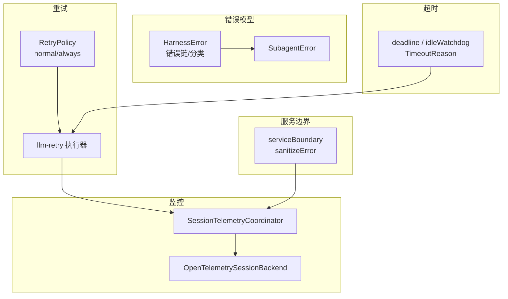
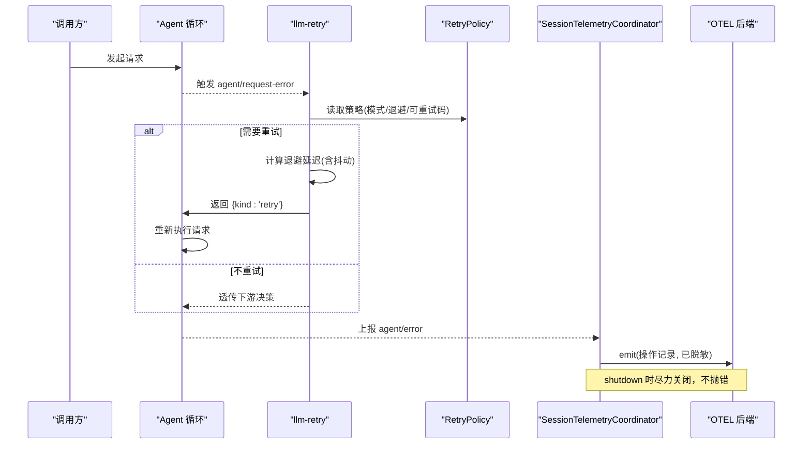
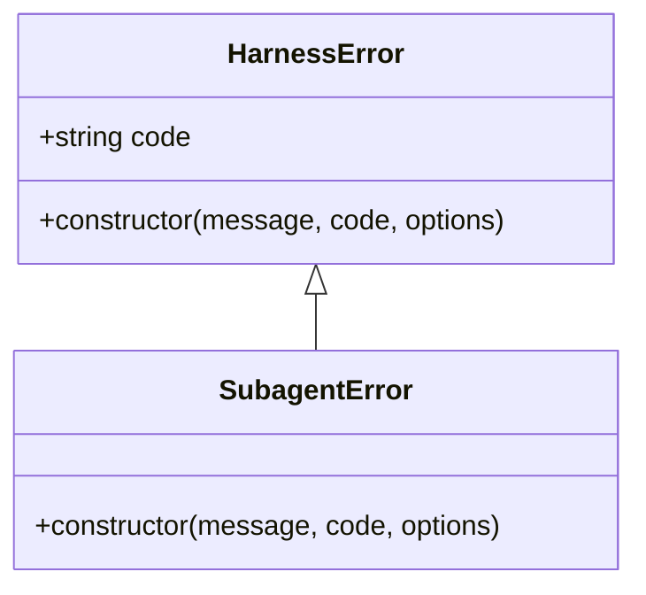
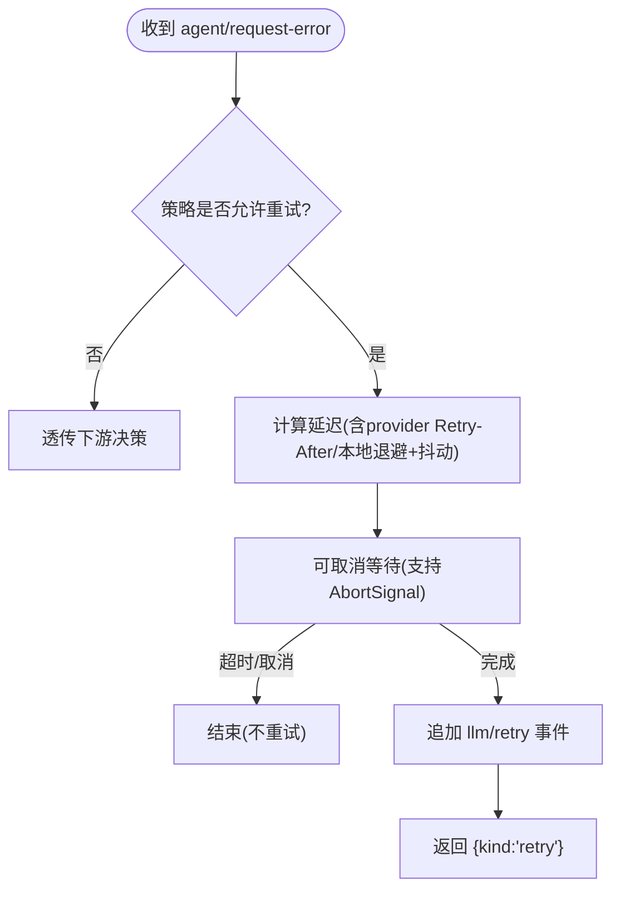
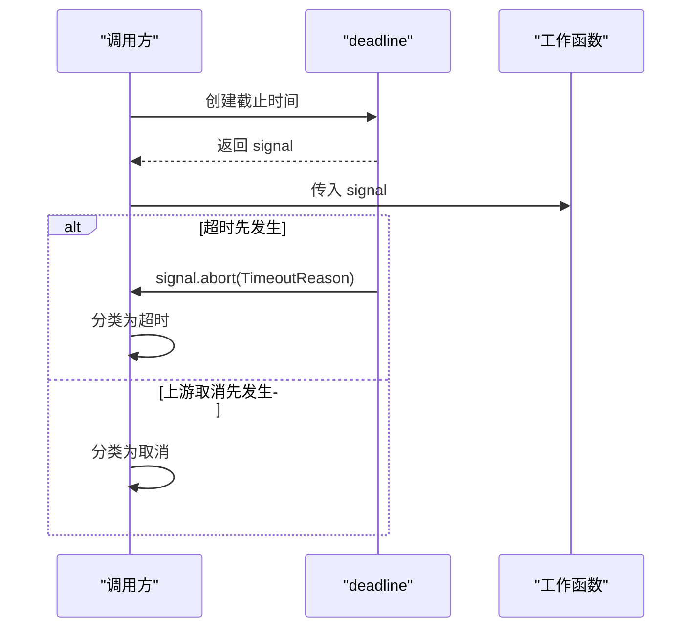
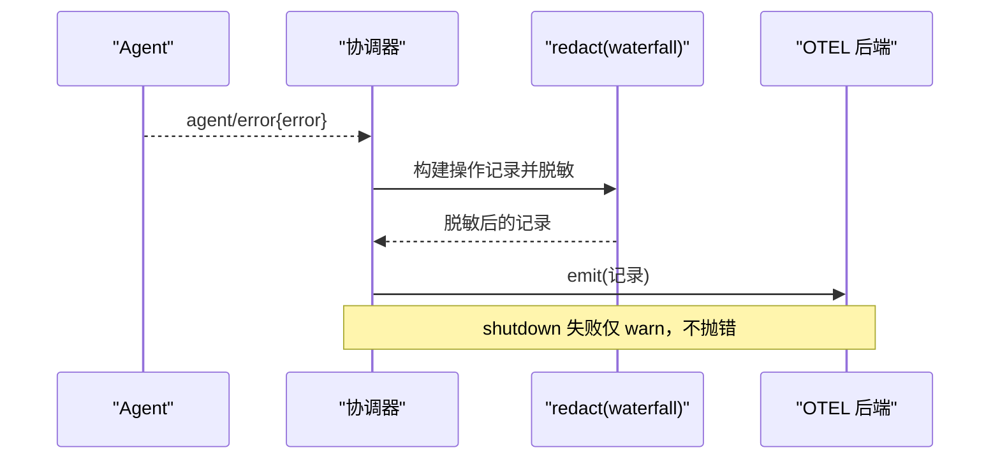
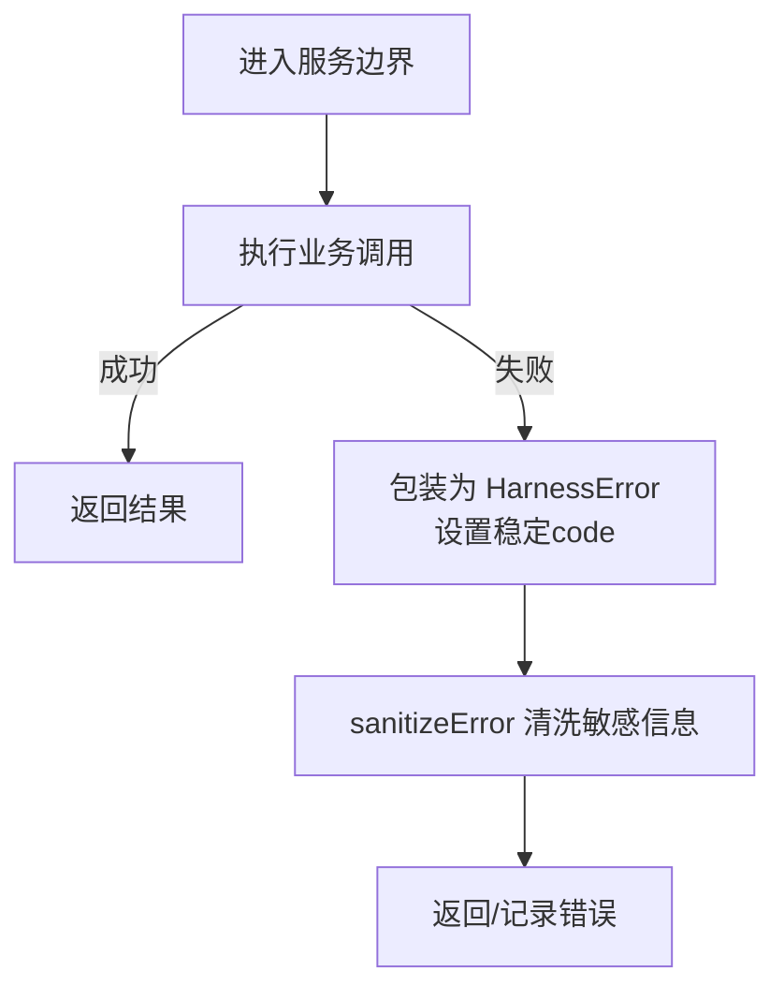
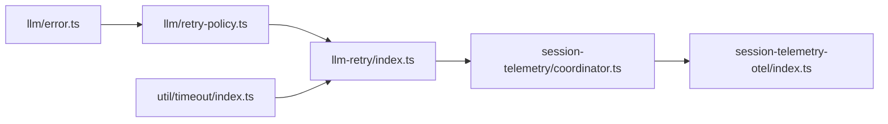

# 错误处理

<cite>
**本文引用的文件**
- [packages/llm/llm/src/error.ts](file://packages/llm/llm/src/error.ts)
- [packages/llm/llm/src/retry-policy.ts](file://packages/llm/llm/src/retry-policy.ts)
- [packages/llm/llm-retry/src/index.ts](file://packages/llm/llm-retry/src/index.ts)
- [packages/session/session-telemetry/src/coordinator.ts](file://packages/session/session-telemetry/src/coordinator.ts)
- [packages/session/session-telemetry/src/index.ts](file://packages/session/session-telemetry/src/index.ts)
- [packages/session/session-telemetry-otel/src/index.ts](file://packages/session/session-telemetry-otel/src/index.ts)
- [packages/util/timeout/src/index.ts](file://packages/util/timeout/src/index.ts)
- [packages/subagent/subagent/src/error.ts](file://packages/subagent/subagent/src/error.ts)
- [packages/session-query/tool-session-query/src/service-boundary.ts](file://packages/session-query/tool-session-query/src/service-boundary.ts)
- [packages/api/gateway/tests/gateway.host.spec.ts](file://packages/api/gateway/tests/gateway.host.spec.ts)
- [packages/core/agent-loop/tests/request-error.spec.ts](file://packages/core/agent-loop/tests/request-error.spec.ts)
</cite>

## 目录
1. [简介](#简介)
2. [项目结构](#项目结构)
3. [核心组件](#核心组件)
4. [架构总览](#架构总览)
5. [详细组件分析](#详细组件分析)
6. [依赖关系分析](#依赖关系分析)
7. [性能考量](#性能考量)
8. [故障排查指南](#故障排查指南)
9. [结论](#结论)
10. [附录](#附录)

## 简介
本文件聚焦服务级别的错误处理，覆盖异常捕获与传播、同步与异步错误处理、错误日志与监控集成、重试机制（指数退避与熔断式保护）、服务降级与容错设计、错误恢复与自愈能力，以及测试与模拟策略。文档基于仓库中 LLM 请求重试、会话遥测采集、超时控制、统一错误基类等关键实现进行说明，帮助读者在不深入源码的情况下理解整体设计与最佳实践。

## 项目结构
围绕错误处理的关键模块分布如下：
- 统一错误模型与工具：LLM 包提供基础错误类型、错误链渲染与分类；子代理等扩展其错误体系。
- 重试策略与执行：LLM 包定义重试策略配置与解析；llm-retry 插件在 agent 循环的“请求错误”扩展点执行重试。
- 超时与取消：util/timeout 提供统一的截止时间信号、空闲看门狗与超时原因识别。
- 监控与可观测性：session-telemetry 协调器订阅会话事件与 agent/error，将错误以操作记录上报；OTEL 后端负责实际导出。
- 服务边界与降级：session-query 的服务边界对错误进行安全渲染与转换，避免泄露敏感信息。

**图示来源**
- [packages/llm/llm/src/error.ts:1-164](file://packages/llm/llm/src/error.ts#L1-L164)
- [packages/llm/llm/src/retry-policy.ts:1-192](file://packages/llm/llm/src/retry-policy.ts#L1-L192)
- [packages/llm/llm-retry/src/index.ts:1-227](file://packages/llm/llm-retry/src/index.ts#L1-L227)
- [packages/util/timeout/src/index.ts:1-191](file://packages/util/timeout/src/index.ts#L1-L191)
- [packages/session/session-telemetry/src/coordinator.ts:1-320](file://packages/session/session-telemetry/src/coordinator.ts#L1-L320)
- [packages/session/session-telemetry-otel/src/index.ts:141-168](file://packages/session/session-telemetry-otel/src/index.ts#L141-L168)
- [packages/subagent/subagent/src/error.ts:1-16](file://packages/subagent/subagent/src/error.ts#L1-L16)
- [packages/session-query/tool-session-query/src/service-boundary.ts:143-179](file://packages/session-query/tool-session-query/src/service-boundary.ts#L143-L179)

**章节来源**
- [packages/llm/llm/src/error.ts:1-164](file://packages/llm/llm/src/error.ts#L1-L164)
- [packages/llm/llm/src/retry-policy.ts:1-192](file://packages/llm/llm/src/retry-policy.ts#L1-L192)
- [packages/llm/llm-retry/src/index.ts:1-227](file://packages/llm/llm-retry/src/index.ts#L1-L227)
- [packages/util/timeout/src/index.ts:1-191](file://packages/util/timeout/src/index.ts#L1-L191)
- [packages/session/session-telemetry/src/coordinator.ts:1-320](file://packages/session/session-telemetry/src/coordinator.ts#L1-L320)
- [packages/session/session-telemetry-otel/src/index.ts:141-168](file://packages/session/session-telemetry-otel/src/index.ts#L141-L168)
- [packages/subagent/subagent/src/error.ts:1-16](file://packages/subagent/subagent/src/error.ts#L1-L16)
- [packages/session-query/tool-session-query/src/service-boundary.ts:143-179](file://packages/session-query/tool-session-query/src/service-boundary.ts#L143-L179)

## 核心组件
- 统一错误基类与工具
  - HarnessError：携带稳定机器码 code 与 cause 链，便于路由与诊断。
  - errorChain：安全渲染错误链，包含 AggregateError 成员，避免泄露敏感数据。
  - isContextWindowExceededError/isQuotaExceededError：按 provider 文本模式识别上下文溢出与配额耗尽。
- 重试策略与执行
  - RetryPolicyConfig：支持 normal（有限次重试）与 always（无界重试直到成功/取消/销毁）。
  - resolveRetryPolicy：校验并冻结策略，内置默认退避参数与可重试代码集。
  - llm-retry：在 agent 的 request-error 扩展点拦截失败，按策略计算延迟、写入会话事件、决定是否重试。
- 超时与取消
  - deadline/idleWatchdog：通过 AbortSignal 传递超时与取消，区分上游取消与本地超时。
  - TimeoutReason：携带能力级 code 与超时时长，供上层分类处理。
- 监控与可观测性
  - SessionTelemetryCoordinator：订阅 session/event 与 agent/error，投影为操作记录，经 redact 后交给后端。
  - OpenTelemetrySessionBackend：根据模式启用或禁用上报，shutdown 时尽力完成清理。
- 服务边界与降级
  - serviceBoundary：调用封装与错误清洗，确保对外暴露的错误不包含内部细节。

**章节来源**
- [packages/llm/llm/src/error.ts:1-164](file://packages/llm/llm/src/error.ts#L1-L164)
- [packages/llm/llm/src/retry-policy.ts:1-192](file://packages/llm/llm/src/retry-policy.ts#L1-L192)
- [packages/llm/llm-retry/src/index.ts:1-227](file://packages/llm/llm-retry/src/index.ts#L1-L227)
- [packages/util/timeout/src/index.ts:1-191](file://packages/util/timeout/src/index.ts#L1-L191)
- [packages/session/session-telemetry/src/coordinator.ts:1-320](file://packages/session/session-telemetry/src/coordinator.ts#L1-L320)
- [packages/session/session-telemetry-otel/src/index.ts:141-168](file://packages/session/session-telemetry-otel/src/index.ts#L141-L168)
- [packages/session-query/tool-session-query/src/service-boundary.ts:143-179](file://packages/session-query/tool-session-query/src/service-boundary.ts#L143-L179)

## 架构总览
下图展示了从服务抛出错误到重试、监控与最终上报的端到端流程。

**图示来源**
- [packages/llm/llm-retry/src/index.ts:156-227](file://packages/llm/llm-retry/src/index.ts#L156-L227)
- [packages/llm/llm/src/retry-policy.ts:145-192](file://packages/llm/llm/src/retry-policy.ts#L145-L192)
- [packages/session/session-telemetry/src/coordinator.ts:103-126](file://packages/session/session-telemetry/src/coordinator.ts#L103-L126)
- [packages/session/session-telemetry-otel/src/index.ts:141-168](file://packages/session/session-telemetry-otel/src/index.ts#L141-L168)

## 详细组件分析

### 统一错误模型与工具
- 设计要点
  - 所有 HarnessError 子类携带稳定 code，用于程序化路由（如 RATE_LIMIT、QUOTA、CONTEXT_WINDOW_EXCEEDED），而非解析 message。
  - errorChain 安全拼接 cause 链与 AggregateError 成员，遇到不可渲染值回退为占位符，防止崩溃与泄露。
  - 提供针对上下文溢出与配额耗尽的模式匹配函数，便于上层快速分类。
- 使用建议
  - 在服务边界处将原始异常包装为 HarnessError 并设置合适 code。
  - 对外展示或日志输出使用 errorChain，但业务逻辑判断必须基于 code。

**图示来源**
- [packages/llm/llm/src/error.ts:13-22](file://packages/llm/llm/src/error.ts#L13-L22)
- [packages/subagent/subagent/src/error.ts:9-15](file://packages/subagent/subagent/src/error.ts#L9-L15)

**章节来源**
- [packages/llm/llm/src/error.ts:1-164](file://packages/llm/llm/src/error.ts#L1-L164)
- [packages/subagent/subagent/src/error.ts:1-16](file://packages/subagent/subagent/src/error.ts#L1-L16)

### 重试策略与执行（指数退避与熔断式保护）
- 策略解析
  - normal：限定最大重试次数与可重试代码集合，适合大多数外部依赖。
  - always：无界重试直到成功/取消/销毁，适用于幂等且可恢复的请求。
  - 退避参数：initialDelayMs、maxDelayMs、jitterRatio，均受上限约束并冻结对象。
- 执行流程
  - 监听 agent/request-error，若策略允许则追加 llm/retry 事件，等待可取消延迟后返回 retry。
  - 尊重 provider 的 Retry-After 头（在 maxDelayMs 限制内），否则采用本地指数退避加抖动。
  - 生命周期管理：插件 dispose 时中止所有活跃重试并等待完成。
- 熔断式保护
  - 通过 maxRetries 与 retryableCodes 限制重试范围，避免雪崩。
  - always 模式下也受信号取消与插件生命周期保护，不会无限阻塞。

**图示来源**
- [packages/llm/llm-retry/src/index.ts:111-208](file://packages/llm/llm-retry/src/index.ts#L111-L208)
- [packages/llm/llm/src/retry-policy.ts:117-192](file://packages/llm/llm/src/retry-policy.ts#L117-L192)

**章节来源**
- [packages/llm/llm/src/retry-policy.ts:1-192](file://packages/llm/llm/src/retry-policy.ts#L1-L192)
- [packages/llm/llm-retry/src/index.ts:1-227](file://packages/llm/llm-retry/src/index.ts#L1-L227)

### 超时与取消（同步/异步错误处理）
- 设计要点
  - deadline：融合上游取消与本地超时，返回 AbortSignal 与清理器；超时原因携带 TimeoutReason(code, timeoutMs)。
  - idleWatchdog：仅在迭代器 next 期间计时，避免消费侧空闲被误判为超时。
  - timeoutOf：从 signal.reason 或任意载体提取 TimeoutReason，支持按 code 精确匹配。
- 使用建议
  - 所有长耗时 I/O 都应接收并响应 AbortSignal，避免泄漏资源。
  - 在调用链顶层用 deadline 包裹，并在各层用 timeoutOf 区分“谁导致超时”。

**图示来源**
- [packages/util/timeout/src/index.ts:91-113](file://packages/util/timeout/src/index.ts#L91-L113)
- [packages/util/timeout/src/index.ts:126-173](file://packages/util/timeout/src/index.ts#L126-L173)
- [packages/util/timeout/src/index.ts:184-191](file://packages/util/timeout/src/index.ts#L184-L191)

**章节来源**
- [packages/util/timeout/src/index.ts:1-191](file://packages/util/timeout/src/index.ts#L1-L191)

### 监控集成与错误日志（不泄露敏感数据）
- 采集路径
  - 协调器订阅 session/event 与 agent/error，将错误转为 agent-error 操作记录。
  - 每条记录经过 redact（waterfall 规则）后再交付后端，确保敏感字段被过滤。
  - 会话结束时自动上报 shutdown 标记；后端 shutdown 失败仅告警，不影响应用退出。
- 上报后端
  - OTEL 后端根据模式启用/禁用上报；DISABLED 模式仅记录警告，避免静默丢失反馈。
- 最佳实践
  - 不要在错误消息中直接包含密钥、令牌、用户隐私等敏感信息。
  - 使用稳定的 code 与结构化 attributes 进行检索与告警，message 仅用于人类可读。

**图示来源**
- [packages/session/session-telemetry/src/coordinator.ts:103-126](file://packages/session/session-telemetry/src/coordinator.ts#L103-L126)
- [packages/session/session-telemetry/src/coordinator.ts:228-247](file://packages/session/session-telemetry/src/coordinator.ts#L228-L247)
- [packages/session/session-telemetry-otel/src/index.ts:141-168](file://packages/session/session-telemetry-otel/src/index.ts#L141-L168)

**章节来源**
- [packages/session/session-telemetry/src/coordinator.ts:1-320](file://packages/session/session-telemetry/src/coordinator.ts#L1-L320)
- [packages/session/session-telemetry/src/index.ts:47-178](file://packages/session/session-telemetry/src/index.ts#L47-L178)
- [packages/session/session-telemetry-otel/src/index.ts:141-168](file://packages/session/session-telemetry-otel/src/index.ts#L141-L168)

### 服务降级与容错设计
- 服务边界
  - serviceBoundary 对调用进行封装，并将错误转换为安全的 HarnessError，同时提供 sanitizeError 用于对外展示。
  - 全量错误渲染 fullError 会捕获异常并回退为固定占位，避免内部堆栈泄露。
- 降级策略
  - 当外部依赖不稳定时，优先使用 normal 重试策略限制影响面。
  - 对非幂等或代价高的操作，结合超时与取消尽快失败，减少资源占用。
  - 在网关/接口层对客户端取消（cancelled）进行识别，避免将用户取消误报为内部错误。

**图示来源**
- [packages/session-query/tool-session-query/src/service-boundary.ts:143-179](file://packages/session-query/tool-session-query/src/service-boundary.ts#L143-L179)
- [packages/api/gateway/tests/gateway.host.spec.ts:1027-1047](file://packages/api/gateway/tests/gateway.host.spec.ts#L1027-L1047)

**章节来源**
- [packages/session-query/tool-session-query/src/service-boundary.ts:143-179](file://packages/session-query/tool-session-query/src/service-boundary.ts#L143-L179)
- [packages/api/gateway/tests/gateway.host.spec.ts:1027-1047](file://packages/api/gateway/tests/gateway.host.spec.ts#L1027-L1047)

### 错误恢复与自愈能力
- 自愈路径
  - 通过 agent/request-error 扩展点集中处理失败，配合重试策略实现自动恢复。
  - 对于 always 模式，只要未取消/未销毁，将持续尝试直至成功。
  - 插件生命周期保证在 dispose 时中止所有活跃重试，避免僵尸任务。
- 恢复策略选择
  - 瞬时错误（RATE_LIMIT、SERVER、TIMEOUT、TRANSPORT、EMPTY_RESPONSE）适合重试。
  - 非瞬时错误（INVALID_CREDENTIAL、QUOTA）不应重试，应快速失败并提示修复。

**章节来源**
- [packages/llm/llm-retry/src/index.ts:156-227](file://packages/llm/llm-retry/src/index.ts#L156-L227)
- [packages/llm/llm/src/retry-policy.ts:14-24](file://packages/llm/llm/src/retry-policy.ts#L14-L24)

### 测试方法与模拟策略
- 单元测试
  - 使用 mock 适配器模拟不同错误（如 rate_limit、server_error、service_unavailable），验证重试行为与状态机。
  - 通过注入 random 钩子使退避抖动可预测，确保时序相关断言稳定。
- 端到端测试
  - 在 agent-loop 测试中验证不同错误码下的重试次数、事件顺序与取消优先级。
  - 在 gateway 测试中验证客户端取消场景下，业务错误不被误报为内部故障。
- 模拟要点
  - 构造 Provider 错误时附带 providerRetryAfterMs，验证重试延迟是否遵循该值与 maxDelayMs 限制。
  - 验证 telemetry 在 DISABLED 模式下仅记录警告，不产生网络开销。

**章节来源**
- [packages/core/agent-loop/tests/request-error.spec.ts:74-111](file://packages/core/agent-loop/tests/request-error.spec.ts#L74-L111)
- [packages/test-support/llm-mock-server/src/index.ts:500-713](file://packages/test-support/llm-mock-server/src/index.ts#L500-L713)
- [packages/session/session-telemetry-otel/src/index.ts:141-168](file://packages/session/session-telemetry-otel/src/index.ts#L141-L168)

## 依赖关系分析
- 耦合与内聚
  - llm-retry 依赖 retry-policy 的策略解析与 backoff 参数，低耦合高内聚。
  - 遥测协调器与后端解耦，通过 Sink 接口抽象，便于替换实现。
- 外部依赖
  - 超时库提供统一的 AbortSignal 语义，避免各组件重复造轮子。
  - OTEL 后端可选加载，DISABLED 模式保持最小依赖。
- 潜在循环依赖
  - 当前实现通过事件总线与扩展点解耦，未发现直接循环导入。

**图示来源**
- [packages/llm/llm/src/error.ts:1-164](file://packages/llm/llm/src/error.ts#L1-L164)
- [packages/llm/llm/src/retry-policy.ts:1-192](file://packages/llm/llm/src/retry-policy.ts#L1-L192)
- [packages/llm/llm-retry/src/index.ts:1-227](file://packages/llm/llm-retry/src/index.ts#L1-L227)
- [packages/util/timeout/src/index.ts:1-191](file://packages/util/timeout/src/index.ts#L1-L191)
- [packages/session/session-telemetry/src/coordinator.ts:1-320](file://packages/session/session-telemetry/src/coordinator.ts#L1-L320)
- [packages/session/session-telemetry-otel/src/index.ts:141-168](file://packages/session/session-telemetry-otel/src/index.ts#L141-L168)

**章节来源**
- [packages/llm/llm/src/retry-policy.ts:1-192](file://packages/llm/llm/src/retry-policy.ts#L1-L192)
- [packages/llm/llm-retry/src/index.ts:1-227](file://packages/llm/llm-retry/src/index.ts#L1-L227)
- [packages/session/session-telemetry/src/coordinator.ts:1-320](file://packages/session/session-telemetry/src/coordinator.ts#L1-L320)

## 性能考量
- 重试退避
  - 指数退避结合抖动降低突发流量；maxDelayMs 限制最大等待时间，避免长时间阻塞。
  - 尊重 provider 的 Retry-After，减少无效重试。
- 监控开销
  - 遥测协调器对 assistant/chunk 做首块投影，减少冗余上报。
  - backend.shutdown 失败仅告警，避免拖慢应用退出。
- 超时控制
  - idleWatchdog 仅在迭代器 next 期间计时，避免空闲期误触发。
  - deadline 使用 AbortSignal.any 保留首个触发原因，便于精准分类。

[本节为通用指导，无需特定文件来源]

## 故障排查指南
- 常见问题定位
  - 确认错误 code 是否为可重试类型；非可重试错误应立即失败并提示修复。
  - 检查是否设置了 providerRetryAfterMs，并确保不超过策略的 maxDelayMs。
  - 验证是否在正确位置监听了 agent/request-error，并返回正确的 RequestErrorAction。
- 日志与监控
  - 查看 agent-error 操作记录，关注 error.name、turn、step 等属性。
  - 在 DISABLED 模式下，注意 feedback/record 的警告日志，确认上报被关闭。
- 超时与取消
  - 使用 timeoutOf 区分超时与上游取消，避免误判。
  - 确保所有长耗时操作都监听 AbortSignal 并及时终止。

**章节来源**
- [packages/session/session-telemetry/src/coordinator.ts:228-247](file://packages/session/session-telemetry/src/coordinator.ts#L228-L247)
- [packages/session/session-telemetry-otel/src/index.ts:141-168](file://packages/session/session-telemetry-otel/src/index.ts#L141-L168)
- [packages/util/timeout/src/index.ts:184-191](file://packages/util/timeout/src/index.ts#L184-L191)

## 结论
本仓库通过统一错误模型、可配置的重试策略、标准化的超时与取消、以及健壮的遥测采集，构建了完整的服务级错误处理体系。实践中应：
- 以稳定 code 驱动路由与告警，避免解析 message。
- 合理选择 normal/always 模式，并结合退避与抖动控制负载。
- 在服务边界清洗错误，杜绝敏感信息泄露。
- 利用 agent/request-error 与遥测事件实现自动化恢复与可观测性。
- 通过测试与模拟验证重试、取消与降级路径的正确性。

[本节为总结性内容，无需特定文件来源]

## 附录
- 术语
  - 指数退避：重试间隔按指数增长，叠加随机抖动以避免同步风暴。
  - 熔断式保护：通过最大重试次数与可重试码集合限制影响面。
  - 服务降级：在依赖不可用时提供降级行为，保障核心功能可用。
- 参考实现路径
  - 错误模型：packages/llm/llm/src/error.ts
  - 重试策略：packages/llm/llm/src/retry-policy.ts
  - 重试执行：packages/llm/llm-retry/src/index.ts
  - 超时控制：packages/util/timeout/src/index.ts
  - 监控采集：packages/session/session-telemetry/src/coordinator.ts
  - OTEL 后端：packages/session/session-telemetry-otel/src/index.ts
  - 服务边界：packages/session-query/tool-session-query/src/service-boundary.ts

[本节为补充信息，无需特定文件来源]